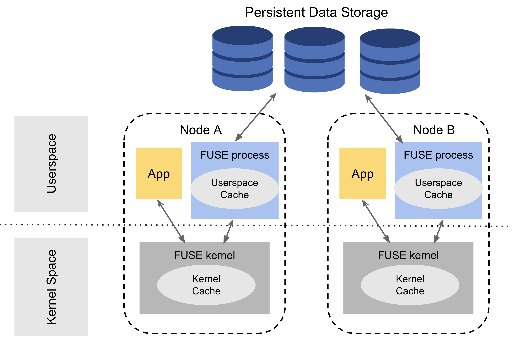

# 背景

## Alluxio Fuse原理

Alluxio Fuse允许在特定的存储服务（例如S3，HDFS）中安装训练数据集到本地文件系统，并提供缓存能力来加速I/O访问经常使用的数据。当应用程序对本地FUSE挂载点运行操作时，请求将依次由FUSE内核、Alluxio Fuse进程和存储处理。如果在任何级别上启用了缓存，并且命中了缓存，缓存的元数据/数据将返回到应用程序，而无需执行整个过程，以提高整体读取性能。

因此，使用Alluxio Fuse可以实现挂载特定的文件存储系统到本地路径，使得读取数据就如同在本地文件系统一样，并大幅加速读取速度。

## 本地缓存与分布式缓存

下面列出了两种解决方案之间的差异，请根据培训要求和可用资源选择所需的解决方案。

| 类别             | 本地单节点缓存                           | 分布式缓存                         |
|------------------|------------------------------------------|-----------------------------------|
| 先决条件          | 无                                       | 一个运行的Alluxio集群              |
| 缓存功能          | 上限单个节点磁盘上限                       | 集群中所有磁盘空间上限             |
| 工作负载          | 大数据集的单节点训练。节点间无数据混洗的分布式训练 | 多个训练节点或训练任务共享同一个数据集 |


本集成测试文档采用本地缓存的方式进行配置。

# Alluxio Fuse安装和配置

## 测试环境

操作系统：Ubuntu22.04LTS

JDK版本：JDK11

libfuse版本：libfuse3.16.2

Alluxio-fuse sdk版本：alluxio-305-bin

## 环境配置

操作系统可以使用WSL、云服务器、笔记本双系统等，不支持虚拟机安装和arm架构的系统。

JDK可以使用sdkman管理下载。

```bash
curl -s "https://get.sdkman.io" | bash

source "$HOME/.sdkman/bin/sdkman-init.sh"

sdk install java 11.0.21-zulu
```

libfuse使用libfuse3.16.2

```bash
sudo apt-get install libfuse3
```

安装alluxio fuse sdk版本305并解压
```bash
https://downloads.alluxio.io/downloads/files/

wget https://downloads.alluxio.io/downloads/files/305/alluxio-305-bin.tar.gz

tar -xzf alluxio-305-bin.tar.gz
```

# Alluxio Fuse SDK的使用介绍

## 挂载

Alluxio POSIX API允许从存储器下访问数据作为本地目录。通过使用mount命令将数据集从下存储挂载到本地挂载点：

```bash
cd alluxio-305-bin

cd dora/integretion/fuse/bin

alluxio-fuse mount <under_storage_dataset> <mount_point> -o option
```

under_storage_dataset存储数据集地址下的完整地址。e.g. s3://bucket_name/path/to/dataset, hdfs://namenode_address:port/path/to/dataset

mount_point:要将下存储数据集挂载到的本地挂载点。要注意的是，在 <mount_point>必须是本地文件系统层次结构中的现有空路径。用户，该用户运行 mount命令必须拥有该挂载点，并且对该挂载点具有读写权限。

-o option所有 alluxio-fuse mount使用此格式提供选项。选项包括

中的属性键值对 -o alluxio_property_key=value格式

在存储凭据和配置下。详细配置可以在下面的 Storage Integrations点击文档页面的左侧。

安装后， alluxio-fuse挂载可以在本地找到

```bash
$ mount | grep "alluxio-fuse"

alluxio-fuse on mount_point type fuse.alluxio-fuse (rw,nosuid,nodev,relatime,user_id=1000,group_id=1000)
```

AlluxioFuse进程启动，使用jps确认进程启动

```bash
$ jps

34884 AlluxioFuse
```

## 卸载

卸载已安装的FUSE安装点

```bash
$ alluxio-fuse unmount <mount_point>
```

卸载FUSE安装点后，对应的 AlluxioFuse进程应该被杀死，挂载点应该被移除，jps以后不再显示AlluxioFuse进程。

```bash
$ alluxio-fuse unmount /path/to/mount_point

$ mount | grep "alluxio-fuse"

$ jps | grep "AlluxioFuse"
```

# FUSE SDK属性配置



用户空间缓存：Alluxio FUSE通过在用户空间实现文件系统接口，使得它可以利用Alluxio的缓存机制。Alluxio缓存是其核心功能之一，它可以缓存跨不同存储系统的数据，提高数据访问速度。

内核数据缓存：内核数据缓存是操作系统提供的功能，用于缓存文件系统层面的数据。在使用FUSE时，内核可能会对通过FUSE接口访问的数据进行缓存。

可以同时启用用户空间缓存和内核数据缓存，也可以只启用其中的一项或者不启用。

由于FUSE内核缓存和用户空间缓存都提供缓存功能，虽然可以同时启用它们，但建议只选择其中一种，以避免双重内存消耗。下面是关于如何根据您的环境和需求在这两种缓存类型之间进行选择的指南。

内核缓存（推荐用于元数据）:用户空间缓存相比，内核缓存提供了显著更好的性能、可伸缩性和资源消耗。但是，内核缓存是由底层操作系统管理的，而不是由Alluxio或最终用户管理的。高内核内存使用率可能会影响在kubernetes环境中的Alluxio FUSE pod稳定性。

用户空间缓存（推荐用于数据）：相比之下，用户空间缓存在性能较低，资源消耗较高的问题。在启动进程时，它还需要预先计算和预先分配的缓存资源。尽管存在这些缺点，但是用户可以对高速缓存（例如高速缓存介质、最大高速缓存大小政策）和缓存不会意外影响容器化环境中的其他应用程序。

## 本地内核数据缓存

FUSE具有以下I/O模式，用于控制是否缓存数据和缓存无效策略:

direct_io:禁用内核数据缓存。libfuse 2和libfuse 3都支持，但尚未被Alluxio FUSE libfuse 3实现支持。

kernel_cache：始终在内核中缓存数据，并且没有发生缓存失效。这应该只在文件系统上启用，因为文件数据永远不会从外部更改（不会通过当前的FUSE挂载点）

auto_cache：在内核中缓存数据，如果修改时间或文件大小已更改，则使缓存无效

本次集成测试采用auto_cache的方式。

## 本地用户空间数据缓存

用户空间数据缓存可以通过

```bash
$ bin/alluxio-fuse mount <under_storage_dataset> <mount_point> \

-o local_data_cache=<local_cache_directory> \

-o local_cache_size=<size>
```

local_data_cache（默认值=“”表示禁用）：用于本地数据缓存的本地文件夹 local_cache_size（默认= 512MB）：本地数据缓存目录的最大缓存大小

数据可以根据缓存目录的类型缓存在ramdisk或磁盘上。

在启用本地用户空间缓存的情况下装入S3 bucket的示例:

```bash
$ mkdir /tmp/local_cache

$ bin/alluxio-fuse mount s3://bucket_name/path/to/dataset/ /path/to/mount_point \

-o s3a.accessKeyId=<S3 ACCESS KEY> -o s3a.secretKey=<S3 SECRET KEY> \

-o local_data_cache=/tmp/local_cache \

-o local_cache_size=5GB
```

Assume s3://bucket_name/path/to/dataset/ already has a test file with 1GB size

```bash
$ time cat /path/to/mount_point/testfile > /dev/null

read 0m44.817s

user 0m0.016s

sys  0m0.293s

$ time cat /path/to/mount_point/testfile > /dev/null

read 0m0.522s

user 0m0.010s

sys  0m0.346s
```
启用本地磁盘用户空间数据缓存后，读取1GB文件的速度可提高80倍以上。

## 本地内核元数据缓存调优IO性能

元数据缓存可以显著提高读取训练的性能，尤其是在重复加载大量小文件的情况下。FUSE内核发出额外的元数据读取操作（有时可以是3-7倍）相比， ）时，应用程序正在进行元数据操作甚至数据操作。即使是1分钟的临时元数据缓存也可以使元数据读取吞吐量或小文件数据加载吞吐量增加一倍。

如果您的环境如下：

在裸机上启动Alluxio FUSE

将向 Alluxio FUSE 容器分配足够的内存资源，这样当内存使用量（ Fuse 进程内存+ Fuse 内核缓存）超过配置的容器内存限制时，它就不会意外被杀死。

那么建议使用内核元数据缓存。

内核元数据缓存由以下FUSE挂载选项定义:

:指定缓存文件/目录元数据的超时时间(秒)。默认是1.0秒。

：指定缓存目录列表结果的超时时间（秒）。默认是1.0秒。

超时时间可以通过Fuse mount命令放大:

```bash
$ bin/alluxio-fuse mount <under_storage_dataset> <mount_point> -o attr_timeout=600 -o entry_timeout=600
```
建议根据以下因素设置超时值:

内存资源。超时时间越长，内核缓存的元数据就越多，这会导致更高的内存消耗。可以预先决定分配多少内存给元数据内核缓存。监视实际内存消耗，同时设置足够大的超时值。然后决定适合目标内存使用的超时值。

数据集使用时间。如果超时值大于整个数据集的使用时间，并且有足够的可用内存资源，则不会触发缓存失效和刷新，从而获得最高的缓存命中率和最佳的性能。

数据集大小。单个文件的内核元数据缓存大约需要300字节（最多1KB），1000万个文件需要3GB（最多10GB）。如果缓存整个数据集的元数据所需的内存空间远远小于可用内存资源，建议将超时设置为数据集使用时间。否则，您可能需要在内存消耗和缓存命中率之间进行权衡。

要注意的是，即使是很短的TTL（例如： timeout=60或 timeout=600）的内核元数据缓存，可以显著提高整体元数据读取性能和/或数据读取性能。针对您的常见工作负载进行测试，以找出最佳值。

## 本地用户空间元数据缓存调优IO性能

用户空间元数据缓存可以通过

```bash
$ alluxio-fuse mount <under_storage_dataset> <mount_point> -o local_metadata_cache_size=<size> -o local_metadata_cache_expire=<timeout>
```

local_metadata_cache_size（默认= 20000大约40MB的内存）：元数据缓存中的最大条目数。每1000个条目导致大约2MB的内存。 local_metadata_cache_expire（ default = not _ set ，意味着永不过期）：指定元数据缓存中条目的过期时间

元数据缓存在AlluxioFuse Java进程堆中，所以请确保 local_metadata_cache_size * 2KB * 2 < AlluxioFuse process maximum memory allocated.例如，如果启动AlluxioFuse与 -Xmx=16GB和元数据缓存最多可使用8GB内存，则 local_metadata_cache_size应该小于400万。

# 安装aws s3

## 安装AWS CLI

```bash
curl "https://awscli.amazonaws.com/awscli-exe-linux-x86_64.zip" -o "awscliv2.zip"

unzip awscliv2.zip

sudo ./aws/install
```

## 配置AWS账号信息

```bash
mkdir -p ~/.aws

touch ~/.aws/credentials
```

credentials文件内容

```
[default]

aws_access_key_id=<your personal access key>

aws_secret_access_key=<your personal secret>

[shared]

aws_access_key_id=<your shared access key>

aws_secret_access_key=<your shared secret>

```

```bash
touch ~/.aws/config
```
config文件内容

```bash
[default]

region=us-east-1

[shared]

region=us-east-1
```

# 挂载数据集

本次实验以波斯顿房价数据作为例子，其余例子可参考

## 下载波斯顿房价预测数据集

### 下载数据

```bash
!wget https://archive.ics.uci.edu/ml/machine-learning-databases/housing/housing.data -O housing.data
```
用aws建立一个新的bucket，命名为ai-test，并把数据集上传。

## 挂载s3bucket

在本地建立一个空文件夹，用于挂载s3。建立一个文件夹作为缓存。

```bash
mkdir tests3

mkdir /tmp/local_cache

cd alluxio-305-bin

cd dora/integretion/fuse/bin

alluxio-fuse mount s3://test-ai/ ~/tests3 \ -o local_data_cache=/tmp/local_cache \ -o local_cache_size=5GB -o direct_io
```

将对应的bucket挂载到了本地文件夹下，可以直接读取并利用缓存加速。

# paddle配置

paddle版本2.3.0

CUDA版本11.2

```python
import paddle

import numpy as np

import os

import matplotlib

import matplotlib.pyplot as plt

import pandas as pd

import seaborn as sns

import warnings

warnings.filterwarnings("ignore")

print(paddle.__version__)

```

```python
2.3.0
```


### 从文件导入数据

```python
datafile = './tests3/housing.data'

housing_data = np.fromfile(datafile, sep=' ')

feature_names = ['CRIM', 'ZN', 'INDUS', 'CHAS', 'NOX', 'RM', 'AGE','DIS', 'RAD', 'TAX', 'PTRATIO', 'B', 'LSTAT', 'MEDV']

feature_num = len(feature_names)
```

### 将原始数据进行Reshape，变成[N, 14]这样的形状

```python
housing_data = housing_data.reshape([housing_data.shape[0] // feature_num, feature_num])
```

### 画图看特征间的关系,主要是变量两两之间的关系（线性或非线性，有无明显较为相关关系）

```python
features_np = np.array([x[:13] for x in housing_data], np.float32)

labels_np = np.array([x[-1] for x in housing_data], np.float32)

# data_np = np.c_[features_np, labels_np]

df = pd.DataFrame(housing_data, columns=feature_names)

matplotlib.use('TkAgg')

%matplotlib inline

sns.pairplot(df.dropna(), y_vars=feature_names[-1], x_vars=feature_names[::-1], diag_kind='kde')

plt.show()
```

