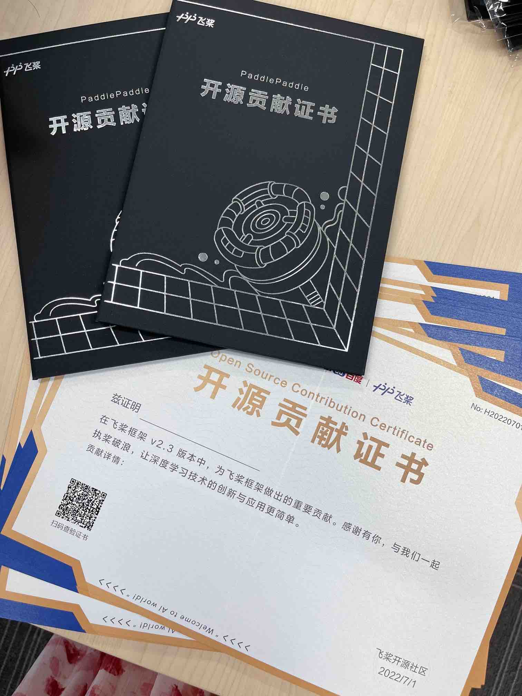

飞桨社区非常感谢，每一位以不同形式为飞桨做出贡献的开发者。我们通过该证书来给为飞桨的 [Paddle仓库](https://github.com/PaddlePaddle/Paddle) 、[PaddleOCR仓库](https://github.com/PaddlePaddle/PaddleOCR)贡献过 PR 的开发者提供一份正式的证明。该证书发放的对象不包括百度的员工，以及通过项目与飞桨进行合作的公司的员工。

由于条件限制，我们可能无法联系到所有满足条件的开发者，如果你曾经为飞桨的 [Paddle仓库](https://github.com/PaddlePaddle/Paddle) 、[PaddleOCR仓库](https://github.com/PaddlePaddle/PaddleOCR)贡献过 PR，并且也期望得到一份证书，还请通过 [ext_paddle_oss@baidu.com](mailto:ext_paddle_oss@baidu.com) 邮箱联系我们，提供 GitHub ID、姓名和邮寄地址，我们会在确认贡献情况后尽快给你补寄证书。

这里记录了飞桨社区颁发的开源贡献证书，你可以通过 `git log --author <author name>` 查询你曾经做出的具体贡献，你还可以在百度飞桨 AI Studio 平台通过查询证书编号完成 [在线证书查验](https://aistudio.baidu.com/aistudio/identification)。

## 支持的证书查询

| 证书名称               | 发布时间 | 证书编号     |
| ---------------------- | -------- | ------------ |
| 飞桨 v2.3 开源贡献证书 | 2022.7.1 | H20220701XXX |
| 飞桨 v2.4 开源贡献证书 | 2022.11.30 | H20221130XXX  |
| 飞桨 v2.5 开源贡献证书 |  2023.8.16  | H20230816XXX   |
| PaddleOCR release2.7 开源贡献证书 |  2023.9.1  | T20230901XXX   |

### 证书样例

## 飞桨开源之星

飞桨开源之星旨在表彰在一段时间内做出突出贡献的飞桨开源社区开发者，在飞桨开发者峰会 WAVE SUMMIT 现场颁奖，这里用于公示飞桨开源之星名单，大家可以通过点击对应的 GitHub ID 进入主页查看各位优秀开发者的贡献详情。

### 2022年开源之星
| 姓名   | GitHub ID                                             | 姓名   | GitHub ID                                         |
| ------ | ----------------------------------------------------- | ------ | ------------------------------------------------- |
| 崔子航 | [Asthestarsfalll](https://github.com/Asthestarsfalll) | 刘天源 | [tianshao1992](https://github.com/tianshao1992)   |
| 何双池 | [Yulv-git](https://github.com/Yulv-git)               | 聂杨   | [flytocc](https://github.com/flytocc)             |
| 胡雷   | [thunder95](https://github.com/thunder95)             | 汪昕   | [greatv](https://github.com/greatv)               |
| 孔远杭 | [kongdebug](https://github.com/kongdebug)             | 徐晓健 | [SigureMo](https://github.com/SigureMo)           |
| 梁嘉铭 | [AndPuQing](https://github.com/AndPuQing)             | 郑必城 | [Zheng-Bicheng](https://github.com/Zheng-Bicheng) |

2022年开源之星宣传稿：[点赞！让我们来看看谁是今年的飞桨开源之星？](https://mp.weixin.qq.com/s/35hTLnoejjG3zsQpNRfNIw)

### 2023年上半年开源之星
| 姓名   | GitHub ID                                       | 姓名   | GitHub ID                                     |
| ------ | ----------------------------------------------- | ------ | --------------------------------------------- |
| 何健飞 | [Tomoko-hjf](https://github.com/Tomoko-hjf)     | 汪昕   | [greatv](https://github.com/greatv)           |
| 黄子豪 | [DrRyanHuang](https://github.com/DrRyanHuang)   | 詹荣瑞 | [zrr1999](https://github.com/zrr1999)         |
| 李敏   | [enkilee](https://github.com/enkilee)           | 张伟鸿 | [longranger2](https://github.com/longranger2) |
| 刘宇博 | [RedContritio](https://github.com/RedContritio) | 张一乔 | [Liyulingyue](https://github.com/Liyulingyue) |
| 田川   | [gouzil](https://github.com/gouzil)             | 张正海 | [ccsuzzh](https://github.com/ccsuzzh)         |

