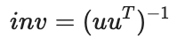
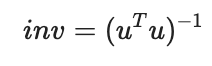
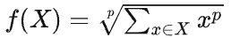

此文档展示 **PaddlePaddle Hackathon 第五期活动——开源贡献个人挑战赛 API 开发任务** 详细介绍，更多详见  [PaddlePaddle Hackathon 说明](https://www.paddlepaddle.org.cn/contributionguide?docPath=hackathon_cn)。

## 【开源贡献个人挑战赛-API开发】任务详情：

为飞桨框架新增一系列 API，提交流程请参考 [新增API 开发&提交流程](https://www.paddlepaddle.org.cn/documentation/docs/zh/develop/dev_guides/api_contributing_guides/api_contributing_guides_cn.html)，开发请参考 [贡献指南](https://www.paddlepaddle.org.cn/documentation/docs/zh/develop/dev_guides/index_cn.html)，任务列表如下，其他说明事项：

- 合入标准
  - 按 [API 设计规范](https://www.paddlepaddle.org.cn/documentation/docs/zh/develop/dev_guides/api_contributing_guides/api_design_guidelines_standard_cn.html) 完成 API设计文档；需要在设计文档中说明支持哪些数据类型（默认都要支持fp16/bf16/complex64/complex128），对不支持的要给出理由
  - 按 [API 验收标准](https://www.paddlepaddle.org.cn/documentation/docs/zh/develop/dev_guides/api_contributing_guides/api_accpetance_criteria_cn.html) 完成 API功能实现、单测、API文档；
- 参考内容
  - [新增API 开发&提交流程](https://www.paddlepaddle.org.cn/documentation/docs/zh/develop/dev_guides/api_contributing_guides/api_contributing_guides_cn.html)
  - [新增 API 设计模板](https://github.com/PaddlePaddle/community/blob/master/rfcs/APIs/api_design_template.md)
  - [飞桨API Python 端开发指南](https://www.paddlepaddle.org.cn/documentation/docs/zh/develop/dev_guides/api_contributing_guides/new_python_api_cn.html)
  - [C++ 算子开发指南](https://www.paddlepaddle.org.cn/documentation/docs/zh/develop/dev_guides/api_contributing_guides/new_cpp_op_cn.html)
  - [飞桨API文档书写规范](https://www.paddlepaddle.org.cn/documentation/docs/zh/develop/dev_guides/api_contributing_guides/api_docs_guidelines_cn.html)
  - [API单测开发及验收规范](https://www.paddlepaddle.org.cn/documentation/docs/zh/develop/dev_guides/api_contributing_guides/api_accpetance_criteria_cn.html)
  - 复数数据类型相关资料：
    - [On the Computation of Complex-valued Gradients with Application to Statistically Optimum Beamforming](https://arxiv.org/abs/1701.00392)
    - [复数梯度推导计算](https://github.com/PaddlePaddle/community/tree/master/pfcc/paddle-code-reading/complex_autograd) 
    - [paddlepaddle支持复数任务](https://github.com/PaddlePaddle/Paddle/issues/56145)

### No.1：为 Paddle 新增 copysign API

**详细描述：**

根据两个输入逐元素地计算结果张量，其结果由第一个输入的绝对值大小及第二个输入的符号组成。此任务的目标是在 Paddle 框架中，新增 copysign API ，调用路径为：

- paddle.copysign 作为独立的函数调用，非 inplace
- paddle.copysign_，作为独立的函数，inplace 地修改输入；
- Tensor.copysign做为 Tensor 的方法使用，非 inplace;
- Tensor.copysign_做为 Tensor 的方法使用， inplace 修改输入；

**提交内容：**

- API 的设计文档，并提 PR 至 community repo 的 [rfcs/APIs](https://github.com/PaddlePaddle/community/tree/master/rfcs/APIs) 目录；
- Python 实现代码 & 英文 API 文档，在 Paddle repo 的 [python/paddle/tensor/math.py](https://github.com/PaddlePaddle/Paddle/blob/release/2.4/python/paddle/tensor/math.py)文件；并在 [python/paddle/tensor/__init__.py](https://github.com/PaddlePaddle/Paddle/blob/develop/python/paddle/tensor/__init__.py#L274) 中，添加 copysign & copysign_ API，以支持 paddle.Tensor.copysign & paddle.Tensor.copysign_ 的调用方式；
- C ++/CUDA 实现代码，头文件在 Paddle repo 的 [paddle/phi/kernels](https://github.com/PaddlePaddle/Paddle/tree/develop/paddle/phi/kernels)目录，cc文件在[paddle/phi/kernels/cpu](https://github.com/PaddlePaddle/Paddle/tree/develop/paddle/phi/kernels/cpu) 目录 和 cu文件在[paddle/phi/kernels/gpu](https://github.com/PaddlePaddle/Paddle/tree/develop/paddle/phi/kernels/gpu) 目录
- 单测代码，在 Paddle repo 的 [test/](https://github.com/PaddlePaddle/Paddle/tree/develop/test)目录, 同时在[paddle/test/legacy_test/test_inplace.py](https://github.com/PaddlePaddle/Paddle/blob/develop/test/legacy_test/test_inplace.py)中新增对应的inplace api 单测
- 中文 API 文档，在 docs repo 的 [docs/api/paddle](https://github.com/PaddlePaddle/docs/tree/develop/docs/api/paddle) 目录和 [docs/api/paddle/Tensor_cn.rst](https://github.com/PaddlePaddle/docs/tree/develop/docs/api/paddle/Tensor_cn.rst) 文件，同时需要在 [docs/api/paddle/Overview_cn.rst](https://github.com/PaddlePaddle/docs/tree/develop/docs/api/paddle/Overview_cn.rst) 文件中添加 API 介绍。

**技术要求：**

- 熟悉 copysign 函数的计算原理和适用场景
- 熟练掌握 C++，Python
- 有一定的 CUDA 开发经验

### No.2：为 Paddle 新增 index_fill API

**详细描述：**

对于 nd tensor, 沿着某个轴 axis 取 (n-1)d 的切片，索引位置是 index, 并且将 value 中值填充到这些切片上。其中 value 是一个 scalar 或者 0d tensor, 该运算需要支持微分。调用路径：

- paddle.index_fill 作为独立的函数调用，非 inplace
- paddle.index_fill_，作为独立的函数，inplace 地修改输入；
- Tensor.index_fill， 作为 Tensor 的方法使用，非 inplace;
- Tensor.index_fill_，作为 Tensor 的方法使用， inplace 修改输入；

**提交内容：**

- API 的设计文档，并提 PR 至 [PaddlePaddle/community](https://github.com/PaddlePaddle/community) 的 rfcs/APIs 目录
- Python 实现代码 & 英文 API 文档，在 Paddle repo 的 [python/paddle/tensor/manipulation.py](https://github.com/PaddlePaddle/Paddle/blob/develop/python/paddle/tensor/manipulation.py) 文件。
- 单测代码，在 Paddle repo 的 [test/](https://github.com/PaddlePaddle/Paddle/tree/develop/test)目录, 同时在[paddle/test/legacy_test/test_inplace.py](https://github.com/PaddlePaddle/Paddle/blob/develop/test/legacy_test/test_inplace.py)中新增对应的inplace api 单测
- 中文API文档，在 docs repo 的  [docs/api/paddle/](https://github.com/PaddlePaddle/docs/tree/develop/docs/api/paddle/) 目录

**技术要求：**

- 了解 index_fill的计算逻辑和适用场景
- 熟练掌握 Python

### No.3：为 Paddle 新增 masked_fill API

**详细描述：**

对于一个Tensor，根据mask信息，将value 中的值填充到该Tensor中mask对应为True的位置。调用路径：

- paddle.masked_fill 作为独立的函数调用，非 inplace
- paddle.masked_fill_，作为独立的函数，inplace 地修改输入；
- Tensor.masked_fill，作为 Tensor 的方法使用，非 inplace;
- Tensor.masked_fill_，作为 Tensor 的方法使用， inplace 修改输入；

**提交内容：**

- API 的设计文档，并提 PR 至 [PaddlePaddle/community](https://github.com/PaddlePaddle/community) 的 rfcs/APIs 目录
- Python 实现代码 & 英文 API 文档，在 Paddle repo 的 [python/paddle/tensor/manipulation.py](https://github.com/PaddlePaddle/Paddle/blob/develop/python/paddle/tensor/manipulation.py) 文件。
- 单测代码，在 Paddle repo 的 [test/](https://github.com/PaddlePaddle/Paddle/tree/develop/test)目录, 同时在[paddle/test/legacy_test/test_inplace.py](https://github.com/PaddlePaddle/Paddle/blob/develop/test/legacy_test/test_inplace.py)中新增对应的inplace api 单测
- 中文API文档，在 docs repo 的  [docs/api/paddle/](https://github.com/PaddlePaddle/docs/tree/develop/docs/api/paddle/) 目录

**技术要求：**

- 了解 masked_fill的计算逻辑和适用场景
- 熟练掌握 Python

### No.4：为 Paddle 新增 masked_scatter API

**详细描述：**

根据mask信息，将value中的值逐个拷贝到原Tensor的对应位置上。此任务的目标是在 Paddle 框架中，新增 masked_scatter API ，调用路径为：

- paddle.masked_scatter 作为独立的函数调用，非 inplace
- paddle.masked_scatter_，作为独立的函数，inplace 地修改输入；
- Tensor.masked_scatter作为 Tensor 的方法使用，非 inplace;
- Tensor.masked_scatter_作为 Tensor 的方法使用， inplace 修改输入；

**提交内容：**

- API 的设计文档，并提 PR 至 community repo 的 [rfcs/APIs](https://github.com/PaddlePaddle/community/tree/master/rfcs/APIs) 目录；
- Python 实现代码 & 英文 API 文档，在 Paddle repo 的[python/paddle/tensor/manipulation.py](https://github.com/PaddlePaddle/Paddle/blob/develop/python/paddle/tensor/manipulation.py) 文件；并在 [python/paddle/tensor/__init__.py](https://github.com/PaddlePaddle/Paddle/blob/develop/python/paddle/tensor/__init__.py#L274) 中，添加 masked_scatter & masked_scatter_ API，以支持 paddle.Tensor.masked_scatter & paddle.Tensor.masked_scatter_ 的调用方式；
- C ++/CUDA 实现代码，头文件在 Paddle repo 的 [paddle/phi/kernels](https://github.com/PaddlePaddle/Paddle/tree/develop/paddle/phi/kernels)目录，cc文件在[paddle/phi/kernels/cpu](https://github.com/PaddlePaddle/Paddle/tree/develop/paddle/phi/kernels/cpu) 目录 和 cu文件在[paddle/phi/kernels/gpu](https://github.com/PaddlePaddle/Paddle/tree/develop/paddle/phi/kernels/gpu) 目录
- 单测代码，在 Paddle repo 的 [test/](https://github.com/PaddlePaddle/Paddle/tree/develop/test)目录, 同时在[paddle/test/legacy_test/test_inplace.py](https://github.com/PaddlePaddle/Paddle/blob/develop/test/legacy_test/test_inplace.py)中新增对应的inplace api 单测
- 中文 API 文档，在 docs repo 的 [docs/api/paddle](https://github.com/PaddlePaddle/docs/tree/develop/docs/api/paddle) 目录和 [docs/api/paddle/Tensor_cn.rst](https://github.com/PaddlePaddle/docs/tree/develop/docs/api/paddle/Tensor_cn.rst) 文件，同时需要在 [docs/api/paddle/Overview_cn.rst](https://github.com/PaddlePaddle/docs/tree/develop/docs/api/paddle/Overview_cn.rst) 文件中添加 API 介绍。

**技术要求：**

- 熟悉 masked_scatter 函数的计算原理和适用场景；
- 熟练掌握 C++，Python
- 有一定的 CUDA 开发经验

### No.5：为 Paddle 增强 scatter API

**详细描述：**

当前paddle.scatter API提供了根据index信息更新原Tensor的功能，但缺少指定轴和归约方式等功能。本任务希望在此基础上，进一步增强该API的功能，实现可以根据给定的归约方式，将update中的值按顺序根据index信息累计到原Tensor的对应位置上，即对应index_reduce操作。注意索引规则与scatter_reduce / put_along_axis的区别。

**提交内容：**

- API 的增强设计文档，并提 PR 至 community repo 的 [rfcs/APIs](https://github.com/PaddlePaddle/community/tree/master/rfcs/APIs) 目录；
- Python 实现代码 & 英文 API 文档，在 Paddle repo 的[python/paddle/tensor/manipulation.py](https://github.com/PaddlePaddle/Paddle/blob/develop/python/paddle/tensor/manipulation.py) 文件；
- C ++/CUDA 实现代码，头文件在 Paddle repo 的 [paddle/phi/kernels](https://github.com/PaddlePaddle/Paddle/tree/develop/paddle/phi/kernels)目录，cc文件在[paddle/phi/kernels/cpu](https://github.com/PaddlePaddle/Paddle/tree/develop/paddle/phi/kernels/cpu) 目录 和 cu文件在[paddle/phi/kernels/gpu](https://github.com/PaddlePaddle/Paddle/tree/develop/paddle/phi/kernels/gpu) 目录
- 补充新增功能单测代码，在 Paddle repo 的 [test/](https://github.com/PaddlePaddle/Paddle/tree/develop/test)目录, 同时在[paddle/test/legacy_test/test_inplace.py](https://github.com/PaddlePaddle/Paddle/blob/develop/test/legacy_test/test_inplace.py)中，在原单测的基础上补充新增功能的测试
- 更新中文 API 文档，在 docs repo 的 [docs/api/paddle](https://github.com/PaddlePaddle/docs/tree/develop/docs/api/paddle) 目录和 [docs/api/paddle/Tensor_cn.rst](https://github.com/PaddlePaddle/docs/tree/develop/docs/api/paddle/Tensor_cn.rst) 文件。

**技术要求：**

- 理解不同的索引方式的规则和差异，包括scatter、scatter_nd 、put_along_axis等；
- 熟悉 index_reduce 函数的计算原理和适用场景；
- 熟练掌握 C++，Python
- 有一定的 CUDA 开发经验

### No.6：为 Paddle 增强put_along_axis API

**详细描述：**

当前paddle.put_along_axis API提供了根据index信息和归约方式，沿指定轴将value中的值按顺序根据index信息累计到原Tensor的对应位置上。本任务希望在此基础上，进一步增强该API的功能，覆盖更全面的归约方式与功能。即对应scatter_reduce操作。注意索引规则与index_reduce / scatter的区别。

**提交内容：**

- API 的增强设计文档，并提 PR 至 community repo 的 [rfcs/APIs](https://github.com/PaddlePaddle/community/tree/master/rfcs/APIs) 目录；
- Python 实现代码 & 英文 API 文档，在 Paddle repo 的[python/paddle/tensor/manipulation.py](https://github.com/PaddlePaddle/Paddle/blob/develop/python/paddle/tensor/manipulation.py) 文件；
- C ++/CUDA 实现代码，头文件在 Paddle repo 的 [paddle/phi/kernels](https://github.com/PaddlePaddle/Paddle/tree/develop/paddle/phi/kernels)目录，cc文件在[paddle/phi/kernels/cpu](https://github.com/PaddlePaddle/Paddle/tree/develop/paddle/phi/kernels/cpu) 目录 和 cu文件在[paddle/phi/kernels/gpu](https://github.com/PaddlePaddle/Paddle/tree/develop/paddle/phi/kernels/gpu) 目录
- 补充新增功能单测代码，在 Paddle repo 的 [test/](https://github.com/PaddlePaddle/Paddle/tree/develop/test)目录, 同时在[paddle/test/legacy_test/test_inplace.py](https://github.com/PaddlePaddle/Paddle/blob/develop/test/legacy_test/test_inplace.py)中，在原单测的基础上补充新增功能的测试
- 中文 API 文档，在 docs repo 的 [docs/api/paddle](https://github.com/PaddlePaddle/docs/tree/develop/docs/api/paddle) 目录和 [docs/api/paddle/Tensor_cn.rst](https://github.com/PaddlePaddle/docs/tree/develop/docs/api/paddle/Tensor_cn.rst) 文件

**技术要求：**

- 理解不同的索引方式的规则和差异，包括scatter、scatter_nd 、put_along_axis等；
- 熟悉 scatter_reduce 函数的计算原理和适用场景；
- 熟练掌握 C++，Python
- 有一定的 CUDA 开发经验

### No.7：为 Paddle 新增 apply API

**详细描述：**

对输入Tensor中的每个元素，应用输入的Python函数（`callable`）得到结果：

- Tensor.apply(`callable`) 做为 Tensor 的方法使用，返回新的Tensor，存放计算结果
- Tensor.apply_(`callable`) 做为 Tensor 的方法使用， inplace 修改输入Tensor

**提交内容：**

- API 的设计文档，并提 PR 至 [PaddlePaddle/community](https://github.com/PaddlePaddle/community) 的 rfcs/APIs 目录
- 使用C++ 在 pybind中实现apply/apply_的逻辑代码 并 bind相关方法到Tensor module上，以实现通过Tensor.apply/apply_的调用
- 单测代码，在 Paddle repo 的 [test/](https://github.com/PaddlePaddle/Paddle/tree/develop/test)目录, 同时在[paddle/test/legacy_test/test_inpalce.py](https://github.com/PaddlePaddle/Paddle/blob/develop/test/legacy_test/test_inplace.py)中新增对应的inplace api 单测inplace api 单测
- 中文API文档，在 docs repo 的  [docs/api/paddle/](https://github.com/PaddlePaddle/docs/tree/develop/docs/api/paddle/) 目录

**技术要求：**

- 了解 Paddle 算子开发流程
- 熟练掌握 C++，Python
- 有一定的 CUDA 开发经验

### No.8：为 Paddle 新增 hypot API

**详细描述：**

实现直角三角形斜边长度求解函数的计算：

- paddle.hypot 作为独立的函数调用，非 inplace
- paddle.hypot_ 作为独立的函数，inplace 地修改输入；
- Tensor.hypot(input1, input2) 做为 Tensor 的方法使用，非 inplace;
- Tensor.hypot_(input1, input2) 做为 Tensor 的方法使用， inplace 修改输入；

**提交内容：**

- API 的设计文档，并提 PR 至 PaddlePaddle/community 的 rfcs/APIs 目录
- Python 实现代码 & 英文 API 文档，在 Paddle repo 的 python/paddle/tensor/math.py文件；并在 python/paddle/tensor/__init__.py 中，添加 hypot & hypot_  API，以支持 paddle.Tensor.hypot & paddle.Tensor.hypot_ 的调用方式；
- 单测代码，在 Paddle repo 的 [test/](https://github.com/PaddlePaddle/Paddle/tree/develop/test)目录增加非inplace的hypot单测, 同时在[paddle/test/legacy_test/test_inpalce.py](https://github.com/PaddlePaddle/Paddle/blob/develop/test/legacy_test/test_inplace.py)中新增对应的inplace的hypot_单测
- 中文API文档，在 docs repo 的  docs/api/paddle/ 目录

**技术要求：**

- 了解 Paddle 算子开发流程
- 熟练掌握 C++，Python
- 有一定的 CUDA 开发经验

### No.9：为 Paddle 新增 multigammaln API

**详细描述：**

实现多元对数伽马函数的计算：

- paddle.multigammaln 作为独立的函数调用，非 inplace
- paddle.multigammaln_ 作为独立的函数，inplace 地修改输入；
- Tensor.multigammaln(input, other) 做为 Tensor 的方法使用，非 inplace;
- Tensor.multigammaln_(input, other) 做为 Tensor 的方法使用， inplace 修改输入；

**提交内容：**

- API 的设计文档，并提 PR 至 [PaddlePaddle/community](https://github.com/PaddlePaddle/community) 的 rfcs/APIs 目录
- Python 实现代码 & 英文 API 文档，在 Paddle repo 的 [python/paddle/tensor/math.py](https://github.com/PaddlePaddle/Paddle/blob/release/2.4/python/paddle/tensor/math.py)文件；并在 [python/paddle/tensor/__init__.py](https://github.com/PaddlePaddle/Paddle/blob/develop/python/paddle/tensor/__init__.py#L274) 中，添加 mvlgamma & mvlgamma_  API，以支持 paddle.Tensor.mvlgamma & paddle.Tensor.mvlgamma_ 的调用方式；
- 单测代码，在 Paddle repo 的[test/](https://github.com/PaddlePaddle/Paddle/tree/develop/test)目录增，同时在[paddle/test/legacy_test/test_inpalce.py](https://github.com/PaddlePaddle/Paddle/blob/develop/test/legacy_test/test_inplace.py)中新增对应的inplace api 单测。
- 中文API文档，在 docs repo 的  [docs/api/paddle/](https://github.com/PaddlePaddle/docs/tree/develop/docs/api/paddle/) 目录

**技术要求：**

- 了解 Paddle 算子开发流程
- 熟练掌握 C++，Python
- 有一定的 CUDA 开发经验

### No.10：为 Paddle 新增 bernoulli_ / log_normal_ / log_normal API

**详细描述：**

内容一：指定概率p，实现inplace的伯努利分布，新增`paddle.bernoulli_`；

内容二：指定均值和方差，实现对数正态分布，新增 `paddle.lognormal/lognormal_` API；其中`lognormal`可通过paddle.gaussian和paddle.exp组合实现，`lognormal_`可通过paddle.normal_和paddle.exp_组合实现，`bernoulli_`可通过paddle.uniform_等来组合实现。调用路径为：

1. paddle.bernoulli_(x, p=0.5) 可以inplace的修改输入x，填充伯努利分布的值
2. paddle.Tensor.bernoulli_(p=0.5) 作为paddle.bernoulli_的Tensor类方法使用
3. paddle.log_normal_(x, mean=1.0, std=2.0) 可以inplace的修改输入x，填充对数正态分布的值
4. paddle.Tensor.log_normal_(mean=1.0, std=2.0) 作为paddle.log_normal_的Tensor类方法使用
5. paddle.log_normal(mean=1.0, std=2.0, shape=None, dtype=None) 作为非 inplace的API，可以创建一个对数正态分布的Tensor

**提交内容：**

- API 的设计文档，并提 PR 至 community repo 的 [rfcs/APIs](https://github.com/PaddlePaddle/community/tree/master/rfcs/APIs) 目录；
- Python 实现代码 & 英文 API 文档，在 Paddle repo 的 [python/paddle/tensor/random.py](https://github.com/PaddlePaddle/Paddle/blob/release/2.4/python/paddle/tensor/random.py)文件增加 bernoulli_ / lognormal_ / log_normal，以支持`paddle.bernoulli_/lognormal_/lognormal`的调用；并在 [python/paddle/tensor/__init__.py](https://github.com/PaddlePaddle/Paddle/blob/develop/python/paddle/tensor/__init__.py#L274) 中，添加  bernoulli_/ log_normal_，以支持`paddle.Tensor.bernoulli_``/log_normal_`的调用；
- 单测代码，在 Paddle repo 的 [test/](https://github.com/PaddlePaddle/Paddle/tree/develop/test)目录增加非inplace的单测, 同时在[paddle/test/legacy_test/test_inpalce.py](https://github.com/PaddlePaddle/Paddle/blob/develop/test/legacy_test/test_inplace.py)中新增对应inplace的单测
- 中文 API 文档，在 docs repo 的 [docs/api/paddle](https://github.com/PaddlePaddle/docs/tree/develop/docs/api/paddle) 目录和 [docs/api/paddle/Tensor_cn.rst](https://github.com/PaddlePaddle/docs/tree/develop/docs/api/paddle/Tensor_cn.rst) 文件，同时需要在 [docs/api/paddle/Overview_cn.rst](https://github.com/PaddlePaddle/docs/tree/develop/docs/api/paddle/Overview_cn.rst) 文件中添加 API 介绍。

**技术要求：**

- 熟悉 bernoulli / log_normal 函数的计算原理和适用场景；
- 熟练掌握 C++，Python

### No.11：为 Paddle 新增 igamma 和 igammac API

**详细描述：**

实现不完整伽马函数的计算：

- paddle.igamma 和 paddle.igammac 作为独立的函数调用，非 inplace
- paddle.igamma_ 和 paddle.igammac_，作为独立的函数，inplace 地修改输入；
- Tensor.igamma_(input, other) 和 Tensor.igammac_(input, other) 做为 Tensor 的方法使用，非 inplace;
- Tensor.igamma_(input, other) 和 Tensor.igammac_(input, other) 做为 Tensor 的方法使用， inplace 修改输入；

**提交内容：**

- API 的设计文档，并提 PR 至 [PaddlePaddle/community](https://github.com/PaddlePaddle/community) 的 rfcs/APIs 目录
- Python 实现代码 & 英文 API 文档，在 Paddle repo 的 [python/paddle/tensor/manipulation.py](https://github.com/PaddlePaddle/Paddle/blob/develop/python/paddle/tensor/manipulation.py) 文件。
- C ++/CUDA 实现代码，头文件在 Paddle repo 的 [paddle/phi/kernels](https://github.com/PaddlePaddle/Paddle/tree/develop/paddle/phi/kernels)目录，cc文件在[paddle/phi/kernels/cpu](https://github.com/PaddlePaddle/Paddle/tree/develop/paddle/phi/kernels/cpu) 目录 和 cu文件在[paddle/phi/kernels/gpu](https://github.com/PaddlePaddle/Paddle/tree/develop/paddle/phi/kernels/gpu) 目录
- 单测代码，在 Paddle repo 的 [python/paddle/fluid/tests/unittests](https://github.com/PaddlePaddle/Paddle/tree/develop/python/paddle/fluid/tests/unittests) 目录
- 中文API文档，在 docs repo 的  [docs/api/paddle/](https://github.com/PaddlePaddle/docs/tree/develop/docs/api/paddle/) 目录

**技术要求：**

- 了解 Paddle 算子开发流程
- 熟练掌握 C++，Python
- 有一定的 CUDA 开发经验

### No.12：为 Paddle 新增 AdaptiveLogSoftmaxWithLoss  API

**详细描述：**

AdaptiveLogSoftmaxWithLoss 来源于 [Efficient softmax approximation for GPUs](https://arxiv.org/abs/1609.04309)，其中的 Adaptive Softmax 方法是对一种高效实现 softmax 函数近似计算的方法。此任务的目标是在 Paddle 框架中，新增 AdaptiveLogSoftmaxWithLoss API，调用路径为：paddle.nn.AdaptiveLogSoftmaxWithLoss 和 paddle.nn.functional.adaptive_log_softmax_with_loss。可以在之前开发者 [未开发完的PR](https://github.com/PaddlePaddle/Paddle/pull/41886) 基础上进行开发。

**提交内容：**

- API 的设计文档，并提 PR 至 PaddlePaddle/community 的 rfcs/APIs 目录
- Python 实现代码 & 英文 API 文档，在 Paddle repo 的 [python/paddle/nn/layer/loss.py](https://github.com/PaddlePaddle/Paddle/blob/develop/python/paddle/nn/layer/loss.py) 文件 和 [python/paddle/nn/functional/loss.py](https://github.com/PaddlePaddle/Paddle/blob/develop/python/paddle/nn/functional/loss.py) 文件
- 单测代码，在 Paddle repo 的 [test/](https://github.com/PaddlePaddle/Paddle/tree/develop/test)目录
- 中文API文档，在 docs repo 的  docs/api/paddle/ 目录

**技术要求：**

- 熟悉 Adaptive Softmax 算法原理和适用场景
- 熟练掌握 Python

### No.13：为 Paddle 新增 signbit API

**详细描述：**

测试输入的每个元素是否设置了其符号位（小于零）。

- paddle.signbit 作为独立的函数调用
- Tensor.signbit(x) 做为 Tensor 的方法使用

**提交内容：**

- API 的设计文档，并提 PR 至 PaddlePaddle/community 的 rfcs/APIs 目录
- Python 实现代码 & 英文 API 文档，在 Paddle repo 的 python/paddle/tensor/math.py文件；并在 python/paddle/tensor/__init__.py 中，添加 signbit API，以支持 paddle.Tensor.signbit 的调用方式；
- 单测代码，在 Paddle repo 的 [test/](https://github.com/PaddlePaddle/Paddle/tree/develop/test)目录
- 中文API文档，在 docs repo 的  docs/api/paddle/ 目录

**技术要求：**

- 了解 Paddle 算子开发流程
- 熟练掌握 Python

### No.14：为 Paddle 新增 combinations API

**详细描述：**

计算给定Tensor的长度为r的组合，包括以下调用形式：

- paddle.combinations为独立的函数调用
- Tensor.combinations做为 Tensor 的方法使用

**提交内容：**

- API 的设计文档，并提 PR 至 [PaddlePaddle/community](https://github.com/PaddlePaddle/community) 的 rfcs/APIs 目录
- 在 Paddle repo 的 python/paddle/tensor/math.py文件；并在 python/paddle/tensor/__init__.py 中，添加 combinations API，以支持 paddle.Tensor.combinations 的调用方式；
- 单测代码，Paddle repo 的 [test/](https://github.com/PaddlePaddle/Paddle/tree/develop/test)目录
- 中文API文档，在 [paddle.Tensor](https://www.paddlepaddle.org.cn/documentation/docs/zh/develop/api/paddle/Tensor_cn.html) 页面增加该类方法

**技术要求：**

- 了解 Paddle 算子开发流程
- 熟练掌握 Python

### No.15：为 Paddle 新增 Tensor.to / Layer.astype API

**详细描述：**

- `Tensor.to`：对Tensor进行设备类型或数据类型的转换，输入参数需要支持多种形式，需支持多种用法，例如： `x.to('float64')`、`x.to('cpu')`、`x.to('cpu', 'float32')`、`x.to(y)`，同时上述例子均可设置blocking来控制是否同步阻塞拷贝。因此建议该API通过(*args, **kwargs)的参数设置可实现上述所有功能。
- `Layer.astype`：支持对网络层进行数据类型的转换，例如`Linear.astype('float64')`。

**提交内容：**

- API 的设计文档，并提 PR 至 [PaddlePaddle/community](https://github.com/PaddlePaddle/community) 的 rfcs/APIs 目录
- Python 实现代码 & 英文 API 文档，在 Paddle repo 的 [base/dygraph/tensor_patch_methods.py](https://github.com/PaddlePaddle/Paddle/blob/develop/python/paddle/base/dygraph/tensor_patch_methods.py) 和 [paddle/nn/layer/layers.py](https://github.com/PaddlePaddle/Paddle/blob/develop/python/paddle/nn/layer/layers.py)文件
- 单测代码，Paddle repo 的 [test/](https://github.com/PaddlePaddle/Paddle/tree/develop/test)目录
- 中文API文档，在 [paddle.Tensor](https://www.paddlepaddle.org.cn/documentation/docs/zh/develop/api/paddle/Tensor_cn.html)、[paddle.nn.Layer](https://www.paddlepaddle.org.cn/documentation/docs/zh/develop/api/paddle/nn/Layer_cn.html) 页面增加这两个类方法的介绍

**技术要求：**

- 熟悉 `Tensor.to`、`Layer.astype`的各种不同参数输入场景对应的功能，注意`Tensor.to`不同输入参数类型的判断与分别处理逻辑
- 熟练掌握 Python

### No.16：为 Paddle 新增 EmbeddingBag API

**详细描述：**

EmbeddingBag 是 [Embedding](https://www.paddlepaddle.org.cn/documentation/docs/zh/api/paddle/nn/Embedding_cn.html#embedding) 的拓展，在功能上相当于 Embedding + 求和/求均值/求最大值的操作，相比直接组合，EmbeddingBag 会有更高的计算效率和更小的内存消耗。此任务的目标是在 Paddle 框架中，新增 EmbeddingBag 和 embedding_bag API，调用路径为：paddle.nn.EmbeddingBag 和 paddle.nn.functional.embedding_bag。可以在之前开发者[未开发完的PR](https://github.com/PaddlePaddle/Paddle/pull/49000)基础上进行开发。

**提交内容：**

- API 的设计文档，并提 PR 至 [PaddlePaddle/community](https://github.com/PaddlePaddle/community) 的 rfcs/APIs 目录
- Python 实现代码 & 英文 API 文档，在 Paddle repo 的 [python/paddle/nn/layer/common.py](https://github.com/PaddlePaddle/Paddle/blob/develop/python/paddle/nn/layer/common.py) 文件 和 [python/paddle/nn/functional/input.py](https://github.com/PaddlePaddle/Paddle/blob/develop/python/paddle/nn/functional/input.py) 文件
- C ++ /CUDA 实现代码，在 Paddle repo 的 [paddle/phi/kernels](https://github.com/PaddlePaddle/Paddle/tree/develop/paddle/phi/kernels) 目录
- 单测代码，在 Paddle repo 的[ python/paddle/test/legacy_test](https://github.com/PaddlePaddle/Paddle/tree/develop/test/legacy_test) 目录
- 中文API文档，在 docs repo 的 [docs/api/paddle/nn](https://github.com/PaddlePaddle/docs/tree/develop/docs/api/paddle/nn) 目录和 [docs/api/paddle/nn/functional/](https://github.com/PaddlePaddle/docs/tree/develop/docs/api/paddle/nn/functional)

**技术要求：**

- 熟悉 EmbeddingBag 算法原理和适用场景
- 熟悉 Paddle 动静态图下数学计算过程
- 熟练掌握 C++, CUDA, Python

### No.17：为 Paddle 新增 pdist API

**详细描述：**

为paddle新增该为计算 N个向量两两之间的p-norm距离。一个矩阵A的大小为M*N，那么B=pdist(A)得到的矩阵B的大小为1行M*(M-1)/2列，表示的意义是M行数据，每两行计算一下p-norm距离，默认欧式距离。例如a = [[0.0, 1.0],[2.0,3.0],[4.0,5.0],[6.0,7.0]]，输出为[2.8284, 5.6569, 8.4853, 2.8284, 5.6569, 2.8284]。输出顺序为distance(第一行,第二行), distance(第一行,第三行), ... distance(第二行,第三行)...

调用路径为：

- paddle.pdist()作为独立的函数调用

**提交内容：**

- API 的设计文档，并提 PR 至 [PaddlePaddle/community](https://github.com/PaddlePaddle/community) 的 rfcs/APIs 目录
- 在 Paddle repo 的 python/paddle/nn/functional/distance.py文件；并在 python/paddle/nn/functional/__init__.py中，添加 pdist API，以支持 paddle.Tensor.pdist 的调用方式；
- 单测代码，Paddle repo 的 [test/](https://github.com/PaddlePaddle/Paddle/tree/develop/test)目录
- 中文API文档，在 [paddle.Tensor](https://www.paddlepaddle.org.cn/documentation/docs/zh/develop/api/paddle/Tensor_cn.html) 页面增加该类方法

**技术要求：**

- 了解 Paddle 算子开发流程
- 熟练掌握 Python

### No.18：为 Paddle 新增 Binomial 和 Poisson API

**详细描述：**

参考paddle现有distribution(如paddle.distribution.Multinomial)，增加Binomial和Poisson分布类。调用路径为：

- paddle.distribution.Binomial
- paddle.distribution.Poisson

**提交内容：**

- API 的设计文档，并提 PR 至 [PaddlePaddle/community](https://github.com/PaddlePaddle/community) 的 rfcs/APIs 目录
- Python 实现代码 & 英文 API 文档，在 Paddle repo 的 [python/paddle/distribution ](https://github.com/PaddlePaddle/Paddle/blob/develop/python/paddle/distribution/)文件
- 单测代码，Paddle repo 的 [test/](https://github.com/PaddlePaddle/Paddle/tree/develop/test)目录
- 中文API文档，在 docs repo 的  [docs/api/paddle/](https://github.com/PaddlePaddle/docs/tree/develop/docs/api/paddle/) 目录

**技术要求：**

- 熟悉Binomial和Poisson分布特性及相应组成
- 理解现有架构，与现有设计、代码风格保持一致
- 熟练掌握 Python

### No.19：为 Paddle 新增 ContinuousBernoulli 和 MultivariateNormal API

**详细描述：**

参考paddle现有distribution(如paddle.distribution.Multinomial)，增加ContinuousBernoulli和MultivariateNormal API分布类。调用路径为：

- paddle.distribution.ContinuousBernoulli
- paddle.distribution.MultivariateNormal 

**提交内容：**

- API 的设计文档，并提 PR 至 [PaddlePaddle/community](https://github.com/PaddlePaddle/community) 的 rfcs/APIs 目录
- Python 实现代码 & 英文 API 文档，在 Paddle repo 的 [python/paddle/distribution ](https://github.com/PaddlePaddle/Paddle/blob/develop/python/paddle/distribution/)文件
- 单测代码，Paddle repo 的 [test/](https://github.com/PaddlePaddle/Paddle/tree/develop/test)目录
- 中文API文档，在 docs repo 的  [docs/api/paddle/](https://github.com/PaddlePaddle/docs/tree/develop/docs/api/paddle/) 目录

**技术要求：**

- 熟悉Binomial和Poisson分布特性及相应组成
- 理解现有架构，与现有设计、代码风格保持一致
- 熟练掌握 Python

### No.20：为 Paddle 新增 Exponential 和 Gamma API

**详细描述：**

参考paddle现有distribution。增加Exponential和Gamma分布类。调用路径为：

- paddle.distribution.Exponential
- paddle.distribution.Gamma

**提交内容：**

- API 的设计文档，并提 PR 至 [PaddlePaddle/community](https://github.com/PaddlePaddle/community) 的 rfcs/APIs 目录
- Python 实现代码 & 英文 API 文档，在 Paddle repo 的 [python/paddle/distribution ](https://github.com/PaddlePaddle/Paddle/blob/develop/python/paddle/distribution/)文件
- 单测代码，Paddle repo 的 [test/](https://github.com/PaddlePaddle/Paddle/tree/develop/test)目录
- 中文API文档，在 docs repo 的  [docs/api/paddle/](https://github.com/PaddlePaddle/docs/tree/develop/docs/api/paddle/) 目录

**技术要求：**

- 熟悉 Exponential及Gamma分布特性及相应组成
- 熟练掌握 Python

### No.21：为 Paddle 新增 LinearLR API

**详细描述：**

线性学习率，给定起始factor和最终的factor，LinearLR会在中间阶段做线性插值，即会线性减少或增加学习率。调用路径为：

- paddle.optimizer.lr.LinearLR

**提交内容：**

- API 的设计文档，并提 PR 至 [PaddlePaddle/community](https://github.com/PaddlePaddle/community) 的 rfcs/APIs 目录
- Python 实现代码 & 英文 API 文档，在 Paddle repo 的 [python/paddle/optimizer/lr.py](https://github.com/PaddlePaddle/Paddle/blob/develop/python/paddle/optimizer/lr.py) 文件
- 单测代码，Paddle repo 的 [test/](https://github.com/PaddlePaddle/Paddle/tree/develop/test)目录
- 中文API文档，在 docs repo 的  [docs/api/paddle/](https://github.com/PaddlePaddle/docs/tree/develop/docs/api/paddle/) 目录

**技术要求：**

- 熟悉 LinearLR 学习率算法原理和适用场景
- 熟练掌握 Python

### No.22：为 Paddle 新增 CosineAnnealingWarmRestarts API

**详细描述：**

余弦退火学习率具有良好的1个核心思想，即高学习率时段和低学习率时段周期性出现。高学习率时段的功能是防止学习者陷入局部成本最小化；低学习率时段允许在（希望）找到的全局最小值内收敛到接近真实的最优点。具有热重启的余弦退火学习率是在常规余弦退火学习率算法基础上的一个改进，能够控制学习率的回升速度，这样到了训练后期，学习率回升次数变少或不会再回升，保持学习率一直下降直到训练结束。调用路径为：

- paddle.optimizer.lr.CosineAnnealingWarmRestarts

**提交内容：**

- API 的设计文档，并提 PR 至 [PaddlePaddle/community](https://github.com/PaddlePaddle/community) 的 rfcs/APIs 目录
- Python 实现代码 & 英文 API 文档，在 Paddle repo 的 [python/paddle/optimizer/lr.py](https://github.com/PaddlePaddle/Paddle/blob/develop/python/paddle/optimizer/lr.py) 文件
- 单测代码，Paddle repo 的 [test/](https://github.com/PaddlePaddle/Paddle/tree/develop/test)目录
- 中文API文档，在 docs repo 的  [docs/api/paddle/](https://github.com/PaddlePaddle/docs/tree/develop/docs/api/paddle/) 目录

**技术要求：**

- 熟悉 CosineAnnealingWarmRestarts 学习率算法原理和适用场景
- 熟练掌握 Python

### No.23：为 Paddle 新增 ConcatDataset API

**详细描述：**

ConcatDataset可以将多个数据集连接在一起，形成一个大的数据集，适用于需要同时处理多个数据集的情况。调用路径为：

- paddle.io.ConcatDataset

**提交内容：**

- API 的设计文档，并提 PR 至 [PaddlePaddle/community](https://github.com/PaddlePaddle/community) 的 rfcs/APIs 目录
- Python 实现代码 & 英文 API 文档，在 Paddle repo 的 python/paddle/io/dataloader/dataset.py  文件
- 单测代码，Paddle repo 的 [test/](https://github.com/PaddlePaddle/Paddle/tree/develop/test)目录
- 中文API文档，在 docs repo 的  [docs/api/paddle/](https://github.com/PaddlePaddle/docs/tree/develop/docs/api/paddle/) 目录

**技术要求：**

- 熟悉模型训练验证时常用的对数据集操作，以及ConcatDataset 的实现原理
- 熟练掌握 Python

### No.24：为 Paddle 新增 ConcatDataset API

**详细描述：**

SubsetRandomSampler子集随机采样器，从数据集的指定子集中随机选择样本，可以用于将数据集分成训练集和验证集等子集。调用路径为：

- paddle.utils.data.SubsetRandomSampler

**提交内容：**

- API 的设计文档，并提 PR 至 [PaddlePaddle/community](https://github.com/PaddlePaddle/community) 的 rfcs/APIs 目录
- Python 实现代码 & 英文 API 文档，在 Paddle repo 的 python/paddle/utils/data/sampler.py  文件
- 单测代码，Paddle repo 的 [test/](https://github.com/PaddlePaddle/Paddle/tree/develop/test)目录
- 中文API文档，在 docs repo 的  [docs/api/paddle/](https://github.com/PaddlePaddle/docs/tree/develop/docs/api/paddle/) 目录

**技术要求：**

- 熟悉模型训练验证时常用的对数据集操作，以及SubsetRandomSampler 的实现原理
- 熟练掌握 Python

### No.25：为 Paddle 新增 gammaln API

**详细描述：**

计算给定Tensor的伽马函数绝对值的自然对数，包括以下调用形式：

- paddle.gammaln 作为独立的函数调用，
- Tensor.gammaln 做为 Tensor 的方法使用

**提交内容：**

- API 的设计文档，并提 PR 至 [PaddlePaddle/community](https://github.com/PaddlePaddle/community) 的 rfcs/APIs 目录
- 在 Paddle repo 的 python/paddle/tensor/math.py文件；并在 python/paddle/tensor/__init__.py 中，添加 gammaln API，以支持 paddle.Tensor. gammaln 的调用方式；
- 中文API文档，在 docs repo 的  [docs/api/paddle/](https://github.com/PaddlePaddle/docs/tree/develop/docs/api/paddle/) 目录

**技术要求：**

- 了解 Paddle 算子开发流程
- 熟练掌握 Python

### No.26：为 Paddle 新增 diagonal_scatter API

**详细描述：**

- 对于一个Tensor，对于tensor a 和 b，将 b 中的内容按照索引的位置嵌入 a 中。如索引偏移量为0，则嵌入对角线位置。如索引偏移量 >0，则嵌入对角线上方，如偏移量 <0，则嵌入对角线下方。例如a = paddle.zeros([2,2])，b= paddle.ones([2])，输出为[[1.0,0.0],[0.0,1.0]]
- 调用路径：
  - paddle.diagonal_scatter 作为独立的函数调用
  - Tensor.diagonal_scatter，作为 Tensor 的方法使用

**提交内容：**

- API 的设计文档，并提 PR 至 [PaddlePaddle/community](https://github.com/PaddlePaddle/community) 的 rfcs/APIs 目录
- Python 实现代码 & 英文 API 文档，在 Paddle repo 的 [python/paddle/tensor/manipulation.py](https://github.com/PaddlePaddle/Paddle/blob/develop/python/paddle/tensor/manipulation.py) 文件。
- 单测代码，在 Paddle repo 的 [test/](https://github.com/PaddlePaddle/Paddle/tree/develop/test)目录
- 中文API文档，在 docs repo 的  [docs/api/paddle/](https://github.com/PaddlePaddle/docs/tree/develop/docs/api/paddle/) 目录

**技术要求：**

- 了解 select_scatter的计算逻辑和适用场景
- 熟练掌握 Python

### No.27：为 Paddle 新增 select_scatter API

**详细描述：**

对于一个Tensor，根据给定的轴和特定索引位置，返回一个新的Tensor，其结果等价于将value 中的值填充到该Tensor上。例如当指定轴为1，索引位置为2时，与x[:, 2] = value 结果相似，但与前者不同的是，不会直接修改x的值，而是返回预期赋值后的结果。调用路径：

- paddle.select_scatter 作为独立的函数调用
- Tensor.select_scatter，作为 Tensor 的方法使用

**提交内容：**

- API 的设计文档，并提 PR 至 [PaddlePaddle/community](https://github.com/PaddlePaddle/community) 的 rfcs/APIs 目录
- Python 实现代码 & 英文 API 文档，在 Paddle repo 的 [python/paddle/tensor/manipulation.py](https://github.com/PaddlePaddle/Paddle/blob/develop/python/paddle/tensor/manipulation.py) 文件。
- 单测代码，在 Paddle repo 的 [test/](https://github.com/PaddlePaddle/Paddle/tree/develop/test)目录
- 中文API文档，在 docs repo 的  [docs/api/paddle/](https://github.com/PaddlePaddle/docs/tree/develop/docs/api/paddle/) 目录

**技术要求：**

- 了解 select_scatter的计算逻辑和适用场景
- 熟练掌握 Python

### No.28：为 Paddle 新增 slice_scatter API

**详细描述：**

- 对于一个Tensor，根据给定的轴和切片表示的索引范围，返回一个新的Tensor，其结果等价于将value 中的值填充到该Tensor上，例如当指定轴为1，索引为start=1, end=5, step=2的切片时，与x[:, 1:5:2] = value 结果相似，但与前者不同的是，不会直接修改x的值，而是返回预期赋值后的结果。
- 调用路径：
  - paddle.slice_scatter 作为独立的函数调用
  - Tensor.slice_scatter，作为 Tensor 的方法使用

**提交内容：**

- API 的设计文档，并提 PR 至 [PaddlePaddle/community](https://github.com/PaddlePaddle/community) 的 rfcs/APIs 目录
- Python 实现代码 & 英文 API 文档，在 Paddle repo 的 [python/paddle/tensor/manipulation.py](https://github.com/PaddlePaddle/Paddle/blob/develop/python/paddle/tensor/manipulation.py) 文件。
- 单测代码，在 Paddle repo 的 [test/](https://github.com/PaddlePaddle/Paddle/tree/develop/test)目录
- 中文API文档，在 docs repo 的  [docs/api/paddle/](https://github.com/PaddlePaddle/docs/tree/develop/docs/api/paddle/) 目录

**技术要求：**

- 了解 slice_scatter的计算逻辑和适用场景
- 熟练掌握 Python

### No.29：为 Paddle 新增 cholesky_inverse API

**详细描述：**

- 使用 Cholesky 因子U计算对称正定矩阵的逆矩阵：返回矩阵`inv`。使用 LAPACK 例程`dpotri`和`spotri`(以及相应的 MAGMA 例程)计算逆。

  - 下三角矩阵
  
  - 上三角矩阵
  

- 调用形式
  - paddle.cholesky_inverse , 作为独立的函数调用
  - Tenso.cholesky_inverse , 作为 Tensor 的方法使用

**提交内容：**

- API 的设计文档，并提 PR 至 [PaddlePaddle/community](https://github.com/PaddlePaddle/community) 的 rfcs/APIs 目录
- Python 实现代码 & 英文 API 文档，在 Paddle repo 的 [python/](https://github.com/PaddlePaddle/Paddle/blob/develop/python/paddle/tensor/math.py)paddle/linalg.py文件。
- 单测代码，Paddle repo 的 [test/](https://github.com/PaddlePaddle/Paddle/tree/develop/test)目录
- 中文API文档，在 docs repo 的  [docs/api/paddle/](https://github.com/PaddlePaddle/docs/tree/develop/docs/api/paddle/) 目录

**技术要求：**

- 熟练掌握Cholesky数学语言以及线性代数中矩阵相关运算
- 熟练掌握 Python

### No.30：为 Paddle 新增 Layer.astype / Layer.cpu / Layer.cuda API

**详细描述：**

对paddle.nn.Layer进行设备类型或数据类型的转换，需要支持astype/cpu/cuda，包括以下调用形式：

- paddle.nn.Layer.astype
- paddle.nn.Layer.cpu
- paddle.nn.Layer.cuda：注意输入参数类型需要全面，要同时支持paddle.CUDAPlace与字符串形式

**提交内容：**

- API 的设计文档，并提 PR 至 [PaddlePaddle/community](https://github.com/PaddlePaddle/community) 的 rfcs/APIs 目录
- Python 实现代码 & 英文 API 文档，在 Paddle repo 的 [paddle/nn/layer/layers.py](https://github.com/PaddlePaddle/Paddle/blob/develop/python/paddle/nn/layer/layers.py) 文件
- 单测代码，Paddle repo 的 [test/](https://github.com/PaddlePaddle/Paddle/tree/develop/test) 目录
- 中文API文档，在 [paddle.nn.Layer](https://www.paddlepaddle.org.cn/documentation/docs/zh/develop/api/paddle/nn/Layer_cn.html) 页面增加该类方法

**技术要求：**

- 熟悉 `Layer.astype/cpu/cuda`的计算逻辑和适用场景
- 熟练掌握 Python

### No.30：为 Paddle 新增 vdot API

**详细描述：**

- vdot计算两个一维张量的共轭点积：如果第一个参数是复数，则使用第一个参数的复共轭用于计算点积。
- 调用形式
  - paddle.vdot, 作为独立的函数调用
  - Tenso.vdot, 作为 Tensor 的方法使用

**提交内容：**

- API 的设计文档，并提 PR 至 [PaddlePaddle/community](https://github.com/PaddlePaddle/community) 的 rfcs/APIs 目录
- Python 实现代码 & 英文 API 文档，在 Paddle repo 的 [python/](https://github.com/PaddlePaddle/Paddle/blob/develop/python/paddle/tensor/math.py)paddle/linalg.py文件。
- 单测代码，Paddle repo 的 [test/](https://github.com/PaddlePaddle/Paddle/tree/develop/test)目录
- 中文API文档，在 docs repo 的  [docs/api/paddle/](https://github.com/PaddlePaddle/docs/tree/develop/docs/api/paddle/) 目录

**技术要求：**

- 熟练掌握vdot语义及计算过程，掌握基本复数运算
- 了解 Paddle 算子开发流程
- 熟练掌握 Python

### No.31：为 Paddle 新增 column_stack / row_stack / dstack / hstack / vstack API

**详细描述：**

将一个Tensor根据不同方式堆叠拼接成一个Tensor，根据不同的轴与操作方式，分别可以有多种stack。该API依赖黑客松其他任务：atleast_1d / atleast_2d / atleast_3d，可在该任务完成之后再开发。不同API的调用路径为：

- paddle.column_stack，作为独立的函数调用
- Tensor.column_stack，作为 Tensor 的方法使用
- paddle.row_stack，作为独立的函数调用
- Tensor.row_stack，作为 Tensor 的方法使用
- paddle.dstack，作为独立的函数调用
- Tensor.dstack，作为 Tensor 的方法使用
- paddle.hstack，作为独立的函数调用
- Tensor.hstack，作为 Tensor 的方法使用
- paddle.vstack，作为独立的函数调用
- Tensor.vstack，作为 Tensor 的方法使用

**提交内容：**

- API 的设计文档，并提 PR 至 [PaddlePaddle/community](https://github.com/PaddlePaddle/community) 的 rfcs/APIs 目录
- Python 实现代码 & 英文 API 文档，在 Paddle repo 的 [python/paddle/tensor/manipulation.py](https://github.com/PaddlePaddle/Paddle/blob/develop/python/paddle/tensor/manipulation.py) 文件。
- 单测代码，在 Paddle repo 的 [test/](https://github.com/PaddlePaddle/Paddle/tree/develop/test)目录
- 中文API文档，在 docs repo 的  [docs/api/paddle/](https://github.com/PaddlePaddle/docs/tree/develop/docs/api/paddle/) 目录

**技术要求：**

- 了解 各种stack的计算逻辑和适用场景
- 注意区分各种stackt的差异
- 熟练掌握 Python

### No.32：为 Paddle 新增 tensor_split / hsplit / dsplit API

**详细描述：**

将一个Tensor按给定的轴和信息切分成多个子Tensor，这些子Tensor是原Tensor的view，该操作称为tensor_split。此外，其在特定轴上时的行为，称作hsplit, dsplit。调用路径为：

- paddle.tensor_split 作为独立的函数调用
- Tensor.tensor_split，作为 Tensor 的方法使用
- paddle.hsplit 作为独立的函数调用
- Tensor.hsplit，作为 Tensor 的方法使用
- paddle.dsplit 作为独立的函数调用
- Tensor.dsplit，作为 Tensor 的方法使用

**提交内容：**

- API 的设计文档，并提 PR 至 [PaddlePaddle/community](https://github.com/PaddlePaddle/community) 的 rfcs/APIs 目录
- Python 实现代码 & 英文 API 文档，在 Paddle repo 的 [python/paddle/tensor/manipulation.py](https://github.com/PaddlePaddle/Paddle/blob/develop/python/paddle/tensor/manipulation.py) 文件。
- 单测代码，在 Paddle repo 的 [test/](https://github.com/PaddlePaddle/Paddle/tree/develop/test)目录
- 中文API文档，在 docs repo 的  [docs/api/paddle/](https://github.com/PaddlePaddle/docs/tree/develop/docs/api/paddle/) 目录

**技术要求：**

- 了解 tensor_split的计算逻辑和适用场景
- 注意区分tensor_split 和split的差异
- 熟练掌握 Python

### No.33：为 Paddle 新增 atleast_1d / atleast_2d / atleast_3d API

**详细描述：**

- paddle.atleast_1d 作为独立的函数调用，返回每个零维输入张量的一维视图，有一个或多个维度的输入张量将按原样返回。
- paddle.atleast_2d 作为独立的函数调用，返回每个零维输入张量的二维视图，有两个或多个维度的输入张量将按原样返回。
- paddle.atleast_3d 作为独立的函数调用，返回每个零维输入张量的三维视图，有三个或多个维度的输入张量将按原样返回。

**提交内容：**

- API 的设计文档，并提 PR 至 [PaddlePaddle/community](https://github.com/PaddlePaddle/community) 的 rfcs/APIs 目录
- Python 实现代码 & 英文 API 文档，在 Paddle repo 的 [python/paddle/tensor/manipulation.py](https://github.com/PaddlePaddle/Paddle/blob/develop/python/paddle/tensor/manipulation.py) 文件。
- 单测代码，在 Paddle repo 的 [test/](https://github.com/PaddlePaddle/Paddle/tree/develop/test)目录
- 中文API文档，在 docs repo 的  [docs/api/paddle/](https://github.com/PaddlePaddle/docs/tree/develop/docs/api/paddle/) 目录

**技术要求：**

- 了解 Paddle 算子开发流程
- 熟练掌握 Python

### No.34：为 Paddle 新增 bitwise_right_shift / bitwise_right_shift_ / bitwise_left_shift / bitwise_left_shift_ API

**详细描述：**

通过一个Tensor给定的bits计算另一个Tensor的的算术（或逻辑）右移/左移。

- paddle.bitwise_right_shift，作为独立的函数调用
- paddle.bitwise_right_shift_ inplace 地修改输入
- Tensor.bitwise_right_shift，作为 Tensor 的方法使用
- Tensor.bitwise_right_shift_，inplace 地修改输入
- paddle.bitwise_left_shift，作为独立的函数调用
- paddle.bitwise_left_shift_, inplace 地修改输入
- Tensor.bitwise_left_shift，作为 Tensor 的方法使用
- Tensor.bitwise_left_shift_，inplace 地修改输入

**提交内容：**

- API 的设计文档，并提 PR 至 [PaddlePaddle/community](https://github.com/PaddlePaddle/community) 的 rfcs/APIs 目录
- Python 实现代码 & 英文 API 文档，在 Paddle repo 的 [python/paddle/tensor/math.py](https://github.com/PaddlePaddle/Paddle/blob/develop/python/paddle/tensor/math.py)文件。
- 单测代码，在 Paddle repo 的[test/](https://github.com/PaddlePaddle/Paddle/tree/develop/test)目录增加；同时在[paddle/test/legacy_test/test_inpalce.py](https://github.com/PaddlePaddle/Paddle/blob/develop/test/legacy_test/test_inplace.py)中新增对应的inplace api 单测。
- 中文API文档，在 docs repo 的  [docs/api/paddle/](https://github.com/PaddlePaddle/docs/tree/develop/docs/api/paddle/) 目录

**技术要求：**

- 了解 Paddle 算子开发流程
- 熟练掌握 Python

### No.35：为 Paddle 新增 histogramdd API

**详细描述：**

为Paddle新增histogramdd API，计算张量中值的多维直方图。

- paddle.histogramdd 作为独立的函数调用

**提交内容：**

- API 的设计文档，并提 PR 至 [PaddlePaddle/community](https://github.com/PaddlePaddle/community) 的 rfcs/APIs 目录
- Python 实现代码 & 英文 API 文档，在 Paddle repo 的 [python/](https://github.com/PaddlePaddle/Paddle/blob/develop/python/paddle/tensor/math.py)paddle/linalg.py文件。
- 单测代码，Paddle repo 的 [test/](https://github.com/PaddlePaddle/Paddle/tree/develop/test)目录
- 中文API文档，在 docs repo 的  [docs/api/paddle/linalg](https://github.com/PaddlePaddle/docs/tree/develop/docs/api/paddle/linalg) 目录

**技术要求：**

- 熟练掌握histogramdd 含义及计算过程
- 了解 Paddle 算子开发流程
- 熟练掌握 Python

### No.36：为 Paddle 新增 matrix_exp API

**详细描述：**

为Paddle新增matrix_exp API，计算方阵的指数。

- 调用路径：paddle.linalg.matrix_exp

**提交内容：**

- API 的设计文档，并提 PR 至 [PaddlePaddle/community](https://github.com/PaddlePaddle/community) 的 rfcs/APIs 目录
- Python 实现代码 & 英文 API 文档，在 Paddle repo 的 [python/](https://github.com/PaddlePaddle/Paddle/blob/develop/python/paddle/tensor/math.py)paddle/linalg.py文件。
- 单测代码，Paddle repo 的 [test/](https://github.com/PaddlePaddle/Paddle/tree/develop/test)目录
- 中文API文档，在 docs repo 的  [docs/api/paddle/linalg](https://github.com/PaddlePaddle/docs/tree/develop/docs/api/paddle/linalg) 目录

**技术要求：**

- 熟练掌握matrix_exp 含义及计算过程
- 熟练掌握 Python

### No.37：为 Paddle 新增 householder_product API

**详细描述：**

Householder变换是一种简洁的线性变换，也称为镜面反射变换。对于向量 w ，Householder矩阵的作用是将其反向，对于垂直于向量 w 的向量 v ，Householder矩阵对其不产生改变。那么对于一般的向量 α ，经过Householder矩阵作用后，平行于 w 的分量反向，垂直于 w 的分量保持不变，即其整体作用是将向量 α 关于法向量为 w 的平面做镜面对称。有关Householder变换的实际应用包括矩阵的 QR 分解，拟上三角化等。实现Householder矩阵求解的函数，调用路径为：

- paddle.linalg.householder_product

**提交内容：**

- API 的设计文档，并提 PR 至 [PaddlePaddle/community](https://github.com/PaddlePaddle/community) 的 rfcs/APIs 目录
- Python 实现代码 & 英文 API 文档，在 Paddle repo 的 [python/](https://github.com/PaddlePaddle/Paddle/blob/develop/python/paddle/tensor/math.py)paddle/linalg.py文件。
- 单测代码，Paddle repo 的 [test/](https://github.com/PaddlePaddle/Paddle/tree/develop/test)目录
- 中文API文档，在 docs repo 的  [docs/api/paddle/](https://github.com/PaddlePaddle/docs/tree/develop/docs/api/paddle/) 目录

**技术要求：**

- 熟练掌握Householder矩阵含义及计算过程
- 了解 Paddle 算子开发流程
- 熟练掌握 Python

### No.38：为 Paddle 新增 FractionalMaxPool2d / FractionalMaxPool3d API     

**详细描述：**

- 在一个由多个通道组成的输入信号上施加分数最大池化。分数最大池化请参考论文 https://arxiv.org/abs/1412.6071
- 调用形式
  - paddle.nn.FractionalMaxPool2d
  - paddle.nn.FractionalMaxPool3d
  - paddle.nn.functional.fractional_max_pool2d
  - paddle.nn.functional.fractional_max_pool3d

**提交内容：**

- API 的设计文档，并提 PR 至 [PaddlePaddle/community](https://github.com/PaddlePaddle/community) 的 rfcs/APIs 目录
- Python 实现代码 & 英文 API 文档，
  - fractional_max_pool2d和fractional_max_pool3d在 Paddle repo 的 python/paddle/nn/functional/pooling.py文件。
  - FractionalMaxPool2d和FractionalMaxPool2d在 Paddle repo 的 python/paddle/nn/layer/pooling.py文件。
- 单测代码，Paddle repo 的 [test/](https://github.com/PaddlePaddle/Paddle/tree/develop/test)目录
- 中文API文档，在 docs repo 的  [docs/api/paddle/](https://github.com/PaddlePaddle/docs/tree/develop/docs/api/paddle/) 目录

**技术要求：**

- 熟练掌握fractional_max_pool2d和fractional_max_pool3d语义及计算过程
- 了解 Paddle 算子开发流程
- 熟练掌握 Python

### No.39：为 Paddle 新增 LPPool1D / LPPool2D API

**详细描述：**

- 用于求解一维的幂平均池化 (power-average pooling)
  - 每个窗口的计算过程： 
  
     - 当 p=∞ 时等同于最大池化
     - 当 p=1 时等同于累加池化
- 调用形式
  - paddle.nn.LPPool1D
  - paddle.nn.LPPool2D
  - paddle.nn.functional.lp_pool1d
  - paddle.nn.functional.lp_pool2d

**提交内容：**

- API 的设计文档，并提 PR 至 [PaddlePaddle/community](https://github.com/PaddlePaddle/community) 的 rfcs/APIs 目录
- Python 实现代码 & 英文 API 文档，
  - lp_pool1d和lp_pool2d在 Paddle repo 的 python/paddle/nn/functional/pooling.py文件。
  - LPPool1D和LPPool2D在 Paddle repo 的 python/paddle/nn/layer/pooling.py文件。
- C ++/CUDA 实现代码，头文件在 Paddle repo 的 [paddle/phi/kernels](https://github.com/PaddlePaddle/Paddle/tree/develop/paddle/phi/kernels)目录，cc文件在[paddle/phi/kernels/cpu](https://github.com/PaddlePaddle/Paddle/tree/develop/paddle/phi/kernels/cpu) 目录 和 cu文件在[paddle/phi/kernels/gpu](https://github.com/PaddlePaddle/Paddle/tree/develop/paddle/phi/kernels/gpu) 目录
- 单测代码，Paddle repo 的 [test/](https://github.com/PaddlePaddle/Paddle/tree/develop/test)目录
- 中文API文档，在 docs repo 的  [docs/api/paddle/](https://github.com/PaddlePaddle/docs/tree/develop/docs/api/paddle/) 目录

**技术要求：**

- 熟练掌握lp_pool1d和lp_pool2d语义及计算过程
- 掌握 Paddle 算子开发流程
- 熟练掌握 Python
- 熟悉c++
- 了解cuda编程

### No.40：为 Paddle 新增 ASGD API

**详细描述：**

详细描述RASGD 优化器在论文[Acceleration of stochastic approximation by averaging](https://xueshu.baidu.com/usercenter/paper/show?paperid=396ab3d48d059f68d267372498976cd3)中提出，它是一种轨迹平均的随机优化方法。此任务的目标是在 Paddle 框架中，新增 ASGD 优化器。调用路径为：

- paddle.optimizer.ASGD。

**提交内容：**

- API 的设计文档，并提 PR 至 [PaddlePaddle/community](https://github.com/PaddlePaddle/community) 的 rfcs/APIs 目录
- Python 实现代码 & 英文 API 文档，在 Paddle repo 的 python/paddle/optimizer/asgd.py 文件，需新建
- C ++/CUDA 实现代码，头文件在 Paddle repo 的 [paddle/phi/kernels](https://github.com/PaddlePaddle/Paddle/tree/develop/paddle/phi/kernels)目录，cc文件在[paddle/phi/kernels/cpu](https://github.com/PaddlePaddle/Paddle/tree/develop/paddle/phi/kernels/cpu) 目录 和 cu文件在[paddle/phi/kernels/gpu](https://github.com/PaddlePaddle/Paddle/tree/develop/paddle/phi/kernels/gpu) 目录
- 单测代码，Paddle repo 的 [test/](https://github.com/PaddlePaddle/Paddle/tree/develop/test)目录
- 中文API文档，在 docs repo 的  [docs/api/paddle/](https://github.com/PaddlePaddle/docs/tree/develop/docs/api/paddle/) 目录

**技术要求：**

- 了解 Paddle 动静态图下 Optimize pass过程
- 熟练掌握 C++ 、CUDA、Python
- 熟悉 ASGD 优化器算法原理和适用场景

### No.41：为 Paddle 新增 Rprop API

**详细描述：**

Rprop优化器是在A direct adaptive method for faster backpropagation learning : The RPROP algorithm中提出的一种优化方法，该方法考虑到不同权值参数的梯度的数量级可能相差很大，因此很难找到一个全局的学习步长。因此创新性地提出靠参数梯度的符号，动态的调节学习步长以加速优化过程的方法。此任务的目标是在 Paddle 中，实现 Rprop 优化器。调用路径为：

- paddle.optimizer.Rprop

**提交内容：**

- API 的设计文档，并提 PR 至 [PaddlePaddle/community](https://github.com/PaddlePaddle/community) 的 rfcs/APIs 目录
- Python 实现代码 & 英文 API 文档，在 Paddle repo 的 python/paddle/optimizer/rprop.py 文件，需新建
- C ++/CUDA 实现代码，头文件在 Paddle repo 的 [paddle/phi/kernels](https://github.com/PaddlePaddle/Paddle/tree/develop/paddle/phi/kernels)目录，cc文件在[paddle/phi/kernels/cpu](https://github.com/PaddlePaddle/Paddle/tree/develop/paddle/phi/kernels/cpu) 目录 和 cu文件在[paddle/phi/kernels/gpu](https://github.com/PaddlePaddle/Paddle/tree/develop/paddle/phi/kernels/gpu) 目录
- 单测代码，Paddle repo 的 [test/](https://github.com/PaddlePaddle/Paddle/tree/develop/test)目录
- 中文API文档，在 docs repo 的  [docs/api/paddle/](https://github.com/PaddlePaddle/docs/tree/develop/docs/api/paddle/) 目录

**技术要求：**

- 了解 Paddle 动静态图下 Optimize pass过程
- 熟练掌握 C++ 、CUDA、Python
- 熟悉 Rprop 优化器算法原理和适用场景
