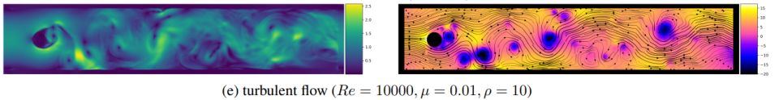
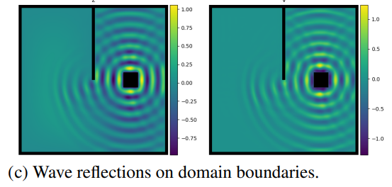

此文档展示 **PaddlePaddle Hackathon 第五期活动——开源贡献个人挑战赛科学计算方向任务** 详细介绍，更多详见  [PaddlePaddle Hackathon 说明](https://www.paddlepaddle.org.cn/contributionguide?docPath=hackathon_cn)。

## 任务开发流程与验收标准

### 开发流程：

1. **要求基于 PaddleScience 套件进行开发**，开发文档参考：https://paddlescience-docs.readthedocs.io/zh/latest/zh/development/。
2. 复现整体流程可以参考：https://paddlescience-docs.readthedocs.io/zh/latest/zh/reproduction/#21 ，复现完成后需供必要的训练产物，包括训练结束后保存的打印信息日志文件、`.pdparams`格式的模型权重参数文件（可用网盘的方式提交）、**撰写的案例文档。**
3. 理解复现流程后，可以参考 PaddleScience 开发文档：https://paddlescience-docs.readthedocs.io/zh/latest/zh/development/ ，了解各个模块如何进行开发、修改，以及参考API文档，了解各个现有API的功能和作用：https://paddlescience-docs.readthedocs.io/zh/latest/zh/api/arch/ 。
4. 案例文档撰写格式可参考 https://paddlescience-docs.readthedocs.io/zh/latest/zh/examples/darcy2d/ ，最终合入后会被渲染并展示在 [PaddleScience 官网文档](https://paddlescience-docs.readthedocs.io/zh/latest/zh/examples/volterra_ide/)。
5. **如在复现过程中出现需添加的功能无法兼容现有 PaddleScience API 体系（[**PaddleScience API 文档**](https://paddlescience-docs.readthedocs.io/zh/latest/zh/api/arch/)），则可与论文复现指导人说明情况，并视情况允许直接基于 Paddle API 进行复现。**
6. 若参考代码为 pytorch，则复现过程可以尝试使用 PaConvert（https://github.com/PaddlePaddle/PaConvert ）辅助完成代码转换工作，然后可以尝试使用 PaDiff（https://github.com/PaddlePaddle/PaDiff ）工具辅助完成前反向精度对齐，从而提高复现效率。

### 验收标准：

参考模型复现指南验收标准部分 https://paddlescience-docs.readthedocs.io/zh/latest/zh/reproduction/#3

## 【开源贡献个人挑战赛-科学计算方向】任务详情

### No.53：NSFnets (Navier-Stokes Flow nets): Physics-informed neural networks for the incompressible Navier-Stokes equations

**论文链接：**

https://arxiv.org/abs/2003.06496

**复现：**

Kovasznay flow + cylinder wake + Beltrami flow，三个案例和指标

**参考代码链接：**

[https://github.com/Alexzihaohu/NSFnets/blob/master/](https://github.com/Alexzihaohu/NSFnets/blob/master/VP_NFSnets1.py)

### No.54：NSFnets (Navier-Stokes Flow nets): Physics-informed neural networks for the incompressible Navier-Stokes equations

**论文链接：**

https://arxiv.org/abs/2003.06496

**复现：**

Turbulent channel flow，复现湍流案例和指标

**参考代码链接：**

[https://github.com/Alexzihaohu/NSFnets/blob/master/](https://github.com/Alexzihaohu/NSFnets/blob/master/VP_NFSnets3.py)

### No.55：Fourier-MIONet: Fourier-enhanced multiple-input neural operators for multiphase modeling of geological carbon sequestration

**论文链接：**

[https://arxiv.org/pdf/2303.04778](https://arxiv.org/pdf/2303.04778.pdf)

**参考代码链接：**

https://github.com/lu-group/mionet

### No.56：A Physics-Informed Neural Network to solve 2D steady-state heat equation

**论文链接：**

https://arxiv.org/abs/1711.10561

**参考代码链接：**

https://github.com/314arhaam/heat-pinn/tree/main

### No.57：Neural networks for topology optimization

**论文链接：**

https://arxiv.org/abs/1709.09578

**参考代码链接：**

https://github.com/ISosnovik/nn4topopt

**复现目标：**

该论文为数据驱动，案例之间代码相同，数据集不同（案例代码生成），要求复现全部四个案例，并合入PaddleScience

### No.58：A physics-informed deep neural network for surrogate modeling in classical elasto-plasticity

**论文链接：**

https://arxiv.org/abs/2204.12088

**参考代码链接：**

https://github.com/meghbali/ANNElastoplasticity、https://github.com/meghbali/WGImplicit

**复现目标：**

复现epnn模型，并根据代码中提供的数据训练、推理，并合入PaddleScience

### No.59：Spline-PINN: Approaching PDEs without Data using Fast, Physics-Informed Hermite-Spline CNNs

**论文链接：**

https://arxiv.org/abs/2109.07143

**参考代码链接：**

https://github.com/wandeln/Spline_PINN/tree/main

**复现目标：**

复现 turbulent flow (Re = 10000, µ = 0.01, ρ = 10) 与 Wave reflections on domain boundaries.两个场景下的案例

### No.60：PhyGeoNet: Physics-Informed Geometry-Adaptive Convolutional Neural Networks for Solving Parameterized Steady-State PDEs on Irregular Domain

**论文链接：**

https://arxiv.org/abs/2004.13145

**参考代码链接：**

https://github.com/Jianxun-Wang/phygeonet

**复现目标：**

复现参考代码中的case0、case2案例，可参考：[PhyGeoNet_Paddle - 飞桨AI Studio星河社区](https://aistudio.baidu.com/projectdetail/6796618)，并合入PaddleScience

### No.61：Skillful nowcasting of extreme precipitation with NowcastNet

**论文链接：**

https://www.nature.com/articles/s41586-023-06184-4#Abs1

**参考代码链接：**

https://codeocean.com/capsule/3935105/tree/v1

**复现目标：**

复现mrms_case和mrms_large_case，可参考：[NowCastNet_Paddle - 飞桨AI Studio星河社区](https://aistudio.baidu.com/projectdetail/6796590)，并合入PaddleScience

### No.62：GraphCast: Learning skillful medium-range global weather forecasting

**论文链接：**

https://arxiv.org/abs/2212.12794

**参考代码链接：**

https://github.com/deepmind/graphcast

**复现目标：**

复现graphcast模型，能够使用参考代码中提供的预训练权重进行推理。

### No.63：PhyCRNet: Physics-informed Convolutional-Recurrent Network for Solving Spatiotemporal PDEs

**论文链接：**

https://arxiv.org/abs/2106.14103

**参考代码链接：**

https://github.com/isds-neu/PhyCRNet
