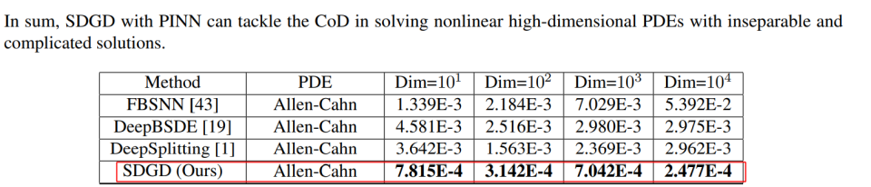

此文档展示 **PaddlePaddle Hackathon 第六期活动——开源贡献个人挑战赛科学计算方向任务** 详细介绍，更多详见 [PaddlePaddle Hackathon 说明](https://github.com/PaddlePaddle/docs/blob/develop/docs/guides/10_contribution/hackathon_cn.md)。

## 任务开发流程与验收标准

### 开发流程

1. **要求基于** **PaddleScience 套件进行开发**，开发文档参考：https://paddlescience-docs.readthedocs.io/zh/latest/zh/development/ 。
2. 复现整体流程和验收标准可以参考：https://paddlescience-docs.readthedocs.io/zh/latest/zh/reproduction/#21 ，复现完成后需供必要的训练产物，包括训练结束后保存的打印信息日志文件、`.pdparams`格式的模型权重参数文件（可用网盘的方式提交）、**撰写的案例文档。**
3. 理解复现流程后，可以参考 PaddleScience 开发文档：https://paddlescience-docs.readthedocs.io/zh/latest/zh/development/ ，了解各个模块如何进行开发、修改，以及参考API文档，了解各个现有API的功能和作用：https://paddlescience-docs.readthedocs.io/zh/latest/zh/api/arch/ 。
4. 案例文档撰写格式可参考 https://paddlescience-docs.readthedocs.io/zh/latest/zh/examples/darcy2d/ ，最终合入后会被渲染并展示在 [PaddleScience 官网文档](https://paddlescience-docs.readthedocs.io/zh/latest/zh/examples/volterra_ide/)。
5. **如在复现过程中出现需添加的功能无法兼容现有 PaddleScience API 体系（[PaddleScience API 文档](https://paddlescience-docs.readthedocs.io/zh/latest/zh/api/arch/)），则可与论文复现指导人说明情况，并视情况允许直接基于 Paddle API 进行复现。**
6. 若参考代码为 pytorch，则复现过程可以尝试使用 [PaConvert](https://github.com/PaddlePaddle/PaConvert) 辅助完成代码转换工作，然后可以尝试使用 [PaDiff](https://github.com/PaddlePaddle/PaDiff) 工具辅助完成前反向精度对齐，从而提高复现效率。

### 验收标准

参考模型复现指南验收标准部分 https://paddlescience-docs.readthedocs.io/zh/latest/zh/reproduction/#3

## 【开源贡献个人挑战赛-科学计算方向】任务详情

### NO.36 CausalPINN 代码复现

**论文链接：**

https://www.researchgate.net/profile/Sifan-Wang-9/publication/378139236_Respecting_Causality_for_Training_Physics-informed_Neural_Networks/links/65c8dea41e1ec12eff81ab88/Respecting-Causality-for-Training-Physics-informed-Neural-Networks.pdf

**代码复现：**

完整复现 CausalPINN 并合入到 PaddleScience

**参考代码链接：**

https://github.com/PredictiveIntelligenceLab/CausalPINNs/tree/main/NS

### NO.37 GraphCastNet 代码迁移至 PaddleScience

**论文链接：**
https://arxiv.org/pdf/2212.12794.pdf

**代码迁移：**

将 paddlescience 库中的推理代码从 paddle 格式迁移为 paddlescience 格式，使用 ppsci 模块下的 API 进行实现，推理效果与原代码保持一致，并迁移至 examples/graphcast/目录下，撰写与 examples 下案例同样格式的文档。

**参考代码链接：**

https://github.com/PaddlePaddle/PaddleScience/tree/develop/jointContribution/graphcast

### NO.38 LDCast 代码复现

**论文链接：**

https://arxiv.org/abs/2304.12891

**代码复现：**

完整复现 LDCast 并合入到 PaddleScience

1. 完成代码复现，训练模型的 CRPS 曲线在 1km、8km、64km 三种尺度下与参考代码曲线基本一致；
2. 将代码合并到 PaddleScience，并实现完整的流程：训练、验证、导出、推理；
3. 撰写案例文档和数据集文档；

**参考代码链接：**

https://github.com/MeteoSwiss/ldcast

### NO.39 XPINN 迁移至 PaddleScience

**案例链接：**

https://github.com/PaddlePaddle/PaddleScience/tree/develop/jointContribution/XPINNs

**代码迁移：**

理解 XPINN 的执行流程，将 XPINN 案例使用 PaddleScience API 实现，训练精度和原有代码保持一致，同时为 XPINN 撰写与 examples 下其余案例同样格式的文档。

### NO.40 SDGD 优化器实现

**论文链接：**

https://arxiv.org/pdf/2307.12306.pdf

**参考代码链接：**

无

**代码实现：**

根据论文公式和实验条件，用 paddle 实现 SDGD 优化器，支持单机训练和多卡并行训练，最终在 Allen-Cahn 问题上，复现出红框中的四个精度。

### NO.41 PIRATENETS 代码复现

**论文链接：**

https://arxiv.org/pdf/2402.00326.pdf

**代码复现：**

参考代码链接：https://github.com/PredictiveIntelligenceLab/jaxpi （该代码暂未开源在该 repo 中，repo 内的其他代码可作为参考）

**代码实现：**

根据论文结构图与损失函数公式、给出的训练配置，使用 PaddleScience API 实现 PIRATENETS 模型结构并在 2+案例上复现精度，代码合并至 examples

### NO.42 AlphaGeometry 几何推理模型

**论文链接：**

https://www.nature.com/articles/s41586-023-06747-5

**复现：**

AlphaGeometry 几何推理模型

**参考代码链接：**

https://github.com/google-deepmind/alphageometry
