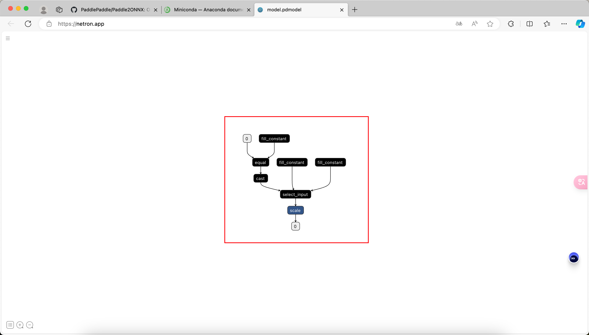
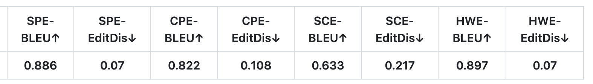

此文档展示 **PaddlePaddle Hackathon 第七期活动——开源贡献个人挑战赛套件开发方向任务** 详细介绍

## 【开源贡献个人挑战赛-套件开发】任务详情

### NO.43 完善 TokenizerFast 功能支持

背景：当前 PaddleNLP 已经支持 TokenizerFast 基础实现，但当前大部分模型不包含 tokenizer_fast 实现，因此无法享受到 TokenizerFast 带来的性能提升。

**详细任务说明：**

- 实现 bert、bloom、chatglm、ernie、gemma、gpt、qwen、qwen2 对应的 toekizer_fast.py 文件，并验证 tokenzier 正确性
- 验证 tokenzier 和 toekizer_fast 区别并给出详细报告说明，数据集需包含大规模多语数据集。
- 为 tokenizer_fast 和 tokenzier 对齐编写不少于 15 个 cases 的单测样例。提交内容：设计文档：提至 [PaddlePaddle/community](https://github.com/PaddlePaddle/community) 的 rfcs/PaddleNLP 目录提交到 PaddleNLP 对应模型文件夹下，此处以 llama 举例，https://github.com/PaddlePaddle/PaddleNLP/tree/develop/paddlenlp/transformers/llama

**提交内容：**

- 设计文档：提至 [PaddlePaddle/community](https://github.com/PaddlePaddle/community) 的 rfcs/PaddleNLP 目录
- 提交到 PaddleNLP 对应模型文件夹下，如 llama 示例 https://github.com/PaddlePaddle/PaddleNLP/tree/develop/paddlenlp/transformers/llama

---

### NO.44 大模型 4D 并行框架全自动构建

背景：当前大模型并行结构不断创新，随着模型结构增多，改造历史模型结构成本不断加重，因此亟需自动化框架构建工具辅助分布式组网结构修改。

**详细任务说明：**

- 统计分析当前模型库中不同模型结构所属类别，构造异同结构数据表单。例如：

  （1）llama 使用的 attention 支持普通 Attention 和 GQA，同时 Qwen2 也支持普通 Attention 和 GQA，但是 Qwen 仅支持普通 Attention。

  （2）模型结构支持能力不同，如 llama 支持模型并行及序列并行，但 chatglm 未支持模型并行。

  （3）如增加模型并行，需在 MLP 和 Attention 等位置添加权重并行代码，需统计支持并行能力和代码修改位置。（完成并提交文档即得到 ⭐️）

- 参考 Qwen2 模型结构，设计分布式结构接入流程文档，文档需支持模型并行（含序列并行）和流水线并行新增方案。（建议在方案中详细设计 XX 并行方式的修改范围）

- 基于上述统计信息和接入文档，可通过 gradio 方式实现 Qwen2 模型结构快速构建，功能点支持：

  - 模型并行支持
  - 序列并行支持
  - 流水线并行支持
  - GQA、MHA 支持
  - flashattention 支持
  - RMSNorm 支持
  - ROPE 支持

- 输出后模型可在 PaddleNLP 中运行（from_pretrain 加载并运行）通过即完成。（提交 PR 得到 ⭐️，输出代码可直接运行或仅存在少量问题得到 ⭐️⭐️。 ）

**提交内容：**

- 设计文档：提至 [PaddlePaddle/community](https://github.com/PaddlePaddle/community) 的 rfcs/PaddleNLP 目录
- 统计分析内容提交至https://github.com/PaddlePaddle/PaddleNLP/tree/develop/docs/llm 。
- 大模型 4D 并行框架构建工具提交至https://github.com/PaddlePaddle/PaddleNLP/tree/develop/legacy/examples 。

---

### NO.45 添加 FunctionCall 功能

背景：FunctionCall 指大模型能够判断应该调用哪个 Function（API、Method）以及对应的参数。因此极大程度上提升了大模型在特定领域上的知识能力，弥补大模型能力上的不足。

**详细任务说明：**

- 参考 qwen function_call finetune：[function_call_finetune_examples.py](qwen 有 function_call 的 finetune 训练：https://github.com/QwenLM/Qwen/blob/main/examples/function_call_finetune_examples.py) 和 chatglm3 function_call finetune：[finetune_chatmodel_demo](https://github.com/THUDM/ChatGLM3/tree/main/finetune_chatmodel_demo) 实现 FunctionCall 功能，兼容 PaddleNLP 3.0 框架。
- 对齐 chatglm 和 qwen
- 支持模型训练和动/静推理能力。
- 参考 PR: https://github.com/PaddlePaddle/PaddleNLP/pull/7908

**提交内容：**

- 设计文档：提至 [PaddlePaddle/community](https://github.com/PaddlePaddle/community) 的 rfcs/PaddleNLP 目录
- 新增 PR 并合入 PaddleNLP https://github.com/PaddlePaddle/PaddleNLP

---

### NO.46 Paddle2ONNX 添加对返回常量的 IfElse 算子的支持

**任务说明：**

Paddle2ONNX 目前已经支持了多图情况下的 IfElse 算子，但是对于简单返回常量的 IfElse 算子没有做支持。参赛者需要针对返回常量情况下的 IfElse 算子进行支持。动态图模型可以参考以下代码:

```python
class BaseNet3(paddle.nn.Layer):
    def __init__(self):
        super(BaseNet3, self).__init__()

    def forward(self, inputs):
        if inputs == 1:
            return 1
        else:
            return 2
```

其动态图可视化后如下图所示:



**参考链接：**

- [conditional_block 实现手段](https://github.com/PaddlePaddle/Paddle2ONNX/blob/develop/paddle2onnx/mapper/exporter.cc#L331)
- [select_input 实现手段](https://github.com/PaddlePaddle/Paddle2ONNX/blob/develop/paddle2onnx/mapper/exporter.cc#L340)

---

### NO.47 Paddle2ONNX 添加对 While 算子的支持

**任务说明：**

为了移植 IfElse,Paddle2ONNX 暂时删除掉了对 while 的支持。开发者需要基于现有的架构移植 while 算子，并保证正确地转换 PaddleOCRV3 模型。

**参考链接：**

- [conditional_block 实现手段](https://github.com/PaddlePaddle/Paddle2ONNX/blob/develop/paddle2onnx/mapper/exporter.cc#L331)
- [select_input 实现手段](https://github.com/PaddlePaddle/Paddle2ONNX/blob/develop/paddle2onnx/mapper/exporter.cc#L340)
- [旧 while 算子实现手段](https://github.com/PaddlePaddle/Paddle2ONNX/blob/develop/paddle2onnx/mapper/loop.cc)

---

### NO.48 Paddle2ONNX 添加对 Windows 平台自动发包机制的支持

**任务说明：**

Paddle2ONNX 已经添加了 Linux 的发包支持，但是 Windows 平台仍然没有添加支持。这导致一部分用户没有办法体验到最新的 Paddle2ONNX，我们希望开发者能够添加对 Windows 平台自动发包机制的支持。

**参考链接:**

- [Paddle2ONNX 编译办法讨论](https://github.com/PaddlePaddle/Paddle2ONNX/issues/1204)
- [添加对 Linux Aarch64 自动发包机制的支持](https://github.com/PaddlePaddle/Paddle2ONNX/pull/1283)

---

### NO.49 PaddleX 重要模型的量化能力验证和优化

背景：量化训练是模型压缩的重要手段，也是各套件的重要功能。但是量化参数对模型精度影响很大，因此需要对每个模型进行实验调优，补齐各套件的在线量化功能，并支持重点模型的量化训练配置。

**详细任务说明：**

- 参考以下的 PR 内容，补齐各套件的在线量化功能，并支持所列模型的 Int8 量化功能，量化精度损失需在可控范围内
- 参考 PR：
  - https://github.com/PaddlePaddle/PaddleClas/pull/2972
  - https://github.com/PaddlePaddle/PaddleDetection/pull/8627
  - https://github.com/PaddlePaddle/PaddleOCR/pull/11345
  - https://github.com/PaddlePaddle/PaddleSeg/pull/3457
- 模型列表：

提交内容：

- 设计文档：提至 [PaddlePaddle/community](https://github.com/PaddlePaddle/community) 的 rfcs/PaddleX 目录
- 向对应套件提交 PR：
  - https://github.com/PaddlePaddle/PaddleClas
  - https://github.com/PaddlePaddle/PaddleDetection
  - https://github.com/PaddlePaddle/PaddleOCR
  - [https://github.com/PaddlePaddle/PaddleSeg](https://github.com/PaddlePaddle/PaddleSeg/)

本题筛选机制：请先提交简历到 ext_paddle_oss@baidu.com，并参加一轮面试，确保开发者能力与任务难度匹配。

---

### NO.50 PaddleX 重要模型 Android Demo 支持

背景：PaddleX 提供依托 Paddle-Lite 的模型端侧部署能力。然而，PaddleX 当前提供的 shell 推理示例无法直观地展示模型效果，也不便于开发者学习如何在 Android 应用中集成和使用 PaddleX 模型。因此，为 PaddleX 的重要模型开发 Android demo，对于 PaddleX 端侧部署功能建设至关重要。

**详细任务说明：**

- 开发 Android 应用（原生应用、Web 应用或混合应用均可），在一个应用中支持如下所有任务：
  - 图像分类。可参考：https://github.com/PaddlePaddle/Paddle-Lite-Demo/tree/feature/paddle-x/image_classification 。参考项目中，`android/shell`对应命令行调用示例，`android/app`对应示例Android应用，后同。
  - 目标检测。可参考：https://github.com/PaddlePaddle/Paddle-Lite-Demo/tree/feature/paddle-x/object_detection 。
  - OCR。可参考：https://github.com/PaddlePaddle/Paddle-Lite-Demo/tree/feature/paddle-x/ocr 。
  - 图像分割。可参考：https://github.com/PaddlePaddle/Paddle-Lite-Demo/tree/feature/paddle-x/semantic_segmentation 。
- Android 应用需支持用户通过图形界面灵活地选择模型、输入数据和推理参数。
- 对于每个任务，需保证应用至少能够针对各参考项目的命令行调用示例支持的所有示例模型取得预期的效果。

提交内容：

- 设计文档：提至 [PaddlePaddle/community](https://github.com/PaddlePaddle/community) 的 rfcs/PaddleX 目录
- 完整的项目代码。
- 用户使用文档以及开发指南。其中：用户使用文档介绍应用界面布局与各功能使用方式；开发指南介绍项目代码结构、设计思路、以及如何进行二次开发。

本题筛选机制：请先提交简历到 ext_paddle_oss@baidu.com，并参加一轮面试，确保开发者能力与任务难度匹配。

---

### NO.51 在 PaddleOCR 中复现 MixTeX 模型

**详细描述：**

MixTeX 是一款创新的多模态 LaTeX 识别模型，能够在本地离线环境中进行高效的 CPU 推理。本任务的目标是在 PaddleOCR 中复现 MixTex。

1. **论文地址**：https://arxiv.org/abs/2406.17148
2. **源代码地址**：https://github.com/RQLuo/MixTeX-Latex-OCR
3. **数据集地址**：https://huggingface.co/datasets/MixTex/Pseudo-Latex-ZhEn-1

**提交内容：**

1. **设计文档**：提至 [PaddlePaddle/community](https://github.com/PaddlePaddle/community) 的 rfcs/PaddleOCR 目录
2. **Python 实现代码**：复现代码需要提交并合入 PaddleOCR 仓库，复现格式可参考 [https://github.com/PaddlePaddle/PaddleOCR/pull/13401/](https://github.com/PaddlePaddle/PaddleOCR/pull/13401/。)
3. **中英文文档**：中英文文档应包含在 https://github.com/PaddlePaddle/PaddleOCR/tree/main/docs/algorithm/formula_recognition 目录中，提交至 PaddleOCR 仓库。
4. **性能指标**：复现的性能指标需要与原始仓库效果相当，并在提交的文档中给出 Edit distance(Edit Dis.)、BLEU score、Precision、Recall 具体值。

**技术要求：**

- 了解 MixText 模型
- 熟练掌握 Python 语言
- 熟悉 PaddleOCR 框架及其数据处理流程

---

### NO.52 论文复现：OmniParser

**详细描述：**

- 论文：[OmniParser: A Unified Framework for Text Spotting, Key Information Extraction and Table Recognition](https://openaccess.thecvf.com/content/CVPR2024/papers/Wan_OmniParser_A_Unified_Framework_for_Text_Spotting_Key_Information_Extraction_CVPR_2024_paper.pdf)
- 参考 repo：https://github.com/AlibabaResearch/AdvancedLiterateMachinery/tree/main/OCR/OmniParser

**验收标准**：

- 基于论文中开源的数据集训练，达到论文中 Table 2 中的各项指标。

**提交内容**：

- 设计文档：提至 [PaddlePaddle/community](https://github.com/PaddlePaddle/community) 的 rfcs/PaddleOCR 目录
- 代码、模型、训练日志
- 提交代码和中英文文档 PR 到 PaddleOCR，参考 https://github.com/PaddlePaddle/PaddleOCR/blob/dygraph/doc/doc_ch/algorithm_overview.md

**技术要求**：

- 熟悉 OCR 领域相关算法，最好有 PaddleOCR 使用经验。
- 有基本的模型训练和 debug 能力。

---

### NO.53 在 PaddleOCR 中复现 TrOCR-Formula-Rec 模型

**详细描述**

[TrOCR-Formula-Rec](https://github.com/SWHL/TrOCR-Formula-Rec) 是一个基于 TrOCR 算法、整合[UniMER-1M](https://huggingface.co/datasets/wanderkid/UniMER_Dataset) & [fusion-image-to-latex-datasets](https://huggingface.co/datasets/hoang-quoc-trung/fusion-image-to-latex-datasets) 等公式识别数据集的公式识别项目，该模型可以在本地离线环境中进行高效的 CPU 推理。本任务的目标是在 PaddleOCR 中复现 TrOCR-Formula-Rec 模型。

相关资料：

- 基于 transformers 库版本项目地址：[TrOCR-Formula-Rec](https://github.com/SWHL/TrOCR-Formula-Rec)
- 数据集地址：[UniMER-1M](https://huggingface.co/datasets/wanderkid/UniMER_Dataset)、[fusion-image-to-latex-datasets](https://huggingface.co/datasets/hoang-quoc-trung/fusion-image-to-latex-datasets)
- UniMERNet 论文地址：[PDF](https://arxiv.org/abs/2404.15254)

**提交内容**

- 设计文档：提至 [PaddlePaddle/community](https://github.com/PaddlePaddle/community) 的 rfcs/PaddleOCR 目录
- Python 实现内容：复现代码需要提交并合入 PaddleOCR 仓库，复现格式可参考：[PR #13401 LaTeX OCR Paddle](https://github.com/PaddlePaddle/PaddleOCR/pull/13401/)
- 中英文文档：文档应包含在 [Formula Recognition Docs](https://github.com/PaddlePaddle/PaddleOCR/tree/main/docs/algorithm/formula_recognition) 目录中，提交至 PaddleOCR 仓库
- 性能指标：复现的性能指标需要与原始仓库效果相当，并在提交的文档中给出 [UniMERNet](https://github.com/opendatalab/UniMERNet) 论文中给出的 SPE-BLEU、SPE-EditDis、CPE-BLEU、CPE-EditDis、SCE-BLEU、SCE-EditDis、HWE-BLEU 和 HWE-EditDis 指标值。模型存储大小<300M，CPU 推理平均耗时 1s 左右。



**技术要求**

- 了解 TrOCR 模型
- 熟练掌握 Python、paddlepaddle 框架、PyTorch 框架
- 熟悉 transformers 相关结构

---

### NO.54 在 PaddleSpeech 中实现 Whisper 的 Finetune

**详细描述：**

- 相关论文：https://arxiv.org/pdf/2212.04356
- 参考：https://huggingface.co/blog/fine-tune-whisper
- 数据：https://huggingface.co/datasets/mozilla-foundation/common_voice_11_0
- 尽量复用已有推理代码：paddlespeech/s2t/models/whisper/whipser.py

**验收标准**：

- 复现的性能指标需要与原始仓库效果相当
- 需上传完整的训练代码和训练脚本
- 训练后的模型支持 command line 方式推理
- 支持原生 whisper large v3 通过 command line 方式推理

**技术要求：**

- 了解 Whisper 模型
- 熟练掌握 Python 语言
- 熟悉 PaddleSpeech 框架及其数据处理流程

---

### NO.55 在 PaddleSpeech 中实现 DAC 的训练

**详细描述：**

- 在 PaddleSpeech 套件中实现并对齐 Descript-Audio-Codec 的分布式训练、推理和评估流程。
- 相关论文：https://arxiv.org/abs/2306.06546
- 参考：https://github.com/descriptinc/descript-audio-codec

**验收标准**：

- 复现的性能指标需要与论文预期一致
- 需上传完整的训练代码和训练脚本以及模型

**技术要求：**

- 了解 DAC 模型
- 熟练掌握 Python 语言
- 熟悉 PaddleSpeech 框架及其数据处理流程

---

### NO.56 在 PaddleSpeech 中实现 DAC 的训练需要用到的 loss

**详细描述：**

- 在 PaddleSpeech 套件中实现并对齐 Descript-Audio-Codec 中使用到的 MultiScaleSTFTLoss，GANLoss，SISDRLoss。
- 相关论文：https://arxiv.org/abs/2306.06546
- 参考：https://github.com/descriptinc/descript-audio-codec/blob/main/dac/nn/loss.py
- 相关实现放在：paddlespeech/t2s/modules/losses.py

**验收标准**：

- 复现的精度需要与原 repo 保持一致

**技术要求：**

- 熟练掌握 Python 语言


---

### NO.57 在 PaddleSpeech 中实现 DAC 的训练中使用的第三方库 audiotools

**详细描述：**

- 在 PaddleSpeech 套件中实现并对齐 Descript-Audio-Codec 中使用到的第三方库 audiotools 的接口。
- 参考：https://github.com/descriptinc/audiotools
- 相关实现放在 [audio](https://github.com/PaddlePaddle/PaddleSpeech/tree/develop/audio) 中

**验收标准**：

- 复现的精度需要与原 repo 保持一致

**技术要求：**

- 熟练掌握 Python 语言
- 熟悉 PaddleSpeech 框架及其数据处理流程
