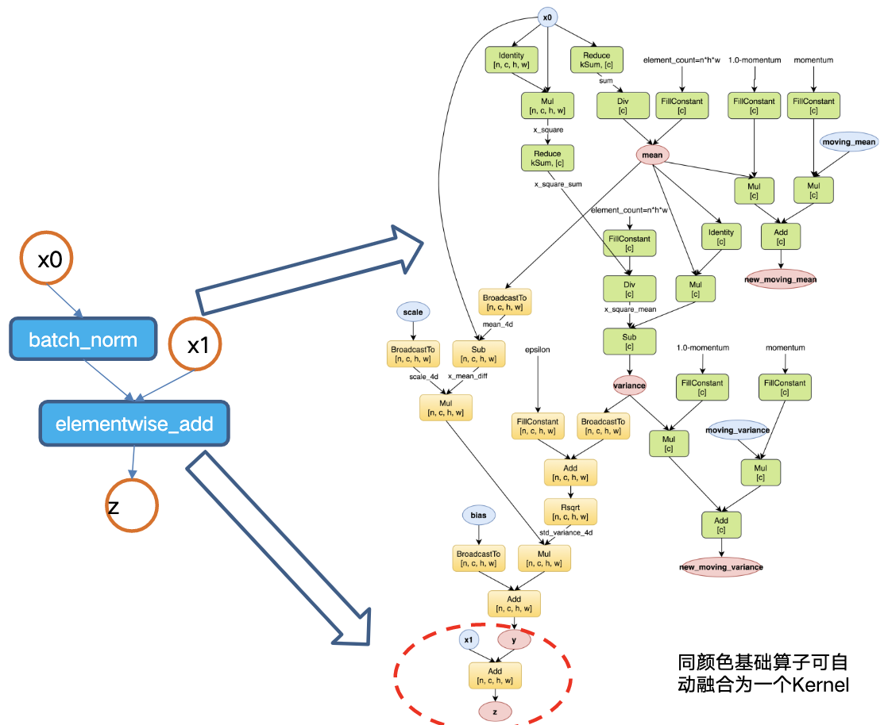

# CINN基础算子开发

> This project will be mentored by [@zhhsplendid](https://github.com/zhhsplendid) and [@thisjiang](https://github.com/thisjiang)

## 背景

[CINN](https://github.com/PaddlePaddle/CINN)是一种在不改变模型代码的条件下加速飞桨模型运行速度的深度学习编译器。CINN致力于创造训推一体自动调优、分布式编译加速等特色功能，对深度学习模型提供全自动、极致的性能优化，并在科研界和工业界建立影响力。

不同于深度学习框架算子，深度学习编译器算子的粒度更细，算子数目也更少，因此在算子融合和自动调优方面具有更大的优势。在对接上层框架时，编译器会将上层的框架算子进一步拆分为若干基础算子，这样做的目的一方面是为了减少算子开发的工作量，仅实现有限的基础算子便可以组合出大量的上层框架算子；另一方面便于算子融合技术在编译器中可以实现跨算子自动融合，减少最终执行时的kernel数目和访存开销，达到更好的性能；此外，结合自动调优技术使得编译器可以自动优化融合后的kernel，提升kernel性能。

以`batch_norm + elementwise_add`算子为例，首先，`batch_norm`算子可以被拆分为32个基础算子，而后这些基础算子又可与`elementwise_add`相融合，最终可融合为两个kernel，测试结果表明，融合后的kernel在大部分配置下性能均能优于Paddle原生。

## 主要工作
在经过充分的调研和讨论后，CINN梳理出了大概113个基础算子，其中已实现64个，再进一步排除掉涉及控制流、动态shape、复数等需要框架本身支持的算子外，仍有11个算子空缺，从开发难度上划分，由易至难分别为`negate`（取相反数）、`reciprocal`（取倒数）、`cbrt`（立方根）、`logical_right_shift`（逻辑右移）、`clz`、`popc`、`atan2`、`bitcast_convert`、`resize`、`cholesky`、`triangular_solve`。

算子开发示例情况可参考PR1018：https://github.com/PaddlePaddle/CINN/pull/1018 ，该PR从自定义函数实现及注册、算子实现、API接口、Python单测等多个维度示例了如何规范开发CINN算子。如若想详细了解CINN设计思路及算子开发介绍，可观看视频课程：[深度学习编译器算子应用与开发介绍](https://aistudio.baidu.com/aistudio/education/lessonvideo/3186683)。

## 算子语义描述
### negate
**描述：**
对输入张量逐元素取相反数，并将各个位置的输出元素保存到返回结果中。

$$ out = -x $$

**难度：**
容易

**参数：**

|  类别  |    类型     | 名称  | Shape |                    描述                     |
| :----: | :---------: | :---: | :---: | :-----------------------------------------: |
| Input  | Tensor\<T\> |   x   | shape |                  输入张量                   |
| Output | Tensor\<T\> |  out  | shape | 输出张量，数据类型以及shape均与输入张量相同 |

**支持的数据类型:**
不限制类型。理论上应包含所有数值类型，比如`int32`、`float32`等

### reciprocal
**描述：**
对输入张量逐元素取倒数，并将各个位置的输出元素保存到返回结果中。

$$ out = \frac{1}{x} $$

**难度：**
容易

**参数：**

|  类别  |    类型     | 名称  | Shape |                    描述                     |
| :----: | :---------: | :---: | :---: | :-----------------------------------------: |
| Input  | Tensor\<T\> |   x   | shape |                  输入张量                   |
| Output | Tensor\<T\> |  out  | shape | 输出张量，数据类型以及shape均与输入张量相同 |

**支持的数据类型:**
浮点数类型，比如`float32`等

### cbrt
**描述：**
对输入张量逐元素取立方根，并将各个位置的输出元素保存到返回结果中。

$$ out = \sqrt[3]{x} $$

**难度：**
容易

**参数：**

|  类别  |    类型     | 名称  | Shape |                    描述                     |
| :----: | :---------: | :---: | :---: | :-----------------------------------------: |
| Input  | Tensor\<T\> |   x   | shape |                  输入张量                   |
| Output | Tensor\<T\> |  out  | shape | 输出张量，数据类型以及shape均与输入张量相同 |

**支持的数据类型:**
浮点数类型，比如`float32`等

### logical_right_shift
**描述：**
逐元素逻辑右移算子，逐元素对第一个输入张量 x 右移 y 个位置，不同于算术右移中空出的高位用最高位（符号位）填补，逻辑右移空出的高位是用0进行的填补，并将各个位置的输出元素保存到返回结果中。

$$ out = x \ggg y $$

**难度：**
容易

**参数：**

|  类别  |    类型     | 名称  | Shape |                       描述                        |
| :----: | :---------: | :---: | :---: | :-----------------------------------------------: |
| Input  | Tensor\<T\> |   x   | shape |                     输入张量                      |
| Input  | Tensor\<T\> |   y   | shape | 输入张量，数据类型以及shape均与第一个输入张量相同 |
| Output | Tensor\<T\> |  out  | shape |    输出张量，数据类型以及shape均与输入张量相同    |

**支持的数据类型:**
整数类型，比如`int32`等

### clz (count leading zeros)
**描述：**
对输入张量逐元素统计前导零的数目，即在二进制表达下，第一个1比特位前的0比特位的数目（均包含符号位），并将各个位置的统计数目保存到返回结果中。

**难度：**
容易（提示：C和CUDA均提供了clz函数可供调用）

**参数：**

|  类别  |    类型     | 名称  | Shape |                    描述                     |
| :----: | :---------: | :---: | :---: | :-----------------------------------------: |
| Input  | Tensor\<T\> |   x   | shape |                  输入张量                   |
| Output | Tensor\<T\> |  out  | shape | 输出张量，数据类型以及shape均与输入张量相同 |

**支持的数据类型:**
整数类型，比如`int32`等

### popc (population count)
**描述：**
对输入张量逐元素统计在二进制表达下，1比特位的数目（包含符号位），并将各个位置的统计数目保存到返回结果中。

**难度：**
容易（提示：C和CUDA均提供了popc函数可供调用）

**参数：**

|  类别  |    类型     | 名称  | Shape |                    描述                     |
| :----: | :---------: | :---: | :---: | :-----------------------------------------: |
| Input  | Tensor\<T\> |   x   | shape |                  输入张量                   |
| Output | Tensor\<T\> |  out  | shape | 输出张量，数据类型以及shape均与输入张量相同 |

**支持的数据类型:**
整数类型，比如`int32`等

### atan2
**描述：**
对输入张量x、y逐元素求原点(0,0)至点(x,y)的方位角，即与横坐标轴x轴的夹角，并将各个位置的输出元素保存到返回结果中。

$$ out = \begin{cases} \arctan(\frac{x}{y}) & y > 0 \\ \arctan(\frac{x}{y}) + \pi & x \ge 0, y < 0 \\ \arctan(\frac{x}{y}) - \pi & x < 0, y < 0 \\ +\frac{\pi}{2} & x > 0, y = 0 \\  - \frac{\pi}{2}& x < 0, y = 0 \\ undefined & x = 0, y = 0  \end{cases} $$

**难度：**
中等

**参数：**

|  类别  |    类型     | 名称  | Shape |                       描述                        |
| :----: | :---------: | :---: | :---: | :-----------------------------------------------: |
| Input  | Tensor\<T\> |   x   | shape |                     输入张量                      |
| Input  | Tensor\<T\> |   y   | shape | 输入张量，数据类型以及shape均与第一个输入张量相同 |
| Output | Tensor\<T\> |  out  | shape |    输出张量，数据类型以及shape均与输入张量相同    |

**支持的数据类型:**
浮点数类型，比如`float32`等

### bitcast_convert
**描述：**
在不改变底层存储的情况下，强制转换数据类型。若转换前后数据类型的字节大小不相同，则形状会改变。比如一个`shape=[10]`的`float32`类型数据被强制转换为`float16`类型后，其`shape`应为`[10, 2]`。

**难度：**
中等（提示：可参考C++的`reinterpret_cast`）

**参数：**

|   类别    |    类型     | 名称  | Shape |                   描述                    |
| :-------: | :---------: | :---: | :---: | :---------------------------------------: |
|   Input   | Tensor\<I\> |   x   | shape |                 输入张量                  |
| Attribute |   string    | dtype |   -   | 要转换的数据类型，可与输入张量的类型相同  |
|  Output   | Tensor\<O\> |  out  | shape | 输出张量，，数据类型为dtype指定的数据类型 |

**支持的数据类型:**
理论上应包含所有数值类型，输出类型应根据`dtype`值而定

|  dtype  |    O    |
| :-----: | :-----: |
|  bool   |  bool   |
|  int32  |   int   |
|  int64  | int64_t |
| float32 |  float  |
| float64 | double  |
|   ...   |   ...   |

### resize
**描述：**
将输入图片通过指定插值方法调整为指定大小，输入图片应该是4-D张量，且形状为`[N, C, H, W]`，注意调整仅适用于H、W对应维度。

**难度：**
困难

**参数：**

|   类别    |    类型     |   名称    |        Shape         |                                                                             描述                                                                              |
| :-------: | :---------: | :-------: | :------------------: | :-----------------------------------------------------------------------------------------------------------------------------------------------------------: |
|   Input   | Tensor\<T\> |     x     |  [N, C, in_H, in_W]  |                                                                           输入张量                                                                            |
| Attribute | vector<int> | out_shape |    [out_H, out_W]    |                                                         调整后的张量大小，只需指定H、W两个维度上的值                                                          |
| Attribute |   string    |   mode    |          -           | 指定插值方法，可选项包括： **NEAREST**(最近邻插值，选取H和W维上最近的值); **BILINEAR**(双线性插值，选取H和W维上相邻四个点做线性插值). 默认值BILINEAR |
|  Output   | Tensor\<T\> |    out    | [N, C, out_H, out_W] |                                                              输出张量，数据类型与输入张量相同同                                                               |

**支持的数据类型:**
整数和浮点数类型，比如`int32`、`float32`等

### cholesky
**描述：**
对输入的对称正定矩阵计算Cholesky分解。

$$ X = \begin{cases}
U^T U, & upper=True \\
LL^T, & upper=False \\
\end{cases} $$

**难度：**
困难

**参数：**

|   类别    |    类型     | 名称  |   Shape   |                                                              描述                                                              |
| :-------: | :---------: | :---: | :-------: | :----------------------------------------------------------------------------------------------------------------------------: |
|   Input   | Tensor\<T\> |   x   | [*, M, M] |                         对称正定矩阵，其shape大小可以大于2维，但最后两个维度上的矩阵都应为对称正定矩阵                         |
| Attribute |    bool     | upper |     -     | 指定分解形式，若upper的值为True，则计算A=Transpose(U).U并返回上三角矩阵，否则计算A=L.Transpose(L)并返回下三角矩阵。默认False。 |
|  Output   | Tensor\<T\> |  out  | [*, M, M] |                                          输出张量，数据类型以及shape均与输入张量相同                                           |

**支持的数据类型:**
浮点数类型，比如`float32`等

### triangular_solve
**描述：**
计算具有唯一解的线性方程组，其中系数方阵A为上（下）三角系数矩阵。若系数方阵A不可逆，则线性方程不可解。

$$ A * X = B $$

**难度：**
困难

**参数：**

|   类别    |    类型     |     名称      |   Shape   |                                                         描述                                                          |
| :-------: | :---------: | :-----------: | :-------: | :-------------------------------------------------------------------------------------------------------------------: |
|   Input   | Tensor\<T\> |       x       | [*, M, M] |               系数方阵A，其形状应为[*, M, M]，其中*为batch维度大小，若batch非0，则每个方阵必须都可逆。                |
|   Input   | Tensor\<T\> |       y       | [*, M, K] |                        方程右侧矩阵B，其形状应为[*, M, K]，其batch维度大小必须与系数方阵相同。                        |
| Attribute |    bool     |   left_side   |     -     | 指定系数方阵是位于求解矩阵的左侧还是右侧，若left_side的值为True，则方程组形式为A * X = B否则为X * A = B。默认值True。 |
| Attribute |    bool     |     upper     |     -     |                     指定对系数方阵取上三角还是下三角，默认值True，此时方阵下三角上的值将被忽略。                      |
| Attribute |    bool     |  transpose_a  |     -     |                                       指定是否对系数方阵进行转置，默认值False。                                       |
| Attribute |    bool     | unit_diagonal |     -     |            指定是否假定系数方阵对角线上的元素都为1，若为True，则忽略方阵现有对角线上的元素。默认值Flase。             |
|  Output   | Tensor\<T\> |      out      | [*, M, K] |                                   线程方程组解矩阵，形状与方程右侧矩阵B的形状相同。                                   |

**支持的数据类型:**
浮点数类型，比如`float32`等
