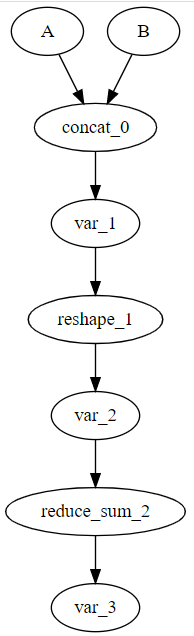

# CINN中端Pass开发

## 背景
[CINN](https://github.com/PaddlePaddle/CINN)是一种采用JIT技术加速飞桨模型运行速度的深度学习编译器。
CINN的整个Pass体系分为三层，即:前端Pass、中端Pass和c-ir Pass，这里主要介绍一下中端Pass的实现。
CINN中端Pass主要是对CINN中端表示的图进行优化，CINN前端接入模型之后，都会转换为中端的图表示。

    auto A = net_builder.CreateInput(Float(32), {32, 1, 32, 512}, "A");
    auto B = net_builder.CreateInput(Float(32), {32, 1, 32, 512}, "B");
    auto C = net_builder.Concat({A, B}, 3);
    auto D = net_builder.Reshape(C, {32, 32, 1024});
    auto E = net_builder.ReduceSum(D, {2}, false);

## 中端Graph的实现
CINN中graph的实现参考下面头文件

https://github.com/PaddlePaddle/CINN/blob/develop/cinn/common/graph_utils.h  //基类
https://github.com/PaddlePaddle/CINN/blob/develop/cinn/hlir/framework/graph.h //中端Graph的定义
https://github.com/PaddlePaddle/CINN/blob/develop/cinn/hlir/framework/node.h  //中端Node的定义

CINN的Graph表示中有两个核心的结构：Node和Edge，即节点和边。
节点又分为连个类型，Node和NodeData，其中Node表示计算，NodeData表示数据。
这里给出了如何建立图的过程:

https://github.com/PaddlePaddle/CINN/blob/develop/cinn/hlir/framework/graph.cc

## 中端Pass的开发
参考实例代码
https://github.com/PaddlePaddle/CINN/blob/develop/cinn/hlir/pass/custom_call_pass.cc
https://github.com/PaddlePaddle/CINN/blob/develop/cinn/hlir/pass/op_fusion_pass.cc

Pass的定义统一采用这种类型:

    void *Pass*(Graph* graph);

Pass开发完成后，需要进行全局的注册:

    CINN_REGISTER_HELPER(OpFusionPass) {
        CINN_REGISTER_PASS(OpFusionPass)
          .describe(
              "Op Fusion Pass which performs Ops fusion, Producer Ops are fused into Consumer Ops with certain conditions.")
          .set_change_structure(false)
          .set_body(cinn::hlir::pass::OpFusionPassInternal);
    }
    
Pass注册好以后，可以通过Pass的名字调用。
单侧Pass示例

https://github.com/PaddlePaddle/CINN/blob/develop/cinn/hlir/pass/op_fusion_pass_test.cc

模型中加入Pass的调用

https://github.com/PaddlePaddle/CINN/blob/develop/cinn/frontend/optimize.cc
