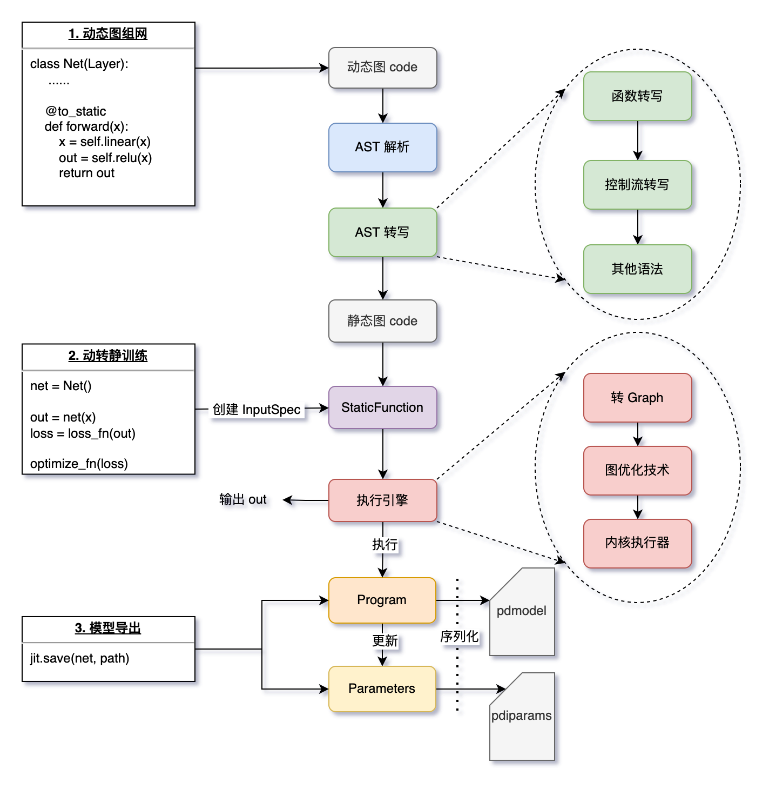

# 动转静功能扩展和旧接口退场

> This project will be mentored by [@0x45f](https://github.com/0x45f) and [@Aurelius84](https://github.com/Aurelius84)
> 

## 一、概要
### 1.背景
自飞桨从2.0版本正式切换到以「动态图」为默认执行范式后，飞桨动转静 @to_static 功能经历了若干大版本的迭代优化后，高效地支撑了用户模型导出部署、训练加速等需求。为了更好地向开发者提供更易用、完备的使用体验，并尽可能精简框架层面的接口和概念，降低使用成本，需对动转静模块的历史旧接口进行清理，并扩展部分接口功能，向更多开发者提供灵活性。

### 2.功能目标
飞将框架动转静模块旧接口退场，规范核心代码逻辑，扩展动转静 Transformer 和 API 功能。

### 3.方案要点

#### 3.1 开发原则
飞桨作为深度学习开源框架，每年会有节奏地发布新版本，因此在开发规范上有如下两点要求：
+ **版本兼容性**：对于核心功能扩展，需要注意新版本功能能够兼容旧版本；
+ **功能完备性**：所有的 Feature 功能，开发合入时须包含必要且丰富的单测，确保完备性；

#### 3.2 技术要点
此项目主要包括两个维度的要点：

+ **代码清理和规范**：清理历史版本的弃用的接口、规范动转静代码逻辑，主要为 Python 开发
+ **前后端功能扩展**：新增必要的用户接口功能，扩展已有接口功能，主要为 Python & C++ 开发

## 二、主要工作

### 1. 旧接口退场
#### 1.1 移除 ProgramTranslator 
`ProgramTranslator` 类是一个单例设计，最早期是向用户提供了一个统一的动转静开关，以及获取函数的转写 code、静态图 Program 等接口。目前此类的功能接口基本都整合进了类 `StaticFunction`，故期望能够移除 `ProgramTranslator` 类。
 
**涉及的工作主要包括**：
+ 删除 `ProgramTranslator` 类，以及内部所有接口
+ 新增类似 `paddle.jit.enable_to_static()` 接口替换实现全局开关的功能
+ 移除飞桨框架中其他模块对于 `ProgramTranslator` 类的依赖，包括但不限单测文件等

#### 1.2 移除 declarative 接口
飞桨目前的动转静核心接口是 @to_static，其代码实现是在 `jit.py` 中的 `declarative` 函数，前者是通过 paddle import 的 `alias` 别名机制实现的。因此为了更好地规范飞桨框架代码，期望将框架 `declarative` 函数名统一为 `to_static`。

**涉及的主要工作包括**：
+ 重命名 `declarative` 函数名为 `to_static`
+ 移除飞桨框架中其他模块对于 `declarative` 函数名的依赖，包括但不限于单测文件单测

#### 1.3 import 语句规范
飞桨动转静 `dygraph_to_static` 目录文件的 import 语句存在较多的冗余导入，期望能够遵循框架统一的开发规范进行优化，主要优化点在于：
```python
# 优化前：
from paddle.fluid.dygraph.dygraph_to_static.origin_info import (
    attach_origin_info,
)
from paddle.fluid.dygraph.dygraph_to_static.origin_info import (
    create_and_update_origin_info_map,
)

# 优化后：
from paddle.fluid.dygraph.dygraph_to_static.origin_info import (
    attach_origin_info,
    create_and_update_origin_info_map
)
```

### 2. 前端功能扩展
飞桨动转静 @to_static 采用 SCT（Source Code Transformer）技术路线，依赖对用户模型 Python 代码 AST 进行分析和转写，具体逻辑可参见 `dygraph_to_static` 目录下的 `xxx_transformer.py`，现期望对部分功能进行扩展，主要包括：

1. 优化 PrintTransformer 功能
  
    此 Transformer 主要针对 `Print(x)` 进行转写，会自动将其替换为飞桨的 Print 算子，实现动转静调试打印中间 Tensor 结果，但组网编译期却丢失了 print(x) 的效果。

2. 优化 PartialProgramLayer hash逻辑
  
    此Layer负责以静态子图的形式执行被 @to_static 装饰的函数，为了更好地加速，内部借助了 `hash_with_ids` 函数对 Program 进行了 hash 缓存，但由于[Python的对象id存在回收复用机制](https://stackoverflow.com/questions/52096582/how-unique-is-pythons-id)，导致存在极少数的hash 冲突问题，触发执行报错。相关 issue: [#41180](https://github.com/PaddlePaddle/Paddle/issues/41180)

3. 新增 ignore_module 接口
  
    飞桨动转静支持「仅需在最外层函数装饰 @to_static，即可实现递归转写」，具体实现在 `convert_call_func.py`。但我们并非会对所有的函数都进行 AST 转写，我们会忽略 Python built-in 和主流的库，如six、inspect、nunpy等。为了更友好地支持用户忽略其他内建库，期望提供一个 `paddle.jit.ignore_module()` 函数，支持用户自定义添加忽略的库。


### 3. 后端功能扩展
为了更好地向用户提供便捷的导出部署使用体验，飞桨正在孵化一个 Experimental 接口功能：`JITLayer`，具体用法可以参考 `test_jit_layer.py` 。目前 JITLayer 内部支持了多个内核执行器，如Exector、Predictor等。考虑到飞桨未来的技术演进路线，期望能够对JITLayer模块进行优化，主要包括：

1. 移除 Exectuor、ParallelExecutor 两个内核执行器

    即 JITLayer 移除对 Executor、ParallelExecutor两个执行器的依赖，不再支持此两个旧执行器。

2. C++端暴露AnalysisConfig给用户

    目前 Predictor 内核执行器在构造时是使用默认的 AnalysisConfig 逻辑，现期望能够将 AnalysisConfig 直接暴露给用户来灵活配置。

## 三、执行步骤建议
开发者可参考如下几个步骤来有节奏地推进工作：

1. 从优化和规范代码工作入手，了解飞桨动转静的涉及的文件目录
2. 退场 declarative 和 Transformer 功能扩展，逐渐熟悉动转静的基础原理
3. 启动前端功能扩展工作，渐入佳境
4. 进阶后端功能扩展，深入飞桨底层架构的逻辑

同时我们非常欢迎开发者发现和优化动转静模块的其他逻辑，或API功能。

## 四、总结

飞桨动转静 @to_static 功能是跨越动态图和静态图的一座重要「桥梁」，同时涉及了飞桨框架动、静态图的技术设计和模块功能，是一个了解飞桨框架整体架构设计的非常好的切入点。而且动转静 @to_static 核心接口是在 Python 端实现，对于新手非常友好，很适合由浅入深。
