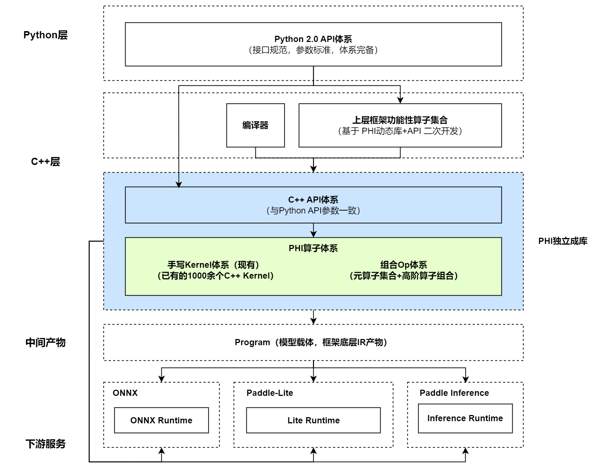
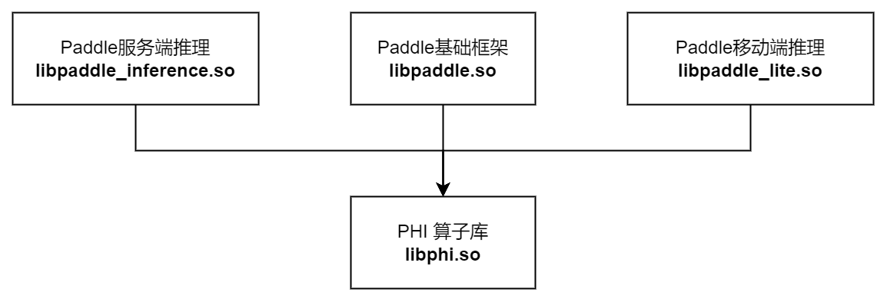

# 飞桨算子体系重构 - PHI算子库独立编译

> This project will be mentored by [@chenwhql](http://github.com/chenwhql), [@YuanRisheng](https://github.com/YuanRisheng) and [@zyfncg](https://github.com/zyfncg)

> Tracking Issue: [PaddlePaddle/Paddle#47615](https://github.com/PaddlePaddle/Paddle/issues/47615)

## 1. 背景与目标

### 1.1 为什么需要 PHI ？

飞桨在近几年发展迅速，基础框架的使用体验与生态建设均取得了长足的进步，特别是算子体系作为整个框架生态的基础，占据一半以上的框架代码，是整个基础框架迭代和维护的重点，飞桨自 2.0 版本发布了新的Python API体系，在后续几个版本中也在不断地扩充API，提升框架算子的完备度和使用体验，这些本质上都是围绕框架算子体系所开展的工作。

但在高速发展的同时，也积累了一些问题，由于要考虑对基于过去版本（飞桨1.x）实现模型的兼容，飞桨 2.x 的算子体系在规范性、一致性、易用性、可维护性等诸多层面都存在着不少历史问题。整体来讲，可以概括为两大方面的问题：
1. 原 Fluid 算子体系经过长时间的迭代，机制变得复杂，存在诸多易用性问题与不规范之处，维护成本高；
2. 飞桨框架生态有多套算子体系，各算子体系重复建设，体系之间各自转换，同时还需要保证转换前后的功能一致性，维护成本高。

着眼于飞桨框架的长远发展，我们需要通过重构去解决这些历史问题，自 2021 年秋季起，我们开始着手重构基础框架的算子体系。针对原 Fluid 算子体系中的诸多问题，我们设计了新的 PHI 算子体系。
> 注：关于 PHI 的设计可以参考 [《飞桨高可复用算子库 PHI 设计文档》](https://github.com/PaddlePaddle/docs/blob/develop/docs/design/phi/design_cn.md)，此处不展开介绍。

在经过将近一年的建设之后，我们取得了显著的进展，PHI 算子库已经涵盖了所有 Python 2.x 正在使用的运算类 API 关联的算子，达到了相对完备的状态，我们也仍在继续解决剩余的历史问题。

### 1.2 我们想要怎样的一个算子体系 ？

下图是我们期望的一个比较合理的算子体系的形态：

1. 函数式算子库 PHI ，解决诸多易用性问题和维护成本高的问题；
2. 算子体系统一，同时从框架中解耦；PHI 算子库作为基础组件，同时服务于基础框架及下游的多个执行体系。




当前距离这个目标状态仍有很多工作要做。

### 1.3 为什么 PHI 需要独立编译 ？

在目标算子体系中，PHI 需要是一个独立存在的库，上层不同执行体系可以分别链接 PHI 进行上层开发，这其中也包含飞桨移动端推理框架 Paddle-Lite。将 Paddle-Lite 整合到主框架是接下来我们要推进的一项重要工作，为什么需要整合呢？

1. Paddle-Lite 维护有独立的算子体系，但由于 Paddle 和 Paddle-Lite 都需要执行 Paddle 训练后保存的模型，只是执行的环境不同，因此 Paddle-Lite 中的数百个算子需要和 Paddle 主框架中相应算子保持一样的计算语义，才能保证模型在移动端推理结果的正确性。经过这几年的生态工作，我们意识到这个维护成本是极高的，不仅需要投入两批人员持续维护，且如果 Paddle 主框架算子升级没有及时同步给 Paddle-Lite 维护同学的话，会造成下游移动端模型推理出错，影响稳定性与使用体验。
2. Paddle-Lite 中的部分算子实现是可以复用 Paddle 主框架算子实现的，比如 x86 相关算子的实现，目前这部分工作是重复开发的，人效不高。

因此，将 Paddle-Lite 整合至 Paddle 主框架有利于降低维护成本，提升产品稳定性。

但将 Paddle-Lite 整合至主框架是依赖于 PHI 首先可以作为独立编译对象存在的，Paddle-Lite 在移动端使用，对库体积的要求是非常苛刻的，不可能带着庞大的 Paddle 主框架一起编译，因此它**要求 PHI 不仅可以独立于主框架进行编译，而且还需要支持极致的裁剪，极致体验下 PHI 需要裁剪至仅剩余当前模型需要的算子，以达到库体积最小化的目标**。

因此，未来 Paddle 基础框架和 Paddle-Lite 的动态库依赖关系需要是下图所示的状态：



### 1.4 当前 PHI 与 Fluid 的解耦程度如何 ？

当前 PHI 和 Fluid 仍然是整合编译为 libpaddle.so 的，并没有单独拆分出来。但由于在 PHI 设计初期就有独立编译的计划，因此前期做了很多的基础数据解耦和替换的工作，在建设过程中也相对注重与 Fluid 的依赖关系的解耦，并且也在 CI 中加入了对于 PHI 依赖 Fluid 代码的拦截，现在合入的代码若引入了 PHI 对 Fluid 的反向依赖，会在 PR-CI-APPROVAL 中提示：

```
You must have one RD (chenwhql, YuanRisheng or zyfncg) approval for the including paddle/fluid header in paddle/phi files.
```

但 Paddle 毕竟是一个数百人协同开发的工程，每个阶段也不止一个目标要完成，由于各种因素中途还是引入了很多 PHI 反向依赖 Fluid 的情况，因此我们需要成立专项去解耦依赖关系，并且最终产出 PHI 独立编译的库 libphi.so 。


## 2. 主要工作

> 注：该项目的执行需要对框架组件关系有一定的了解，也存在一定的学习成本。

当前 PHI 解耦独立编译基本可以分为以下两个阶段的工作。

### 2.1 头文件依赖解耦

首先，paddle/phi 目录下仍然有许多文件在 include paddle/fluid 目录下的文件。

基于本文撰写时 Paddle repo 的最新 commit d5e7d20 在 paddle/phi 下搜索 `#include "paddle/fluid` 并去掉 tests 子目录，可以匹配到 355 个文件中包含 583 个结果，首要任务就是要将这 583 个 include 去掉。

这些 include 中包含三类不同的情况，难度也依次提升：

1. 可以直接移除或替换为 include PHI 下的头文件（简单）。例如：

```c++
// paddle/phi/common/scalar.cc
#include "paddle/fluid/platform/place.h"
// 可以直接替换为
#include "paddle/phi/common/place.h"
```

这里可以直接替换头文件，并将代码中相应的用法更新。因为持续有 CI 监控存在，这样的情况相对比较少。

2. 需要将 paddle/fluid 中相关的基础组件迁移至 paddle/phi 中合适的位置（中等）。例如：

```c++
// paddle/phi/kernels/gpu/accuracy_kernel.cu
#include "paddle/fluid/platform/device/gpu/gpu_primitives.h"
```

这里需要将该头文件迁移至 paddle/phi/backends/gpu 目录下，更新 namespace 并全局替换 include 关系这个过程会比较繁琐，也是存在最多的一种情况。

3. 需要在 PHI 下实现新的更简洁的模块以替换掉原先功能（复杂）。例如：

```c++
// paddle/phi/kernels/gpu/add_n_kernel.cu
#include "paddle/fluid/memory/malloc.h"
```

这里是一个比较复杂的依赖场景，一些代码依赖了这个头文件中的内存分配接口，而这个头文件依赖的接口无法直接迁移到 paddle/phi ，因为这套接口深度依赖了 Fluid 下内存分配的体系，这个体系的迁移本身会让 PHI 解耦 Fluid 这件事变得意义不大，相当于基本把 Fluid 改成 PHI 了。而且训练框架需要适配重吞吐的场景，需要兼顾显存资源的使用峰值，有很多复杂的内存管理和分配策略，而这对于数据少，重调度性能的推理场景是有负收益的，因此内存分配体系需要上层执行体系根据自己的场景需求设计并接入到 PHI 中。

因此这类依赖的解耦当前是比较困难的，需要对飞桨基础框架有比较深入的理解才容易执行，最终可能需要在 PHI 中封装出一套驱动接口，接入 PHI 使用的上层执行体系需要根据场景需求实现这些驱动接口。

以上三种情况，有兴趣的同学可以从情况1、2入手开始参与。

### 2.2 PHI 独立编译

当头文件的依赖清理完毕，我们可以修改当前 Paddle 的编译方式，将 PHI 作为独立的 Library 对象进行编译，这需要对于编译原理和 CMake 语法比较熟悉的同学先设计编译改动方案，经过飞桨研发工程师和社区开发者一起评审后再推进执行。

### 3. 执行步骤建议

具体地，个人觉得此项工作可以按以下几个步骤推进：

1. 依赖头文件的归类拆分。目前虽说有 583 个 include 存在，但是实际上有很多头文件的依赖是同质化的，经过分析和归类，应该可以归纳为数十个相对具体的子任务，例如，可能形成以下子任务：

- Device相关组件迁移解耦
- Enforce相关组件迁移解耦
- Tensor相关组件迁移解耦
- Profiler相关组件迁移解耦
- ......

2. 由易到难，优先推进情况1&2的各项子任务，预计每个子任务都需要一定的周期，因为改动涉及面是比较广的。

3. 【困难】设计实现相应的驱动与接口模块，推进情况3中各项子任务的迁移解耦。

4. 【困难】设计 PHI 编译解耦的方案，通过评审拆分 PHI 独立编译。

当然，这只是一种可能的执行路径，具体如何达成目标可以集思广益。

## 4. 总结

算子体系是深度学习框架系统的根基，具备架构简洁合理的算子体系是一个深度学习框架产品长远发展的基石，非常欢迎大家共同参与到飞桨算子体系重构的工作中来。
