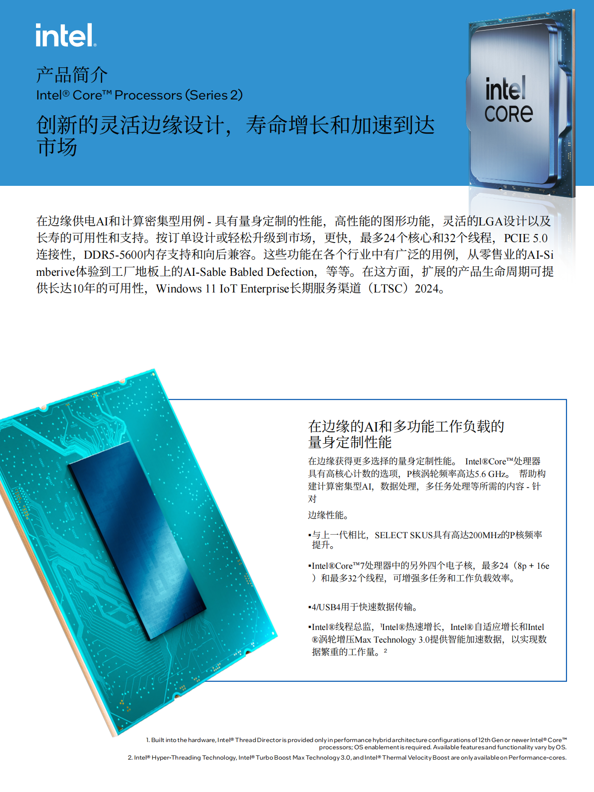

## 任务的产业应用背景

广大需要产品出海的企业，其市场营销部人员期望将做好的中文版产品介绍PDF，在**保留原来排版格式**的情况下，一键翻译为英文、日语或其它指定语言，极大节省人力编辑成本。

## 任务验收标准
1. 中英翻译准确度要＞95%，用户仅需简单校对即可使用
2. 翻译后的文档格式为PDF，不要求100%还原排版，达到90%以上的排版还原度，用户仅需手动微调排版即可使用
3. 翻译后的文档中，图片、图表、公式不被翻译，但需要被正确识别并保留在文档中
4. 翻译后的文档中，表格中的文字需要被翻译，但表格样式（如边框、背景色等）需要保持不变
5. 翻译后的文档中，超链接需要被正确识别并保留，但链接文本需要被翻译
6. 翻译后的文档中，页眉、页脚、页码等元素需要被正确识别并保留，但其中的文字需要被翻译
7. 翻译后的文档中，目录需要被正确识别并保留，但目录中的文字需要被翻译
8. 必须应用PaddleOCR 中的PP-OCRv5来实现文字识别，或PP-StructureV3来实现文档解析
9. 必须应用ERINE 4.5 系列开源大模型实现翻译和审校
10. 提供GUI界面，用户可以一键上传PDF，一键翻译，一键下载翻译后的PDF
期望效果示例：

| 输入 | 输出 | 
| --- | --- |
|  |  | 

## 任务输出要求
1. 以Jupyter Notebook形式提交PR到https://github.com/PaddlePaddle/ERNIE/tree/develop/cookbook/PDF-translation-tool
2. 自定义的类/函数等，以.py文件形式连同main.ipynb一起提交PR
3. 提交PR时，请在PR标题中标明[WIP] PDF Translation Tool
4. 提交PR前，请到[星河社区](aistudio.baidu.com)完成整个项目的调试和运行，确保无bug，并公开项目链接。链接与代码一起提交到PR中，方便审核人员检查。

## 技术参考
1. Document Translation：https://github.com/PaddlePaddle/ERNIE/blob/develop/cookbook/notebook/document_translation_tutorial_en.ipynb

## 开发提示：
+ 鼓励参与者深度使用Claude Code、Cursor、Comate...等AI智能体编程工具来开发此项目
+ 在完成星河社区的中文版 Jupyter Notebook 后，鼓励大家使用AI大模型，面向native english speaker来翻译制作英文版的Jupyter Notebook