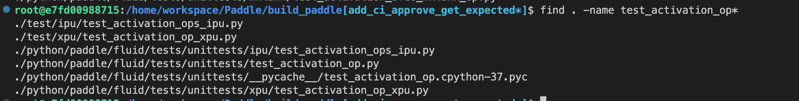
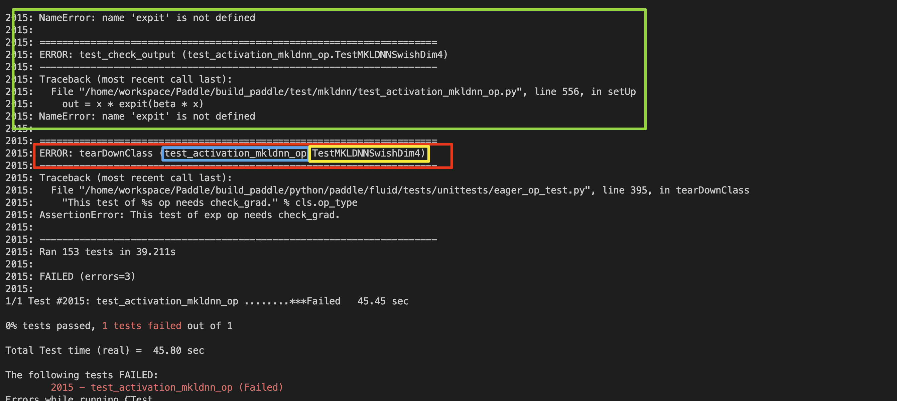
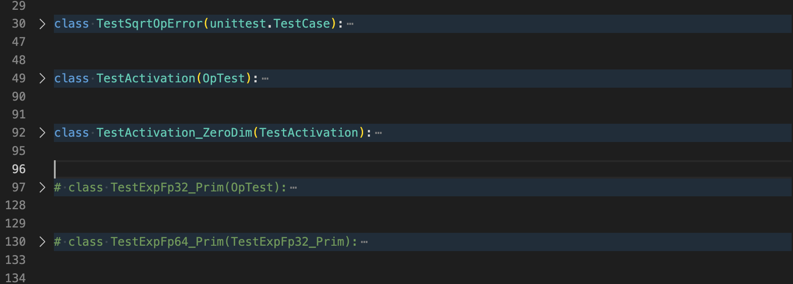

# 算子定义生成体系建设--静态图算子自动生成-第二期
## 问题描述
> This project will be mentored by [@heavyrain-lzy](https://github.com/heavyrain-lzy)，[@zyfncg](https://github.com/zyfncg)

大家好，目前飞桨的算子已十分丰富，能够满足众多用户需求，但另一方面，繁多的算子给框架的维护和开发带来了困难。为了规范静态图算子的定义方式加快算子开发流程，飞桨建立了一套自动代码生成体系。但目前并没有将所有的算子清理完毕，这里筛选出部分简单的算子，欢迎大家一起提交清理。任务目标是清理`legacy_ops.yaml` `legacy_backward.yaml`中的OP的配置**并将原始手写的算子实现进行删除,也就是删除对应的`xxx_op.cc`和`xxx_sig.cc`文件或者文件的一部分**。前期已经开展过一次开源任务，详见[框架静态图算子自动生成](https://github.com/PaddlePaddle/Paddle/issues/51842),本次第二期的算子开发任务难度普遍增大，建议参加过第一期的同学来认领该任务，如果没有参加过第一期的开源任务的同学也想认领该工作，建议先参考第一期任务进行学习，其中相关的PR有大量详细的review意见，强烈建议学习。在第一期里列出的学习建议，这里不再重复描述。

### 任务列表

|任务序号|算子名|困难程度|基本说明|移动到Ops.yaml|新增到static_ops.yam|xxx_op.cc|xxx_sig.cc|
|-------|----|-------|-------|-------------|-------------------|---------|-----|
|1|transpose|中等|transpose2；GetExpectedKernelType保持手写,组合算子|否|是|部分|部分|
|2|abs|容易|增加support_trans_dtype， 组合算子|是|否|全部|全部
|3|add_n|困难|sum_op.cc;GetExpectedKernelType保持手写;增加VarTypeInferece函数|否|是|全部|全部
|4|batch_norm|困难|GetExpectedKernelType保持手写； GetKernelTypeForVar含有MKLDNN，下沉到kernel|是|否|全部|保留
|5|sync_batch_norm_|困难|GetExpectedKernelType保持手写； GetKernelTypeForVar含有MKLDNN，下沉到kernel|是|否|全部|保留
|6|bincount|简单|GetExpectedKernelType保持手写|否|是|全部|全部
|7|cast|中等|GetExpectedKernelType保持手写，组合算子|是|否|全部|全部
|8|concat|中等|组合算子|是|否|全部|全部
|9|expand|容易|expand_v2_op.cc|是|否|全部|全部
|10|exponential_|容易|grad invoke|是|否|全部|全部
|11|gather|中等|组合算子|是|否|全部|全部
|12|lstsq|容易|常规开发|是|否|全部|全部
|13|matmul|困难|matmul_v2_op.cc;complex类型提升； GetKernelTypeForVar含有MKLDNN，下沉到kernel;组合算子|否|是|全部|保留
|14|repeat_interleave|困难|repeat_interleave和repeat_interleave_with_tensor_index融合为一个配置|否|是|全部|保留
|15|repeat_interleave_with_tensor_index|困难|repeat_interleave和repeat_interleave_with_tensor_index融合为一个配置|是|否|全部|全部
|16|shape|中等|GetKernelTypeForVar需要修改kernel文件|是|否|全部|全部
|17|strided_slice|中等|关注GetExpectedKernelType;组合算子|是|否|全部|全部
|18|tile|容易|组合算子|是|否|全部|全部
|19|triangular_solve|容易|常规开发|否|是|全部|全部
|20|tril|困难|tril和tril组合为triltriu一个op|否|是|全部|全部
|21|triu|困难|tril和tril组合为triltriu一个op|是|否|全部|全部
|22|group_norm|容易|常规开发|是|否|全部|全部
|23|norm|容易|常规开发|是|否|全部|全部
|24|prior_box|容易|常规开发|否|是|全部|保留
|25|split|困难| split和split_with_num组合为一个op；GetKernelTypeForVar含有MKLDNN，下沉到kernel;关注InferShape|否|是|全部|保留
|26|split_with_num|困难| split和split_with_num组合为一个op；GetKernelTypeForVar含有MKLDNN，下沉到kernel;关注InferShape|是|否|全部|全部
|27|einsum|容易|常规开发|否|是|全部|全部
|28|full_like|中等|fill_any_like_op.cc容易;GetKernelTypeForVar需要修改kernel文件|否|是|全部|全部
|29|fill|中等|常规开发|否|是|全部|部分
|30|pool2d|困难|pool_op.cc;GetExpectedKernelType保持手写； GetKernelTypeForVar含有MKLDNN，下沉到kernel|否|是|全部|部分
|31|pool3d|困难|pool_op.cc;GetExpectedKernelType保持手写； GetKernelTypeForVar含有MKLDNN，下沉到kernel|是|否|全部|全部
|32|check_finite_and_unscale_|容易||是|否|全部|全部
|33|coalesce_tensor|中等|关注InferShape|是|否|部分|部分
|34|conv2d|困难|conv_op.cc;GetExpectedKernelType保持手写； GetKernelTypeForVar含有MKLDNN，下沉到kernel|是|否|部分|部分
|35|conv3d|困难|conv_op.cc;GetExpectedKernelType保持手写； GetKernelTypeForVar含有MKLDNN，下沉到kernel|是|否|部分|部分
|36|depthwise_conv2d_transpose|困难|conv_op.cc;GetExpectedKernelType保持手写； GetKernelTypeForVar含有MKLDNN，下沉到kernel|是|否|部分|部分
|37|conv2d_transpose|困难|conv_transpose_op.cc;GetExpectedKernelType保持手写； GetKernelTypeForVar含有MKLDNN，下沉到kernel|是|否|部分|部分
|38|conv3d_transpose|困难|conv_transpos_op.cc;GetExpectedKernelType保持手写； GetKernelTypeForVar含有MKLDNN，下沉到kernel|是|否|部分|部分
|39|depthwise_conv2d_transpose|困难|conv_transpos_op.cc;GetExpectedKernelType保持手写； GetKernelTypeForVar含有MKLDNN，下沉到kernel|否|是|全部|全部
|40|softmax|中等|GetExpectedKernelType保持手写； 组合算子|否|是|全部|全部
|41|pad3d|中等|GetExpectedKernelType保持手写； GetKernelTypeForVar含有MKLDNN，下沉到kernel;组合算子|是|否|全部|全部
|42|multiclass_nms3|困难|multiclass_nms_op.cc;关注InferShape；GetExpectedKernelType保持手写|是|否|部分|部分
|43|box_coder|容易|常规开发|否|是|全部|全部
|44|edit_distance|容易|常规开发|是|否|全部|全部
|45|instance_norm|容易|GetExpectedKernelType保持手写|是|否|全部|全部


### 任务列表说明
1. **基本说明**：这列会注明算子的基本信息

    a. **常规开发**：表示该算子难度容易，一般直接移动配置即可

    b. **文件名说明**：有些算子会附加一个名字，如**add_n**中写了**sum_op.cc**,表示这个算子的yaml名字和真实的名字不一致，需要增加映射；参考[frobenius_norm PR49772](https://github.com/PaddlePaddle/Paddle/pull/49772)

    c. **GetExpectedKernelType保持手写**：表示该算子的**GetExpectedKernelType**较为复杂难以自动生成，需要保持手写,并进行相应的封装，并在`op_compat.yaml`中增加`get_expected_kernel_type`配置；参考[PR51453](https://github.com/PaddlePaddle/Paddle/pull/51453)

    c. **GetKernelTypeForVar含有MKLDNN，下沉到kernel**：表示该算子的**GetKernelTypeForVar**较为复杂难以自动生成，需要下沉到kernel中；参考[PR51073](https://github.com/PaddlePaddle/Paddle/pull/51073)，将**GetKernelTypeForVar**的逻辑写到了`onednn/interpolate_kernel.cc`.

    d. **增加support_trans_dtype**：这些算子原始的yaml配置缺失**support_trans_dtype**配置，需要新增。

    e. **增加VarTypeInferece函数**：表示算子的**VarTypeInferece函数**的函数不能删除，需要在`filter.py`中的`get_infer_var_type_func`增加；参考[matrix_nms](https://github.com/PaddlePaddle/Paddle/pull/52479),参考[PR52274](https://github.com/PaddlePaddle/Paddle/pull/52274)

    e. **组合算子**：表示算子是组合算子基础算子，对应的`backward`需要增加`composite`配置；参考[PR51940](https://github.com/PaddlePaddle/Paddle/pull/51940)

    f. **关注InferShape**：表示该算子的`InferShape`函数较为复杂，可能不能直接用`InferMeta`直接替换

2. **`移动到ops.yaml/backward.yaml`**:这列表示对应的算子配置需要从`legacy_ops.yaml/legacy_backward.yaml`中移动到`ops.yaml/backward.yaml`,并把原来的配置删除。其中，如果算子有`backward`配置，就需要修改对应的`backward.yaml`文件。‼️ **注意原始的yaml配置不一定完整，需要对比`xxx_op.cc`中的代码进行重新完善yaml配置。尤其是kernel的data_type**

3. **`新增到static_ops.yaml/static_backward.yaml`**:这列表示对应的算子配置动态图和静态图不一致，需要从`legacy_ops.yaml/legacy_backward.yaml`中拷贝到`static_ops.yaml/static_backward.yaml`,保留原来`legacy_ops.yaml/legacy_backward.yaml`中的配置，并在依据静态图算子的原始算子定义，在`static_ops.yaml/static_backward.yaml`完善算子配置。‼️ **注意原始的yaml配置不一定完整，需要对比`xxx_op.cc`中的代码进行重新完善yaml配置。尤其是kernel的data_type**

4. **删除xxx_op.cc**：对应的`全部`表示删除整个文件;`部分`表示这个文件中还有其他算子的OP，只能删除一部分代码

5. **删除xxx_sig.cc**：对应的`全部`表示删除整个文件;`部分`表示这个文件中还有其他算子的OP，只能删除一部分代码;`保留`表示这个算子的`signature`无法自动生成，需要保留文件，并在`op_compat.yaml`中增加`manual_signature`配置；参考[PR52512](https://github.com/PaddlePaddle/Paddle/pull/52512)

### 附录说明

### yaml通用配置说明(xxx_ops.yaml和xxx_backward.yaml)

|配置选项|含义|可选性|
|---------------------|----|----|
|- op : abs|OP name|必须
|forward|grad对应的前向OP，只在xxx_backward.yaml中配置|可选
|composite|grad拆分配置项，只在组合算子的xxx_backward.yaml中配置|可选
|invoke|该Op可以直接复用其他op|可选
|args|op参数，注意参数的默认值要和对应的xx_op.cc对应|必须
|outputs|output|必须
|optional|带有AsDispensiable属性的输入输出(表示参数可选)|可选
|intermediate|带有AsIntermediate属性的输出(表示该参数只在对应的grad使用)|可选
|no_need_buffer|不需要分配内存的输入输出，对应DECLARE_NO_NEED_BUFFER_VARS_INFERER|可选
|inplace|tensor原位替换，静态图对应DECLARE_INPLACE_OP_INFERER。动态图会生成两个API(如ceil和ceil_)|可选
|view|仅影响动态图，表示共享内存，但是会改变访问顺序(这个配置要配合inplace一起配置)|可选
|infer_meta :<br>func : GaussianInferMeta<br>param : [shape, mean, std, seed, dtype]|InferMeta函数配置，其中二级配置func必须配置，param如果和args一致可省略，静态图对应DECLARE_INFER_SHAPE_FUNCTOR|必须
|kernel :<br>func : gaussian<br>param : [shape, mean, std, seed, dtype]<br>data_type : dtype<br>backend : place|kernel函数配置，其中二级配置func必须配置，param如果和args一致可省略，data_type一般必须配置，backend按需配置，静态图对应GetExpectedKernelType|必须
|data_transform :<br>support_trans_dtype : start, end, step<br>skip_transform : x|输入Tensor Transform的配置，二级配置support_trans_dtype表示tensor,对于dtype也要转换；skip_transform表示tensor不需要组transform|
|support_dygraph_mode|表示是否支持动态图，只用于分布式融合算子fused_xxx.yaml|


#### op_version.yaml配置说明
| op_version.yaml | 含义  |    |
|---|---|---|
|- op : version :|固定格式|
|- checkpoint|AddCheckpoint的comment，一个算子可能有多个checkpoint
|action|一个checkpoint对应一个action
|- add_input <br>comment <br>default|对应的NewInput；default按需配置|
|- delete_input<br>comment<br>default|对应的DeleteInput；default按需配置
|- modify_input<br>comment<br>default|对应的ModifyInput；default按需配置
|- add_output<br>comment<br>default|对应的NewOutput；default按需配置
|- delete_output<br>comment<br>default|对应的DeleteOutput；default按需配置
|- modify_output<br>comment<br>default|对应的ModifyOutput；default按需配置
|- add_attr<br>comment<br>default|对应的NewAttr；default按需配置
|- delete_attr<br>comment<br>default|对应的DeleteAttr；default按需配置
|- modify_attr<br>comment<br>default|对应的ModifyAttr；default按需配置
|- fix_bug<br>comment | 对应BugfixWithBehaviorChanged


#### op_compat.yaml主要配置说明

|op_compat.yaml配置选项|含义|可选性|
|---|---|---|
|- op : abs|固定格式，如果有op_name名映射(对应的sig文件中有<br>PD_REGISTER_BASE_KERNEL_NAME(size, numel);)，需要加上括号，- op : numel(size)|必须
|backward : abs_grad|如果有backward，配置反向名字。同样存在名字映射，如backward : topk_grad (top_k_v2_grad)|按需
|inputs :|inputs参数名字映射，如果有多个用{}，只有在`Maker()`成员函数中参数名和`ops.yaml`不一致时才需要(一般都需要)|按需
|outputs :|outputs参数名字映射，如果有多个用{}，只有在`Maker()`成员函数中参数名和`ops.yaml`不一致时才需要(一般都需要)|按需
|attrs :|attrs参数名字映射，如果有多个用{}，只有在`Maker()`成员函数中参数名和`ops.yaml`不一致时才需要(**一般不需要**)。注意：Tensor类型的参数定义为`inputs`或`outputs`,其他类型的参数定义为`attrs` |按需
|extra :<br>   attrs : [bool use_mkldnn = false]<br> outputs : [xshape]|一些硬件相关的配置(一般无需关心)|按需
|int_array:<br>axis :<br>data_type : int<br>support_tensor : true<br>shape :<br>data_type : int<br>tensor_name : Shape<br>tensors_name : ShapeTensor|配置IntArray特殊参数(axis和shape是对应的两种配置)，可参考[PR48792](https://github.com/PaddlePaddle/Paddle/pull/48792)|按需
|scalar :<br>    rtol :<br>      data_type : std::string<br>      tensor_name : Rtol<br>   axis:<br>      data_type : int<br>      support_tensor : true|配置Scalar特殊参数(rtol和axis是两种不同的配置)，可参考[PR48792](https://github.com/PaddlePaddle/Paddle/pull/48792)|按需
|complex_promote : [X, Y]|表示复数的参数类型提升，参见[kron](https://github.com/PaddlePaddle/Paddle/pull/50611)|
|drop_empty_grad : [input_grad]|支持Apply()中 grad_op->SetOutput(framework::GradVarName("X"),this->InputGrad("X", false));的生成，参见[broadcast_tensors](https://github.com/PaddlePaddle/Paddle/pull/49906)|
|manual_signature : [embedding_grad]|manual_signature后面的op或者grad的signature不支持自动生成，不需要删除原来的sig相关的代码|
|get_expected_kernel_type :<br>frobenius_norm : GetReduceExpectedKernelType<br>frobenius_norm_grad : GetReduceGradExpectedKernelType|这里表示GetExpextedKernelType较为特殊(通常是又有MKLDNN宏控制)，不支持自动生成，需要在get_expected_kernel_func.cc中手写相关函数GetReduceExpectedKernelType和GetReduceGradExpectedKernelType。参见[frobenius_norm](https://github.com/PaddlePaddle/Paddle/pull/51453)


#### 个人调试经验

这里结合自己的开发经验和开源社区的反馈，给出一些开发建议。
确保编译选项开启`-DWITH_TESTING=ON`,本地在build目录下运行相关单测
```
ctest -R test_xxx_op -V
```
如果执行没有错误，就可以尝试提交PR。当然，你也可以CMake执行成功后，对比自动生成的代码和原始代码无差异后通过CI进行检查自己的错误。

##### 调试过程
1. 测试出错，本地调试


    a. 找到错误的单测文件

    目前的单测文件基本都移动到了./test/路径下，也存在部分单测在python/paddle/fluid/tests/unittests，可以在build目录下使用find找到对应的单测文件
    

    b. 注释一部分单测，找到真正的错误单测
    可以根据运行ctest -R test_xxx_op -V后的报错信息快速找到真实报错的单测用例，如：
    
    上图中绿框是简单的报错原因，蓝色是单测文件，黄色框是具体的单测用例。也可以手动找出具体报错的单测用例。打开单测文件test_activation_op.py，会发现里面有许多单测用例，注释其余单测。
    
    然后继续运行ctest -R test_activation_op -V
    直到找到真实报错的那个单测，并将其他的单测全部注释。
2. 开启log，查找错误信息
找到真实报错的单测后，并将其他的单测全部注释，可以开启log进行单测。
```
GLOG_v=6 ctest -R test_xxx_op -V //这里的log级别越高log越详细
// GLOG_v=6 ctest -R test_xxx_op -V > log.txt 也可以将log重定位到文件
```
3. 调试修改
根据报错信息修复相关文件后就可以重新编译测试，注意这时可以直接在build目录下执行
```
make -j$(nproc) copy_libpaddle
```
指定target copy_libpaddle，可以防止build目录下的自己修改后的单测文件被重新覆盖。

4. 静态图代码自动生成的调试策略
本任务的本质是"使用自动生成的代码替换原始的手写文件"，所以一旦测试出现问题，那么首先再次去对比原始的手写文件和自动生成的代码的区别。

    a. 如果是自己的配置错误，如参数名不对应，GetExpectedKernelType没有设置data_type、参数的optional、intermediate没有配置、inplace、no_need_buffer缺失等，那就需要增加相应的yaml配置，因为很多原始的op的yaml配置并不完整，所以直接复制原始的yaml很可能出现问题。
    b. 如果确认基本参数配置无误，那么很有可能是InferMeta函数无法直接替换InferShape，建议如下进行测试
    
        a. 如果原始op有InferShape成员函数，就拷贝到对应自动生成的Op内
        b. 删除REGISTER_OPERATOR注册的xxxInferShapeFunctor这行代码
        c. 在build目录直接make构建(切勿重新CMake)
        ```
        make -j$(nproc) copy_libpaddle
        ```
        d. 重新进行单测
        e. 如果恢复正常，就表明需要修改InferMeta函数或者新增InferMeta函数，参考第4部分InferShape进行修改
5. CI报错分析
paddle的CI十分多，但是有助于我们调试代码的并不多，这里建议从一下CI报错信息入手：

    a. PR-CI-PY3:这里执行的CPU的单测，这里的报错信息，跟本地跑单测很类似

        a. CMake阶段出错：可能是yaml配置不符合规范；删除了源文件但是没有在相关CMake文件中删除依赖
        b. test阶段出错：可以看具体的报错信息，如参数找不到，默认值等
    b. PR-Static-check:这是检查op接口、API说明文档，这个PR会给出修改后的op的接口参数信息，原则上接口要和原来的接口一致。

    c. PR-Coverage：通过执行开启GPU后的单测，检查代码的覆盖率。这里是比PY3更严格的检查，输出信息和PY3类似。
