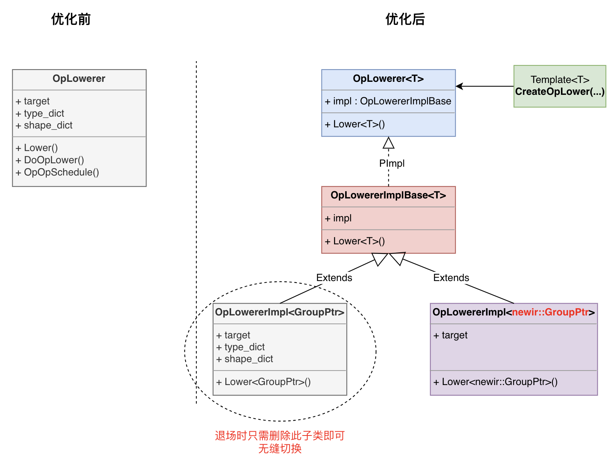

# 三、前端表示
> 本文文档作者： @Aurelius84
> 界定「前端」的边界、阐释前端表示的具体形式、承载的角色，已知的问题，涉及的技术点

- [三、前端表示](#三前端表示)
  - [1. 输入输出](#1-输入输出)
  - [2. 核心模块](#2-核心模块)


## 1. 输入输出

给予 CINN 前端的基本单元是cinn_op.GroupOp，内含了此 Group 中待优化的「算子组合」，且这些算子均可以被CINN参与优化（因为已经经过BuildCinnPass筛选），如下是Softmax 样例中传递给 CINN 前端的输入：

```c++
# op_with_group_merge_pass.cc:663 group：id_6, Groupkind	3

 (%0) = "cinn_op.reduce_max" (%1) {dim:[(Int64)-1],keep_dim:true,stop_gradient:[false]} : (pd_op.tensor<64x128xf32>) -> pd_op.tensor<64x1xf32>
 (%2) = "cinn_op.broadcast" (%0) {broadcast_axes:[(Int64)0,(Int64)1],out_shape:[(Int64)64,(Int64)128],stop_gradient:[false]} : (pd_op.tensor<64x1xf32>) -> pd_op.tensor<64x128xf32>
 (%3) = "pd_op.subtract" (%1, %2) {stop_gradient:[false]} : (pd_op.tensor<64x128xf32>, pd_op.tensor<64x128xf32>) -> pd_op.tensor<64x128xf32>
 (%4) = "pd_op.exp" (%3) {stop_gradient:[false]} : (pd_op.tensor<64x128xf32>) -> pd_op.tensor<64x128xf32>
 (%5) = "cinn_op.reduce_sum" (%4) {dim:[(Int64)-1],keep_dim:true,stop_gradient:[false]} : (pd_op.tensor<64x128xf32>) -> pd_op.tensor<64x1xf32>
 (%6) = "cinn_op.broadcast" (%5) {broadcast_axes:[(Int64)0,(Int64)1],out_shape:[(Int64)64,(Int64)128],stop_gradient:[false]} : (pd_op.tensor<64x1xf32>) -> pd_op.tensor<64x128xf32>
 (%7) = "pd_op.divide" (%4, %6) {stop_gradient:[false]} : (pd_op.tensor<64x128xf32>, pd_op.tensor<64x128xf32>) -> pd_op.tensor<64x128xf32>
```

这里标记了此 Group 的 OpPatterKind 为 3，即 kReduction = 3，关于Group的kind标记策略，后续将专题分享。

```c++
// paddle/cinn/hlir/framework/op.h
enum OpPatternKind {
  // The relation between input tensor index and output tensor index is
  // one-to-one correspondence.
  // for example :code:`out[i, j] = input[i, j] + 1`.
  // Note that the axis need to be in order.
  kElementWise = 0,
  // The relation between input tensor index and output tensor index is
  // one-to-many correspondence.
  // for example :code:`out[i, j, k] = input[i, j]`.
  // Note that the axis need to be in order.
  kBroadcast = 1,
  // Injective operator, we can always injectively map a output axis to a input
  // axis.
  // for example :code:`out[i, j] = input[j, i]`.
  kInjective = 2,
  // The relation between input tensor index and output tensor index is
  // many-to-one correspondence.
  // for example :code:`out[i, j] = sum(input[i, j, k]) along k`.
  kReduction = 3,
  // Complex operation, can still fuse one-to-one operations into its output.
  kOutFusible = 4,
  // Operation that cannot fuse anything.
  kNonFusible = 8
};
```

此处假设我们以AST IR为界，则前端的输出即为AST IR。内在地，由pir::Program到 AST IR的映射也是由CINN 后端完成的，因为每个Dialect Op具体要生成什么样的AST是由CINN中 Op Compute逻辑定义的。

如下是经过LowerOps逻辑（但不包括Schedule）后的 AST IR:

```c++
{
  ScheduleBlock(root)
  {
    {
      {
        // ================= reduce_max =================
        thread_bind[blockIdx.x] for (i, 0, 64)
        {
          thread_bind[threadIdx.x] for (j, 0, 128)
          {
            ScheduleBlock(var_tmp)
            {
              i0, i1 = axis.bind(i, j)
              var_tmp[0] = cinn_block_reduce_max_fp32_internal(var_0[i0, (i1 / 1)])
            }
          }
        }
        thread_bind[blockIdx.x] for (i, 0, 64)
        {
          thread_bind[threadIdx.x] for (i_0, 0, 1)
          {
            ScheduleBlock(var)
            {
              i0_0, i1_0 = axis.bind((i + i_0), 0)
              var[i0_0, i1_0] = var_tmp[0]
            }
          }
        }
      }
       // ================= broadcast =================
      serial for (i, 0, 64)
      {
        serial for (j, 0, 128)
        {
          ScheduleBlock(var_1)
          {
            i0_1, i1_1 = axis.bind(i, j)
            var_1[i0_1, i1_1] = var[i0_1, 0]
          }
        }
      }
      // ================= subtract =================
      serial for (i, 0, 64)
      {
        serial for (j, 0, 128)
        {
          ScheduleBlock(var_2)
          {
            i0_2, i1_2 = axis.bind(i, j)
            var_2[i0_2, i1_2] = (var_0[i0_2, i1_2] - var_1[i0_2, i1_2])
          }
        }
      }
      // ================= exp =================
      serial for (i, 0, 64)
      {
        serial for (j, 0, 128)
        {
          ScheduleBlock(var_3)
          {
            i0_3, i1_3 = axis.bind(i, j)
            var_3[i0_3, i1_3] = exp(var_2[i0_3, i1_3])
          }
        }
      }
      // ================= reduce_sum =================
      {
        thread_bind[blockIdx.x] for (i, 0, 64)
        {
          thread_bind[threadIdx.x] for (j, 0, 128)
          {
            ScheduleBlock(var_4_tmp)
            {
              i0_4, i1_4 = axis.bind(i, j)
              var_4_tmp[0] = cinn_block_reduce_sum_fp32_internal(var_3[i0_4, (i1_4 / 1)])
            }
          }
        }
        thread_bind[blockIdx.x] for (i_1, 0, 64)
        {
          thread_bind[threadIdx.x] for (i_2, 0, 1)
          {
            ScheduleBlock(var_4)
            {
              i0_5, i1_5 = axis.bind((i_1 + i_2), 0)
              var_4[i0_5, i1_5] = var_4_tmp[0]
            }
          }
        }
      }
      // ================= broadcast =================
      serial for (i, 0, 64)
      {
        serial for (j, 0, 128)
        {
          ScheduleBlock(var_5)
          {
            i0_6, i1_6 = axis.bind(i, j)
            var_5[i0_6, i1_6] = var_4[i0_6, 0]
          }
        }
      }
      // ================= divide =================
      serial for (i, 0, 64)
      {
        serial for (j, 0, 128)
        {
          ScheduleBlock(var_6)
          {
            i0_7, i1_7 = axis.bind(i, j)
            var_6[i0_7, i1_7] = (var_3[i0_7, i1_7] / var_5[i0_7, i1_7])
          }
        }
      }
    }
  }
}
```

## 2. 核心模块

以PirCompiler为主体功能的界面，真正承担 Dialect Op → Compute AST 工作是由OpLower来做的。之前为了隔离旧IR下的OpLower逻辑，升级为了模版继承，源码实现在`paddle/cinn/hlir/framework/pir/op_lowering_impl.cc` 。

<p align="center">

</p>

OpLower 对外提供的核心接口主要为Lower，返回的是GrouOp对应的LoweredFunc函数列表。近期为了支持动态shape，徐彬也新增了BucketLower接口。
整体上而言，Lower封装了如下几个关键的步骤：

* LowerOps：
  * Step 1: auto& strategy = Operator::GetAttrs<StrategyFunction>("CINNStrategy");获取Strategy全局信息
  * Step 2：op_impl = OpStrategy::SelectImpl(strategy[cinn_op](...);选择Op对应的Impl函数;
  * Step 3： funcs = lang::LowerToAstVec(...，target)；在此之前，是先调用每个Op的Compute方法
* DoOpSchedule：
  * Step 1：expr_pack = op_impl->fschedule(cinn::common::CINNValuePack{schedule_inputs})
  * Step 2：expr_pack[0].operator ir::Expr()
* DoGroupSchedule:
  * 分支一：对应于「架构图」中的「旧的Schedule策略」
  * 分支二：对应于「架构图」中的「StaticShape」Schedule策略
* PostProcess:
  * Step 1：处理Group中的依赖输入变量，并作为 host端的函数入参（如const float32 *）
  * Step 2：处理Group中的下游输出变量，并作为 host端的函数入参（如 float *）
  * Step 3：处理 Lowering中被标记的 Buffer 变量
  * Step 4：应用Low Level 的优化策略：func = optim::Optimize(...)


```c++
  /**
   * @brief Lower a group to CINN IR.
   * @param group The group to be lowered.
   * @param apply_op_schedule Whether to schedule at Op level.
   * @param apply_group_schedule Whether to schedule at group level.
   * @return The lowered funcs.
   */
  std::vector<ir::LoweredFunc> Lower(const GroupPtr& group,
                                     bool apply_op_schedule = true,
                                     bool apply_group_schedule = true,
                                     bool apply_pass = true);
```
