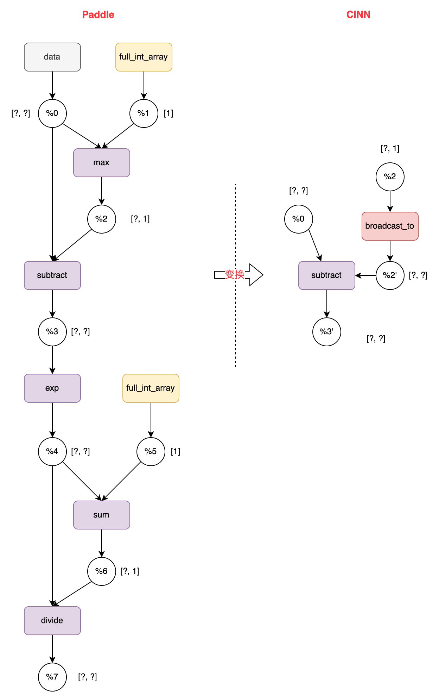

# 二、CINN框架概览
> 本文文档作者： @Aurelius84


## 1. 整体流程
> 给出CINN的架构图、描绘出核心模块上下层关系；并提供执行流程图；

<p align="center">

</p>


从「PIR+CINN」联动项目的视角来看，整个链路可以分为四个关键的部分：

* Paddle 表示层：提供pir::Program给CINN侧，主要为 Paddle Operator Dialect中的算子（即pd_op.xx）；会经过一系列的Dialect Pass变换，得到的pir::Program会同时包含pd_op.xx和cinn_op.xx；
* CINN 前端：接收的是BuildCinnPass变换后的pir::Program，内含若干个 cinn_op.GroupOp，是前端处理的「基本单元」；通过PirCompiler产生对应AST IR；
* CINN 后端：接收的是GroupOp对应的AST IR，依次应用GroupSchduler和CodeGen模块生成对应的string源码，传递给后端Compiler生成 host 端和 device 端的函数指针，返回JitKernelOp以替换GroupOp；
* Paddle 执行层：接收的是包含pd_op.xxx和JitKernelOp的pir::Program，先转换到Paddle Kernel Dialect，然后传递给新执行器生成对应的Instruction缓存和执行；

## 2 举个栗子🌰
> 给出 pir 一个典型的子图接入CINN后，端到端的中间过程，提供概览性的认知

基于框架现有的test_cinn_sub_graph.py单测，我们以开启prim 算子拆分逻辑后的program为例，执行命令如下：
```python
# 命令：
cd test/ir/pir/cinn
GLOG_v=8 FLAGS_enable_pir_api=1 FLAGS_prim_all=True python test_cinn_sub_graph.py TestCinnSoftmax > softmax.log 2>&1


class CINNSoftmaxSubGraphNet(paddle.nn.Layer):
    def __init__(self):
        super().__init__()
        self.fn = paddle.nn.functional.softmax   // <===== 会走组合算子拆分

    def forward(self, x, axis=-1):
        out = self.fn(x, axis=axis)
        return out
```

<p align="center">

</p>


各个阶段的 `pir::Program` 如下：

```c++
===-------------------------------------------------------------------------===
   IRPrinting on builtin.module original program
===-------------------------------------------------------------------------===
{
 (%0) = "pd_op.data" () {dtype:(pd_op.DataType)float32,name:"_jst.0.x.0",place:(pd_op.Place)Place(undefined:0),shape:(pd_op.IntArray)[64,128],stop_gradient:[false]} : () -> pd_op.tensor<64x128xf32>
 (%1) = "pd_op.full_int_array" () {dtype:(pd_op.DataType)int64,place:(pd_op.Place)Place(cpu),stop_gradient:[true],value:[(Int64)-1]} : () -> pd_op.tensor<1xi64>
 (%2) = "pd_op.max" (%0, %1) {keepdim:true,stop_gradient:[false]} : (pd_op.tensor<64x128xf32>, pd_op.tensor<1xi64>) -> pd_op.tensor<64x1xf32>
 (%3) = "pd_op.subtract" (%0, %2) {stop_gradient:[false]} : (pd_op.tensor<64x128xf32>, pd_op.tensor<64x1xf32>) -> pd_op.tensor<64x128xf32>
 (%4) = "pd_op.exp" (%3) {stop_gradient:[false]} : (pd_op.tensor<64x128xf32>) -> pd_op.tensor<64x128xf32>
 (%5) = "pd_op.full_int_array" () {dtype:(pd_op.DataType)int64,place:(pd_op.Place)Place(cpu),stop_gradient:[true],value:[(Int64)-1]} : () -> pd_op.tensor<1xi64>
 (%6) = "pd_op.sum" (%4, %5) {dtype:(pd_op.DataType)float32,keepdim:true,stop_gradient:[false]} : (pd_op.tensor<64x128xf32>, pd_op.tensor<1xi64>) -> pd_op.tensor<64x1xf32>
 (%7) = "pd_op.divide" (%4, %6) {stop_gradient:[false]} : (pd_op.tensor<64x128xf32>, pd_op.tensor<64x1xf32>) -> pd_op.tensor<64x128xf32>
 () = "builtin.set_parameter" (%7) {parameter_name:"output_0"} : (pd_op.tensor<64x128xf32>) ->
}

===-------------------------------------------------------------------------===
   IRPrinting on builtin.module after PdOp2CinnOpConverter pass
===-------------------------------------------------------------------------===
{
 (%0) = "pd_op.data" () {dtype:(pd_op.DataType)float32,name:"_jst.0.x.0",place:(pd_op.Place)Place(undefined:0),shape:(pd_op.IntArray)[64,128],stop_gradient:[false]} : () -> pd_op.tensor<64x128xf32>
 (%1) = "cinn_op.reduce_max" (%0) {dim:[(Int64)-1],keep_dim:true,stop_gradient:[false]} : (pd_op.tensor<64x128xf32>) -> pd_op.tensor<64x1xf32>
 (%2) = "pd_op.subtract" (%0, %1) {stop_gradient:[false]} : (pd_op.tensor<64x128xf32>, pd_op.tensor<64x1xf32>) -> pd_op.tensor<64x128xf32>
 (%3) = "pd_op.exp" (%2) {stop_gradient:[false]} : (pd_op.tensor<64x128xf32>) -> pd_op.tensor<64x128xf32>
 (%4) = "cinn_op.reduce_sum" (%3) {dim:[(Int64)-1],keep_dim:true,stop_gradient:[false]} : (pd_op.tensor<64x128xf32>) -> pd_op.tensor<64x1xf32>
 (%5) = "pd_op.divide" (%3, %4) {stop_gradient:[false]} : (pd_op.tensor<64x128xf32>, pd_op.tensor<64x1xf32>) -> pd_op.tensor<64x128xf32>
 () = "builtin.set_parameter" (%5) {parameter_name:"output_0"} : (pd_op.tensor<64x128xf32>) ->
}

===-------------------------------------------------------------------------===
   IRPrinting on builtin.module after add_broadcast_to_elementwise_pass pass
===-------------------------------------------------------------------------===
{
 (%0) = "pd_op.data" () {dtype:(pd_op.DataType)float32,name:"_jst.0.x.0",place:(pd_op.Place)Place(undefined:0),shape:(pd_op.IntArray)[64,128],stop_gradient:[false]} : () -> pd_op.tensor<64x128xf32>
 (%1) = "cinn_op.reduce_max" (%0) {dim:[(Int64)-1],keep_dim:true,stop_gradient:[false]} : (pd_op.tensor<64x128xf32>) -> pd_op.tensor<64x1xf32>
 (%2) = "cinn_op.broadcast" (%1) {broadcast_axes:[(Int64)0,(Int64)1],out_shape:[(Int64)64,(Int64)128],stop_gradient:[false]} : (pd_op.tensor<64x1xf32>) -> pd_op.tensor<64x128xf32>
 (%3) = "pd_op.subtract" (%0, %2) {stop_gradient:[false]} : (pd_op.tensor<64x128xf32>, pd_op.tensor<64x128xf32>) -> pd_op.tensor<64x128xf32>
 (%4) = "pd_op.exp" (%3) {stop_gradient:[false]} : (pd_op.tensor<64x128xf32>) -> pd_op.tensor<64x128xf32>
 (%5) = "cinn_op.reduce_sum" (%4) {dim:[(Int64)-1],keep_dim:true,stop_gradient:[false]} : (pd_op.tensor<64x128xf32>) -> pd_op.tensor<64x1xf32>
 (%6) = "cinn_op.broadcast" (%5) {broadcast_axes:[(Int64)0,(Int64)1],out_shape:[(Int64)64,(Int64)128],stop_gradient:[false]} : (pd_op.tensor<64x1xf32>) -> pd_op.tensor<64x128xf32>
 (%7) = "pd_op.divide" (%4, %6) {stop_gradient:[false]} : (pd_op.tensor<64x128xf32>, pd_op.tensor<64x128xf32>) -> pd_op.tensor<64x128xf32>
 () = "builtin.set_parameter" (%7) {parameter_name:"output_0"} : (pd_op.tensor<64x128xf32>) ->
}


===-------------------------------------------------------------------------===
            IRPrinting on builtin.module after build_cinn_pass pass
===-------------------------------------------------------------------------===
{
 (%0) = "pd_op.data" () {dtype:(pd_op.DataType)float32,name:"_jst.0.x.0",place:(pd_op.Place)Place(undefined:0),shape:(pd_op.IntArray)[64,128],stop_gradient:[false]} : () -> pd_op.tensor<64x128xf32>
 (%1) = cinn_op.group () -> pd_op.tensor<64x128xf32> {
 (%2) = "cinn_op.reduce_max" (%0) {dim:[(Int64)-1],keep_dim:true,stop_gradient:[false]} : (pd_op.tensor<64x128xf32>) -> pd_op.tensor<64x1xf32>
 (%3) = "cinn_op.broadcast" (%2) {broadcast_axes:[(Int64)0,(Int64)1],out_shape:[(Int64)64,(Int64)128],stop_gradient:[false]} : (pd_op.tensor<64x1xf32>) -> pd_op.tensor<64x128xf32>
 (%4) = "pd_op.subtract" (%0, %3) {stop_gradient:[false]} : (pd_op.tensor<64x128xf32>, pd_op.tensor<64x128xf32>) -> pd_op.tensor<64x128xf32>
 (%5) = "pd_op.exp" (%4) {stop_gradient:[false]} : (pd_op.tensor<64x128xf32>) -> pd_op.tensor<64x128xf32>
 (%6) = "cinn_op.reduce_sum" (%5) {dim:[(Int64)-1],keep_dim:true,stop_gradient:[false]} : (pd_op.tensor<64x128xf32>) -> pd_op.tensor<64x1xf32>
 (%7) = "cinn_op.broadcast" (%6) {broadcast_axes:[(Int64)0,(Int64)1],out_shape:[(Int64)64,(Int64)128],stop_gradient:[false]} : (pd_op.tensor<64x1xf32>) -> pd_op.tensor<64x128xf32>
 (%8) = "pd_op.divide" (%5, %7) {stop_gradient:[false]} : (pd_op.tensor<64x128xf32>, pd_op.tensor<64x128xf32>) -> pd_op.tensor<64x128xf32>
 () = "cf.yield" (%8) {} : (pd_op.tensor<64x128xf32>) ->
 }
 () = "builtin.set_parameter" (%1) {parameter_name:"output_0"} : (pd_op.tensor<64x128xf32>) ->
}


===-------------------------------------------------------------------------===
          IRPrinting on builtin.module after cinn_group_lowering pass
===-------------------------------------------------------------------------===
{
 (%0) = "pd_op.data" () {dtype:(pd_op.DataType)float32,name:"_jst.0.x.0",place:(pd_op.Place)Place(undefined:0),shape:(pd_op.IntArray)[64,128],stop_gradient:[false]} : () -> pd_op.tensor<64x128xf32>
 (%1) = "cinn_runtime.jit_kernel" (%0) {kernel_info:(0x7f5e24fb27c0)} : (pd_op.tensor<64x128xf32>) -> pd_op.tensor<64x128xf32>
 () = "builtin.set_parameter" (%1) {parameter_name:"output_0"} : (pd_op.tensor<64x128xf32>) ->
}
```
