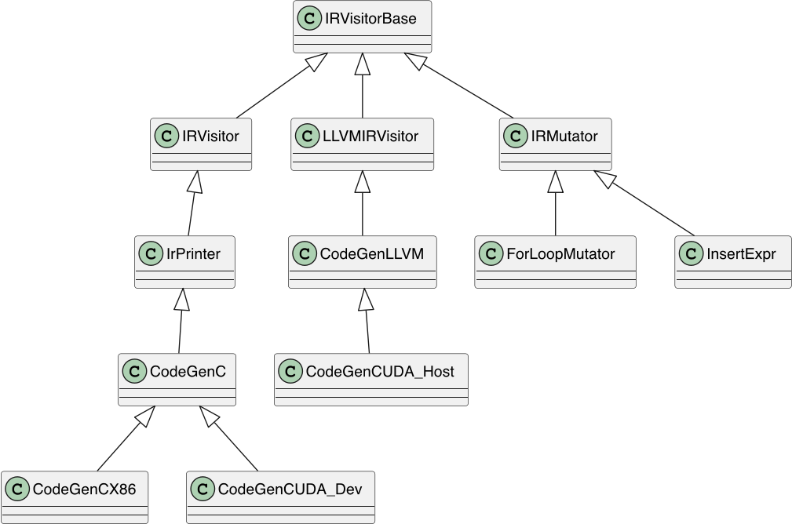

# 五、CodeGen 流程
> 本文文档作者： @Aurelius84
> 从「纵向」自动代码生成流程、「横向」多硬件CodeGen扩展支持角度，来解读各个技术点

- [五、CodeGen 流程](#五codegen-流程)
  - [1. 接上文](#1-接上文)
  - [2. 输入输出](#2-输入输出)
  - [3. host/device](#3-hostdevice)
  - [4. IRVisitor](#4-irvisitor)
  - [5. Backend Compiler](#5-backend-compiler)


## 1. 接上文

第4章节基本是都是OpLower里的逻辑，此处，我们将重新回到PirCompiler组件里的逻辑。经过op_lowerer.Lower(group)之后，返回的是vector<LowerFunc>。

此时会将所有的LowerFunc添加到ir::Module::Builder里：

```c++
// paddle/cinn/hlir/framework/pir_compiler.cc
  for (auto&& func : lowered_funcs) {
    m_builder_.AddFunction(func);
  }
```

> [!NOTE]
> m_builder_里会再次调用optim::Optimize()函数，这个似乎有点多余？因为OpLower的最后其实已经统一优化过了。

```c++
// paddle/cinn/ir/module.cc
void Module::Builder::AddFunction(ir::LoweredFunc func) {
  optim::Simplify(&(func->body));
  optim::SimplifyForLoops(&(func->body));
  optim::SimplifyBlocks(&(func->body));
  func->body = optim::Optimize(func->body, module_->target);
  module_->functions.push_back(func);
}
```

ir::Module继承自IrNodeRef，是一个更加顶层的数据结构，从其friend class可以看出，其与CodeGen关联更为紧密。个人理解，ir:Module作为了面向多硬件的「统一出口」。Module::Builder::Build()会返回一个ir::Module对象：

```c++
// paddle/cinn/ir/module.cc
Module Module::Builder::Build() {
  if (module_->functions.empty()) {
    VLOG(1) << "Module has no functions";
  }

  auto res = ir::Module(module_.get());

  res = optim::Optimize(res, module_->target);
  return res;
}
```

> [!NOTE]
> 这里在ir::Module层面又调用了optim::Optimize的优化策略。


从源码实现来看，这里的优化策略逻辑和前面的有略微的差别，但也有相同的优化策略。其中RemoveScheduleBlock是一个需要关注的策略。

```c++
ir::Module Optimize(const ir::Module& module, const Target& target) {
  auto copied = ir::ir_utils::IRCopy(Expr(module));
  ReplaceCrossThreadReduction(&copied);
  UnrollLoop(&copied);
  VectorizeLoops(&copied, Target());
  RemoveScheduleBlock(&copied);
  LowerFunctionCallBindVars(&copied);
  CallArgListToPodValue(&copied);
  LowerIntrin(&copied, target);
  VLOG(10) << "After LowerIntrin:" << copied.as_module_ref();

  return copied.as_module_ref();
}
```

> [!NOTE]
> 小提示：此处AST IR之所以突然变得很简洁，是RemoveScheduleBlock的效果。


```c++
function fn_reduce_max_broadcast_to_subtract_exp_reduce_sum_broadcast_to_0_divide (_var_0, _var_6)
{
  if ((blockIdx.x < 64)) {
    var_4__reduce_init[0, 0] = 0.00000000f
    var__reduce_init[0, 0] = -3.40282347e+38f
    if ((threadIdx.x < 128)) {
      var_rf__reduce_init[0, 0, 0] = -3.40282347e+38f
      var_rf[0, 0, 0] = cinn_max(var_rf[0, 0, 0], var_0[blockIdx.x, threadIdx.x])
      var[0, 0] = cinn_block_reduce_max_fp32_internal_shm(var_rf[0, 0, 0], _Buffer_<cinn_buffer_t*: 32>(shm32__fp32_reduce))
    }
    if ((threadIdx.x < 128)) {
      var_4_rf__reduce_init[0, 0, 0] = 0.00000000f
      var_4_rf[0, 0, 0] = (var_4_rf[0, 0, 0] + cinn_nvgpu_exp_fp32((var_0[blockIdx.x, threadIdx.x] - var[0, 0])))
      var_4[0, 0] = cinn_block_reduce_sum_fp32_internal_shm(var_4_rf[0, 0, 0], _Buffer_<cinn_buffer_t*: 32>(shm32__fp32_reduce))
    }
    serial for (i_j_fused_0, 0, 128)
    {
      var_6[blockIdx.x, i_j_fused_0] = (cinn_nvgpu_exp_fp32((var_0[blockIdx.x, i_j_fused_0] - var[0, 0])) / var_4[0, 0])
    }
  }
}
```

## 2. 输入输出
在PirCompiler层面，CodeGen的入口模块是交给backends::Compiler的：

* 输入：ir::Module
* 输出：函数fn_ptr，包括 host function 和 device function

```c++
// paddle/cinn/hlir/framework/pir_compiler.cc
 compiler_ = backends::Compiler::Create(target_);
    auto build_module = m_builder_.Build();
    compiler_->Build(build_module, "");
```

如下是backend::Compiler进行Codegen时的核心分支逻辑，其是所有硬件的顶层模块，会根据不同的target生成对应的硬件相关的Code。

<p align="center">

</p>

```c++
// paddle/cinn/backends/compiler.cc
void Compiler::Build(const Module& module, const std::string& code) {
  if (target_.arch == Target::Arch::NVGPU) {
    CompileCudaModule(module, code);
  } else if (target_.arch == Target::Arch::X86) {
    CompileX86Module(module);
  } else {
    CINN_NOT_IMPLEMENTED
  }
}
```

## 3. host/device
我们以CUDA硬件为例，核心逻辑在Compiler::CompileCudaModule中实现，主要如下几个过程：

* step 1: 将ir::Module切分为host_module和device_module

```c++
// ============== [CUDA] host module ==============
Module Pir_host {

function fn_reduce_max_broadcast_to_subtract_exp_reduce_sum_broadcast_to_0_divide (kernel_args, kernel_args_num, kernel_stream)
cinn_call_cuda_kernel(fn_reduce_max_broadcast_to_subtract_exp_reduce_sum_broadcast_to_0_divide_kernel, kernel_args, kernel_args_num,
                       64, 1, 1, 128, 1, 1, kernel_stream)

}

// ============== [CUDA] device module ==============
Module Pir_gpu_device {

function fn_reduce_max_broadcast_to_subtract_exp_reduce_sum_broadcast_to_0_divide_kernel (_var_0, _var_6)
{
  if ((blockIdx.x < 64)) {
    var_4__reduce_init[0, 0] = 0.00000000f
    var__reduce_init[0, 0] = -3.40282347e+38f
    if ((threadIdx.x < 128)) {
      var_rf__reduce_init[0, 0, 0] = -3.40282347e+38f
      var_rf[0, 0, 0] = cinn_max(var_rf[0, 0, 0], var_0[blockIdx.x, threadIdx.x])
      var[0, 0] = cinn_block_reduce_max_fp32_internal_shm(var_rf[0, 0, 0], _Buffer_<cinn_buffer_t*: 32>(shm32__fp32_reduce))
    }
    if ((threadIdx.x < 128)) {
      var_4_rf__reduce_init[0, 0, 0] = 0.00000000f
      var_4_rf[0, 0, 0] = (var_4_rf[0, 0, 0] + cinn_nvgpu_exp_fp32((var_0[blockIdx.x, threadIdx.x] - var[0, 0])))
      var_4[0, 0] = cinn_block_reduce_sum_fp32_internal_shm(var_4_rf[0, 0, 0], _Buffer_<cinn_buffer_t*: 32>(shm32__fp32_reduce))
    }
    serial for (i_j_fused_0, 0, 128)
    {
      var_6[blockIdx.x, i_j_fused_0] = (cinn_nvgpu_exp_fp32((var_0[blockIdx.x, i_j_fused_0] - var[0, 0])) / var_4[0, 0])
    }
  }
}

}
```

* step 2: 使用 CodeGenCUDA_Dev对device_module进行代码生成，得到string类型的source_code

```c++
#include <cstdint>

#define CINN_WITH_CUDA
#include "bfloat16.h"
#include "float16.h"
using cinn::common::bfloat16;
using cinn::common::float16;
using cinn::common::half4;
using cinn::common::half8;
using cinn::common::float8;

#include "cinn_cuda_runtime_source.cuh"

extern "C" {

__global__
void __launch_bounds__(128) fn_elementwise_mul_reduce_sum_0_broadcast_to_1_elementwise_mul_0_subtract_0_kernel(const float* __restrict__ var_0, const float* __restrict__ var_1, float* __restrict__ var_5)
{
  float _var_2__reduce_init_temp_buffer [ 1 ];
  float _var_2_rf__reduce_init_temp_buffer [ 1 ];
  __shared__ float shm32__fp32_reduce [ 32 ];
  float* var_2 = _var_2__reduce_init_temp_buffer;
  float* var_2__reduce_init = _var_2__reduce_init_temp_buffer;
  float* var_2_rf = _var_2_rf__reduce_init_temp_buffer;
  float* var_2_rf__reduce_init = _var_2_rf__reduce_init_temp_buffer;
  if (((int)blockIdx.x < 64)) {
    var_2__reduce_init[0] = 0.00000000f;
    if (((int)threadIdx.x < 128)) {
      var_2_rf__reduce_init[0] = 0.00000000f;
      var_2_rf[0] = (var_2_rf[0] + (var_0[((128 * (int)blockIdx.x) + (int)threadIdx.x)] * var_1[((128 * (int)blockIdx.x) + (int)threadIdx.x)]));
      var_2[0] = cinn_block_reduce_sum_fp32_internal_shm(var_2_rf[0], shm32__fp32_reduce);
    };
    for (int32_t i_j_fused_10 = 0; i_j_fused_10 < 128; i_j_fused_10 += 1) {
      var_5[((128 * (int)blockIdx.x) + i_j_fused_10)] = ((var_0[((128 * (int)blockIdx.x) + i_j_fused_10)] * var_1[((128 * (int)blockIdx.x) + i_j_fused_10)]) - (var_1[((128 * (int)blockIdx.x) + i_j_fused_10)] * var_2[0]));
    };
  };
}

}
```

* step 3: 构造一个nvrtc::Compiler，将source_code编译为ptx，并以此构造CUDAModule对象
* step 4: 遍历device_module（ir::Module对象） 中每个LowerFunc，根据其fn_name从CUDAModule中检索出对应fn_ptr
* step 5: 以fn_name+_ptr_为key，将device函数指针注册到RuntimeSymbols表中
* step 6: 以RuntimeSymbols构造ExecutionEngine，调用engine_->Link<CodeGenCUDA_Host>(host_module)，将device与host函数关联；

> [!NOTE]
> 小提示：LowerFunc的fn_name很重要，要求唯一性。

## 4. IRVisitor

在CodeGen模块中，所有ReadOnly的AST IR遍历操作都是继承自IRVisitor，包括Printer、CodeGenXX：

```c++
// paddle/cinn/ir/ir_visitor.h
/**
 * Base of all the Ir readonly visitor.
 */
struct IRVisitor : public IRVisitorRequireReImpl<void> {
  IRVisitor() = default;

  void Visit(const Expr* x) { IRVisitorRequireReImpl::Visit(x); }
#define __m(t__) \
  virtual void Visit(const t__* x) { return VisitDefault(x); }
  NODETY_FORALL(__m)
#undef __m

  virtual void VisitDefault(const Object* obj) {
    LOG(FATAL) << "not supported NodeTy";
  }
};
```

> [!NOTE]
> 小提示：在CINN中，如果要新增一个AST Node，一般需要针对各个Visitor派生类重写对应的Visit(const MyNode*)接口方法，否则会走默认的实现，触发LOG(FATAL)

CodeGen采用了设计模式中的「访问者」模式，对各种AST Node进行逻辑分发，输出对应的string，如下部分函数实现：

```c++
// paddle/cinn/backends/codegen_c.cc
void CodeGenC::Visit(const ir::IfThenElse *op) {
  str_ += "if (";
  IrPrinter::Visit(op->condition);
  str_ += ") ";

  IrPrinter::Visit(op->true_case);

  if (op->false_case.defined()) {
    str_ += " else ";
    IrPrinter::Visit(op->false_case);
  }
}
```

## 5. Backend Compiler
如果以CUDA硬件为例的话，其后端编译器由nvrtc::Compiler来承担。从实现上来看，核心流程为：

* step 1: 将string类型的source code先写到一个临时文件中，并以.cu为文件后缀
* step 2: 拼接编译options，使用nvcc先编译为ptx，然后再编译为cubin，以sting返回文件

```c++
// paddle/cinn/backends/nvrtc/nvrtc_util.cc
std::string Compiler::operator()(const std::string& code,
                                 bool include_headers) {
  if (runtime::CanUseNvccCompiler()) {
    return CompileWithNvcc(code);
  }
  return CompileCudaSource(code, include_headers);
}
```

后端编译器有两个大的编译模式可以选择。我们先看第一种CompileWithNvcc():

```c++
// paddle/cinn/backends/nvrtc/nvrtc_util.cc
std::string Compiler::CompileWithNvcc(const std::string& cuda_c) {
  // read dir source
  std::string dir = "./source";
  if (access(dir.c_str(), 0) == -1) {
    CHECK(mkdir(dir.c_str(), 7) != -1) << "Fail to mkdir " << dir;
  }

  // get unqiue prefix name
  prefix_name_ = dir + "/" + cinn::common::UniqName("rtc_tmp");

  auto cuda_c_file = prefix_name_ + ".cu";
  std::ofstream ofs(cuda_c_file, std::ios::out);
  CHECK(ofs.is_open()) << "Fail to open file " << cuda_c_file;
  ofs << cuda_c;
  ofs.close();

  CompileToPtx();   // <============= 编译为 ptx, 并存到.ptx文件
  CompileToCubin(); // <============= 将 .ptx文件编译为 .cubin 文件

  return prefix_name_ + ".cubin";
}

void Compiler::CompileToPtx() {
  auto include_dir = cinn::common::Context::Global().runtime_include_dir();
  std::string include_dir_str = "";
  for (auto dir : include_dir) {
    if (include_dir_str.empty()) {
      include_dir_str = dir;
    } else {
      include_dir_str += ":" + dir;
    }
  }

  std::string options = std::string("export PATH=") + FLAGS_cinn_nvcc_cmd_path +
                        std::string(":$PATH && nvcc -std=c++14 --ptx -O3 -I ") +
                        include_dir_str;
  options += " -arch=" + GetDeviceArch();
  options += " -o " + prefix_name_ + ".ptx";
  options += " " + prefix_name_ + ".cu";

  VLOG(2) << "Nvcc Compile Options : " << options;
  CHECK(system(options.c_str()) == 0) << options;    // <=========  调用systemp执行命令
}

void Compiler::CompileToCubin() {
  std::string options = std::string("export PATH=") + FLAGS_cinn_nvcc_cmd_path +
                        std::string(":$PATH && nvcc --cubin -O3");
  options += " -arch=" + GetDeviceArch();
  options += " -o " + prefix_name_ + ".cubin";
  options += " " + prefix_name_ + ".ptx";

  VLOG(2) << "Nvcc Compile Options : " << options;
  CHECK(system(options.c_str()) == 0) << options;    // <=========  调用systemp执行命令
}
```

上面本质上模拟编译命令执行。我们接着来看CompileCudaSource()分支的逻辑：

* step 1: 获取CUDA Capability 版本标识
* step 2: 准备编译 Options 参数
* step 3: 调用 NVRTC_CALL + nvrtcCreateProgram 创建 nvrtcProgram 对象
* step 4: 调用 nvrtcCompileProgram 执行编译，得到初步结果
* step 5: 按需获取 PTX 或者 CUBIN 源码结果

```c++
// paddle/cinn/backends/nvrtc/nvrtc_util.cc
std::string Compiler::CompileCudaSource(const std::string& code,
                                        bool include_headers) {
  // step 1: 获取CUDA Capability 版本标识
  const auto& header_gen = JitSafeHeaderGenerator::GetInstance();
  std::vector<std::string> compile_options;
  std::vector<const char*> param_cstrings{};
  nvrtcProgram prog;
  std::string cc = "30";
  int major, minor;
  cudaError_t e1 =
      cudaDeviceGetAttribute(&major, cudaDevAttrComputeCapabilityMajor, 0);
  cudaError_t e2 =
      cudaDeviceGetAttribute(&minor, cudaDevAttrComputeCapabilityMinor, 0);

  // step 2: 准备编译 Options 参数
  if (compile_to_cubin_) {
    compile_options.push_back("-arch=sm_" + cc);
    std::string enable_fmad =
        FLAGS_cinn_nvrtc_cubin_with_fmad ? "true" : "false";
    compile_options.push_back("--fmad=" + enable_fmad);
  } else {
    compile_options.push_back("-arch=compute_" + cc);
  }
  compile_options.push_back("-std=c++14");
  compile_options.push_back("-default-device");

  if (include_headers) {  // prepare include headers
    auto cuda_headers = FindCUDAIncludePaths();
    auto cinn_headers = FindCINNRuntimeIncludePaths();
    std::vector<std::string> include_paths;
    for (auto& header : cuda_headers) {
      include_paths.push_back("--include-path=" + header);
    }
    for (auto& header : cinn_headers) {
      include_paths.push_back("--include-path=" + header);
    }
    compile_options.insert(
        std::end(compile_options), include_paths.begin(), include_paths.end());
  }

  for (const auto& option : compile_options) {
    param_cstrings.push_back(option.c_str());
  }

  // step3 : 调用 NVRTC_CALL + nvrtcCreateProgram 创建 nvrtcProgram 对象
  NVRTC_CALL(nvrtcCreateProgram(&prog,
                                code.c_str(),
                                nullptr,
                                header_gen.size(),
                                header_gen.headers().data(),
                                header_gen.include_names().data()));
  // step 4: 调用 nvrtcCompileProgram 执行编译，得到初步结果
  nvrtcResult compile_res =
      nvrtcCompileProgram(prog, param_cstrings.size(), param_cstrings.data());

  // step 5: 按需获取 PTX 或者 CUBIN 源码结果
  size_t size;
  std::string data;
  if (compile_to_cubin_) {
    NVRTC_CALL(nvrtcGetCUBINSize(prog, &size));
    data.resize(size);
    NVRTC_CALL(nvrtcGetCUBIN(prog, &data[0]));
  } else {
    NVRTC_CALL(nvrtcGetPTXSize(prog, &size));
    data.resize(size);
    NVRTC_CALL(nvrtcGetPTX(prog, &data[0]));
  }

  NVRTC_CALL(nvrtcDestroyProgram(&prog));
  return data;
}
```

获取到PTX或者CUBIN源码之后，就是构建一个CUDAModule对象，负责将其转换为CUfunction函数指针：

* step 1: 准备jit_options和对应的jit_opt_vals
* step 2: 调用cuModuleLoad或者cuModuleLoadDataE加载.ptx文件或者CUBIN sting
* step 3: 调用cuModuleGetFunction解析出对应的CUfunction函数指针

```c++
// paddle/cinn/runtime/cuda/cuda_module.cc
CUfunction CUDAModule::GetFunction(int device_id,
                                   const std::string& func_name) {
  if (!module_per_card_[device_id]) {
    std::lock_guard<std::mutex> lock(mutex_);
    // Compilation with parameters
    const size_t jit_num_options = 5;
    std::vector<CUjit_option> jit_options(jit_num_options);
    std::vector<void*> jit_opt_vals(jit_num_options);

    // set up size of compilation log buffer
    jit_options[0] = CU_JIT_ERROR_LOG_BUFFER_SIZE_BYTES;
    size_t log_buffer_size = 1024;
    jit_opt_vals[0] = reinterpret_cast<void*>(log_buffer_size);

    // set up pointer to the compilation log buffer
    jit_options[1] = CU_JIT_ERROR_LOG_BUFFER;
    std::vector<char> log_buffer(log_buffer_size, '\0');
    jit_opt_vals[1] = log_buffer.data();

    int value = 1;
    // Specifies whether to create debug information in output (-g)
    jit_options[2] = CU_JIT_GENERATE_DEBUG_INFO;
    jit_opt_vals[2] = reinterpret_cast<void*>(value);

    // Generate verbose log messages
    jit_options[3] = CU_JIT_LOG_VERBOSE;
    jit_opt_vals[3] = reinterpret_cast<void*>(value);

    // Generate line number information (-lineinfo)
    jit_options[4] = CU_JIT_GENERATE_LINE_INFO;
    jit_opt_vals[4] = reinterpret_cast<void*>(value);

    if (runtime::CanUseNvccCompiler()) {
      CUDA_DRIVER_CALL(
          cuModuleLoad(&module_per_card_[device_id], data_.c_str()));
    } else {
      CUDA_DRIVER_CALL(cuModuleLoadDataEx(&module_per_card_[device_id],
                                          data_.c_str(),
                                          jit_num_options,
                                          jit_options.data(),
                                          jit_opt_vals.data()));
    }
  }

  CUfunction func;
  CUDA_DRIVER_CALL(cuModuleGetFunction(
      &func, module_per_card_[device_id], func_name.c_str()));
  return func;
}
```

> [!NOTE]
> 小提示：CUfunction是被CUDAModule管理，后者又是被backend::Compiler持有，后者又被PirCompiler持有。因此CUfunction的生命周期是与PirCompiler强关联的。
