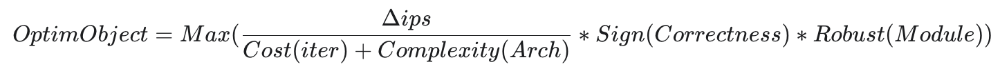
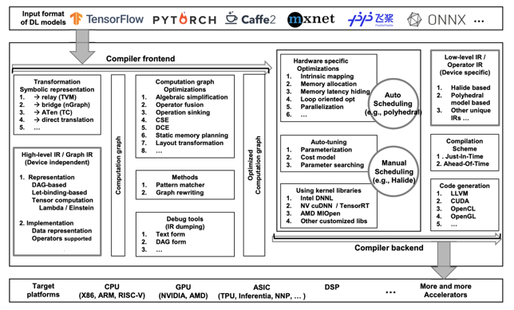
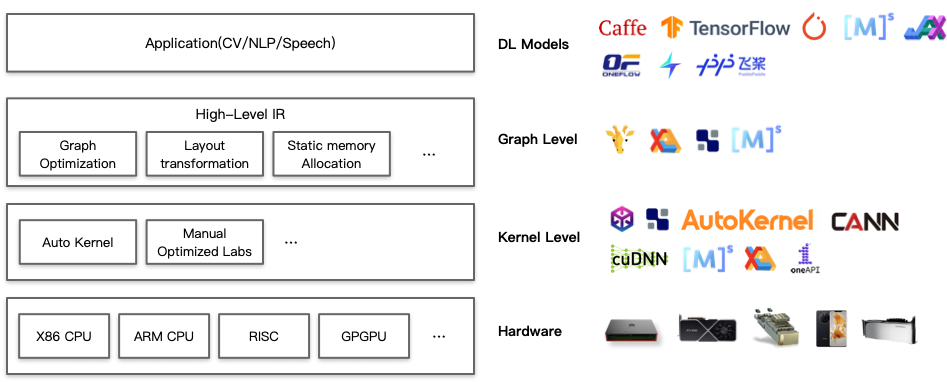
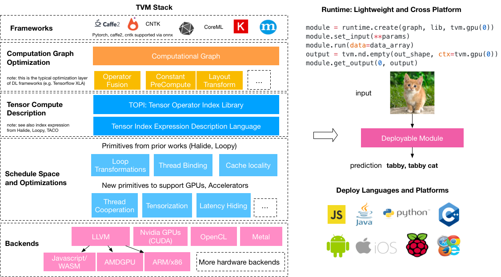
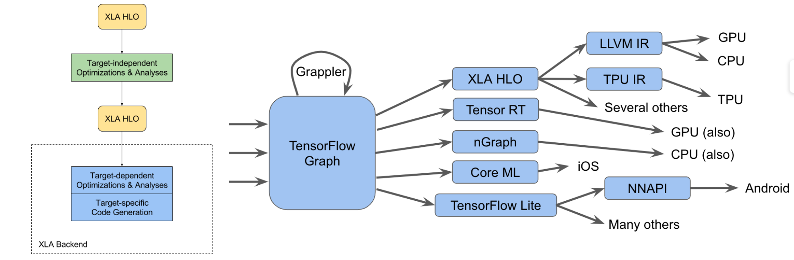
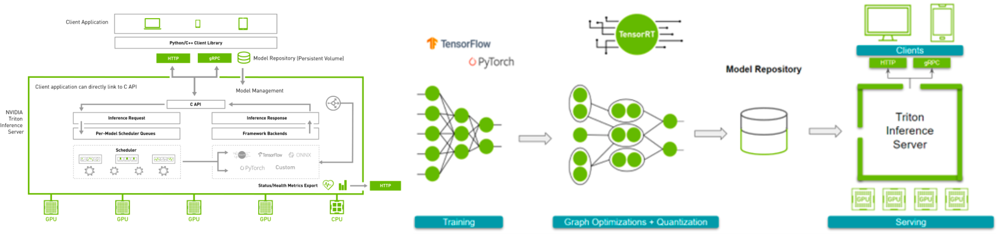
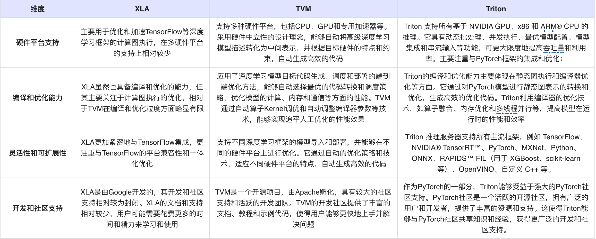

# 一、编译器领域
> 本文文档作者： @Aurelius84

- [一、编译器领域](#一编译器领域)
  - [1.问题界定](#1问题界定)
  - [2.业界产品](#2业界产品)
    - [2.1 TVM（Tensor Virtual Machine）](#21-tvmtensor-virtual-machine)
    - [2.2 XLA（Accelerated Linear Algebra）](#22-xlaaccelerated-linear-algebra)
    - [2.3 Triton](#23-triton)
  - [3.竞品对比](#3竞品对比)

## 1.问题界定
> 什么是AI编译器、AI 编译器聚焦的问题是什么？涉及的核心技术是什么？

传统编译器通常是通过一些静态的优化技术来将高级语言代码转化为底层机器码，以提高程序的性能和效率。AI编译器作为一种新兴的编译器技术，则利用机器学习算法、自动化搜索和优化技术等，通过对程序代码进行分析和处理，以实现更高的性能和效率。

AI 编译器主要聚焦于解决深度学习模型的部署和推理过程中的多个关键问题，包括模型优化、跨平台适配、算法选择和编译效率等。其以减少人工优化工作量和提高模型性能为目标，通过融合自动化、机器学习和优化算法等技术，对深度学习模型进行综合优化和高效部署。

1. 模型优化：旨在改进深度学习模型在硬件平台上的性能和效率。它通过自动的算子Kernel调优、内存优化、融合和量化等技术，优化模型的计算和内存访问模式，以提高模型的性能和效率。
2. 跨平台适配：旨在实现深度学习模型的跨平台部署。由于不同硬件平台具有不同的架构和特点，AI编译器需要适应不同平台的需求，生成相应的优化代码。通过硬件中立性的设计和优化技术，使得模型能够在不同硬件平台上高效地运行。
3. 算法选择：旨在实现根据模型和硬件平台的特点，选择最优的算法和优化策略。利用自动化和机器学习等技术，自动地选择和调整算法，以实现最佳的性能效果。通过针对不同硬件平台和模型类型的算法选择，AI编译器能够实现深度学习模型的高效部署和推理。
4. 编译效率：旨在提高编译器的效率和生产力。利用自动化调优和高级编译技术，自动地选择最优的编译策略和参数，以实现高效的编译。通过减少人工优化的工作量，AI编译器能够加速深度学习模型的开发、优化和部署流程。

> [!NOTE]
> 解读：
> 1. △ips > 0，即有性能收益，指引做AI编译器的「价值意义」；
> 2. Sign(Correctness) = 1，即以正确性为底线， 是发布给用户的「生命线」；
> 3. Robuts(Module) ~= 1：即端到端鲁棒性，是与用户息息相关的「体验」；

简言之，AI 编译器将一段用DSL（Domain Specific Language）描述深度学习模型代码（即High-Level IR），经过通用、高效、鲁棒的「设备无关的」自动优化策略以Lower到更低层次IR上（即Low-Level IR），最后在给定的硬件设备上完成计算图优化、算子选择和内存分配，生成高性能的可执行程序。

AI 编译器涉及的核心技术包括以下几个方面：

1. 自动优化算法：利用自动优化算法来自动地对深度学习模型进行优化。这些算法包括机器学习、自动化搜索和强化学习等。通过对模型的结构和参数进行分析和学习，AI编译器能够选择最优的优化策略和参数，以提高模型的性能和效率。
2. 算子优化：算子是深度学习模型中的基本运算操作，如矩阵乘法、卷积等。AI编译器利用算子优化技术，通过自动选择最优的算法、优化内存访问模式、融合多个算子等方式，提高算子的计算效率和性能。
3. 并行计算和并发优化：利用并行计算技术，将模型中的计算任务划分为多个子任务，并利用多核CPU、GPU等并行执行这些任务，以提高计算的效率和性能。同时，AI编译器还能够进行并发优化，将计算和数据传输任务在时间上重叠，减少等待时间，提高模型的整体性能
4. 硬件特定优化：不同硬件平台具有不同的计算架构和特点，因此需要针对不同硬件平台进行优化。AI编译器利用硬件特定优化技术，根据硬件平台的特点和约束，生成相应的优化代码。这些技术包括硬件算子库、指令级优化、内存访问优化等，以实现对硬件的充分利用和优化。

## 2.业界产品
> 业界已知的AI编译器都有哪些典型代表？目前的现状和特点是什么？

### 2.1 TVM（Tensor Virtual Machine）

TVM是一个开源的自动优化深度学习编译器，由Apache孵化，目标是自动优化深度学习模型在各类硬件上的部署，包括CPU、GPU和专用加速器等。TVM采用了深度学习模型目标代码生成、调度和部署的端到端优化方法，可以自动地生成高度优化的代码。其核心特点如下：

* 硬件中立性：TVM能够将高级深度学习模型描述转化为中间表示，并根据目标硬件的特点和约束，自动地生成高效的代码。这使得TVM能够在不同硬件平台上运行，并且具有良好的可移植性。
* 自动化优化：TVM利用机器学习和自动化搜索等技术，自动地对深度学习模型进行优化。它可以自动地选择最优的代码转换和调度策略，并优化模型的计算、内存和通信等方面的性能。
* 高性能：TVM的优化技术能够有效地提高深度学习模型的性能。与传统的编译器相比，TVM能够生成更高效的代码，从而提高模型的计算速度和效率。

### 2.2 XLA（Accelerated Linear Algebra）

XLA是 Google 开发的一种编译技术和优化器。它主要用于优化和加速 TensorFlow 等深度学习框架的计算图执行。其主要特点包括：

* 即时编译：XLA采用了即时编译的方式，将计算图实时编译成底层设备的代码。这使得XLA能够根据不同硬件设备的特点和约束，生成高效的代码，以提高深度学习模型的性能。
* 硬件特定优化：XLA可以根据硬件设备的特点，自动地选择和应用相应的优化策略和算法。它能够利用硬件平台的专有功能，如GPU的并行计算能力等，从而提高模型的性能和效率。
* 灵活性：XLA支持动态图和静态图两种计算图的优化。它能够根据计算图的类型和属性，自动地选择最优的优化策略和算法，以适应不同类型的模型和任务。

### 2.3 Triton

Triton是PyTorch社区引入的一种编译优化技术，通过在PyTorch框架中集成编译优化工具来提高模型的性能和效率。目前，Triton在业界处于较早的研究和发展阶段，但已经展示出一些突出的特点和潜力，并受到了广泛关注。Triton具有以下几个突出的特点：

* 静态图执行：与传统的动态图执行方式相比，Triton采用了静态图的执行模式。这使得Triton能够在模型执行前对其进行编译和优化，根据模型的特点和硬件平台的约束生成高效的优化代码。静态图的执行模式能够通过编译器的优化技术，提高运行时的性能和效率。
* 硬件平台支持：Triton支持多种硬件平台，如CPU、GPU和FPGA等。为了适应不同硬件平台的特点和约束，Triton能够自动地生成相应的优化代码。这使得Triton能够在不同类型的硬件平台上实现高效的模型部署和推理。
* PyTorch集成：Triton是在PyTorch框架中引入的，与PyTorch紧密集成。这使得使用PyTorch的开发者能够直接受益于Triton的编译优化能力，无需改变现有的开发方式和代码结构，即可实现模型性能的提升。
* 开源社区支持：Triton在PyTorch社区中得到了广泛的关注和支持。作为一个开源项目，Triton吸引了大量的开发者和研究者的关注，并且有望在未来得到更多的研究和开发投入。开源社区的支持为Triton的发展提供了丰富的资源和生态系统，也有助于实现更高的性能和更广泛的应用。
Triton作为PyTorch引入的编译优化技术，通过静态图执行和编译器的优化技术，为模型的性能和效率提供了一种新的优化方法。虽然目前处于早期的研究和发展阶段，但Triton在技术设计、现状和特点等方面展现出了潜力。随着更多的研究和开发投入，Triton有望在PyTorch社区和深度学习领域的模型部署和推理中发挥重要作用。

## 3.竞品对比
> 横向对比TVM、XLA、Triton 三个主流框架的优劣势

