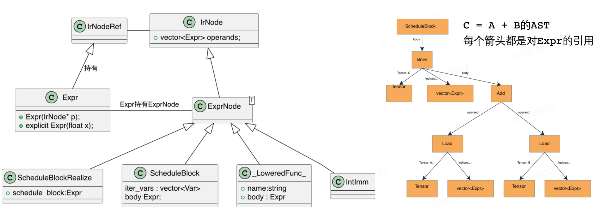

# 四、Lower 过程
> 本文文档作者： @Aurelius84
> 解构Lower的骨架流程，依次描述Lower涉及的核心技术模块。并针对每个模块，细化其技术要点和流程

- [四、Lower 过程](#四lower-过程)
  - [1. 接上文](#1-接上文)
  - [2. 输入输出](#2-输入输出)
  - [3. AST IR](#3-ast-ir)
  - [4. LowerToAST](#4-lowertoast)
  - [5. Schedule](#5-schedule)
  - [5. 后处理](#5-后处理)


## 1. 接上文
从源码实现层面，DoOpLower的大致流程为：

* step 1: 以 pir::value 构造对应的 CINN 输入信息，类型为 ir::Expr(ir::Tensor)
* step 2: 以 pir::Result 构造对应的CINNN 输出信息，类型为 CINNValue(string)
* step 3：调用当前 Op 对应的 Compute 函数，此函数是通过宏注册管理的
* step 4: 调用 lang::LowerToAstVect 进行到AST层面的Lower

```c++
  // step 1: 以pir::value 构造对应的 CINN 输入信息，类型为 ir::Expr(ir::Tensor)
   std::vector<cinn::common::CINNValue> cinn_inputs;
  for (const ir::Tensor& tensor : *op_func_arg_tensors) {
    cinn_inputs.push_back(cinn::common::CINNValue(ir::Expr(tensor)));
  }
  // step 2: 以pir::Result 构造对应的CINNN 输出信息，类型为CINNValue(string)
  auto op_results = op->results();
  for (const auto& result : op_results) {
    std::string output_id = ValueName(result);
    cinn_inputs.push_back(cinn::common::CINNValue(output_id));
  }

  // step 3：调用当前Op对应的Compute函数，此函数是通过宏注册管理的
  cinn::common::CINNValuePack pack =
      op_impl->fcompute(cinn::common::CINNValuePack{cinn_inputs});

  //..... 省略对 CINNValuePack的处理
  // step 4: 调用 lang::LowerToAstVect 进行到AST层面的Lower
 std::vector<ir::LoweredFunc> funcs = lang::LowerToAstVec(
  lower_fn_name, *op_func_arg_tensors, {&tensor_group}, this->target_);
```

此处的fcompute具体是什么形式的，其内部实现做了什么事情，角色是什么？如下是ReLU算子对应的Strategy函数，内部有其Compute逻辑的实现，可以看出：

* 其入参定义为lang::Args和lang::RetValue*；Args是输入参数的Pack打包（直观上可以类比Python的*args）
  * 细节一：Args中第一部分存储的是ir::Expr(ir::Tensor)s，对于Conv2d而言，Args[0] = {input, weight}
  * 细节二：Args中不包含Attribute，Attribute是在op_impl = OpStrategy::SelectImpl(strategy[cinn_op](...);传入进来的，在StrategyForXX做的处理
* 职责：①针对输入做必要的合法性检查，如数量、类型 ②调用对应pe::xx或其他多个基础算子组合实现ReLU的逻辑 ③创建stages，并与输出打包为CINNValue一起返回
  * 细节一：输出形式是有约定的：CINNValuePack{std::vector<CINNValue>}，且最后一个Value一定是CINNValue(stages)
  * 细节二：CINNValue是CINN中上层「类型擦除」的数据结构，可以容纳表示POD和Shared数据
    * 其有诸多单参构造函数，内有type_code来记录持有数据的具体类型
    * 其有诸多is_xx和operator xx类型自动转换操作方法，提供了统一的类型界面


```c++
// paddle/cinn/hlir/op/nn.cc
  framework::CINNCompute relu_compute(
      [=](lang::Args args, lang::RetValue *ret) {
        CINNValuePack pack_args = args[0];
        Expr A = pack_args[0];    // <===== 输入 ir::Tensor
        CHECK(A.as_tensor());
        CHECK_EQ(pack_args.size(), 2);
        CHECK(pack_args[1].is_string()); // 输出 ir::Tensor 的 name
        std::string tensor_name = pack_args[1].operator std::string();

        auto out = pe::Relu(A.as_tensor_ref(), 0.0, tensor_name);  // <===== 重点

        auto stages = CreateStages({out});
        *ret = CINNValuePack{{CINNValue(Expr(out.get())), CINNValue(stages)}};
      });

  auto strategy = std::make_shared<framework::OpStrategy>();
  strategy->AddImpl(relu_compute,
                    GetInjectiveScheduleFunc(output_shapes, target),
                    "strategy.relu.x86",
                    1);
  return strategy;
}
```
关于LowerToAstVec的实现和角色，我们下文再来具体分析；

## 2. 输入输出

从上面概述可以看出，Lower模块的输入是藉由pir::Program 解析到CINN类型体系基础信息，包括：

* CINN Inputs：pir::Vaue→ ir::Expr(ir::Tensor)；其中ir::Tensor是根据shape、dtype等信息调用lang::CreatePlaceHolder来创建的
* CINN Outputs：由pe::xx或类似接口创建的ir::Tensor

输出的是pir::Operation对应的AST IR，如下是[64, 128] → [64, 1]pir::MaxOp对应的2个 LowerFunc:

```c++
// Lower op: fn_reduce_max, get 2 LoweredFunc:

// function fn_reduce_max (_var_0, _var, _var_tmp)
{
  ScheduleBlock(root)
  {
    serial for (i, 0, 64)
    {
      serial for (j, 0, 128)
      {
        ScheduleBlock(var_tmp)
        {
          i0, i1 = axis.bind(i, j)
          var_tmp[i0, i1] = cinn_block_reduce_max_fp32_internal(var_0[i0, (i1 / 1)])
        }
      }
    }
  }
}

// function fn_reduce_max_1 (_var_0, _var, _var_tmp)
{
  ScheduleBlock(root_0)
  {
    serial for (i, 0, 64)
    {
      serial for (j, 0, 1)
      {
        ScheduleBlock(var)
        {
          i0_0, i1_0 = axis.bind(i, 0)
          var[i0_0, i1_0] = var_tmp[i0_0, 0]
        }
      }
    }
  }
}
```

> [!NOTE]
> 提问：这里为什么会有两个函数：fn_reduce_max、fn_reduce_max_1

## 3. AST IR
前面小节已经介绍了端到端的流程，我们深入看下Compute函数最后都做了哪些事情。在StrategyForRelu函数中的调用链如下：

* 上层：ir::Tensor out = pe::Relu(A.as_tensor_ref(), 0.0, tensor_name);
  * 入参为 Tensor， 输出为 Tensor，屏蔽细节；更类似于用户层API
* 中层：lang::Relu(A[indice]) + lang::Compute()
  * 入参为 Shape，输出为 Expr；
* 底层：lang::Compute(domain, fn, .....)
  * 入参为shape，fn，输出为 Tensor；


```c++
//paddle/cinn/hlir/pe/nn.cc
// =============== pe::Relu 实现  ===============
ir::Tensor Relu(const ir::Tensor &A,
                double threshold,
                const std::string &output_name) {
  return lang::Compute(
      A->shape,
      [=](const std::vector<Expr> &indice) {
        return lang::Relu(A(indice), threshold);   // <=== 转发调用 lang::Relu
      },
      output_name);
}

// =============== lang::Relu 实现  ===============
inline Expr Relu(Expr e, double threshold = 0.0) {
  return ir::Max::Make(e, ir::Cast::Make(e->type(), Expr(threshold)));  // <--- function body
}

// =============== lang::Compute  ===============
ir::Tensor Compute(const std::vector<Expr> &domain,
                   std::function<Expr(Expr)> fn,
                   const std::string &name,
                   const std::vector<Expr> &shape) {
  return Compute(
      domain,
      [fn](const std::vector<Expr> &axis) -> Expr {    // <<= 将fn的调用统一规约至 std::function<Expr(vector<Expr>)>
        CHECK_EQ(axis.size(), 1);
        return fn(axis[0]);
      },
      name,
      shape);
}
```

真正的、或者最终的 lang::Compute实现逻辑，核心点包括：

* step 1: 根据 Rank 构建默认的axises var；假设 Rank = 3, 则 axies = [i, j, k]，均为ir::Var()类型
* step 2: 调用[=](vector<Expr>& indices){return lang::Relu(A(indice), threshold);}函数
* step 3: 处理为ir::Reduce的场景，记录reduce_axis
* step 4: 处理CallExtern的场景，直接返回
* step 5: 计算出 real_shape
* step 6: 创建 ComputeOp，即ir::ComputeOp::Make()
* step 7: 创建返回 ir::Tensor，包含name、dtype、shape、op、axis等信息


```c++
// paddle/cinn/lang/compute.cc
ir::Tensor Compute(const std::vector<Expr> &domain,
                   std::function<Expr(const std::vector<Expr> &)> fn,  // <<= 将fn的调用统一规约至 std::function<Expr(vector<Expr>)>
                   const std::string &name,
                   const std::vector<Expr> &shape) {    // 默认为空{}
  // step 1: 构建 axises var list
  auto axises = cinn::common::GenDefaultAxis(domain.size());
  std::vector<Expr> _axis;  // <-- ir::Var 转 ir::Expr
  for (auto &x : axises) _axis.push_back(x);

  // step 2: 调用 [=](vector<Expr>& indices){return lang::Relu(A(indice), threshold);}
  Expr fn_body = fn(_axis);

  std::vector<Var> reduce_axis;
  if (fn_body.defined() && fn_body.As<ir::Reduce>()) {
    auto &fn_reduce_axis = fn_body.As<ir::Reduce>()->reduce_axis;
    reduce_axis.insert(
        std::begin(reduce_axis), fn_reduce_axis.begin(), fn_reduce_axis.end());
  }

  // When the fn_body is a CallExtern, a tensor will return directly.
  if (fn_body.as_tensor()) {
    return fn_body.as_tensor_ref();
  }

  // shape is the buffer's shape.
  std::vector<Expr> domain_without_reduce_axis;
  std::vector<Expr> shape_simplified;

  // construct the shape.
  for (auto dim : domain) {
    auto copied = dim;
    optim::Simplify(&copied);
    domain_without_reduce_axis.push_back(copied);
  }

  for (auto dim : shape) {
    auto copied = dim;
    optim::Simplify(&copied);
    shape_simplified.push_back(copied);
  }

  auto real_shape =
      shape_simplified.empty() ? domain_without_reduce_axis : shape_simplified;

  // The body returns void, that means no buffer is needed.
  if (fn_body.type() == Void()) real_shape.clear();

  auto unique_name = name.empty() ? Context::Global().NewName("tensor") : name;

  // check reduce_axis not include the reserved axis name
  for (auto &ra : reduce_axis) {
    CHECK(!cinn::common::IsAxisNameReserved(ra->name))
        << "reduce axis [" << ra->name << "]'s name is reserved";
  }

  VLOG(3) << "tensor " << name
          << "'s domain is : " << domain_without_reduce_axis;

  auto op = ir::ComputeOp::Make(
      unique_name, fn, real_shape, domain_without_reduce_axis, reduce_axis);
  auto tensor = ir::Tensor(unique_name,
                           fn_body.type(),
                           real_shape,
                           domain_without_reduce_axis,
                           op,
                           reduce_axis);
  return tensor;
}
```

其中 ComputeOp里记录了Output Tensor必要的所有信息。上面这个函数里fn_body并没有「保存起来」，其实是在ComputeOp::Make里又重新生成保存了，详见Make函数逻辑：

```c++
// paddle/cinn/ir/operation.cc
Operation ComputeOp::Make(const std::string &name,
                          ComputeOp::handle_t handle,   // <---- fn
                          const std::vector<Expr> &shape,
                          const std::vector<Expr> &domain,
                          const std::vector<Var> &reduce_axis,
                          const std::map<std::string, IrNodeRef> &attrs,
                          const std::string &tag) {
  auto n = make_shared<ComputeOp>();
  n->name = name;
  n->producer_fn = handle;
  n->shape = domain;
  n->reduce_axis = reduce_axis;
  n->tag = tag;
  n->attrs = attrs;
  n->axis = cinn::common::GenDefaultAxis(domain.size());
  std::vector<Expr> tmp_axis;
  for (auto &x : n->axis) {
    tmp_axis.push_back(x);
  }
  n->body = {handle(tmp_axis)};   // <---- 这里重新执行产生了 fn_body
  n->reduce_axis = reduce_axis;
  return Operation(n);
}
```

这里需要指出的是，每个Tensor都保存了「自己是如何产生」的逻辑，即op。这一点从ir::Tensor的构造过程和构造函数可以看出来，这样将很方便的从Tensor获取其op，以及对应的fn_body等各个层面的信息：

```c++
// paddle/cinn/ir/tensor.cc
Tensor _Tensor_::Make(const std::string &name,
                      Type dtype,
                      const std::vector<Expr> &shape,
                      const std::vector<Expr> &domain,
                      FunctionRef fn,
                      const std::vector<Var> &reduce_axis) {
  CHECK(!name.empty()) << "Tensor name is set empty";
  auto n = make_shared<_Tensor_>();
  n->name = name;
  n->shape = shape;
  n->domain = domain;
  n->reduce_axis = reduce_axis;
  n->set_type(dtype);
  n->operation = fn;
  n->InitAxis();

  return Tensor(n);
}
```
至此，我们顺着StrategyForRelu→ Compute→pe::Relu()→lang::Relu()→lang::Compute→规约后的lang::Compute →ir::ComputeOp→ir::Tensor一贯到底，明白了从pir::ReluOp到AST IR的初步Lowering过程。

最后，我们简要了解下在CINN框架中 AST IR的定义体系。这部分内容比较多，此处仅罗列关键的骨架概念，以帮助大家理解「基石」层面的概念，把目前的流程自底向上串一下（详细的AST IR体系后续会专题专栏介绍）

在CINN中，有两层关联紧密的数据结构设计，分别是IrNode和 IrNodeRef。前者是「持有资源和对象」的Object，后者是其具体Object对应的Share对象，可以轻便的copy。这两个数据结构支撑了CINN 中AST IR的所有上层各种节点表示；

<p align="center">

</p>

但从框架中上层源码来看，很少直接接触到IrNode和IrNodeRef，CINN进一步派生出了ExprNode和Expr，它们分别继承了前两者；

> [!TIP]
> 小提示：如果要自定义一种上层AST节点，假设为Money，则需要定义MoneyNode和MoneyRef
> 小提示：不带Ref后缀的，也可能是继承自IrNodeRef，比如ir::Tensor，其_Tensor_是继承IrNode
> 小提示：IrNode还派生了FunctionBase、当然也就有FunctionRef；前面的ComputeOp就是_Operation_→FunctionBase
> 总结下：看源码时，如果它有很多成员，基本都是继承自IrNode；如果它有很多接口方法，或没有什么成员，基本都是继承IrNodeRef


Expr概念上可以类比pir::Value，是所有Operation的输入和输出，提供了As<T>来转型（类似dyn_cast<T>）；但在代码实现上，我觉得更贴近pir::Type;
Expr虽然没有带Ref后缀，但确实是继承自IrNodeRef，提供了丰富的构造函数，也提供了丰富的接口方法，比如：

* as_xx()：比如as_bool()、as_var()、as_tensor() 、as_lowered_func() 、as_module()等
* as_xx_ref()：比如as_var_ref()、as_tensor_ref()、as_lowered_func_ref()、as_module_ref()等


> [!TIP]
> 小提示：ExprNode还派生了丰富Op，比如UnaryOpNode、BinaryOpNode
> 请回答：请问ir::Reduce、ir::Load、ir::Alloc、ir::IfThenElse、ir::ScheduleBlock、ir::ScheduleBlockRealize继承是Node还是Ref?

至此，大家更多的只需要关注ir::Expr这个即可，因为「请回答」里都是继承自ExprNode，一个ir::Expr都可以通过As<T>()来转型；

## 4. LowerToAST

我们回到最上层OpLower视角，前面已经讲完了fcompute函数的逻辑，那LowerToAstVec()的实现和角色又是什么呢？如下是其函数实现，核心逻辑包括：

* step 1: 解析出依赖的 ir::Tensors；
  * TensorGroup 本身存储着ctrl_deps_信息；此依赖可能包含了除Input和Output以外Tensor，此步骤即收集此部分Tensors
  * TODO：此处暂未遇到非空的情况，还需要具体的单测例子加深理解
* step 2: 构建 LowerTensorGroup实例；
  * 疑问：此处构造中包含了TensorGroup，为什么不把step 1下放到此类内部隐式来做？
* step 3: 执行operator()，返回Lower的函数列表。

```c++
// paddle/cinn/lang/lower.cc
std::vector<ir::LoweredFunc> LowerToAstVec(
    const std::string& name,                // <----- 指定的函数名
    const std::vector<Tensor>& tensor_args, // <----- input 和 output
    ast_gen_ius::TensorGroup* tensor_group, // <----- 从fcompute的stage转换而来
    const Target& target) {
  std::set<ir::Tensor> ctrl_deps =
      CollectTempTensorsFromCtrlDepends(tensor_group, tensor_args);
  auto lower_instance = detail::LowerTensorGroup(
      name,
      tensor_args,
      {},
      tensor_group,
      std::vector<Tensor>(ctrl_deps.begin(), ctrl_deps.end()),
      target);
  std::vector<ir::LoweredFunc> result = lower_instance();
  for (auto& res : result) {
    if (target == cinn::common::DefaultNVGPUTarget()) {
      res->device_api = ir::DeviceAPI::GPU;
    }
  }
  return result;
}
```

可以看出，核心逻辑集中在step 3，深入源码看下其具体的实现逻辑：

* step 1: 根据tensor_group_生成对应的函数 body 表示，然后逐个循环操作：
* step 2: 构建空的ScheduleBlockRealize节点，处理tensor_args_中的输入输出Tensor，将其内在buffer与TensorGroup中同名buffer关联起来
* step 3: 收集 temp tensor buffers，可能来自ctrl_deps，也可能fn_body中 store语义下非Heap Tensor；依此从tensor_map收集对应的 ir::Buffer列表
* step 4: 从fn_body中解析出函数参数ir::Argument列表
* step 5: 构造ir::_LoweredFunc_Node，进行SimplifyBlock简化，最终返回ir::LoweredFunc

```c++
// paddle/cinn/lang/lower_tensor_group.cc
std::vector<ir::LoweredFunc> LowerTensorGroup::operator()() {
  std::vector<ir::LoweredFunc> result;
  int num_func = 0;

  // 1. Generate function body
  std::vector<ir::Expr> func_bodies = GenerateFunctionBody(tensor_group_);
  for (ir::Expr& func_body : func_bodies) {
    func_body = ir::ScheduleBlockRealize::Make(
        {},
        ir::ScheduleBlock::Make(
            {}, {}, {}, cinn::common::UniqName("root"), func_body));
    // 2. Assign buffer to tensors
    auto tensor_map = tensor_group_->AllocateBuffers();
    // copy the tensor(with buffer assigned) back to func's args.
    for (auto& arg : tensor_args_) {
      if (arg->is_placeholder_node() || arg->buffer.defined()) {
        continue;
      }
      if (arg->body().As<ir::Call>() && arg->body().type().is_void()) {
        continue;  // extern call
      }
      if (tensor_map.find(arg->name) == tensor_map.end()) {
        LOG(FATAL) << "Fatal Error!";
      }
      Reference(&arg)->buffer = tensor_map.at(arg->name)->buffer;
    }
    // 3. Collect temp tensor buffers
    std::set<std::string> temp_tensor_names;
    for (auto& t : temp_tensor_args_) {
      temp_tensor_names.insert(t->name);
    }
    // Some store tensors are also temp tensors;
    auto store_exprs = ir::ir_utils::CollectIRNodes(
        func_body, [](const Expr* x) { return x->As<ir::Store>(); });
    for (auto& expr : store_exprs) {
      auto* store_node = expr.As<ir::Store>();
      auto* tensor = store_node->tensor.As<ir::_Tensor_>();
      if (tensor->buffer->memory_type != ir::MemoryType::Heap) {
        temp_tensor_names.insert(store_node->tensor.as_tensor_ref()->name);
      }
    }
    std::vector<ir::Buffer> temp_buffers;
    std::unordered_set<std::string> buffer_name_set;
    for (const std::string& name : temp_tensor_names) {
      if (!tensor_map.count(name)) {
        continue;
      }
      ir::Tensor& t = tensor_map[name];
      if (t->buffer.defined() && !buffer_name_set.count(t->buffer->name)) {
        temp_buffers.push_back(t->buffer);
        buffer_name_set.insert(t->buffer->name);
      }
    }
    // 4. Handle function args
    std::vector<ir::Argument> func_args =
        GenerateFunctionArgumentList(func_body);
    // 5. Actual function make
    std::string actual_fn_name = fn_name_;
    if (num_func > 0) {
      actual_fn_name += "_" + std::to_string(num_func);
    }
    ir::LoweredFunc func = ir::_LoweredFunc_::Make(
        actual_fn_name, func_args, func_body, temp_buffers);
    // 6. Final clean up
    optim::SimplifyBlocks(&func->body);
    func->body = ir::Block::Make({func->body});
    result.push_back(ir::LoweredFunc(func.get()));
    num_func++;
  }
  return result;
}
```

> [!IMPORTANT]
> 一些细节问题的追问

GenerateFunctionBody生成的结果看起来是有顺序的，是按照什么原则？

答：是按照Tensor的依赖生成的。比如 var = max(var_tmp_0)，按照var_tmp_0→ var依此来遍历Tensor，调用ast_gen_ius::AstGen::Build(tensor, tensor_group)生成对应的fn_body。当然，生成之前也会对Tensor有一些策略的判断，比如会跳过PlaceHolder类型的Tensor对应的代码生成；

GenerateFunctionArgumentList是按照什么逻辑生成函数的入参以及顺序的？

答：scalar_args 默认作为输入，然后遍历tensor_args中输入和输出Tensor，以fn_body中解析出来的store语义下的Tensor为过滤。KInput放到入参前面，KOuput放到入参后面；若一个Tensor刚开始是Input，后续被标记为了Output，则会从KInput移动到KOutput.

## 5. Schedule

铺垫了这么多，终于进入CINN与性能调优关系最紧密的Schedule模块了。我们首先回顾下 AI 编译器最初兴起的「初衷」或者「Motivation」：AI 编译器主要聚焦于解决深度学习模型的部署和推理过程中的多个关键问题，包括模型优化、跨平台适配、算法选择和编译效率等。其以减少人工优化工作量和提高模型性能为目标，通过融合自动化、机器学习和优化算法等技术，对深度学习模型进行综合优化和高效部署。

受篇幅限制，此小节将承担「入门」的角色，带大家先概览性了解CINN中的Schedule策略都有哪些？生效的入口在哪里？

在OpLower层至少有两个维度的Schedule的策略，分别是Op 级别Schedule 和 Group 级别Schedule，如下是OpLower中的DoOpSchedule函数实现：

```c++
//paddle/cinn/hlir/framework/pir/op_lowering_impl.cc
ir::Expr OpLowererImpl::DoOpSchedule(
    std::shared_ptr<hlir::framework::OpImpl> op_impl,
    const std::vector<ir::Tensor>& op_func_arg_tensors,
    const std::vector<ir::LoweredFunc>& lowered_funcs) {
  VLOG(4) << "Do op schedule";
  std::vector<cinn::common::CINNValue> schedule_inputs;
  // 1.Collect tensors
  for (const ir::Tensor& op_func_arg_tensor : op_func_arg_tensors) {
    schedule_inputs.push_back(cinn::common::CINNValue(op_func_arg_tensor));
  }
  // 2.Collect bodies to be scheduled
  for (const ir::LoweredFunc& func : lowered_funcs) {
    schedule_inputs.push_back(cinn::common::CINNValue(func->body));   // <---- Op 级别的Schedule
  }
  // 3.Do schedule on AST
  cinn::common::CINNValuePack expr_pack =
      op_impl->fschedule(cinn::common::CINNValuePack{schedule_inputs});
  VLOG(4) << "After op schedule: " << expr_pack[0].operator ir::Expr();

  return expr_pack[0].operator ir::Expr();
}
```

我们以Reduce Op系列的实现为切入点，初窥主要包含了哪些优化策略。从源码来看，主要分为两大分支：

* 如果是FLAGS_cinn_new_group_scheduler下，则 Reduce Op Schedule 基本不会做什么事情，仅仅针对Args进行一些Loops和Blocks 层面的Optim

```c++
// paddle/cinn/hlir/op/reduction.cc
for (int i = 0; i < arg_pack.size(); i++) {
      if (arg_pack[i].is_expr()) {
        Expr temp = arg_pack[i];
        optim::SimplifyForLoops(&temp);
        optim::SimplifyBlocks(&temp);
        vec_ast.emplace_back(temp);
    }
 }
std::vector<CINNValue> res{
  CINNValue(ir_sch.GetModule().GetExprs().at(0))};
*ret = CINNValuePack{res};
```

* 否则，则会有面向不同「条件」下的特定策略。最外层分为两大分支

> [!NOTE]
> 小提示：对于前面的out = reduce_max([64,128], dim=1, keep_dim=True)，arg_pack.size() == 4，分别为：
> 1. 输入var_0、输出var
> 2. 2个LowerFunc：fn_reduce_max、fn_reduce_max_1


```c++
// paddle/cinn/hlir/op/reduction.cc
// 第一大分支，如果reduce的维度包括输入Tensor的最后一维，采用的是BlockReduce
if (!WithoutLastDimInReduce(inputs[0]->shape, reduce_axes)) {
    // Case 1:
    if (arg_pack.size() == 4) {  // <---- 对应与本文档中的softmax拆解后的reduce_max场景
        // in_var, out_var
        CHECK_EQ(vec_tensor.size(), 2);
        pe::IRCudaScheduleBlockReduceInternal(ir_sch, out_ref, in_ref, target)
    } else if (arg_pack.size() == 5) {
        // in_var、tmp_var、out_var
        CHECK_EQ(vec_tensor.size(), 3);
        // 疑问：此处优化的后半段会进行Device thread block bind操作，这个是必要的么？是否会与GroupSchedule时有冲突？
        pe::IRCudaScheduleBlockReduce(ir_sch, out_ref, tmp_ref, in_ref, GPU);
    } else if (arg_pack.size() == 6) {
        // in_var、tmp_var、out_var
        CHECK_EQ(vec_tensor.size(), 3);
        pe::IRCudaScheduleBlockReduce(ir_sch, out_ref, tmp_ref, in_ref, target);
    } else if (arg_pack.size() == 7) {
        // in_var、tmp_var、out_var、reshape_var
        pe::IRCudaTwoStepReduceSchedule(ir_sch, reshape_ref, out_ref, tmp_ref, in_ref, GPU);
    } else {
        LOG(FATAL) << "Unkown Reduce Type!"
    }

} else { // 第二大分支，reduce 的轴不包括最后维度
   if (arg_pack.size() == 2) {
       // 疑问：这里只有一个Tensor, 但输入和输出都已经是2个了，对应的case是什么？
       CHECK_EQ(vec_tensor.size(), 1);
       // 主要是进行 Loops Fuse，threadIdx.x 层面的Parallel；若超出设备最大线程并行数，则进行适当的Split
       pe::IRCudaScheduleReduce(ir_sch, out_ref, last_dim_num, target);
   } else if (arg_pack.size() == 6){
       // in_var, reshape_tmp, reshape_var
       CHECK_EQ(vec_tensor.size(), 3);
       // 逻辑复杂，详见《Schedule 专题》
       pe::IRCudaScheduleBlockShuffleReduce(ir_sch, reshape_var_ref, reshape_tmp_ref, in_var_ref, target)
   } else {
       LOG(FATAL) << "Unkown Reduce Type!";
   }
}
```

上述所有的pe::IRCudaScheduleXXX均实现在paddle/cinn/hlir/pe/ir_schedule_pe.cc; 经过Op Schedule 前后，AST IR 为：

```c++
// =============== Before reduce_max Op Schedule ===============
{
  ScheduleBlock(root)
  {
    {
      serial for (i, 0, 64)
      {
        serial for (j, 0, 128)
        {
          ScheduleBlock(var_tmp)
          {
            i0, i1 = axis.bind(i, j)
            var_tmp[i0, i1] = cinn_block_reduce_max_fp32_internal(var_0[i0, (i1 / 1)])
          }
        }
      }
      serial for (i, 0, 64)
      {
        ScheduleBlock(var)
        {
          i0_0, i1_0 = axis.bind(i, 0)
          var[i0_0, i1_0] = var_tmp[i0_0, 0]
        }
      }
    }
  }
}
// =============== After reduce_max Op Schedule ===============
{
  ScheduleBlock(root)
  {
    {
      thread_bind[blockIdx.x] for (i, 0, 64)
      {
        thread_bind[threadIdx.x] for (j, 0, 128)
        {
          ScheduleBlock(var_tmp)
          {
            i0, i1 = axis.bind(i, j)
            var_tmp[0] = cinn_block_reduce_max_fp32_internal(var_0[i0, (i1 / 1)])
          }
        }
      }
      thread_bind[blockIdx.x] for (i, 0, 64)
      {
        thread_bind[threadIdx.x] for (i_0, 0, 1)
        {
          ScheduleBlock(var)
          {
            i0_0, i1_0 = axis.bind((i + i_0), 0)
            var[i0_0, i1_0] = var_tmp[0]
          }
        }
      }
    }
  }
}
```

我们再看下Group 级别的 Schedule策略；最新的OpLower的DoGroupSchedule逻辑包含两套实现：

* 旧实现：即各自独立的年初《动转静架构升级》项目下的迭代策略
* 新实现：即开启FLAGS_cinn_new_group_scheduler=True之后的分支，内聚在ir::GroupScheduler中，且派生出StaticShapeGroupScheduler和DynamicShapeGroupScheduler;

```c++
// paddle/cinn/hlir/framework/pir/op_lowering_impl.cc
ir::Expr OpLowererImpl::DoGroupSchedule(
    ir::IRSchedule& ir_sch,
    const GroupPtr& group,
    const std::unordered_map<::pir::Value, ir::Tensor>& tensor_map,
    const std::unordered_map<std::string, ir::Tensor>& tmp_tensor_info) {
  if (FLAGS_cinn_new_group_scheduler) {      // <-------- 新实现
    std::unordered_set<std::string> output_tensor_names;
    std::transform(
        group->output_ops.begin(),
        group->output_ops.end(),
        std::inserter(output_tensor_names, output_tensor_names.begin()),
        [&](::pir::Operation* op) { return ValueName(op->result(0)); });
    std::unique_ptr<ir::GroupScheduler> group_scheduler =
        ir::GroupScheduler::Make(
            &ir_sch, output_tensor_names, target_, /* is_dy_shape = */ false);
    group_scheduler->Schedule();           // <------- 统一接口
    return ir_sch.GetModule().GetExprs().at(0);
  }

  // .... (旧逻辑实现)
```

于旧实现方案已不再重点维护，且PIR+CINN下已正式迁移至新实现，因此我们重点聚焦在后者的设计和实现上；如下是StaticShapeGroupScheduler::Schedule()的骨干逻辑:

```c++
//paddle/cinn/ir/group_schedule/st_shape_group_scheduler.cc
void StaticShapeGroupScheduler::Schedule() {
  feasible_conditions_.emplace_back(
      &StaticShapeGroupScheduler::IsKeepGraphDependency);
  DoLoopAlignment();   // <----
  DoComputeInline();
#ifdef CINN_WITH_CUDA
  OptimizeReduction();
#endif
  DoHorizontalLoopFusion();
  DoVerticalLoopFusion();
#ifdef CINN_WITH_CUDA
  BindCudaAxis();
  AllocateStorage();
#endif
}
```

> [!IMPORTANT]
> 前面提到的AST IR都是在未开启「新GroupScheduler」下的结果；当通过FLAGS_cinn_new_group_scheduler=1开启新策略时，部分Op 级别的Schedule策略会不生效，使用Naive分支——即更倾向于仅走Compute，不进行 Op Schedule


如下是开启FLAGS_cinn_new_group_scheduler=1时的reduce_max原生AST IR，能看出和前面是有所区别的：

```c++
// reduce_max AST IR
{
  ScheduleBlock(root)
  {
    serial for (i, 0, 64)
    {
      ScheduleBlock(var__reduce_init)
      {
        i0 = axis.bind(i)
        var__reduce_init[i0, 0] = -3.40282347e+38f
      }
      serial for (reduce_k_0, 0, 128)
      {
        ScheduleBlock(var)
        {
          i0_0, i2 = axis.bind(i, reduce_k_0)
          var[i0_0, 0] = cinn_max(var[i0_0, 0], var_0[i0_0, i2])
        }
      }
    }
  }
    // ========= broadcast to  =========
    serial for (i, 0, 64)
      {
        serial for (j, 0, 128)
        {
          ScheduleBlock(var_1)
          {
            i0_1, i1 = axis.bind(i, j)
            var_1[i0_1, i1] = var[i0_1, 0]
          }
        }
      }
}
```

经过LoopAligment之后，上面第一个reduce_max没有什么变换，但第二broadcas to的for循环有一些变换，但axis_bind算出来的逻辑并无变化：

```c++
    serial for (i_j_fused_7, 0, 64)
      {
        serial for (i_j_fused_8, 0, 128)
        {
          ScheduleBlock(var_1)
          {
            i0_1, i1 = axis.bind((((128 * i_j_fused_7) + i_j_fused_8) / 128), (((128 * i_j_fused_7) + i_j_fused_8) % 128))
            var_1[i0_1, i1] = var[i0_1, 0]
          }
        }
      }
```

接着应用ComputeInline策略，一些elementwise相关的操作被inline 内聚在同一层循环来执行。比如add、exp、sub三个操作放在同一个for里；exp、sub、div放在了同一个循环里：

```c++
ScheduleBlock(root)
  {
    {
      // ============= reduce_max + broadcast  =============
      serial for (i, 0, 64)
      {
        ScheduleBlock(var__reduce_init)
        {
          i0 = axis.bind(i)
          write_buffers(_var[i0(0:64)])
          var__reduce_init[i0, 0] = -3.40282347e+38f
        }
        serial for (reduce_k_0, 0, 128)
        {
          ScheduleBlock(var)
          {
            i0_0, i2 = axis.bind(i, reduce_k_0)
            read_buffers(_var[i0_0(0:64)], _var_0[i0_0(0:64), i2(0:128)])
            write_buffers(_var[i0_0(0:64)])
            var[i0_0, 0] = cinn_max(var[i0_0, 0], var_0[i0_0, i2])
          }
        }
      }
      // ============= add + exp + sub  =============
      serial for (i, 0, 64)
      {
        ScheduleBlock(var_4__reduce_init)
        {
          i0_4 = axis.bind(i)
          write_buffers(_var_4[i0_4(0:64)])
          var_4__reduce_init[i0_4, 0] = 0.00000000f
        }
        serial for (reduce_k_0_0, 0, 128)
        {
          ScheduleBlock(var_4)
          {
            i0_5, i2_0 = axis.bind(i, reduce_k_0_0)
            read_buffers(_var_4[i0_5(0:64)], _var_0[i0_5(0:64), i2_0(0:128)], _var[i0_5(0:64)])
            write_buffers(_var_4[i0_5(0:64)])
            var_4[i0_5, 0] = (var_4[i0_5, 0] + exp((var_0[i0_5, i2_0] - var[i0_5, 0]))) // <---- add、exp、sub 放在了同一层循环
          }
        }
      }
       // ============= exp + sub + div  =============
      serial for (i_j_fused, 0, 64)
      {
        serial for (i_j_fused_0, 0, 128)
        {
          ScheduleBlock(var_6)
          {
            i0_7, i1_3 = axis.bind((((128 * i_j_fused) + i_j_fused_0) / 128), (((128 * i_j_fused) + i_j_fused_0) % 128))
            read_buffers(_var_0[i0_7(0:64), i1_3(0:128)], _var[i0_7(0:64)], _var_4[i0_7(0:64)])
            write_buffers(_var_6[i0_7(0:64), i1_3(0:128)])
            var_6[i0_7, i1_3] = (exp((var_0[i0_7, i1_3] - var[i0_7, 0])) / var_4[i0_7, 0])  // exp、sub、div 放在了同一层循环
          }
        }
      }
    }
  }
}
```

如果 target 是CUDA时，则会额外进行OptimizeReduction的优化。此处在源码实现上，搭配使用了auto_schedule::ReductionFactoring和schedule_block_graph_->DFSTopoWalk。经过此策略后，softmax 的代码则会变换到如下：

* 对于第一个reduce_max：对 axis所在for，将其bind到了threadId.x；拆分出了var_rf中间计算？是否与Block拆分有关系？（待细化研读逻辑实现）
* 对于add、exp、sub：同上
* 对于exp、sub、div：为什么没有变化？

```c++
ScheduleBlock(root)
  {
    {
      {
        // ============= reduce_max + broadcast  =============
        serial for (i, 0, 64)
        {
          ScheduleBlock(var__reduce_init)
          {
            i0_0 = axis.bind(i)
            var__reduce_init[i0_0, 0] = -3.40282347e+38f
          }
          thread_bind[threadIdx.x] for (reduce_k_0_1, 0, 128)
          {
            ScheduleBlock(var_rf__reduce_init)
            {
              vreduce_k_0_1, i0_0 = axis.bind(reduce_k_0_1, i)
              var_rf__reduce_init[i0_0, vreduce_k_0_1, 0] = -3.40282347e+38f
            }
            {
              serial for (reduce_k_0_2, 0, 1)
              {
                ScheduleBlock(var_rf)
                {
                  vreduce_k_0_1, i0_0, vreduce_k_0_2 = axis.bind(reduce_k_0_1, i, reduce_k_0_2)
                  var_rf[i0_0, vreduce_k_0_1, 0] = cinn_max(var_rf[i0_0, vreduce_k_0_1, 0], var_0[i0_0, (vreduce_k_0_1 + vreduce_k_0_2)])
                }
              }
              {
                ScheduleBlock(var)
                {
                  vreduce_k_0_1, i0_0 = axis.bind(reduce_k_0_1, i)
                  var[i0_0, 0] = cinn_max(var[i0_0, 0], var_rf[i0_0, vreduce_k_0_1, 0])
                }
              }
            }
          }
        }
      }
      {
       // ============= add + exp + sub  =============
        serial for (i, 0, 64)
        {
          ScheduleBlock(var_4__reduce_init)
          {
            i0_5 = axis.bind(i)
            var_4__reduce_init[i0_5, 0] = 0.00000000f
          }
          thread_bind[threadIdx.x] for (reduce_k_0_0, 0, 128)
          {
            ScheduleBlock(var_4_rf__reduce_init)
            {
              vreduce_k_0_0, i0_5 = axis.bind(reduce_k_0_0, i)
              var_4_rf__reduce_init[i0_5, vreduce_k_0_0, 0] = 0.00000000f
            }
            {
              serial for (reduce_k_0_0_0, 0, 1)
              {
                ScheduleBlock(var_4_rf)
                {
                  vreduce_k_0_0, i0_5, vreduce_k_0_0_0 = axis.bind(reduce_k_0_0, i, reduce_k_0_0_0)
                  var_4_rf[i0_5, vreduce_k_0_0, 0] = (var_4_rf[i0_5, vreduce_k_0_0, 0] + exp((var_0[i0_5, (vreduce_k_0_0 + vreduce_k_0_0_0)] - var[i0_5, 0])))
                }
              }
              {
                ScheduleBlock(var_4)
                {
                  vreduce_k_0_0, i0_5 = axis.bind(reduce_k_0_0, i)
                  var_4[i0_5, 0] = (var_4[i0_5, 0] + var_4_rf[i0_5, vreduce_k_0_0, 0])
                }
              }
            }
          }
        }
      }
      // ============= exp + sub + div  =============
      serial for (i_j_fused, 0, 64)
      {
        serial for (i_j_fused_0, 0, 128)
        {
          ScheduleBlock(var_6)
          {
            i0_7, i1_3 = axis.bind((((128 * i_j_fused) + i_j_fused_0) / 128), (((128 * i_j_fused) + i_j_fused_0) % 128))
            read_buffers(_var_0[i0_7(0:64), i1_3(0:128)], _var[i0_7(0:64)], _var_4[i0_7(0:64)])
            write_buffers(_var_6[i0_7(0:64), i1_3(0:128)])
            var_6[i0_7, i1_3] = (exp((var_0[i0_7, i1_3] - var[i0_7, 0])) / var_4[i0_7, 0])
          }
        }
      }
    }
  }
}
```

> [!NOTE]
> HorizontalLoopFusion在softmax 上没有效果。


DoVerticalLoopFusion整体缩进了内层循环。此文档的例子是对[64, 128]下的axis=1做的softmax 计算，所以最外层[64]仅是一层简单的for循环，因此其内在所有的算子的ScheduleBlock(var_xx) 都可以放到此循环内部，故经过「垂直融合」之后，代码如下：

```c++
ScheduleBlock(root)
  {
    {
      serial for (i_j_fused, 0, 64)   // ===============  此为最外层循环，内层计算统一缩进到内部
      {
        ScheduleBlock(var__reduce_init)
        {
          i0_0 = axis.bind(i_j_fused)
          var__reduce_init[i0_0, 0] = -3.40282347e+38f
        }
        {
          thread_bind[threadIdx.x] for (reduce_k_0_1, 0, 128)
          {
            ScheduleBlock(var_rf__reduce_init)
            {
              vreduce_k_0_1, i0_0 = axis.bind(reduce_k_0_1, i_j_fused)
              var_rf__reduce_init[i0_0, vreduce_k_0_1, 0] = -3.40282347e+38f
            }
            {
              serial for (reduce_k_0_2, 0, 1)
              {
                ScheduleBlock(var_rf)
                {
                  vreduce_k_0_1, i0_0, vreduce_k_0_2 = axis.bind(reduce_k_0_1, i_j_fused, reduce_k_0_2)
                  var_rf[i0_0, vreduce_k_0_1, 0] = cinn_max(var_rf[i0_0, vreduce_k_0_1, 0], var_0[i0_0, (vreduce_k_0_1 + vreduce_k_0_2)])
                }
              }
              {
                ScheduleBlock(var)
                {
                  vreduce_k_0_1, i0_0 = axis.bind(reduce_k_0_1, i_j_fused)
                  var[i0_0, 0] = cinn_max(var[i0_0, 0], var_rf[i0_0, vreduce_k_0_1, 0])
                }
              }
            }
          }
          {
            ScheduleBlock(var_4__reduce_init)
            {
              i0_5 = axis.bind(i_j_fused)
              var_4__reduce_init[i0_5, 0] = 0.00000000f
            }
            {
              thread_bind[threadIdx.x] for (reduce_k_0_0, 0, 128)
              {
                ScheduleBlock(var_4_rf__reduce_init)
                {
                  vreduce_k_0_0, i0_5 = axis.bind(reduce_k_0_0, i_j_fused)
                  var_4_rf__reduce_init[i0_5, vreduce_k_0_0, 0] = 0.00000000f
                }
                {
                  serial for (reduce_k_0_0_0, 0, 1)
                  {
                    ScheduleBlock(var_4_rf)
                    {
                      vreduce_k_0_0, i0_5, vreduce_k_0_0_0 = axis.bind(reduce_k_0_0, i_j_fused, reduce_k_0_0_0)
                      var_4_rf[i0_5, vreduce_k_0_0, 0] = (var_4_rf[i0_5, vreduce_k_0_0, 0] + exp((var_0[i0_5, (vreduce_k_0_0 + vreduce_k_0_0_0)] - var[i0_5, 0])))
                    }
                  }
                  {
                    ScheduleBlock(var_4)
                    {
                      vreduce_k_0_0, i0_5 = axis.bind(reduce_k_0_0, i_j_fused)
                      var_4[i0_5, 0] = (var_4[i0_5, 0] + var_4_rf[i0_5, vreduce_k_0_0, 0])
                    }
                  }
                }
              }
              {
                serial for (i_j_fused_0, 0, 128)
                {
                  ScheduleBlock(var_6)
                  {
                    i0_7, i1_3 = axis.bind((((128 * i_j_fused) + i_j_fused_0) / 128), (((128 * i_j_fused) + i_j_fused_0) % 128))
                    read_buffers(_var_0[i0_7(0:64), i1_3(0:128)], _var[i0_7(0:64)], _var_4[i0_7(0:64)])
                    write_buffers(_var_6[i0_7(0:64), i1_3(0:128)])
                    var_6[i0_7, i1_3] = (exp((var_0[i0_7, i1_3] - var[i0_7, 0])) / var_4[i0_7, 0])
                  }
                }
              }
            }
          }
        }
      }
    }
  }
}
```

在BindCudaAxis之前，与reduce axis 计算相关的for已经提前给bind 到 threadIdx.x了。对于softmx而言，此处额外对最外层[64]循环进行了blockIdx.x的bind：

> [!NOTE]
> 待解答：① 为什么会针对 reduce 单独进行 bind，而不是在某处统一操作？与性能优化策略局部强耦合？②为什么最后的exp+sub+div的内层循环没有 bind，哪里对其进行了补充bind


```c++
  ScheduleBlock(root)
  {
    {
      thread_bind[blockIdx.x] for (i_j_fused_fused, 0, 64)
      // .... 省略

                serial for (i_j_fused_0, 0, 128) // ============ 为什么没有 bind ?
                {
                  ScheduleBlock(var_6)
                  {
                    i0_7, i1_3 = axis.bind(i_j_fused_fused, (((128 * i_j_fused_fused) + i_j_fused_0) % 128))
                    read_buffers(_var_0[i0_7(0:64), i1_3(0:128)], _var[i0_7(0:64)], _var_4[i0_7(0:64)])
                    write_buffers(_var_6[i0_7(0:64), i1_3(0:128)])
                    var_6[i0_7, i1_3] = (exp((var_0[i0_7, i1_3] - var[i0_7, 0])) / var_4[i0_7, 0])
                  }
                }
              }
            }
          }
        }
      }
    }
  }
}
```

AllocateStroage逻辑并没有改变AST IR，从源码来看主要是对ir::Tensor的memory_type类型进行操作，会判断IsCrossThread、IsCrossBlock。分析AST IR中的ir::Load和ir::Store节点，并结合其相关的indice与cuda threas和blocks的关系，来设置memory_type，策略为：

* 默认为GPULocal类型
* 如果是IsCrossThread，则更新为GPUShared
  * 此时，会根据一定的策略，在对应的Loop层面会插入 sync 操作；
* 如果是IsCrossBlock，抛出跑错信息：Fusion requires synchronization across blocks, but currently we do not support it.
在上面的softmax样例中，从日志中可以看出如下的Tensor或者Buffer的MemoryType设置操作：

```c++
Set store tensor of block var_4 to register
Set store tensor of block var_rf__reduce_init to register
Set store tensor of block var_6 to global
Set store tensor of block var_4__reduce_init to register
Set store tensor of block var_4_rf to register
Set store tensor of block var to register
Set store tensor of block var__reduce_init to register
Set store tensor of block var_rf to register
Set store tensor of block var_rf__reduce_init to register
```

至此，GroupSchedule 相关的策略都已应用完毕；

## 5. 后处理

在OpLower里的「最后一公里」流程里，是对AST IR和输入、输出Tensor的处理。前面是针对GroupOp生成对应的ir::LowerFunc，但还没有处理要生成 Host 函数的入参列表都是什么？
在前面LowerOps 阶段里，已经提前记录了输入 ir::Tensor信息，即逐个Op进行Lower之前，都提前收集了Group对应的「真实输入」。比如对于此处的softmax，经过组合算子拆分后，每个Op都有1~2个输入，当最后解析出来的输入 ir::Tensor其实只有一个（因为有过滤逻辑）；

函数中使用的tmp buffers是藉由lang::GetTempBuffers(..., stages,, func_body)来解析的；

输出 ir::Tensor是直接从group→output_ops来解析的。

> [!TIP]
> 小提示：一个Group中的outputs_ops列表是有CinnGroupLoweringPass 来解析和填充的。


在「后处理过程」中，还会有两次的AST IR层面的优化：
```c++
//paddle/cinn/hlir/framework/pir/op_lowering_impl.cc
  optim::OptimizeExprGPU(&(func_body));   // <======== 第一次优化
#endif

  // 2.Prepare temp buffers
  poly::StageMap stages;
  auto temp_buffers =
      lang::GetTempBuffers(*group_func_arg_tensors, stages, func_body);
  // 3.Building LoweredFunc
  auto func = ir::_LoweredFunc_::Make(
      group->FuncName(), group_func_args, func_body, temp_buffers);
  if (!done_op_schedule) {
    func->PrepareBufferCastExprs();
  }
  // 4.Apply low level pass
  func = optim::Optimize(Expr(func), target_, false).as_lowered_func_ref(); // <----- 第二次优化
  return {func};
```

其中，第一次OptimizeExprGPU同样包含了诸多的「优化策略」。此处对于softmx样例下的AST IR并没有触发相关的逻辑。详细的优化策略，后续将结合「实际问题」专题来分享；

```c++
//paddle/cinn/optim/transform_gpu_forloop.cc
restructure_var_nodes(expr);

  // replace var to bind expr
  ReplaceIndexToBindExpr replace_index_to_bind_expr;
  replace_index_to_bind_expr(expr);

  // resize buffer axis
  UpdateBufferAxisPass(expr);

  // replace var name with block/thread
  ReplaceLoopVarToGpu replace_loop_var_to_gpu;
  replace_loop_var_to_gpu(expr);

  // update shared buffer axis
  SharedAxisVisitor shared_axis_visitor;
  shared_axis_visitor(expr);

  // update local buffer axis
  LocalAxisVisitor local_axis_visitor;
  local_axis_visitor(expr);

  ResizeBufferToMaxVarRange(expr);

  ReplaceVarToZero replace_var_to_zero;
  replace_var_to_zero(expr);

  VLOG(2) << "After Optimize Expr: \n" << *expr;
}
```

第二次优化为optim::Optimize，为Low Level层面的AST 优化，这里有很多Simplify相关的策略:

```c++
// paddle/cinn/optim/optimize.cc
Expr Optimize(Expr e,
              Target target,
              bool runtime_debug_info,
              bool remove_gpu_for_loops) {
  CHECK(e.defined());
  auto copied = ir::ir_utils::IRCopy(e);

  FoldCINNCallArguments(&copied);
  TransformPolyForToFor(&copied);
  ReplaceConstParamToInteger(&copied);
  // Simplify already contains CastSimplify
  Simplify(&copied);
  ReplaceCrossThreadReduction(&copied);
  UnrollLoop(&copied);
  VectorizeLoops(&copied, target);
#ifdef CINN_WITH_CUDA
  if (copied.as_lowered_func()) {
    ir::SetCudaAxisInfo(&copied);
  }
  if (remove_gpu_for_loops) {
    RemoveGpuForloopsAxis(&copied);
  }
  CudaSyncThreadsDropIfThenElse(&copied);
#endif

  SimplifyBlocks(&copied);
  MapExternCall(&copied, target);

  ExternCallMultiOutputShallowStore(&copied);
  // Simplify already contains CastSimplify
  Simplify(&copied);

  if (runtime_debug_info) {
    LOG(WARNING) << "Turn on runtime debug information output";
    InsertDebugLogCallee(&copied);
  }
  return copied;
}
```

经过一系列优化，最后的AST IR如下，可以看出这里多了一个cuda axis的边界判断：

```c++
ScheduleBlock(root)
  {
    if ((blockIdx.x < 64)) {
      ScheduleBlock(var__reduce_init)
      {
        i0_0 = axis.bind(blockIdx.x)
        var__reduce_init[0, 0] = -3.40282347e+38f
      }
      if ((threadIdx.x < 128)) {
        ScheduleBlock(var_rf__reduce_init)
        {
          vreduce_k_0_1, i0_0 = axis.bind(threadIdx.x, blockIdx.x)
          var_rf__reduce_init[0, 0, 0] = -3.40282347e+38f
        }
        ScheduleBlock(var_rf)
        {
          vreduce_k_0_1, i0_0, vreduce_k_0_2 = axis.bind(threadIdx.x, blockIdx.x, 0)
          var_rf[0, 0, 0] = cinn_max(var_rf[0, 0, 0], var_0[blockIdx.x, threadIdx.x])
        }
        ScheduleBlock(var)
        {
          vreduce_k_0_1, i0_0 = axis.bind(threadIdx.x, blockIdx.x)
          var[0, 0] = cinn_block_reduce_max_fp32_internal_shm(var_rf[0, 0, 0], _Buffer_<cinn_buffer_t*: 32>(shm32__fp32_reduce))
        }
      }
      ScheduleBlock(var_4__reduce_init)
      {
        i0_5 = axis.bind(blockIdx.x)
        var_4__reduce_init[0, 0] = 0.00000000f
      }
      if ((threadIdx.x < 128)) {
        ScheduleBlock(var_4_rf__reduce_init)
        {
          vreduce_k_0_0, i0_5 = axis.bind(threadIdx.x, blockIdx.x)
          var_4_rf__reduce_init[0, 0, 0] = 0.00000000f
        }
        ScheduleBlock(var_4_rf)
        {
          vreduce_k_0_0, i0_5, vreduce_k_0_0_0 = axis.bind(threadIdx.x, blockIdx.x, 0)
          var_4_rf[0, 0, 0] = (var_4_rf[0, 0, 0] + cinn_nvgpu_exp_fp32((var_0[blockIdx.x, threadIdx.x] - var[0, 0])))
        }
        ScheduleBlock(var_4)
        {
          vreduce_k_0_0, i0_5 = axis.bind(threadIdx.x, blockIdx.x)
          var_4[0, 0] = cinn_block_reduce_sum_fp32_internal_shm(var_4_rf[0, 0, 0], _Buffer_<cinn_buffer_t*: 32>(shm32__fp32_reduce))
        }
      }
      serial for (i_j_fused_0, 0, 128)
      {
        ScheduleBlock(var_6)
        {
          i0_7, i1_3 = axis.bind(blockIdx.x, (((128 * blockIdx.x) + i_j_fused_0) % 128))
          read_buffers(_var_0[i0_7(0:64), i1_3(0:128)], _var__reduce_init_temp_buffer[i0_7(0:64)], _var_4__reduce_init_temp_buffer[i0_7(0:64)])
          write_buffers(_var_6[i0_7(0:64), i1_3(0:128)])
          var_6[blockIdx.x, i_j_fused_0] = (cinn_nvgpu_exp_fp32((var_0[blockIdx.x, i_j_fused_0] - var[0, 0])) / var_4[0, 0])
        }
      }
    }
  }
}
```
