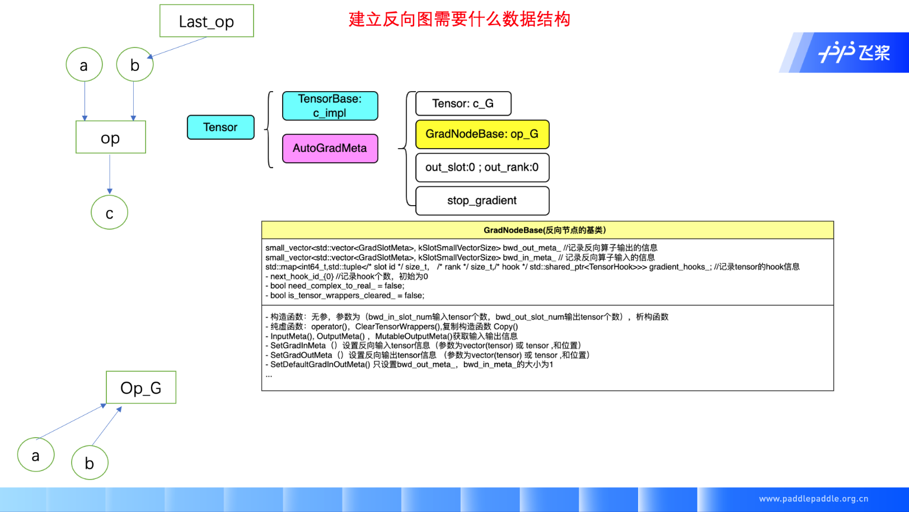
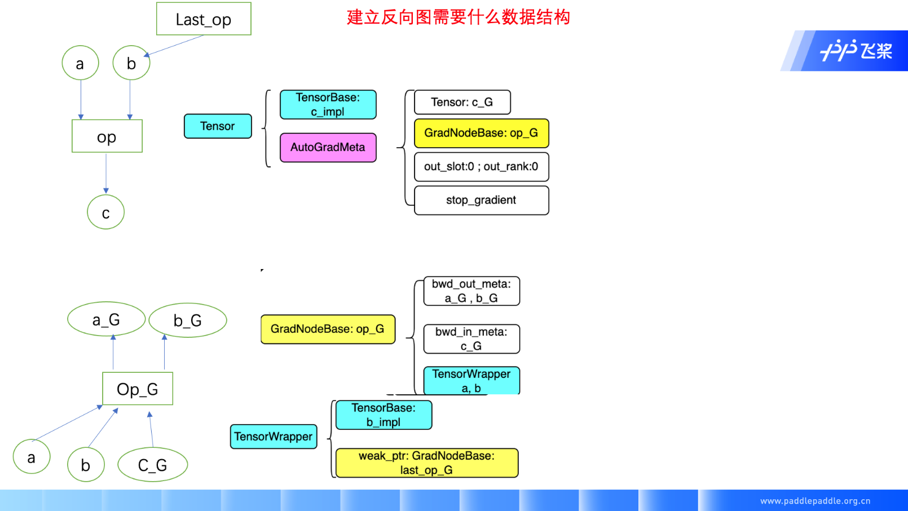
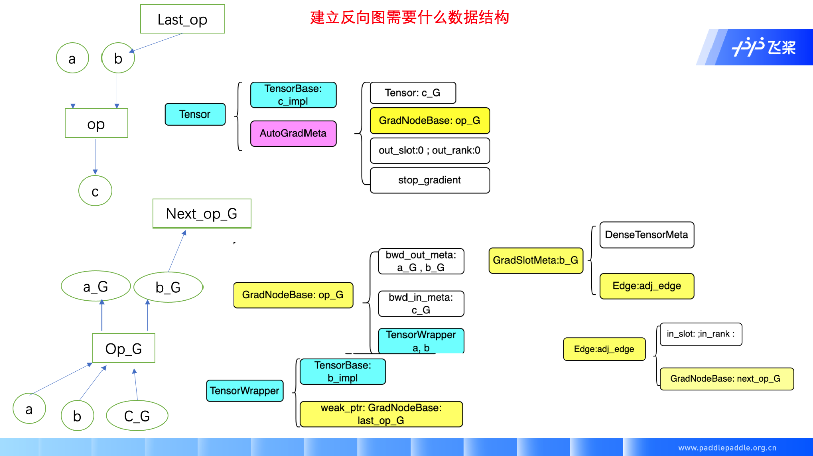

# 动态图自动微分模块类的设计

| 分享内容     | 动态图自动微分模块类的设计                          |
| ------------ | ----------------------------------------------- |
| 提交作者     | wangruting(@xiaoguoguo626807)  |
| 提交时间     | 2022-12-01                                      |
| 版本号       | v1.0                                            |
| 依赖飞桨版本 | develop                                         |
| 文件名       | 20221201_dygraph_sutodifferentiation_datastructure.md |

## 一. Tensor相关类

### 1.1 phi - Tensorbase (抽象类）

* 私有成员友元类 TypeInfoTraitsTypeinfo<Tensorbase> type_info_ {TypeInfo<TensorBase>::kUnknownType}//一个未知类型的TensorBase
* 公有成员虚析构函数；纯虚函数：    numel()数据个数;dims()维度；dtype()数据类型；layout()布局；place()硬件；
    valid（）meta是否有效；initialized（）内存空间是否开辟；
    void* AllocateFrom(Allocator* allocator,
    DataType dtype,
    size_t requested_size = 0)按要求开辟空间。

### 1.2 phi - Tensor
* Tensor类不可被继承，是final类，异构的tensor需要继承tensorbase类实现
* 私有成员：    std::shared_ptr<phi::TensorBase> impl_{nullptr};//描述数据   此处使用TensorBase的抽象类是为了统一不同情况下的Tensor，例如不同大小，不同硬件情况。   std::shared_ptr<AbstractAutogradMeta> autograd_meta_{nullptr};//描述自动微分信息，使用AbstractAutogradMeta纯虚类型进行编译隔离，保证phi不依赖动态图相关信息。   std::string name_{""};tensor的名称用于调试
* 公有成员
  * 构造函数；复制构造函数；移动构造函数；tensor_impl指针构造函数（显式）；硬件，指定大小构造函数；tensor_imp指针+name；name构造函数（显式）；
  * 取值函数：size();dims();shape();reshape();dtype();type();layout();palce();name();
AbstractAutogradMeta* get_autograd_meta() const;返回自动微分信息指针
const std::shared_ptr& mutable_autograd_meta() const;返回自动微分信息shared_ptr
T* mutable_data();获取特殊数据类型的指针（cpu/gpu)一般用于对输出tensor的获得。
T* mutable_data(const Place& place);
const T* data() const;T* data();直接获得数据指针
Tensor slice(int64_t begin_idx, int64_t end_idx) const;返回切割后的部分数据
const std::shared_ptrphi::TensorBase& impl() const;返回tensor实现的指针
  * 判断函数：
is_dense_tensor();is_selected_rows();is_sparse_coo_tensor();
is_sparse_csr_tensor();is_string_tensor();is_cpu();is_gpu();
is_gpu_pinned();is_custom_device();
defined（）impl是否有值；initialized()tensor是否初始化；
  * 转换函数：
Tensor to_sparse_coo(const int64_t sparse_dim) const;
Tensor to_sparse_csr() const;
Tensor to_dense() const;
  * 复制tensor函数：
Tensor copy_to(const Place& target_place) const;复制到指定硬件，返回新tensor
Tensor copy_to(const Place& place, bool blocking) const;
void copy_(const Tensor& src, const Place& target_place, bool blocking);将现有tensor复制
Tensor cast(DataType target_type) const;
  * 设置函数：
reset()重新设置tensorimpl;
set_name(&name)
void set_impl(const std::shared_ptrphi::TensorBase& impl);复制一个shared_ptr
void set_impl(std::shared_ptrphi::TensorBase&& impl);移动一个shared_ptr
void set_autograd_meta(std::shared_ptr autograd_meta);
  * inplace相关函数：
void bump_inplace_version();uint32_t current_inplace_version();
void reset_inplace_version(bool set_to_zero = false);
## 二. 反向图相关类

### 2.1 AbstractAutogradMeta
AutogradMeta的基类，只有一个虚析构函数，不可以建立对象

### 2.2 AutogradMeta :public AbstractAutogradMeta
动态图模式下用于记录自动微分信息，当前向执行结束后仍可从此类中得到自动微分信息
grad_node:前向op对应的反向节点
grad:前向tensor的梯度tensor（只有叶子tensor默认有，非叶子tensor需要设置retain_grad为true
* 私有成员：
  * std::shared_ptr paddle::experimental::Tensor grad_{std::make_shared paddle::experimental::Tensor()};
tensor的梯度信息，构造一个shared_ptr指向tensor，grad_指向此tensor
  * std::shared_ptr grad_node_ = nullptr;
shared_ptr指向此tensor来源的反向算子（该反向算子的输出是此tensor)
  * size_t out_slot_id_; 记录此tensor是前向算子第几个输出（后向算子第几个输入）
  * size_t out_rank_; 记录一个输出tensor可能内部包含多个子向量的个数
                                       （Tensor X = （X0, X1, ...,Xn) Xi是一个向量
* int stop_gradient_{-1};  是否停止梯度计算
* bool persistable_{false};  是否可以被优化
* bool retain_grads_{false}; 是否需要保留梯度信息
* 公有成员：
     - 参数为Edge显式构造函数：AutogradMeta(const Edge& edge = Edge()) 赋值out_slot_id_，out_rank_，grad_node_
     - 析构函数 ~AutogradMeta() override = default
     - Grad（）：判断grad_是否为空，然后返回grad_的值
     - MutableGrad() :返回grad_的实例
     - WeakGrad()： 返回grad_的shared_ptr
     - SetGradNode(const std::shared_ptr<GradNodeBase>& grad_node): 设置grad_node_
     - GetMutableGradNode(): 返回grad_node_的Shared_ptr
     - GradNode(): 返回grad_node_的实例
     - SetSingleOutRankWithSlot(size_t slot_id, size_t rank)： 单独设置输出tensor个数和位置
     - OutRankInfo()：返回输出tensor个数和位置的pair对
     - IsInitialized() ：判断grad_node是否有值
     - bool StopGradient() { return stop_gradient_ != 0; } ：判断是否不需要梯度（true代表不需要梯度）
     - int NumericStopGradient() { return stop_gradient_; }：判断是否不需要梯度
     - SetStopGradient(bool stop_gradient) : 设置stopGradient
     - Persistable() ; SetPersistable(bool persistable)
     - RetainGrads(); SetRetainGrads(bool value)

          至此，我们通过下图描述上述结构如何在实际运行中存在，如图所示，在执行op时，需要a, b两个输入tensor, b tensor是last_op的输出,op的输出为c tensor, 其中a, b，c使用tensor 数据结构存储。如果这个op不需要反向计算，tensor中的autogradmeta 为 AbstractAutogradMeta类型，如果需要反向计算，则为AutogradMeta类型。对于tensor c , AutoGradMeta中主要包含梯度tensor c_G；反向节点op_G,；c作为op的输出对应的位置out_slot, out_rank， slot 代表c是op第几个输出，rank代码c是op第slot个输出的第几个向量；以及stop_gradient信息，记录此tensor是否需要进行反向计算。
          

### 2.3 GradNodeBase
所有反向节点的基类
* 私有成员：
   - paddle::small_vector<std::vector<GradSlotMeta>, kSlotSmallVectorSize> bwd_out_meta_  记录反向过程中梯度输出的信息 
   - paddle::small_vector<std::vector<GradSlotMeta>, kSlotSmallVectorSize> bwd_in_meta_   记录反向过程中梯度输入的信息 
   - std::map<int64_t,std::tuple</* slot id */ size_t， /* rank */ size_t,/* hook */ std::shared_ptr<TensorHook>>>
      gradient_hooks_; 记录tensor的hook信息
   - next_hook_id_{0} 记录hook个数，初始为0
   - bool need_complex_to_real_ = false;
   - bool is_tensor_wrappers_cleared_ = false;
* 公有成员
   - 构造函数：无参，参数为（bwd_in_slot_num输入tensor个数，bwd_out_slot_num输出tensor个数），析构函数
   - 纯虚函数：operator()，ClearTensorWrappers(),复制构造函数 Copy()
   - InputMeta(), OutputMeta() ，MutableOutputMeta()获取输入输出信息
   - SetGradInMeta（）设置反向输入tensor信息（参数为vector(tensor) 或 tensor ,和位置）
   - SetGradOutMeta（）设置反向输出tensor信息 （参数为vector(tensor) 或 tensor ,和位置）
   - SetDefaultGradInOutMeta() 只设置bwd_out_meta_，bwd_in_meta_的大小为1
   - int64_t RegisterGradientHook(size_t slot_id,size_t rank, std::shared_ptr<egr::TensorHook>&& hook);
   - bool RemoveGradientHook(const int64_t& hook_id) 删除gradient_hooks_中某个hook
   - bool GradientHooksRegistered() 判断是否还有hook
   - GetGradientHookFuntions() ; 获取gradient_hooks_
   - SetGradientHookFuntions(); 设置gradient_hooks_
   - ApplyGradientHooks(const paddle::small_vector<std::vector<paddle::experimental::Tensor>, kSlotSmallVectorSize>& tensors) 将双vector变量tensors中的tensor取出（实现没有看懂%%）
   - HandleComplexGradToRealGrad();NeedComplexToRealConversion()
   - IsTensorWrappersCleared() ;SetIsTensorWrappersCleared()

### 2.4 TensorWrapper
私有变量：
  bool no_need_buffer_ = false; // 当只需要tensormeta信息，不需要数据时是true
  paddle::experimental::Tensor intermidiate_tensor_; // Tensor数据
  std::weak_ptr<egr::GradNodeBase> weak_grad_node_; //指向反向节点的弱指针
  uint32_t inplace_version_snapshot_ = 0;
  PyObject* packed_value_{nullptr};
  std::shared_ptr<UnPackHookBase> unpack_hook_;

接下来，我们分析op对应的反向算子op_,其需要前向的输入tensor a, b ，有时也需要前向输出的tensor c, 如果此时仍使用tensor数据结构，会导致 op_G 持有 c tensor, c tensor 持有op_G 形成循环依赖，导致数据无法析构，因此我们设计TensorWrapper数据结构，作为反向算子持有的前向算子输入输出tensor结构，该结构中使用弱指针引用AutogradMeta，（反向算子使用前向输入输出只需要其meta信息或data信息，不需要其自动微分信息），由于有时反向算子不需要data信息，因此tensorwrapper中也设置no_need_buffer_ 变量，当不需要data时减少数据存储开销。Tensorwrapper会作为GradNodeBase的成员变量记录。
当我们执行反向图时，需要通过op_G获得 last_op_G的信息，而这个连接信息将通过 GradNodeBase中的 bwd_out_meta结构存储，该结构存储了反向算子所有的输出meta信息。
 

2.4 GradSlotMeta 
此变量对应tensor,通过edge可以查找其连接的反向节点，meta_中存放此tensor的除数据外的信息。
* 私有成员：
      - bool stop_gradient_{false};
      -  phi::Place place_;
      - std::shared_ptr<phi::DenseTensorMeta> meta_ = nullptr;
      - Edge adj_edge_;
* 公有成员：
      - GradSlotMeta() 默认构造函数
      - SetStopGradient(bool stop_gradient = true) 设置stop_gadient参数
      - SetTensorMeta 设置meta
      - bool HasTensorMeta() 返回meta是否有值
      - GetTensorMeta() 获取meta值
      - SetPlace() ,GetPlace() 
      - SetEdge(const Edge& edge) ,SetEdge( const std::shared_ptr<GradNodeBase>& grad_node,
                               const std::pair</* slot_id */ size_t, /* rank */ size_t>& rank_info)
       - Edge& GetMutableEdge()
       - const Edge& GetEdge() const { return adj_edge_; }
2.5 Edge
反向过程中每个tensor在反向图中以边的形式存在
* 私有成员：
       - in_slot_id:  此输入tensor是下一个节点第几个输入
       - in_rank_:  记录一个输入tensor可能内部包含多个子向量的个数
       - std::shared_ptr<GradNodeBase> grad_node_{nullptr}:  此tensor作为输入的反向节点
* 公有成员：
       - 初始化构造函数，
       - 全参数构造函数1（const std::shared_ptr<GradNodeBase> grad_node_，in_slot_id，in_rank_
       - 全参数构造函数2 (const std::shared_ptr& grad_node,const std::pair</* slot_id / size_t, / rank */ size_t>& rank_info)
       - GetGradNode() 返回grad_node的值
       - GetMutableGradNode() 返回grad_node的shared_ptr，可修改grad_node
       - SetGradNode(const std::shared_ptr<GradNodeBase>& node) 设置反向节点
       - std::pair<size_t, size_t> GetEdgeRankInfo() 返回rank_info pair 对
       - SetEdgeRankInfo(size_t slot_id, size_t in_rank)；
       - SetEdgeRankInfo(const std::pair</* slot_id */ size_t, /* rank */ size_t>& edge_rank)  设置rank_info
       - IsInitialized() 返回grad_nodez是否有值
       - Clear（）重置edge
     
GradNodeBase 结构中的bwd_out_meta 和 bwd_in_meta 是 GradSlotMeta结构的vector， GradslotMeta中包含了stop_gradient 变量记录该输出是否会进行梯度计算，TensorMeta 变量记录该输出的大小信息，以根据此信息创建梯度的buffer;  edge变量记录反向计算下一个节点的信息；
Eage结构中包含in_slot, in_rank记录该边是下一个反向节点第几个输入；GradNodeBase记录下一个节点next_op_G信息

### 2.6 GradTensorHolder
用来存放反向梯度计算时的tensor值
* 私有成员
       paddle::small_vector<std::vector<paddle::experimental::Tensor>, kSlotSmallVectorSize> buffer_; 存放tensor的数值
* 公有成员
     - 构造函数： 
      默认构造函数：
      显式构造： GradTensorHolder(metas) // 通过meta信息开辟内存空间
      显式构造：GradTensorHolder(paddle::small_vector<std::vector<paddle::experimental::Tensor>,kSlotSmallVectorSize>&& inputs)
      : buffer_(std::move(inputs)) {} // 直接使用tensor对buffer_赋值
    - 重载运算符：
      GradTensorHolder& operator=(const GradTensorHolder& other)
      const std::vector<paddle::experimental::Tensor>& operator {return buffer_[pos];}
   - void SetBufferSlotRankZeros(size_t slot_id, size_t rank); 对指定tensor赋值为全零
   - void add(size_t slot_id, size_t rank, const paddle::experimental::Tensor& t,bool create_graph = false);对指定tensor进行加值操作
   - void CopyValueFromTensor(size_t slot_id,size_t rank, const paddle::experimental::Tensor& t,bool fill_one = false);对指定tensor进行赋值
      
GradTensorHolder是反向计算执行过程中存放梯度值的变量，承担梯度聚合的功能。
