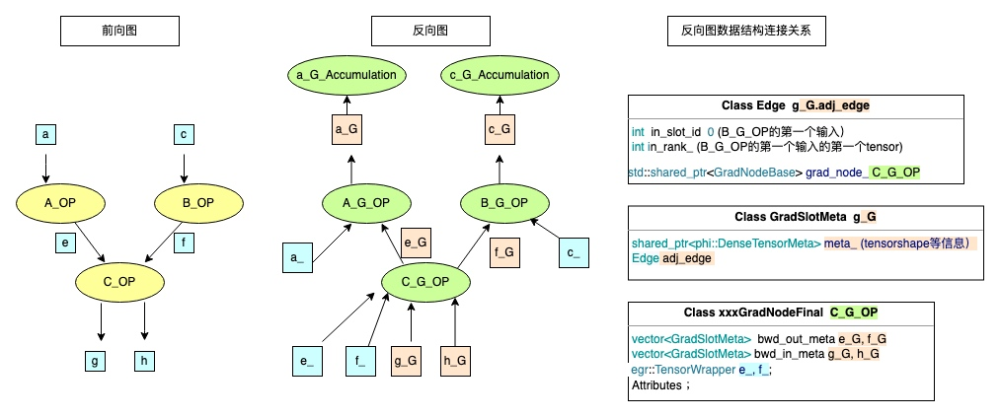
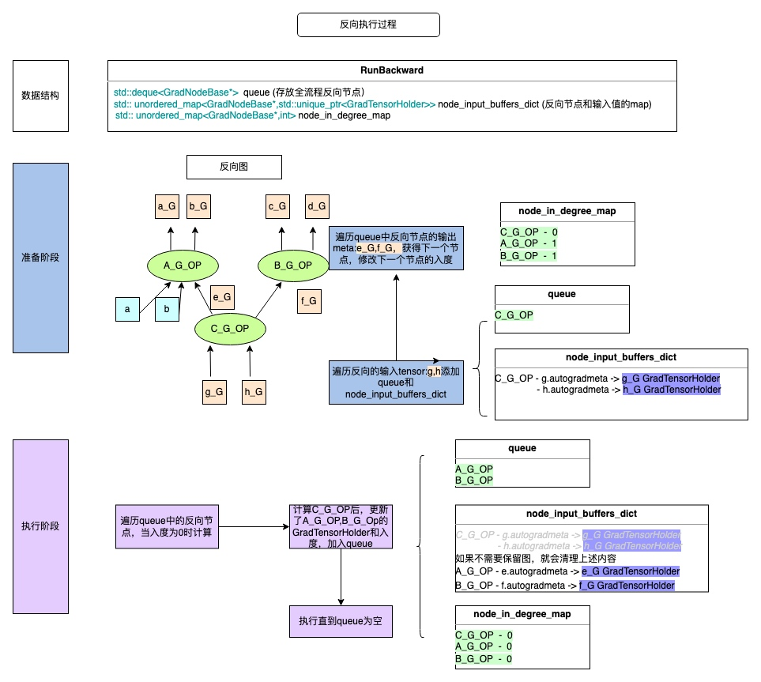
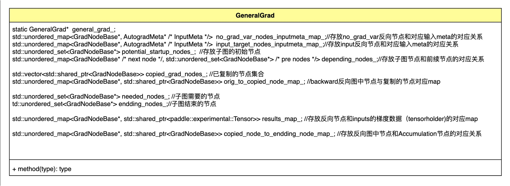
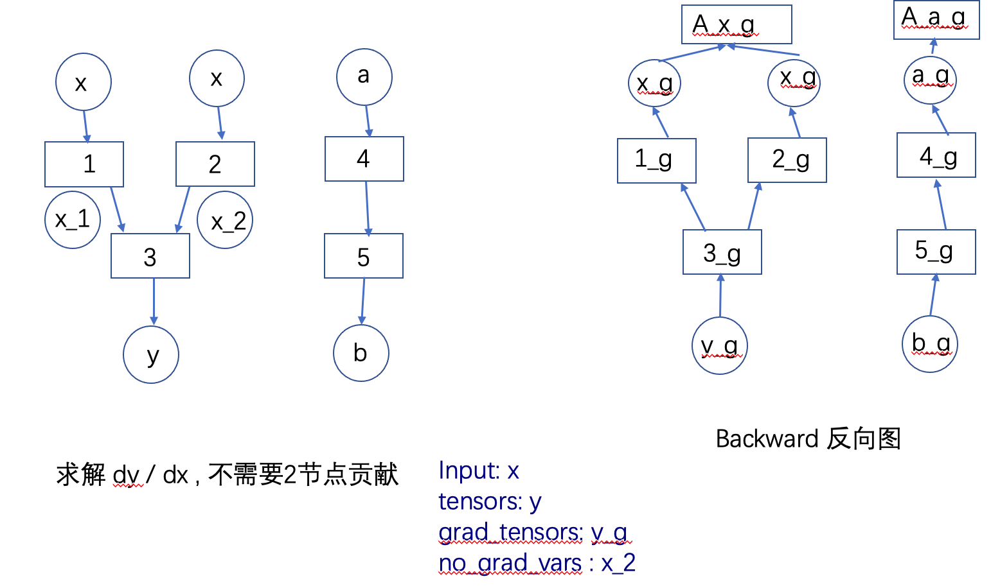
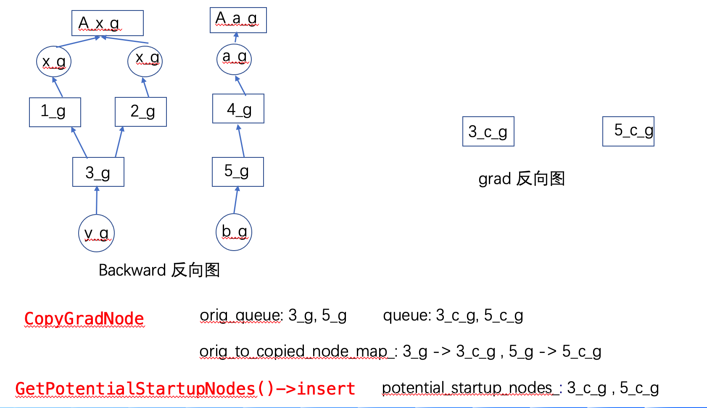
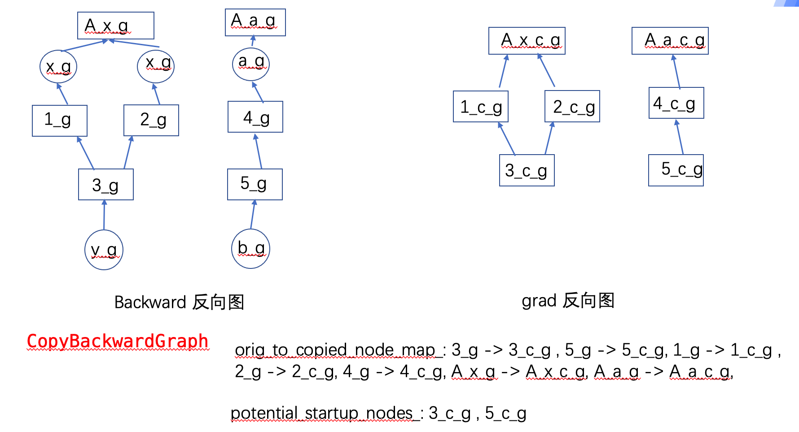
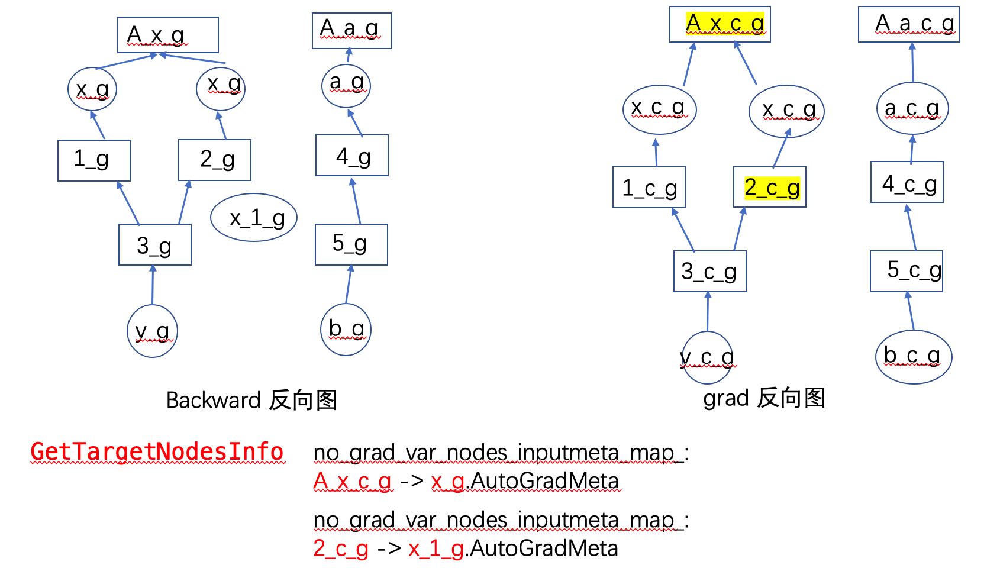
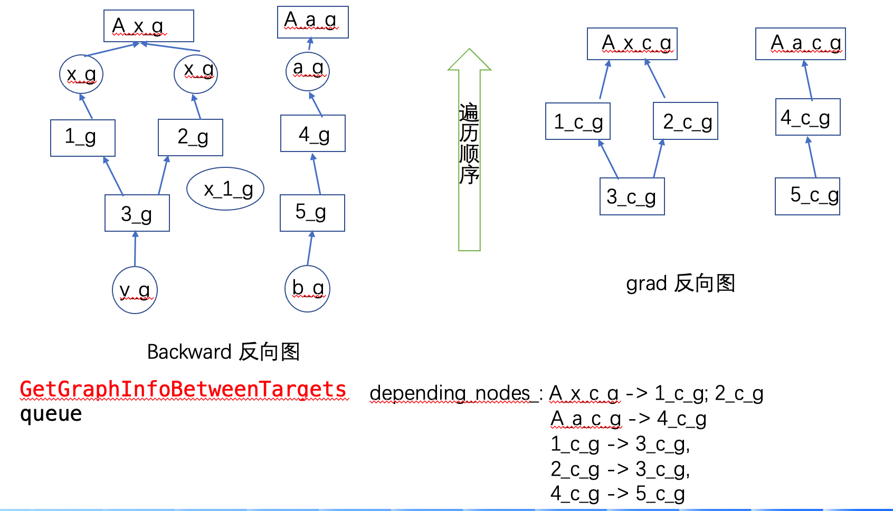
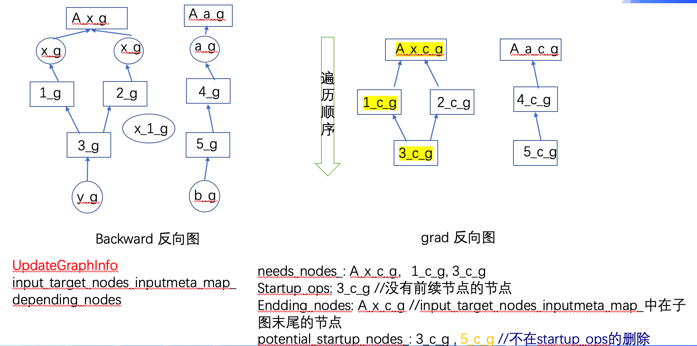
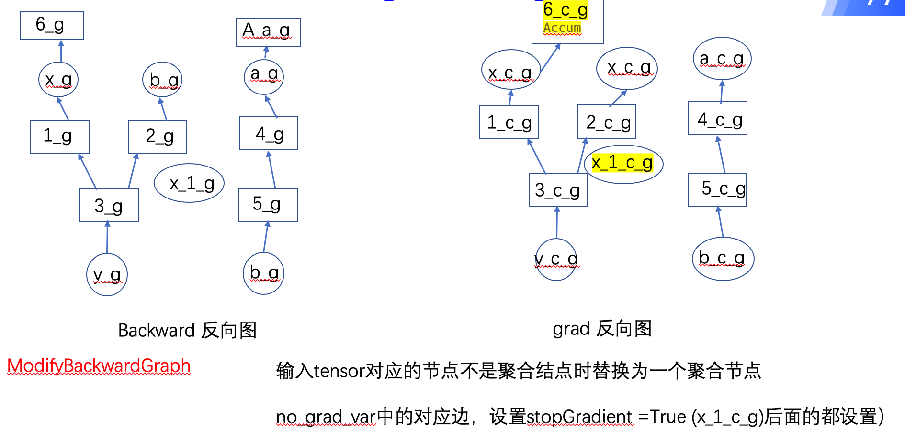

# 动态图反向计算

| 分享内容     | 动态图反向计算                          |
| ------------ | ----------------------------------------------- |
| 提交作者     | wangruting(@xiaoguoguo626807)  |
| 提交时间     | 2022-12-01                                      |
| 版本号       | v1.0                                            |
| 依赖飞桨版本 | develop                                         |
| 文件名       | 20221201_dygraph_backward.md |

## 一：用户端到框架层调用路径
- python API      ->    python-c (eager_function.cc )               ->    c++ (backward.cc)
- loss.backward() ->    run_backward <-> eager_api_run_backward     ->    Backward(){Runbackward()}
- paddle.grad() ->                                                  -> Grad(){Runbackward}

## 二. Backward() / Grad()接口
```c++
void Backward(
    const std::vector<paddle::experimental::Tensor>& tensors,  // 前向输出tensor
    const std::vector<paddle::experimental::Tensor>& grad_tensors, //前向输出tensor初始梯度
    bool retain_graph) 

std::vector<paddle::experimental::Tensor> Grad(
    const std::vector<paddle::experimental::Tensor>& tensors,  // 前向输出tensor
    const std::vector<paddle::experimental::Tensor>& inputs,  //前向输入tensor，作为反向的输入
    const std::vector<paddle::experimental::Tensor>& grad_tensors, //前向输出tensor初始梯度
    bool retain_graph,//是否保留计算梯度的前向图。若值为 True，则前向图会保留，用户可对同一张图求两次反向。若值为 False，则前向图会释放。默认值为 None，表示值与 create_graph 相等。
    bool create_graph,//是否创建计算过程中的反向图。若值为 True，则可支持计算高阶导数。若值为 False，则计算过程中的反向图会释放。默认值为 False
    bool only_inputs,//是否只计算 inputs 的梯度。若值为 False，则图中所有叶节点变量的梯度均会计算，并进行累加。若值为 True，则只会计算 inputs 的梯度。默认值为 True。only_inputs=False 功能正在开发中，目前尚不支持。
    bool allow_unused,//决定当某些 inputs 变量不在计算图中时抛出错误还是返回 None。若某些 inputs 变量不在计算图中（即它们的梯度为 None），则当 allowed_unused=False 时会抛出错误，当 allow_unused=True 时会返回 None 作为这些变量的梯度。默认值为 False。
    const std::vector<paddle::experimental::Tensor>& no_grad_vars//指定不计算梯度的变量){
DuplicateCheck(inputs, true /* is_input */); //检查是否有重复的tensor
DuplicateCheck(tensors, false /* is_input */);
return RunBackward(tensors,grad_tensors,retain_graph,create_graph,inputs,allow_unused,no_grad_vars);
}
```
## 三. backward反向流程
### 前向执行后数据结构图：
动态图反向相关类的解析文档：  20221201_dygraph_sutodifferentiation_datastructure.md  
前向过程执行结束后，反向节点Grad_node创建，其中包含反向输入tensor信息 bwd_in_meta_，反向输出信息 bwd_out_meta_  
GradSlotMeta中包含 adj_edge_  
Edge中包含 in_slot_id ,in_rank, grad_node   

### 反向执行过程及执行中数据结构：
反向计算过程通过run_backward函数遍历整个反向图，其中借助数据结构queue 存放所有需要执行的反向节点；node_input_buffers_dict存放反向节点和输入tensor数据的对应关系；node_in_degree_map存放反向节点和其入度的对应关系，其中入度是指输入tensor没有准备好的个数，为0时代表该节点可以执行。  
整个函数中分为准备和执行两个阶段：  准备阶段将反向图的拓扑图第一层的节点放入queue中，更新该节点的node_inout_buffers_dict。同时遍历整个图更新node_in_degree_map。  执行阶段遍历queue中的节点执行，执行后更新其他节点的node_inout_buffers_dict，node_in_degree_map， 当入度为0时加入queue中，直到所有节点执行结束。


### 代码分析
#### 1> 准备阶段：
```c++
std::vector<paddle::experimental::Tensor> RunBackward(
    const std::vector<paddle::experimental::Tensor>& tensors,  // 前向输出tensor
    const std::vector<paddle::experimental::Tensor>& grad_tensors, //前向输出tensor的初始梯度
    bool retain_graph, //是否保存图
    bool create_graph = false,
    const std::vector<paddle::experimental::Tensor>& inputs = {},
    bool allow_unused = false,
    const std::vector<paddle::experimental::Tensor>& no_grad_vars = {}) 
```
* 若输入为空，则是general_grad （是否是 paddle.grad 计算任意输出对任意输入的梯度)
```c++
bool is_general_grad = !inputs.empty();
  if (is_general_grad) GeneralGrad::Instance().Clear();
```
* 根据初始反向节点构造反向执行需要的数据结构
```c++
// 存放反向梯度传播的反向节点
std::deque<GradNodeBase*> queue;
//临时存放的反向节点（通用梯度计算）
std::deque<GradNodeBase*> orig_queue;
// 存放反向节点和输入梯度信息（Meta）和数据（impl)的对应map
std::unordered_map<GradNodeBase*, std::unique_ptr<GradTensorHolder>> node_input_buffers_dict;
* 遍历输出tensor的vector变量 tensors ，获取反向节点grad_node放入队列，更新node_input_buffers_dict map
  
for (size_t i = 0; i < tensors.size(); i++) {
    const paddle::experimental::Tensor& tensor = tensors[i];
    // 对每个tensor创建反向信息：auto_grad_meta
    AutogradMeta* auto_grad_meta = EagerUtils::nullable_autograd_meta(tensor);
    if (auto_grad_meta == nullptr) {}
    // 获取输出tensor是第几个输出out_slot_id_；第几个tensor out_rank_
    auto input_info = auto_grad_meta->OutRankInfo();
    // 获取该tensor作为输入的反向节点
    auto shared_grad_node = auto_grad_meta->GetMutableGradNode();
    if (shared_grad_node == nullptr || shared_grad_node.get() == nullptr ||
        auto_grad_meta->StopGradient()) {}
    // 获得普通grad_node的指针变量
    GradNodeBase* grad_node = shared_grad_node.get();
    if (is_general_grad) {
      // Save orig grad node
      orig_queue.push_back(grad_node);
      // Replace grad_node with copied grad_node
      grad_node = GeneralGrad::Instance().CopyGradNode(shared_grad_node);
      // Record potential startup grad node
      GeneralGrad::Instance().GetPotentialStartupNodes()->insert(grad_node);
    }

    // 准备 GradTensorHolder
    if (!node_input_buffers_dict.count(grad_node)) {
      VLOG(6) << "Create Value for grad input tensor " << i
              << " of grad node: " << grad_node->name();
      node_input_buffers_dict[grad_node] =
          std::make_unique<GradTensorHolder>(grad_node->InputMeta());
    }
    //查看是否初始化了梯度
    bool copy_from_grad_t =
        grad_tensors.size() > 0 && grad_tensors[i].initialized();
    if (copy_from_grad_t) {
      // 将grad_tensor中的值深拷贝到GradTensorHolder中
      node_input_buffers_dict[grad_node]->CopyValueFromTensor(
          input_info.first, input_info.second, grad_tensors[i]);
    } else {
      // 使用全1tensor作为初始梯度值
      node_input_buffers_dict[grad_node]->CopyValueFromTensor(
          input_info.first, input_info.second, tensor, /*fill_one=*/true);
    }
    //将反向节点加入队列
    queue.push_back(grad_node);
  }
```
```c++
if (is_general_grad) {
    // Prepare several vital preprocess for GeneralGrad
    GeneralGrad::Instance().PreparedForGeneralGrad(
        inputs, no_grad_vars, orig_queue, &queue, node_input_buffers_dict);
  }
```
通过遍历队列，获取每个节点的入度（入度是指输入tensor的GradGTensorHolder中还没有值的tensor个数）
```c++
  std::unordered_map<GradNodeBase*, int> node_in_degree_map =
      getInDegreeMap(queue);
std::unordered_map<GradNodeBase*, int> getInDegreeMap(
    const std::deque<GradNodeBase*>& init_queue) {
  //定义返回值（反向节点，入度）map
  std::unordered_map<GradNodeBase*, int> node_in_degree_map;
  // 定义内部遍历变量，存放全部反向节点的双端队列
  std::deque<GradNodeBase*> queue = init_queue;
  // 存放已经遍历过的反向节点的集合
  std::unordered_set<GradNodeBase*> visited;

  // Visit each node exactly once in any order
  while (!queue.empty()) {
    // 获取一个节点进行处理
    GradNodeBase* node = queue.front();
    queue.pop_front();
    if (visited.count(node)) {
      continue;
    }
    visited.insert(node);
    // 获得此节点的输出tensor meta vector<vector>
    const paddle::small_vector<std::vector<GradSlotMeta>, kSlotSmallVectorSize>&
        metas = node->OutputMeta();
    // 逐层遍历每个Meta,通过其中边的结构获得此tensor的下一个反向节点 next_node
    for (const auto& meta_list : metas) {
      for (const GradSlotMeta& meta : meta_list) {
        const auto& edge = meta.GetEdge();
        GradNodeBase* next_node = edge.GetMutableGradNode().get();
        // 叶子tensor没有next_node
        // AccumulationNode attached
        // Or it could also originated from dispensable inputs
        if (!next_node) continue;

        // 如果next_node没有遍历过（不在map中），则需要在map中为其加一个入度并加入遍历队列中
        if (!node_in_degree_map.count(next_node))
          node_in_degree_map[next_node] = 0;
          node_in_degree_map[next_node]++;
          queue.push_back(next_node);
      }
    }
  }
  //遍历完所有节点后得到个节点和其入度的map
  return node_in_degree_map;
}
```
#### 2> 执行阶段
```c++
while (!queue.empty()) {
    GradNodeBase* node = queue.front();
    //入度不为0的反向节点代表输入数据没有准备好，因此不能执行，直接跳到下一个节点
    if (queue.size() > 1 && node_in_degree_map[node] != 0) {
      queue.pop_front();
      continue;
    }
    queue.pop_front();

    // 判断node-tensorHolder map中有没有此节点
    auto node_input_buffer_iter = node_input_buffers_dict.find(node);
    PADDLE_ENFORCE_NE(
        node_input_buffer_iter,
        node_input_buffers_dict.end(),
        paddle::platform::errors::Fatal(
            "Unable to find next node in the GradTensorHolder \n"
            "Trying to run Node without configuring its GradTensorHolder."));
    //获得此节点的输入tensorholder
    std::unique_ptr<GradTensorHolder> node_input_buffer =
        std::move(node_input_buffer_iter->second);

    // 查看输入tensor是否被清理，如果被清理有可能是对同一子图计算了两次反向，但是没有设置retain_graph为True,子图相关信息被清理
    EnforceGradNodeHasInput(node);
    //调用此反向节点的执行函数，传入输入tensor的值
    paddle::small_vector<std::vector<paddle::experimental::Tensor>,
                         kSlotSmallVectorSize>
        grad_output_tensors = (*node)(
            node_input_buffer->Buffers(), create_graph, is_general_grad);
    // 通用反向传递设置结束节点
    if (!inputs.empty() && is_general_grad) {
      GeneralGrad::Instance().SetResultForEnddingNodes(grad_output_tensors,
                                                       node);
    }

```
如果不需要保留图，将清理此节点的输入数据，从map中移出此节点
```c++
if (!retain_graph) {
      node->ClearTensorWrappers();
 }
 node_input_buffers_dict.erase(node_input_buffer_iter);
```

准备下一个节点的输入GradTensorHolder
```c++
const paddle::small_vector<std::vector<GradSlotMeta>, kSlotSmallVectorSize>&
        metas = node->OutputMeta();
    //对比输出的tensor个数是否和反向节点输出的tensor个数相同
    PADDLE_ENFORCE(metas.size() == grad_output_tensors.size() || metas.empty(),
                   paddle::platform::errors::Fatal(
                       "Number of edges should be either empty ( for leaf node "
                       ") or the same as number of output grad tensors, but we "
                       "got edges size is: %d, grad_output size is: %d",
                       metas.size(),
                       grad_output_tensors.size()));
    //遍历输出meta vector<vector> 
    for (size_t i = 0; i < metas.size(); i++) {
      for (size_t j = 0; j < metas[i].size(); j++) {
        //获取输出tensor meta中的edge信息,
        const Edge& edge = metas[i][j].GetEdge();
        if (!edge.IsInitialized()) {continue;}
        //获得此tensor作为下一个反向节点输入的位置信息
        auto edge_rank = edge.GetEdgeRankInfo();
        //获得此tensor做为输入的下一个节点
        auto next_node_shared = edge.GetMutableGradNode();
        //如果是叶子节点则跳过
        if (!next_node_shared || !next_node_shared.get() ||
            grad_output_tensors[i].empty()) {
          continue;
        }
        //获得此输出tensor的值
        paddle::experimental::Tensor& grad_output_tensor =
            grad_output_tensors[i][j];
        //无值报错
        if ((!grad_output_tensor.defined() ||!grad_output_tensor.initialized())) { }
        //获得此tensor作为输入的下一个反向节点
        auto* next_node = next_node_shared.get();
        //如果此反向节点不在node->GradTensorHolder map中，需要为其创建GradTensorHolder 并添加到map中
        if (!node_input_buffers_dict.count(next_node)) {
          const auto& input_meta = next_node->InputMeta();
          auto grad_tensor_holder = std::make_unique<GradTensorHolder>(input_meta);
          node_input_buffers_dict[next_node] = std::move(grad_tensor_holder);
        }
        //给下一个反向节点的输入GradTensorHolder赋值
        node_input_buffers_dict[next_node]->add(edge_rank.first,
                                                edge_rank.second,
                                                grad_output_tensor,
                                                create_graph);
                                                
        //需要对node->indegree map进行更新，由于next_node的一个输入tensor已准备好，入度减1
        node_in_degree_map[next_node]--;

        if (is_general_grad) {
          if (node_in_degree_map[next_node] == 0 &&
              GeneralGrad::Instance().IsNeededNodes(next_node)) {
            if (dynamic_cast<egr::GradNodeAccumulation*>(next_node)) {
              queue.push_front(std::move(next_node));
            } else {
              queue.push_back(std::move(next_node));
            }
          }
        } else {
          //当next_node的入度为0时，需要对此反向节点加入队列进行计算
          if (node_in_degree_map[next_node] == 0) {
            //是叶子节点优先计算
            if (dynamic_cast<egr::GradNodeAccumulation*>(next_node)) {
              queue.push_front(std::move(next_node));
            } else {
              queue.push_back(std::move(next_node));
            }
          }
        }
      }// meta第二层循环 （rank）
     }// meta第一层循环（slot）
```
Hook执行
```c++
  for (auto& hook : egr::Controller::Instance().FinalBackwardHooks()) {
    (*hook)();
  }
  egr::Controller::Instance().ClearFinalBackwardHooks();
  if (!is_general_grad) return {};
  return GeneralGrad::Instance().GetResults(inputs, allow_unused, create_graph);
```
### 四.  general_grad

#### 基础数据结构：
general_grad数据结构是为grad()接口设计的类，全局只有一个实例


backward中处理逻辑
grad 接口与 backward 接口共用run_backward()函数，以下省略共用逻辑，分析general_grad特殊处理逻辑
```c++
// 设置全局的GeralGrad实例
GeneralGrad* GeneralGrad::general_grad_ = new GeneralGrad();

std::vector<paddle::experimental::Tensor> RunBackward(
    const std::vector<paddle::experimental::Tensor>& tensors,  //前向输出Tensor
    const std::vector<paddle::experimental::Tensor>& grad_tensors, //前向输出Tensor的梯度
    bool retain_graph, //是否保存图
    bool create_graph = false,
    const std::vector<paddle::experimental::Tensor>& inputs = {},//前向输入Tensor
    bool allow_unused = false,
    const std::vector<paddle::experimental::Tensor>& no_grad_vars = {}//不需要返回梯度的tensor) {
  
  // 判断是否是generalGrad FLAG
  bool is_general_grad = !inputs.empty();
  if (is_general_grad) GeneralGrad::Instance().Clear();

  ...
  
  for (size_t i = 0; i < tensors.size(); i++) {
    ... //获取反向节点Grad_node
    if (is_general_grad) {
      // 保存原有反向节点
      orig_queue.push_back(grad_node);
      // 拷贝新的反向节点作为初始节点
      grad_node = GeneralGrad::Instance().CopyGradNode(shared_grad_node);
      // 存放部分图的初始节点,potential_startup_nodes_ 中添加拷贝后的初始节点
      GeneralGrad::Instance().GetPotentialStartupNodes()->insert(grad_node);
    }

    ...// 准备queue 和 node_input_buffer_dict
    
  }

  if (is_general_grad) {
    // Prepare several vital preprocess for GeneralGrad
    GeneralGrad::Instance().PreparedForGeneralGrad(
        inputs, no_grad_vars, orig_queue, &queue, node_input_buffers_dict);
  }

  ...//获取每个节点的入度 node_in_degree_map 
  while (!queue.empty()) {
    ...//检查节点准备输入数据；反向函数执行
    //如果此时执行的node是grad()的结束节点，将输出添加至results_map_中
    if (!inputs.empty() && is_general_grad) {
      GeneralGrad::Instance().SetResultForEnddingNodes(grad_output_tensors,
                                                       node);
    }

    for (size_t i = 0; i < metas.size(); i++) {
      for (size_t j = 0; j < metas[i].size(); j++) {
         ...//从输出Meta信息中获得edge信息，获得后继节点添加到node_input_buffers_dict中，将本节点计算得到的输出值赋给node_input_buffers_dict对应GradTensorHolder
        
        //当grad子图有此节点时才加入计算队列queue
        if (is_general_grad) {
          if (node_in_degree_map[next_node] == 0 &&
              GeneralGrad::Instance().IsNeededNodes(next_node)) {
            if (dynamic_cast<egr::GradNodeAccumulation*>(next_node)) {
              queue.push_front(std::move(next_node));
            } else {
              queue.push_back(std::move(next_node));
            }
          }
        } else {
          if (node_in_degree_map[next_node] == 0) {
            if (dynamic_cast<egr::GradNodeAccumulation*>(next_node)) {
              queue.push_front(std::move(next_node));
            } else {
              queue.push_back(std::move(next_node));
            }
          }
        }
      }
    }
  }
  }
  egr::Controller::Instance().ClearFinalBackwardHooks();
  //返回grad子图需要的输入tensor的梯度
  if (is_general_grad) {
     return GeneralGrad::Instance().GetResults(inputs, allow_unused, create_graph);
  }
}
```

以下图为例，假设需要计算y对x的梯度，不需要节点2的贡献，则调用形式为grad(x, y, grad_tensors=y_g, no_grad_vars=x_2)，在调用此接口时全局已经存在backward需要执行的全流程反向图。


#### 调用函数分析
复制节点（深拷贝）
```
GradNodeBase* CopyGradNode(const std::shared_ptr<GradNodeBase>& orig_node) {
    if (orig_to_copied_node_map_.count(orig_node.get())) {
      return orig_to_copied_node_map_[orig_node.get()].get();
    }
    std::shared_ptr<GradNodeBase> copied_node = orig_node->Copy();

    // 更新原始节点和复制后节点的map, 更新复制后的节点set
    orig_to_copied_node_map_[orig_node.get()] = copied_node;
    copied_grad_nodes_.push_back(copied_node);

    return copied_node.get();
  }

std::unordered_set<GradNodeBase*>* GetPotentialStartupNodes() {
    return &potential_startup_nodes_;
  }
```
调用以上函数后，general_grad的变量分别更新为下图，orig_queue存放拓扑图第一层节点，queue中存放复制的子图的第一层节点，orig_to_copied_node_map存放原图节点和复制后节点的对应关系。


准备general_grad的相关数据结构
```c++
void PreparedForGeneralGrad() {
    // 遍历orig_queue中的节点，从orig_to_copied_node_map_中查找复制的节点对，逐步复制后续的反向图，更新copied_grad_nodes_
    CopyBackwardGraph(orig_queue);
    
    // 获取 no_grad_vars 和 inputs 的反向节点和节点对应的输入meta信息，更新xxx_nodes_inputmeta_map_
    GetTargetNodesInfo(no_grad_vars, true /* is_no_grad_vars */);
    GetTargetNodesInfo(inputs, false /* is_no_grad_vars */);
    
    // 删除potential_startup_nodes_中输入tensor的反向节点（input = output)
    PurifyPotentialStartUpNodes();
    
    // 获取输入到输出的图信息更新depending_nodes_（子图节点和前续节点对应关系）
    GetGraphInfoBetweenTargets(*queue);
    
    // 确定反向开始的节点和结束的节点,potential_startup_nodes中只剩此次计算路径上的初始节点
    UpdateGraphInfo();
    // 将queue指向新的queue（其中只有potential_startup_nodes中的节点）
    ModifyReadyQueue(queue);
    
    if (queue->empty()) {
    //当初始节点为空，在result_map_中设置输入tensor的梯度结果
    SetResultForInputTargetVar(node_input_buffers_dict);
    } else {
    // 对结束节点设置AccumulationNode，遍历节点的输出Meta设置no_grad_var的stopGradient为True
    ModifyBackwardGraph(queue);
    //  注册输入tensor的hook便于获得输入的梯度
    RegisterFetchGradHook(inputs);
         }
}
```
遍历orig_queue中的节点，从orig_to_copied_node_map_中查找复制的节点对，逐步复制后续的反向图。

```c++
void CopyBackwardGraph(const std::deque<GradNodeBase*>& orig_init_queue) {
    //只有拓扑图中第一层的节点
    std::deque<GradNodeBase*> queue = orig_init_queue;
    std::unordered_set<GradNodeBase*> visited;

    // BFS and recursively copy the grad nodes
    while (!queue.empty()) {
      //获取一个节点
      GradNodeBase* orig_node = queue.front();
      queue.pop_front();
      if (visited.count(orig_node)) {
        continue;
      }
      visited.insert(orig_node);
      //获得其复制后的节点 copied_node
      GradNodeBase* copied_node = orig_to_copied_node_map_[orig_node].get();
      //获取原始节点的输出边meta信息
      const paddle::small_vector<std::vector<GradSlotMeta>,kSlotSmallVectorSize>& orig_meta =
            orig_node->OutputMeta();
      //获取复制后节点的输出边meta信息
      paddle::small_vector<std::vector<GradSlotMeta>, kSlotSmallVectorSize>&
          copied_edges = copied_node->MutableOutputMeta();
      //遍历每一条输出的边
      for (size_t i = 0; i < orig_meta.size(); i++) {
        for (size_t j = 0; j < orig_meta[i].size(); j++) {
          const Edge& orig_edge = orig_meta[i][j].GetEdge();
          Edge& copied_edge = copied_edges[i][j].GetMutableEdge();
          //获得此输出边的下一个节点
          std::shared_ptr<GradNodeBase> orig_next_node =
              orig_edge.GetMutableGradNode();
          if (!orig_next_node) continue;

          // 复制下一个节点
          std::shared_ptr<GradNodeBase> copied_next_node;
          if (orig_to_copied_node_map_.count(orig_next_node.get())) {
            copied_next_node = orig_to_copied_node_map_[orig_next_node.get()];

          } else {
            copied_next_node = orig_next_node->Copy();
            orig_to_copied_node_map_[orig_next_node.get()] = copied_next_node;
            copied_grad_nodes_.push_back(copied_next_node);
          }

          // 将复制的边信息绑定此复制节点
          copied_edge.SetGradNode(copied_next_node);

          // 将下一个节点加入队列
          queue.push_back(orig_next_node.get());
        }
      }
    }
  }
```

GetTargetNodesInfo 获取 no_grad_vars 和 inputs 的反向节点和节点对应的输入meta信息，更新xxx_nodes_inputmeta_map_，复制后的反向节点和原始反向节点的输入tensor的AutoGradMeta信息对应关系。

```c++
void GetTargetNodesInfo(
      const std::vector<paddle::experimental::Tensor>& inputs,
      bool is_no_grad_vars) {
    std::string msg = is_no_grad_vars ? "no_grad_vars" : "inputs";
    VLOG(6) << "Running in GetTargetNodesInfo.";
    //遍历每一个输入的边
    if (!inputs.empty()) {
      VLOG(6) << msg << " are not empty.";
      size_t num_inputs = inputs.size();
      for (size_t i = 0; i < num_inputs; i++) {
        //从输入边的反向梯度信息中得到对应的反向节点
        AutogradMeta* auto_grad_meta = EagerUtils::unsafe_autograd_meta(inputs[i]);
        auto* target_node = auto_grad_meta->GetMutableGradNode().get();
        //获得该节点复制后的节点
        if (orig_to_copied_node_map_.count(target_node)) {
          target_node = orig_to_copied_node_map_[target_node].get();
        } else {
          VLOG(6) << "Unable to find target node in "
                     "orig_to_copied_node_map_, likely indicating an "
                     "unused input";
        }

        PADDLE_ENFORCE_NOT_NULL(target_node,
                                paddle::platform::errors::Fatal(
                                    "There is no grad op for %s:[%d] or it's"
                                    "stop_gradient=True.",
                                    msg,
                                    i));
        //将对应的复制后的节点和反向信息加入map中
        if (is_no_grad_vars) {
          (no_grad_var_nodes_inputmeta_map_)[target_node] = auto_grad_meta;
        } else {
          (input_target_nodes_inputmeta_map_)[target_node] = auto_grad_meta;
        }
      }
    }
  }
  ```

  ```c++
PurifyPotentialStartUpNodes 删除potential_startup_nodes_中输入tensor的反向节点（input = output)
  void PurifyPotentialStartUpNodes() {
    VLOG(6) << "Running in PurifyPotentialStartUpNodes";
    if (input_target_nodes_inputmeta_map_.empty()) return;
    std::unordered_set<GradNodeBase*> potential_startup_nodes_to_be_erased;
    for (auto startup_op : potential_startup_nodes_) {
      auto iter = input_target_nodes_inputmeta_map_.find(startup_op);
      if (iter != input_target_nodes_inputmeta_map_.end()) {
        potential_startup_nodes_to_be_erased.emplace(iter->first);
      }
    }
    if (!potential_startup_nodes_to_be_erased.empty()) {
      for (auto nodes : potential_startup_nodes_to_be_erased) {
        potential_startup_nodes_.erase(nodes);
      }
    }
  }
```
GetGraphInfoBetweenTargets 获取输入到输出的图信息由下至上更新depending_nodes_（子图节点和前续节点对应关系）

```c++
void GetGraphInfoBetweenTargets(const std::deque<GradNodeBase*>& init_queue) {
    VLOG(6) << "Runing In GetGraphInfoBetweenTargets";

    // 复制初始节点的queue
    std::deque<GradNodeBase*> queue = init_queue;
    std::unordered_set<GradNodeBase*> visited;

    // 按照拓扑顺续遍历所有节点
    while (!queue.empty()) {
      GradNodeBase* node = queue.front();
      queue.pop_front();

      if (visited.count(node)) {
        continue;
      }
      visited.insert(node);

      // Find and append next nodes
      const paddle::small_vector<std::vector<GradSlotMeta>,
                                 kSlotSmallVectorSize>& metas =
          node->OutputMeta();
      for (const auto& meta_list : metas) {
        for (const GradSlotMeta& meta : meta_list) {
          const auto& edge = meta.GetEdge();
          GradNodeBase* next_node = edge.GetMutableGradNode().get();

          if (!next_node) continue;

          // 更新前续节点信息【节点->（前向node集合】
          (depending_nodes_)[next_node].emplace(node);
          queue.push_back(next_node);
        }
      }
    }
  }
  ```
UpdateGraphInfo 从上向下遍历图，确定反向开始的节点startup_ops和结束的节点ending_nodes, 以及需要计算的节点 needs_nodes, potential_startup_nodes中只剩此次计算路径上的初始节点.

```c++
void UpdateGraphInfo() {
    std::unordered_set<GradNodeBase*> startup_ops;
    std::deque<GradNodeBase*> queue;
    //从输入的tensormap中获取对应的节点加入queue和needed_nodes_（需要的节点set）中
    for (auto& target_nodes_inputmeta_pair : input_target_nodes_inputmeta_map_) {
      queue.push_back(target_nodes_inputmeta_pair.first);
      needed_nodes_.emplace(target_nodes_inputmeta_pair.first);
    }
    std::unordered_set<GradNodeBase*> visited;
    std::unordered_set<GradNodeBase*> input_target_nodes_on_path;
    //遍历queue中每个节点
    while (!queue.empty()) {
      auto* target_node = queue.front();
      queue.pop_front();
      if (visited.count(target_node)) {
        continue;
      }
      visited.insert(target_node);
      //将每一个前继节点加入queue和needed_nodes_
      if (!(depending_nodes_)[target_node].empty()) {
        auto precedding_nodes = (depending_nodes_)[target_node];
        for (auto pre_nodes : precedding_nodes) {
          queue.push_back(pre_nodes);
          needed_nodes_.emplace(pre_nodes);
          //如果在输入tensormap中有此节点，加入到input_target_nodes_on_path临时路径中
          if (IsInputTargetNodes(pre_nodes)) {
            input_target_nodes_on_path.emplace(pre_nodes);
          }
        }
      } else {  // 当没有前续节点时说明此节点是初始节点
        VLOG(6) << "Emplace startup_ops";
        startup_ops.emplace(target_node);
        needed_nodes_.emplace(target_node);
      }
    }

    for (auto& target_nodes_inputmeta_pair : input_target_nodes_inputmeta_map_) {
      //输入tensor的map中的节点如果不在input_target_nodes_on_path临时路径中，则是结束的节点
      if (!input_target_nodes_on_path.count(target_nodes_inputmeta_pair.first)) {
        endding_nodes_.emplace(target_nodes_inputmeta_pair.first);
      }
    }

    //开始节点startup_ops中没有的节点会在potential_startup_nodes_中被删除
    if (!startup_ops.empty()) {
      std::unordered_set<GradNodeBase*> potential_startup_nodes_to_be_erased;
      for (auto node : potential_startup_nodes_) {
        if (startup_ops.count(node) == 0) {
          VLOG(6) << "Set up potential_startup_nodes_to_be_erased";
          potential_startup_nodes_to_be_erased.emplace(node);
        }
      }
      if (!potential_startup_nodes_to_be_erased.empty()) {
        for (auto node : potential_startup_nodes_to_be_erased) {
          VLOG(6) << "Erase nodes in potential_startup_nodes_to_be_erased";
          potential_startup_nodes_.erase(node);
        }
      }
    }
  }
```
将queue指向新的queue（其中只有potential_startup_nodes中的节点）
```c++
 void ModifyReadyQueue(std::deque<GradNodeBase*>* queue) {
    std::deque<GradNodeBase*> tmp_queue;
    for (auto nodes : potential_startup_nodes_) {
      tmp_queue.push_back(nodes);
    }
    tmp_queue.swap(*queue);
  }
```
当初始节点为空，在result_map_中设置输入tensor的梯度结果
```c++
void SetResultForInputTargetVar(const std::unordered_map<GradNodeBase*,
                               std::unique_ptr<GradTensorHolder>>& node_input_buffers_dict) {
    if (potential_startup_nodes_.size() == 0) {
      for (auto input_target_node : *GetInputTargetNodesInputMetaMap()) {
        // out rank_info of forward op
        auto rank_info = input_target_node.second->OutRankInfo();
        auto iter = node_input_buffers_dict.find(input_target_node.first);
        if (iter != node_input_buffers_dict.end()) {
          auto& target_result =
              (iter->second)->Buffers()[rank_info.first][rank_info.second];
          // save the target result
          results_map_[input_target_node.first] =
              std::make_shared<paddle::experimental::Tensor>(target_result);
        }
      }
    }
  }
```
对结束节点设置AccumulationNode，遍历节点的输出Meta设置no_grad_var的stopGradient为True

```c++
void ModifyBackwardGraph(std::deque<GradNodeBase*>* queue) {
    std::deque<GradNodeBase*> queue_ = *queue;
    std::unordered_set<GradNodeBase*> visited;

    while (!queue_.empty()) {
      GradNodeBase* node = queue_.front();
      queue_.pop_front();

      if (visited.count(node)) {
        continue;
      }
      visited.insert(node);
      //输入tensor对应的节点是结束节点时增加一个聚合节点
      if (IsInputTargetNodes(node)) {
        if (IsEnddingNodes(node)) {
          SetNodeToAccumulationNode(node);
          continue;
        }
      }

      paddle::small_vector<std::vector<GradSlotMeta>, kSlotSmallVectorSize>&
          meta = node->MutableOutputMeta();
      for (size_t i = 0; i < meta.size(); i++) {
        for (size_t j = 0; j < meta[i].size(); j++) {
          Edge& edge = meta[i][j].GetMutableEdge();
          std::shared_ptr<GradNodeBase> next_node = edge.GetMutableGradNode();

          if (!next_node) continue;
          //遍历子图所有节点，如果在no_grad_var map中，且边是no_grad_var中的对应边，设置stopGradient
          if (no_grad_var_nodes_inputmeta_map_.count(next_node.get()) &&
              (no_grad_var_nodes_inputmeta_map_[next_node.get()]->OutRankInfo() == edge.GetEdgeRankInfo())) {
            VLOG(3) << "Get no grad edge from grad_node: " << node->name()
                    << " : " << node << " to:" << next_node->name() << ", "
                    << next_node.get() << " with output rank info: "
                    << edge.GetEdgeRankInfo().first << ", "
                    << edge.GetEdgeRankInfo().second;
            // no_grad_var's grad no need to be computed
            meta[i][j].SetStopGradient(true);
            edge.Clear();
            continue;
          }

          // TODO(weilong): support prune logic deeper

          // Update BFS queue
          queue_.push_back(next_node.get());
        }
      }
    }
  }
```

```c++
void SetNodeToAccumulationNode(GradNodeBase* node) {
    if (dynamic_cast<egr::GradNodeAccumulation*>(node)) return;
    if (!(depending_nodes_)[node].empty()) {
      //遍历此节点的前续节点
      auto precedding_nodes = (depending_nodes_)[node];
      for (auto pre_nodes : precedding_nodes) {
        paddle::small_vector<std::vector<GradSlotMeta>, kSlotSmallVectorSize>&
            pre_nodes_edges = pre_nodes->MutableOutputMeta();
        //遍历前续节点的输出边
        for (size_t i = 0; i < pre_nodes_edges.size(); i++) {
          for (size_t j = 0; j < pre_nodes_edges[i].size(); j++) {
            auto edge_ = pre_nodes_edges[i][j].GetEdge();
            //当前续节点的输出边连接此节点时，将对应的聚合节点与此边建立对应关系
            if (edge_.GetGradNode() == node) {
              auto autograd_meta = egr::AutogradMeta(edge_);
              Edge& pre_node_edge = pre_nodes_edges[i][j].GetMutableEdge();

              if (copied_node_to_endding_node_map_.count(node)) {
                pre_node_edge.SetGradNode(
                    copied_node_to_endding_node_map_[node]);
              } else {//当前续节点的输出边没有连接此节点时，创建聚合节，与此边建立对应关系
                std::shared_ptr<GradNodeBase> shared_grad_node_accumulation =
                    std::make_shared<egr::GradNodeAccumulation>(&autograd_meta);
                pre_node_edge.SetGradNode(shared_grad_node_accumulation);
                copied_node_to_endding_node_map_[node] =
                    shared_grad_node_accumulation;
              }
              //获得相应的聚合节点，加入子图中needed_nodes_，同时设置为结束节点endding_nodes
              auto* grad_node = pre_node_edge.GetGradNode();
              needed_nodes_.emplace(grad_node);
              endding_nodes_.emplace(grad_node);
              input_target_nodes_inputmeta_map_[grad_node] =
                  input_target_nodes_inputmeta_map_[node];

              VLOG(6)
                  << node->name() << " (addr:" << node
                  << ") has been transformed to GradNodeAccumulation (addr: "
                  << grad_node << ")";

              // Copy Hook func
              if (node->GradientHooksRegistered()) {
                VLOG(6) << "Copy hook func from node: " << node->name()
                        << " (addr: " << node
                        << ") to GradNodeAccumulation (addr: " << grad_node
                        << ")";
                grad_node->SetGradientHookFuntions(
                    node->GetGradientHookFuntions());
              }
            }
          }
        }
      }
    }
  }
```

注册输入tensor的hook便于获得输入的梯度
```c++
void RegisterFetchGradHook(
      const std::vector<paddle::experimental::Tensor>& inputs) {
    VLOG(6) << "Running in RegisterFetchGradHook.";
    if (!inputs.empty()) {
      size_t num_inputs = inputs.size();
      for (size_t i = 0; i < num_inputs; i++) {
        AutogradMeta* auto_grad_meta =
            EagerUtils::unsafe_autograd_meta(inputs[i]);
        auto* target_node = auto_grad_meta->GetMutableGradNode().get();

        if (dynamic_cast<egr::GradNodeAccumulation*>(target_node)) {
          VLOG(6)
              << "No need to call FetchGradForTensor for GradNodeAccumulation";
          continue;
        }

        if (orig_to_copied_node_map_.count(target_node)) {
          target_node = orig_to_copied_node_map_[target_node].get();
          if (copied_node_to_endding_node_map_.count(target_node)) {
            VLOG(6) << "No need to call FetchGradForTensor for endding_nodes";
            continue;
          }
        }

        PADDLE_ENFORCE_NOT_NULL(
            target_node,
            paddle::platform::errors::Fatal(
                "There is no grad op for inputs:[%d] or it's"
                "stop_gradient=True.",
                i));

        if (!IsEnddingNodes(target_node)) {
          // Fetch grad for tensor in target_node on path.
          auto fetched_grad = FetchGradForTensor(inputs[i], target_node);
          results_map_[target_node] = fetched_grad;
        }
      }
    }
  }
```
如果此时执行的node是grad()的结束节点，将输出添加至results_map_中
```c++
  void SetResultForEnddingNodes(
      paddle::small_vector<std::vector<paddle::experimental::Tensor>,
                           kSlotSmallVectorSize> grad_output,
      GradNodeBase* node) {
    if (IsEnddingNodes(node)) {
      VLOG(6) << "Set result for endding_nodes_ with grad_output_tensors";
      results_map_[node] =
          std::make_shared<paddle::experimental::Tensor>(grad_output[0][0]);
    }
  }
```
Allow_unused=True 对没有在反向图中的输入返回 Grad=None
从输入Tensor的AuntoGrad中找到反向节点，在result_map_中找需要的输出梯度Tensor,同时设置该Tensor的stopGradient=！Create_graph
```c++
std::vector<paddle::experimental::Tensor> GetResults(
      const std::vector<paddle::experimental::Tensor>& inputs,
      bool allow_unused,
      bool create_graph) {
    VLOG(6) << "Running in GetResults";
    if (inputs.empty()) return {};

    std::vector<paddle::experimental::Tensor> results;
    results.reserve(inputs.size());

    for (size_t i = 0; i < inputs.size(); ++i) {
      auto& input = inputs[i];
      AutogradMeta* auto_grad_meta = EagerUtils::unsafe_autograd_meta(input);

      auto* target_node = auto_grad_meta->GetMutableGradNode().get();
      if (orig_to_copied_node_map_.count(target_node)) {
        target_node = orig_to_copied_node_map_[target_node].get();
        if (copied_node_to_endding_node_map_.count(target_node)) {
          target_node = copied_node_to_endding_node_map_[target_node].get();
        }
      } else {
        VLOG(6) << "Unable to find target node in "
                   "orig_to_copied_node_map_, likely indicating an unused "
                   "input";
      }
      auto iter = results_map_.find(target_node);
      if (iter != results_map_.end()) {
        // set StopGradient = !create_graph
        AutogradMeta* tensor_auto_grad_meta =
            EagerUtils::autograd_meta(iter->second.get());
        tensor_auto_grad_meta->SetStopGradient(!create_graph);
        results.emplace_back(*(iter->second.get()));
      } else {
        PADDLE_ENFORCE_EQ(allow_unused,
                          true,
                          paddle::platform::errors::InvalidArgument(
                              "The %d-th input does not appear in the backward "
                              "graph. Please check the input tensor or set "
                              "allow_unused=True to get None result.",
                              i));
        results.emplace_back();
      }
    }
    Clear();
    return results;
  }
```