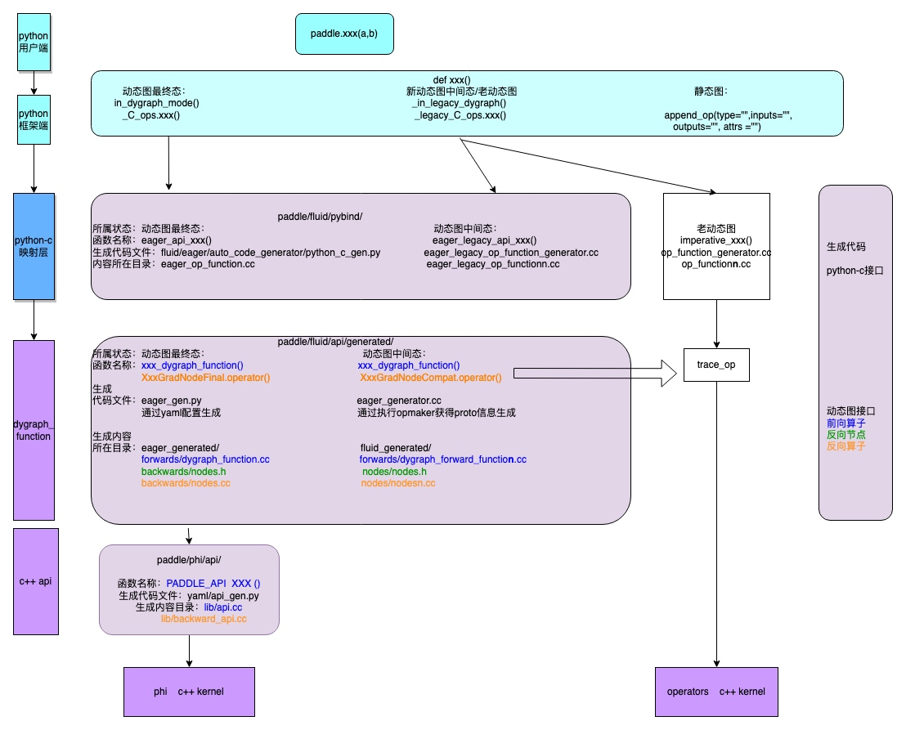
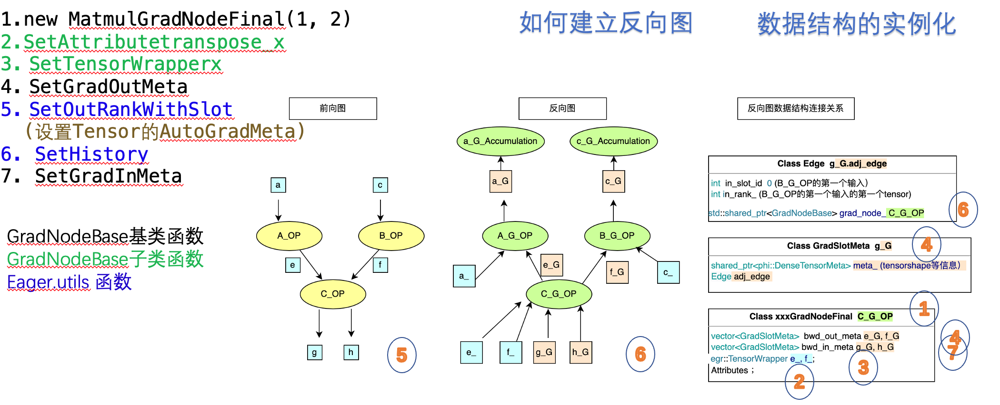

# 新动态图前向调用过程代码详解

| 分享内容     | 新动态图前向调用过程代码详解                          |
| ------------ | ----------------------------------------------- |
| 提交作者     | wangruting(@xiaoguoguo626807)  |
| 提交时间     | 2022-12-01                                      |
| 版本号       | v1.0                                            |
| 依赖飞桨版本 | develop                                         |
| 文件名       | 20221201_dygraph_forward.md |


## 一. 新动态图前向调用栈
目前在新动态图模式下，用户调用paddle 的api 接口后执行前向的调用栈如下图所示：分为用户端；python框架端；python-c映射层；dygraph_function层；c++api层；c++kernel层。  
在paddle框架端实现的api接口中会分三个执行模式：新动态图；老动态图；静态图；其中老动态图路径中包含新动态图中间态，中间态的出现是由于新动态图的执行依赖算子库的重构，而重构过程中，由于人力和算子本身特点的限制，部分算子没有被迁移的phi算子库中，因此这些算子新动态图的执行路径没有打通（在dygraph_function中无法使用新动态图的反向图建立体系，仍复用了老动态图的trace_op执行逻辑）。老动态图和中间态会随框架迭代逐渐被废弃，因此不做更多解释。  
新动态图的执行路径中：python-c映射层，dygraph_function层；c++api层都依赖于代码自动生成，图中分别展示了各个层级中函数代码位置和生成这些函数的生成代码位置。  
 



## 二. 新动态图执行路径代码详解
首先我们从整体功能上对新动态图各层级进行介绍：
- 1.PythonAPI+pybind映射 ：用户调用接口和内部实现的接口映射关系 
- 2.Python-c 接口：准备input,attr,place， 将python 实例转换为 c++实例
- 3.Dygraph_function接口： AMP相关处理， 反向图数据结构实例化
- 4.C++API 接口：根据输入tensor参数选择Kernel，准备数据，执行kernel
其中3中进行反向图数据结构实例化时，需要用到反向结点类和反向执行函数，因此我们增加
- 5.matmul反向代码解析：创建反向图相关数据结构，连接反向算子的执行逻辑

下面以matmul的python_c代码为示例，分析实现各APIpython_c接口需要的函数及功能
### 2.1 PythonAPI+pybind映射 
从python API到c++代码的衔接原理在20220825_python_c_api_and_pybind11.md文档中叙述。
### 2.2 python_c 代码解析
PyObject：在Python语义中，每当我们实例化任意一个Python对象，在其占用的堆内存区块的首个字节就包含一个PyObject定义的副本，除PyObject的相关内存字节副本外，跟随PyObject对象内存副本之后的内存字节是当前对象的内存信息。
```python
typedef struct_object{
    _PyObject_HEAD_EXTRA
    Py_ssize_t ob_refcnt;//引用计数器，和内存回收有关
    PyTypeObject*ob_type;//定义Python对象的元类信息
}PyObject;

```
动态图的python_c接口代码：
整体功能为：获取tensor -> 获取Attributes -> 释放GIL锁 -> 获取执行硬件 -> 调用dygraph function -> 获取GIL锁-> 返回执行结果
```python
static PyObject * eager_api_matmul(PyObject *self, PyObject *args, PyObject *kwargs) {
  paddle::platform::RecordEvent pythonc_record_event("matmul pybind_imperative_func", paddle::platform::TracerEventType::UserDefined, 1);

  PyThreadState *tstate = nullptr;
  try {
    VLOG(6) << "Running Eager Final State API: matmul";

    // 【【【获取Tensors】】】
    auto x = GetTensorFromArgs("matmul", "x", args, 0, false);
    auto y = GetTensorFromArgs("matmul", "y", args, 1, false);

    // 【【【获取Attributes】】】
    PyObject* transpose_x_obj = PyTuple_GET_ITEM(args, 2);
    bool transpose_x = CastPyArg2Boolean(transpose_x_obj, "matmul", 2);
    PyObject* transpose_y_obj = PyTuple_GET_ITEM(args, 3);
    bool transpose_y = CastPyArg2Boolean(transpose_y_obj, "matmul", 3);
    //释放GIL锁
    tstate = PyEval_SaveThread();

    // 【【【进入c++执行】】】
    // 设置硬件执行ID
    auto place = egr::Controller::Instance().GetExpectedPlace();
    if (paddle::platform::is_gpu_place(place)) {
#if defined(PADDLE_WITH_CUDA) || defined(PADDLE_WITH_HIP)
      phi::backends::gpu::SetDeviceId(place.device);
      VLOG(1) <<"CurrentDeviceId: " << phi::backends::gpu::GetCurrentDeviceId() << " from " << (int)place.device;
#else
      PADDLE_THROW(paddle::platform::errors::PreconditionNotMet(
        "PaddlePaddle should compile with GPU if use CUDAPlace."));
#endif
    }
    if (paddle::platform::is_custom_place(place)) {
#if defined(PADDLE_WITH_CUSTOM_DEVICE)
      phi::DeviceManager::SetDevice(place);
      VLOG(1) <<"CurrentDeviceId: " << phi::DeviceManager::GetDevice(place.GetDeviceType()) << " from " << (int)place.device;
#else
      PADDLE_THROW(paddle::platform::errors::PreconditionNotMet(
        "PaddlePaddle should compile with CUSTOM_DEVICE if use CustomPlace."));
#endif
    }

    // 【【【调用dygraph function执行】】】
    decltype(::matmul_dygraph_function(x,y,transpose_x,transpose_y)) out = ::matmul_dygraph_function(x,y,transpose_x,transpose_y);

    //获取GIL锁
    PyEval_RestoreThread(tstate);
    tstate = nullptr;
    return ToPyObject(out);
  } catch(...) {
    if (tstate) {
      PyEval_RestoreThread(tstate);
    }
    ThrowExceptionToPython(std::current_exception());
    return nullptr;
  }
}
```
从arg中获得tensor的函数代码解析：
```python
paddle::experimental::Tensor& GetTensorFromArgs(const std::string& op_type,
                                                const std::string& arg_name,
                                                PyObject* args,
                                                ssize_t arg_idx,
                                                bool dispensable) {
  PyObject* obj = PyTuple_GET_ITEM(args, arg_idx);
  return GetTensorFromPyObject(op_type, arg_name, obj, arg_idx, dispensable);
}

```
//获取参数列表中的python实例
```python
#define 
PyTuple_GET_ITEM(op, i) (((PyTupleObject *)(op))->ob_item[i])

//做合理的非空检查
static paddle::experimental::Tensor& GetTensorFromPyObject(
    const std::string& op_type,
    const std::string& arg_name,
    PyObject* obj,
    ssize_t arg_idx,
    bool dispensable) {
  if (PyTuple_Check(obj)) {
    obj = PyTuple_GET_ITEM(obj, 0);
  }
//如果不是（dispensable）可有可无的tensor变量，但是没有获取到实例报错
  if (obj == nullptr || obj == Py_None) {
    if (!dispensable) {
      PADDLE_THROW(platform::errors::InvalidArgument(
          "%s(): argument '%s' (position %d) must be Tensor, but got None",
          op_type,
          arg_name,
          arg_idx));
    }
    static paddle::experimental::Tensor emptytensor;
    return emptytensor;
  }
  
// reinterpret_cast<类型说明符>(表达式）
//判断obj 是p_tensor_type 或 p_string_tensor_type 则将其转换成为tensorObject并获取tensor实例
  if (PyObject_IsInstance(obj, reinterpret_cast<PyObject*>(p_tensor_type))) {
    return reinterpret_cast<TensorObject*>(obj)->tensor;
  } else if (PyObject_IsInstance(
                 obj, reinterpret_cast<PyObject*>(p_string_tensor_type))) {
    return reinterpret_cast<TensorObject*>(obj)->tensor;
  } else {
    PADDLE_THROW(platform::errors::InvalidArgument(
        "%s(): argument '%s' (position %d) must be Tensor, but got %s",
        op_type,
        arg_name,
        arg_idx,
        reinterpret_cast<PyTypeObject*>(obj->ob_type)->tp_name));
  }
}
```
 获取attributes
将PyObject 转为c++ object
```python
bool CastPyArg2Boolean(PyObject* obj,
                       const std::string& op_type,
                       ssize_t arg_pos) {
  if (obj == Py_None) {
    return false;  // To be compatible with QA integration testing. Some
                   // test case pass in None.
  } else if (obj == Py_True) {
    return true;
  } else if (obj == Py_False) {
    return false;
  } else {
    PADDLE_THROW(platform::errors::InvalidArgument(
        "%s(): argument (position %d) must be "
        "bool, but got %s",
        op_type,
        arg_pos + 1,
        ((PyTypeObject*)obj->ob_type)->tp_name));  // NOLINT
  }

  return false;
}
```
其他转换函数：
单个数据的转换(6类：bool ,int, int64, float, double, string)
```
bool CastPyArg2Boolean(PyObject* obj, const std::string& op_type, ssize_t arg_pos);
int CastPyArg2Int(PyObject* obj, const std::string& op_type, ssize_t arg_pos);
int64_t CastPyArg2Long(PyObject* obj, const std::string& op_type, ssize_t arg_pos);
float CastPyArg2Float(PyObject* obj, const std::string& op_type, ssize_t arg_pos);
double CastPyArg2Double(PyObject* obj, std::string& op_type, ssize_t arg_pos);
std::string CastPyArg2String(PyObject* obj, const std::string& op_type, ssize_t arg_pos);
```
单个数据Map形式的转换
```void CastPyArg2AttrXXX(PyObject* obj,
                        paddle::framework::AttributeMap& attrs,
                        const std::string& key,
                        const std::string& op_type,
                        ssize_t arg_pos) {
  attrs[key] = CastPyArg2XXX(obj, op_type, arg_pos);
}
```
vector数据的转换(List ,Tuple, Sequence)
```std::vector<XXX> CastPyArg2XXXs(PyObject* obj, 
const std::string& op_type, ssize_t arg_pos){
    std::vector<XXX> value;
    if (PyList_Check(obj)) {
        Py_ssize_t len = PyList_Size(obj);
        PyObject* item = nullptr;
        for (Py_ssize_t i = 0; i < len; i++) {
          item = PyList_GetItem(obj, i);
          if (PyObject_CheckXXX(&item)) {
            value.emplace_back(PyLong_AsLong(item));
          } else {
            PADDLE_THROW(platform::errors::InvalidArgument(
                "%s(): argument (position %d) must be "
                "list of bool, but got %s at pos %d",
                op_type,
                arg_pos + 1,
                ((PyTypeObject*)item->ob_type)->tp_name,  // NOLINT
                i));
          }
        }
    } else if (PyTuple_Check(obj)) {
        Py_ssize_t len = PyTuple_Size(obj);
        PyObject* item = nullptr;
        for (Py_ssize_t i = 0; i < len; i++) {
          item = PyTuple_GetItem(obj, i);
          if (PyObject_CheckXXX(&item)) {
            value.emplace_back(PyLong_AsLong(item));
          } else {
            PADDLE_THROW(platform::errors::InvalidArgument(
                "%s(): argument (position %d) must be "
                "list of bool, but got %s at pos %d",
                op_type,
                arg_pos + 1,
                ((PyTypeObject*)item->ob_type)->tp_name,  // NOLINT
                i));
          }
        }
      } else if (PySequence_Check(obj)) {
        Py_ssize_t len = PySequence_Size(obj);
        PyObject* item = nullptr;
        for (Py_ssize_t i = 0; i < len; i++) {
          item = PySequence_GetItem(obj, i);
          if (PyObject_CheckXXX(&item)) {
            value.emplace_back(PyLong_AsLong(item));
          } else {
            PADDLE_THROW(platform::errors::InvalidArgument(
                "%s(): argument (position %d) must be "
                "list of int, but got %s at pos %d",
                op_type,
                arg_pos + 1,
                ((PyTypeObject*)item->ob_type)->tp_name,  // NOLINT
                i));
          }
        }
  } else if ((PyObject*)obj != Py_None) {  // NOLINT
    PADDLE_THROW(platform::errors::InvalidArgument(
        "%s(): argument (position %d) must be "
        "list or tuple, but got %s",
        op_type,
        arg_pos + 1,
        ((PyTypeObject*)obj->ob_type)->tp_name));  // NOLINT
  }

  return value;
 }
```
vector数据Map形式的转换
```void CastPyArg2AttrXXXs(PyObject* obj,
                        paddle::framework::AttributeMap& attrs,
                        const std::string& key,
                        const std::string& op_type,
                        ssize_t arg_pos) {
  attrs[key] = CastPyArg2XXXs(obj, op_type, arg_pos);
}
```
特殊转换：Block;VarBase
```void CastPyArg2AttrBlock(PyObject* obj,
                         paddle::framework::AttributeMap& attrs,  // NOLINT
                         const std::string& key,
                         const std::string& op_type,
                         ssize_t arg_pos) 

std::shared_ptr<imperative::VarBase> GetVarBaseFromArgs(
    const std::string& op_type,
    const std::string& arg_name,
    PyObject* args,
    ssize_t arg_idx,
    bool dispensable)
    
std::vector<std::shared_ptr<imperative::VarBase>> GetVarBaseListFromArgs(
    const std::string& op_type,
    const std::string& arg_name,
    PyObject* args,
    ssize_t arg_idx,
    bool dispensable)
```
创建参数Map
```void ConstructAttrMapFromPyArgs(
                                const std::string& op_type,
                                PyObject* args,
                                ssize_t attr_start,
                                ssize_t attr_end,
                                paddle::framework::AttributeMap& attrs)

```
- python中与线程GIL（全局解释锁）相关知识：
PyEval_SaveThread() 释放锁；PyEval_RestoreThread（）获取锁
python端的锁，python端无法同时并行，但当某一线程进入c++端时可以释放锁，使得其他线程的Python端继续运行。
- 获取执行硬件
首先使用egr::Controller::Instance().GetExpectedPlace() 获取程序要的place,根据place的类型判断是否具有对应的编译环境 paddle::platform::is_gpu_place(place)；paddle::platform::is_custom_place(place)
判断是否有GPU环境（CUDA,HIP）：若有使用 phi::backends::gpu::SetDeviceId (place.device)设置device ID
判断是否是custom_place （新增硬件）：若有使用phi::DeviceManager::SetDevice(place)设置device ID
```c++
// Set Device ID
    auto place = egr::Controller::Instance().GetExpectedPlace();
    if (paddle::platform::is_gpu_place(place)) {
#if defined(PADDLE_WITH_CUDA) || defined(PADDLE_WITH_HIP)
      phi::backends::gpu::SetDeviceId(place.device);
      VLOG(1) <<"CurrentDeviceId: " << phi::backends::gpu::GetCurrentDeviceId() << " from " << (int)place.device;
#else
      PADDLE_THROW(paddle::platform::errors::PreconditionNotMet(
        "PaddlePaddle should compile with GPU if use CUDAPlace."));
#endif
    }
    if (paddle::platform::is_custom_place(place)) {
#if defined(PADDLE_WITH_CUSTOM_DEVICE)
      phi::DeviceManager::SetDevice(place);
      VLOG(1) <<"CurrentDeviceId: " << phi::DeviceManager::GetDevice(place.GetDeviceType()) << " from " << (int)place.device;
#else
      PADDLE_THROW(paddle::platform::errors::PreconditionNotMet(
        "PaddlePaddle should compile with CUSTOM_DEVICE if use CustomPlace."));
#endif
    }
```
- 调用dygraph function
 ```c++
 decltype(::matmul_dygraph_function(x,y,transpose_x,transpose_y)) 是修饰返回tensor out 的参数类型 Tensor （其中的kernel调用不会执行吗）
decltype : class paddle::experimental::Tensor
dygraph function 存放在paddle/fluid/api/generated/forward/dygraph_functions.cc
decltype(::matmul_dygraph_function(x,y,transpose_x,transpose_y)) out = ::matmul_dygraph_function(x,y,transpose_x,transpose_y);
```
- 获取GIL锁，在python端执行。
### 2.3 dygraph function代码解析
AMP逻辑 ->  获取输入的AutoGradMeta信息 -> 调用C++ API 获取输出 -> 创建输出的AutoGradMeta信息
```c++
paddle::experimental::Tensor matmul_dygraph_function(const paddle::experimental::Tensor& x, const paddle::experimental::Tensor& y, bool transpose_x, bool transpose_y) {
  // Dygraph Record Event
  paddle::platform::RecordEvent dygraph_entrance_record_event("matmul dygraph", paddle::platform::TracerEventType::Operator, 1);

  // 【【【AMP Logic】】】
  if (egr::Controller::Instance().GetAMPLevel() != paddle::imperative::AmpLevel::O0) {
    VLOG(5) << "Check and Prepare For AMP";
    auto op_name = phi::TransToFluidOpName("matmul");
    paddle::small_vector<std::vector<paddle::experimental::Tensor>, egr::kSlotSmallVectorSize> amp_tensors_vector = { {x},{y} };
    
    auto amp_dst_dtype = egr::GetAmpDestDtype(op_name, amp_tensors_vector);

    auto NEW_x = egr::EagerAmpAutoCast("x", x, amp_dst_dtype, op_name);
    auto NEW_y = egr::EagerAmpAutoCast("y", y, amp_dst_dtype, op_name);
    
    {
      paddle::imperative::AutoCastGuard guard(egr::Controller::Instance().GetCurrentTracer(), paddle::imperative::AmpLevel::O0);
      return matmul_dygraph_function(NEW_x, NEW_y, transpose_x, transpose_y);
    }
  }

  // 【【【获取输入的AutoGradMeta信息】】】
  egr::AutogradMeta* x_autograd_meta = egr::EagerUtils::nullable_autograd_meta(x);
  egr::AutogradMeta* y_autograd_meta = egr::EagerUtils::nullable_autograd_meta(y);
  // 【【【调用C++ API】】】
  VLOG(3) << "Final State Running: " << "matmul_dygraph_function";
  auto api_result = paddle::experimental::matmul(x, y, transpose_x, transpose_y);
  // Check NaN and Inf if needed
  if (FLAGS_check_nan_inf) { egr::CheckTensorHasNanOrInf("matmul", api_result); }

  auto& out = api_result;

  // 【【【创建输出的AutoGradMeta信息】】】
  egr::AutogradMeta* out_autograd_meta = egr::EagerUtils::autograd_meta(&out);
  // 【【【判断是否需要建立反向图】】】
  bool trace_backward = egr::Controller::Instance().HasGrad();
  bool require_any_grad = egr::EagerUtils::ComputeRequireGrad(trace_backward,x_autograd_meta,y_autograd_meta);

  // Check Inplace if needed

  // Node Creation
  if(require_any_grad) {
    paddle::platform::RecordEvent node_creation_record_event("matmul node_creation", paddle::platform::TracerEventType::OperatorInner, 1);

    egr::EagerUtils::PassStopGradient(false,out_autograd_meta);

    // Node Construction
    auto grad_node = std::shared_ptr<MatmulGradNodeFinal>(new MatmulGradNodeFinal(1, 2));
    // SetAttributes if needed
    grad_node->SetAttributetranspose_x(transpose_x);
    grad_node->SetAttributetranspose_y(transpose_y);
    // Set TensorWrappers for Forward Inputs if needed
    grad_node->SetTensorWrapperx(x);
    grad_node->SetTensorWrappery(y);
    // SetGradOutMeta & SetEdges
    grad_node->SetGradOutMeta(x, 0);
    grad_node->SetGradOutMeta(y, 1);
    // SetOutRank & SetHistory & SetGradInMeta & RetainGrad
    if (out_autograd_meta) {
      egr::EagerUtils::SetOutRankWithSlot(out_autograd_meta, 0);
    }
    if (out_autograd_meta) {
      egr::EagerUtils::SetHistory(out_autograd_meta, grad_node);
    }
    grad_node->SetGradInMeta(out, 0);
    egr::EagerUtils::CheckAndRetainGrad(out);
    // Set TensorWrappers for Forward Outputs if needed

  }

  // Returns
  return out;
}

```
- AMP 逻辑：
首先添加混合精度处理逻辑（AMP），在判断支持AMP的分支下实现AMP的准备工作，添加VLOG便于调试是否进入混精模式。
* 1>定义输入tensor的vector ：amp_tensors_vector
* 2>使用egr::GetAmpDestDtype 函数从tensor中获得各个输入tensor的数据类型amp_dst_dtype
* 3>使用egr::EagerAmpAutoCast函数分别对所有输入tensor进行数据类型转换（F32->F16)获得新的输入Tensor。
* 4>在{}代码块中先定义AutoCastGuard ,参数为分别为 egr::Controller::Instance().GetCurrentTracer()当前执行tracer,paddle::imperative::AmpLevel::O0);设置精度模式为F32,以便后续调用本函数跳过AMP准备模块；
      调用本函数xxx_dygraph_function,参数为转换后的新输入tensor及attrmap；
注：AMP模式有4种，目前只有01，02有效
enum class AmpLevel {
      O0 = 0,  // fp32
      O1,      // amp, mixed fp32-fp16
      O2,      // almost fp16
      O3,      // fp16
};
- 获取输入的AutoGradMeta (反向节点输入信息）：
使用egr::EagerUtils::nullable_autograd_meta（）获取输入tensor的反向计算信息（AutoGradMeta),参数是输入tensor。运行返回空指针
```c++
AutogradMeta*EagerUtils::nullable_autograd_meta(
    constpaddle::experimental::Tensor&target) {
    auto* p_autograd_meta = target.get_autograd_meta();
    if (!p_autograd_meta) return nullptr;
    returnstatic_cast<AutogradMeta*>(p_autograd_meta);
}
```
其他相关函数
```
//如果没有获取到AutoGradMeta则创建一个实例，使用共享指针获取。
AutogradMeta* EagerUtils::autograd_meta(paddle::experimental::Tensor* target)

//不允许修改target,返回强制类型转换得到的AutoGradMeta指针
AutogradMeta* EagerUtils::unsafe_autograd_meta(const paddle::experimental::Tensor& target)
```
- 调用C++ API, 获取输出后检查输出是否合法
c++API 由 yaml配置自动生成，声明存放在`paddle/phi/api/include/api.h`下 (反向`paddle/phi/api/backward/backward_api.h`)；
c++ API 的实现存放在`paddle/phi/api/lib/api.cc `(反向`paddle/phi/api/lib/backward_api.h`）
- 创建输出的AutoGradMeta信息
调用autograd_meta（）为输出tensor创建存放反向计算信息的AutoGradMeta
- 判断是否需要建立反向图
egr::Controller::Instance().HasGrad() 判断tracer是否需要梯度（with no_grad() 设置某一段计算不需要反向）
egr::EagerUtils::ComputeRequireGrad(trace_backward,x_autograd_meta,y_autograd_meta)取tracer,输入tensor是否需要梯度的并集。
- 创建反向节点及反向图关系
（创建反向图的过程需要了解相关数据结构，在文档动态图自动微分模块类的设计中详细介绍了相关数据结构以及为什么需要这些数据结构）
  基于以上数据结构，反向图的建立过程本质上是数据结构的实例化，其中7个调用函数对应在数据结构上的构造关系如下图所示：
  

- 图中以C_OP节点的反向图结构建立为例。在执行C_OP代码后首先1创建C_G_OP反向节点；2,3设置其中attribute,tensorwrapper变量；4设置输出的meta信息。
5对输出的tensor设置autogradMeta信息，绑定反向节点,6设置meta中edge的下一结点，7设置输入的meta信息。 具体的代码分析在后面详细介绍。

- 反向节点：
 * 1> 调用PassStopGradient函数，遍历输出tensor的AutoGradMeta设置stop_gradient参数为false
 * 2> 创建grad_node，先new一个反向函数类的实例，参数为此反向函数的输入参数个数和输出参数个数：new XXXGradNodeCompat(1, 3)，再使用shared_ptr创建grad_node，指向此反向函数的实例。
 * 3> 调用grad_node的SetAttributetranspose_x() 函数设置attributes，
 * 4> 调用grad_node的SetTensorWrapperX()，SetTensorWrapperY()函数设置反向函数中的TensorWrapper变量，（当前向输入的Tensor作为反向的输入时，不需要记录自己的反向信息，因此使用TensorWrapper,只对AutoGradMeta信息进行弱引用）参数是对应的输入tensor。
```c++
void SetTensorWrapperx(const paddle::experimental::Tensor& x) {
    x_ = egr::TensorWrapper(x, false);
  }
  
 explicit TensorWrapper(const paddle::experimental::Tensor& tensor,
                         bool no_need_buffer = false) {
    // set inplace_version_snapshot_ according to tensor's current inplace
    // version.
    if (tensor.impl() && phi::DenseTensor::classof(tensor.impl().get())) {
      phi::DenseTensor* dense_tensor =
          static_cast<phi::DenseTensor*>(tensor.impl().get());
      auto& inplace_version_counter = dense_tensor->InplaceVersionCounter();
      inplace_version_snapshot_ = inplace_version_counter.CurrentVersion();
    }

    /**
     * Normally, we should only save data and part of autograd_meta of fwd
     * tensor, and should not reserve its original grad_node,
     * to avoid recursive and additional depends on GradNodeBase
     * **/
    auto* tensor_autograd_meta = EagerUtils::nullable_autograd_meta(tensor);
    no_need_buffer_ = no_need_buffer;
    // shallow copy tensor_impl here
    if (no_need_buffer) {
      if (phi::DenseTensor::classof(tensor.impl().get())) {
        // Only Copy Meta
        phi::DenseTensor* dense_tensor =
            static_cast<phi::DenseTensor*>(tensor.impl().get());
        // TODO(jiabin): It's not a good idea to set memory size to zero, find
        // another way and change this.
        intermidiate_tensor_.set_impl(
            std::move(std::make_shared<phi::DenseTensor>(
                std::make_shared<phi::Allocation>(nullptr, 0, tensor.place()),
                std::move(dense_tensor->meta()))));
      } else {
        PADDLE_THROW(paddle::platform::errors::Fatal(
            "Unrecognized tensor type for no_need_buffer feature"));
      }
    } else {//复制tensor的数据部分
#ifndef PADDLE_NO_PYTHON
      if (SavedTensorsHooks::GetInstance().IsEnable() &&
          tensor.is_dense_tensor()) {
        phi::DenseTensor* dense_tensor =
            static_cast<phi::DenseTensor*>(tensor.impl().get());
        intermidiate_tensor_.set_impl(
            std::move(std::make_shared<phi::DenseTensor>(
                std::make_shared<phi::Allocation>(nullptr, 0, tensor.place()),
                dense_tensor->meta())));
        auto pack_hook = SavedTensorsHooks::GetInstance().GetPackHook();
        unpack_hook_ = SavedTensorsHooks::GetInstance().GetUnPackHook();
        packed_value_ = reinterpret_cast<PyObject*>((*pack_hook)(tensor));
      } else {
#endif
        intermidiate_tensor_.set_impl(tensor.impl());
#ifndef PADDLE_NO_PYTHON
      }
#endif
    }

    if (VLOG_IS_ON(7)) {
      // TODO(jiabin): This may has server performance issue
      intermidiate_tensor_.set_name(tensor.name() + "@Saved");
    }
    //创建对AutoGradMeta的弱引用
    if (tensor_autograd_meta) {
      auto autograd_meta =
          std::make_shared<AutogradMeta>(*tensor_autograd_meta);
      autograd_meta->ResetGradNode();
      intermidiate_tensor_.set_autograd_meta(autograd_meta);
      weak_grad_node_ = tensor_autograd_meta->GetMutableGradNode();
    }
  }
```
* 5> 调用grad_node的SetGradOutMeta（）函数分别设置反向各个输出tensor的信息，参数分别为前向输入tensor,和此输入tensor是前向算子的第几个输入。（前向的输入tensor的梯度将会成为反向的输出tensor，且顺序一致，此函数中会对前向输入tensor的autogradmeta信息进行设置)
``` c++
void GradNodeBase::SetGradOutMeta(const paddle::experimental::Tensor& fwd_in,
                                  size_t slot_rank) {
  //获得前向输入的AutoGradMeta,输出的id slot_rank不能比反向节点中设置的输出个数多
  auto* fwd_in_meta = egr::EagerUtils::nullable_autograd_meta(fwd_in);
  PADDLE_ENFORCE_LE(
      (slot_rank + 1),
      bwd_out_meta_.size(),
      paddle::platform::errors::InvalidArgument(
          "Slot Rank should less equal than bwd_out_meta_ size, "
          "since bwd_out_meta_ is designed to hold as same num as "
          "backward outputs."));
  //获得反向节点中输出meta 的第slot_rank个输出
  auto& metas = bwd_out_meta_.at(slot_rank);
  // Init stop gradient vector before use to avoid push back
  if (metas.size() == 0) {
    metas.resize(1);
  }
  auto& meta = metas[0];
  // 设置stop_gradient信息
  if (fwd_in_meta) {
    meta.SetStopGradient(fwd_in_meta->StopGradient());
  } else {
    meta.SetStopGradient(true);
  }
  // 建立从本节点到下一个节点的Edges
  if (fwd_in_meta && !fwd_in_meta->StopGradient()) {
    auto node = fwd_in_meta->GetMutableGradNode();
    //如果前向输入没有连接下一个反向节点，则设置一个Accumulation节点
    if (!node || !node.get()) {
      fwd_in_meta->SetGradNode(
          std::make_shared<egr::GradNodeAccumulation>(fwd_in_meta));
    }
    VLOG(3) << "Add Edges for slot: " << slot_rank << ", the Edge is from "
            << this->name() << " (addr: " << this << ") "
            << " to " << fwd_in_meta->GetMutableGradNode()->name()
            << " (addr: " << fwd_in_meta->GetMutableGradNode().get() << ")";
    //在反向节点的bwd_in_meta中的meta信息中增加与上一节点连接的边
    meta.SetEdge(fwd_in_meta->GetMutableGradNode(), fwd_in_meta->OutRankInfo());
  }
  // Record TensorMeta
  if (fwd_in.impl() && fwd_in.impl().get()) {
    if (phi::DenseTensor::classof(fwd_in.impl().get())) {
      // Only Copy Meta
      phi::DenseTensor* dense_tensor =
          static_cast<phi::DenseTensor*>(fwd_in.impl().get());
      PADDLE_ENFORCE_NE(
          dense_tensor->meta().dtype,
          phi::DataType::UNDEFINED,
          paddle::platform::errors::Fatal("Attempting to copy DenseTensorMeta "
                                          "with phi::DataType::UNDEFINED,"
                                          "which is illegal."));
      meta.SetTensorMeta(dense_tensor->meta());
      meta.SetPlace(fwd_in.place());
    }
  } else {
    VLOG(7) << "Unable to initialize the DenseTensorMeta of GradSlotMeta with "
               "non-DenseTensor argument.";
  }
}
```
- 注：3，4中调用的函数在反向节点的类中实现，每个参数和输入,输出都有对应的Set函数, 5中调用的函数在反向节点的基类中实现。
- 反向图：
 * 6> 调用egr::EagerUtils::SetOutRankWithSlot对前向输出tensor的autogradmeta信息进行标记，参数分别为第4步中创建的输出梯度p_autograd_Out，及此输出是前向第几个输出信息。
```c++
void EagerUtils::SetOutRankWithSlot(AutogradMeta* target, size_t slot_id) {
  target->SetSingleOutRankWithSlot(slot_id, 0);
}

//设置输出tensor的 AutoGradMeta信息中的输出位置
void SetSingleOutRankWithSlot(size_t slot_id, size_t rank) {
    out_slot_id_ = slot_id;
    out_rank_ = rank;
  }
```
- 7> 调用egr::EagerUtils::SetHistory绑定前向输出tensor的autogradmeta和此反向节点grad_node，参数分别为第4步中创建的输出梯度p_autograd_Out,及第6.3>步中创建的grad_node。
```c++
void EagerUtils::SetHistory(AutogradMeta* autograd_meta,
                            const std::shared_ptr<GradNodeBase>& grad_node) {
  设置输出tensor的AutogradMeta信息中的反向节点信息
  if (autograd_meta->GradNode()) {
    VLOG(7) << "Should not set grad node twice, original node is:"
            << autograd_meta->GradNode()->name()
            << "current is: " << grad_node->name();
  }
  autograd_meta->SetGradNode(grad_node);
}
```
- 8> 调用grad_node的SetGradInMeta（）函数分别设置反向各个输入tensor（梯度)的信息，参数为前向输出tensor,和此输出tensor是前向算子的第几个输出。
```c++
void GradNodeBase::SetGradInMeta(const paddle::experimental::Tensor& fwd_out,
                                 size_t slot_rank) {
  VLOG(7) << "Set GradSlotMeta for Grad Inputs";
  auto* fwd_out_meta = egr::EagerUtils::nullable_autograd_meta(fwd_out);
  PADDLE_ENFORCE_LE(
      slot_rank,
      (bwd_in_meta_.size() - 1),
      paddle::platform::errors::InvalidArgument(
          "Slot Rank should less equal than bwd_in_meta_ size, since "
          "bwd_in_meta_ is designed to hold as same num as backward "
          "inputs."));
  auto& metas = bwd_in_meta_.at(slot_rank);
  if (metas.size() == 0) {
    metas.resize(1);
  }

  auto& meta = metas[0];
  if (fwd_out_meta && fwd_out_meta->StopGradient()) {
    meta.SetStopGradient(fwd_out_meta->StopGradient());
  }

  if (!fwd_out.initialized()) {
    VLOG(7)
        << "Skip Configuring GradSlotMeta for uninitialized GradInput Tensor";
    return;
  }

  phi::DenseTensor* dense_tensor = nullptr;
  // Record TensorMeta
  if (phi::DenseTensor::classof(fwd_out.impl().get())) {
    // Only Copy Meta
    dense_tensor = static_cast<phi::DenseTensor*>(fwd_out.impl().get());
  } else if (phi::SparseCooTensor::classof(fwd_out.impl().get())) {
    phi::SparseCooTensor* coo_tensor =
        static_cast<phi::SparseCooTensor*>(fwd_out.impl().get());
    dense_tensor = coo_tensor->mutable_non_zero_elements();
  } else if (phi::SparseCsrTensor::classof(fwd_out.impl().get())) {
    phi::SparseCsrTensor* csr_tensor =
        static_cast<phi::SparseCsrTensor*>(fwd_out.impl().get());
    dense_tensor = csr_tensor->mutable_non_zero_elements();
  } else {
    VLOG(7) << "Unable to initialize the DenseTensorMeta of GradSlotMeta with "
               "non-DenseTensor argument.";
  }
  PADDLE_ENFORCE_NE(
      dense_tensor->meta().dtype,
      phi::DataType::UNDEFINED,
      paddle::platform::errors::Fatal(
          "Attempting to copy DenseTensorMeta with phi::DataType::UNDEFINED,"
          "which is illegal."));

  meta.SetTensorMeta(dense_tensor->meta());
  meta.SetPlace(fwd_out.place());

  if (dense_tensor->type() == paddle::experimental::DataType::COMPLEX64 ||
      dense_tensor->type() == paddle::experimental::DataType::COMPLEX128) {
    need_complex_to_real_ = true;
  }
}
```
- 9> 调用egr::EagerUtils::CheckAndRetainGrad（）设置是否保留前向输出tensor的梯度信息，参数是前向输出tensor。（当此tensor是叶子tensor时默认会保留，否则根据用户设置判断是否保留，同时设置hook。
```c++
void EagerUtils::CheckAndRetainGrad(
    const std::vector<paddle::experimental::Tensor*>& tensors) {
  if (FLAGS_retain_grad_for_all_tensor) {
    for (auto& tensor : tensors) {
      VLOG(6) << "RetainGradForTensor: " << tensor->name();
      egr::egr_utils_api::RetainGradForTensor(*tensor);
    }
  }
}

```

```c++
void RetainGradForTensor(const paddle::experimental::Tensor& tensor) {
  if (IsLeafTensor(tensor)) {
    // Leaf tensor's grad will always be retained
    // Refer to implementation of AccumulationNode for more details
    return;
  } else {
    AutogradMeta* meta = EagerUtils::unsafe_autograd_meta(tensor);
    if (meta->RetainGrads()) {
      return;
    } else {
      meta->SetRetainGrads(true);
    }

    std::weak_ptr<paddle::experimental::Tensor> weak_grad_tensor =
        meta->WeakGrad();

    // Define Hook
    auto hook = [weak_grad_tensor](const paddle::experimental::Tensor& t) {
      if (!weak_grad_tensor.expired()) {
        auto grad_tensor = weak_grad_tensor.lock();
        if (t.defined()) {
          VLOG(7) << "Set impl for RetainGrad Hook for tensor: " << t.name();
          // Simply Copy impl() to grad_tensor
          grad_tensor->set_impl(t.impl());
          grad_tensor->set_autograd_meta(t.mutable_autograd_meta());
          return *grad_tensor.get();
        } else {
          VLOG(7) << "Retain NULL paddle::experimental::Tensor in Grad Hook";
          return paddle::experimental::Tensor();
        }
      } else {
        VLOG(7) << "Retain NULL paddle::experimental::Tensor in Grad Hook";
        return paddle::experimental::Tensor();
      }
    };

    // Append to GradientHooks
    RegisterGradientHookForTensor(tensor, hook);
  }
}
```
### 2.4 c++ API
根据输入tensor获取kernel的信息（backend,layout,datatype) -> 根据信息选择kernel，获得kernel -> 获取执行硬件，输入tensor数据 -> 调用InferMeta 函数 -> 获得kernel的声明格式 -> 调用运算kernel函数 -> 如果需要返回cpu端，将输出转换为cpu数据
```c++
PADDLE_API Tensor matmul(const Tensor& x, const Tensor& y, bool transpose_x, bool transpose_y) {

  Backend kernel_backend = Backend::UNDEFINED;
  DataLayout kernel_layout = DataLayout::UNDEFINED;
  DataType kernel_data_type = DataType::UNDEFINED;
   //【【【根据输入tensor获取kernel的信息】】】
  if (kernel_backend == Backend::UNDEFINED
        || kernel_layout == DataLayout::UNDEFINED
        || kernel_data_type == DataType::UNDEFINED ) {
    auto kernel_key_set = ParseKernelKeyByInputArgs(x, y);
    auto kernel_key = kernel_key_set.GetHighestPriorityKernelKey();
    if (kernel_backend == Backend::UNDEFINED) {
      kernel_backend = kernel_key.backend();
    }
    if (kernel_layout == DataLayout::UNDEFINED) {
      kernel_layout = kernel_key.layout();
    }
    if (kernel_data_type == DataType::UNDEFINED) {
      kernel_data_type = kernel_key.dtype();
    }
  }

  VLOG(6) << "matmul API kernel key: [" << kernel_backend << ", " << kernel_layout << ", "<< kernel_data_type << "]";
  //【【【选择kernel，获得kernel】】】
  auto kernel_result = phi::KernelFactory::Instance().SelectKernelOrThrowError(
      "matmul", {kernel_backend, kernel_layout, kernel_data_type});
  const auto& kernel = kernel_result.kernel;
  VLOG(6) << "matmul kernel: " << kernel;
  
  //【【【获取执行硬件】】】
  auto* dev_ctx = GetDeviceContextByBackend(kernel_result.has_fallback_cpu ? Backend::CPU : kernel_backend);
  //【【【获取输入tensor数据（如需转换place,layout,dtype会在此处处理）】】】
  auto input_x = PrepareData(x, kernel.InputAt(0), {});
  auto input_y = PrepareData(y, kernel.InputAt(1), {});
  //【【【 ？？？？？】】】
  if(platform::RecordOpInfoSupplement::IsEnabled()){
     std::vector<std::pair<const char*, std::vector<phi::DDim>>> input_shapes{            
     {"x", {            
     (*input_x).dims()}},            
     {"y", {            
     (*input_y).dims()}}};  
     platform::RecordOpInfoSupplement("matmul", input_shapes);  
  }
  //【【【 设置输出tensor的数据指针】】】
  Tensor api_output;
  auto kernel_out = SetKernelOutput(kernel_backend, &api_output);
  
  paddle::platform::RecordEvent *infer_shape_record_event = nullptr;
  if(paddle::platform::RecordEvent::IsEnabled()){
    infer_shape_record_event = new paddle::platform::RecordEvent("matmul infer_meta", paddle::platform::TracerEventType::OperatorInner, 1);
  }
  //【【【调用InferMeta 函数判断输入是否合法，为输出tensor设置dim,layout,dtype】】】
  phi::MetaTensor meta_out(kernel_out);
  phi::MatmulInferMeta(MakeMetaTensor(*input_x), MakeMetaTensor(*input_y), transpose_x, transpose_y, &meta_out);

  if(infer_shape_record_event != nullptr){
    delete infer_shape_record_event;
  }
  //【【【获得kernel的声明格式】】】
  using kernel_signature = void(*)(const platform::DeviceContext&, const phi::DenseTensor&, const phi::DenseTensor&, bool, bool, phi::DenseTensor*);
  auto* kernel_fn = kernel.GetVariadicKernelFn<kernel_signature>();
  
  paddle::platform::RecordEvent* kernel_record_event = nullptr;
  if(paddle::platform::RecordEvent::IsEnabled()){
    kernel_record_event = new paddle::platform::RecordEvent("matmul compute", paddle::platform::TracerEventType::OperatorInner, 1);
  }
  //【【【调用运算kernel函数】】】
    (*kernel_fn)(*dev_ctx, *input_x, *input_y, transpose_x, transpose_y, kernel_out);
  if(kernel_record_event != nullptr){
    delete kernel_record_event;
  }
  // 【【【如果需要返回cpu端，将输出转换为cpu数据】】】
  if (kernel_result.has_fallback_cpu) {

    TransDataBackend(kernel_out, kernel_backend, kernel_out);
  }
  return api_output;
}
```
- 根据输入tensor获取kernel的信息
```c++
auto kernel_key_set = ParseKernelKeyByInputArgs(x, y);
auto kernel_key = kernel_key_set.GetHighestPriorityKernelKey();

KernelKeySet ParseKernelKeyByInputArgs(const Args&... args) {
  return detail::KernelKeyParser().apply(args...).key_set;
}

struct KernelKeyParser : ArgsIterator<KernelKeyParser> {
  KernelKeySet key_set;
  // this dtype_set is used for cache multi-inputs dtype and used for
  // data_promote
  DataTypeSet dtype_set{DataType::UNDEFINED};

  // TODO(chenweihang): deal with multiple diff input Tensors
  // TODO(chenweihang): add global device guard method to set backend
  inline void AssignKernelKeySet(const phi::TensorBase& tensor) {
    key_set.backend_set =
        key_set.backend_set | detail::GetTensorBackendSet(tensor);
    // TODO(chenweihang): select multi layout and dtype
    key_set.layout = tensor.layout();
    key_set.dtype = tensor.dtype();
    dtype_set = dtype_set | DataTypeSet(key_set.dtype);
    auto promote_result = PromoteTypes(dtype_set);
    if (promote_result != DataType::UNDEFINED) {
      key_set.dtype = promote_result;
    }
  }

  void operator()(const Tensor& x) {
    const auto* tensor = x.impl().get();
    if (tensor) {
      AssignKernelKeySet(*tensor);
    }
  }

  void operator()(const std::vector<Tensor>& x) {
    const phi::TensorBase& tensor = *x.at(0).impl();
    key_set.backend_set =
        key_set.backend_set | detail::GetTensorBackendSet(tensor);
    // TODO(chenweihang): select multi layout and dtype
    key_set.layout = tensor.layout();
    key_set.dtype = tensor.dtype();
  }

  void operator()(const paddle::optional<Tensor>& x) {
    if (x) {
      const phi::TensorBase& tensor = *(x.get_ptr()->impl());
      AssignKernelKeySet(tensor);
    }
  }

  // skip other type args, these args don't used in kernel selection
  template <typename T>
  void operator()(const T& x) {
    // do nothing
  }
};
```
- 选择kernel
```c++
auto kernel_result = phi::KernelFactory::Instance().SelectKernelOrThrowError(
      "matmul", {kernel_backend, kernel_layout, kernel_data_type});
const auto& kernel = kernel_result.kernel


KernelResult KernelFactory::SelectKernelOrThrowError(
    const std::string& kernel_name,
    const KernelKey& kernel_key,
    bool use_gpudnn) const {
  auto iter = kernels_.find(kernel_name);
  PADDLE_ENFORCE_NE(
      iter,
      kernels_.end(),
      phi::errors::NotFound("The kernel `%s` is not registered.", kernel_name));

#if defined(PADDLE_WITH_CUDA) || defined(PADDLE_WITH_HIP)
  if (use_gpudnn && kernel_key.backend() == Backend::GPU) {
    auto kernel_iter = iter->second.find(
        {Backend::GPUDNN, kernel_key.layout(), kernel_key.dtype()});
    if (kernel_iter == iter->second.end() &&
        kernel_key.layout() != phi::DataLayout::ALL_LAYOUT) {
      kernel_iter = iter->second.find(
          {Backend::GPUDNN, DataLayout::ALL_LAYOUT, kernel_key.dtype()});
    }
    if (kernel_iter != iter->second.end()) {
      return {kernel_iter->second, false};
    }
    LOG(WARNING) << "The cudnn kernel for [" << kernel_name
                 << "] is not registered.";
  }
#endif

  auto kernel_iter = iter->second.find(kernel_key);
  // TODO(chenweihang): polish refind impl here
  if (kernel_iter == iter->second.end() &&
      kernel_key.layout() != phi::DataLayout::ALL_LAYOUT) {
    phi::KernelKey any_layout_kernel_key(
        kernel_key.backend(), phi::DataLayout::ALL_LAYOUT, kernel_key.dtype());
    kernel_iter = iter->second.find(any_layout_kernel_key);
  }

  PADDLE_ENFORCE_NE(
      kernel_iter == iter->second.end() && kernel_key.backend() == Backend::CPU,
      true,
      phi::errors::NotFound(
          "The kernel with key %s of kernel `%s` is not registered.",
          kernel_key,
          kernel_name));

  if (FLAGS_enable_api_kernel_fallback && kernel_iter == iter->second.end()) {
    // Fallback CPU backend
    phi::KernelKey cpu_kernel_key(
        phi::Backend::CPU, kernel_key.layout(), kernel_key.dtype());
    kernel_iter = iter->second.find(cpu_kernel_key);
    if (kernel_iter == iter->second.end() &&
        kernel_key.layout() != phi::DataLayout::ALL_LAYOUT) {
      phi::KernelKey any_layout_kernel_key(
          phi::Backend::CPU, phi::DataLayout::ALL_LAYOUT, kernel_key.dtype());
      kernel_iter = iter->second.find(any_layout_kernel_key);
    }

    PADDLE_ENFORCE_NE(
        kernel_iter,
        iter->second.end(),
        phi::errors::NotFound(
            "The kernel with key %s of kernel `%s` is not registered and"
            " fail to fallback to CPU one.",
            kernel_key,
            kernel_name));

    VLOG(3) << "missing " << kernel_key.backend() << " kernel: " << kernel_name
            << ", expected_kernel_key:" << kernel_key
            << ", fallbacking to CPU one!";

    return {kernel_iter->second, true};
  }

  PADDLE_ENFORCE_NE(
      kernel_iter,
      iter->second.end(),
      phi::errors::NotFound(
          "The kernel with key %s of kernel `%s` is not registered and"
          " the current value of FLAGS_enable_api_kernel_fallback(bool,"
          " default true) is false. If you want to fallback this kernel"
          " to CPU one, please set the flag true before run again.",
          kernel_key,
          kernel_name));

  return {kernel_iter->second, false};
}
```
- 获取执行硬件
```c++
auto* dev_ctx = GetDeviceContextByBackend(kernel_result.has_fallback_cpu ? Backend::CPU : kernel_backend);


phi::DeviceContext* GetDeviceContextByBackend(phi::Backend backend) {
  auto& pool = paddle::experimental::DeviceContextPool::Instance();
  return pool.GetMutable(phi::TransToPhiPlace(backend));
}


phi::Place TransToPhiPlace(const Backend& backend, bool set_device_id) {
  // NOTE(zhiqiu): GetCurrentDeviceId not always success, and device id is not
  // always needed.
  // So, add set_device_id parameter here.
  switch (backend) {
    case phi::Backend::CPU:
      return phi::CPUPlace();
#if defined(PADDLE_WITH_CUDA) || defined(PADDLE_WITH_HIP)
    case phi::Backend::GPU:
      return phi::GPUPlace(
          set_device_id ? phi::backends::gpu::GetCurrentDeviceId() : 0);
#endif
#ifdef PADDLE_WITH_MKLDNN
    case phi::Backend::ONEDNN:
      return phi::CPUPlace();
#endif
#if defined(PADDLE_WITH_CUDA) || defined(PADDLE_WITH_HIP)
    case phi::Backend::GPUDNN:
      return phi::GPUPlace(
          set_device_id ? phi::backends::gpu::GetCurrentDeviceId() : 0);
#endif
#if defined(PADDLE_WITH_XPU)
    case phi::Backend::XPU:
      return phi::XPUPlace(
          set_device_id ? phi::backends::xpu::GetXPUCurrentDeviceId() : 0);
#endif
    case phi::Backend::KPS:
#if defined(PADDLE_WITH_CUDA) || defined(PADDLE_WITH_HIP)
      return phi::GPUPlace(
          set_device_id ? phi::backends::gpu::GetCurrentDeviceId() : 0);
#elif defined(PADDLE_WITH_XPU_KP)
      return phi::XPUPlace(
          set_device_id ? phi::backends::xpu::GetXPUCurrentDeviceId() : 0);
#endif
    default: {
#ifdef PADDLE_WITH_CUSTOM_DEVICE
      size_t device_type_id_ = static_cast<size_t>(backend) -
                               static_cast<size_t>(Backend::NUM_BACKENDS);
      std::string device_type = phi::GetGlobalDeviceType(device_type_id_);
      if (!device_type.empty()) {
        return phi::CustomPlace(
            device_type,
            set_device_id ? phi::DeviceManager::GetDevice(device_type) : 0);
      }
#endif
      PADDLE_THROW(phi::errors::Unimplemented(
          "Unsupported backend `%s` when casting it to paddle place type.",
          backend));
    }
  }
}
```
- 获取输入tensor数据 
```c++
auto input_x = PrepareData(x, kernel.InputAt(0), {});


std::shared_ptr<phi::DenseTensor> PrepareData(
    const Tensor& input,
    const phi::TensorArgDef& target_args_def,
    const TransformFlag& transform_flag) {
  const auto& tensor_in = input.impl();
  if (tensor_in) {
    phi::DenseTensor& dense_tensor =
        *static_cast<phi::DenseTensor*>(tensor_in.get());
    if (!transform_flag.NeedTransform() || !dense_tensor.initialized() ||
        (!NeedTransformPlace(
             dense_tensor.place(), target_args_def.backend, transform_flag) &&
         !NeedTransformDataType(
             dense_tensor.dtype(), target_args_def.dtype, transform_flag) &&
         !NeedTransformLayout(dense_tensor.layout(),
                              target_args_def.layout,
                              dense_tensor.place(),
                              transform_flag))) {
      return std::static_pointer_cast<phi::DenseTensor>(tensor_in);
    }
    phi::DenseTensor out =
        TransformData(&dense_tensor, target_args_def, transform_flag);
    return std::make_shared<phi::DenseTensor>(std::move(out));
  }
  return nullptr;
}


phi::DenseTensor TransformData(phi::DenseTensor* tensor,
                               const phi::TensorArgDef& target_args_def,
                               const TransformFlag& transform_flag) {
  phi::DenseTensor out = *tensor;
  bool trans_layout = false;
  bool trans_dtype = false;

  if (NeedTransformLayout(tensor->layout(),
                          target_args_def.layout,
                          tensor->place(),
                          transform_flag)) {
    out = TransDataLayout(out, target_args_def.layout);
    trans_layout = true;
  }

  if (NeedTransformDataType(
          tensor->dtype(), target_args_def.dtype, transform_flag)) {
    out = TransDataType(out, target_args_def.dtype);
    trans_dtype = true;
  }

  if (NeedTransformPlace(
          out.place(), target_args_def.backend, transform_flag)) {
    out = TransDataPlace(out, phi::TransToPhiPlace(target_args_def.backend));
    if (!trans_layout && !trans_dtype &&
        tensor->place().GetType() == AllocationType::GPUPINNED) {
      tensor->ShareBufferWith(out);
    }
  }
  return out;
}
```

- RecordOpInfoSupplement
```c++
RecordOpInfoSupplement::RecordOpInfoSupplement(
    const std::string &type,
    const std::vector<std::pair<const char *, std::vector<framework::DDim>>>
        &input_shapes) {
  if (FLAGS_enable_host_event_recorder_hook == false) {
    return;
  }
  if (IsEnabled() == false) {
    return;
  }
  std::map<std::string, std::vector<framework::proto::VarType::Type>> dtypes;
  std::vector<std::string> callstack;
  HostEventRecorder<OperatorSupplementOriginEvent>::GetInstance().RecordEvent(
      PosixInNsec(), type, input_shapes, dtypes, callstack);
}
```
- 设置输出tensor的数据指针
```phi::DenseTensor *SetKernelOutput(Tensor*out) {
   if (out) {
    if (out->impl() == nullptr) {
      out->set_impl(std::make_shared<phi::DenseTensor>());
    }
    return static_cast<phi::DenseTensor*>(out->impl().get());
  }
  return nullptr;
}
```
- 调用InferMeta 函数 （实现算子时需实现InferMeta函数）
```c++
void MatmulInferMeta(const MetaTensor& x,
                     const MetaTensor& y,
                     bool trans_x,
                     bool trans_y,
                     MetaTensor* out) {
  std::vector<int64_t> dims_x = phi::vectorize(x.dims());
  std::vector<int64_t> dims_y = phi::vectorize(y.dims());
  auto ndims_x = dims_x.size();
  auto ndims_y = dims_y.size();
  PADDLE_ENFORCE_GT(ndims_x,
                    0UL,
                    phi::errors::InvalidArgument(
                        "The Input(x) dims size must be greater than 0,"
                        " but reviced dims size is 0. "));
  PADDLE_ENFORCE_GT(ndims_y,
                    0UL,
                    phi::errors::InvalidArgument(
                        "The Input(y) dims size must be greater than 0,"
                        " but reviced dims size is 0. "));

  bool x_broadcasted = false, y_broadcasted = false;
  if (ndims_x == 1) {
    dims_x.insert(dims_x.begin(), 1);
    ndims_x = 2;
    x_broadcasted = true;
  }

  if (ndims_y == 1) {
    dims_y.push_back(1);
    ndims_y = 2;
    y_broadcasted = true;
  }

  size_t M, N;
  if (trans_x) {
    M = dims_x[ndims_x - 1];
  } else {
    M = dims_x[ndims_x - 2];
  }
  if (trans_y) {
    N = dims_y[ndims_y - 2];
  } else {
    N = dims_y[ndims_y - 1];
  }

  std::vector<int64_t> new_dims;
  if (ndims_x > ndims_y) {
    new_dims.assign(dims_x.begin(), dims_x.end() - 2);
  } else if (ndims_x < ndims_y) {
    new_dims.assign(dims_y.begin(), dims_y.end() - 2);
  } else {
    new_dims.reserve(ndims_x);
    for (size_t i = 0; i < ndims_x - 2; ++i) {
      new_dims.push_back(std::max(dims_x[i], dims_y[i]));
    }
  }
  if (!x_broadcasted) {
    new_dims.push_back(M);
  }
  if (!y_broadcasted) {
    new_dims.push_back(N);
  }
  if (x_broadcasted && y_broadcasted) {
    new_dims.push_back(1);
  }

  auto ddim_out = phi::make_ddim(new_dims);

  out->set_dims(ddim_out);
  out->set_dtype(x.dtype());
  out->set_layout(x.layout());
}
```
- 获得kernel的声明格式 -> 调用运算kernel函数
```c++
using kernel_signature = void(*)(const platform::DeviceContext&, const phi::DenseTensor&, const phi::DenseTensor&, bool, bool, phi::DenseTensor*);
auto* kernel_fn = kernel.GetVariadicKernelFn<kernel_signature>();

template <typename Fn>
Fn GetVariadicKernelFn() const {
auto* func = reinterpret_cast<Fn>(variadic_fn_);
return func;
}
```
- 如果需要返回cpu端，将输出转换为cpu数据
```c++
void TransDataBackend(const phi::DenseTensor* tensor,
                      Backend target_backend,
                      phi::DenseTensor* out) {
  if (tensor && tensor->initialized()) {
    *out = TransDataPlace(*tensor, phi::TransToPhiPlace(target_backend));
  }
}


//TransToPhiPlace 在获取硬件阶段使用过
inline phi::DenseTensor TransDataPlace(const phi::DenseTensor& tensor,
                                       Place dst_place) {
  VLOG(3) << "DeviceTransform in, src_place " << tensor.place()
          << " dst_place: " << dst_place;

  DefaultAllocator alloc(dst_place);
  phi::DenseTensor out(&alloc,
                       {tensor.dtype(), tensor.dims(), tensor.layout()});

#if defined(PADDLE_WITH_CUDA) || defined(PADDLE_WITH_HIP)
  auto& pool = paddle::platform::DeviceContextPool::Instance();
  // NOTE(yy): TransDataPlace should wait for computation of input.
  if (!platform::is_cuda_pinned_place(tensor.place())) {
    pool.Get(tensor.place())->Wait();
    pool.Get(dst_place)->Wait();
  }
#endif

  // FIXME(zcd): TransDataPlace is used to transform data from GPU to CPU and
  // the enforced checkings have been done in GetDeviceContext, so the
  // `dev_ctx->Wait()` is necessary. But `dev_ctx->Wait()` will make the program
  // slow, especially when the number of elements is little, for example,
  // the elements of learning rate are one and it's CPU side.
  // One solution is to use a CUDA kernel to complete the copy operation when
  // the transforming is from CPU to GPU and the number of elements is little.
  // But the embarrassment is that this solution this solution makes training
  // slower.
  paddle::framework::TensorCopySync(tensor, dst_place, &out);
  return out;
}
```
### 2.5 matmul反向节点代码
反向算子以类进行管理，类中的operator函数为实际的反向算子调用入口，因此头文件中存放的是类的声明。
- 在`paddle/fluid/eager/api/generated/eager_generated/nodes/nodes.h`中，实现了函数的反向算子类
每个反向算子的类继承于GradNodeBase类;
私有成员包含：
* 是反向输入tensor的前向输入tensor（类型为TensorWrapper）
* 用户传参map
* 默认传参map
公有成员包含:
* 继承自基类的默认构造函数，有输入输出tensor个数的构造函数及析构函数,各函数中分别加入调试VLOG信息" Construct xxx" ," Destruct xxx"
* 重写基类的operator()函数（注意此处需要将参数 使用"//NOLINT注释掉以屏蔽pre-commit的代码规范检查）
* 重写基类的ClearTensorWrappers()函数对TensorWrapper的私有成员依次清理后，设置已清理标志
* 重写基类的name()函数获取此节点的实际名称
* 重写拷贝构造函数Copy()，使用shared_ptr引用新建反向节点实例
* 分别实现设置输入tensor为TensoWrapper的函数：SetTensorWrapperX;SetTensorWrapperY;
* 分别实现设置参数函数：SetAttributetranspose_x；SetAttributetranspose_y
```c++
class MatmulGradNodeFinal : public egr::GradNodeBase {
 public:
  MatmulGradNodeFinal() : egr::GradNodeBase() {}
  MatmulGradNodeFinal(size_t bwd_in_slot_num, size_t bwd_out_slot_num) :
      egr::GradNodeBase(bwd_in_slot_num, bwd_out_slot_num) {}
  ~MatmulGradNodeFinal() override = default;

  virtual paddle::small_vector<std::vector<paddle::experimental::Tensor>, egr::kSlotSmallVectorSize> operator()(
      paddle::small_vector<std::vector<paddle::experimental::Tensor>, egr::kSlotSmallVectorSize>& grads, bool create_graph = false, bool is_new_grad = false) override;
  std::string name() override { return "MatmulGradNodeFinal"; }

  void ClearTensorWrappers() override {
    x_.clear();
    y_.clear();

    SetIsTensorWrappersCleared(true);
  }

  std::shared_ptr<GradNodeBase> Copy() const override {
    auto copied_node = std::shared_ptr<MatmulGradNodeFinal>(new MatmulGradNodeFinal(*this));
    return copied_node;
  }

  // SetTensorWrapperX, SetTensorWrapperY, ...
  void SetTensorWrapperx(const paddle::experimental::Tensor& x) {
    x_ = egr::TensorWrapper(x, false);
  }
  void SetTensorWrappery(const paddle::experimental::Tensor& y) {
    y_ = egr::TensorWrapper(y, false);
  }

  // SetAttributes
  void SetAttributetranspose_x(const bool& transpose_x) {
    transpose_x_ = transpose_x;
  }
  void SetAttributetranspose_y(const bool& transpose_y) {
    transpose_y_ = transpose_y;
  }

 private:
  // TensorWrappers
  egr::TensorWrapper x_;
  egr::TensorWrapper y_;

  // Attributes
  bool transpose_x_ = false;
  bool transpose_y_ = false;
};
```

在`paddle/fluid/eager/api/generated/eager_generated/nodes/nodes.h中实现后向类的operator`算子
设置gradient hook -> 设置输入Tensor及参数 -> 设置输出Tensor -> 运行时检查是否需要高阶反向 -> 调用反向c++ API,检查输出的合法性 -> 设置输出tensor的AutoGradMeta -> 创建二阶反向节点
```c++
paddle::small_vector<std::vector<paddle::experimental::Tensor>, egr::kSlotSmallVectorSize> MatmulGradNodeFinal::operator()
(paddle::small_vector<std::vector<paddle::experimental::Tensor>, egr::kSlotSmallVectorSize>& grads, bool create_graph, bool is_new_grad) {
  // Fill Zero For GradIn Tensors

  // 设置gradient hook
  auto hooked_grads = ApplyGradientHooks(grads);

  // 设置输入Tensor及参数
  auto x = egr::EagerUtils::RecoverTensorWrapper(&this->x_);
  auto y = egr::EagerUtils::RecoverTensorWrapper(&this->y_);
  auto& grad_out = hooked_grads[0][0];
  auto& transpose_x = this->transpose_x_;
  auto& transpose_y = this->transpose_y_;
  
  // 设置输出Tensor
  const auto& out_metas = OutputMeta();
  paddle::small_vector<std::vector<paddle::experimental::Tensor>, egr::kSlotSmallVectorSize> returns(2);
  for (int i = 0; i < 2; ++i) {
    out_metas[i].size() == 0 ? returns[i].resize(1) : returns[i].resize(out_metas[i].size());
  }

  auto* api_output_0 = (out_metas[0].empty() || out_metas[0][0].IsStopGradient()) ? nullptr : &returns[0][0];
  auto* api_output_1 = (out_metas[1].empty() || out_metas[1][0].IsStopGradient()) ? nullptr : &returns[1][0];
  // 运行时检查是否需要下一个梯度
  bool trace_backward = egr::Controller::Instance().HasGrad() && create_graph;

  // Inplace Check

  // Inplace Strategy

  // 调用反向c++ API
  VLOG(3) << "Final State Running: MatmulGradNodeFinal";
  
  paddle::experimental::matmul_grad(x, y, grad_out, transpose_x, transpose_y, api_output_0, api_output_1);
  // 检查输出的合法性
  if (FLAGS_check_nan_inf) { egr::CheckTensorHasNanOrInf("matmul_grad", returns); }

  // 设置输出tensor的AutoGradMeta
  auto& grad_x = returns[0][0];
  egr::AutogradMeta* grad_x_autograd_meta = returns[0][0].initialized() ? egr::EagerUtils::autograd_meta(&grad_x) : nullptr;
  if (grad_x_autograd_meta) grad_x_autograd_meta->SetStopGradient(false);
  
  auto& grad_y = returns[1][0];
  egr::AutogradMeta* grad_y_autograd_meta = returns[1][0].initialized() ? egr::EagerUtils::autograd_meta(&grad_y) : nullptr;
  if (grad_y_autograd_meta) grad_y_autograd_meta->SetStopGradient(false);
  
  // 创建二阶反向节点
  if(trace_backward) {
    paddle::platform::RecordEvent node_creation_record_event("matmul_grad node_creation", paddle::platform::TracerEventType::OperatorInner, 1);

    // Node Construction
    auto grad_node = std::shared_ptr<MatmulDoubleGradNodeFinal>(new MatmulDoubleGradNodeFinal(2, 3));
    // SetAttributes if needed
    grad_node->SetAttributetranspose_x(transpose_x);
    grad_node->SetAttributetranspose_y(transpose_y);
    // Set TensorWrappers for Forward Inputs if needed
    grad_node->SetTensorWrapperx(x);
    grad_node->SetTensorWrappery(y);
    grad_node->SetTensorWrappergrad_out(grad_out);
    // SetGradOutMeta & SetEdges
    grad_node->SetGradOutMeta(x, 0);
    grad_node->SetGradOutMeta(y, 1);
    grad_node->SetGradOutMeta(grad_out, 2);
    // SetOutRank & SetHistory & SetGradInMeta & RetainGrad
    if (grad_x_autograd_meta) {
      egr::EagerUtils::SetOutRankWithSlot(grad_x_autograd_meta, 0);
    }
    if (grad_y_autograd_meta) {
      egr::EagerUtils::SetOutRankWithSlot(grad_y_autograd_meta, 1);
    }
    if (grad_x_autograd_meta) {
      egr::EagerUtils::SetHistory(grad_x_autograd_meta, grad_node);
    }
    if (grad_y_autograd_meta) {
      egr::EagerUtils::SetHistory(grad_y_autograd_meta, grad_node);
    }
    grad_node->SetGradInMeta(grad_x, 0);
    grad_node->SetGradInMeta(grad_y, 1);
    egr::EagerUtils::CheckAndRetainGrad(grad_x);
    egr::EagerUtils::CheckAndRetainGrad(grad_y);
    // Set TensorWrappers for Forward Outputs if needed

  }

  // Return
  if(NeedComplexToRealConversion()) HandleComplexGradToRealGrad(&returns);
  return returns;

}

```
- 设置gradient hook 
```c++
auto hooked_grads = ApplyGradientHooks(grads);


paddle::small_vector<std::vector<paddle::experimental::Tensor>,
                     kSlotSmallVectorSize>
GradNodeBase::ApplyGradientHooks(
    const paddle::small_vector<std::vector<paddle::experimental::Tensor>,
                               kSlotSmallVectorSize>& tensors) {
  //按照参数Tensor的大小创建一个输出vector
  paddle::small_vector<std::vector<paddle::experimental::Tensor>,
                       kSlotSmallVectorSize>
      outs(tensors.size());
  //遍历Grad_node类的gradient_hooks_,对outs设置hook后，将tensor的值赋给outs输出
  for (auto& hook_pair : gradient_hooks_) {
    size_t slot_id = std::get<0>(hook_pair.second);
    size_t rank = std::get<1>(hook_pair.second);
    auto hook = std::get<2>(hook_pair.second);

    PADDLE_ENFORCE(slot_id < tensors.size(),
                   paddle::platform::errors::Fatal(
                       "Slot_id from registered hook should be smaller than "
                       "slot size of grad_tensors"));

    PADDLE_ENFORCE(rank < tensors[slot_id].size(),
                   paddle::platform::errors::Fatal(
                       "rank of slot %d from registered hook should be smaller "
                       "than rank size of grad_tensors",
                       slot_id));

    std::vector<paddle::experimental::Tensor>& slot_out = outs[slot_id];
    slot_out.resize(tensors[slot_id].size());
    paddle::experimental::Tensor& out = slot_out[rank];
    if (!out.defined() || !out.initialized()) {
      out = (*hook)(tensors[slot_id][rank]);
    } else {
      // If more than one hook is registered, the input to the next hook func
      // should be the output of the previous hook
      out = (*hook)(out);
    }
  }

  for (size_t i = 0; i < outs.size(); i++) {
    if (outs[i].empty() && (!tensors[i].empty())) {
      outs[i].resize(tensors[i].size());
    }
    // TODO(Jiabin): Optimize this if we only add hook slot by slot
    for (size_t j = 0; j < outs[i].size(); j++) {
      if (!outs[i][j].defined() || !outs[i][j].initialized()) {
        outs[i][j] = tensors[i][j];
      }
      CheckTensor(tensors[i][j], outs[i][j]);
    }
  }
  return outs;
}
```
- 设置输入Tensor及参数 
```c++
auto x = egr::EagerUtils::RecoverTensorWrapper(&this->x_);
auto y = egr::EagerUtils::RecoverTensorWrapper(&this->y_);
auto& grad_out = hooked_grads[0][0];
auto& transpose_x = this->transpose_x_;
auto& transpose_y = this->transpose_y_;


paddle::experimental::Tensor EagerUtils::RecoverTensorWrapper(
    TensorWrapper* tw) {
  return tw->recover();
}

paddle::experimental::Tensor recover() {
    VLOG(6) << "Recover tensor: " << intermidiate_tensor_.name()
            << " for wrapper";
    if (!intermidiate_tensor_.defined()) {
      VLOG(6) << "Return NULL tensor Here. ";
      return paddle::experimental::Tensor();
    }
#ifndef PADDLE_NO_PYTHON
    if (packed_value_ && unpack_hook_) {
      auto tensor_unpacked =
          (*unpack_hook_)(reinterpret_cast<void*>(packed_value_));
      auto src_dense_tensor =
          static_cast<phi::DenseTensor*>(tensor_unpacked.impl().get());
      static_cast<phi::DenseTensor*>(intermidiate_tensor_.impl().get())
          ->ResetHolder(src_dense_tensor->MoveMemoryHolder());
    } else {
#endif
      check_inplace_version();
#ifndef PADDLE_NO_PYTHON
    }
#endif

    paddle::experimental::Tensor recovered_tensor = intermidiate_tensor_;

    std::shared_ptr<GradNodeBase> new_grad_node = weak_grad_node_.lock();
    if (new_grad_node) {
      VLOG(7) << "Recovered TensorWrapper with GradNode "
              << new_grad_node->name() << " addr: " << new_grad_node.get();
    } else {
      VLOG(7) << "Recovered TensorWrapper with Empty GradNode";
    }
    auto* intermediate_autograd_meta =
        EagerUtils::nullable_autograd_meta(intermidiate_tensor_);

    if (intermediate_autograd_meta) {
      auto p_ab_autograd_meta =
          std::make_shared<AutogradMeta>(*intermediate_autograd_meta);
      if (new_grad_node) {
        p_ab_autograd_meta->SetGradNode(new_grad_node);
      }
      recovered_tensor.set_autograd_meta(p_ab_autograd_meta);
    }
    return recovered_tensor;
  }
```
- 设置输出Tensor 
```c++
const auto& out_metas = OutputMeta();//取出反向节点的bwd_out_meta
paddle::small_vector<std::vector<paddle::experimental::Tensor>, egr::kSlotSmallVectorSize> returns(2);//定义两个输出
for (int i = 0; i < 2; ++i) {//根据bwd_out_meta设置输出tensor的大小
out_metas[i].size() == 0 ? returns[i].resize(1) : returns[i].resize(out_metas[i].size());
}

auto* api_output_0 = (out_metas[0].empty() || out_metas[0][0].IsStopGradient()) ? nullptr : &returns[0][0];
auto* api_output_1 = (out_metas[1].empty() || out_metas[1][0].IsStopGradient()) ? nullptr : &returns[1][0];
```
- 运行时检查是否需要高阶反向 
```c++
bool trace_backward = egr::Controller::Instance().HasGrad() && create_graph;
```
- 调用反向c++ API,检查输出的合法性 
```c++
paddle::experimental::matmul_grad(x, y, grad_out, transpose_x, transpose_y, api_output_0, api_output_1);
if (FLAGS_check_nan_inf) { egr::CheckTensorHasNanOrInf("matmul_grad", returns); }
```
- 设置输出tensor的AutoGradMeta 
```c++
auto& grad_x = returns[0][0];//取出计算得到的Tensor
egr::AutogradMeta* grad_x_autograd_meta = returns[0][0].initialized() ? egr::EagerUtils::autograd_meta(&grad_x) : nullptr;//设置输出tensor的AutoGradMeta
if (grad_x_autograd_meta) grad_x_autograd_meta->SetStopGradient(false);
```
- 创建二阶反向节点
```c++
if(trace_backward) {
  略
}
```

