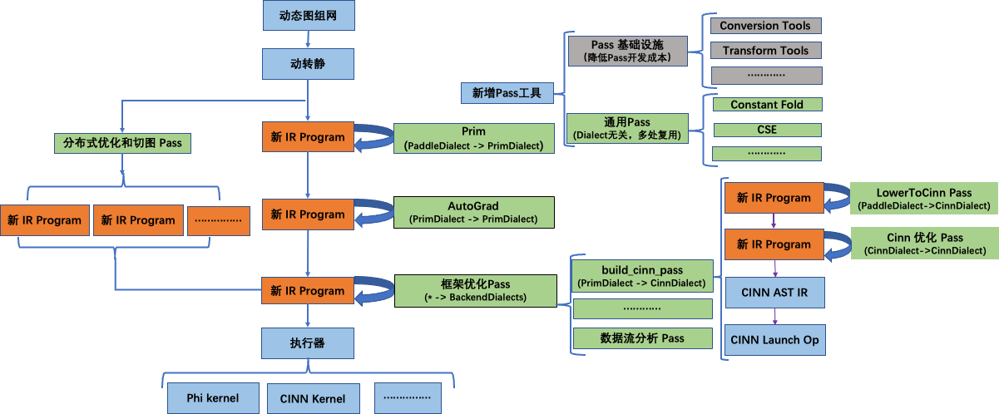
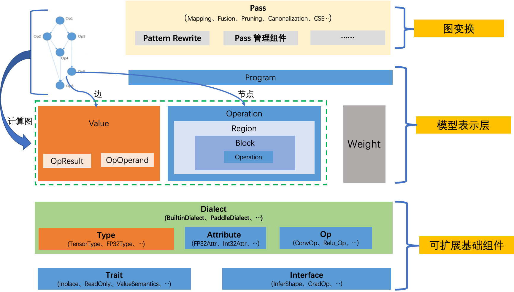
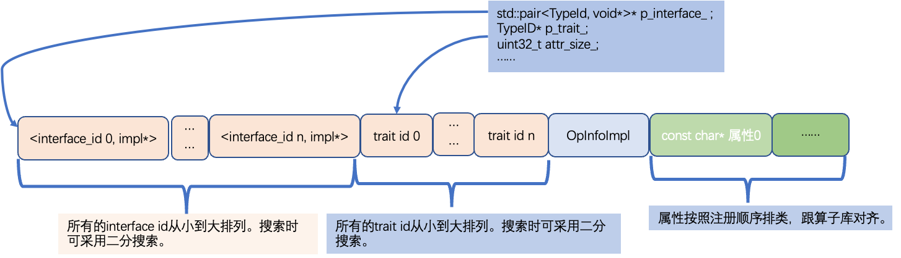

# 【源码学习】IR 设计和底层数据结构


## 一、前言
此文档将采用「问-答」形式，自上而下地介绍研读源码时的个人理解与疑惑，整理的方案设计可以参考如下技术评审文档：
+ [【方案设计】IR 底层基础类型系统设计文档](./basic_concepts.md)
+ [【方案设计】IR 顶层模型结构表示设计文档](./ir_program.md)

> 注：
> 1. 因新 IR 项目处于高频的迭代中，部分源码研读时可能与最近的有些许差别；
> 2. 此文档暂不包含Pass、Translator 逻辑的介绍，其对应源码笔记欢迎补充；

## 二、概览





模型表示层
  + Program用来表示一个具体的模型。它包含两部分：计算图和权重。
  + Weight用来对模型的权重参数进行单独存储，这也是深度学习框架和传统编译器不一样的地方。传统编译器会将数据段内嵌到程序里面。这是因为传统编译器里面，数据和代码是强绑定的，不可分割。但是对神经网络而言，一个计算图的每个epoch都会存在一份权重参数，多个计算图也有可能共同一份权重参数，二者不是强绑定的。
  + Value、Operation用来对计算图进行抽象：
    + Operation表示计算图中的节点。
      1. 一个Operation表示一个算子，它里面包含了零个或多个Region。
      2. Region表示一个闭包，它里面包含了零个或多个Block。
      3. Block表示一个符合SSA的基本块，里面包含了零个或多个Operation。
      4. 三者循环嵌套，可以实现任意复杂的语法结构。
  + Value表示计算图中的有向边，他用来将两个Operaton关联起来，描述了程序中的UD链。
    + OpResult表示定义端，定义了一个Value。
    + OpOperand表示使用端，描述了对一个Value的使用。


## 三、关键问题解答


### Q：新一代IR 长什么样子？

如下是从单测 `program_translator_test` 中经过 `TranslateLegacyProgramToProgram` 转换而来的 ResNet50 的 `main program` 表示，从新IR的打印输出来看：
* g`et_parameter` ：为新增类型算子，负责加载参数；此外新 IR 里还有 `set_parameter`
* `feed` 和 `fetch` ：分别对应于输入数据读取和输出 Tensor 获取操作；
* `builtin op` ：如 constant 对应与旧体系的 `fill_constant` ，但放到了 `builtin` 命名空间
* `conv2d` 和 `conv2d_grad` ：`pd.` 命名空间下的算子，对应于 PaddleDialect 下的算子体系，是通过yaml自动代码生成而来的，具体定义可以参见如下两个文件：
  * `build/paddle/fluid/ir/dialect/pd_op.h`
  * `build/paddle/fluid/ir/dialect/pd_op.cc`

```cpp
{
(%0) = "builtin.get_parameter" () {parameter_name:batch_norm_0.b_0} : () -> tensor<64xf32>
(%1) = "builtin.get_parameter" () {parameter_name:batch_norm_0.b_0_velocity_0} : () -> tensor<64xf32>
(%2) = "builtin.get_parameter" () {parameter_name:batch_norm_0.w_0} : () -> tensor<64xf32>
(%3) = "builtin.get_parameter" () {parameter_name:batch_norm_0.w_0_velocity_0} : () -> tensor<64xf32>
(%4) = "builtin.get_parameter" () {parameter_name:batch_norm_0.w_1} : () -> tensor<64xf32>
(%5) = "builtin.get_parameter" () {parameter_name:batch_norm_0.w_2} : () -> tensor<64xf32>
(%6) = "builtin.get_parameter" () {parameter_name:batch_norm_1.b_0} : () -> tensor<64xf32>
.....(省略)
(%429) = "pd.feed" () {name:label} : () -> tensor<-1x1xi64>
(%430) = "pd.feed" () {name:data} : () -> tensor<-1x3x224x224xf32>

(%431) = "pd.conv2d" (%430, %318) {groups:1,padding_algorithm:EXPLICIT,strides:array[2,2],data_format:NCHW,dilations:array[1,1],paddings:array[3,3]} : (tensor<-1x3x224x224xf32>, tensor<64x3x7x7xf32>) -> tensor<-1x64x112x112xf32>
(%432, %433, %434, %435, %436, %437) = "pd.batch_norm" (%431, %4, %5, %2, %0) {trainable_statistics:0,use_global_stats:0,data_layout:NCHW,epsilon:1e-05,is_test:0,momentum:0.9} : (tensor<-1x64x112x112xf32>, tensor<64xf32>, tensor<64xf32>, tensor<64xf32>, tensor<64xf32>) -> tensor<-1x64x112x112xf32>, tensor<64xf32>, tensor<64xf32>, tensor<64xf32>, tensor<64xf32>, tensor<-1xf32>
(%438) = "pd.relu" (%432) {} : (tensor<-1x64x112x112xf32>) -> tensor<-1x64x112x112xf32>
(%439) = "builtin.constant" () {value:IntArray[3,3]} : () -> tensor<0x<<NULL TYPE>>>
(%440) = "pd.pool2d" (%438, %439) {padding_algorithm:EXPLICIT,paddings:array[1,1],exclusive:1,data_format:NCHW,adaptive:0,strides:array[2,2],ceil_mode:0,global_pooling:0,pooling_type:max} : (tensor<-1x64x112x112xf32>, tensor<0x<<NULL TYPE>>>) -> tensor<-1x64x56x56xf32>
(%441) = "pd.conv2d" (%440, %320) {groups:1,padding_algorithm:EXPLICIT,strides:array[1,1],data_format:NCHW,dilations:array[1,1],paddings:array[0,0]} : (tensor<-1x64x56x56xf32>, tensor<64x64x1x1xf32>) -> tensor<-1x64x56x56xf32>
(%442, %443, %444, %445, %446, %447) = "pd.batch_norm" (%441, %10, %11, %8, %6) {trainable_statistics:0,use_global_stats:0,data_layout:NCHW,epsilon:1e-05,is_test:0,momentum:0.9} : (tensor<-1x64x56x56xf32>, tensor<64xf32>, tensor<64xf32>, tensor<64xf32>, tensor<64xf32>) -> tensor<-1x64x56x56xf32>, tensor<64xf32>, tensor<64xf32>, tensor<64xf32>, tensor<64xf32>, tensor<-1xf32>
(%448) = "pd.relu" (%442) {} : (tensor<-1x64x56x56xf32>) -> tensor<-1x64x56x56xf32>
....(省略)
(%878, %879) = "pd.cross_entropy_with_softmax" (%874, %876) {axis:-1,ignore_index:-100,numeric_stable_mode:1,soft_label:0,use_softmax:1} : (tensor<-1x1000xf32>, tensor<-1x1xi64>) -> tensor<-1x1000xf32>, tensor<-1x1xf32>
(%880) = "pd.mean" (%879) {keepdim:0,axis:IntArray[]} : (tensor<-1x1xf32>) -> tensor<f32>
(%881) = "pd.full" () {place:Place(cpu),dtype:int32,shape:IntArray[1],value:1} : () -> tensor<1xi32>
....(省略)
(%906) = "pd.mean_grad" (%879, %905) {reduce_all:1,axis:IntArray[],keepdim:0} : (tensor<-1x1xf32>, tensor<f32>) -> tensor<-1x1xf32>
(%907) = "pd.cross_entropy_with_softmax_grad" (%876, %878, %906) {axis:-1,ignore_index:-100,numeric_stable_mode:1,soft_label:0,use_softmax:1} : (tensor<-1x1xi64>, tensor<-1x1000xf32>, tensor<-1x1xf32>) -> tensor<-1x1000xf32>
(%908, %909) = "pd.add_grad" (%873, %425, %907) {axis:-1} : (tensor<-1x1000xf32>, tensor<1000xf32>, tensor<-1x1000xf32>) -> tensor<-1x1000xf32>, tensor<1000xf32>
(%910, %911) = "pd.matmul_grad" (%871, %427, %908) {transpose_y:0,transpose_x:0} : (tensor<-1x2048xf32>, tensor<2048x1000xf32>, tensor<-1x1000xf32>) -> tensor<-1x2048xf32>, tensor<2048x1000xf32>
....(省略)
() = "pd.fetch" (%880) {name:mean_0.tmp_0} : (tensor<f32>) ->
() = "pd.fetch" (%884) {name:accuracy_0.tmp_0} : (tensor<f32>) ->
() = "pd.fetch" (%896) {name:accuracy_1.tmp_0} : (tensor<f32>) ->
```

### Q： `paddle::dialect::XXOp` 中自动生成的算子描述是什么样子的？

如下是 Yaml 自动代码生成而来的 `pd_op.h/cc` 文件中的 `AbsOp` 和 `SliceOp` 的源码：
```cpp
// pd_op.h

class AbsOp : public ir::Op<AbsOp,OpYamlInfoInterface,InferShapeInterface> {
 public:
  using Op::Op;
  static const char *name() { return "pd.abs"; }     // <<------ 重要
  static constexpr const char **attributes_name = nullptr;
  static constexpr uint32_t attributes_num = 0;
  static OpInfoTuple GetOpInfo();                 // <<------ 重要
  static void Build(ir::OperationArgument &argument, ir::OpResult x_);   // <<------ 重要
  static void Verify(const std::vector<ir::OpResult> &inputs, const std::vector<ir::Type> &outputs, const ir::AttributeMap &attributes);
  ir::OpOperand x() { return operation()->GetOperandByIndex(0); }
  ir::OpResult out() { return operation()->GetResultByIndex(0); }

  static void InferShape( phi::InferMetaContext *infer_meta );    // <<------ 重要
};

// pd_op.cc
OpInfoTuple AbsOp::GetOpInfo() {
  std::vector<paddle::dialect::OpInputInfo> inputs = { OpInputInfo("x", "paddle::dialect::DenseTensorType", false, false) };
  std::vector<paddle::dialect::OpAttributeInfo> attributes = {  };
  std::vector<paddle::dialect::OpOutputInfo> outputs = { OpOutputInfo("out", "paddle::dialect::DenseTensorType", false, false) };
  paddle::dialect::OpRunTimeInfo run_time_info = OpRunTimeInfo("RealAndImagInferMeta", {"x"}, {"abs"}, {"x"});  // <<-- InferMeta 和 KernelName
  return std::make_tuple(inputs, attributes, outputs, run_time_info);
}

void AbsOp::InferShape( phi::InferMetaContext *infer_meta ) {
  auto fn = PD_INFER_META(phi::RealAndImagInferMeta);     // <<------ 打通了现有的 InferMeta 的体系
  fn(infer_meta);
}


void AbsOp::Verify(const std::vector<ir::OpResult> &inputs, const std::vector<ir::Type> &outputs, const ir::AttributeMap &attributes) {
  VLOG(4) << "Verifying inputs, outputs and attributes for: AbsOp.";

  // Verify inputs type:
  PADDLE_ENFORCE_EQ(inputs.size(), 1,
                    phi::errors::PreconditionNotMet("The size %d of inputs must be equal to 1.", inputs.size()));
  PADDLE_ENFORCE_EQ(inputs[0].type().isa<paddle::dialect::DenseTensorType>(), true,
                    phi::errors::PreconditionNotMet("Type validation failed for the 0th input."));

  // Verify outputs type:
  PADDLE_ENFORCE_EQ(outputs.size(), 1,
                    phi::errors::PreconditionNotMet("The size %d of outputs must be equal to 1.", outputs.size()));
  PADDLE_ENFORCE_EQ(outputs[0].isa<paddle::dialect::DenseTensorType>(), true,
                    phi::errors::PreconditionNotMet("Type validation failed for the 0th output."));

  // Verify if attributes contain attribute name in attributes_name:
  // Attributes num is 0, not need to check attributes type.
}


void AbsOp::Build(ir::OperationArgument &argument, ir::OpResult x_) {
  VLOG(4) << "Builder construction inputs";
  std::vector<ir::OpResult> argument_inputs = {x_};
  argument.AddOperands(argument_inputs.begin(), argument_inputs.end());

  VLOG(4) << "Builder construction attributes";

  VLOG(4) << "Builder construction outputs";
  paddle::dialect::DenseTensorType x = x_.type().dyn_cast<paddle::dialect::DenseTensorType>(); (void)x;

  phi::DenseTensor dense_x;
  dense_x.set_meta(
    phi::DenseTensorMeta(TransToPhiDataType(x.dtype()),
                         x.dims(),
                         x.data_layout(),
                         x.lod(),
                         x.offset())
    );
  phi::MetaTensor meta_x(&dense_x);
  phi::DenseTensor dense_out;
  phi::MetaTensor meta_out(&dense_out);

  phi::RealAndImagInferMeta(meta_x, &meta_out);

  std::vector<ir::Type> argument_outputs;
  ir::Type out_dense_tensor_type = paddle::dialect::DenseTensorType::get(ir::IrContext::Instance(), TransToIrDataType(dense_out.dtype()), dense_out.dims(), dense_out.layout(), dense_out.lod(), dense_out.offset());
  argument_outputs.push_back(out_dense_tensor_type);
  argument.AddTypes(argument_outputs.begin(), argument_outputs.end());

}
```

以 SliceOp 为例：

```cpp
class SliceOp : public ir::Op<SliceOp,OpYamlInfoInterface,InferShapeInterface> {
 public:
  using Op::Op;
  static const char *name() { return "pd.slice"; }
  static const char *attributes_name[5];
  static constexpr uint32_t attributes_num = 5;   // <----- attribute 的定义
  static OpInfoTuple GetOpInfo();
  static void Build(ir::OperationArgument &argument, ir::OpResult input_, std::vector<int64_t> axes, std::vector<int64_t> starts, std::vector<int64_t> ends, std::vector<int64_t> infer_flags, std::vector<int64_t> decrease_axis);
  static void Verify(const std::vector<ir::OpResult> &inputs, const std::vector<ir::Type> &outputs, const ir::AttributeMap &attributes);
  ir::OpOperand input() { return operation()->GetOperandByIndex(0); }
  ir::OpResult out() { return operation()->GetResultByIndex(0); }

  static void InferShape( phi::InferMetaContext *infer_meta );
};


const char *SliceOp::attributes_name[5] = { "axes", "starts", "ends", "infer_flags", "decrease_axis" };

OpInfoTuple SliceOp::GetOpInfo() {
  std::vector<paddle::dialect::OpInputInfo> inputs = { OpInputInfo("input", "paddle::dialect::DenseTensorType", false, false) };
  std::vector<paddle::dialect::OpAttributeInfo> attributes = { OpAttributeInfo("axes", "ir::ArrayAttribute<ir::Int64_tAttribute>", ""), OpAttributeInfo("starts", "paddle::dialect::IntArrayAttribute", "std::vector<int64_t>"), OpAttributeInfo("ends", "paddle::dialect::IntArrayAttribute", "std::vector<int64_t>"), OpAttributeInfo("infer_flags", "ir::ArrayAttribute<ir::Int64_tAttribute>", ""), OpAttributeInfo("decrease_axis", "ir::ArrayAttribute<ir::Int64_tAttribute>", "") };
  std::vector<paddle::dialect::OpOutputInfo> outputs = { OpOutputInfo("out", "paddle::dialect::DenseTensorType", false, false) };
  paddle::dialect::OpRunTimeInfo run_time_info = OpRunTimeInfo("SliceRawInferMeta", {"input", "axes", "starts", "ends", "infer_flags", "decrease_axis"}, {"slice"}, {"input", "axes", "starts", "ends", "infer_flags", "decrease_axis"});
  return std::make_tuple(inputs, attributes, outputs, run_time_info);
}
```

### Q： 怎么通过 Yaml 中信息，拆分对应到现有新 IR 的各个底层数据结构组件中的？

如下是一个 Yaml 样例：
```
- op : addmm
  args : (Tensor input, Tensor x, Tensor y, float beta=1.0, float alpha=1.0)
  output : Tensor
  infer_meta :
    func : AddmmInferMeta
  kernel :
    func : addmm    //<--- Op 与 KernelFunc 是一一对应的，在 dialect::OpRunTimeInfo 对此「约定」是有依赖的
    data_type : x
  backward : addmm_grad
```

经过初步逻辑拆解：
+ 将 args 显式拆分为 input 和 attrs 。各自都可支持任意类型。
+ infer_meta 等进一步归纳为 `interface` 和 `trait`

```
op : addmm
    inputs : (Tensor input, Tensor x, Tensor y)
    attributes: (float beta=1.0, float alpha=1.0)
    outputs : Tensor
    interfaces:
        InferShape :
            func : AddmmInferMeta
        Backward : addmm_grad
     traits: (ReadOnly，...)
     Kernel:
         func : addmm
         data_type : x
```

### Q：新 IR 体系下，编译期的 Op 是如何与执行期的 Kernel 关联起来的？
在旧的 Program 体系下，编译期是通过 OpDesc 来表示的，执行期是变换到 OperatorBase 上来的，后者关联了 RuntimeContext 和 Scope 的概念，统一交给执行器来选择 kernel 执行。

在新的 IR 体系下，是如何对应到上述的过程的呢？
* 编译期的 Op 是通过 Operation 来表示的，统一注册到 PaddleDialect（包括编译期相关的 Attribute 体系）；其 Op 定义均有Yaml生成而来
* 编译期的 Kernel 是复用现有 Phi 体系的，在上层封装了 PhiKernelOp，其单独注册到了 PaddleKernelDialect（包括执行期相关的 Attribute——即 KernelKey）
* 二者是通过 OpRunTimeInfo 关联起来的，其保存了一个 OP 运行时要执行的 InfereMetaFunc、KernelFunc、以及对应的参数。

以 Abs 为例：
```cpp
// pd_op.cc
OpInfoTuple AbsOp::GetOpInfo() {
  std::vector<paddle::dialect::OpInputInfo> inputs = { OpInputInfo("x", "paddle::dialect::DenseTensorType", false, false) };
  std::vector<paddle::dialect::OpAttributeInfo> attributes = {  };
  std::vector<paddle::dialect::OpOutputInfo> outputs = { OpOutputInfo("out", "paddle::dialect::DenseTensorType", false, false) };
  paddle::dialect::OpRunTimeInfo run_time_info = OpRunTimeInfo("RealAndImagInferMeta", {"x"}, {"abs"}, {"x"});  // <<-- InferMeta 和 KernelName
  return std::make_tuple(inputs, attributes, outputs, run_time_info);
}
```

其中 OpRuntimeInfo 的定义：
```cpp
struct OpRunTimeInfo {
  std::string infer_meta_func;
  std::vector<std::string> infer_meta_param;
  std::vector<std::string> kernel_func;
  std::vector<std::string> kernel_param;
  std::vector<std::pair<std::string, std::string>> inplace;
  std::vector<std::pair<std::string, std::string>> view;
  OpRunTimeInfo(std::string infer_meta_func,
                std::vector<std::string> infer_meta_param,
                std::vector<std::string> kernel_func,
                std::vector<std::string> kernel_param,
                std::vector<std::pair<std::string, std::string>> inplace,
                std::vector<std::pair<std::string, std::string>> view)
      : infer_meta_func(infer_meta_func),
        infer_meta_param(infer_meta_param),
        kernel_func(kernel_func),
        kernel_param(kernel_param),
        inplace(inplace),
        view(view) {}
};
```

### Q：新 IR 中的 Operator 是如何设计的？与旧 IR 的Operator 有什么不同？
 Operation 的对一个算子的具体描述，目前来说，它主要涉及到四个成员： 输出、输入、属性以及类型信息。


从 Operation 的构造逻辑函数 `Create()` 可以看出其内存布局的设计：

```cpp
Operation *Operation::Create(const std::vector<ir::OpResult> &inputs,
                             const AttributeMap &attributes,
                             const std::vector<ir::Type> &output_types,
                             ir::OpInfo op_info,
                             size_t num_regions) {
  // 0. Verify
  if (op_info) {
    op_info.Verify(inputs, output_types, attributes);
  }
  // 1. Calculate the required memory size for OpResults + Operation +
  // OpOperands.
  uint32_t num_results = output_types.size();
  uint32_t num_operands = inputs.size();
  uint32_t max_inline_result_num =
      detail::OpResultImpl::GetMaxInlineResultIndex() + 1;
  size_t result_mem_size =         // <------ 输出的 mem size
      num_results > max_inline_result_num
          ? sizeof(detail::OpOutlineResultImpl) *
                    (num_results - max_inline_result_num) +
                sizeof(detail::OpInlineResultImpl) * max_inline_result_num
          : sizeof(detail::OpInlineResultImpl) * num_results;
  size_t operand_mem_size = sizeof(detail::OpOperandImpl) * num_operands;  // <------ 输入的 mem size
  size_t op_mem_size = sizeof(Operation);     // <------ Operation 的 mem size
  size_t region_mem_size = num_regions * sizeof(Region);  // <------ Region 的 mem size
  size_t base_size =
      result_mem_size + op_mem_size + operand_mem_size + region_mem_size;  // <------ 一个 Operation 所需要的总 mem size
  // 2. Malloc memory.
  char *base_ptr = reinterpret_cast<char *>(aligned_malloc(base_size, 8));
  // 3.1. Construct OpResults.
  for (size_t idx = num_results; idx > 0; idx--) {
    if (idx > max_inline_result_num) {
      new (base_ptr)
          detail::OpOutlineResultImpl(output_types[idx - 1], idx - 1);     // placement new 输出
      base_ptr += sizeof(detail::OpOutlineResultImpl);
    } else {
      new (base_ptr) detail::OpInlineResultImpl(output_types[idx - 1], idx - 1);
      base_ptr += sizeof(detail::OpInlineResultImpl);
    }
  }
  // 3.2. Construct Operation.
  Operation *op = new (base_ptr)
      Operation(attributes, op_info, num_results, num_operands, num_regions);  // placement new Operation
  base_ptr += sizeof(Operation);
  // 3.3. Construct OpOperands.
  if ((reinterpret_cast<uintptr_t>(base_ptr) & 0x7) != 0) {
    throw("The address of OpOperandImpl must be divisible by 8.");
  }
  for (size_t idx = 0; idx < num_operands; idx++) {
    new (base_ptr) detail::OpOperandImpl(inputs[idx].impl_, op);    // placement new 输入
    base_ptr += sizeof(detail::OpOperandImpl);
  }
  // 3.4. Construct Regions
  if (num_regions > 0) {
    op->regions_ = reinterpret_cast<Region *>(base_ptr);
    for (size_t idx = 0; idx < num_regions; idx++) {   // placement new region
      new (base_ptr) Region(op);
      base_ptr += sizeof(Region);
    }
  }
  return op;
}
```

### Q：哪个数据结构承载了框架原来的的 OpInfo 的角色？
我们先来看一下旧的 OpInfo 定义:

```cpp
class OpInfo {
 public:
  OpCreator creator_;
  GradOpMakerFN grad_op_maker_;
  CompositeGradOpMakerFN grad_comp_op_maker_;
  proto::OpProto* proto_{nullptr};
  OpAttrChecker* checker_{nullptr};
  InferVarTypeFN infer_var_type_;
  InferShapeFN infer_shape_;
  InferInplaceOpFN infer_inplace_;
  InferNoNeedBufferVarsFN infer_no_need_buffer_vars_;
  DygraphGradOpMakerFN dygraph_grad_op_maker_;

  // NOTE(zjl): this flag is added to check whether
  // the grad maker is the default one.
  bool use_default_grad_op_desc_maker_{false};

  // NOTE(huihuangzheng): this flag is added to check whether
  // the grad maker is the empty one.
  bool use_empty_grad_op_desc_maker_{false};
  ....
  };
```

新 IR 下是通过 OpInfoImpl 来承载这个角色的：

```cpp
class OpInfoImpl {
    template <typename ConcreteOp>
    static OpInfoImpl* create();//先开辟内存，然后逐个构造
    void destroy();//回收自身
    bool hasTrait(TypeId traitId);// 二分搜索trait id列表，进行查找
    bool hasInterface(TypeId interfaceId);// 二分搜索interface id列表，进行查找
    // 二分搜索interface id列表，获取相应的void*,然后强转为Interface::Impl*
    template <class Interface>
    Interface::Concept* getInterfaceImpl();
private:
    // 构造函数私有
    std::pair<TypeID, void>* p_interface_; //指向第一个interface的指针
    TypeID* p_trait_;//指向第一个trait的指针
    uint32_t attr_size_; //属性名的顺序
    TypeId type_id_; //对应Op类型的TypeId。
    const char* name_; //op名字
}；
class OpInfo {
    OpInfoImpl* impl;
};
```


我们从 OpInfoImpl 构造相关的 `Create()` 函数中，能够比较清楚的了解到其内存布局：

```cpp
OpInfoImpl *OpInfoImpl::create(Dialect *dialect,
                               TypeId op_id,
                               const char *op_name,
                               std::vector<InterfaceValue> &&interface_map,
                               const std::vector<TypeId> &trait_set,
                               size_t attributes_num,
                               const char *attributes_name[],
                               VerifyPtr verify) {
  // (1) Malloc memory for interfaces, traits, opinfo_impl.
  size_t interfaces_num = interface_map.size();
  size_t traits_num = trait_set.size();
  VLOG(4) << "Create OpInfoImpl with: " << interfaces_num << " interfaces, "
          << traits_num << " traits, " << attributes_num << " attributes.";
  size_t base_size = sizeof(InterfaceValue) * interfaces_num +    // <<----- 总的 mem size
                     sizeof(TypeId) * traits_num + sizeof(OpInfoImpl);
  char *base_ptr = static_cast<char *>(::operator new(base_size)); // <<-- 这里并没有显式做align，与Operation是有差别的
  VLOG(4) << "Malloc " << base_size << " Bytes at "
          << static_cast<void *>(base_ptr);
  if (interfaces_num > 0) {
    std::sort(interface_map.begin(), interface_map.end());
    for (size_t index = 0; index < interfaces_num; ++index) {
      new (base_ptr + index * sizeof(InterfaceValue))      // <--- placement new InterfaceValue (有序的)
          InterfaceValue(std::move(interface_map[index]));
    }
    base_ptr += interfaces_num * sizeof(InterfaceValue);
  }
  if (traits_num > 0) {
    auto p_first_trait = reinterpret_cast<TypeId *>(base_ptr);
    memcpy(base_ptr, trait_set.data(), sizeof(TypeId) * traits_num);
    std::sort(p_first_trait, p_first_trait + traits_num);  // <--- placement new Trait(有序的)
    base_ptr += traits_num * sizeof(TypeId);
  }
  // Construct opinfo_impl.
  OpInfoImpl *p_opinfo_impl = reinterpret_cast<OpInfoImpl *>(base_ptr);
  VLOG(4) << "Construct op_info_impl at " << p_opinfo_impl << " ......";
  OpInfoImpl *op_info = new (p_opinfo_impl) OpInfoImpl(dialect,  // <--- placement new OpInfoImpl
                                                       op_id,
                                                       op_name,
                                                       interfaces_num,
                                                       traits_num,
                                                       attributes_num,
                                                       attributes_name,
                                                       verify

  );
  return op_info;
}
```

### Q： 怎样理解 Trait 和 Interface 的设计？
1. Trait 和 Interface：（摘录自评审方案）
  + Trait 用来对特征进行抽象。 比如 InplaceTrait 表示一个 Op 具有 Inplace 特征， ReadOnlyTrait 表示一个算子具有只读特征（这个信息对图优化和并行调度很重要。），ValueSemanticsTrait 表示一个算子具有值语意特征；
  + Interface 用来对接口进行抽象，它表示算子定义了某些函数接口，比如 InferShapeInterface 表示一个算子定义了 InferShape 函数接口（有些则没有。可以通过InferShape 接口来标志算子是否存在 InferShape 函数。）、GradInterface 表示一个算子定义了构造反向的函数接口。
  + 这二者都是可以任意扩展的，只要派生自相应的基类、遵循相应的实现规则即可。


如下是 `ir_op_test.cc` 中的一个样例，可以帮助理解设计和用法：
```cpp
class Operation2
    : public ir::Op<Operation2, ReadOnlyTrait, InferShapeInterface> {};


  EXPECT_EQ(op2_info.HasTrait<ReadOnlyTrait>(), true);    // << 从目前的源码中的「用法」来看，Trait 主要用来「标记」，代替了原来bool class member
  EXPECT_EQ(op2_info.HasInterface<InferShapeInterface>(), true); // << 除了「标记」，interface还承载了具体的「职责」。
```

特征和接口的区别在于：

+ 特征的相关接口实现跟具体算子无关，不需要多态，它对相关算子的接口没有要求，比如ReadOnly，只是通知使用者，该算子不会修改它的输入的值。
+ 而接口的实现，是跟具体算子类型相关的，需要考虑多态，比如InferShape接口，是强行要求了相应算子一定定义了InferShape接口。

之所以区分特征和接口，也是从实现上考虑:

+ 特征的实现比较简单，我们用TraitId对每个特征进行标志，最简单的方式，可以在 OpInfoImpl中，包含一个vector<TraitId>。来判断该算子是否具有某个特征即可。
+ 接口的实现则较为复杂，需要根据具体的算子类型的不同，实现多态。

```cpp
Operation* op = ...;
// 特征的使用
if(op->hasTrait<ReadOnlyTrait>()) {
    // dyn_cast的实现，是根据Operation里面的OpInfo，获取信息
    ReadOnlyTrait trait = op->dyn_cast<ReadOnlyTrait>();
    // 可以据此做一些优化
    .....
}

// 接口的使用
if(op->hasInterface<InferShapeInterface>()) {
  // dyn_cast的实现，是根据Operation里面的OpInfo，获取信息
  InferShapeInterface interface = op->dyn_cast<InferShapeInterface>();
  // 该InferShape会实现静态多态。
  interface.InferShape();
}
```

### Q：IrContextImpl 里的Map结构是「平铺」的，如果对于不同 Dialect下的相同 name 的 Operation场景，是否会出现冲突问题？还是说根本不存在这种场景？

如下是一个简单的派生 Dialect  的定义方式，当我们在定义一个 Dialect 时，必须要提供 `initialize()` 的定义，用于注册一个派生类 Dialect所需要的必要体系：

* RegisterTypes<Type1, Type2, ...>()
* RegisterAttributes<Attr1, Atrr2, ...>()
* RegisterOps<Op1, Op2, ...>()
* RegisterInterfaces<IF1, IF2, ...>()
* ....

如下样例中 TestDialect 里有两个 Op：

```cpp
class TestDialect : public ir::Dialect {
 public:
  explicit TestDialect(ir::IrContext *context)
      : ir::Dialect(name(), context, ir::TypeId::get<TestDialect>()) {
    initialize();
  }
  static const char *name() { return "test"; }

 private:
  void initialize() { RegisterOps<Operation1, Operation2>(); }
};
```

在上层使用端：
```cpp
  ir::IrContext *ctx = ir::IrContext::Instance();
  ir::Dialect *test_dialect = ctx->GetOrRegisterDialect<TestDialect>();

  ir::OpInfo op1_info = ctx->GetRegisteredOpInfo(Operation1::name());  // 此处是从全局map里查找的，如何区分不同Dialect的同名Op？
  ir::OpInfo op2_info = ctx->GetRegisteredOpInfo(Operation2::name());
```

IrContextImpl 里的Map结构是「平铺」的，但目前没有出现冲突，主要是在Operation定义处，通过 name()管理，如下面的A.B.C的形式，个人觉得目前是在这里「约定了 name 是具有唯一性」的。

```cpp
static const char *name() { return "test.add"; }
```

### Q：DenseTensorTypeStorage 为什么没有 Place属性？Parameter 目前是只支持CPU 设备么？从构造函数里来看，总是会 malloc + memcpy

从目前 Parameter 的实现看来，暂时只支持CPU。

```cpp
class Parameter {
 public:
  Parameter(void* data, size_t size, ir::Type type) {
    data_ = malloc(size);
    memcpy(data_, data, size);
    size_ = size;
    type_ = type;
  }

  Parameter(const Parameter& param) {
    data_ = malloc(param.size_);
    memcpy(data_, param.data_, param.size_);
    size_ = param.size_;
    type_ = param.type_;
  }

  Parameter& operator=(const Parameter& param) {
    data_ = malloc(param.size_);
    memcpy(data_, param.data_, param.size_);
    size_ = param.size_;
    type_ = param.type_;
    return *this;
  }
}

```

另外，从当前的代码实现来看，DenseTensorTypeStorage是没有 Place 的属性的，但近期框架新增了一个AllocatedDenseTensorTypeStorage是包含 place 属性的：

```cpp
struct AllocatedDenseTensorTypeStorage : public ir::TypeStorage {
  using Place = phi::Place;
  // .... (省略)

  phi::Place place_;
  dialect::DenseTensorType dense_tensor_type_;
 };
```

### Q: 新的 IR 体系对于 Inplace 和 view 操作是如何区分的？
> 如下描述摘录自《技术评审文档》

别名算子的定义：

```cpp
class ReluOp: Op<ReluOp, ReadOnlyTrait， HasValueSemanticsTrait, ...>  {...}
class Relu_Op: Op<Relu_Op, InplaceTrait, ...>  {...}
class ReshapeOp: Op<ReshapeOp, ViewLikeTrait, ReadOnlyTrait，...>  {...}
```

ReadOnlyTrait 表示该算子不会修改它的操作数（意味着不是 inplace算子）。

HasValueSemanticsTrait比 ReadOnlyTrait更强一层，表示该算子不仅不会修改它的操作数，而且不会给操作数增加别名（不仅不是inplace算子，而且不是view类算子）。

InplaceTrait表示该算子是某个算子的 inplace版本，它的算子名一定以下划线结尾，而且去掉下划线，就是算子的 非inplace版本。

ViewLikeTrait表示该算子的输出是输入的别名。（目前暂定它的第一个输出是第一个输出的别名，以后可以考虑将其升级为Interface）

**Pass1: 将inplace算子转换为非inplace算子，方便优化**

可以简单地通过定义新变量，将inplace算子转换为一个非inplace算子。

```cpp
b = relu_(a) : (pd.tensor) -> pd.tensor
// 此时，b是a的别名tensor. 而且二者的shape、dtype也一致。
use(a)
use(b)
```

它可以做如下等价变换：

```cpp
b = relu(a) : (pd.tensor) -> pd.tensor
// 完全使用b来替换之前的a和b的使用
use(b)
```

这样做的好处是， 比如 conv+bn+relu_,  正常来说不能融合， 但是将relu_转换成 relu以后， 这三个算子就可以融合一个为一个算子。等所有的图优化做完以后，用户可以选择性的插入一个类似的pass， 再将非inplace算子转换为inplace算子。

> 思考：上述的变换，是为了先试探性的看是否能命中更多的融合策略，若没有命中，为了降低「替换非inplace」版本的性能损耗，再借助pass变换回来。

### Q：Dialect 的语义范围是什么？或者说有什么样的准则参考，能够帮助界定哪些模块应该放到一个独立的Dialect里，哪些模块不适合定义为Dialect ？
> 如下描述摘录自《技术评审方案》

1. Dialect 用来对 Type、Attribtue、Op做模块化管理， 比如 BuiltinDialect 、PaddleDialect、CinnDialect等等。一个Dialect里面包含了一系列的Type、Attribtue、Op的定义。相应的，每个Type、Attribtue、Op都是定义在某个唯一的Dialect里面。对整个IR框架而言，Dialect是可以随意插拔的。
2. Dialect也是可以任意扩展的。只要派生自相应的基类、定义所以所拥有的Type、Attrbute、Op即可。


我们看下目前框架中 PaddleDialect 都包含了哪些数据结构体系：
```cpp
void PaddleDialect::initialize() {
  RegisterTypes<paddle::dialect::DenseTensorType>();    // <<--- type 体系

  RegisterAttributes<paddle::dialect::IntArrayAttribute,
                     paddle::dialect::DataTypeAttribute,
                     paddle::dialect::PlaceAttribute,
                     paddle::dialect::DataLayoutAttribute>(); // <<--- attr 体系

  // NOTE(zhangbo9674): GET_OP_LIST is defined in pd_op.h which is
  // generated by op_gen.py, see details in
  // paddle/fluid/ir/dialect/CMakeLists.txt.
  RegisterOps<
#define GET_OP_LIST
#include "paddle/fluid/ir/dialect/pd_op.h"  // NOLINT  // <<--- op 体系(yaml 自动生成)
      >();

  RegisterInterfaces<ParameterConvertInterface>();   // <<--- interface 体系
}
```
从 initialize()很好理解，基本包含了 旧 IR 下的基本数据结构（编译期）。
目前框架里，近期还引入了 PaddleKernelDialect：
```cpp
void PaddleKernelDialect::initialize() {
  RegisterTypes<paddle::dialect::AllocatedDenseTensorType>();   // <<-- 额外包含了 Place 信息
  RegisterOps<dialect::PhiKernelOp>();    // <--- 目前只注册了一个Op
}
```

从源码来看，PaddleKernelDialect 更多是面向「运行期」的，是否意味着在新的IR体系下，「编译期」和「运行期」需要定义不同的 Dialect 来适配？或者更进一步，对于下游组件CINN、推理引擎，是否也需要区分「编译期」和「运行期」分别定义Dialect体系？
