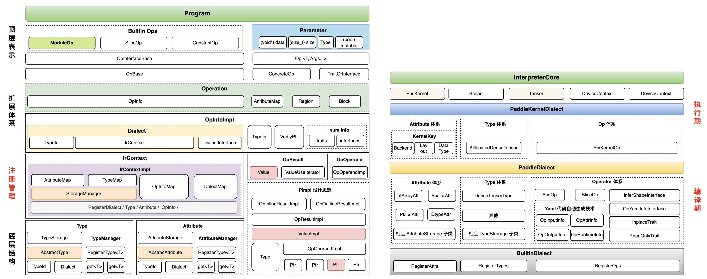

# IR Dialect

## 一、Motivation

## 二、Design Documents

+ [【源码学习】IR 设计和底层数据结构🔥hot🔥](./QA_learning.md)
+ [【方案设计】IR 底层基础类型系统设计文档✨New✨](./basic_concepts.md)
+ [【方案设计】IR 顶层模型结构表示设计文档✨New✨](./ir_program.md)
+ [【代码约定】IR 代码相关约定](./code_convention.md)
