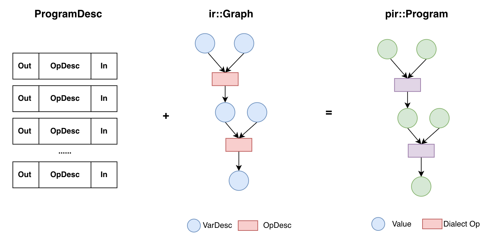
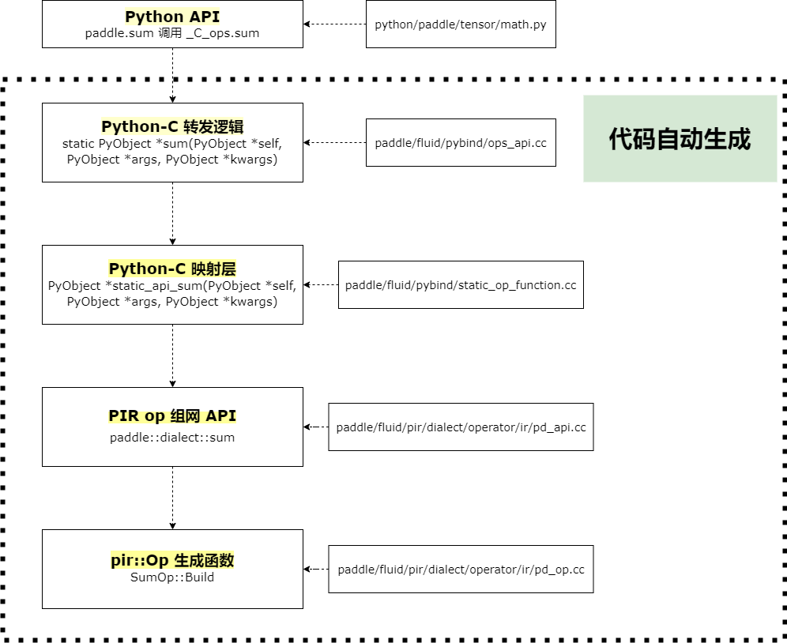
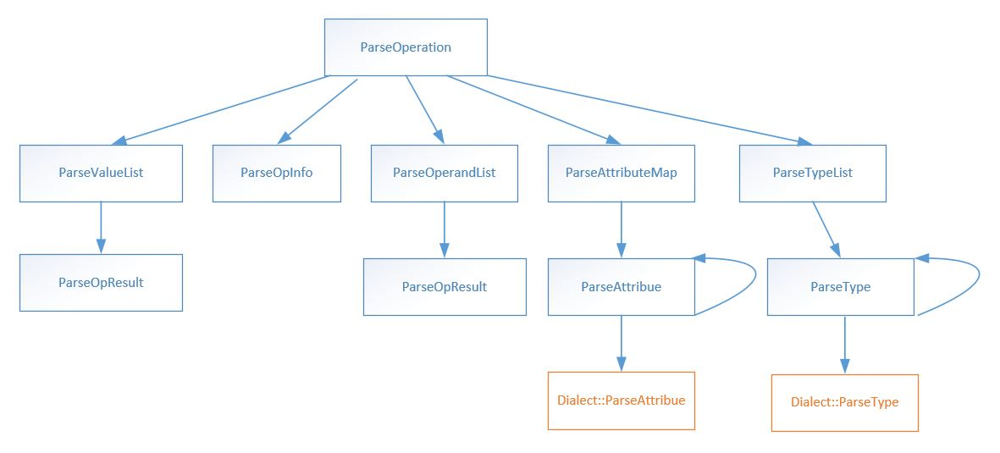
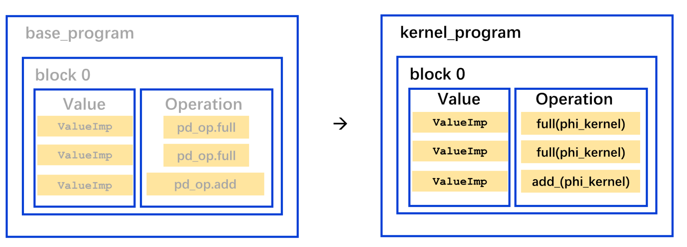

# 飞桨新旧 IR 差异性
> 本文文档作者： @Aurelius84

## 一、概述

近些年来，越来越多的框架和研究者将编译器技术引入到深度学习的神经网络模型优化中，通过一种IR（`Intermediate Representation` ，中间表示形式）来表示计算图，并在此基础上借助编译器的理念、技术和工具对神经网络进行自动优化和代码生成。常见的深度学习 IR 包括 MLIR，TVM relay，MindIR，XLA hlo，TorchScript 等。

历史上，飞桨先后实现了两套 `IR` ，一套是 `Program` ，一套是 `Graph` 。但这两套 `IR` 在早期设计的时候未考虑到发展到今天，会出现如此复杂的优化需求和使用场景。因此飞桨正在研发基于MLIR范式的新一代中间表示技术，即 `Paddle IR` ，详见[《IR 顶层模型结构表示设计文档》](./ir_program.md)。

## 二、差异性

### 1.概念层面

在 `IR` 概念层面，现存的体系由「顺序性」`ProgramDesc` 和「图语义」`Graph` 两个核心类共同承载。用户在静态图 API 或者动转静模块下，产生的中间表示是 `Op-by-Op` 的 `Program` ；如果要应用更高层面的优化策略（比如算子融合、 `inplace` 策略、剪枝等），框架会将由 `Program` 构造出 `ir::Graph` ，其由数据节点、算子节点和彼此关联的边构成。

在深度学习框架中，「顺序性」和「图语义」是两个非常高频常用的概念。在飞桨新一代的 `IR` 表示中，我们充分考虑了这两者的角色，并在IR层进行了统一。坚持 `SSA` (静态单赋值)原则，模型等价于一个有向无环图。并以 `Value` 、 `Operation` 对计算图进行抽象， `Operation` 为节点， `Value` 为边。详见[《IR 底层基础类型系统设计文档》](./basic_concepts.md)

* `Operation` 表示计算图中的节点：一个 `Operation` 表示一个算子，它里面包含了零个或多个 `Region` ； `Region` 表示一个闭包，它里面包含了零个或多个 `Block` ； `Block` 表示一个符合 `SSA` 的基本块，里面包含了零个或多个 `Operation` ；三者循环嵌套，可以实现任意复杂的语法结构

* `Value` 表示计算图中的有向边：用来将两个 `Operaton` 关联起来，描述了程序中的 `UD链` （即 `Use-Define` 链）； `OpResult` 表示定义端，定义了一个 `Value` ， `OpOperand` 表示使用端，描述了对一个 `Value` 的使用。

### 2.接口层面

在接口层面，现存的 `ProgramDesc` 定义在 `paddle/fluid/framework/program_desc.h` ，其依赖的基础组件如 `BlockDesc` 、 `OpDesc` 、 `VarDesc` 也分别定义在同目录下的 `*_desc.h` 中。` ir::Graph` 定义在 `paddle/fluid/frameowork/ir/graph.h` 中，其依赖的基础组件如 `ir::Node` 定义在同目录的 `node.h`

**`Desc` 类提供的接口主要包括：**

* 访问成员信息：如 `ProgramDesc::Block(1)` 、 `BlockDesc::Op(1)` 、 `OpDesc::Input("X")` 、 `VarDesc.GetShape()` 等
* 修改成员信息：如 `ProgramDesc::MutableBlock(1)` 、 `BlockDesc::InsertOp(1)` 、 `OpDesc::SetType()` 、 `VarDesc.SetName()` 等
* 获取 `Proto` 信息：如 `*Desc::Proto()`

**`Graph` 类提供的接口主要包括：**
* 图构建和更新：如 `InitFromProgram()` 、 `AddNode()` 、 `RemoveNode()` 等
* 图访问和查询：如 `Has()` 、 `AttrNames()` 、 `Clone()` 等

在新的 `IR` 体系下，我们将 `ProgramDesc & Graph `合二为一，统一为了 `pir::Program` 。 `Desc` 类相关的接口和 `Graph` 类相关的接口，大多数都有等价的接口可以使用；其中 `pir::Program` 定义在 `paddle/pir/core/program.h` 中，同时 `core` 目录下也包含了 `Paddle IR` 核心的基础组件，比如 `Operation` 、 `Value` 、 `OpResult` 等；

### 3.设计层面
在设计层面，现存的 `ProgramDesc` 中的算子定义，大部分是由预定义的 Yaml 文件和自动代码生成技术完成的，具体可以参考[paddle代码自动生成机制讲解](https://github.com/PaddlePaddle/community/blob/master/pfcc/paddle-code-reading/code_gen/code_gen_ops.md)，所有的算子描述信息都会注册进 `OpInfoMap` 全局表中，以「并集」的方式描述 `InferShape` 、 `OpMaker` 等逻辑；

在新的 `Paddle IR` 中，我们抽象了一套高度可扩展的基础组件，包括 `Type` 、 `Attrbute` 、 `Op` 、 `Trait` 和 `Interface` ；并引入了 `Dialect` 的概念来对 `Type` 、 `Attribtue` 、 `Op` 做模块化管理， 比如 `BuiltinDialect` 、 `PaddleDialect` 、 `CinnDialect` 等等。一个 `Dialect` 里面包含了一系列的 `Type` 、 `Attribtue` 、 `Op` 的定义。相应的，每个 `Type` 、 `Attribtue` 、 `Op` 都是定义在某个唯一的 `Dialect` 里面。对整个 `IR` 框架而言， `Dialect` 是可以随意插拔的。 `Dialect` 也是可以任意扩展的。只要派生自相应的基类、定义所以所拥有的 `Type` 、 `Attrbute` 、 `Op` 即可。详见[《IR 顶层模型结构表示设计文》之方案要点](https://github.com/PaddlePaddle/community/blob/master/pfcc/paddle-code-reading/IR_Dialect/ir_program.md#3-%E6%96%B9%E6%A1%88%E8%A6%81%E7%82%B9)

同时，新的 `Paddle IR` 在 Python API 上同样采用了预定义的 Yaml 文件和自动代码生成技术，实现了极致化的动静统一，并降低了维护成本。详见[《从 CodeGen 视角看 PIR 组网 API》](https://github.com/MarioLulab/Camp/blob/2f281f1e567b34a6bb0e52b68b77b8911023c42e/Docs/03_NewIRAPI_AutoDiffAndCoreComponentRefinement/CodeReading/Over_view_PIR_construct_API_As_CodeGen_perspective.md)。

### 4.协议层面
在协议层面，现存的 `ProgramDesc` 是基于 `Protobuf` 协议，在 `framework.proto` 文件中定义所有框架核心概念的和类体系的原型，也是模型 `Save/Load` 序列化和反序列化过程的基础。
在新的 `Paddle IR` 中，不在依赖 `Protobuf` 协议，仅依赖于 `pir/core` 中定义的基础组件。另外，在表示层我们引入了 `Printer` 和 `Parser` 模块，以支持 `pir::Program` 的打印、序列化和反序列化过程；详见[《Pir Parser实现》](https://github.com/PFCCLab/Camp/blob/main/Docs/01_PIR_OpTestFixingAndProgramTranslatorRefinement/pir_parser_implementation_sharing.md)

### 5.执行层面

在执行层面，新的 `Paddle IR` 不涉及到 `PHI` 算子库 `Kernel` 层的变动，但在执行器层新引入了 `PirInterPreterCore` 组件，用于实现 `Paddle IR` 下的解释、调度和执行，具体定义在 `paddle/fluid/framework/new_executor/pir_interpreter.h` 中。

### 6.调试层面

在调试层面，新的 `Paddle IR` 处于功能高频迭代中。为了保持新、旧IR的兼容性和流畅切换，我们引入了 `ProgramTranslator` 模块，承担对 `ProgramDesc` → `pir::Program` 的等价转换，详见[《ProgramTranslator设计文档》](./program_translator.md)。此外，我们在执行器、 `Python API` 层也均进行了迁移和适配，可以通过如下 `FLAGS` 定向开启，详见 `paddle/phi/core/flags.cc` ：

* `FLAGS_enable_pir_in_executor` ：是否在执行器层开启 `Paddle IR` ，默认为 `False`
* `FLAGS_enable_pir_api` ：是否在 `Python API` 端开启 `Paddle IR` ，开启后在静态图模式下将直接生成新 `IR` 表示，默认为 `False`
* `FLAGS_enable_pir_with_pt_in_dy2st` ：是否在动转静 `@to_static` 入口下开启 `Paddle IR` ，默认为 `True`

## 三、参考文档
+ [【方案设计】IR 底层基础类型系统设计文档](./basic_concepts.md)
+ [【方案设计】IR 顶层模型结构表示设计文档](./ir_program.md)
+ [【方案设计】IR Program Translator设计文档](./program_translator.md)
+ [【方案设计】控制流设计文档](./control_flow.md)
+ [【社区贡献文档】PIR源码阅读指南](./first_step.md)
+ [【源码学习】IR 设计和底层数据结构](./QA_learning.md)
+ [【社区贡献文档】Pir Parser实现分享]([./first_step.md](https://github.com/PFCCLab/Camp/blob/main/Docs/01_PIR_OpTestFixingAndProgramTranslatorRefinement/pir_parser_implementation_sharing.md))
