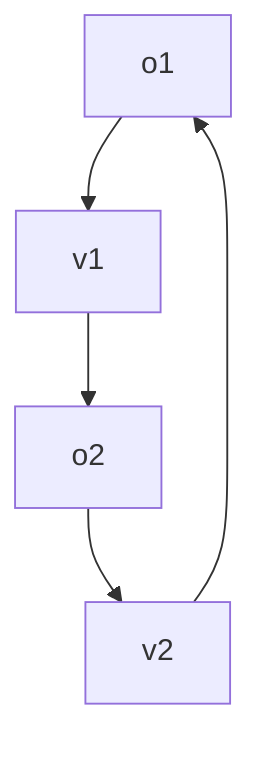

# 一起从代码层面熟悉 PIR —— PIR 源码阅读指南

| 版本  | 作者  | 指导/校验  | 时间       | 主要更新           |
| ---- | ----- | --------- |---------- | ------------------ |
| 0.7 | [Ryan](https://github.com/drryanhuang)  | [Aurelius84](https://github.com/Aurelius84)      |2023.10.01  | 初版|
| 1.0 | [Ryan](https://github.com/drryanhuang)  | [Aurelius84](https://github.com/Aurelius84)      |2023.10.13  | 初版|

阅读本指南的收获

- 阅读 Paddle 工业级源码, 提升 C++ 编码能力
- 从代码层面了解 PIR 体系的设计
- 了解 `Pimpl` 设计模式
- 熟悉 Paddle 代码风格
- ~~学习胡乱使用倒叙和插叙的混乱啰嗦的博客风格写作手法~~


由于 PIR 依旧在高频更新, 如果笔者写的有问题, 各位开发者大佬提个PR帮我修改一下, 万分感谢! 本文也穿插了 [pfcc/paddle-code-reading/IR_Dialect/ir_program.md](./ir_program.md) 的相关内容, 在阅读完本文后, 再去阅读 [pfcc/paddle-code-reading/IR_Dialect/ir_program.md](./ir_program.md) 相信各位家人会对 PIR 体系有更深入的了解.


PIR的整体设计自底向上分为三层:

<p align="center">

</p>

乍一看对刚接手新IR相关工作的我们来说有些抽象, 本文档旨在通过源码阅读与抽象概念相对应, 从而达到对PIR体系的理解. 


## 1. 新 IR 体系下的 Program

我想各位家人们一定看过《水浒传》, 《水浒传》中经常由一个好汉引出另一个好汉的出场，本小节也是如此，从 `Program` 开始，依次引出 `IrContext`, `ModuleOp`, `Block`, `Region` 和 `Operation`

主要位置在 `paddle/pir/core/program.h` 和 `paddle/pir/core/program.cc` 

`Program` 是模型结构的抽象，分为计算图 `graphs` 和权重 `weights`。 现阶段，计算图以 `list<Operation *>` 的形式表示。
Todo：未来将进行控制流算子的详细设计，引入基本块、闭包、函数等概念，不断提高 `Program` 表示计算图的能力。

可以在 `Program` 的源码中看到私有变量 计算图`module_` 和 权重`parameters_`

```c++
class IR_API Program {
 public:
  // ......

 private:
  // computation graph
  ModuleOp module_;
  // weight
  ParameterMap parameters_;
};
```

再来看下 `Program` 的构造函数:
```c++
Program::Program(IrContext* context) {
  module_ = ModuleOp::Create(context, this);
}
```
只是传入了 `context` 参数, `IrContext* context` 目前可以简单理解为一个包含代码上下文参数的类, 后面会介绍

`ModuleOp::Create(context, this)` 的第二个参数 `this` 说明在构造 `ModuleOp` 对象时, 需要传入对应的 `Program` 对象指针


这里我们稍微深入看一下类型 `ModuleOp` 和 `ParameterMap`

`ModuleOp` 中有两个显眼包 `Program *program()` 和 `Block *block()`, 前者返回构造它时的`Program` 对象指针

```c++
// paddle/pir/core/builtin_op.h

class IR_API ModuleOp : public pir::Op<ModuleOp> {
 public:
  // ......
  Program *program();  // <-------- 这里, 显眼包在这里
  Block *block();

  //
  // As the top operation, ModuleOp only support create&destroye through
  // below interface: "create"&"destroy".
  static ModuleOp Create(IrContext *context, Program *pointer);
  void Destroy();
};
```
后者 `Block *block()` 用来存放计算图，点开 `Block` 的源码，看到私有变量 `OpListType ops_` 该变量就是用来存计算图内容的list.

```c++
class IR_API Block {
  using OpListType = std::list<Operation *>;    // <----- 计算图以 `list<Operation *>` 的形式表示

 public:

  Block() = default;  // 这里是默认构造函数
  
  // ...... 

 private:
  Region::iterator position_;
  BlockOperand first_use_;
  OpListType ops_;              // <------ `ops_` 变量用来存计算图内容
  BlockArgListType arguments_;  
  Region *parent_;              
};
```

再看一眼 `Block` 内部的几个方法, 基本上都是围绕 `list<Operation *> ops_` 的方法做了一些封装

```c++
  bool empty() const { return ops_.empty(); }
  size_t size() const { return ops_.size(); }

  ConstIterator begin() const { return ops_.begin(); }
  ConstIterator end() const { return ops_.end(); }
  Iterator begin() { return ops_.begin(); }
  Iterator end() { return ops_.end(); }
  ReverseIterator rbegin() { return ops_.rbegin(); }
  ReverseIterator rend() { return ops_.rend(); }

  Operation *back() const { return ops_.back(); }
  Operation *front() const { return ops_.front(); }
  void push_back(Operation *op);
  void push_front(Operation *op);
  Iterator insert(ConstIterator iterator, Operation *op);
  Iterator erase(ConstIterator position);
  void clear();
```


再看一下 `Block` 的私有变量 `Region *parent_`, 也简要看一下 `Region` 的源码, 其实只需要看前几句都 OK 了, 逻辑和 `Block` 基本类似，也有一个私有变量 `std::list<Block *> blocks_` 用来存一些列 `Block *` 指针

```c++
class IR_API Region {
 // ......
 private:
  Operation *parent_{nullptr};  // not owned     // <------- 
  std::list<Block *> blocks_;   // owned         // <------- 用来存一系列 Block* 指针
};
```


位置在 `paddle/pir/core/region.cc` 和 `paddle/pir/core/region.h`, 以下内部函数都是在 `std::list<Block *> blocks_` 上的封装

```c++
  using iterator = std::list<Block *>::iterator;
  using reverse_iterator = std::list<Block *>::reverse_iterator;
  using const_iterator = std::list<Block *>::const_iterator;
  ~Region();
  bool empty() const { return blocks_.empty(); }
  size_t size() const { return blocks_.size(); }

  iterator begin() { return blocks_.begin(); }
  iterator end() { return blocks_.end(); }
  const_iterator begin() const { return blocks_.begin(); }
  const_iterator end() const { return blocks_.end(); }
  reverse_iterator rbegin() { return blocks_.rbegin(); }
  reverse_iterator rend() { return blocks_.rend(); }

  Block *back() const { return blocks_.back(); }
  Block *front() const { return blocks_.front(); }
  void push_back(Block *block);
  void emplace_back();
  void push_front(Block *block);
  iterator insert(const_iterator position, Block *block);
  iterator erase(const_iterator position);
  void clear();
```

另一个私有变量是 `Operation *parent_` 由此, 我们可以猜测, `Block`, `Region` 和 `Operation` 三者的关系是:
```
Block ~= [Operation*, Operation*, ..., Operation*]
Region ~= [Block*, Block*, ..., Block*]
```
而 `Region` 也可以被 `Operation` 所拥有, 我们简要查看一下 `Operation` 的源码

位置在 `paddle/pir/core/operation.h` 和 `paddle/pir/core/operation.h`

```c++
class IR_API alignas(8) Operation final {
 private:
  // .......
  Region *regions_{nullptr};    // <------ `Operation` 也拥有一个 `Region`
  Block *parent_{nullptr};      // <------ `Operation` 被一个 `Block` 拥有
  Block::Iterator position_;
};
```

好的, 到此, 简单梳理一下内容

- `Program` 中 `ModuleOp module_`存计算图 ,  `ParameterMap parameters_` 存权重
- `ModuleOp` 类中, 用 `Block` 来存计算图中的内容
- 之后了解了 `Block`, `Region` 和 `Operation` 三者的关系


接下来介绍刚刚跳过的 `Program` 的 `ParameterMap parameters_` 

`Program` 与 `ParameterMap parameters_` 有关的代码如下:

```c++
class IR_API Program {
 public:
  using ParameterMap =
      std::unordered_map<std::string, std::unique_ptr<Parameter>>;

  ParameterMap& parameters() { return parameters_; }
  void set_parameters(ParameterMap&& parameters) {
    parameters_ = std::move(parameters);
  }

 private:
  // computation graph
  ModuleOp module_;
  // weight
  ParameterMap parameters_;
};
```

`ParameterMap parameters_` 是一个 key 为参数名字, value 为 `Parameter *` 的 `unordered_map`, (可以理解为Python的字典)

- `ParameterMap& parameters()` 用来返回当前 `Program` 的参数map
- `void set_parameters(ParameterMap&& parameters)` 用来设置当前 `Program` 的参数

好的, 接下来来看 `Parameter` 类:

```c++

class IR_API Parameter {
 public:
  Parameter(void* data, size_t size, pir::Type type) {
    data_ = malloc(size);
    memcpy(data_, data, size);
    size_ = size;
    type_ = type;
  }

  Parameter(const Parameter& param) {
    data_ = malloc(param.size_);
    memcpy(data_, param.data_, param.size_);
    size_ = param.size_;
    type_ = param.type_;
  }

  Parameter& operator=(const Parameter& param) {
    data_ = malloc(param.size_);
    memcpy(data_, param.data_, param.size_);
    size_ = param.size_;
    type_ = param.type_;
    return *this;
  }

 private:
  void* data_;
  size_t size_;
  Type type_;
```

(目前参数内存申请依旧是新IR那部分) ~~之前杰哥考我, Paddle参数在何时进行内存申请(malloc), 我想应该就是在 `Parameter` 类初始化的时候, 有参构造/拷贝构造和 `operator=` 都重新申请了内存, 并修改了数据起始地址 `void* data_`, 数据长度 `size_t size_` 和 数据类型 `Type type_`.~~

这里的内存申请过程其实也验证了一句话, `Tensor` 在底层中的存储都是一维的

`Type` 类也是新 IR 体系下关键的一环, 我们这里也将其入栈, 之后细说

到此为止, 我们对新IR体系的 **模型表示层** 有了一半的了解, 以下这段摘自 [pfcc/paddle-code-reading/IR_Dialect/ir_program.md](./ir_program.md), 以方便大家了解接下来的内容


> 1. `Program` 用来表示一个具体的模型。它包含两部分：`计算图` 和 `权重` 。
> 2. `Weight` 用来对模型的权重参数进行单独存储，这也是深度学习框架和传统编译器不一样的地方。传统编译器会将数据段内嵌到程序里面。这是因为传统编译器里面，数据和代码是强绑定的，不可分割。但是对神经网络而言，一个计算图的每个 `epoch` 都会存在一份权重参数，多个计算图也有可能共同一份权重参数，二者不是强绑定的。
> 3. `Value`、`Operation` 用来对计算图进行抽象
>   + `Operation` 表示计算图中的节点。
>     + 一个 `Operation` 表示一个算子，它里面包含了零个或多个 `Region` 。
>     + `Region` 表示一个闭包，它里面包含了零个或多个 `Block`。
>     + `Block` 表示一个符合 `SSA` 的基本块，里面包含了零个或多个 `Operation` 。
>     + 三者循环嵌套，可以实现任意复杂的语法结构。
>   + `Value` 表示计算图中的有向边，他用来将两个 `Operaton` 关联起来，描述了程序中的 `UD链` 。
>     + `OpResult` 表示定义端，定义了一个 `Value` 。
>     + `OpOperand` 表示使用端，描述了对一个 `Value` 的使用。


## 2. 新 IR 体系下的计算图


我们先看一下主框架的计算图中的计算图:

> 目前主框架和编译器分别定义了 `Program` & `Graph` 来描述计算图。
> 主框架相对历史悠久一点，在 `Program` 中，变量的定义和算子是解藕的，算子通过变量名 (`字符串`) 简接关联到变量。一方面，`计算图有环`。另一方面，效率也不高，要想知道一个变量都被哪些算子关联了，就必须遍历 `block` 中所有算子的所有输入输出，进行字符串比对。在 `Graph` 中，一方面，变量和算子被同时抽象为了计算图节点，这增加了图优化的复杂度。另一方面，`Graph` 内嵌了 `Program` ，图优化不仅要处理图节点的UD链，还得处理图节点内嵌的 `OpDesc` & `VarDesc` 的 `UD链`，进一步增加了图优化的复杂度。

接下来通过以下代码来看主框架中的计算图，算子节点和变量节点都可以通过 `Graph::CreateEmptyNode` 来创建, 通过第二个参数 `ir::Node::Type type` 来指定是创建算子节点还是变量节点. 

```c++
// 代码位置 paddle/fluid/framework/ir/pass_test.cc
void BuildCircleGraph(Graph* g) {
  ir::Node* o1 = g->CreateEmptyNode("op1", Node::Type::kOperation);
  ir::Node* o2 = g->CreateEmptyNode("op2", Node::Type::kOperation);
  ir::Node* v1 = g->CreateEmptyNode("var1", Node::Type::kVariable);
  ir::Node* v2 = g->CreateEmptyNode("var2", Node::Type::kVariable);

  o1->outputs.push_back(v1);
  o2->inputs.push_back(v1);
  v1->inputs.push_back(o1);
  v1->outputs.push_back(o2);

  o2->outputs.push_back(v2);
  o1->inputs.push_back(v2);
  v2->inputs.push_back(o2);
  v2->outputs.push_back(o1);
}
```

每个算子(如 `o1`)节点要记录自己的输入和输出, 每个变量也要记录自己的 `inputs` 和 `outputs`, 以上代码建立了一个有环图, 拓扑结构如下:




新 IR 体系下计算图的有向边是变量(`Value`)，节点是算子(`Operation`).

算子信息分为四部分：输入(`OpOperandImpl`)、输出(`OpResultImpl`)、属性(`Attribute`)、类型信息(`OpInfo`).

我们从 `Operation *Create` `Operation` 的创建方法参数入手, 先来看属性 `AttributeMap` 和类型信息 `OpInfo`.


```c++
  static Operation *Create(const std::vector<pir::Value> &inputs,
                           const AttributeMap &attributes,
                           const std::vector<pir::Type> &output_types,
                           pir::OpInfo op_info,
                           size_t num_regions = 0,
                           const std::vector<Block *> &successors = {}); // 控制流
  static Operation *Create(OperationArgument &&op_argument);
```

`Create` 函数的重载版本输入类型是 `OperationArgument` , 从其第三个构造函数可以看出, 该结构体是对上述输入做的封装

位置在 `paddle/pir/core/operation_utils.cc` 和 `paddle/pir/core/operation_utils.h`

```c++
struct OperationArgument {
  std::vector<Value> inputs;
  AttributeMap attributes;
  std::vector<Type> output_types;
  OpInfo info;
  std::vector<Block*> successors;
  std::vector<std::unique_ptr<Region>> regions;

 public:
  OperationArgument(IrContext* ir_context, const std::string& name);  // <---- 这里也是 ctx 统一管理 ?
  explicit OperationArgument(OpInfo info) : info(info) {}
  OperationArgument(const std::vector<Value>& inputs,
                    const AttributeMap& attributes,
                    const std::vector<Type>& types,
                    OpInfo info,
                    const std::vector<Block*> successors = {})
      : inputs(inputs),
        attributes(attributes),
        output_types(types),
        info(info),
        successors(successors) {}
}
```

输入参数 `attributes` 的类型是
```c++
using AttributeMap = std::unordered_map<std::string, Attribute>;
```
用 `unordered_map` 来存属性的名字和属性的内容

定义 `Attribute` 类描述一个具体的属性对象。里面包含一个 `AttributeStorage` 作为该属性对象的真实存储对象，该存储对象由 `IRContext` 负责管理。

位置在 `paddle/pir/core/attribute.h` 和 `paddle/pir/core/attribute.cc`

```c++
// Attribute类的统一接口。 所有 Attribute 类的派生仅派生接口，而不派生成员。
class IR_API Attribute {
 public:
  using Storage = AttributeStorage;

  Attribute() = default;

  Attribute(const Storage *storage)  // NOLINT
      : storage_(storage) {}

 protected:
  const Storage *storage_{nullptr};
};
```

`Attribute`类 与 `AttributeStorage`类 是一一对应的, 二者分别派生了对应的类别, 通过宏 `DECLARE_ATTRIBUTE_UTILITY_FUNCTOR` 关联起来

```c++
// 位置在 `paddle/pir/core/attribute_base.h`

// 在自定义Attribute类中添加一些必要的函数

#define DECLARE_ATTRIBUTE_UTILITY_FUNCTOR(concrete_attribute, storage_type)  \
  using Storage = storage_type;                                              \
                                                                             \
  const Storage *storage() const {                                           \
    return static_cast<const Storage *>(this->storage_);                     \
  }                                                                          \
                                                                             \
  static pir::TypeId type_id() {                                             \
    return pir::TypeId::get<concrete_attribute>();                           \
  }                                                                          \
                                                                             \
  template <typename T>                                                      \
  static bool classof(T val) {                                               \
    return val.type_id() == type_id();                                       \
  }                                                                          \
                                                                             \
  template <typename... Args>                                                \
  static concrete_attribute get(pir::IrContext *ctx, Args... args) {         \
    return pir::AttributeManager::template get<concrete_attribute>(ctx,      \
                                                                   args...); \
  }
```

接下来只需要在 `Attribute` 的派生类中使用这个宏即可: 

```c++
class IR_API BoolAttribute : public Attribute {
 public:
  using Attribute::Attribute;

  DECLARE_ATTRIBUTE_UTILITY_FUNCTOR(BoolAttribute, BoolAttributeStorage);

  bool data() const;
};

class IR_API FloatAttribute : public Attribute {
 public:
  using Attribute::Attribute;

  DECLARE_ATTRIBUTE_UTILITY_FUNCTOR(FloatAttribute, FloatAttributeStorage);

  float data() const;
};
```


`AttributeStorage` 派生了以下类直接与一个 `BaseType` 对应, 二者通过宏 `DECLARE_BASE_TYPE_ATTRIBUTE_STORAGE` 进行关联, 以减少代码量, 方便维护

```c++
// 位置在 paddle/pir/core/builtin_attribute_storage.h

#define DECLARE_BASE_TYPE_ATTRIBUTE_STORAGE(ConcreteStorage, BaseType) \
  struct ConcreteStorage : public AttributeStorage {                   \
    using ParamKey = BaseType;                                         \
                                                                       \
    explicit ConcreteStorage(ParamKey key) { data_ = key; }            \
                                                                       \
    static ConcreteStorage *Construct(ParamKey key) {                  \
      return new ConcreteStorage(key);                                 \
    }                                                                  \
                                                                       \
    static size_t HashValue(ParamKey key) {                            \
      return std::hash<ParamKey>{}(key);                               \
    }                                                                  \
                                                                       \
    bool operator==(ParamKey key) const { return data_ == key; }       \
                                                                       \
    BaseType data() const { return data_; }                            \
                                                                       \
   private:                                                            \
    BaseType data_;                                                    \
  }
```

```c++
// 位置在 paddle/pir/core/builtin_attribute_storage.h

DECLARE_BASE_TYPE_ATTRIBUTE_STORAGE(BoolAttributeStorage, bool);
DECLARE_BASE_TYPE_ATTRIBUTE_STORAGE(FloatAttributeStorage, float);
DECLARE_BASE_TYPE_ATTRIBUTE_STORAGE(DoubleAttributeStorage, double);
DECLARE_BASE_TYPE_ATTRIBUTE_STORAGE(Int32AttributeStorage, int32_t);
DECLARE_BASE_TYPE_ATTRIBUTE_STORAGE(Int64AttributeStorage, int64_t);
DECLARE_BASE_TYPE_ATTRIBUTE_STORAGE(PointerAttributeStorage, void *);
DECLARE_BASE_TYPE_ATTRIBUTE_STORAGE(TypeAttributeStorage, Type);
```

没有使用宏 `DECLARE_BASE_TYPE_ATTRIBUTE_STORAGE` 的 `StrAttributeStorage` 和 `ArrayAttributeStorage` 分别用来存字符串和多个 `Attribute` 数组.

在 `paddle/fluid/pir/dialect/operator/ir/op_attribute.h` 和 `paddle/fluid/pir/dialect/operator/ir/attribute_storage.h` 下, 也有其他 `Attribute` 和 `AttributeStorage` 派生类, 各位家人自行搜索查看


接下来通过一个例子, 来看 `IRContext` 是如何管理 `AttributeStorage` 的

```c++
struct EmbeddingGradOpTranscriber : public OpTranscriber {
  void HandleNonexistentAttribute(pir::IrContext* ctx,
                                  pir::AttributeMap* attribute_map,
                                  const OpAttributeInfo& info) override {
    if (info.name == "padding_idx") {
      (*attribute_map)[info.name] = pir::Int64Attribute::get(ctx, -1);  // <-------
    } else if (info.name == "sparse") {
      (*attribute_map)[info.name] = pir::BoolAttribute::get(ctx, false);
    }
  }
  // ......
}
```

这里 `pir::Int64Attribute::get(ctx, -1)` 返回一个 `Int64Attribute` 对象, 注册到 `attribute_map` 指针指向的 `AttributeMap`

`pir::Int64Attribute::get` 是一个静态方法, 调用了 `pir::AttributeManager` 的 `get` 静态方法

```c++
#define DECLARE_ATTRIBUTE_UTILITY_FUNCTOR(concrete_attribute, storage_type)  \
  // ......
  template <typename... Args>                                                \
  static concrete_attribute get(pir::IrContext *ctx, Args... args) {         \
    return pir::AttributeManager::template get<concrete_attribute>(ctx,      \
                                                                   args...); \
  }
```


`AttributeManager` 中重载了 3 个 `get` 和 3 个 `RegisterAttribute`. 这里建议看源码, 注释很全

- `get` 从 `IrContext` 获取一份 `Attribute` 类型的实例. 如果四有参属性, 且 `IrContext` 中没有, 则会创建一个新对象, 并在 `IrContext` 中注册, 而对于无参属性, 仅进行搜索
- `RegisterAttribute` 用于将属性 `Attribute` 注册到 `IrContext`.

```c++
// 代码位置 paddle/pir/core/attribute_base.h

struct IR_API AttributeManager {
  ///
  /// \brief Get a unique instance of Attribute T from IrContext. Note: For a
  /// parametric attribute, if not found in IrContext, it will try to create a
  /// new instance and register it to IrContext; for a parameterless attribute,
  /// only search.

  template <typename T, typename... Args>
  static T get(IrContext *ctx, Args &&...args) {
    return get<T, Args...>(
        ctx, pir::TypeId::get<T>(), std::forward<Args>(args)...);
  }

  // ......

  ///
  /// \brief Register a unique instance of Attribute T to IrContext.
  ///
  /// \param ctx The IrContext instance.
  ///
  template <typename T>
  static void RegisterAttribute(IrContext *ctx) {
    RegisterAttribute<T>(ctx, pir::TypeId::get<T>());
  }

  // ......
};
```


所以之后我们在写单测的时候, 可以这样创建 `Attribute`

```c++
  // 代码位置 paddle/pir/dialect/shape/ir/shape_op.cc

  argument.AddAttribute("knownNonNegative", attr_knownNonNegative);
  Attribute attr_knownNegativeOne =
      BoolAttribute::get(IrContext::Instance(), knownNegativeOne);
  argument.AddAttribute("knownNegativeOne", attr_knownNegativeOne);
  Attribute attr_knownNonSizeOne =
      BoolAttribute::get(IrContext::Instance(), knownNonSizeOne);
  argument.AddAttribute("knownNonSizeOne", attr_knownNonSizeOne);
  Attribute attr_knownNonSizeZero =
      BoolAttribute::get(IrContext::Instance(), knownNonSizeZero);
  argument.AddAttribute("knownNonSizeZero", attr_knownNonSizeZero);
```

此处的 `argument` 是上文提到的 `OperationArgument` 结构体, 将外部传入的属性注册到自己的 `AttributeMap attributes` 中

```c++
  // 位置在 paddle/pir/core/operation_utils.h

  /// Add an attribute with the specified name.
  void AddAttribute(const std::string& name, Attribute attr) {
    attributes[name] = attr;
  }
```

这里浅浅的引出 `Builder`, 除了我们刚提到的 `XXXAttribute::get` 静态方法来创建 `Attribute` 实例, 我们可以使用 `Builder` 来创建:

```c++
void Operation1::Build(pir::Builder &builder,               // NOLINT
                       pir::OperationArgument &argument) {  // NOLINT
  std::unordered_map<std::string, pir::Attribute> attributes{
      {"op1_attr1", builder.str_attr("op1_attr2")},       // <------------------- 这里这里, 看这里
      {"op1_attr2", builder.str_attr("op1_attr2")}};
  argument.AddOutput(builder.float32_type());
  argument.AddAttributes(attributes);
}
```

`builder.str_attr` 直接创建了一个 `StrAttribute` 实例, 实际上 `Builder` 内部对这些 `Attribute` 的创建做了一系列封装, 依旧是调用 `get` 静态方法

```c++
// 代码位置在 paddle/pir/core/builder.h 和 paddle/pir/core/builder.cc

StrAttribute Builder::str_attr(const std::string &value) {
  return StrAttribute::get(context_, value);
}
BoolAttribute Builder::bool_attr(bool value) {
  return BoolAttribute::get(context_, value);
}
FloatAttribute Builder::float_attr(float value) {
  return FloatAttribute::get(context_, value);
}
DoubleAttribute Builder::double_attr(double value) {
  return DoubleAttribute::get(context_, value);
}
Int32Attribute Builder::int32_attr(int32_t value) {
  return Int32Attribute::get(context_, value);
}
```

`Builder` 统一了 `Attribute` 类的接口, 我们后续依旧会用到它.

好的, 接下来我们回忆一下

- 创建 `Operation` 需要4个算子信息, 我们目前只介绍了 `Attribute`, `Attribute` 会存在 `AttributeMap` 中, 它是一个 `unordered_map`, key 为属性名, value 是 `Attribute`
- `Attribute`类 与 `AttributeStorage`类, 后者作为该属性对象的真实存储对象，该存储对象通过 `AttributeManager` 由 `IRContext` 负责管理。
- 可以通过 `Int32Attribute::get` 静态方法来创建 `Attribute` 实例, 也可以通过 `Builder::int32_attr` 来创建实例


接下里我们来看 `OpInfo`, 这是一个使用 `Pimpl` 设计模式构造的类, 关于 `Pimpl` , 家人们可以查一下使用方式. 以下这段摘自 [pfcc/paddle-code-reading/IR_Dialect/ir_program.md](./ir_program.md), 以方便大家了解接下来的内容

> PIR 中很多对象是一次构造，多次引用。常规做法是构造一次，然后通过指针的方式进行引用。
> 比如 `OpInfo` ， 目前 Paddle 是在算子注册的时候，构造一个 `OpInfo` 对象，然后在相应的 `OperatorBase` 里面包含了 `OpInfo` 指针作为成员变量。
> 
> 本文大部分场景采用 `Pimpl` 设计模式。将具体实现对象封装在 `Impl` 数据结构中。
> 采用这种设计模式的数据结构包括 `Type`、`Attribute`、`OpInfo`、`OpResult`、`Value`、`OpOperand` 等等，它们自身都只包含一个 `impl` 指针，可以快速浅拷贝。真正的实现对应 `TypeStorage` 、`AttributeStorage`、`OpInfoImpl`、`OpResultImpl`、`ValueImpl` 和 `OpOperandImpl`。其中， `Impl` 不会对用户暴漏，但是 `Storage` 会。

> 这种实现方式的好处在于：
> * 实现部分保持独立，后续可以随意重构升级，不影响其它模块。
> * 接口部分只包含一个指针，可以高效率拷贝。


以下是一段单测代码片段, 这里通过 `IrContext::GetRegisteredOpInfo` 传入 `op_name` 字符串来获取相应的 `OpInfo`

```c++
  // 代码位置在 test/cpp/pir/core/ir_infershape_test.cc
  
  // (2) Get registered operations.

  std::string op_name = OperationTest::name();
  pir::OpInfo op_info = ctx->GetRegisteredOpInfo(op_name);

  std::vector<pir::Value> op_inputs = {};
  std::vector<pir::Type> op_output_types = {pir::Float32Type::get(ctx)};
  pir::Operation *op =
      pir::Operation::Create(op_inputs, {}, op_output_types, op_info);
```


`GetRegisteredOpInfo` 方法通过 `IrContextImpl` 的 `GetOpInfo` 方法来查找 `OpInfo`

```c++
// 代码位置 paddle/pir/core/ir_context.cc 和 paddle/pir/core/ir_context.h

IrContextImpl &impl() { return *impl_; }

OpInfo IrContext::GetRegisteredOpInfo(const std::string &name) {
  return impl().GetOpInfo(name);
}
```

`impl` 方法返回私有变量 `IrContextImpl *impl_`, 所以此处也是 `Pimpl` 设计模式. 

在 `IrContextImpl` 中, 所有的 `OpInfo` 都注册在 `OpInfoMap registed_op_infos_` 中, `OpInfoMap` 是类型 `std::unordered_map<std::string, OpInfo>`


`GetOpInfo` 方法搜索注册在 `registed_op_infos_` 中的 `OpInfo`, 如果有则返回, 未查找到则返回一个空 `OpInfo` 对象. 


```c++
  // 代码位置 paddle/pir/core/ir_context.cc
  OpInfo GetOpInfo(const std::string &name) {

    // lock_guard对象生命周期内一直上锁
    std::lock_guard<pir::SpinLock> guard(registed_op_infos_lock_); 

    // 在 registed_op_infos_ 中找对应的 `OpInfo`, 有则返回, 没有则 return 空的 `OpInfo`
    auto iter = registed_op_infos_.find(name);
    if (iter != registed_op_infos_.end()) {
      VLOG(8) << "Found a cached OpInfo of: [name=" << name
              << ", OpInfo: ptr=" << iter->second.AsOpaquePointer() << "].";
      return iter->second;
    }
    VLOG(8) << "No cache found operation of: [Name=" << name << "].";
    return OpInfo();
  }
```

到此, 我们知道了 `Attribute` 和 `OpInfo` 都会在 `IrContext` 中进行注册并由其管理


接下来来看 `OpInfo` 的源代码, 可以看到有两个 `bool` 函数, `HasTrait` 和 `HasInterface`, 二者用来表示是否具有某个特征 `Trait` 和 是否具有某个接口 `Interface`.


```c++
// 位置 paddle/pir/core/op_info.h

class IR_API OpInfo {
 public:

  // ......

  template <typename Trait>
  bool HasTrait() const {
    return HasTrait(TypeId::get<Trait>());
  }

  bool HasTrait(TypeId trait_id) const;

  template <typename InterfaceT>
  bool HasInterface() const {
    return HasInterface(TypeId::get<InterfaceT>());
  }

  bool HasInterface(TypeId interface_id) const;

  // ......

 private:
  /// The internal implementation of the operation name.
  /// Not owned.
  OpInfoImpl *impl_{nullptr};
};
```

以下这段摘自 [pfcc/paddle-code-reading/IR_Dialect/ir_program.md](./ir_program.md), 以方便大家了解接下来的内容


> 特征 `Trait` 和接口 `Interface` 用来对算子进行另一维度的划分。 是对算子所拥有的类型信息的抽象描述。
>
> 
> 比如我们用 `ReadOnly` 特征来描述一个算子不会修改它的输入操作数。这个信息对图优化和并行调度很重要。
> 有些算子具有 `InferShape` 函数，有些则没有。可以通过 `InferShape` 接口来标志算子是否存在 `InferShape` 函数。
> 再比如，有些算子有反向算子构建函数，有些则没有。可以通过 `GradOpMaker` 接口来标志算子是否存在 `GradOpMaker` 函数。
>
> 
> 在当前的 Paddle 中， `OpInfo` 包含了很多接口，比如 `GradOpMakerFN` 、`InferVarTypeFN`、`InferShapeFN`、`InferInplaceOpFN` 、`InferNoNeedBufferVarsFN` 等等。但实际上，每一项信息只是针对某些算子有效。把它们全部以成员变量的形式放在 `OpInfo` 结构体，意味着我们可能只是想要给某几个算子类型增加的一个接口信息，却导致所有的算子类型都增加了一块内存占用。
>
> 
> 因此，我们将这些信息统一抽象为接口，然后在 `OpInfo` 里面包含一个 `InterfaceMap` ；由具体算子在定义的时候决定自己都包含了哪些接口，进而构造对应的 `InterfaceMap`。这样后续针对特定算子的接口扩展就不会对其它算子造成影响。
>
> 
> 特征和接口的区别在于：
> + 特征的相关接口实现跟具体算子无关，不需要多态，它对相关算子的接口没有要求，比如 `ReadOnly` ，只是通知使用者，该算子不会修改它的输入的值。
> + 而接口的实现，是跟具体算子类型相关的，需要考虑多态，比如 `InferShape` 接口，是强行要求了相应算子一定定义了 `InferShape` 接口。
> 
> 
> 之所以区分特征和接口，也是从实现上考虑:
> + 特征的实现比较简单，我们用 `TraitId` 对每个特征进行标志，最简单的方式，可以在 `OpInfoImpl` 中，包含一个 `vector<TraitId>` 。来判断该算子是否具有某个特征即可。
> + 接口的实现则较为复杂，需要根据具体的算子类型的不同，实现多态。


我们等一下再看 `Trait` 和 `Interface`, 先来看看 `op_info.cc` 的源码, 基本上都是封装调用了 `OpInfoImpl impl_` 的方法, 再次验证 `Pimpl` 设计模式.

```c++
// 位置 paddle/pir/core/op_info.cc

namespace pir {
bool OpInfo::HasTrait(TypeId trait_id) const {
  return impl_ && impl_->HasTrait(trait_id);
}

bool OpInfo::HasInterface(TypeId interface_id) const {
  return impl_ && impl_->HasInterface(interface_id);
}

IrContext *OpInfo::ir_context() const {
  return impl_ ? impl_->ir_context() : nullptr;
}
Dialect *OpInfo::dialect() const { return impl_ ? impl_->dialect() : nullptr; }

const char *OpInfo::name() const { return impl_ ? impl_->name() : nullptr; }

TypeId OpInfo::id() const { return impl_ ? impl_->id() : TypeId(); }

void OpInfo::Verify(Operation *operation) const { impl_->verify()(operation); }

void *OpInfo::GetInterfaceImpl(TypeId interface_id) const {
  return impl_ ? impl_->GetInterfaceImpl(interface_id) : nullptr;
}
}  // namespace pir
```


`OpInfoImpl` 的构造函数是私有的, 但是内部提供了直接构造 `OpInfo` 的静态方法 `OpInfo Create`, 参数需要传入接口信息 `interface_map` 和 特征信息 `trait_set` , 二者都是 `vector`

```c++
 // 代码位置 paddle/pir/core/op_info_impl.h
 public:
  static OpInfo Create(Dialect *dialect,
                       TypeId op_id,
                       const char *op_name,
                       std::vector<InterfaceValue> &&interface_map,
                       const std::vector<TypeId> &trait_set,
                       size_t attributes_num,
                       const char *attributes_name[],
                       VerifyPtr verify);

 // `OpInfoImpl` 构造函数私有
 private:
  OpInfoImpl(pir::Dialect *dialect,
             TypeId op_id,
             const char *op_name,
             uint32_t num_interfaces,
             uint32_t num_traits,
             uint32_t num_attributes,
             const char **p_attributes,
             VerifyPtr verify)
      : dialect_(dialect),
        op_id_(op_id),
        op_name_(op_name),
        num_interfaces_(num_interfaces),
        num_traits_(num_traits),
        num_attributes_(num_attributes),
        p_attributes_(p_attributes),
        verify_(verify) {}
```

`trait_set` 的每个元素是 `TypeId`, 用来判断该算子是否具有某个特征, 目前关于 `TypeId` 类的源码暂不赘述, 仅需要知道其用法. 

`TypeId` 是 `Type` 的唯一标识，每个 `Type` 对应一个唯一的 `TypeId`, 相同的id表示同一个 `Type` 类。 `TypeId` 提供了一个实例化接口: `TypeId::get`, 以下是其用法demo:

```c++
// 创建一个类 TypeA
class TypeA {};
// 获取其唯一的 TypeId
TypeId type_a_id = TypeId::get<TypeA>();
```

`interface_map` 的每个元素是 `InterfaceValue`, 由具体算子在定义的时候决定自己都包含了哪些接口. 我们看一眼 `InterfaceValue` 的私有变量, `type_id_` 实现不同接口的区分, 而 `model_` 是一个函数指针, 根据具体的算子类型的不同，实现多态.


```c++
// 代码位置 paddle/pir/core/interface_value.h
class IR_API InterfaceValue {
 // ......
 private:
  TypeId type_id_;
  void *model_{nullptr};
};
```

接下来查看 `OpInfoImpl` 的成员函数 `Create`, 其返回一个私有变量 `impl_` 指向自己的 `OpInfo` 对象. 代码可以细分为4部分:

这里插一句, 因为不同类型的 `Opration` 对应的 `OpInfoImpl` 的接口个数 `interfaces_num`、特征个数 `traits_num` 和属性个数 `attributes_num` 都是不同的, 但都是设置后不会再修改. 因此, 我们采用类似 `Operation` 的设计方式, 下图是其 layout 可视化结果(该图可能存在一些问题, 家人们只需关注其前三部分的 layout 即可).


<p align="center">

</p>

代码第一部分用来申请 `interfaces`, `traits` 和 `opinfo_impl` 三者的总内存, 内存首地址为 `char *base_ptr`


```c++
// 代码位置 paddle/pir/core/op_info_impl.cc
OpInfo OpInfoImpl::Create(Dialect *dialect,
                          TypeId op_id,
                          const char *op_name,
                          std::vector<InterfaceValue> &&interface_map,
                          const std::vector<TypeId> &trait_set,
                          size_t attributes_num,
                          const char *attributes_name[],  // NOLINT // <---- 规避代码风格检查
                          VerifyPtr verify) {
  // (1) Malloc memory for interfaces, traits, opinfo_impl.
  size_t interfaces_num = interface_map.size();
  size_t traits_num = trait_set.size();
  VLOG(6) << "Create OpInfoImpl with: " << interfaces_num << " interfaces, "
          << traits_num << " traits, " << attributes_num << " attributes.";
  size_t base_size = sizeof(InterfaceValue) * interfaces_num +
                     sizeof(TypeId) * traits_num + sizeof(OpInfoImpl);
  char *base_ptr = static_cast<char *>(::operator new(base_size));
  VLOG(6) << "Malloc " << base_size << " Bytes at "
          << static_cast<void *>(base_ptr);
```


第二部分是将 `interface_map` 中的代表接口的 `InterfaceValue` 对象依次放入刚申请的内存中

```c++
  if (interfaces_num > 0) {
    std::sort(interface_map.begin(), interface_map.end()); // 这里有排序方便后续二分查找
    for (size_t index = 0; index < interfaces_num; ++index) {
      new (base_ptr + index * sizeof(InterfaceValue))
          InterfaceValue(std::move(interface_map[index]));
    }
    base_ptr += interfaces_num * sizeof(InterfaceValue);
  }
```


第三部分是将 `trait_set` 中的代表特征的 `TypeId` 对象依次放入刚申请的内存中

```c++
  if (traits_num > 0) {
    auto p_first_trait = reinterpret_cast<TypeId *>(base_ptr);
    memcpy(base_ptr, trait_set.data(), sizeof(TypeId) * traits_num);
    std::sort(p_first_trait, p_first_trait + traits_num);  // 这里有排序方便后续二分查找
    base_ptr += traits_num * sizeof(TypeId);
  }
```


最后一部分, 创建 `OpInfoImpl` 对象, 并将对象地址赋值给 `base_ptr`, 并创建 `OpInfo` 对象并返回.

```c++
  // Construct OpInfoImpl.
  VLOG(6) << "Construct OpInfoImpl at " << reinterpret_cast<void *>(base_ptr)
          << " ......";
  OpInfo op_info = OpInfo(new (base_ptr) OpInfoImpl(dialect,
                                                    op_id,
                                                    op_name,
                                                    interfaces_num,
                                                    traits_num,
                                                    attributes_num,
                                                    attributes_name,
                                                    verify));
  return op_info;
}
```

接下来我们通过一个 demo 来理清楚刚才讲的内容

```c++
  // 代码位置 paddle/fluid/pybind/pir.cc
  range_block_do(
      whole_block, range, [&need_buffer_values](::pir::Operation *op) {
        if (op->HasInterface<paddle::dialect::OpYamlInfoInterface>() == false) {
          // not a OpYamlInfoInterface, can't have no_need_buffer.
          for (const auto &operand : op->operands_source()) {
            need_buffer_values.insert(operand);
          }
        } else {
          auto opinfo =
              op->dyn_cast<paddle::dialect::OpYamlInfoInterface>().GetOpInfo();
          int counter = 0;
          for (const auto &op_input_info : std::get<0>(opinfo)) {
            if (!op_input_info.no_need_buffer) {
              need_buffer_values.insert(op->operand_source(counter));
            }
            counter += 1;
          }
        }
      });
```

在上述代码匿名函数中的 if 判断条件调用了 `Operation` 的成员函数 `HasInterface`

```c++
op->HasInterface<paddle::dialect::OpYamlInfoInterface>()
```

但我们刚刚明明记得 `HasInterface` 是 `OpInfo` 的成员函数啊, 是的, 在 `Operation` 中, 对 `OpInfo` 的成员函数 `HasTrait` 和 `HasInterface` 做了封装

同时每个 `Operation` 都有两个私有变量, `AttributeMap attributes_` 和 `OpInfo info_`, 前者定义Op属性, 后者定义Op类型信息

```c++
// 代码位置 paddle/pir/core/operation.h

class IR_API alignas(8) Operation final {
 public:
  // ......

  template <typename Trait>
  bool HasTrait() const {
    return info_.HasTrait<Trait>();
  }

  template <typename Interface>
  bool HasInterface() const {
    return info_.HasInterface<Interface>();

 private:
  // ......

  AttributeMap attributes_;

  OpInfo info_;
  }
```

接下来我们继续深入, 再看一次 `OpInfo` 的成员函数 `HasTrait` 和 `HasInterface` 的源码

这里 `op_info.h` 头文件对 `HasTrait` 和 `HasInterface` 做了申明

```c++
  // paddle/pir/core/op_info.h
  template <typename Trait>
  bool HasTrait() const {
    return HasTrait(TypeId::get<Trait>());
  }

  bool HasTrait(TypeId trait_id) const;

  template <typename InterfaceT>
  bool HasInterface() const {
    return HasInterface(TypeId::get<InterfaceT>());
  }

  bool HasInterface(TypeId interface_id) const;
```

而在 `op_info.cc` 文件中做出了实现, 回忆一下, 依旧是 `pimpl` 的设计模式, 由 `OpInfoImpl` 的成员函数 `HasTrait` 和 `HasInterface` 去实现

```c++
// paddle/pir/core/op_info.cc

bool OpInfo::HasTrait(TypeId trait_id) const {
  return impl_ && impl_->HasTrait(trait_id);
}

bool OpInfo::HasInterface(TypeId interface_id) const {
  return impl_ && impl_->HasInterface(interface_id);
}
```


因此, 我们去看 `OpInfoImpl` 的成员函数 `HasTrait` 和 `HasInterface` 源码即可, 如果 `trait` 或 `interfaces` 的数量小于 0, 直接返回 `false`, 显然就是没有此接口或者特征, 如果数量大于0, 则使用 `std::binary_search` 进行二分法搜索, 回忆一下, 在存 `Trait` 和 `Interface` 时, 是经过 `sort` 排序的

如果家人们不清楚 `p_first_trait` 和 `p_first_interface` 这俩个变量的计算方式, 那么就回忆一下 `OpInfoImpl` 内部的创建 `OpInfo` 的函数 `create`, 他是按照何种 layout 来存内容的. 这俩变量的计算过程就是减去对应的偏移量.


```c++
// 代码位置 paddle/pir/core/op_info_impl.cc

bool OpInfoImpl::HasTrait(TypeId trait_id) const {
  if (num_traits_ > 0) {
    const TypeId *p_first_trait =
        reinterpret_cast<const TypeId *>(reinterpret_cast<const char *>(this) -
                                         sizeof(pir::TypeId) * num_traits_);
    return std::binary_search(
        p_first_trait, p_first_trait + num_traits_, trait_id);
  }
  return false;
}

bool OpInfoImpl::HasInterface(TypeId interface_id) const {
  if (num_interfaces_ > 0) {
    const InterfaceValue *p_first_interface =
        reinterpret_cast<const InterfaceValue *>(
            reinterpret_cast<const char *>(this) -
            sizeof(pir::TypeId) * num_traits_ -
            sizeof(InterfaceValue) * num_interfaces_);
    return std::binary_search(p_first_interface,
                              p_first_interface + num_interfaces_,
                              InterfaceValue(interface_id));
  }
  return false;
}
```


到此, 家人们对 `OpInfo` 应该有了一定的了解, 我们讲完了算子信息的 `2/4`：属性 `Attribute` 和 类型信息 `OpInfo`.

接下来看算子信息的输入 `OpOperand/OpOperandImpl` 和输出 `OpResult/OpResultImpl`

我们之前提到了计算图是个有向图, 其中 `Value` 用来表示边, 他将两个 `Operaton` 关联起来，描述了程序中的 `UD链`.

> `UD(Use-Definition)链`：用来关联算子，能够通过接口获取到定义该变量的惟一算子，以及使用该变量的算子链表


`OpResult` 表示定义端，定义了一个 `Value`, 类 `OpResult` 继承自 `Value`. 而 `OpOperand` 表示使用端，描述了对一个 `Value` 的使用, 不继承 `value`.


`UD链` 似乎有些抽象, 我们依旧从一个单测开始看, 此处是运行结束后, 打印当前 `Value` 对象的 `UD链`

```c++
  // 代码位置在 test/cpp/pir/core/ir_value_test.cc

  // destroy
  VLOG(0) << op1->result(0).PrintUdChain() << std::endl;
  op4->Destroy();
  VLOG(0) << op1->result(0).PrintUdChain() << std::endl;
  op3->Destroy();
  VLOG(0) << op1->result(0).PrintUdChain() << std::endl;
  op2->Destroy();
  VLOG(0) << op1->result(0).PrintUdChain() << std::endl;
  op1->Destroy();
```

在 `Value` 的 `PrintUdChain` 函数中, 先使用宏 `CHECK_VALUE_NULL_IMPL` 去校验自己的 `impl_` 变量是否为 `nullptr`, 如果为空则抛异常. 是的, `Value` 依旧是 `Pimpl` 的设计模式, `impl()` 返回 `ValueImpl* impl_` 指针

```c++
// 代码位置在 paddle/pir/core/value.cc 和 paddle/pir/core/value.h
std::string Value::PrintUdChain() {
  CHECK_VALUE_NULL_IMPL(PrintUdChain);
  return impl()->PrintUdChain();
```


```c++
// 用来校验的宏
// 代码位置在 paddle/pir/core/value.cc 和 paddle/pir/core/value.h
#define CHECK_NULL_IMPL(class_name, func_name)                  \
  IR_ENFORCE(impl_,                                             \
             "impl_ pointer is null when call func:" #func_name \
             " , in class: " #class_name ".")

#define CHECK_VALUE_NULL_IMPL(func_name) CHECK_NULL_IMPL(Value, func_name)
```


那我们继续 DFS 来看 `ValueImpl` 的成员函数 `PrintUdChain`, 看到这个函数, 知道链表的宝子们就豁然开朗了, 这就是一个链表的遍历, `first_use` 函数返回链表的头结点指针 `tmp`, `<<` 到 `result` 之后, 通过 `next_use` 走到链表的下一个节点, 直到节点为空.

```c++
// paddle/pir/core/value_impl.cc
std::string ValueImpl::PrintUdChain() {
  std::stringstream result;
  result << "Value[" << this << "] -> ";
  OpOperandImpl *tmp = first_use();
  if (tmp) {
    result << "OpOperand[" << reinterpret_cast<void *>(tmp) << "] -> ";
    while (tmp->next_use() != nullptr) {
      result << "OpOperand[" << reinterpret_cast<void *>(tmp->next_use())
             << "] -> ";
      tmp = tmp->next_use();
    }
  }
  result << "nullptr";
  return result.str();
}
```

需要注意的是, `UD链` 的每一个节点是 `OpOperandImpl` 而不是 `OpOperand`, 在 `OpOperand` 源码中, 基本都是对 `OpOperandImpl` 使用的封装, 若有需要再详细看

`OpOperand` 位置在 `paddle/pir/core/op_operand.h` 和 `paddle/pir/core/op_operand.cc`

接下来看 `OpOperandImpl` 的源码, 主要看与 `UD链` 设计相关的部分, 有两个用来遍历链表的私有变量:


```c++
// paddle/pir/core/op_operand_impl.h
class OpOperandImpl {

 private:
  Value source_;

  OpOperandImpl *next_use_ = nullptr; // 下一个节点指针

  OpOperandImpl **prev_use_addr_ = nullptr; // 上一个节点指针的地址 

};

```


`InsertToUdChain` 和 `RemoveFromUdChain` 函数用来对 `UD链` 进行插入和删除节点操作, `InsertToUdChain` 应该使用的是头插法.


```c++
// paddle/pir/core/op_operand_impl.cc

void OpOperandImpl::InsertToUdChain() {
  prev_use_addr_ = source_.impl()->first_use_addr();
  next_use_ = source_.impl()->first_use();
  if (next_use_) {
    next_use_->prev_use_addr_ = &next_use_;
  }
  source_.impl()->set_first_use(this);
}

void OpOperandImpl::RemoveFromUdChain() {
  if (!source_) return;
  if (!prev_use_addr_) return;
  if (prev_use_addr_ == source_.impl()->first_use_addr()) {
    /// NOTE: In ValueImpl, first_use_offseted_by_index_ use lower three bits
    /// storage index information, so need to be updated using the set_first_use
    /// method here.
    source_.impl()->set_first_use(next_use_);
  } else {
    *prev_use_addr_ = next_use_;
  }
  if (next_use_) {
    next_use_->prev_use_addr_ = prev_use_addr_;
  }
  next_use_ = nullptr;
  prev_use_addr_ = nullptr;
  source_ = nullptr;
}
```

我们之前提到过 `OpOperand/OpOperandImpl` 表示使用端，描述了对一个 `Value` 的使用. 私有变量 `source_` 就是一个 `Value`. `InsertToUdChain` 函数用来将自己添加到 `source_` 变量持有的 `UD链` 中. 同时, 由于插入删除节点的操作不安全, 于是设置为私有.


瞅一眼 `OpOperandImpl` 的构造函数, 需要传入 `Value` 和对应的 `Operation*`

```c++
// paddle/pir/core/op_operand_impl.cc
OpOperandImpl::OpOperandImpl(pir::Value source, pir::Operation *owner)
    : source_(source), owner_(owner) {
  if (!source) {
    return;
  }
  InsertToUdChain();
}
```

在 `Operation` 的定义中, 也需要定义对应的 `OpOperandImpl *` 和 `OpResultImpl *`, 但是如果 `ctrl` + 鼠标左键, 你会发现木有 `op_result_impl` 和 `op_operand_impl` 这四个函数, 小朋友, 你是否有很多问号? 


```c++
  // paddle/pir/core/operation.h
  int32_t ComputeOpResultOffset(uint32_t index) const;
  detail::OpResultImpl *op_result_impl(uint32_t index);
  const detail::OpResultImpl *op_result_impl(uint32_t index) const;

  int32_t ComputeOpOperandOffset(uint32_t index) const;
  detail::OpOperandImpl *op_operand_impl(uint32_t index);
  const detail::OpOperandImpl *op_operand_impl(uint32_t index) const;
```

打开 `operation.cc` 拉到最下面, 可以看到有个宏 `COMPONENT_IMPL`. 是的, `OpResultImpl` 和 `OpOperandImpl` 就是在宏里定一个, `Paddle` 源码中有很多这样的 trick, 可以看到 `OpXXXXtImpl` 都调用 `ComputeOpXXXXOffset` 计算了 `offset` 偏移量, 和 `OpInfo/OpInfoImpl` 的设计方式相同, 通过不同的偏移量来访问对应的地址. 之后详细说 `Operation` 源码时, 会再次提到这个.

```c++
// paddle/pir/core/operation.cc

int32_t Operation::ComputeOpResultOffset(uint32_t index) const {
  // ......
}

int32_t Operation::ComputeOpOperandOffset(uint32_t index) const {
  // ......
}

#define COMPONENT_IMPL(component_lower, componnent_upper)                     \
  componnent_upper##Impl *Operation::component_lower##_impl(uint32_t index) { \
    int32_t offset = Compute##componnent_upper##Offset(index);                \
    return reinterpret_cast<componnent_upper##Impl *>(                        \
        reinterpret_cast<char *>(this) + offset);                             \
  }                                                                           \
  const componnent_upper##Impl *Operation::component_lower##_impl(            \
      uint32_t index) const {                                                 \
    int32_t offset = Compute##componnent_upper##Offset(index);                \
    return reinterpret_cast<const componnent_upper##Impl *>(                  \
        reinterpret_cast<const char *>(this) + offset);                       \
  }

COMPONENT_IMPL(op_result, OpResult)
COMPONENT_IMPL(op_operand, OpOperand)
```


到此, 关于 `OpOperand/OpOperandImpl` 的设计细节我们都了解的差不多了, 关于 `Value/ValueImpl` 和 `OpResult/OpResultImpl` 我们也做了铺垫. 


好了, 我们现在开始回溯, 回到梦开始的地方 `Operation *Create` 函数, 他的输入 `inputs` 使用一个 `vector<Value>` 来描述

```c++
  // paddle/pir/core/operation.h
  static Operation *Create(const std::vector<pir::Value> &inputs,
                           const AttributeMap &attributes,
                           const std::vector<pir::Type> &output_types,
                           pir::OpInfo op_info,
                           size_t num_regions = 0,
                           const std::vector<Block *> &successors = {});
  static Operation *Create(OperationArgument &&op_argument);
```

`Value` 更是重量级, 回忆一下:

- `Operation` 是计算图中的节点, 是对一个算子的具体描述, `Value` 是计算图的节点, 将两个 `Operaton` 关联起来，描述了程序中的 `UD链`
- `OpResult` 是继承自 `Value`, 表示定义端，定义了一个 `Value`
- `OpOperand` 表示使用端，描述了对一个 `Value` 的使用
- `Value` 也使用 `pImpl` 的设计模式, 有私有变量 `ValueImpl *` 指针
- `OpResultImpl` 也继承自 `ValueImpl`
- `ValueImpl` 有 `PrintUdChain` 函数来打印 `UD链`, 使用 `first_use` 来返回 `UD链` 的头指针


`Value` 把之前的东西都串起来了, 好的现在开始看 `Value / ValueImpl` 的源码, `Value` 提供了访问 `UD链` 的迭代器, `use_begin` 和 `use_end` 分别返回迭代的开始位置和结束位置. 在 `Value` 内部的函数(如 `size_t Value::use_count`, `void Value::ReplaceUsesWithIf` 和 `void Value::ReplaceAllUsesWith`) 都有用到该迭代器.


```c++
// 代码位置 paddle/pir/core/value.h

class IR_API Value {
 public:

  using UseIterator = ValueUseIterator<OpOperand>;

  UseIterator use_begin() const;

  UseIterator use_end() const;

 protected:
  detail::ValueImpl *impl_{nullptr};
};
```


而 `UseIterator` 是一个单向迭代器, 因为源码中只有 `operator++()` 和 `operator++(int)` 操作, 而没有相应的 `--` 操作.


```c++
// 代码位置 paddle/pir/core/use_iterator.h

template <typename OperandType>
class ValueUseIterator {
 public:
  ValueUseIterator(OperandType use = nullptr) : current_(use) {}  // NOLINT

  ValueUseIterator<OperandType> &operator++() {
    current_ = current_.next_use();
    return *this;
  }

  ValueUseIterator<OperandType> operator++(int) {
    ValueUseIterator<OperandType> tmp = *this;
    current_ = current_.next_use();
    return tmp;
  }

 protected:
  OperandType current_;
};
```


顺便来看一下 `Value` 的三个成员函数, 都使用自身的迭代器来完成. 

- `use_count` 用来返回 `UD链` 的长度
- `ReplaceUsesWithIf` 通过传入 `function` 来给满足条件的 `UD链` 节点 `OpOperandImpl` 替换新的 `Value source_`
- `ReplaceAllUsesWith` 直接传入新的 `Value` 对象来替换原有节点的 `Value source_`

```c++
// paddle/pir/core/value.h
size_t Value::use_count() const {
  size_t count = 0;
  for (auto it = use_begin(); it != use_end(); ++it) count++;
  return count;
}

void Value::ReplaceUsesWithIf(
    Value new_value,
    const std::function<bool(OpOperand)> &should_replace) const {
  for (auto it = use_begin(); it != use_end();) {
    if (should_replace(*it)) {
      (it++)->set_source(new_value);
    }
  }
}

void Value::ReplaceAllUsesWith(Value new_value) const {
  for (auto it = use_begin(); it != use_end();) {
    (it++)->set_source(new_value);
  }
}
```


`Value` 类阅读完毕后, 我们来看 `ValueImpl` 的实现, `ValueImpl` 有一个私有变量 `first_use_offseted_by_kind_` , 类型 `OpOperandImpl *`, 由于 `OpOperandImpl` 类含有 4 个指针, 所以该类是 8-byte 对齐的, 故该类的指针 `OpOperandImpl *` 后三个bit位都是 0, 所以我们可以利于这后三bit位来存额外的数据.

我们将 `kind` 值存在后三位:

- kind = 0~5 时, 代表 positions 0 to 5 inline output(OpInlineResultImpl);
- kind = 6 时, 代表 position >=6 outline output(OpOutlineResultImpl)
- kind = 7 为保留位 

```c++
// 代码位置 paddle/pir/core/value_impl.h

class alignas(8) ValueImpl {

 // ......
 protected:

  OpOperandImpl *first_use_offseted_by_kind_ = nullptr;
};
```

因此, 函数 `OpOperandImpl *first_use()` 返回 `UD链` 的头地址时, 需要将 `first_use_offseted_by_kind_` 后3位置0, 即和 `~0x07` 相与. 而获取 `kind` 的 `kind()` 函数只需要 `first_use_offseted_by_kind_` 的后三位.


```c++
// 代码位置 paddle/pir/core/value_impl.h
class alignas(8) ValueImpl {
 public:

  OpOperandImpl *first_use() const {
    return reinterpret_cast<OpOperandImpl *>(
        reinterpret_cast<uintptr_t>(first_use_offseted_by_kind_) & (~0x07));
  }
 
 // ......

  uint32_t kind() const {
    return reinterpret_cast<uintptr_t>(first_use_offseted_by_kind_) & 0x07;
  }

  // ......
};
```

再来看 `ValueImpl` 的构造函数, 传入 `Type` 类型和 `kind` 数. 初始情况下, `UD链` 为空, 于是用空指针 `nullptr` 初始化 `OpOperandImpl *` 指针加上 `kind` 赋值到 `first_use_offseted_by_kind_`.

```c++
// 代码位置 paddle/pir/core/value_impl.cc

#define OUTLINE_RESULT_IDX 6u
#define MAX_INLINE_RESULT_IDX (OUTLINE_RESULT_IDX - 1u)
#define BLOCK_ARG_IDX (OUTLINE_RESULT_IDX + 1u)

// ......

ValueImpl::ValueImpl(Type type, uint32_t kind) {
  if (kind > BLOCK_ARG_IDX) {
    LOG(FATAL) << "The kind of value_impl(" << kind
               << "), is bigger than BLOCK_ARG_IDX(7)";
  }
  type_ = type;
  first_use_offseted_by_kind_ = reinterpret_cast<OpOperandImpl *>(
      reinterpret_cast<uintptr_t>(nullptr) + kind);
  VLOG(4) << "Construct a ValueImpl whose's kind is " << kind
          << ". The offset first_use address is: "
          << first_use_offseted_by_kind_;
}
```

`set_first_use` 函数也是直接将 `first_use` + `offset` 之和赋值给 `first_use_offseted_by_kind_`. `offset` 就是前文提到的 `kind`.

```c++
// 代码位置 paddle/pir/core/value_impl.cc

void ValueImpl::set_first_use(OpOperandImpl *first_use) {
  uint32_t offset = kind();
  first_use_offseted_by_kind_ = reinterpret_cast<OpOperandImpl *>(
      reinterpret_cast<uintptr_t>(first_use) + offset);
  VLOG(4) << "The index of this value is " << offset
          << ". Offset and set first use: " << first_use << " -> "
          << first_use_offseted_by_kind_ << ".";
}
```

注意, 也许是历史遗留问题, 此处的 `kind` 在其他的代码里也许叫 `offset` 或者 `index`, 需要注意对应关系. (可以的话, 之后提个PR修改一下这个变量的名字)

接下来我们看一个单测来了解 `kind` 的含义, `builder.Build` 的模板参数为你要传入的 `Op`, 参数是构造该 `Op` 需要传入的参数

```c++
  // 代码位置 test/cpp/pir/core/ir_region_test.cc
  // (1) Init environment.
  pir::IrContext* ctx = pir::IrContext::Instance();

  // (2) Create an empty program object
  pir::Program program(ctx);
  pir::Builder builder = pir::Builder(ctx, program.block());

  // (3) Def a = ConstantOp("2.0"); b = ConstantOp("2.0");
  pir::FloatAttribute fp_attr = builder.float_attr(2.0f);
  pir::Float32Type fp32_type = builder.float32_type();
  pir::OpResult a =
      builder.Build<pir::ConstantOp>(fp_attr, fp32_type)->result(0);
  pir::OpResult b =
      builder.Build<pir::ConstantOp>(fp_attr, fp32_type)->result(0);
```

来简单看一眼 `Builder.Build` 的源码, 通过 `Op` 的名字从 `IrContext` 中获取 `OpInfo` 来创建一个 `OperationArgument` 对象 `argument`.


```c++
// 代码位置在 paddle/pir/core/builder.h
template <typename OpTy, typename... Args>
OpTy Builder::Build(Args &&...args) {
  OperationArgument argument(context_->GetRegisteredOpInfo(OpTy::name()));
  OpTy::Build(*this, argument, std::forward<Args>(args)...);
  Operation *op = Build(std::move(argument));
  return OpTy(op);
}
```

然后调用传入 `Op` 自己(此处是 `ConstantOp` )的 `Build` 函数, 实参是当前对象(`*this`), `argument`, 将可变参数 `args` 转发, 此处的可变参数是`(fp_attr, fp32_type)`.

那就再看一眼 `ConstantOp` 的 `Build` 函数:


```c++
// 代码位置在 paddle/pir/core/builtin_op.cc
void ConstantOp::Build(Builder &builder,
                       OperationArgument &argument,
                       Attribute value,
                       Type output_type) {
  argument.AddAttribute("value", value);
  argument.output_types.push_back(output_type);
}
```

就是向 `argument` 的 `AttributeMap attributes` 添加了属性 `value`(此处是 `fp_attr`), 并向 `argument` 的输出类型 `std::vector<Type> output_types` 添加输出类型(此处是 `fp32_type`).

由于 `argument` 是以引用的形式传入, 所以其值也被修改. 之后调用另一个 `Build` 的重载函数去构建 `Op`, 其内部调用了 `Operation::Create` 来创建, 并返回一个 `Operation *` 指针. 此处不去深究 `Insert` 函数做了什么.


```c++
// 代码位置 paddle/pir/core/builder.cc
Operation *Builder::Build(OperationArgument &&argument) {
  return Insert(Operation::Create(std::move(argument)));
}
```


总结一下, `builder.Build<pir::ConstantOp>(fp_attr, fp32_type)` 会创建一个 `Operation` 并返回一个 `Operation *` 的指针.

```c++
  // 代码位置 test/cpp/pir/core/ir_region_test.cc
  pir::FloatAttribute fp_attr = builder.float_attr(2.0f);
  pir::Float32Type fp32_type = builder.float32_type();
  pir::OpResult a =
      builder.Build<pir::ConstantOp>(fp_attr, fp32_type)->result(0);
  pir::OpResult b =
      builder.Build<pir::ConstantOp>(fp_attr, fp32_type)->result(0);
```

所以上述代码后两行就是在执行 `Operation::result` 函数

```c++
  // 代码位置 paddle/pir/core/operation.h
  OpResult result(uint32_t index) { return op_result_impl(index); }
  // ......
  detail::OpResultImpl *op_result_impl(uint32_t index);
```

我们之前提到了 `op_result_impl` 和 `op_operand_impl` 是通过 `COMPONENT_IMPL` 宏来实现的, 我们将宏的部分实现出来:


```c++
// 宏的位置在 paddle/pir/core/operation.cc 尾部

OpResultImpl *Operation::op_result_impl(uint32_t index) { 
  int32_t offset = ComputeOpResultOffset(index); 
  return reinterpret_cast<OpResultImpl *>(  
      reinterpret_cast<char *>(this) + offset); 
}                                         
const OpResultImpl *Operation:: (
    uint32_t index) const {               
  int32_t offset = ComputeOpResultOffset(index); 
  return reinterpret_cast<const OpResultImpl *>(   
      reinterpret_cast<const char *>(this) + offset); 
}

OpOperandImpl *Operation::op_operand_impl(uint32_t index) {
  int32_t offset = ComputeOpOperandOffset(index);               
  return reinterpret_cast<OpOperandImpl *>(                       
      reinterpret_cast<char *>(this) + offset);      
}                                                    
const OpOperandImpl *Operation::op_operand_impl(           
    uint32_t index) const {                          
  int32_t offset = ComputeOpOperandOffset(index);               
  return reinterpret_cast<const OpOperandImpl *>(                 
      reinterpret_cast<const char *>(this) + offset);
}
```

可以看到第一个 `op_result_impl` 函数的参数就是 `index`, 这个 `index` 就是我们之前在 `ValueImpl` 中提到的低8位 `kind`. 通过传入的 `index` 调用 `ComputeOpResultOffset` 来计算内存中的偏移量 `offset`.

我们来看 `Operation::ComputeOpResultOffset` 函数, 这种计算偏移的方式和 `OpInfo` 中计算偏移的方式类似, 或者说 `Operation` 创建时, 和 `OpInfo` 的创建方式类似, 其内容都会“紧凑”地排布在内存中.

```c++
// 代码位置 paddle/pir/core/operation.cc
int32_t Operation::ComputeOpResultOffset(uint32_t index) const {
  if (index >= num_results_) {
    LOG(FATAL) << "index exceeds OP op result range.";
  }
  if (index < OUTLINE_RESULT_IDX) {
    return -static_cast<int32_t>((index + 1u) * sizeof(OpInlineResultImpl));
  }
  constexpr uint32_t anchor = OUTLINE_RESULT_IDX * sizeof(OpInlineResultImpl);
  index = index - MAX_INLINE_RESULT_IDX;
  return -static_cast<int32_t>(index * sizeof(OpOutlineResultImpl) + anchor);
}
```

到此, 可以剧透一下, `kind` 或者说 `index` 就是 `Operation` 返回的 `OpResult` 索引, 因为一般 `Op` 一般很少有6个以上(0到5)的输出, 所以 `kind` 只用低3位去表示是够的. 但是如果有 `Op` 有6个以上甚至更多的输出怎么办? 这个问题暂时先不解答, 我们来看看 `Operation` 的创建过程. 可以分为8个小代码块.


第一部分, 计算一个 `Operation` 对象内容所需要的字节数, `max_inline_result_num` 在代码中是个定值, 为 `6`. 在计算 `OpResult` 类型变量的大小时, 如果输出个数 `<=6` 则开辟对应数量的 `OpInlineResultImpl` 内存大小, 如果输出个数 `>6` 则开辟 `6` 个 `OpInlineResultImpl`, 开辟 `输出个数 - 6` 个 `OpOutlineResultImpl`.

```c++
Operation *Operation::Create(const std::vector<Value> &inputs,
                             const AttributeMap &attributes,
                             const std::vector<Type> &output_types,
                             pir::OpInfo op_info,
                             size_t num_regions,
                             const std::vector<Block *> &successors) {

  // 1. Calculate the required memory size for OpResults + Operation +
  // OpOperands.
  uint32_t num_results = output_types.size();
  uint32_t num_operands = inputs.size();
  uint32_t num_successors = successors.size();
  uint32_t max_inline_result_num = MAX_INLINE_RESULT_IDX + 1;
  size_t result_mem_size =
      num_results > max_inline_result_num
          ? sizeof(detail::OpOutlineResultImpl) *
                    (num_results - max_inline_result_num) +
                sizeof(detail::OpInlineResultImpl) * max_inline_result_num
          : sizeof(detail::OpInlineResultImpl) * num_results;
  size_t op_mem_size = sizeof(Operation);
  size_t operand_mem_size = sizeof(detail::OpOperandImpl) * num_operands;
  size_t block_operand_size = num_successors * sizeof(detail::BlockOperandImpl);
  size_t region_mem_size = num_regions * sizeof(Region);
  size_t base_size = result_mem_size + op_mem_size + operand_mem_size +
                     region_mem_size + block_operand_size;
```


申请刚才计算的内存, 要求地址的低3位为0, 可以被8整除
```c++
  // 2. Malloc memory.
  char *base_ptr = reinterpret_cast<char *>(aligned_malloc(base_size, 8));
```


在指定位置构建对应数量的 `OpOutlineResultImpl` 和 `OpInlineResultImpl` 输出对象.

```c++
  // 3.1. Construct OpResults.
  for (size_t idx = num_results; idx > 0; idx--) {
    if (idx > max_inline_result_num) {
      new (base_ptr)
          detail::OpOutlineResultImpl(output_types[idx - 1], idx - 1);
      base_ptr += sizeof(detail::OpOutlineResultImpl);
    } else {
      new (base_ptr) detail::OpInlineResultImpl(output_types[idx - 1], idx - 1);
      base_ptr += sizeof(detail::OpInlineResultImpl);
    }
  }
```


在指定位置构建一个 `Operation` 对象

```c++
  // 3.2. Construct Operation.
  Operation *op = new (base_ptr) Operation(attributes,
                                           op_info,
                                           num_results,
                                           num_operands,
                                           num_regions,
                                           num_successors);
  base_ptr += sizeof(Operation);
```


在指定位置构建 `OpOperandImpl` 对象, 用来描述输入.

```c++
  // 3.3. Construct OpOperands.
  if ((reinterpret_cast<uintptr_t>(base_ptr) & 0x7) != 0) {
    IR_THROW("The address of OpOperandImpl must be divisible by 8.");
  }
  for (size_t idx = 0; idx < num_operands; idx++) {
    new (base_ptr) detail::OpOperandImpl(inputs[idx], op);
    base_ptr += sizeof(detail::OpOperandImpl);
  }
```


暂时未知

```c++
  // 3.4. Construct BlockOperands.
  if (num_successors > 0) {
    op->block_operands_ =
        reinterpret_cast<detail::BlockOperandImpl *>(base_ptr);
    for (size_t idx = 0; idx < num_successors; idx++) {
      new (base_ptr) detail::BlockOperandImpl(successors[idx], op);
      base_ptr += sizeof(detail::BlockOperandImpl);
    }
  }
```


暂时未知

```c++
  // 3.5. Construct Regions
  if (num_regions > 0) {
    op->regions_ = reinterpret_cast<Region *>(base_ptr);
    for (size_t idx = 0; idx < num_regions; idx++) {
      new (base_ptr) Region(op);
      base_ptr += sizeof(Region);
    }
  }
```


验证
```c++
  // 0. Verify
  if (op_info) {
    op_info.Verify(op);
  }
  return op;
}
```


可以看到 `OpInlineResultImpl` 和 `OpOutlineResultImpl` 在当前版本, 除了 `index` 计算不同, 后者还比前者多了私有变量 `outline_index_`.

```c++
class OpInlineResultImpl : public OpResultImpl {
 public:
  OpInlineResultImpl(Type type, uint32_t result_index)
      : OpResultImpl(type, result_index) {
    if (result_index > MAX_INLINE_RESULT_IDX) {
      throw("Inline result index should not exceed MaxInlineResultIndex(5)");
    }
  }

  static bool classof(const ValueImpl &value) {
    return value.kind() < OUTLINE_RESULT_IDX;
  }

  uint32_t index() const { return kind(); }
};

///
/// \brief OpOutlineResultImpl is the implementation of an operation result
/// whose index > 5.
///
class OpOutlineResultImpl : public OpResultImpl {
 public:
  OpOutlineResultImpl(Type type, uint32_t outline_index)
      : OpResultImpl(type, OUTLINE_RESULT_IDX), outline_index_(outline_index) {}

  static bool classof(const ValueImpl &value) {
    return value.kind() == OUTLINE_RESULT_IDX;
  }

  uint32_t index() const { return outline_index_; }

 private:
  uint32_t outline_index_;
};
```

到此, 我们回溯一下, 如果某个 `Op` 有6个以上甚至更多的输出怎么办? 前6个 `OpResult` 是 `OpInlineResult`, 其 `protected` 变量`first_use_offseted_by_kind_` 低3位是对应的索引`0~5`, 第7个输出及以上是 `OpOutlineResultImpl`, 其 `first_use_offseted_by_kind_` 低3位都是6, 且有一个私有变量 `outline_index_` 来记录其索引.


到此, 我们新 IR 体系下的计算图小节终于介绍完毕.


## 新 IR 体系下的 `Dialect`

首先要注意 `dialect` 和 `Dialect` 的区别, 注意d小写的只是一个 `namespace`, D大写的是一个类

```c++
namespace paddle {
namespace dialect {
  // ......
}  // namespace dialect
}  // namespace paddle
```

`Dialect` 基本上可以理解为 `namespace`. 在 `Dialect` 中，我们可以定义一系列类型、属性和 Op 等。
`Dialect` 对象的实例会被加载到全局IrContext中。 
特定的编译器只需要结合现有的 `Dialect` 并添加自己的扩展或定制即可。

以下是 `BuiltinDialect` 的源码:

```c++
// 代码位置 paddle/pir/core/builtin_dialect.h
// Dialect 是一个类
class IR_API BuiltinDialect : public pir::Dialect {
 public:
  explicit BuiltinDialect(pir::IrContext *context);
  ///
  /// \brief Each Dialect needs to provide a name function to return the name of
  /// the Dialect.
  ///
  /// \return The name of this Dialect.
  ///
  static const char *name() { return "builtin"; }

 private:
  void initialize();
};
```

可以看到在 `BuiltinDialect` 的实现中, 注册了一系列的类型、属性和 Op 等:

```c++
void BuiltinDialect::initialize() {
  // Register all built-in types defined in builtin_type.h.
  RegisterTypes<BFloat16Type,
                Float16Type,
                Float32Type,
                // ......
                Complex128Type,
                VectorType>();

  RegisterAttributes<StrAttribute,
                     BoolAttribute,
                     // ......
                     Int64Attribute,
                     ArrayAttribute,
                     TypeAttribute>();

  RegisterOps<ModuleOp,
              GetParameterOp,
              SetParameterOp,
              ShadowOutputOp,
              CombineOp,
              SliceOp,
              SplitOp,
              ConstantOp>();
}
```


## 新 IR 体系下的 IrContext

主要位置在 `paddle/pir/core/ir_context.cc` 和 `paddle/pir/core/ir_context.h` 

`IrContext` 是一个全局无参数类，用于存储和管理Type、Attribute等相关数据结构。

## To Be Continued


