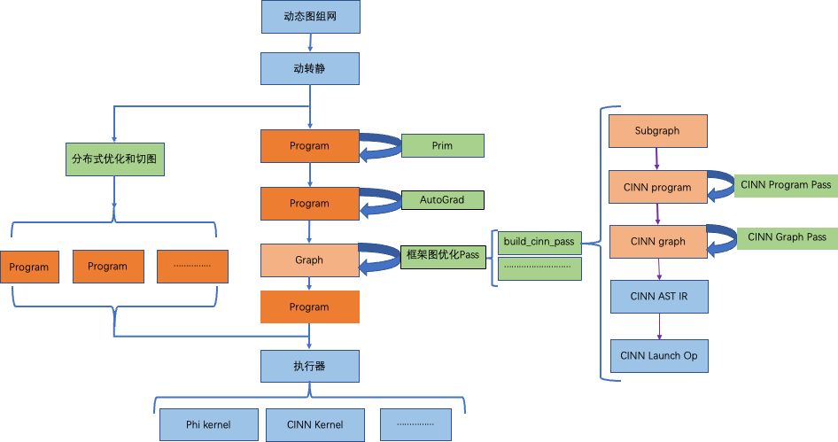
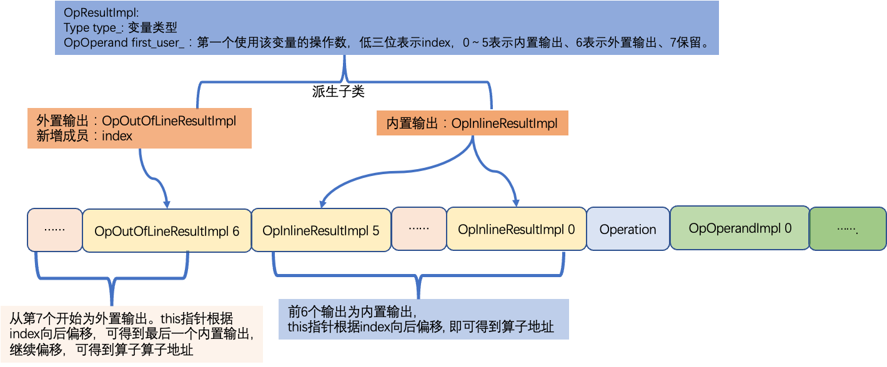
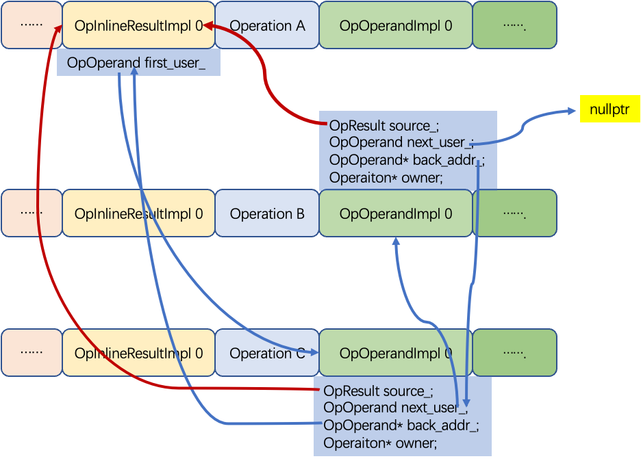

# IR 顶层模型结构表示设计文档
> 本文文档作者： @winter-wang

- [IR 顶层模型结构表示设计文档](#ir-顶层模型结构表示设计文档)
  - [一、IR 升级概要](#一ir-升级概要)
    - [1. 相关背景](#1-相关背景)
    - [2. 功能目标](#2-功能目标)
    - [3. 方案要点](#3-方案要点)
      - [3.1 可扩展基础组件](#31-可扩展基础组件)
      - [3.2 模型表示层](#32-模型表示层)
      - [3.3 图变换](#33-图变换)
  - [二、设计思路与实现](#二设计思路与实现)
    - [2.1 计算图](#21-计算图)
      - [2.1.1 Attribute](#211-attribute)
      - [2.1.2 变量](#212-变量)
      - [2.1.3 算子](#213-算子)
      - [2.1.4 权重](#214-权重)
    - [2.2 算子类型信息](#22-算子类型信息)
      - [2.2.1 Trait 和 Interface](#221-trait-和-interface)
      - [2.2.2 算子类型信息](#222-算子类型信息)
    - [2.3 算子定义](#23-算子定义)
    - [2.4 模型结构](#24-模型结构)
    - [2.5 别名算子处理](#25-别名算子处理)
      - [2.5.1 最大化 `v_tensor` 使用](#251-最大化-v_tensor-使用)
      - [2.5.2  `inplace` 算子的优化处理](#252--inplace-算子的优化处理)
- [附录](#附录)
  - [一、竞品对照](#一竞品对照)
    - [1.1 Oneflow](#11-oneflow)
    - [1.2 TorchMLIR](#12-torchmlir)
    - [1.3 MLIR 对大参数的处理方式](#13-mlir-对大参数的处理方式)


## 一、IR 升级概要
### 1. 相关背景
> 详见 [IR 底层基础类型系统设计文档](./basic_concepts.md#1-相关背景)


<p align="center">

</p>

上图为当前框架的 IR 状态图。上图中：
1. 偏橙色的方块表示框架中的 IR 数据结构：目前包括 `Program`、`Graph`、`CINN Program`、`CINN Graph`。
2. 偏绿色的方块表示框架中的广义 `Pass` ：目前包括 添加反向、分布式优化切图、组合算子拆分、框架图优化 `Pass`、`CINN Program Pass`、`CINN Graph Pass`等等。

目前因为 IR，导致的主要问题包扩：
1. 代码复用性问题：
   + 两种场景 Paddle 和 Cinn 。很多功能相能相同 `Pass` ，需要重复开发两次（`ConstantFold`、`CSE`等等）。
   + IR 元素和具体的场景强绑定在一起，场景无关逻辑无法复用。
2. 框架稳定性问题：
   + 目前的 paddle 模型结构 `Program` 存在序列式 IR 的隐式依赖。所有可能破坏算子顺序的模块，都是不完备的，都是存在风险的。
   + 在 `Pass中` ，图变换会对算子进行增删移动，改变算子顺序。因此，`Pass` 是存在风险的。
   + 新执行器中，会对算子进行多流并行调度，相当于改变了算子的顺序。因此，执行器也是存在风险的。
   +  .....................

目前 Paddle 的做法是将用户发现的反例，以硬编码的方式，进行临时解决。但没有规范的机制，这类问题永远不会收敛。
1. IR 能力不足：
   + 框架对 IR 元素的抽象相对都比较朴素，表达能力不足。
   + 没有规范的类型系统，无法支持 `List` 、`Dict`等复杂类型，以及更近一步的类型嵌套表示。
   + 缺乏严谨的 `Tensor` 别名机制。目前可以通过输入&输出同名来标志 `inplace` 算子，但是对于 `share_date` 、`reshape` (编译器算子)...这类`view` 类的别名算子是无法表达的。
   + 计算图不符合 `SSA` 原则。编译器领域的很多成熟的优化理论无法直接应用。
   + ....................
2. `Pass` 的开发难度和维护陈本高
   + `Graph` 里面内嵌了 `Program` 。为保证一致性，在 `Graph` 上做图变换 `Pass` ， 还需要同步修改内嵌的 `Porgram` 数据结构。开发难度高。
   + `Op` 和 `Var` 被同时抽象为了 `Graph` 的节点（ `Op` 为点，`Var` 为边更加合理），进一步加大了图变化的复杂度。
   + ...................


随着深度学习技术发展，框架遇见的应用场景和优化技术会越来越多。存量是有限的，但可能的增量是无限的。因此，我们调研了业界的最新 IR 实现方式，借鉴了一些优秀的设计思想，结合了 paddle 的当前IR状态。设计本方案对 IR 进行重构升级，在系统性解决历史遗留问题的同时，为后续的功能开发提供更好的支持。

对计算图而言，它的核心成员就是变量 (`Value`) 和算子(`Operation`)。目前主框架和编译器分别定义了 `Program` & `Graph` 来描述计算图。
主框架相对历史悠久一点，在 `Program` 中，变量的定义和算子是解藕的，算子通过变量名(`字符串`)简接关联到变量。一方面，`计算图有环`。另一方面，效率也不高，要想知道一个变量都被哪些算子关联了，就必须遍历 `block` 中所有算子的所有输入输出，进行字符串比对。在 `Graph` 中，一方面，变量和算子被同时抽象为了计算图节点，这增加了图优化的复杂度。另一方面，`Graph` 内嵌了 `Program` ，图优化不仅要处理图节点的UD链，还得处理图节点内嵌的 `OpDesc` & `VarDesc` 的 `UD链`，进一步增加了图优化的复杂度。编译器相对前沿一些，它的 `Grpah` 里面没有内嵌 `Program` 。 它也严格明确了，计算图中算子为节点，变量为边。

MLIR 的出现证明了可以用一套数据结构同时满足 `Graph` 和 `Program` 的功能，解决 `Program` & `Graph` 的二者同步问题。本文中，我们参考 MLIR 的设计思想，重新对 `Paddle` 的计算图进行抽象，确保新的设计能够由多方共用且优于当前。

对算子类型信息而言，它的本质上是对相同类型的算子所具有的公共性质的抽象。比如所有的 `Conv2d` 算子共享同一个 `InferShape` 函数，那么该 `InferShape` 函数就应该是 `Conv2d` 的算子类型信息的一部分。

在主框架中，通过 `OpInfo` 对算子类型信息进行抽象。`OpInfo` 里面包含了 `OpCreator`、`GradOpMakerFN`、`CompositeGradOpMakerFN`、`InferShapeFN` ... 等成员变量指明类型信息。`这里面存在的问题`是：不同类型的算子，它们的类型信息并不是完全一致的，比如只有一部分算子存在反向类型。 `OpInfo` 被实现为了所有类型的算子类型信息的并集。对具体的单独某种类型算子而言，它的 `OpInfo` 中，只有一部分信息是有效的。随着算子种类的增加以及场景的增加， `OpInfo` 结构体会越来越臃肿，但单个 `OpInfo` 对象所包含的信息并没有增加。

在编译器中，首先会对所有算子类型附一个 `uint32_t` 变量表示索引。  然后在全局维持了一个哈希表对算子类型信息进行抽象。key 是`infershape`、 `inferdtype`、 `inferlayout`、`CINNStrategy`、`OpPattern`等信息描述， value 是 `vector<any>`，表示所有类型的算子类型的该信息组成的数组。

比如假设 `conv2d` 的 `index` 是 128，那么 `conv2d` 的 `infershape` 函数是存储在哈希表的 `infershape` 对应的数组的第128个变量。和主框架类似，这种方式也存在空间浪费问题。比如假设全局定义了 200 个算子，那意味着哈希表的几乎每个 `value` 都是一个 size 为 200 的 `vector<any>` ， 而200个成员里面，只有一部分是真正有意义的。

如果要用一套 IR 统一主框架和编译器，那个不管是算子的数量、还是算子类型信息的种类，都是急剧增加，如果继续使用主框架或者编译器的这种抽象方式，显然是不合适的。

别名算子是指会产生多个 `tensor` 对应同一个底层 `buffer` 的算子。一种常见的情况是 `inplace` 算子或者参数更新算子(`sgd`)，它的输入输出对应同一个 `tensor` 。除此之外，在 paddle 还存在 `share_data` 这种 `view` 类算子。编译器中的 `reshape` 也类似

### 2. 功能目标

<p align="center">

</p>

本次 IR 重构升级的功能目标，主要分为以下四个方面。
1. 统一 IR 体系，共享开发成果。
   + 开发 IR 基础库， 置于 Paddle 库的最底层， 里面的开发成果可由所有场景共享。
   + IR 库会对 `Interface` 、`Trait`、`Type`、`Attribute`、`Op`、`Porgram`等 IR 组件从具体场景中剥离出来，进行系统性的抽象。
     + 新 IR `Program` 可以逐步替换当前框架中的 `Program`、`Graph`、`Cinn Program`、`Cinn Graph`。
     + ...................
   + 具体场景无关的代码逻辑可置于 IR 库中，由上层各场景共享。
     + `ConstFold`、`CSE`等具体场景无关的Pass，可在IR库中只实现一次，由所有场景共享。
     + ....................

2. 规范 IR 结构，系统性解决历史遗留问题，增强框架的稳定性。
   + 新IR会参考编译器对指令重排的设计实现，通过Trait对值语意（ValueSemantics）进行规范的抽象，明确约束算子乱序的条件和范围，保证框架的稳定性。
   + .............................

3. 增强 IR 能力，支持更多优化。
   + 新 IR 对类型进行规范抽象，支持`List`、`Dict`等复杂类型，以及更近一步的类型嵌套表示。
   + 新 IR 会通过定义相应的`Trait`，  对 `inplace` 算子以及 `View` 类算子进行合理的抽象描述。
   + 新 IR 的计算图严格遵守 `SSA` 原则。可以应用很多编译器方向的优化理论。
   + ...................................
4. 基于新 IR，优化 `Pass` 写法，降低开发难度和维护成本。@推理部署方向
   + IR 基础库会抽象出一套 `Pass` 基础组件，降低 `Pass` 的开发难度以及维护成本。


### 3. 方案要点
本方案在设计时，很多地方借鉴了 MLIR 的设计思想，读者有兴趣，可以通过阅读 MLIR 相关文档，增进理解。


<p align="center">

</p>


如上图所示，IR的整体设计自底向上分为三层。

#### 3.1 可扩展基础组件
1. `Trait` 和 `Interface`
   + `Trait` 用来对特征进行抽象。 比如 `InplaceTrait` 表示一个 `Op` 具有 `Inplace` 特征， `ReadOnlyTrait` 表示一个算子具有只读特征， `ValueSemanticsTrait` 表示一个算子具有值语意特征；
   + `Interface` 用来对接口进行抽象，它表示算子定义了某些函数接口，比如 `InferShapeInterface` 表示一个算子定义了 `InferShape` 函数接口、 `GradInterface` 表示一个算子定义了构造反向的函数接口。
   + 这二者都是可以任意扩展的，只要派生自相应的基类、遵循相应的实现规则即可。

2. `Type`、`Attrbute`、`Op`
   + `Type` 用来对类型进行抽象，比如 `TensorType` 、`Fp32Type` 等等。它不具有值的概念，比如 `Fp32Type` ，它表示一个变量的类型是 `Float32` ，但是具体值是未知的。
   + `Attribute` 是对一个具体的常量进行抽象，它是包含了具体的值的。比如 `Fp32Attr` ，用户是可以获取到它对应的数值是多少。
   + `Op` 是对算子进行抽象。比如 `ConvOp` 、`ReluOp` 等等。它通过 `yaml` 文件进行定义，`yaml` 文件中会列举改 `Op` 的输入&输出&属性的约束，以及它所支持的 `Trait` 和 `Interface` 。IR会通过 `python` 脚本自动生成相应的 C++ 算子定义。
   + 这三者是基于 `Trait` 和 `Interface` 进行定义的。它们会对关联自己所拥有的相应 `Trait` 和 `Interface` 。 比如 `ConvOp` 会关联 `InferShapeInterface` 、`GradOpInterface`、`ReadOnlyTrait`、`ValueSemanticsTrait`等特征和接口， `Relu_Op`则只会关联`InferShapeInterface`、`GradOpInterface`、`InplaceTrait`等特征和接口。
   + 这三者也是可以任意扩展的，只要派生自相应的基类、关联相应的 `Trait` 和 `Interface` ， 遵循相应的实现规则即可。

3. `Dialect`
   + `Dialect` 用来对 `Type`、`Attribtue`、`Op`做模块化管理， 比如 `BuiltinDialect`、`PaddleDialect`、`CinnDialect`等等。一个`Dialect` 里面包含了一系列的` Type`、`Attribtue`、`Op`的定义。相应的，每个 `Type`、`Attribtue`、`Op`都是定义在某个唯一的 `Dialect` 里面。对整个 IR 框架而言， `Dialect` 是可以随意插拔的。
   + `Dialect` 也是可以任意扩展的。只要派生自相应的基类、定义所以所拥有的 `Type` 、 `Attrbute` 、`Op` 即可。

这一层是 `IR `适应多种场景的基础。这一层的每一个要素都是可定制化扩展的，一般情况下，针对一个具体的场景，比如分布式、编译器。都需要定义自己需要用到的`Trait`、`Interfce`，然后定义自己的`Dialect`，在自己的`Dialect`里面，定义自己需要用到的` Type`、`Attribute`、`Op`。

#### 3.2 模型表示层
1. `Program` 用来表示一个具体的模型。它包含两部分：`计算图` 和 `权重` 。
2. `Weight` 用来对模型的权重参数进行单独存储，这也是深度学习框架和传统编译器不一样的地方。传统编译器会将数据段内嵌到程序里面。这是因为传统编译器里面，数据和代码是强绑定的，不可分割。但是对神经网络而言，一个计算图的每个 `epoch` 都会存在一份权重参数，多个计算图也有可能共同一份权重参数，二者不是强绑定的。
3. `Value`、`Operation` 用来对计算图进行抽象
   + `Operation` 表示计算图中的节点。
     + 一个 `Operation` 表示一个算子，它里面包含了零个或多个 `Region` 。
     + `Region` 表示一个闭包，它里面包含了零个或多个 `Block`。
     + `Block` 表示一个符合 `SSA` 的基本块，里面包含了零个或多个 `Operation` 。
     + 三者循环嵌套，可以实现任意复杂的语法结构。
   + `Value` 表示计算图中的有向边，他用来将两个 `Operaton` 关联起来，描述了程序中的 `UD链` 。
     + `OpResult` 表示定义端，定义了一个 `Value` 。
     + `OpOperand` 表示使用端，描述了对一个 `Value` 的使用。

#### 3.3 图变换
图变换表示对一个 `Program` 进行优化，将其转换为另一个 `Program` 。里面包含了我们遇见的所有 `Pass` 。包括 `Mapping``、Fusion`、`Pruning`、`Canonalization`、`CSE`等等。


## 二、设计思路与实现

坚持 SSA 设计原则，保证模型结构有向无环，一方面可以让 paddle 模型对齐竞品，另一方面，当前很多成熟的编译器优化理论都是基于 SSA 的，而深度学习框架也在逐步向编译器考虑，这可以让后续的很多优化做的更加顺畅。

IR 中很多对象是一次构造，多次引用。常规做法是构造一次，然后通过指针的方式进行引用。
比如 `OpInfo` ， 目前 Paddle 是在算子注册的时候，构造一个 `OpInfo` 对象，然后在相应的 `OperatorBase` 里面包含了 `OpInfo` 指针作为成员变量。

本文大部分场景采用 `Pimpl` 设计模式。将具体实现对象封装在 `Impl` 数据结构中。
采用这种设计模式的数据结构包括 `Type`、`Attribute`、`OpInfo`、`OpResult`、`Value`、`OpOperand` 等等，它们自身都只包含一个 `impl` 指针，可以快速浅拷贝。真正的实现对应 `TypeStorage` 、`AttributeStorage`、`OpInfoImpl`、`OpResultImpl`、`ValueImpl`、`OpOperandImpl`。其中， `Impl` 不会对用户暴漏，但是 `Storage` 会。

这种实现方式的好处在于：
* · 实现部分保持独立，后续可以随意重构升级，不影响其它模块。
* 接口部分只包含一个指针，可以高效率拷贝。

### 2.1 计算图

计算图的有向边是变量(`Value`)，节点是算子(`Operation`)。算子信息分为四部分：输入(`OpOperandImpl`)、输出(`OpResultImpl`)、属性(`Attribute`)、类型信息(`OpInfo`)。

> 变量提供一个具名的、可供程序操作的存储空间。C++中每个变量都有其数据类型，数据类型决定着变量所占内存空间的大小和布局方式、该空间能存储的值的范围，以及变量能参与的运算。    ----《C++Primer(第5版)》

输出和输入分别表示对变量的定义和使用，变量必须先定义后使用。属性表示编译时常量。
如果一个算子的某个参数既有可能是常量也有可能是变量，那我们应该将其定义为输入。当遇见该参数为常量的场景时，可通过插入一个 `ConstOp` （0输入、1属性、1输出）将常量转换为变量。

1. 问：既然可以通过 `ConstOp` 将常量转换成变量，是不是就没必要定义属性来描述常量了？

    答：首先， `ConstOp` 没有消除常量，它只是将常量移动到了自己内部而已。 其次，这种移动是有代价的，代价就是图中新插入了一个常量算子，增加了计算图的复杂性。

2. 问：如何处理升级问题？

    答：我们在新 IR 的接入过程，会统一进行一次不兼容升级，将当前的所有 `op` 定义中的可变 `Attribute` 统一更改为 `Input` 。对于后续的将 `Attribute` 升级为 `Input` ，采取定义新算子的方式进行升级。

类型信息是指对于同类型算子而言，一定完全一致的信息。 显然，这类信息应该是只读的，而且生命周期也要比单个算子的生命周期更加永久。 因此，由 `IRContext` 负责 `OpInfoImpl` 的创建和回收，算子自身只需在构造时，接受 `OpInfo`（`OpInfoImpl`指针）作为参数即可。

#### 2.1.1 Attribute

首先，我们用 `Attribute` 来描述一个属性。在此之上，派生出各种类型的属性，比如 `StrAttribute` 、`DictionaryAttribute`等等。

对目前的 paddle 主框架而言，`OperatorBase` 包含了两个`hash_map<string， Attribtue>`用来描述算子属性，一个是必要属性， 另一个是运行时属性;
在新 IR 中，我们将两个哈希表合为一个，抽象为 `DictionaryAttribiute attrs`。
但是我们会在算子类型信息( `OpInfoImpl` )中，存储一个属性名列表(`vector<string>`)，用来记录该类型算子都包含哪些必要属性（注：必要属性名是有顺序的， 可通过该顺序跟算子库函数签名对齐）。

算子的属性检查只会根据定义针对必要属性。用户可以在算子中临时存储一些运行时属性，但是运行时属性只能用来辅助计算，不允许改变计算语意。模型在导出时，默认会裁剪掉所有的运行时属性。

我们采用和类型系统一致的方式对属性进行实现。此处只对数据结构进行简要描述，读者有兴趣可以参考[《IR 底层基础类型系统设计文档》](./basic_concepts.md)来了解详细设计思路及实现方式。

定义 `Attribtue` 结构体描述一个具体的属性对象。里面包含一个 `AttributeStorage` 作为该属性对象的真实存储对象，该存储对象由 `IRContext` 负责管理。
```cpp
class Attribute {
  //其它接口省略
  AttributeStorage* impl{nullptr};
};
```


定义工具类 `AttrBase` 将 `ConcreteAttribute` ，` BaseAttribute`， `StorageAttribute`关联起来：

```cpp
// AttrBase用来将ConcreteAttributeType, BaseAttributeType, StorageAttributeType关联在一起
template <typename ConcreteT, typename BaseT, typename StorageT>
class AttrBase: public BaseT {
  public:
    using ImplType = StorageT;
    /// Utility for easy access to the storage instance.
    ImplType *getImpl() const { return static_cast<ImplType *>(this->impl); }
}
```

对每种 `Attribtue` 类型，需要首先在 `AttributeStorage` 基础上派生它的存储对象。
比如定义要定义 `StrAttibute` ， 先定义 `StrAttributeStorage` :
```cpp
class StrAttributeStorage : public AttributeStorage{
   // 该内存对象由IRContext负责开辟和回收。
   char* data;
   uint32_t size;
}
```

然后定义 `StrAttribute` :
```cpp
class StrAttribute : public AttrBase<StrAttribute, Attribute, StrAttributeStorage> {
  static StrAttribute get(::mlir::MLIRContext *context, const std::string& str);
  static StrAttribute get(::mlir::MLIRContext *context, const char* str);
  std::string getValue() const;
}
```
注意，由于 `Attribute` 的内存统一由 `IRContext` 管理，多个场景公用。因此，对于单个 `Attribtue` 而言，它的底层内存是只读的。用户不能修改 `StrAttribtue` 的具体值。
我们用类似的方式来定义 `DictionaryAttr` :  因为 `DictionaryAttrStorage` 是只读的，不存在插入和删除，因为我们用数组的方式进行构造，用二分法进行查找。
```cpp
class DictionaryAttributeStorage : public AttributeStorage{
   // 该内存对象由IRContext负责开辟和回收。
   // data按照关键字排序，当访问具体的Attribtue时，可用二分法对关键字进行搜索。
   std::pair<StrAttr, Attribute>* data;
   uint32_t size;
}；
class DictionaryAttribute : public AttrBase<DictionaryAttribute, Attribute, DictionaryAttributeStorage> {
  static StrAttribute get(::mlir::MLIRContext *context, const std::vector<std::pair<StrAttr, Attribute>>& str);
  Attribute getValue(StrAttr attr) const;
}
```

#### 2.1.2 变量

事实上，根据 SSA 原则，变量都存在唯一的算子对其进行定义。那么将信息存储在变量里，和存储在定义该变量的算子里，都可以实现信息存储的功能。举个简单例子：

当前 paddle 的模型里面需要提供一个 `stop_gradien` 接口，表示在此变量处，停止反向梯度计算。
如果采用将信息存储在变量里，那么就需要在变量( `Value` )里新增一个 `stop_gradient_` 布尔变量。 `stop_gradient` 接口的实现会将该布尔变量置为True。
如果采用将信息存储在算子里，那么可以在定义该变量的算子里，插入一个临时 `Attribute` 属性，key为 `stop_gradient` ， `value` 为 `vector<bool>`，对应的输出的下标的值为 True。

不管是当前框架的 `persistable` 、`need_check_feed`、`is_parameter`、`stop_gradient`标记、还是分布式专用的一些属性，都只是在某些特定场景下有意义。如果把这些信息都存储在变量里，那`“变量”`这个数据结构的尺寸会越来越大，这对于不需要用到该信息的场景是不友好、不安全的。

因此，本方案明确限定，只有在所有场景下都有意义的信息，才可以存在`“变量”`中。除此之外的所有其它信息，都通过新增算子或者给算子增加运行时属性的方式存储到相应的算子里。基于此原则，变量作为图的有向边，当前只存储两种信息：
* 自身类型：能够获取到该自身的 `Type`。
* `UD(Use-Definition)链`：用来关联算子，能够通过接口获取到定义该变量的惟一算子，以及使用该变量的算子列表；

由算子负责自己定义的变量的生命周期，算子在构造的时候，同时构造自己定义的变量（`ValueImpl`）。在析构的时候，同步对变量进行销毁。

本方案使用 `ValueImpl`、`OpResultImpl`、和` OpOperandImpl` 分别对变量、输出、输入进行抽象。它们的生命周期跟具体的算子(`Operation`)相绑定，由 `Operation` 创建&销毁的时候同步创建&销毁。 同时，将其指针封装为 `Value` 、`OpResult`、`OpOperand`数据结构，方便外部使用。

考虑到 `OpOperandImp` l(里面只包含4个指针)是 8 字节对齐的，因此 `OpOperand` 的低三位一定为 0，因此，我们用低三位来存储 `index` 。为了支持输出个数大于 8 的算子，我们将输出分为内置输出(`OpInlineResultImpl`)和外置输出(`OpOutOfLineResultImpl`)， 外置输出额外新增整型成员 index 表示下标。对 `OpResultImpl` 而言，低三位在`0～5`之间，表示该输出的真实类型是内置输出，为 6 表示该输出的真实类型是外置输出，7 保留，方便以后扩展。

<p align="center">

</p>

`ValueImpl` 的定义：
```cpp
class ValueImpl {
  protected:
    // 只允许通过派生类来构造
    ValueImpl::ValueImpl(Type type, int32_t index_): type_(type), first_user_(nullptr), index_(index){}
    // 获取该变量的index，只允许派生类调用
    int32_t index();
    Type type_；// 变量的类型。
    // OpOperandImpl一定是8字节对齐的，因此OpOperand低三位一定为0。低三位用来表示index_
    // index_ 0～5表示前六个输出， 6表示第七个以及第七个之外的输出， 7保留，留作扩展。
    OpOperand first_user_;//第一个使用该变量的输入。
}；
class Value {
   private:
     ValueImpl* impl;
};
```

OpResultImpl 定义：
```cpp
class OpResultImpl:public ValueImpl{};

class OpInlineResultImpl: public OpResultImpl{}；
class OpOutOfLineResultImpl: public OpResultImpl{
  private:
    // 新增index_成员变量，因为此时，基类ValueImpl里面的index一定为6.
    uint32_t index_;
}；
// OpResult表示Op的输出，可以随遇拷贝
class OpResult : public Value {};
```

对输入而言，`OpOperandImp` 除了需要包含变量的定义，还需要维持该变量的`使用链`。注意 `OpOperandImpl` 里面不需要显式记录 `index` ， 因为它显式记录了 `owner` 算子。可通过 `this` 指针跟 `owner` 算子的偏移，计算出它的 `index` 。
下图表示算子A的第一个输出被算子 C 和算子 B 用作输入。

<p align="center">

</p>


`OpOprand` 的定义如下：
```cpp
class OpOperandImpl{
  private:
    OpResult   source_;  //该输入使用的变量。
    OpOperand  next_user_; //使用同来源的下一个操作数。
    OpOperand* back_addr_; // 使用同来源的上一个操作数的地址。
    Operation*  owner_;
    // 构造函数私有
    OpOperandImpl::OpOperandImpl(OpResult source,Operation* owner): source_(source), owner_(owner){
        back_addr_ = &source->first_user_;
        next_user_ = source->first_user_;
        if(next_user_) {
           next_user_->back_addr = &next_user_;
        }
        source->first_user_ = this;
    }
};
class OpOperand {
    OpOperandImpl * impl_;
};
```

#### 2.1.3 算子

`Operation` 的对一个算子的具体描述，目前来说，它主要涉及到四个成员： 输入、输出、属性以及类型信息。
其中，输入和输出的数量因为在构造的时候才能确定，而且构造完以后，数量就不会再改变。因此，在开辟 `Operation` 的时候，额外多开辟内存，前面存放输出，后面存放输入。
属性是一个 `DictionaryAttribute` ，它和类型信息（ `OpInfo` ）一样，都是指针的封装，我们只需要作为成员变量即可。

<p align="center">

</p>

`Operation` 的定义：
```cpp
class Operation {
  public:
  // 创建一个算子.
  static Operation *create(const std::vector<OpResult>& inputs, const std::vector<Type>& output_types,
                           DictionaryAttribute attrs, OpInfo info) {
    // 先通过malloc函数开辟 输入、输出以及Operation所需的内存
    // 然后再每个位置显式构造对象
   }
  destry(Operation * op) { // 析构算子，释放内存}
  private:
      Operation(...); // 构造函数私有
      ～Operation();  // 析构函数私有
      // 属性。
      DictionaryAttribute atts_;
      // 算子类型信息
      OpInfo info_;
      // 输出个数
      uint8_t num_results_;
      // 输入个数
      uint8_t num_operands_;
}
```

我们将 `Operation` 指针进一步装饰为 `OpBase` ， 方便做具体算子的基类。以及实现从` Operation*` 到具体 `Op` 的转换。

`OpBase` 的定义：

```cpp
class OpBase {
  public:
    // 能够隐式转换为Operation*.
    operator Operation *() const { return operation_;  }
    // 重载 ->运算符.
    Operation *operator->() const { return operation_; }
  protected:
    explicit OpBase(Operation * operation) : operation_(operation) {}
  private:
    Operation * operation_;
}
```

#### 2.1.4 权重

权重属性是一种特殊的属性，它跟其它属性的不同在于，其它属性可以直接编码到模型内部，直接根据属性值进行哈希计算以及判等。
但是权重属性的数据量一般会非常大，直接根据权重值进行哈希或者判等的效率显然是非常低的。
我们沿用 paddle 的一贯做法，将权重单独存储，在模型中通过权重名对权重值进行获取和保存。

我们在每个模型中，维护一个哈希表： `hash_map<StrAttribute， Variable*>` 来表示该模型对应的权重值。 用户可以通过接口在此哈希表中插入、删除、访问、修改相应的 `Variable` 。
Variable类似于paddle中的Varibale， 它包含：
1. `Type  type_`：表明 `Variable` 的类型；
2. `void*  data_`:   指向具体的数据；
3. `bool is_mutable_`: 表明数据是否会在模型的执行当中被改变；
4. 数据的大小、对齐等等其他性质。

对于模型中的对权重的使用，我们定义 G`etParameterOp`、`SetParameterOp`。分别从相应模型的哈希表中， 获取、设置相应的权重内容。
其中， `GetParameterOp`接受一个字符串作为属性，意义是从该模型的哈希表中加载该字符串对应的属性，并将其转换为输出。
`SetParameterOp` 接受一个字符串作为属性，一个张量类型的输入，没有输出。 表示用该属性和张量组成的键值对更新模型权重哈希表。

相应的，在模型组网的时候，我们需要在 `startup program` 中插入相应的 `SetParameterOp` ， 而在 `main program` 中插入相应的 `GetParameterOp` 。 我们通过将 `starpup program` 执行完得到的参数哈希表移动给` main program`，来实现两个 `program` 的通信。对于模型的任何参数（比如学习率等），只要我们想要在权重文件中存储该值，那就应该在相应的位置插入 `Get/SetParameterOp` 。后期如果有必要，我们也可以定义 `Get/SetCombineParameterOp` 等，一次性加载&存储大批量权重。

当模型导出的时候，会将模型中的哈希表存储为权重文件，算子列表存储为模型文件。当从文件中初始化模型的时候，会将所有的 `Variable` 的 `isMutable` 设为 `False` ， 然后遍历模型中的所有算子，遇见 `SetParameterOp` 的时候，就将相应的 `isMutable` 设为 `True` 。 对于 `Pass` 而言，对于权重，可以通过访问相应的 `isMutable` 来判定是否可以将该 `Parameter` 当作常量进行变换。

以 `conv+bn` 的融合为例，在推理场景下，模型中不存在反向算子， `conv` 和 `bn` 的权重对应的 `isMutable` 是 False ，可以融合。
但是在训练场景下，`conv` 和 `bn` 的权重都会在每一次执行当中进行更新，因此，`conv` 和 `bn` 的权重对应的 `isMutable` 是 `True` ，不可以融合。

### 2.2 算子类型信息

#### 2.2.1 Trait 和 Interface

特征(`Trait`)和接口(`Interface`)用来对算子进行另一维度的划分。 是对算子所拥有的类型信息的抽象描述。

比如我们用 `ReadOnly` 特征来描述一个算子不会修改它的输入操作数。这个信息对图优化和并行调度很重要。
有些算子具有 `InferShape` 函数，有些则没有。可以通过 `InferShape` 接口来标志算子是否存在 `InferShape` 函数。
再比如，有些算子有反向算子构建函数，有些则没有。可以通过 `GradOpMaker` 接口来标志算子是否存在 `GradOpMaker` 函数。
在当前的 Paddle 中， `OpInfo` 包含了很多接口，比如 `GradOpMakerFN` 、`InferVarTypeFN`、`InferShapeFN`、`InferInplaceOpFN` 、`InferNoNeedBufferVarsFN` 等等。但实际上，每一项信息只是针对某些算子有效。把它们全部以成员变量的形式放在 `OpInfo` 结构体，意味着我们可能只是想要给某几个算子类型增加的一个接口信息，却导致所有的算子类型都增加了一块内存占用。

因此，我们将这些信息统一抽象为接口，然后在 `OpInfo` 里面包含一个 `InterfaceMap` ；由具体算子在定义的时候决定自己都包含了哪些接口，进而构造对应的`InterfaceMap`。这样后续针对特定算子的接口扩展就不会对其它算子造成影响。

特征和接口的区别在于：
+ 特征的相关接口实现跟具体算子无关，不需要多态，它对相关算子的接口没有要求，比如 `ReadOnly` ，只是通知使用者，该算子不会修改它的输入的值。
+ 而接口的实现，是跟具体算子类型相关的，需要考虑多态，比如 `InferShape` 接口，是强行要求了相应算子一定定义了 `InferShape` 接口。

之所以区分特征和接口，也是从实现上考虑:
+ 特征的实现比较简单，我们用 `TraitId` 对每个特征进行标志，最简单的方式，可以在 `OpInfoImpl` 中，包含一个 `vector<TraitId>` 。来判断该算子是否具有某个特征即可。
+ 接口的实现则较为复杂，需要根据具体的算子类型的不同，实现多态。

特征和接口的使用比较类似：
```cpp
Operation* op = ...;
// 特征的使用
if(op->hasTrait<ReadOnlyTrait>()) {
    // dyn_cast的实现，是根据Operation里面的OpInfo，获取信息
    ReadOnlyTrait trait = op->dyn_cast<ReadOnlyTrait>();
    // 可以据此做一些优化
    .....
}

// 接口的使用
if(op->hasInterface<InferShapeInterface>()) {
  // dyn_cast的实现，是根据Operation里面的OpInfo，获取信息
  InferShapeInterface interface = op->dyn_cast<InferShapeInterface>();
  // 该InferShape会实现静态多态。
  interface.InferShape();
}
```

我们在 `OpBase` 的基础上分别派生出模版类 `OpTraitBase` 和 `OpInterfaceBase` 作为所有特征和接口的基类。

<p align="center">

</p>

特征不需要具体的类型参数，直接派生即可。可在 `OpTraitBase` 里面定义一些通用接口。
```cpp
using TraitId = TypeID;
template<class ConcreteTrait>
class OpTraitBase : public OpBase{
    // 所有Trait的模版基类
public:
    OpTraitBase::OpTraitBase(Operation* op): OpBase(op){}
    TraitId getTraitId () {return TraitId::get<ConcreteTrait>();}
};

// Trait的定义
class ReadOnlyTrait: public OpTraitBase<ReadOnlyTrait>{};
```

接口的实现需要具体的算子类型作为模版参数。因此，我们需要在具体的接口中定义 `Impl` 接口体对该接口所涉及到的具体算子相关接口进行描述。然后定义以具体算子类型为模版参数的 `Model` 类对 `impl` 进行赋值。

> 注：基于 concept-model 实现运行时多态，是c++模版编程的一种常见用法，读者有兴趣可阅读
《Value Semantics and Concepts-Based Polymorphism -- Sean Parent》


```cpp
using InterfaceId = TypeID;
template<class ConcreteInterface>
class OpInterfaceBase : public OpBase{
    // 所有Interface的模版基类
public:
    InterfaceId getInterfaceId () {return InterfaceId::get<ConcreteInterface>();}
prtotected:
    ConcreteInterface::Concept* impl_;
    OpInterfaceBase::OpInterfaceBase(Operation* op, ConcreteInterface::Concept* impl): OpBase(op), impl_(impl){}
};
// 需要具体算子类型的特征类，必须定义Impl结构体
class InferShapeInterface : public OpInterfaceBase<InferShapeInterface>{
   struct Concept {
      void(*infer_shape_) (Operation*);
   };
   //不允许定义新成员，不允许自定义析构函数
   template<class ConcreteOp>
   struct Model: public Concept{
       Model():Concept(InferShape){
           assert(sizeOf(Model) == sizeOf(Concept));
       };

       static void InferShape(Operation* op) {
           ConcreteOp concret_op = dyn_cast<ConcreteOp>(op);
           assert (concret_op != nullptr);
           concret_op.InferShape();
       }
   };

   void InferShape() {
       impl_->infer_shape_(operation_);
   }
   InferShapeInterface(Operation* op, Concept* impl): OpInterfaceBase(op,impl){};
};
```

#### 2.2.2 算子类型信息

算子类型信息（`OpInfoImpl`），本质上是对相同类型的算子所具有的公共性质的抽象。如下是主框架现有的 `OpInfo` 定义：
```cpp
class OpInfo {
 public:
  OpCreator creator_;
  GradOpMakerFN grad_op_maker_;
  CompositeGradOpMakerFN grad_comp_op_maker_;
  proto::OpProto* proto_{nullptr};
  OpAttrChecker* checker_{nullptr};
  InferVarTypeFN infer_var_type_;
  InferShapeFN infer_shape_;
  InferInplaceOpFN infer_inplace_;
  InferNoNeedBufferVarsFN infer_no_need_buffer_vars_;
  DygraphGradOpMakerFN dygraph_grad_op_maker_;

  // NOTE(zjl): this flag is added to check whether
  // the grad maker is the default one.
  bool use_default_grad_op_desc_maker_{false};

  // NOTE(huihuangzheng): this flag is added to check whether
  // the grad maker is the empty one.
  bool use_empty_grad_op_desc_maker_{false};
  ....
  };
```

与当前主框架的 `OpInfo` 定义不同的是，我们会把 `OpCreator`、`GradOpMakerFN`、`InferShapeFN`、、、等等这些所有的成员都重新抽象为`OpInterface`或者`OpTrait`的派生类型。
然后在`OpInfo`里面包含一个`OpInterfaceMap`和一个`OpTraitSet`，来记录该算子类型所支持的接口和特征。
`OpInfo`提供接口，用来判定相应的`Operaiton`是否支持某个接口和特征。以及，将该算子直接转换为相应的接口和特征进行使用。

主框架当前是需要在注册的时候，显式的把`ConvOp`、`Conv2DOpMaker`、、、等各种信息组合起来，构成一个` OpInfo`。
```cpp
REGISTER_OPERATOR(conv2d,
                  ops::ConvOp,
                  ops::Conv2DOpMaker,
                  ops::ConvOpInferVarType,
                  ops::Conv2DGradMaker<paddle::framework::OpDesc>,
                  ops::Conv2DGradMaker<paddle::imperative::OpBase>);
```

在新 IR 中，我们遵循高内聚的设计原则， 将所有的相关信息都定义在Op内部，以成员函数的方式进行提供。
`OpInfoImpl` 应该是通过以具体算子为模版参数的接口进行构建。
```cpp
template <typename ConcreteOp>
static OpInfoImpl* create();//根据具体的Op， 创建一个OpInfoImpl
```

`OpInfoImpl` 是对具体的 `Op` 类型的相关信息抽象。`OpInfo` 是对 `OpInfoImpl` 指针的封装。
因为不同类型的 `Op` 对应的 `OpInfoImpl` 的接口个数、特征个数、属性个数都是不同的，但都是设置后不会再修改。因此，我们采用类似 `Operation` 的设计方式。将对应的接口、特征、属性名分别置于 `OpInfoImpl` 的前面和后面。

<p align="center">

</p>


```cpp
class OpInfoImpl {
    template <typename ConcreteOp>
    static OpInfoImpl* create();//先开辟内存，然后逐个构造
    void destroy();//回收自身
    bool hasTrait(TypeId traitId);// 二分搜索trait id列表，进行查找
    bool hasInterface(TypeId interfaceId);// 二分搜索interface id列表，进行查找
    // 二分搜索interface id列表，获取相应的void*，然后强转为Interface::Impl*
    template <class Interface>
    Interface::Concept* getInterfaceImpl();
private:
    // 构造函数私有
    std::pair<TypeID, void>* p_interface_; //指向第一个interface的指针
    TypeID* p_trait_;//指向第一个trait的指针
    uint32_t attr_size_; //属性名的顺序
    TypeId type_id_; //对应Op类型的TypeId。
    const char* name_; //op名字
}；
class OpInfo {
    OpInfoImpl* impl;
};
```

当我们注册一个算子类型到 `IrContext` 的时候，通过 `OpInfoImpl` 的 `create` 接口在 `IrContext` 中构建创造一个全局惟一的 `OpInfoImpl` 对象。

### 2.3 算子定义
算子定义的本质是对算子类型信息的描述。可以看作是 `Operation` 和各种特征、接口的组合。我们保持当前的 `yaml` 定义方式。通过 python 脚本生成 C++ 定义代码。但是会对 `yaml` 里面的 `Op` 定义进行调整。当前的 `Op` 定义如下：

```cpp
- op : addmm
  args : (Tensor input, Tensor x, Tensor y, float beta=1.0, float alpha=1.0)
  output : Tensor
  infer_meta :
    func : AddmmInferMeta
  kernel :
    func : addmm
    data_type : x
  backward : addmm_grad
```

主要做以下变更：
* 将 `args` 显式拆分为 `input` 和 `attrs` 。各自都可支持任意类型。
* `infer_meta` 等进一步归纳为 `interface` 和 `trait`

比如 `addmm` 的定义会变更为：

```cpp
op : addmm
    inputs : (Tensor input, Tensor x, Tensor y)
    attributes: (float beta=1.0, float alpha=1.0)
    outputs : Tensor
    interfaces:
        InferShape :
            func : AddmmInferMeta
        Backward : addmm_grad
     traits: (ReadOnly，...)
     Kernel:
         func : addmm
         data_type : x
```

通过 python 脚本，解析 `yaml` 文件，来生成相应的 c++ 类型定义。

算子定义的核心在于：以该算子类型为模版参数，能够配合 `OpInfoImpl::create` 函数构造出 `OpInfoImpl` 对象。我们以 `CRTP` 的形式，定义 `Op` 模版类，用来将具体的 `Op` 类型和相应的 `Trait` 组合起来。 `OpBase` 类存在意义在于防止部分成员函数被多次实例化，`Op` 模版类的存在意义在于减少代码量。

```cpp
// Op最为所有算子的工具基类，用来将算子和它的特征关联起来
// 第一个模版参数为 ConcreteOpType ， 表示具体的算子类型
// 后续的所有模版参数都是该算子所具有的特征和接口。
template <typename ConcreteOp, class... TraitOrInterface>
class Op : public OpBase {
public:
  // 利用TraitOrInterface中是OpTraitBase还是OpTraitInterface的基类，分别拆出TraitList和InterfaceList.
  using TraitList =std::tuple<...>
  using InterfaceList =std::tuple<...>
}

template <typename ConcreteOp>
OpInfoImpl* OpInfoImpl::create(){
   // 根据ConcreteOp中的TraitList和InterfaceList推断出interface列表以及trait列表
   // 然后计算Trait的数量以及Interface的数量，进行内存开辟
   // 然后逐个赋值
}
```

以下为 `ConvOp` 为例，定义具体的 `Op` 定义:

```cpp
class ConvOp: Op<ConvOp, ReadOnlyTrait， InferShapeInterface> {
  // ConvOp包含了InferShapeInterface, 因此，必须定义inferShape成员函数.
  // 在该算子注册的时候，会实例化InferShapeInterface::Strategy<ConvOp>, 如果没有定义inferShape函数，会在编译时报错
  const char* name() { return "conv_2d";}
  static void inferShape();
}
```

```cpp
 class IrContext {
 public:
     template<typename ConcreteOp>
     bool registerOp();
 private:
     std::unordered_map<TypeId, OpInfoImpl*> op_info_map_;
 }

 template<typename ConcreteOp>
 bool IrContext::registerOp() {
     TypeId type_id = TypeId::get(ConcreteOp);
     assert(op_info_map_.find(type_id) == op_info_map_end);
     op_info_map_[TypeId::get(ConcreteOp)] = OpInfoImpl::create<ConcreteOp>();
 }
```

### 2.4 模型结构

`Program` 用来对模型结结构进行抽象。它包括模型的权重和计算图。

目前 paddle 所有模型的权重都是 `Variable` 类型，所以我们用 `std::unordered_map<StrAttribtue, Variable*>` 来表示模型的权重，后期如果有了新的权重类型，可对其进行扩展。当前阶段，我们只是简单的用有序列表 `std::list<Operation*>` 来表示一个计算图。

```cpp
class Program {
    // 模型的参数
    std::unordered_map<StrAttribtue, Variable*> prams;

    // 模型的计算图
    std::list<Operation*> ops;
}
```

在 IR 升级第三阶段（高阶特性）阶段，会对 控制流算子进行详细设计。 引入 `基本块`、`闭包`、`函数`等概念。会对 `Program` 进行更细粒度的描述。

以一个简单的 `fc` 网络为例，当前 `paddle` 的模型结构关键部分如下描述：
```cpp
{ // block 0
    var image : LOD_TENSOR.shape(-1, 784).dtype(float32).stop_gradient(False)
    var label : LOD_TENSOR.shape(784,).dtype(float32).stop_gradient(True)
    persist trainable param fc_0.w_0 : LOD_TENSOR.shape(784, 784).dtype(float32).stop_gradient(False)
    var fc_0.tmp_0 : LOD_TENSOR.shape(-1, 784).dtype(float32).stop_gradient(False)
    persist trainable param fc_0.b_0 : LOD_TENSOR.shape(784,).dtype(float32).stop_gradient(False)
    var fc_0.tmp_1 : LOD_TENSOR.shape(-1, 784).dtype(float32).stop_gradient(False)

    {Out=['fc_0.tmp_0']} = mul(inputs={X=['image'], Y=['fc_0.w_0']}, x_num_col_dims = 1, y_num_col_dims = 1)
    {Out=['fc_0.tmp_1']} = elementwise_add(inputs={X=['fc_0.tmp_0'], Y=['fc_0.b_0']}, axis = 1)
}
```


可以看见，它的 `var` 是抛开 `op` 独立定义的。 `op` 在它的输入输出中通过字符串，对 `var` 进行了引用。在新 IR 中， `fc` 网络的计算图描述如下（只是样板， 后续可能会有微调）：

```cpp
program {
    %0 = pd.feed(){name = "image"}
    %1 = builtin.get_parameter(){name = "fc_0.w_0"}
    %2 = builtin.get_parameter(){name = "fc_0.b_0"}
    %3 = prim.mul(%0, %1){x_num_col_dims = 1, y_num_col_dims = 1}
    %4 = prim.elementwise_add(%3, %2){axis = 1}
    pd.fetch(%4)
 }
```

新 IR 的网络计算图文本描述格式还会微调。但我们可以大概看出，新 IR 不会在计算图中单独定义 `var` 。 变量一定是通过 `op` 进行定义。

### 2.5 别名算子处理

本段所述的别名算子是指算子的输出和输入共享同一个底层内存的算子。

在当前 Paddle 中主要包含两种：

+ 一种是 `inplace` 算子，比如 `relu_` ， 这种算子只改变输入 `tensor` 的值，不改变 `shape` 和 `dtype` .  典型特征以下划线结尾，正常来说，它会有一个函数签名(输入、输出、属性)完全匹配的非 `inplace` 类型算子。

+ 另一种是 `view` 类型算子，比如 `reshape` ， 这种算子不会改变 `tensor` 的值，但是会对底层内存重新进行解释，改变 `shape` 和 `dtype` 。
但本质上，造成的结果是一致的，那就是多个 `tensor` 对应了同一块内存。


本方案会将 `inplace` 算子定义为新的算子， 输入&输出&属性都和原算子一致。但是算子名后跟了下划线，算子特征有所变化。别名算子直接定义即可。
```cpp
class ReluOp: Op<ReluOp, ReadOnlyTrait， HasValueSemanticsTrait, ...>  {...}
class Relu_Op: Op<Relu_Op, InplaceTrait, ...>  {...}
class ReshapeOp: Op<ReshapeOp, ViewLikeTrait, ReadOnlyTrait,...>  {...}
```

`ReadOnlyTrait` 表示该算子不会修改它的操作数（意味着不是 `inplace` 算子）。 `HasValueSemanticsTrait` 比 `ReadOnlyTrait` 更强一层，表示该算子不仅不会修改它的操作数，而且不会给操作数增加别名。（不仅不是 `inplace` 算子，而且不是 `view` 类算子）。`InplaceTrait` 表示该算子是某个算子的 `inplace` 版本，它的算子名一定以下划线结尾，而且去掉下划线，就是算子的非 `inplace` 版本。`ViewLikeTrait` 表示该算子的输出是输入的别名。（目前暂定它的第一个输出是第一个输出的别名，以后可以考虑将其升级为 `Interface` ）


为了处理多个 `tensor` 对应同一块内存这种情况，我们将张量操作数在 IR 上分为两种类型。一种是 `tensor` ， 另一种是 `v_tensor` (`value tensor`)。两种类型的实现完全一致，可以互相构造（即可以通过 `v_tensor` 为参数，构造 `tensor` ; 反之亦然）。可以定义两个工具算子： `to_tensor`， `to_vtensor`实现 `tensor` 和 `v_tensor` 的类型转换（深拷贝）。

但是在 IR 层面来说，我们认为， `v_tensor` 是一个只读的变量， 不存在别名，构造以后底层永远不会改变。而 `tensor` 恰恰相反，表示它是存在别名的，它的底层可能在不被感知的情况下被修改。相应的，如果一个算子它的所有张量输入都是 `v_tensor` ， 那么它的乱序执行，以及图变换都是完备的。（因为输入永远不变，早晚执行都一样）。而如果它的某个张量输入是 `tensor` ， 那么它不能乱序执行，对它的图变换也必须非常保守。（输入是 `tensor` ， 意味着可能存在别的张量和它共享同一个底层，别的张量可能在某个阶段被修改，因此，乱序执行是有风险的。）

对于静态图组网，或者动态图组网，我们都适用 `tensor` 作为相应的输入输出类型。这种网络，虽然也是符合 `SSA` 的无环图，但是它只能按顺序执行，基本不能做什么图变换优化。当组网完成以后，开始做优化。

#### 2.5.1 最大化 `v_tensor` 使用

`Pass 1`: 我们将算子的输入输出由 `tensor` 尽可能的转换为 `v_tensor` 。因为从语意上来说， `tensor` 的执行顺序是不能变的，要想做图变换，必须先尽可能地将 `tensor` 转换成 `v_tensor` 。 这一步主要是根据算子的特征进行分析的，比如：是对于值语意算子，通过插入进行深拷贝的 `to_tensor` 和 `to_vtensor` 算子，对其输入输出转换为 `v_tensor` ：

```cpp
// a、b的类型都是tensor
use(a)
b = conv(a, ...) : (pd.tensor, ...) -> pd.tensor
use(a)
use(b)
```
会被转换为:
```cpp
use(a)
// a1是a的深拷贝，类型是 v_tensor， 只读，不能有别名
a1 = to_vtensor(a): (pd.tensor) -> pd.v_tensor

b1 = conv(a1, ...) : (pd.v_tensor, ...) -> pd.v_tensor

// b是b1的深拷贝，类型转回tensor， 保证后文的类型没有发生变化.
b = to_tensor(b1): (pd.v_tensor) -> pd.tensor
use(a)
use(b)
```

可以看见，通过 `UD链` 的依赖，新的 `conv` 算子的逻辑执行顺序没有发生变化。所以语意是严格正确的。

`Pass 2`:  有条件地将 `to_tensor` 和 `to_vtensor` 算子进行合并消除。对于一个由 `to_tensor` 产生的 `tensor`

```cpp
b = to_tensor(a):(pd.v_tensor, ...) -> pd.tensor
```

如果 `b` 的所有 `user` 都没有修改 `b` 或者给它起别名。 那说明 `b` 等价于只读的 `v_tensor`，  那么它可以被它的来源 `a` 替换。
通过 `Pass 2` ，  可以大规模消除 `Pass 1` 中产生的不必要的深拷贝。对于我们大部分常见的模型，这两个 `pass` 会将所有的 `tensor` 转换为`v_tensor`， 随后对其进行图变换和并发执行都是完备的。

对于一些特殊场景，比如 `inplace` 算子、或者 `view` 类算子，它会继续保留着 `tensor` 类型。图变换和并行调度会对这类算子保守对待。

> 这种处理是类似于编译器的对于指针的处理，所有会改变指令执行顺序的优化都必须对指针变量进行保守处理。除非能够通过IR分析，明确判定两个指针不存在底层共享。


#### 2.5.2  `inplace` 算子的优化处理

目前 `padddle` 不存在对 `inplace` 算子的优化，更多的只是对 `inplace` 算子进行特殊处理。作为扩展，本段提供作为一种 `inplace` 优化想法。

`Pass 1`: 将 `inplace` 算子转换为非 `inplace` 算子，方便优化。可以简单地通过定义新变量，将 `inplace` 算子转换为一个非 `inplace` 算子。

```cpp
b = relu_(a) : (pd.tensor) -> pd.tensor
// 此时，b是a的别名tensor. 而且二者的shape、dtype也一致。
use(a)
use(b)
```

它可以做如下等价变换：

```cpp
b = relu(a) : (pd.tensor) -> pd.tensor
// 完全使用b来替换之前的a和b的使用
use(b)
```

这样做的好处是， 比如 `conv+bn+relu_`，  正常来说不能融合， 但是将 `relu_` 转换成 `relu` 以后， 这三个算子就可以融合一个为一个算子。等所有的图优化做完以后，用户可以选择性的插入一个类似的 `pass` ， 再将非 `inplace` 算子转换为 `inplace` 算子。假设输入的为最常见的` conv+bn+relu` 模式：

```cpp
// ....
b = conv(a, ...) : (pd.tensor, ...) -> pd.tensor
c = batch_norm(b, ...) : (pd.tensor, ...) -> pd.tensor
d = relu(c) : (pd.tensor) -> pd.tensor
// .....
```

经过 `pass1` ， 该代码会被变换为：

```cpp
// ....
a1 = to_vtensor(a): (pd.tensor) -> pd.v_tensor
b1 = conv(a1, ...) : (pd.v_tensor, ...) -> pd.v_tensor
b = to_tensor(b1): (pd.v_tensor) -> pd.tensor

b2 = to_vtensor(b): (pd.tensor) -> pd.v_tensor
c1 = batch_norm(b2, ...) : (pd.v_tensor, ...) -> pd.v_tensor
c = to_tensor(c1): (pd.v_tensor) -> pd.tensor

c2 = to_vtensor(c): (pd.tensor) -> pd.v_tensor
d1 = relu(c2) : (pd.v_tensor) -> pd.v_tensor
d = to_tensor(d1): (pd.v_tensor) -> pd.tensor

// .....
```

经过 `Pass 2`，改代码会被优化为：

```cpp
// ....
a1 = to_vtensor(a): (pd.tensor) -> pd.v_tensor
b1 = conv(a1, ...) : (pd.v_tensor, ...) -> pd.v_tensor
c1 = batch_norm(b1, ...) : (pd.v_tensor, ...) -> pd.v_tensor
d1 = relu(c1) : (pd.v_tensor) -> pd.v_tensor
d = to_tensor(d1): (pd.v_tensor) -> pd.tensor
// .....
```

此时，`conv`、`bn`、`rel`u 的输入输出都是 `v_tensor` 。可将其合并为 `conv_bn_relu` 算子：
```cpp
// ....
a1 = to_vtensor(a): (pd.tensor) -> pd.v_tensor
d1 = conv_bn_relu(a1, ...) : (pd.v_tensor, ...) -> pd.v_tensor
d = to_tensor(d1): (pd.v_tensor) -> pd.tensor
// .....
```
显而易见，这种 `Pass` 流程，可能相对来说，更加复杂，但是它的优点在于更加通用。每一个 `Pass` 在任何场景下，都是严格完备正确的。 用户可以在流水线的任何一个阶段插入任何一个 `Pass`， 也是安全的。


# 附录

## 一、竞品对照
### 1.1 Oneflow
OneFlow 的 `Op` 定义是通过 MLIR 的 ODS 进行定义的。
```cpp
def OneFlow_Conv2DOp : OneFlow_ConvolutionBaseOp<"conv2d", [NoSideEffect, AttrSizedOperandSegments,
             DeclareOpInterfaceMethods<UserOpCompatibleInterface>,
             DeclareOpInterfaceMethods<NCHWCompatibleInterface>]> {}
```

一方面，OneFlow 对 `tablegen` 进行了扩展，编译时，会基于 `ODS` 定义生成自己的算子定义，如下为生成的 `conv2d` 的算子定义：

```cpp
REGISTER_USER_OP("conv2d")
.Input("in")
.Input("weight")
.OptionalInput("bias")
.OptionalInput("_add_to_output")
.Output("out")
.Attr<int32_t>("filters", 0)
.Attr<std::vector<std::int32_t>>("padding_before")
.Attr<std::string>("data_format")
.Attr<std::vector<std::int32_t>>("kernel_size")
.Attr<std::vector<std::int32_t>>("strides")
.Attr<std::vector<std::int32_t>>("dilation_rate")
.Attr<int32_t>("groups", 1)
.SetGetSbpFn(&Conv2DOp::GetSbp)
.SetComputeComplexityFn(&Conv2DOp::GetComputeComplexity)
.SetLogicalTensorDescInferFn(&Conv2DOp::InferLogicalTensorDesc)
.SetPhysicalTensorDescInferFn(&Conv2DOp::InferPhysicalTensorDesc)
.SetDataTypeInferFn(&Conv2DOp::InferDataType)
.SetCheckAttrFn(&Conv2DOp::CheckAttr)
;
```
另一方面，当启用 MLIR 编译选项是，OneFlow 会同步生成 MLIR 算子定义，如下是借助 MLIR 生成的 `conv2d` 的定义：
```cpp
class Conv2DOp : public ::mlir::Op<Conv2DOp, ::mlir::OpTrait::ZeroRegions, ::mlir::OpTrait::OneResult,
    ::mlir::OpTrait::OneTypedResult<::mlir::TensorType>::Impl,
    ::mlir::OpTrait::ZeroSuccessors, ::mlir::OpTrait::AtLeastNOperands<2>::Impl,
    ::mlir::OpTrait::AttrSizedOperandSegments, ::mlir::OpTrait::OpInvariants,
    ::mlir::MemoryEffectOpInterface::Trait, ::mlir::oneflow::UserOpCompatible::Trait,
    ::mlir::oneflow::NCHWCompatible::Trait, ::mlir::OpTrait::IsOpConfCompatible> {

........
}
```

Oneflow 提供了将自己的模型 `Graph` 直接转换为 MLIR 的 `ModuleOp` 的接口。因为二者的算子是基于同一个 `td` `文件生成，所以可以直接转换。转换成OneflowDialect` 中的算子以后，可以直接向下 `lower` 的 llvm 用以加载执行。如下是一个转换的样例：

```python
import oneflow as flow
import oneflow.nn as nn
import flowvision
import flowvision.transforms as transforms
import numpy as np
model = flowvision.models.mobilenet_v2().to(DEVICE)
model.classifer = nn.Sequential(nn.Dropout(0.2), nn.Linear(model.last_channel, 10))
model.train()
loss_fn = nn.CrossEntropyLoss().to(DEVICE)
optimizer = flow.optim.SGD(model.parameters(), lr=1e3)
class GraphMobileNetV2(flow.nn.Graph):
    def __init__(self):
        super().__init__()
        self.model = model
        self.loss_fn = loss_fn
        self.add_optimizer(optimizer)

    def build(self, x, y):
        y_pred = self.model(x)
        loss = self.loss_fn(y_pred, y)
        loss.backward()
        return loss
 graph_mobile_net_v2 = GraphMobileNetV2()
P0 = flow.placement("cpu", ranks=[4])
data = flow.randn(1, 3, 224, 224)
label = flow.tensor(np.random.randn(1, 1000), dtype=flow.float32)
lazy_output = graph_mobile_net_v2(data,label)

serialized_job = graph_mobile_net_v2._full_job_proto.SerializeToString()

// 将oneflow的graph可以直接转化成mlir
mlir = flow._oneflow_internal.nn.graph.ConvertJobToIR(serialized_job)
print(mlir)
```

对于可能会改变输入的算子，OneFlow 在算子的定义中提供了 `input_arg_modify_fn` 函数成员对象，用来指明哪几个输入会被改变。


### 1.2 TorchMLIR
torch_mlir 利用 torch 的 `op` 定义生成 mlir 的相应算子定义。对于 `inplace` 算子，它会生成不同的两个算子。以 relu 和 relu_ 为例：

```cpp
def Torch_AtenReluOp : Torch_Op<"aten.relu", [
    AllowsTypeRefinement,
    HasValueSemantics,
    ReadOnly
  ]> {
  let summary = "Generated op for `aten::relu : (Tensor) -> (Tensor)`";
  let arguments = (ins
    AnyTorchTensorType:$self
  );
  let results = (outs
    AnyTorchTensorType:$result
  );
  let hasCustomAssemblyFormat = 1;
  let extraClassDefinition = [{
    ParseResult AtenReluOp::parse(OpAsmParser &parser, OperationState &result) {
      return parseDefaultTorchOp(parser, result, 1, 1);
    }
    void AtenReluOp::print(OpAsmPrinter &printer) {
      printDefaultTorchOp(printer, *this, 1, 1);
    }
  }];
}

def Torch_AtenRelu_Op : Torch_Op<"aten.relu_", [
    IsTrailingUnderscoreInplaceVariant,
    AllowsTypeRefinement
  ]> {
  let summary = "Generated op for `aten::relu_ : (Tensor) -> (Tensor)`";
  let arguments = (ins
    AnyTorchTensorType:$self
  );
  let results = (outs
    AnyTorchTensorType:$result
  );
  let hasCustomAssemblyFormat = 1;
  let extraClassDefinition = [{
    ParseResult AtenRelu_Op::parse(OpAsmParser &parser, OperationState &result) {
      return parseDefaultTorchOp(parser, result, 1, 1);
    }
    void AtenRelu_Op::print(OpAsmPrinter &printer) {
      printDefaultTorchOp(printer, *this, 1, 1);
    }
  }];
}

```

它通过定义 `ValueTensorType (!torch.vtensor)` 和 `NonValueTensorType (!torch.tensor)` 对别名 `tensor` 进行区别。`vtensor`表示有值语意的张量， `tensor` 则相反，表示存在别名。

> The one exception where a significant amount of design work has been done in
Torch-MLIR is the handling of tensors. Torch-MLIR's tensor types allow
progressive lowering from raw imported IR which maybe be missing shapes, dtypes,
and value semantics, into the backend contract which provides those. Torch-MLIR
has two tensor types ValueTensorType (!torch.vtensor) and
NonValueTensorType (!torch.tensor) sharing most of their definition in
[TorchTypes.td.](https://github.com/llvm/torch-mlir/blob/e322f6a8784009b37aa354abfa9a40a80f30877d/include/torch-mlir/Dialect/Torch/IR/TorchTypes.td#L58)

>The NonValueTensorType models a torch.Tensor including mutation, aliasing,
etc. while the ValueTensorType has value semantics. That is, ValueTensorType
is immutable and non-aliased. These types have a common C++ base class
[BaseTensorType](https://github.com/llvm/torch-mlir/blob/e322f6a8784009b37aa354abfa9a40a80f30877d/include/torch-mlir/Dialect/Torch/IR/TorchTypes.h#L40)
which permits abstracting across them. Both ValueTensorType and
NonValueTensorType have an optional list of optional sizes and an optional
dtype.

默认初始 `tensor` 都是 `torch.tensor` ，通过 `MaximizeValueSemanticsPass` 将` torch.tensor` 尽可能地转换为 `torch.v_tensor` ，随后进行图变换。
对于 `inplace` 算子，他会在算子定义的时候，标志 `IsTrailingUnderscoreInplaceVariant` ， 会通过 `ReduceTrailingUnderscoreInplaceVariant` 的 `Pass` 将其转换为非 `inplace` 算子 + `overwritten` 算子。
本文在 `Inplace` 算子的设计上参考了 `TorchMlir` 的实现。

### 1.3 MLIR 对大参数的处理方式

MLIR 的基本组成部分之一是属性机制（`Attribute`），可以把它理解为被 `unique`（或被 `memoize`、`intern`）的常量数据。属性是用户可拓展的，也就是说，可以根据不同用例使用不同的属性类型。很多类型的值都可以被赋予属性，比如常量表达式值（如 `5`、`10.0`等）、字符串字面量、枚举值（如`小于`、`大于`、`等于`等），数据组等等。大多数基于 MLIR 的 AI 工具都使用属性来保存 AI 模型的权重。

然而，问题出现了：模型权重有可能极其庞大，但 MLIR 存储 `2GB` 权重的方式和存储 `4GB` 权重的方式并没有区别——都使用同一属性，该属性包含一组被 `unique` 的元素。但对 GB 级的庞大数据使用 `unique` 方法显然不合理。

这个方法的难点在于：在 MLIR 中，当某个东西被 `unique` ，它就会被分配（`allocated`）、被 `hash` 、然后被储存到 `MLIRContext` 中。这些东西具有和 `MLIRContext` 相同的生命周期，只有当 `MLIRContext` 被销毁，它们才会同时被销毁。对于小的数值而言，这种机制带来很多好处，可以把数值传入传出，可以通过指针对 `unique` 后的值进行比较，还可以共享属性的内存分配（十分常见）等等。

但对数量庞大的权重而言，上述种种好处就变成了劣势：我们不希望对权重进行重新分配、复制或使用 `unique` 方法，我们只需要它们短暂存在——当计算不再需要引用这些权重时，就要允许释放分配。例如，当运行模型量化工具时，需要对算子图进行转换，并生成新的权重，最终这些权重可能会被复制多份，大量权重副本在编译结束前都将一直占用内存。

> 以上描述来自： -- 《大模型狂欢背后：AI基础设施的“老化”与改造工程》

针对这种问题， `Modular` 团队设计了 MLIR `Resource` 机制，并将其合柄到了 MLIR 代码库。[Resource 机制 PR 链接](https://reviews.llvm.org/rGea488bd6e1f7bf52d6ec7a40c7116670f06e92a6)。

下文对这种机制进行描述。

```cpp
module attributes { test.blob_ref = #test.e1di64_elements<blob1> : tensor<*xi1>} {}

{-#
  dialect_resources: {
    test: {
      blob1: "0x08000000010000000000000002000000000000000300000000000000",
      blob2: "0x08000000040000000000000005000000000000000600000000000000"
    }
  },
  external_resources: {
    external: {
      blob: "0x08000000010000000000000002000000000000000300000000000000",
      bool: true,
      string: "string"
    }
  }
#-}
```

以上是对 mlir 代码库中的一个简单测试 `resource` 文件。
MLIR 通过 `{-#` 和` #-}` 符号来标识 `resource` 段的开始和结束。 MLIR 定义了两种类型的 `resource`，`dialect_resource` 和 `external_resource`，二者的区别在于 `dialect_resource` 里面的内容通过 `dialect` 名进行划分，比如上文中的 `test` 就是一个 `dialect` 名字， `parser` 在解析该文件的时候，会根据 `dialect` 的名字，找到 `context` 里面相应的 `dialect` 指针对其进行解析； 而 `external_resource` 的内容可以随意命名，  比如上文的 `external`， 但使用者必须自己构造相应的 `parser`，`parser` 的 `config` 里面用相应的key 插入一个用来解析该内容的 `resource_parser` 即可。

下文只针对 `dialect_resource` 进行介绍：MLIR 用 `blob` 对二权重进行描述。 通过层层封装包裹，一个支持 `resource` 的 `dialect`， 会包含一个 `std::shared_ptr<DialectResourceBlobManager> blobManager`对象。

> `dialect` 里面包含成员 `DenseMap<TypeID, std::unique_ptr<DialectInterface>> registeredInterfaces`， 记录所有的`DialectInterface`。
比如 `builtinDialect` ， 会在构造的时候， 在里面插入 `BuiltinBlobManagerInterface` 。
而 `BuiltinBlobManagerInterface` 派生自 `ResourceBlobManagerDialectInterface` 。
而 `ResourceBlobManagerDialectInterface` 里面包含了成员 `std::shared_ptr<DialectResourceBlobManager> blobManager`;

`blobManager` 里面有一个 `llvm::StringMap<BlobEntry> blobMap`;
这个 Map 的 key 是 `blob` 的索引标志， value 是 `blob` 的内容（ key 和 `AsmResourceBlob` ）。
在模型需要用到改 `blob` 的地方， 通过 `dialect名+blob key`对改 `blob` 进行索引。比如上文 mlir 测试文件中的 `test.blob_ref = #test.e1di64_elements<blob1>` 就是表示 `test.blob_ref` 属性类型为 `test dialect` 的 `e1di64_emements` 类型，值为 `test dialect` 的以 `blob1` 为 key 的 `blob` 。

`blobManager` 提供了 `update` 和 `insert` 接口。 `update` 接口会在 `map` 里面查找 `key` ， 如果没找到，直接插入， 如果找到了，直接用新的 `blob` 更新之前的 `blob` 。 `insert` 接口也会在 `map` 里面查找 `key` ， 如果没找到，直接插入，但是如果找到了， `insert`接口会重命名该 `key` 以后，重新查找，直到不存在同名 `key` 以后，再进行插入，同时但会新的 `key` 名。

MLIR 在加载一个模型时， 会在 `parser` 里面也存储一个 `blob` 句柄列表。
当遇见一个对 `blob` 的引用时，首先在 `parser` 的 `blob` 列表里面去找该 key，  如果找到了，那么用该 key 名去 `update context` 里面的 `blob` 。
如果没有找到， 那么首先在 `parser` 的 `blob` 里面插入该 `key` 。 然后用该 `key` 去 `insert context``里面的 `blob` 。

通过 `parser` 这个轻量级对象，MLIR 解决了同一个 `contxt` 对应多个 `program` 的问题： 如果要共享资源，那就用同一个 `parser` 进行加载；否则，那就用不同的 `parser` 进行加载，此时，后加载的资源的 key 会被自动重命名。被重命名的 key 是永久重命名，当该 `program` 被重新 `print` 的时候，它的 `resource key` 也会变成重命名后的 `key` 。
这种方式在 MLIR 里面是很合理的。 因为 MLIR 的 `resource` 是计算图的一部分，是存在同一个`.mlir`文本文件的。ir 在解析文件的时候，进行 key 的重命名不会有任何影响。


对 paddle 而言，这儿会延伸出两个问题：

1. `计算图`和`权重参数`是应该分开存储还是合并存储？
   + 目前 paddle 的计算图和权重参数是分开存储的。在模型训练中，也会出现一份计算图，但是有多份权重文件（对应不同的 step ）的情况。
   + 实际上，将计算图和权重参数放在一起，虽然直观来看，使用者可以在同一个文件中直接搜索到权重值，观感较好。但是对于权重参数较多的模型，将二者放在一起，还是用文本格式存储，会让文件急剧变大，不易阅读。因此，本方案选择将计算图和权重参数分开存储的方式。

2. paddle 的权重参数存储可不可以采用类似 MLIR 的方法？
   + 对 MLIR 而言，计算图和权重参数是存在一起的，所以 `resource` 的重命名是顺其自然的。只要二者依然可以匹配，那这种实现方式就没有问题。
   + 对 Paddle 而言，计算图和权重参数分开存储，而且二者是一对多的关系。如果采用 MLIR 这种机制，对权重进行重命名，会导致重命名后的计算图无法匹配旧的权重参数。
   + 对于 Paddle 而言，还存在 `StartupProgram` 和 `MainProgram` 的概念，二者共享部分权重参数。如果出现权重重命名，也会导致二者的属性无法对齐。因此，本方案会设计自己的权重存储方式。
