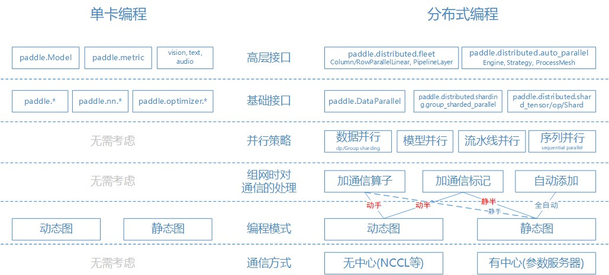
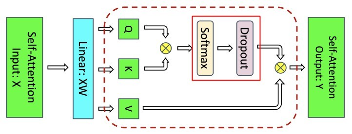

# 飞桨分布式Primer
# 1. 分布式要解决的问题
> wikipedia：A distributed system is a system whose components are located on different networked computers, which communicate and coordinate their actions by passing messages to one another. Distributed computing is a field of computer science that studies distributed systems. The components of a distributed system interact with one another in order to achieve a common goal. 
> 百度百科：分布式计算是计算机科学中一个研究方向，它研究如何把一个需要非常巨大的计算能力才能解决的问题分成许多小的部分，然后把这些部分分配给多个计算机进行处理，最后把这些计算结果综合起来得到最终的结果。

在计算机科学中，“分布式” 的概念已经存在了许多年，解决的场景和领域多集中在分布式计算 和分布式存储，例如开源界最著名的通用分布式存储和计算系统 Hadoop。
从技术角度上看，分布式是当数据规模达到一定程度时使用多台机器来协同存储和计算的一种通用技术。具体在深度学习场景中，因为往往使用加速硬件(GPU)来计算和存储数据，所以分布式在此场景中要解决的问题是使用多个加速硬件(下面简称多卡，有可能在多机上)  来训练/推理单个加速硬件(下面简称单卡)承受不了的模型，存储上主要是解决显存问题，计算上是多卡并行加速的问题，这里的多卡并行加速会有多种方法和策略。同时由分布式的定义，分布式改变的是计算和存储的过程，不会也不应该改变结果。即在深度学习场景中也需要遵循等价原则：分布式多卡的计算的结果要等于足够大单卡的计算结果。后面可以看到各种分布式策略的设计考虑都是基于此推出。
下面主要以用户视角来描述飞桨分布式，所以通过用户编程的例子来刨析飞桨分布式的实现原理和设计。

# 2. 飞桨分布式编程
在深度学习中，单卡编程和分布式编程需要考虑的因素及区别如下，以飞桨接口为例：
* 单卡编程。因不用考虑通信问题，所以只用根据 编程模式使用相关的接口即可。而且当前大多数基础接口是动/静态图统一的，除非使用原生静态图接口编程，其它可以一律使用基础接口编程，然后在两种模式上运行。
* 分布式编程。需要考虑通信，细化到代码中，比单卡编程要多考虑 并行策略、组网时对通信的处理 和 通信方式 因素。

 

考虑到简单易懂但不失一般性，以下编程示例均使用同样的网络，优化器和同样的输入数据(数值具有一定随机性)。
* 网络：3个线性层 `paddle.nn.Linear` 和 1个激活函数层 `paddle.nn.ReLU`。3个线性层的输入/输出size分别为：(256, 102400), (102400, 256), (256, 10)。
* 优化器：使用带动量参数的优化器 `paddle.optimizer.Momentum`。
* loss函数：使用交叉熵 `paddle.nn.CrossEntropyLoss`，10分类。
* 准确率评估：`paddle.metric.Accuracy(topk=(1, 5))`。
* 输入数据：`data.shape=[batch_size, 256], label.shape=[batch_size, 1]`。

## 2.1 单卡编程
简单回顾单卡编程方式，方便与分布式编程进行对比。单卡编程中有动态图和静态图两种方式。
```shell
# 如下代码执行方式均为
python xxxxxx.py
```

### 2.1.1 单卡动态图
```python
#
import numpy as np
import paddle
# 导入数据加载和数据保存接口
from paddle.io import Dataset, BatchSampler, DataLoader

base_lr = 0.1   # 学习率
momentum_rate = 0.9 # 冲量
l2_decay = 1e-4 # 权重衰减

epoch = 5  #训练迭代次数
batch_num = 100 #每次迭代的 batch 数
batch_size = 32 #训练批次大小
class_dim = 10

# 设置数据读取器
class RandomDataset(Dataset):
    def __init__(self, num_samples):
        self.num_samples = num_samples

    def __getitem__(self, idx):
        image = np.random.random([256]).astype('float32')
        label = np.random.randint(0, class_dim - 1, (1, )).astype('int64')
        return image, label

    def __len__(self):
        return self.num_samples

# 设置优化器
def optimizer_setting(parameter_list=None):
    optimizer = paddle.optimizer.Momentum(
        learning_rate=base_lr,
        momentum=momentum_rate,
        weight_decay=paddle.regularizer.L2Decay(l2_decay),
        parameters=parameter_list)
    return optimizer

# 模型网络
class SimpleNet(paddle.nn.Layer):
    def __init__(self, input_size, inner_size, output_size):
        super().__init__()
        self.linear1 = paddle.nn.Linear(input_size, inner_size)
        self.linear2 = paddle.nn.Linear(inner_size, input_size)
        self.linear3 = paddle.nn.Linear(input_size, output_size)
        self.relu = paddle.nn.ReLU()

    def forward(self, x):
        x = self.linear1(x)
        x = self.linear2(x)
        x = self.linear3(x)
        x = self.relu(x)
        return x

# 设置训练函数
def train_model():
    model = SimpleNet(input_size=256, inner_size=102400, output_size=class_dim)
    optimizer = optimizer_setting(parameter_list=model.parameters())
    
    dataset = RandomDataset(batch_num * batch_size)
    # 设置批采样器，用于数据并行训练
    sampler = BatchSampler(dataset,
                        batch_size=batch_size,shuffle=False, drop_last=True)
    train_loader = DataLoader(dataset,
                            batch_sampler=sampler,
                            num_workers=1)

    for eop in range(epoch):
        model.train()

        for batch_id, data in enumerate(train_loader()):
            img, label = data
            label.stop_gradient = True

            out = model(img)
            loss = paddle.nn.functional.cross_entropy(input=out, label=label)
            avg_loss = paddle.mean(x=loss)
            acc_top1 = paddle.metric.accuracy(input=out, label=label, k=1)
            acc_top5 = paddle.metric.accuracy(input=out, label=label, k=5)

            avg_loss.backward()
            optimizer.step()
            model.clear_gradients()

            if batch_id % 5 == 0:
                print("[Epoch %d, batch %d] loss: %.5f, acc1: %.5f, acc5: %.5f" % (eop, batch_id, avg_loss, acc_top1, acc_top5))
# 启动训练
if __name__ == '__main__':
    train_model()
```

### 2.1.2 单卡静态图，以原生接口为例
```python
#
import numpy as np
import paddle
# 导入数据加载和数据保存接口
from paddle.io import Dataset, BatchSampler, DataLoader
from paddle.base import core
from paddle.base.framework import IrGraph
def dump_prog(program, file_name):
    offline_graph = IrGraph(core.Graph(program.desc), for_test=True)
    offline_graph.draw('.', file_name, [])

paddle.enable_static()

base_lr = 0.1   # 学习率
momentum_rate = 0.9 # 冲量
l2_decay = 1e-4 # 权重衰减

epoch = 5  #训练迭代次数
batch_num = 100 #每次迭代的 batch 数
batch_size = 32 #训练批次大小
class_dim = 10

# 设置数据读取器
class RandomDataset(Dataset):
    def __init__(self, num_samples):
        self.num_samples = num_samples

    def __getitem__(self, idx):
        image = np.random.random([256]).astype('float32')
        label = np.random.randint(0, class_dim - 1, (1, )).astype('int64')
        return image, label

    def __len__(self):
        return self.num_samples

# 设置优化器
def optimizer_setting(parameter_list=None):
    optimizer = paddle.optimizer.Momentum(
        learning_rate=base_lr,
        momentum=momentum_rate,
        weight_decay=paddle.regularizer.L2Decay(l2_decay),
        parameters=parameter_list)
    return optimizer

# 模型网络
class SimpleNet(paddle.nn.Layer):
    def __init__(self, input_size, inner_size, output_size):
        super().__init__()
        self.linear1 = paddle.nn.Linear(input_size, inner_size)
        self.linear2 = paddle.nn.Linear(inner_size, input_size)
        self.linear3 = paddle.nn.Linear(input_size, output_size)
        self.relu = paddle.nn.ReLU()

    def forward(self, x):
        x = self.linear1(x)
        x = self.linear2(x)
        x = self.linear3(x)
        x = self.relu(x)
        return x

# 设置训练函数
def train_model():
    model = SimpleNet(input_size=256, inner_size=102400, output_size=class_dim)
    optimizer = optimizer_setting()

    # 静态图编译期trace
    with paddle.static.program_guard(paddle.static.default_main_program()):
        img = paddle.static.data(name='img', shape=[None, 256], dtype='float32')
        label = paddle.static.data(name='label', shape=[None, 1], dtype='int64')
        out = model(img)
        loss = paddle.nn.functional.cross_entropy(input=out, label=label)
        acc_top1 = paddle.metric.accuracy(input=out, label=label, k=1)
        acc_top5 = paddle.metric.accuracy(input=out, label=label, k=5)
        optimizer.minimize(loss)
    # 初始化执行器和参数
    exe = paddle.static.Executor()
    exe.run(paddle.static.default_startup_program())

    dataset = RandomDataset(batch_num * batch_size)
    # 设置批采样器，用于数据并行训练
    sampler = BatchSampler(dataset,
                        batch_size=batch_size,shuffle=False, drop_last=True)
    train_loader = DataLoader(dataset,
                            batch_sampler=sampler,
                            num_workers=1)
    # print(paddle.static.default_main_program())
    # print(paddle.static.default_startup_program())
    # dump_prog(paddle.static.default_main_program(), file_name = "single_main_program")

    for eop in range(epoch):
        model.train()

        for batch_id, data in enumerate(train_loader()):
            img, label = data
            loss_data, acc_top1_data, acc_top5_data = exe.run(feed={"img": img, "label": label}, fetch_list=[loss.name, acc_top1.name, acc_top5.name])

            if batch_id % 5 == 0:
                print("[Epoch %d, batch %d] loss: %.5f, acc1: %.5f, acc5: %.5f" % (eop, batch_id, loss_data, acc_top1_data, acc_top5_data))
# 启动训练
if __name__ == '__main__':
    train_model()
```

从如上代码可以看到，动态图和静态图编程的主要区别：
1. 静态图需要加 `paddle.enable_static()` 。因飞桨默认为动态图模式。
2. 静态图 optimizer 初始化不带 `model.parameters()`。因这时拿不到模型参数。
3. 静态图有编译期 trace。trace 后得到前向、后向和优化器整个计算图，基于此可以做很多优化，是静态图相比动态图的性能有优势的原因。
4. 迭代训练过程不一样，动态图按顺序执行前向、后向和优化器阶段，静态图使用执行器执行 trace后的整个计算图。这里体现出两者的本质区别：训练的每次迭代之间，动态图可以不一样，静态图必然一样。

打开代码中 `dump_prog` 函数的注释，可以得到计算图，方便与后面的分布式计算图对照。

 

## 2.2 分布式编程
编程前需要了解分布式编程中相比单卡多考虑的因素：并行策略、组网时对通信的处理和通信方式，更能清楚原理。

### 2.2.1 通信方式
无论使用何种分布式并行策略和在组网时对通信做何种处理，本质上都是为了在卡与卡之间传输数据，传输的数据包括：网络训练参数、输入变量、中间变量以及这 3 者的梯度。
在传输这些数据时有2大类通信方式：无中心通信 和 有中心通信。
* 无中心通信为每个卡两两之间都可以进行通信，互相读或写数据，写的时候往往会触发状态改变(保持副本或数据同步等)，需要额外操作。
* 有中心通信为每个卡之间的通信都需要经过某个中心节点。读数据时从中心节点读或通过中心节点知道数据地址再读；写数据时向中心发起写请求，由中心负责更新。

深度学习中当前的分布式模型训练基本都在多卡 GPU 上运行，在 GPU 上是使用前者方案，即使用 NCCL 来通信。后者当前只支持静态图数据并行策略，其它待支持。

NCCL 中定义的通信接口和深度学习的场景和需求比较契合，除了支持常用的两两之间 send/recv 外(流水线并行场景中使用)，还支持一些多卡之间的通信+计算接口。以下图片均来源于[NCCL官方文档](https://docs.nvidia.com/deeplearning/nccl/user-guide/docs/overview.html)。
* Broadcast。在 数据并行参数初始化 和 group sharded同步参数 等场景中使用。

 

* AllGather。在模型并行等场景中使用。

 

* AllReduce。在数据并行梯度累加和模型并行等场景中使用。

 

* Reduce。在 group sharded 归并参数梯度等场景中使用。

 

* ReduceScatter。在 group sharded 归并参数梯度等场景中使用。

 

从上面各接口的原理看，能够发现 AllReduce = ReduceScatter + AllGather，这也是下面 group sharded 策略实现的基础。
下图说明了 ReduceScatter 和 AllGather 的实现方式，主流是基于Ring的实现方法，也就得到 AllReduce 的实现方式。

 

### 2.2.2 组网时对通信的处理
即用户在定义网络时，考虑到此网络在多个卡上运行时，如何定义网络中的通信以实现期望的并行策略。有3类方式：
1. 用户手动加通信算子。即手动并行，需完整定义出网络中的通信（不能部分定义），最为灵活，但需要用户对分布式训练过程有相当程度的了解，深度学习框架只负责执行。
    * 示例：比如在 [LLaMA2 的手动并行模型定义](https://github.com/PaddlePaddle/PaddleNLP/blob/develop/paddlenlp/transformers/llama/modeling.py)中，经常能够看到 `fleet.meta_parallel.ColumnParallelLinear/RowParallelLinear` 等API，ColumnParallelLinear 在需要 gather output 的场景下会调用到 `mp_ops._c_concat -> _legacy_C_ops.c_concat -> CConcatOpCUDAKernel::Compute -> ProcessGroup::AllGather -> ProcessGroupNCCL::AllGather -> NCCLCommContext::AllGather -> phi::dynload::ncclAllGather`，即最后调用到上面描述的 NCCL 中的 AllGather 接口。
2. 用户标记通信。即半自动并行，用户在网络中某些关键地方标记需要通信（可以部分定义），然后由深度学习框架推断出网络中剩余其它部分的通信，并且尽量为最优（达到同样的目标时尽量减少通信量）。
    * 示例：比如在 [LLaMA2 半自动并行模型定义](https://github.com/PaddlePaddle/PaddleNLP/blob/develop/paddlenlp/transformers/llama/modeling_auto.py)中，经常能够看到 `fleet.auto.shard_tensor`（实际为 `paddle.distributed.auto_parallel.shard_tensor`），又如 `fleet.auto.shard_tensor(self.gate_proj.weight, *get_dist_attr([None, "mp"], self.ipp))`  则是在标记MLP层中 gate_proj 线性层训练参数按列切分为模型并行，同时考虑了流水线并行，整层放到预先指定的流水线并行卡上。
3. 用户不管，都交由深度学习框架处理。即 全自动并行，用户只用写单卡组网，没有额外的标记和手工加通信，由深度学习框架根据当前硬件环境、网络定义 和 可选的并行策略 完全推断网络中所有的通信，并且尽量为最优（达到同样的目标时减少通信量）。此方法因为需要知道整个计算图的信息才能进行优化，当前只能在静态图下实现。

### 2.2.3 并行策略
下面介绍的并行策略在[另一篇文档](https://github.com/PaddlePaddle/community/blob/master/pfcc/paddle-code-reading/auto_parallel/static_graph_pipelining.md)中有详细的描述，这里更多是说明这些并行策略在哪些地方需要通信，以及需要什么样的通信，并使用等价原则：分布式多卡的计算的结果要等于足够大单卡的计算结果，可以推出如下各种并行策略的实现方式

#### 2.2.3.1 数据并行
顾名思义，数据并行是在数据之间实现并行，例如使用上面单卡编程的模型，假设单卡最多运行的 batch_size=32，现在用2卡实现总的 batch_size=64 的效果。

 

使用等价原则，假设这 2 个卡(或 n 个卡)是 1 个大的卡，则可以推出第 1/3 步需要通信：
1. 各卡的训练参数要一致。初始化后同步为一致的训练参数。
2. 各卡的网络定义一致，前向计算(含loss)不需要通信。
3. 各卡的后向计算梯度时也不需要通信，但2个卡得到的梯度需要通信求平均才是最终梯度。
4. 优化器使用最终梯度更新训练参数，不需要通信。

从导出的计算图上可以验证（在后面的编程代码中会说明计算图如何得到）。

 

 


#### 2.2.3.2 group sharded
是数据并行的变种，由[《ZeRO: Memory Optimizations Toward Training Trillion Parameter Models》](https://arxiv.org/abs/1910.02054)论文提出，其又细分为3种并行策略(stage1/2/3)，分别对应 pytorch中的 OSS、SDP 和 FSDP（[Fully Sharded Data Parallel](https://engineering.fb.com/2021/07/15/open-source/fsdp/)）。其思想可用下图说明（图片来源于论文），本质上是去除数据并行中的冗余计算以降低单卡中的显存占用，从而支持更大的模型或更大的batch_size。去除量从 stage1/2/3 递增，且 stage3会 增大参数同步的通信量。

 

* 说明
  * all_reduce = reduce_scatter + all_gather
  * 表中的 Ψ代表参数量，K代表优化器中单个参数占用Bytes(使用Adam为12=保存fp32的参数为4B+一阶矩4B+二阶矩4B)，2代表前向/后向每个参数占用Bytes(因为是fp16，所以是2B)，N代表卡数
* 数据并行：    full weight forward + full weight backword + all_reduce grad + full optimizer state + full update weight
* stage1(OSS/ZeRO-1)：full weight forward + full weight backword + all_reduce grad + shard optimizer state + part update weight + all_gather weight
  使用等价原则，可以推出和数据并行类似，在4/5点不一样，在1/3/5需要通信：
    1. 各卡的训练参数要一致。初始化后同步为一致的训练参数。
    2. 各卡的网络定义一致，前向计算(含loss)不需要通信。
    3. 各卡的后向计算梯度时不需要通信，但2个卡得到的梯度需要求平均才是最终梯度。
    4. 优化器更新划分到本卡的优化器参数，进而只更新特定的训练参数，不需要通信。
    5. 因如上这1点，每个训练参数的更新分散在不同的卡上，所以在更新后，对每个训练参数增加同步通信(c_broadcast op)，确保所有卡的训练参数是一样的（整体视角上等价于all_gather）。

 

 

* stage2(SDP/ZeRO-2)：full weight forward + full weight backword + reduce_scatter grad + shard optimizer state + part update weight + all_gather weight
  使用等价原则，可以推出和数据并行类似，在3/4/5点不一样，在1/3/5需要通信：
    1. 各卡的训练参数要一致。初始化后同步为一致的训练参数。
    2. 各卡的网络定义一致，前向计算(含loss)不需要通信。
    3. 各卡的后向计算梯度时不需要通信，但2个卡上训练参数的梯度只执行reduce操作，即只放到有对应训练参数的卡上并平均，通过参数root_id 确定，不放到其它卡（整体视角上等价于reduce或reduce_scatter）。
    4. 优化器更新划分到本卡的优化器参数，进而只更新特定的训练参数，不需要通信。
    5. 因如上这1点，每个训练参数的更新分散在不同的卡上，所以在更新后，对每个训练参数增加同步通信(c_broadcast op)，确保所有卡的训练参数是一样的（整体视角上等价于all_gather）
* stage3(FSDP/ZeRO-3)：all_gather weight forward(each layer) + all_gather weight backword(each layer) + reduce_scatter grad + shard optimizer state + part update weight
  和数据并行差别较大，使用等价原则可以推出，在第2/3步需要通信：
    1. 各卡只初始化所负责的训练参数，初始化后不用同步。
    2. 各卡的网络定义一致，但训练参数分散在不同的卡上，单卡只有部分层的参数。在前/后向计算时，需要互相通信同步参数（等价于all_gather）。
    3. 各卡的后向计算梯度时不需要通信，但2个卡上训练参数的梯度只执行reduce操作，即只放到有对应训练参数的卡上并平均，通过参数root_id 确定，不放到其它卡（整体视角上等价于reduce或reduce_scatter）。
    4. 优化器更新划分到本卡的优化器参数，进而只更新特定的训练参数，不需要通信。

 

 


#### 2.2.3.3 模型并行
模型并行是在模型参数间实现并行，即将属于同一层的参数划分到不同的卡上进行并行计算，将单卡存不下的参数用多卡来存储。例如使用上面单卡编程的模型，假设单卡最多支持1.5B的参数量进行训练，则2卡可以支持近3B的参数。因为Linear3的参数量 (256\*10) 很小，这里没有切分，只切分了Linear1和Linear2的参数。另外注意，模型并行中，多卡输入的数据要是一样的。

 

* matmul 参数按列切的原理。

 

* matmul 参数按行切的原理。

 

使用等价原则，假设这2个卡(或n个卡)是1个大的卡，则可以推出第1/2/3步需要通信：
1. 各卡的训练参数为按模型切分后的参数。对于切分的参数，分别初始化；对于没有切分的参数，则初始化后同步为一致的训练参数。
2. 各卡的网络使用切分后的网络，即网络层数量不变，但参数的shape为切分后的shape，上面此例中前向计算第2个matmul因计算出来的结果为partial状态，需要allreduce后才是正确的结果。
3. 各卡的后向计算梯度时，只有第1个matmul的输入数据的梯度需要allreduce加和(因为用在了2条路上)，其余梯度不需要通信，因为对于切分的参数，其梯度只有1份；对于没有切分的参数，虽然会有多份梯度计算结果，但每份都一样，等价于通信求平均。所以不需要通信。
4. 优化器使用各卡上的梯度更新训练参数，不需要通信。

从导出的计算图上可以验证

 

 

#### 2.2.3.4 流水线并行
流水线并行是在模型层间实现并行，即以层为粒度将不同的层及参数划分到不同的卡上进行并行计算，将单卡存不下的参数用多卡来存储。例如使用上面单卡编程的模型，将Linear1和Linear2切分到0号卡上，Linear3和Relu切分到1号卡上。另外注意，流水线并行中，loss层和准确率计算都在前向计算的最后1卡上，只有这张卡能获取到loss数值。

 

使用等价原则，假设这2个卡(或n个卡)是1个大的卡，则可以推出第2/3步需要通信：
1. 各卡的训练参数为按流水线切分后的参数。分别初始化，不用同步通信。
2. 各卡的网络使用切分后的网络，即只包含部分网络层，在前向计算图中，发送到其它卡的数据通过send完成，从其它卡接收数据通过recv完成。
3. 各卡的后向计算梯度时也和前向一样，发送到其它卡的数据通过send完成，从其它卡接收数据通过recv完成，计算的梯度即为最终梯度。
4. 优化器使用各卡上的梯度更新训练参数，不需要通信。

流水线并行细分有多种实现，如下示意图来源于[飞桨官网](https://www.paddlepaddle.org.cn/documentation/docs/zh/guides/06_distributed_training/pipeline_parallel_cn.html)，这里说明下各自的优缺点：
1. 朴素流水线并行。实现较为简易明了，但缺点比较明显：
    a. 低GPU利用率。 在任意时刻，有且仅有一个GPU在工作，其他GPU都空闲。  
    b. 计算和通信没有重叠。在发送前向传播的中间结果或者反向传播的中间结果时，GPU也是空闲的。 
    c. 部分卡显存占用时间过长。GPU0从第0步开始就需要保存整个batch中后向计算所需的中间变量，直至第3步后向梯度计算完成。 
 

2. interleave 流水线并行（也称F-then-B）。将1个 batch 划分为2个 microbatch，然后依次送入GPU0 和 GPU1计算前向和后向，2个 microbatch 计算出来的梯度需要求平均才是最终梯度。在此过程中，每个 timestep 上花费的时间要比朴素层并行更短，因为每个 GPU 仅需要处理 microbatch，整体性能会相比朴素流水线更好，并可以解决朴素流水线并行的缺点a 和缺点b，缺点c 有缓解但还是存在。
 

3. 1F1B 流水线并行。interleave 并行需要等所有的 microbatch 前向完成后，才会开始后向计算，1F1B 则是当一个 microbatch 的前向完成后，立即进入后向计算。从理论上看，后向完成后就可以释放中间变量。由于1F1B 的后向完成要比interleave 早，因此也会减少峰值显存的需求，实测 1F1B 方式相比 interleave  方式峰值显存可以节省 37.5%。
 

从导出的计算图上可以验证，如下为1F1B的计算图

 

 


#### 2.2.3.5 序列并行 sequential parallel
##### 2.2.3.5.1 背景
此并行策略由[Nvidia Megatron的论文](https://arxiv.org/pdf/2205.05198.pdf)提出，是针对 Transformer 模型结构提出的一种特定并行策略，非通用并行策略。
其目的是在模型并行的基础上，进一步降低 Transformer 模型结构在单卡上的显存占用，从这个角度看，也可以看成是模型并行在Transformer上的一种扩展。以下说明是论文的简要描述，图片来源于论文。

 

 


而基于GPT3各种尺寸的模型测试中，中间变量(Activations)的显存占用大于训练参数和优化器参数的显存占用。

 

所以具体来说，序列并行是在模型并行降低单卡训练参数和优化器参数显存占用的基础上，进一步减低中间变量(Activations)的显存占用，故以下公式均只描述中间变量的显存占用。

##### 2.2.3.5.2 优化方法
没有任何并行策略时，单卡上单个Transformer Layer的中间变量(Activations)显存占用为：

 

以 GPT3 175B为例，使用fp16/bf16训练，a=96，s=2048，h=12288，b=1，则为： 2736MB/卡/Layer。L=96，总的为 256.5GB/卡。
使用 模型并行后，单卡上单个 Transformer Layer 的中间变量能够降低为：

 

以 GPT3 175B为例，使用fp16/bf16训练，a=96，s=2048，h=12288，b=1，t=8，则为： 552MB/卡/Layer。L=96，总的为 51.75GB/卡。
原因是模型并行作用于矩阵乘相关的层上，这些层内中间变量的占用也能够缩小到 1/t，t为模型并行数量，但是这些层之外的 LayerNorm、Dropout 相关的中间变量的空间不能缩小。

 

图中的 f 代表通信算子，f' 是 f 对偶的通信算子，f正向为空，反向为all_reduce；f'正向为all_reduce，反向为空。
使用 模型并行+序列并行 后，单卡上单个Transformer Layer的中间变量能够降低为：

 

以 GPT3 175B为例，使用fp16/bf16训练，a=96，s=2048，h=12288，b=1，t=8，则为： 342MB/卡/Layer。L=96，总的为 32.0625GB/卡。
原因是在模型并行外的其它位置(LayerNorm、Dropout)也实现了并行，即按 sequence_length 维度进行切分，故称为 sequential parallel。这些中间变量也能够缩小到 1/t，本质是去除了这些中间变量的冗余计算。

 

从更微观的角度看是LayerNorm、Dropout只在 hidden_size 维度上进行计算，所以对sequence_length 维度的切分不影响它们。
同时这里也改进了通信，图中的 g 代表通信算子，g' 是 g 对偶的通信算子，g正向为all_gather，反向为reduce_scatter；g'正向为reduce_scatter，反向为all_gather，由上面通信部分的表述 all_reduce = all_gather + reduce_scatter，所以相比模型并行不增加通信量。

 

##### 2.2.3.5.3 进一步的优化
使用 模型并行+序列并行 后，由上面公式4，在GPT3 175B等大模型中（尤其是随着sequence_length的增加），括号中第1项相对于第2项较小，所以如果能去掉第2项，可以进一步大幅减少显存占用。
第2项来源于attention层中的softmax+dropout的中间变量，如果在这里使用recompute，即不保存这些中间变量，则可以达到目的。

 

以 GPT3 175B为例，使用fp16/bf16训练，a=96，s=2048，h=12288，b=1，t=8，则为： **102MB**/卡/Layer。L=96，总的为 9.5625GB/卡。且只增加2.7%左右的计算量。
如果使用完全recompute的方案，可以得到中间变量占用 2sbh，为 **48MB**/卡/Layer，但是会增加数十倍计算量。即通过上面的优化，只增加很少的计算，显存占用已经接近理想值。
总结
| 以GPT3 175B为例 | 单卡单Layer占用(MB) | 单卡所有Layer占用(GB) | 通信增加 | 计算增加 |
| ---- | ---- | ---- | ---- | ---- |
| 无并行策略 | 2736 | 256.5 | - | - |
| 模型并行 | 552 | 51.75 | 每Layer 前/后向2个all_reduce | 无 |
| 模型并行+序列并行 | 342 |32.0625 | 每Layer 前/后向2个all_gather+reduce_scatter，相比模型并行不增加 | 无 |
| 模型并行+序列并行+有选择的recompute | 102 | 9.5625 | 每Layer 前/后向2个all_gather+reduce_scatter，相比模型并行不增加 | 2.7% |
| 完全recompute | 48 | 4.5 | 数十倍 | 数十倍 |

### 2.2.4 分布式编程代码
清楚分布式编程相比单卡编程要多考虑的3方面因素后，使用相关API可以在相同组网结构上写出分布式训练程序。
如下示例代码都在GPU上运行，使用无中心通信(NCCL)，按照动/静态图  + 组网对通信的处理 + 并行策略 的组合进行说明。
因为静态图手动方式已经不再使用，所以主要描述：
* 动态图 + 手动加通信算子 + 各种并行策略，即 基于动态图手动(简称动手)实现的各种并行策略。
* 动态图 + 用户标记通信 + 各种并行策略，即 基于动态图半自动(简称动半)实现的各种并行策略，此方式需要安装Paddle v2.6及以上版本。
* 静态图 + 用户标记通信 + 各种并行策略，即 基于静态图半自动(简称静半)实现的各种并行策略。
```shell
# 如下代码执行方式均为，假设在0号和1号卡上执行，日志打印到logs目录中
python -m paddle.distributed.launch --gpus=0,1 --log_dir logs xxxxxx.py 
```

#### 2.2.4.1 动态图手动(动手)实现的各种并行策略
动手上分布式编程代码相比于单卡编程代码需要添加：
1. import 分布式相关API。主要是 paddle.distributed.fleet/get_rank。
2. 组网。模型并行和流水线并行需要侵入式修改模型网络添加通信算子，数据并行和group sharded不用修改网络，其需要的通信可以在第4步解决。
3. 配置分布式策略。并用此初始化分布式环境（设置各卡rank/角色，通信组和拓扑等）。
4. 把单卡的模型和优化器转换为分布式环境中的模型和优化器。使用 fleet.distributed_model 和 fleet.distributed_optimizer 封装实例化后的模型和优化器，group sharded比较特殊，使用group_sharded_parallel来封装。
5. 分布式数据加载。数据采样器使用分布式采样器。
6. 每个batch迭代训练。过程同单卡，只有流水线并行比较特殊，因为要实现1F1B这种特殊的执行顺序，其使用 model.train_batch 将前向、后向和优化器封装执行。

##### 2.2.4.1.1 动手-数据并行示例代码
```python
# -*- coding: UTF-8 -*-
import numpy as np
import paddle
# 导入必要分布式训练的依赖包
from paddle.distributed import fleet, get_rank
# 导入数据加载和数据保存接口
from paddle.io import Dataset, DistributedBatchSampler, DataLoader

base_lr = 0.1   # 学习率
momentum_rate = 0.9 # 冲量
l2_decay = 1e-4 # 权重衰减

epoch = 5  #训练迭代次数
batch_num = 100 #每次迭代的 batch 数
batch_size = 32 #训练批次大小
class_dim = 10

# 设置数据读取器
class RandomDataset(Dataset):
    def __init__(self, num_samples):
        self.num_samples = num_samples

    def __getitem__(self, idx):
        image = np.random.random([256]).astype('float32')
        label = np.random.randint(0, class_dim - 1, (1, )).astype('int64')
        return image, label

    def __len__(self):
        return self.num_samples

# 设置优化器
def optimizer_setting(parameter_list=None):
    optimizer = paddle.optimizer.Momentum(
        learning_rate=base_lr,
        momentum=momentum_rate,
        weight_decay=paddle.regularizer.L2Decay(l2_decay),
        parameters=parameter_list)
    return optimizer

# 模型网络
class SimpleNet(paddle.nn.Layer):
    def __init__(self, input_size, inner_size, output_size):
        super().__init__()
        self.linear1 = paddle.nn.Linear(input_size, inner_size)
        self.linear2 = paddle.nn.Linear(inner_size, input_size)
        self.linear3 = paddle.nn.Linear(input_size, output_size)
        self.relu = paddle.nn.ReLU()

    def forward(self, x):
        x = self.linear1(x)
        x = self.linear2(x)
        x = self.linear3(x)
        x = self.relu(x)
        return x

# 设置分布式策略
dist_strategy = fleet.DistributedStrategy()
dist_strategy.hybrid_configs = {
    "dp_degree": 2,
    "mp_degree": 1,
    "pp_degree": 1,
}

# 设置训练函数
def train_model():
    # 初始化 Fleet 环境
    fleet.init(is_collective=True, strategy=dist_strategy)

    model = SimpleNet(input_size=256, inner_size=102400, output_size=class_dim)
    optimizer = optimizer_setting(parameter_list=model.parameters())
    
    # 通过 Fleet API 获取分布式 model，用于支持分布式训练
    model = fleet.distributed_model(model)
    optimizer = fleet.distributed_optimizer(optimizer)

    dataset = RandomDataset(batch_num * batch_size)
    # 设置分布式批采样器，用于数据并行训练
    sampler = DistributedBatchSampler(dataset, rank=get_rank(),
                                      batch_size=batch_size,shuffle=False, drop_last=True)
    train_loader = DataLoader(dataset,
                            batch_sampler=sampler,
                            num_workers=1)

    for eop in range(epoch):
        model.train()

        for batch_id, data in enumerate(train_loader()):
            img, label = data
            label.stop_gradient = True

            out = model(img)
            loss = paddle.nn.functional.cross_entropy(input=out, label=label)
            avg_loss = paddle.mean(x=loss)
            acc_top1 = paddle.metric.accuracy(input=out, label=label, k=1)
            acc_top5 = paddle.metric.accuracy(input=out, label=label, k=5)

            avg_loss.backward()
            optimizer.step()
            model.clear_gradients()

            if batch_id % 5 == 0:
                print("[Epoch %d, batch %d] loss: %.5f, acc1: %.5f, acc5: %.5f" % (eop, batch_id, avg_loss, acc_top1, acc_top5))
# 启动训练
if __name__ == '__main__':
    train_model()
```

##### 2.2.4.1.2 动手-group sharded并行示例代码
```python
# -*- coding: UTF-8 -*-
import numpy as np
import paddle
# 导入必要分布式训练的依赖包
from paddle.distributed import fleet, get_rank
from paddle.distributed.sharding import group_sharded_parallel
# 导入数据加载和数据保存接口
from paddle.io import Dataset, DistributedBatchSampler, DataLoader

base_lr = 0.1   # 学习率
momentum_rate = 0.9 # 冲量
l2_decay = 1e-4 # 权重衰减

epoch = 5  #训练迭代次数
batch_num = 100 #每次迭代的 batch 数
batch_size = 32 #训练批次大小
class_dim = 10

# 设置数据读取器
class RandomDataset(Dataset):
    def __init__(self, num_samples):
        self.num_samples = num_samples

    def __getitem__(self, idx):
        image = np.random.random([256]).astype('float32')
        label = np.random.randint(0, class_dim - 1, (1, )).astype('int64')
        return image, label

    def __len__(self):
        return self.num_samples

# 设置优化器
def optimizer_setting(parameter_list=None):
    optimizer = paddle.optimizer.Momentum(
        learning_rate=base_lr,
        momentum=momentum_rate,
        weight_decay=paddle.regularizer.L2Decay(l2_decay),
        parameters=parameter_list)
    return optimizer

# 模型网络
class SimpleNet(paddle.nn.Layer):
    def __init__(self, input_size, inner_size, output_size):
        super().__init__()
        self.linear1 = paddle.nn.Linear(input_size, inner_size)
        self.linear2 = paddle.nn.Linear(inner_size, input_size)
        self.linear3 = paddle.nn.Linear(input_size, output_size)
        self.relu = paddle.nn.ReLU()

    def forward(self, x):
        x = self.linear1(x)
        x = self.linear2(x)
        x = self.linear3(x)
        x = self.relu(x)
        return x


# 设置训练函数
def train_model():
    # 初始化 Fleet 环境
    fleet.init(is_collective=True)
    group = paddle.distributed.new_group([0, 1])

    model = SimpleNet(input_size=256, inner_size=102400, output_size=class_dim)
    optimizer = optimizer_setting(parameter_list=model.parameters())

    # wrap GroupSharded model, optimizer and scaler. level1='os', level2='os_g', level3='p_g_os'
    model, optimizer, scaler = group_sharded_parallel(model, optimizer, level="p_g_os", group=group)
    
    dataset = RandomDataset(batch_num * batch_size)
    # 设置分布式批采样器，用于数据并行训练
    sampler = DistributedBatchSampler(dataset, rank=get_rank(),
                                      batch_size=batch_size,shuffle=False, drop_last=True)
    train_loader = DataLoader(dataset,
                            batch_sampler=sampler,
                            num_workers=1)

    for eop in range(epoch):
        model.train()

        for batch_id, data in enumerate(train_loader()):
            img, label = data
            label.stop_gradient = True

            out = model(img)
            loss = paddle.nn.functional.cross_entropy(input=out, label=label)
            avg_loss = paddle.mean(x=loss)
            acc_top1 = paddle.metric.accuracy(input=out, label=label, k=1)
            acc_top5 = paddle.metric.accuracy(input=out, label=label, k=5)

            avg_loss.backward()
            optimizer.step()
            model.clear_gradients()

            if batch_id % 5 == 0:
                print("[Epoch %d, batch %d] loss: %.5f, acc1: %.5f, acc5: %.5f" % (eop, batch_id, avg_loss, acc_top1, acc_top5))
# 启动训练
if __name__ == '__main__':
    train_model()
```

##### 2.2.4.1.3 动手-模型并行示例代码
```python
# -*- coding: UTF-8 -*-
import numpy as np
import paddle
# 导入必要分布式训练的依赖包
from paddle.distributed import fleet, get_rank
# 导入数据加载和数据保存接口
from paddle.io import Dataset, DistributedBatchSampler, DataLoader

base_lr = 0.1   # 学习率
momentum_rate = 0.9 # 冲量
l2_decay = 1e-4 # 权重衰减

epoch = 5  #训练迭代次数
batch_num = 100 #每次迭代的 batch 数
batch_size = 32 #训练批次大小
class_dim = 10

# 设置数据读取器
class RandomDataset(Dataset):
    def __init__(self, num_samples):
        self.num_samples = num_samples

    def __getitem__(self, idx):
        image = np.random.random([256]).astype('float32')
        label = np.random.randint(0, class_dim - 1, (1, )).astype('int64')
        return image, label

    def __len__(self):
        return self.num_samples

# 设置优化器
def optimizer_setting(parameter_list=None):
    optimizer = paddle.optimizer.Momentum(
        learning_rate=base_lr,
        momentum=momentum_rate,
        weight_decay=paddle.regularizer.L2Decay(l2_decay),
        parameters=parameter_list)
    return optimizer

# 模型网络
class SimpleNet(paddle.nn.Layer):
    def __init__(self, input_size, inner_size, output_size):
        super().__init__()
        self.linear1 = fleet.meta_parallel.ColumnParallelLinear(
            input_size,
            inner_size,
            gather_output=False,
            has_bias=True)
        self.linear2 = fleet.meta_parallel.RowParallelLinear(
            inner_size,
            input_size,
            input_is_parallel=True,
            has_bias=True)
        self.linear3 = paddle.nn.Linear(input_size, output_size)
        self.relu = paddle.nn.ReLU()

    def forward(self, x):
        x = self.linear1(x)
        x = self.linear2(x)
        x = self.linear3(x)
        x = self.relu(x)
        return x

# 设置分布式策略
dist_strategy = fleet.DistributedStrategy()
dist_strategy.hybrid_configs = {
    "dp_degree": 1,
    "mp_degree": 2,
    "pp_degree": 1,
}

# 设置训练函数
def train_model():
    # 初始化 Fleet 环境
    fleet.init(is_collective=True, strategy=dist_strategy)

    model = SimpleNet(input_size=256, inner_size=102400, output_size=class_dim)
    optimizer = optimizer_setting(parameter_list=model.parameters())
    
    # 通过 Fleet API 获取分布式 model，用于支持分布式训练
    model = fleet.distributed_model(model)
    optimizer = fleet.distributed_optimizer(optimizer)

    dataset = RandomDataset(batch_num * batch_size)
    # 设置分布式批采样器，用于数据并行训练
    sampler = DistributedBatchSampler(dataset, rank=get_rank(),
                                      batch_size=batch_size,shuffle=False, drop_last=True)
    train_loader = DataLoader(dataset,
                            batch_sampler=sampler,
                            num_workers=1)

    for eop in range(epoch):
        model.train()

        for batch_id, data in enumerate(train_loader()):
            img, label = data
            label.stop_gradient = True

            out = model(img)
            loss = paddle.nn.functional.cross_entropy(input=out, label=label)
            avg_loss = paddle.mean(x=loss)
            acc_top1 = paddle.metric.accuracy(input=out, label=label, k=1)
            acc_top5 = paddle.metric.accuracy(input=out, label=label, k=5)

            avg_loss.backward()
            optimizer.step()
            model.clear_gradients()

            if batch_id % 5 == 0:
                print("[Epoch %d, batch %d] loss: %.5f, acc1: %.5f, acc5: %.5f" % (eop, batch_id, avg_loss, acc_top1, acc_top5))
# 启动训练
if __name__ == '__main__':
    train_model()
```

##### 2.2.4.1.4 动手-流水线并行示例代码
```python
# -*- coding: UTF-8 -*-
import numpy as np
import paddle
# 导入必要分布式训练的依赖包
from paddle.distributed import fleet, get_rank
from paddle.distributed.fleet.meta_parallel import LayerDesc, PipelineLayer
# 导入数据加载和数据保存接口
from paddle.io import Dataset, DistributedBatchSampler, DataLoader

base_lr = 0.1   # 学习率
momentum_rate = 0.9 # 冲量
l2_decay = 1e-4 # 权重衰减

epoch = 5  #训练迭代次数
batch_num = 100 #每次迭代的 batch 数
batch_size = 32 #训练批次大小
class_dim = 10

# 设置数据读取器
class RandomDataset(Dataset):
    def __init__(self, num_samples):
        self.num_samples = num_samples

    def __getitem__(self, idx):
        image = np.random.random([256]).astype('float32')
        label = np.random.randint(0, class_dim - 1, (1, )).astype('int64')
        return image, label

    def __len__(self):
        return self.num_samples

# 设置优化器
def optimizer_setting(parameter_list=None):
    optimizer = paddle.optimizer.Momentum(
        learning_rate=base_lr,
        momentum=momentum_rate,
        weight_decay=paddle.regularizer.L2Decay(l2_decay),
        parameters=parameter_list)
    return optimizer

# 模型网络
class SimpleNet(PipelineLayer):
    def __init__(self, input_size, inner_size, output_size, **kwargs):
        decs = [
            LayerDesc(paddle.nn.Linear, input_size, inner_size),
            LayerDesc(paddle.nn.Linear, inner_size, input_size),
            LayerDesc(paddle.nn.Linear, input_size, output_size),
            LayerDesc(paddle.nn.ReLU),
        ]
        super().__init__(layers=decs, loss_fn=paddle.nn.CrossEntropyLoss(), **kwargs)

# 设置分布式策略
dist_strategy = fleet.DistributedStrategy()
dist_strategy.hybrid_configs = {
    "dp_degree": 1,
    "mp_degree": 1,
    "pp_degree": 2,
}
micro_batch_size = 16
num_stages = batch_size // micro_batch_size
dist_strategy.pipeline_configs = {
    "accumulate_steps": num_stages,
    "micro_batch_size": micro_batch_size
}

# 设置训练函数
def train_model():
    # 初始化 Fleet 环境
    fleet.init(is_collective=True, strategy=dist_strategy)

    model = SimpleNet(input_size=256, inner_size=102400, output_size=class_dim, num_stages=num_stages)
    optimizer = optimizer_setting(parameter_list=model.parameters())
    
    # 通过 Fleet API 获取分布式 model，用于支持分布式训练
    model = fleet.distributed_model(model)
    optimizer = fleet.distributed_optimizer(optimizer)

    dataset = RandomDataset(batch_num * batch_size)
    # 设置分布式批采样器，用于数据并行训练
    sampler = DistributedBatchSampler(dataset, rank=get_rank(),
                                      batch_size=batch_size,shuffle=False, drop_last=True)
    train_loader = DataLoader(dataset,
                            batch_sampler=sampler,
                            num_workers=1)

    for eop in range(epoch):
        model.train()

        for batch_id, data in enumerate(train_loader()):
            img, label = data
            label.stop_gradient = True

            #out = model(img)
            #loss = paddle.nn.functional.cross_entropy(input=out, label=label)
            loss = model.train_batch([img, label], optimizer)
            avg_loss = paddle.mean(x=loss)
            #acc_top1 = paddle.metric.accuracy(input=out, label=label, k=1)
            #acc_top5 = paddle.metric.accuracy(input=out, label=label, k=5)

            #avg_loss.backward()
            #optimizer.step()
            #model.clear_gradients()

            if batch_id % 5 == 0:
                print("[Epoch %d, batch %d] loss: %.5f" % (eop, batch_id, avg_loss))
# 启动训练
if __name__ == '__main__':
    train_model()
```

| 动态图手动各并行策略 | 是否修改__init__ | 是否修改forward | 初始化分布式环境&设置分布式策略 | 封装模型和优化器 | 分布式数据加载和采样 | 迭代训练过程 |
| ---- | ---- | ---- | ---- | ---- | ---- | ---- |
| 单卡运行 | 否 | 否 | 不需要 | 不需要 | 不需要 | 常规 |
| 数据并行 | 否 | 否 | 需要 | 需要 | 需要 | 常规 |
| 模型并行 | **是** | 否 | 需要 | 需要 | 需要 | 常规 |
| 流水线并行 | **是** | **是** | 需要 | 需要 | 需要 | **特殊** |
| group_sharded(fsdp) | 否 | 否 | 需要 | 需要 | 需要 | 常规 |


#### 2.2.4.2 动态图半自动(动半)实现的各种并行策略
动半上分布式编程代码相比于单卡编程代码需要添加：
1. import 分布式相关API。主要是 paddle.distributed.ProcessMesh/shard_tensor/shard_op/Shard
2. 组网。模型网络__init__方法都相同，数据并行、模型并行和流水线并行需要侵入式修改forward函数，在关键点上进行标记。
3. 需配置好ProcessMesh，用于标记时使用。不能额外配置分布式策略，优势是使用方便，劣势是流水线并行的特殊优化策略不能支持，如不能流水线并行中的 1F1B 和 F-then-B 策略。
4. 其它如 优化器、数据加载 及 每个batch迭代训练 都和单卡程序一样。只有部分计算准确率的API还不支持 DistTensor，如需计算准确率暂时需要修改，这些API都支持后就和单卡编程一样。

##### 2.2.4.2.1 动半-数据并行示例代码
```python
# -*- coding: UTF-8 -*-
import numpy as np
import paddle
# 导入动态图半自动接口
from paddle.distributed import ProcessMesh, shard_tensor, shard_op, Shard
# 导入数据加载和数据保存接口
from paddle.io import Dataset, BatchSampler, DataLoader

base_lr = 0.1   # 学习率
momentum_rate = 0.9 # 冲量
l2_decay = 1e-4 # 权重衰减

epoch = 5  #训练迭代次数
batch_num = 100 #每次迭代的 batch 数
batch_size = 32 #训练批次大小
class_dim = 10

# 设置数据读取器
class RandomDataset(Dataset):
    def __init__(self, num_samples):
        self.num_samples = num_samples

    def __getitem__(self, idx):
        image = np.random.random([256]).astype('float32')
        label = np.random.randint(0, class_dim - 1, (1, )).astype('int64')
        return image, label

    def __len__(self):
        return self.num_samples

# 设置优化器
def optimizer_setting(parameter_list=None):
    optimizer = paddle.optimizer.Momentum(
        learning_rate=base_lr,
        momentum=momentum_rate,
        weight_decay=paddle.regularizer.L2Decay(l2_decay),
        parameters=parameter_list)
    return optimizer

# 模型网络
class SimpleNet(paddle.nn.Layer):
    def __init__(self, input_size, inner_size, output_size):
        super().__init__()
        self.linear1 = paddle.nn.Linear(input_size, inner_size)
        self.linear2 = paddle.nn.Linear(inner_size, input_size)
        self.linear3 = paddle.nn.Linear(input_size, output_size)
        self.relu = paddle.nn.ReLU()

    def forward(self, x):
        x = shard_tensor(x, world_process_mesh, [Shard(0)])
        x = self.linear1(x)
        x = self.linear2(x)
        x = self.linear3(x)
        x = self.relu(x)
        return x

# 设置mesh
world_process_mesh = ProcessMesh([0, 1], dim_names=["dp"])

# 设置训练函数
def train_model():
    model = SimpleNet(input_size=256, inner_size=102400, output_size=class_dim)
    loss_func = paddle.nn.CrossEntropyLoss()
    optimizer = optimizer_setting(parameter_list=model.parameters())

    # 设置dataset和dataloader，用于并行训练
    dataset = RandomDataset(batch_num * batch_size)
    # 设置批采样器，用于数据并行训练
    sampler = BatchSampler(dataset,
                        batch_size=batch_size,shuffle=False, drop_last=True)
    train_loader = DataLoader(dataset,
                            batch_sampler=sampler,
                            num_workers=1)

    for eop in range(epoch):
        model.train()

        for batch_id, data in enumerate(train_loader()):
            img, label = data
            label.stop_gradient = True

            out = model(img)
            loss = loss_func(input=out, label=label)
            avg_loss = paddle.mean(x=loss)
            # acc_top1 = paddle.metric.accuracy(input=out, label=label, k=1)
            # acc_top5 = paddle.metric.accuracy(input=out, label=label, k=5)

            avg_loss.backward()
            optimizer.step()
            model.clear_gradients()

            if batch_id % 5 == 0:
                print("[Epoch %d, batch %d] loss: %.5f" % (eop, batch_id, np.array(avg_loss)))
# 启动训练
if __name__ == '__main__':
    train_model()
```

##### 2.2.4.2.2 动半-模型并行示例代码
```python
# -*- coding: UTF-8 -*-
import numpy as np
import paddle
# 导入动态图半自动接口
from paddle.distributed import ProcessMesh, shard_tensor, shard_op, Shard
# 导入数据加载和数据保存接口
from paddle.io import Dataset, BatchSampler, DataLoader

base_lr = 0.1   # 学习率
momentum_rate = 0.9 # 冲量
l2_decay = 1e-4 # 权重衰减

epoch = 5  #训练迭代次数
batch_num = 100 #每次迭代的 batch 数
batch_size = 32 #训练批次大小
class_dim = 10

# 设置数据读取器
class RandomDataset(Dataset):
    def __init__(self, num_samples):
        self.num_samples = num_samples

    def __getitem__(self, idx):
        image = np.random.random([256]).astype('float32')
        label = np.random.randint(0, class_dim - 1, (1, )).astype('int64')
        return image, label

    def __len__(self):
        return self.num_samples

# 设置优化器
def optimizer_setting(parameter_list=None):
    optimizer = paddle.optimizer.Momentum(
        learning_rate=base_lr,
        momentum=momentum_rate,
        weight_decay=paddle.regularizer.L2Decay(l2_decay),
        parameters=parameter_list)
    return optimizer

# 模型网络
class SimpleNet(paddle.nn.Layer):
    def __init__(self, input_size, inner_size, output_size):
        super().__init__()
        self.linear1 = paddle.nn.Linear(input_size, inner_size)
        self.linear2 = paddle.nn.Linear(inner_size, input_size)
        self.linear3 = paddle.nn.Linear(input_size, output_size)
        self.relu = paddle.nn.ReLU()

    def forward(self, x):
        shard_tensor(self.linear1.weight, world_process_mesh, [Shard(1)])
        shard_tensor(self.linear1.bias, world_process_mesh, [Shard(0)])
        shard_tensor(self.linear2.weight, world_process_mesh, [Shard(0)])
        x = self.linear1(x)
        x = self.linear2(x)
        x_dims_mapping = [None, None]
        w_dims_mapping = [None, None]
        x = shard_op(paddle.matmul, world_process_mesh, [x_dims_mapping, w_dims_mapping])(x, self.linear3.weight) + self.linear3.bias
        # x = self.linear3(x)
        x = self.relu(x)
        return x

# 设置mesh
world_process_mesh = ProcessMesh([0, 1], dim_names=["mp"])

# 设置训练函数
def train_model():
    model = SimpleNet(input_size=256, inner_size=102400, output_size=class_dim)
    loss_func = paddle.nn.CrossEntropyLoss()
    optimizer = optimizer_setting(parameter_list=model.parameters())

    # 设置dataset和dataloader，用于并行训练
    dataset = RandomDataset(batch_num * batch_size)
    # 设置批采样器，用于数据并行训练
    sampler = BatchSampler(dataset,
                        batch_size=batch_size,shuffle=False, drop_last=True)
    train_loader = DataLoader(dataset,
                            batch_sampler=sampler,
                            num_workers=1)

    for eop in range(epoch):
        model.train()

        for batch_id, data in enumerate(train_loader()):
            img, label = data
            label.stop_gradient = True

            out = model(img)
            loss = loss_func(input=out, label=label)
            avg_loss = paddle.mean(x=loss)
            # acc_top1 = paddle.metric.accuracy(input=out, label=label, k=1)
            # acc_top5 = paddle.metric.accuracy(input=out, label=label, k=5)

            avg_loss.backward()
            optimizer.step()
            model.clear_gradients()

            if batch_id % 5 == 0:
                print("[Epoch %d, batch %d] loss: %.5f" % (eop, batch_id, np.array(avg_loss)))
# 启动训练
if __name__ == '__main__':
    train_model()
```

##### 2.2.4.2.3 动半-流水线并行示例代码
```python
# -*- coding: UTF-8 -*-
import numpy as np
import paddle
# 导入动态图半自动接口
from paddle.distributed import ProcessMesh, shard_tensor, shard_op, Shard
# 导入数据加载和数据保存接口
from paddle.io import Dataset, BatchSampler, DataLoader

base_lr = 0.1   # 学习率
momentum_rate = 0.9 # 冲量
l2_decay = 1e-4 # 权重衰减

epoch = 5  #训练迭代次数
batch_num = 100 #每次迭代的 batch 数
batch_size = 32 #训练批次大小
class_dim = 10

# 设置数据读取器
class RandomDataset(Dataset):
    def __init__(self, num_samples):
        self.num_samples = num_samples

    def __getitem__(self, idx):
        image = np.random.random([256]).astype('float32')
        label = np.random.randint(0, class_dim - 1, (1, )).astype('int64')
        return image, label

    def __len__(self):
        return self.num_samples

# 设置优化器
def optimizer_setting(parameter_list=None):
    optimizer = paddle.optimizer.Momentum(
        learning_rate=base_lr,
        momentum=momentum_rate,
        weight_decay=paddle.regularizer.L2Decay(l2_decay),
        parameters=parameter_list)
    return optimizer

# 模型网络
class SimpleNet(paddle.nn.Layer):
    def __init__(self, input_size, inner_size, output_size):
        super().__init__()
        self.linear1 = paddle.nn.Linear(input_size, inner_size)
        self.linear2 = paddle.nn.Linear(inner_size, input_size)
        self.linear3 = paddle.nn.Linear(input_size, output_size)
        self.relu = paddle.nn.ReLU()

    def forward(self, x):
        x = shard_op(self.linear1, world_process_mesh[0])(x)
        x = self.linear2(x)
        x = shard_op(self.linear3, world_process_mesh[1])(x)
        x = self.relu(x)
        return x

# 设置mesh
world_process_mesh = ProcessMesh([0, 1], dim_names=["pp"])

# 设置训练函数
def train_model():
    model = SimpleNet(input_size=256, inner_size=102400, output_size=class_dim)
    loss_func = paddle.nn.CrossEntropyLoss()
    optimizer = optimizer_setting(parameter_list=model.parameters())

    # 设置dataset和dataloader，用于并行训练
    dataset = RandomDataset(batch_num * batch_size)
    # 设置批采样器，用于数据并行训练
    sampler = BatchSampler(dataset,
                        batch_size=batch_size,shuffle=False, drop_last=True)
    train_loader = DataLoader(dataset,
                            batch_sampler=sampler,
                            num_workers=1)

    for eop in range(epoch):
        model.train()

        for batch_id, data in enumerate(train_loader()):
            img, label = data
            label.stop_gradient = True

            out = model(img)
            loss = loss_func(input=out, label=label)
            avg_loss = paddle.mean(x=loss)
            # acc_top1 = paddle.metric.accuracy(input=out, label=label, k=1)
            # acc_top5 = paddle.metric.accuracy(input=out, label=label, k=5)

            avg_loss.backward()
            optimizer.step()
            model.clear_gradients()

            if batch_id % 5 == 0:
                print("[Epoch %d, batch %d] loss: %.5f" % (eop, batch_id, np.array(avg_loss)))
# 启动训练
if __name__ == '__main__':
    train_model()
```

##### 2.2.4.2.4 动半-group sharded并行示例代码
```python
# 后续完善
```

因为飞桨支持动转静，所以我们有两种方法实现静半的各种并行策略，一种是在动半的代码基础上加上动转静接口，即以动半编程而以静半方式运行；一种是使用原生静半接口编程并运行，这里给出第1种方法的代码，后1种方法的代码在下1节介绍。
对比代码，可以看到使用动转静的方式需要修改：
1. `import paddle.distributed.to_static` 并用此封装模型、loss函数、优化器和 data_loader。
2. 因为静半是前向、后向和优化器一起运行，所以迭代训练过程相比动半的代码要修改为整体运行，不能分开运行。

##### 2.2.4.2.5 动半转静半-数据并行示例代码
```python
# -*- coding: UTF-8 -*-
import numpy as np
import paddle
# 导入动态图半自动接口
from paddle.distributed import ProcessMesh, shard_tensor, shard_op, Shard, to_static
# 导入数据加载和数据保存接口
from paddle.io import Dataset, BatchSampler, DataLoader
# from paddle.base import core
# from paddle.base.framework import IrGraph
# def dump_prog(program, file_name):
#     offline_graph = IrGraph(core.Graph(program.desc), for_test=True)
#     offline_graph.draw('.', file_name, [])

base_lr = 0.1   # 学习率
momentum_rate = 0.9 # 冲量
l2_decay = 1e-4 # 权重衰减

epoch = 5  #训练迭代次数
batch_num = 100 #每次迭代的 batch 数
batch_size = 32 #训练批次大小
class_dim = 10

# 设置数据读取器
class RandomDataset(Dataset):
    def __init__(self, num_samples):
        self.num_samples = num_samples

    def __getitem__(self, idx):
        image = np.random.random([256]).astype('float32')
        label = np.random.randint(0, class_dim - 1, (1, )).astype('int64')
        return image, label

    def __len__(self):
        return self.num_samples

# 设置优化器
def optimizer_setting(parameter_list=None):
    optimizer = paddle.optimizer.Momentum(
        learning_rate=base_lr,
        momentum=momentum_rate,
        weight_decay=paddle.regularizer.L2Decay(l2_decay),
        parameters=parameter_list)
    return optimizer

# 模型网络
class SimpleNet(paddle.nn.Layer):
    def __init__(self, input_size, inner_size, output_size):
        super().__init__()
        self.linear1 = paddle.nn.Linear(input_size, inner_size)
        self.linear2 = paddle.nn.Linear(inner_size, input_size)
        self.linear3 = paddle.nn.Linear(input_size, output_size)
        self.relu = paddle.nn.ReLU()

    def forward(self, x):
        x = shard_tensor(x, world_process_mesh, [Shard(0)])
        x = self.linear1(x)
        x = self.linear2(x)
        x = self.linear3(x)
        x = self.relu(x)
        return x

# 设置mesh
world_process_mesh = ProcessMesh([0, 1], dim_names=["dp"])

# 设置训练函数
def train_model():
    model = SimpleNet(input_size=256, inner_size=102400, output_size=class_dim)
    loss_func = paddle.nn.CrossEntropyLoss()
    optimizer = optimizer_setting(parameter_list=model.parameters())

    # 设置dataset和dataloader，用于并行训练
    dataset = RandomDataset(batch_num * batch_size)
    # 设置批采样器，用于数据并行训练
    sampler = BatchSampler(dataset,
                        batch_size=batch_size,shuffle=False, drop_last=True)
    train_loader = DataLoader(dataset,
                            batch_sampler=sampler,
                            num_workers=1)
    # 动转静
    dist_model = to_static(model, train_loader, loss_func, optimizer)
    # print(dist_model._engine.serial_main_program)
    # print(dist_model._engine.serial_startup_program)
    # print(dist_model._engine.main_program)
    # print(dist_model._engine.startup_program)
    # dump_prog(dist_model._engine.serial_main_program, file_name = "d2s_dp_serial_main_program_" + str(paddle.distributed.get_rank()))
    # dump_prog(dist_model._engine.main_program, file_name = "d2s_dp_main_program_" + str(paddle.distributed.get_rank()))

    for eop in range(epoch):
        dist_model.train()

        for batch_id, data in enumerate(train_loader()):
            img, label = data
            label.stop_gradient = True

            loss = dist_model(img, label)

            if batch_id % 5 == 0:
                print("[Epoch %d, batch %d] loss: %.5f" % (eop, batch_id, loss))
# 启动训练
if __name__ == '__main__':
    train_model()
```

##### 2.2.4.2.6 动半转静半-模型并行示例代码
```python
# -*- coding: UTF-8 -*-
import numpy as np
import paddle
# 导入动态图半自动接口
from paddle.distributed import ProcessMesh, shard_tensor, shard_op, Shard, to_static
# 导入数据加载和数据保存接口
from paddle.io import Dataset, BatchSampler, DataLoader
# from paddle.base import core
# from paddle.base.framework import IrGraph
# def dump_prog(program, file_name):
#     offline_graph = IrGraph(core.Graph(program.desc), for_test=True)
#     offline_graph.draw('.', file_name, [])

base_lr = 0.1   # 学习率
momentum_rate = 0.9 # 冲量
l2_decay = 1e-4 # 权重衰减

epoch = 5  #训练迭代次数
batch_num = 100 #每次迭代的 batch 数
batch_size = 32 #训练批次大小
class_dim = 10

# 设置数据读取器
class RandomDataset(Dataset):
    def __init__(self, num_samples):
        self.num_samples = num_samples

    def __getitem__(self, idx):
        image = np.random.random([256]).astype('float32')
        label = np.random.randint(0, class_dim - 1, (1, )).astype('int64')
        return image, label

    def __len__(self):
        return self.num_samples

# 设置优化器
def optimizer_setting(parameter_list=None):
    optimizer = paddle.optimizer.Momentum(
        learning_rate=base_lr,
        momentum=momentum_rate,
        weight_decay=paddle.regularizer.L2Decay(l2_decay),
        parameters=parameter_list)
    return optimizer

# 模型网络
class SimpleNet(paddle.nn.Layer):
    def __init__(self, input_size, inner_size, output_size):
        super().__init__()
        self.linear1 = paddle.nn.Linear(input_size, inner_size)
        self.linear2 = paddle.nn.Linear(inner_size, input_size)
        self.linear3 = paddle.nn.Linear(input_size, output_size)
        self.relu = paddle.nn.ReLU()

    def forward(self, x):
        shard_tensor(self.linear1.weight, world_process_mesh, [Shard(1)])
        shard_tensor(self.linear1.bias, world_process_mesh, [Shard(0)])
        shard_tensor(self.linear2.weight, world_process_mesh, [Shard(0)])
        x = self.linear1(x)
        x = self.linear2(x)
        x_dims_mapping = [None, None]
        w_dims_mapping = [None, None]
        x = shard_op(paddle.matmul, world_process_mesh, [x_dims_mapping, w_dims_mapping])(x, self.linear3.weight) + self.linear3.bias
        # x = self.linear3(x)
        x = self.relu(x)
        return x

# 设置mesh
world_process_mesh = ProcessMesh([0, 1], dim_names=["mp"])

# 设置训练函数
def train_model():
    model = SimpleNet(input_size=256, inner_size=102400, output_size=class_dim)
    loss_func = paddle.nn.CrossEntropyLoss()
    optimizer = optimizer_setting(parameter_list=model.parameters())

    # 设置dataset和dataloader，用于并行训练
    dataset = RandomDataset(batch_num * batch_size)
    # 设置批采样器，用于数据并行训练
    sampler = BatchSampler(dataset,
                        batch_size=batch_size,shuffle=False, drop_last=True)
    train_loader = DataLoader(dataset,
                            batch_sampler=sampler,
                            num_workers=1)
    # 动转静
    dist_model = to_static(model, train_loader, loss_func, optimizer)
    # print(dist_model._engine.serial_main_program)
    # print(dist_model._engine.serial_startup_program)
    # print(dist_model._engine.main_program)
    # print(dist_model._engine.startup_program)
    # dump_prog(dist_model._engine.serial_main_program, file_name = "d2s_mp_serial_main_program_" + str(paddle.distributed.get_rank()))
    # dump_prog(dist_model._engine.main_program, file_name = "d2s_mp_main_program_" + str(paddle.distributed.get_rank()))

    for eop in range(epoch):
        dist_model.train()

        for batch_id, data in enumerate(train_loader()):
            img, label = data
            label.stop_gradient = True

            loss = dist_model(img, label)

            if batch_id % 5 == 0:
                print("[Epoch %d, batch %d] loss: %.5f" % (eop, batch_id, loss))
# 启动训练
if __name__ == '__main__':
    train_model()
```

##### 2.2.4.2.7 动半转静半-流水线并行示例代码
```python
# -*- coding: UTF-8 -*-
import numpy as np
import paddle
# 导入动态图半自动接口
from paddle.distributed import ProcessMesh, shard_tensor, shard_op, Shard, to_static
# 导入数据加载和数据保存接口
from paddle.io import Dataset, BatchSampler, DataLoader
# from paddle.base import core
# from paddle.base.framework import IrGraph
# def dump_prog(program, file_name):
#     offline_graph = IrGraph(core.Graph(program.desc), for_test=True)
#     offline_graph.draw('.', file_name, [])

base_lr = 0.1   # 学习率
momentum_rate = 0.9 # 冲量
l2_decay = 1e-4 # 权重衰减

epoch = 5  #训练迭代次数
batch_num = 100 #每次迭代的 batch 数
batch_size = 32 #训练批次大小
class_dim = 10

# 设置数据读取器
class RandomDataset(Dataset):
    def __init__(self, num_samples):
        self.num_samples = num_samples

    def __getitem__(self, idx):
        image = np.random.random([256]).astype('float32')
        label = np.random.randint(0, class_dim - 1, (1, )).astype('int64')
        return image, label

    def __len__(self):
        return self.num_samples

# 设置优化器
def optimizer_setting(parameter_list=None):
    optimizer = paddle.optimizer.Momentum(
        learning_rate=base_lr,
        momentum=momentum_rate,
        weight_decay=paddle.regularizer.L2Decay(l2_decay),
        parameters=parameter_list)
    return optimizer

# 模型网络
class SimpleNet(paddle.nn.Layer):
    def __init__(self, input_size, inner_size, output_size):
        super().__init__()
        self.linear1 = paddle.nn.Linear(input_size, inner_size)
        self.linear2 = paddle.nn.Linear(inner_size, input_size)
        self.linear3 = paddle.nn.Linear(input_size, output_size)
        self.relu = paddle.nn.ReLU()

    def forward(self, x):
        x = shard_op(self.linear1, world_process_mesh[0])(x)
        x = self.linear2(x)
        x = shard_op(self.linear3, world_process_mesh[1])(x)
        x = self.relu(x)
        return x

# micro_batch_size = 16
# num_stages = batch_size // micro_batch_size
# auto_strategy = Strategy()
# auto_strategy.pipeline.enable = True
# auto_strategy.pipeline.micro_batch_size = micro_batch_size
# auto_strategy.pipeline.accumulate_steps = num_stages
# 设置mesh
world_process_mesh = ProcessMesh([0, 1], dim_names=["pp"])

# 设置训练函数
def train_model():
    model = SimpleNet(input_size=256, inner_size=102400, output_size=class_dim)
    loss_func = paddle.nn.CrossEntropyLoss()
    optimizer = optimizer_setting(parameter_list=model.parameters())

    # 设置dataset和dataloader，用于并行训练
    dataset = RandomDataset(batch_num * batch_size)
    # 设置批采样器，用于数据并行训练
    sampler = BatchSampler(dataset,
                        batch_size=batch_size,shuffle=False, drop_last=True)
    train_loader = DataLoader(dataset,
                            batch_sampler=sampler,
                            num_workers=1)
    # 动转静
    dist_model = to_static(model, train_loader, loss_func, optimizer)
    # print(dist_model._engine.serial_main_program)
    # print(dist_model._engine.serial_startup_program)
    # print(dist_model._engine.main_program)
    # print(dist_model._engine.startup_program)
    # dump_prog(dist_model._engine.serial_main_program, file_name = "d2s_pp_serial_main_program_" + str(paddle.distributed.get_rank()))
    # dump_prog(dist_model._engine.main_program, file_name = "d2s_pp_main_program_" + str(paddle.distributed.get_rank()))

    for eop in range(epoch):
        dist_model.train()

        for batch_id, data in enumerate(train_loader()):
            img, label = data
            label.stop_gradient = True

            loss = dist_model(img, label)

            if batch_id % 5 == 0:
                if loss:
                    print("[Epoch %d, batch %d] loss: %.5f" % (eop, batch_id, loss))
# 启动训练
if __name__ == '__main__':
    train_model()
```

##### 2.2.4.2.8 动半转静半-group sharded并行示例代码
```python
# 后续完善
```

| 动态图半自动各并行策略 | 是否修改__init__ | 是否修改forward | 初始化分布式环境&设置分布式策略 | 封装模型和优化器 | 分布式数据加载和采样 | 迭代训练过程 |
| ---- | ---- | ---- | ---- | ---- | ---- | ---- |
| 单卡运行 | 否 | 否 | 不需要 | 不需要 | 不需要 | 常规 |
| 数据并行 | 否 | **是** | 不需要 | 不需要 | 不需要 | 常规 |
| 模型并行 | 否 | **是** | 不需要 | 不需要 | 不需要 | 常规 |
| 流水线并行 | 否 | **是** | 不需要 | 不需要 | 不需要 | 常规 |
| group_sharded(fsdp) | 待补 | 待补 | 待补 | 待补 | 待补 |待补 |

#### 2.2.4.3 静态图半自动(静半)实现的各种并行策略
使用原生静半接口开发的分布式编程代码相比于单卡编程代码需要添加：
1. import 分布式相关API。主要是 paddle.distributed.auto_parallel.ProcessMesh/Engine/Strategy
2. 组网。模型网络__init__方法都相同，但是模型并行和流水线并行需要侵入式修改forward函数，在关键点上进行标记。
3. 配置分布式策略Strategy(和动手不一样)。默认为数据并行，group sharded 需要额外配置Strategy，模型并行需配置好 ProcessMesh，流水线并行 Strategy 和 ProcessMesh 都需要配置。
4. 把单卡的模型和优化器转换为分布式环境中的模型和优化器。使用 Engine 接口来初始化分布式环境，动转静，静态图编译期 trace，应用分布式策略变换计算图，初始化执行器和参数 及 具体执行的工作。在这步后可以打印出分布式环境中单卡的计算图。
5. 分布式数据加载。因为不同分布式策略读取的数据有差异，DataLoader 也需要通过 Engine 来封装得到。
6. 每个 batch 迭代训练。和单卡区别是调用 Engine.run，其中调用了执行器。同时只有流水线并行比较特殊，因为loss只在前向最后1个卡上有，所以需要额外判读打印。1F1B 这种特殊的执行顺序，已经在静态图编译期 trace 和应用分布式策略变换计算图时生成，同样调用 Engine.run 执行即可，故和其它计算图执行没有区别。

##### 2.2.4.3.1 静半-数据并行示例代码
```python
# -*- coding: UTF-8 -*-
import numpy as np
import paddle
# 导入静态图半自动接口
from paddle.distributed.auto_parallel import ProcessMesh, Engine, Strategy
# 导入数据加载和数据保存接口
from paddle.io import Dataset, DistributedBatchSampler, DataLoader
from paddle.base import core
from paddle.base.framework import IrGraph
def dump_prog(program, file_name):
    offline_graph = IrGraph(core.Graph(program.desc), for_test=True)
    offline_graph.draw('.', file_name, [])

base_lr = 0.1   # 学习率
momentum_rate = 0.9 # 冲量
l2_decay = 1e-4 # 权重衰减

epoch = 5  #训练迭代次数
batch_num = 100 #每次迭代的 batch 数
batch_size = 32 #训练批次大小
class_dim = 10

# 设置数据读取器
class RandomDataset(Dataset):
    def __init__(self, num_samples):
        self.num_samples = num_samples

    def __getitem__(self, idx):
        image = np.random.random([256]).astype('float32')
        label = np.random.randint(0, class_dim - 1, (1, )).astype('int64')
        return image, label

    def __len__(self):
        return self.num_samples

# 设置优化器
def optimizer_setting(parameter_list=None):
    optimizer = paddle.optimizer.Momentum(
        learning_rate=base_lr,
        momentum=momentum_rate,
        weight_decay=paddle.regularizer.L2Decay(l2_decay),
        parameters=parameter_list)
    return optimizer

# 模型网络
class SimpleNet(paddle.nn.Layer):
    def __init__(self, input_size, inner_size, output_size):
        super().__init__()
        self.linear1 = paddle.nn.Linear(input_size, inner_size)
        self.linear2 = paddle.nn.Linear(inner_size, input_size)
        self.linear3 = paddle.nn.Linear(input_size, output_size)
        self.relu = paddle.nn.ReLU()

    def forward(self, x):
        x = self.linear1(x)
        x = self.linear2(x)
        x = self.linear3(x)
        x = self.relu(x)
        return x

auto_strategy = Strategy() # 默认数据并行

# 设置训练函数
def train_model():
    model = SimpleNet(input_size=256, inner_size=102400, output_size=class_dim)
    loss_func = paddle.nn.CrossEntropyLoss()
    optimizer = optimizer_setting(parameter_list=model.parameters())
    metrics = paddle.metric.Accuracy(topk=(1, 5))

    # 实例化Engine
    engine = Engine(model, loss_func, optimizer, metrics, strategy=auto_strategy)
    # 动转静、trace 及 初始化执行器和参数
    engine.prepare(
        inputs_spec=paddle.static.InputSpec(
            shape=[None, 256], dtype="float32", name="img"
        ),
        labels_spec=paddle.static.InputSpec(
            shape=[None], dtype="int64", name="label"
        ),
        mode="train",
    )

    # 设置dataset和dataloader，用于并行训练
    dataset = RandomDataset(batch_num * batch_size)
    train_loader = engine.dataloader(
        dataset=dataset,
        batch_size=batch_size,
        epochs=epoch,
        mode="train",
    )
    # print(engine.serial_main_program)
    # print(engine.serial_startup_program)
    # print(engine.main_program)
    # print(engine.startup_program)
    # dump_prog(engine.serial_main_program, file_name = "dp_serial_main_program_" + str(paddle.distributed.get_rank()))
    # dump_prog(engine.main_program, file_name = "dp_main_program_" + str(paddle.distributed.get_rank()))

    for eop in range(epoch):
        model.train()

        for batch_id, data in enumerate(train_loader()):
            outs = engine.run(data, mode="train")

            if batch_id % 5 == 0:
                print("[Epoch %d, batch %d] loss: %.5f, acc1: %.5f, acc5: %.5f" % (eop, batch_id, outs["loss"], outs["acc_top1"], outs["acc_top5"]))
# 启动训练
if __name__ == '__main__':
    train_model()
```

##### 2.2.4.3.2 静半-group sharded并行示例代码
```python
# -*- coding: UTF-8 -*-
import numpy as np
import paddle
# 导入静态图半自动接口
from paddle.distributed.auto_parallel import ProcessMesh, Engine, Strategy
# 导入数据加载和数据保存接口
from paddle.io import Dataset, DistributedBatchSampler, DataLoader
from paddle.base import core
from paddle.base.framework import IrGraph
def dump_prog(program, file_name):
    offline_graph = IrGraph(core.Graph(program.desc), for_test=True)
    offline_graph.draw('.', file_name, [])

base_lr = 0.1   # 学习率
momentum_rate = 0.9 # 冲量
l2_decay = 1e-4 # 权重衰减

epoch = 5  #训练迭代次数
batch_num = 100 #每次迭代的 batch 数
batch_size = 32 #训练批次大小
class_dim = 10

# 设置数据读取器
class RandomDataset(Dataset):
    def __init__(self, num_samples):
        self.num_samples = num_samples

    def __getitem__(self, idx):
        image = np.random.random([256]).astype('float32')
        label = np.random.randint(0, class_dim - 1, (1, )).astype('int64')
        return image, label

    def __len__(self):
        return self.num_samples

# 设置优化器
def optimizer_setting(parameter_list=None):
    optimizer = paddle.optimizer.Momentum(
        learning_rate=base_lr,
        momentum=momentum_rate,
        weight_decay=paddle.regularizer.L2Decay(l2_decay),
        parameters=parameter_list)
    return optimizer

# 模型网络
class SimpleNet(paddle.nn.Layer):
    def __init__(self, input_size, inner_size, output_size):
        super().__init__()
        self.linear1 = paddle.nn.Linear(input_size, inner_size)
        self.linear2 = paddle.nn.Linear(inner_size, input_size)
        self.linear3 = paddle.nn.Linear(input_size, output_size)
        self.relu = paddle.nn.ReLU()

    def forward(self, x):
        x = self.linear1(x)
        x = self.linear2(x)
        x = self.linear3(x)
        x = self.relu(x)
        return x

auto_strategy = Strategy()
auto_strategy.sharding.enable = True
auto_strategy.sharding.stage = 1
auto_strategy.sharding.degree = 2

# 设置训练函数
def train_model():
    model = SimpleNet(input_size=256, inner_size=102400, output_size=class_dim)
    loss_func = paddle.nn.CrossEntropyLoss()
    optimizer = optimizer_setting(parameter_list=model.parameters())
    metrics = paddle.metric.Accuracy(topk=(1, 5))

    # 实例化Engine
    engine = Engine(model, loss_func, optimizer, metrics, strategy=auto_strategy)
    # 动转静、trace 及 初始化执行器和参数
    engine.prepare(
        inputs_spec=paddle.static.InputSpec(
            shape=[None, 256], dtype="float32", name="img"
        ),
        labels_spec=paddle.static.InputSpec(
            shape=[None], dtype="int64", name="label"
        ),
        mode="train",
    )

    # 设置dataset和dataloader，用于并行训练
    dataset = RandomDataset(batch_num * batch_size)
    train_loader = engine.dataloader(
        dataset=dataset,
        batch_size=batch_size,
        epochs=epoch,
        mode="train",
    )
    # print(engine.serial_main_program)
    # print(engine.serial_startup_program)
    # print(engine.main_program)
    # print(engine.startup_program)
    # dump_prog(engine.serial_main_program, file_name = "gs_stage1_serial_main_program_" + str(paddle.distributed.get_rank()))
    # dump_prog(engine.main_program, file_name = "gs_stage1_main_program_" + str(paddle.distributed.get_rank()))

    for eop in range(epoch):
        model.train()

        for batch_id, data in enumerate(train_loader()):
            outs = engine.run(data, mode="train")

            if batch_id % 5 == 0:
                print("[Epoch %d, batch %d] loss: %.5f, acc1: %.5f, acc5: %.5f" % (eop, batch_id, outs["loss"], outs["acc_top1"], outs["acc_top5"]))
# 启动训练
if __name__ == '__main__':
    train_model()
```

##### 2.2.4.3.3 静半-模型并行示例代码
```python
# -*- coding: UTF-8 -*-
import numpy as np
import paddle
# 导入静态图半自动接口
from paddle.distributed.auto_parallel import ProcessMesh, Engine, Strategy, shard_tensor, shard_op
# 导入数据加载和数据保存接口
from paddle.io import Dataset, DistributedBatchSampler, DataLoader
from paddle.base import core
from paddle.base.framework import IrGraph
def dump_prog(program, file_name):
    offline_graph = IrGraph(core.Graph(program.desc), for_test=True)
    offline_graph.draw('.', file_name, [])

base_lr = 0.1   # 学习率
momentum_rate = 0.9 # 冲量
l2_decay = 1e-4 # 权重衰减

epoch = 5  #训练迭代次数
batch_num = 100 #每次迭代的 batch 数
batch_size = 32 #训练批次大小
class_dim = 10

# 设置数据读取器
class RandomDataset(Dataset):
    def __init__(self, num_samples):
        self.num_samples = num_samples

    def __getitem__(self, idx):
        image = np.random.random([256]).astype('float32')
        label = np.random.randint(0, class_dim - 1, (1, )).astype('int64')
        return image, label

    def __len__(self):
        return self.num_samples

# 设置优化器
def optimizer_setting(parameter_list=None):
    optimizer = paddle.optimizer.Momentum(
        learning_rate=base_lr,
        momentum=momentum_rate,
        weight_decay=paddle.regularizer.L2Decay(l2_decay),
        parameters=parameter_list)
    return optimizer

# 模型网络
class SimpleNet(paddle.nn.Layer):
    def __init__(self, input_size, inner_size, output_size):
        super().__init__()
        self.linear1 = paddle.nn.Linear(input_size, inner_size)
        self.linear2 = paddle.nn.Linear(inner_size, input_size)
        self.linear3 = paddle.nn.Linear(input_size, output_size)
        self.relu = paddle.nn.ReLU()

    def forward(self, x):
        shard_tensor(self.linear1.weight, world_process_mesh, [None, "mp"])
        shard_tensor(self.linear1.bias, world_process_mesh, ["mp"])
        shard_tensor(self.linear2.weight, world_process_mesh, ["mp", None])
        x = self.linear1(x)
        x = self.linear2(x)
        x_dims_mapping = [None, None]
        w_dims_mapping = [None, None]
        x = shard_op(paddle.matmul, world_process_mesh, [x_dims_mapping, w_dims_mapping])(x, self.linear3.weight) + self.linear3.bias
        # x = self.linear3(x)
        x = self.relu(x)
        return x

auto_strategy = Strategy()
# 设置mesh
world_process_mesh = ProcessMesh([0, 1], dim_names=["mp"])

# 设置训练函数
def train_model():
    model = SimpleNet(input_size=256, inner_size=102400, output_size=class_dim)
    loss_func = paddle.nn.CrossEntropyLoss()
    optimizer = optimizer_setting(parameter_list=model.parameters())
    metrics = paddle.metric.Accuracy(topk=(1, 5))

    # 实例化Engine
    engine = Engine(model, loss_func, optimizer, metrics, strategy=auto_strategy)
    # 动转静、trace 及 初始化执行器和参数
    engine.prepare(
        inputs_spec=paddle.static.InputSpec(
            shape=[None, 256], dtype="float32", name="img"
        ),
        labels_spec=paddle.static.InputSpec(
            shape=[None], dtype="int64", name="label"
        ),
        mode="train",
    )

    # 设置dataset和dataloader，用于并行训练
    dataset = RandomDataset(batch_num * batch_size)
    train_loader = engine.dataloader(
        dataset=dataset,
        batch_size=batch_size,
        epochs=epoch,
        mode="train",
    )
    # print(engine.serial_main_program)
    # print(engine.serial_startup_program)
    # print(engine.main_program)
    # print(engine.startup_program)
    # dump_prog(engine.serial_main_program, file_name = "mp_serial_main_program_" + str(paddle.distributed.get_rank()))
    # dump_prog(engine.main_program, file_name = "mp_main_program_" + str(paddle.distributed.get_rank()))

    for eop in range(epoch):
        model.train()

        for batch_id, data in enumerate(train_loader()):
            outs = engine.run(data, mode="train")

            if batch_id % 5 == 0:
                print("[Epoch %d, batch %d] loss: %.5f, acc1: %.5f, acc5: %.5f" % (eop, batch_id, outs["loss"], outs["acc_top1"], outs["acc_top5"]))
# 启动训练
if __name__ == '__main__':
    train_model()
```

##### 2.2.4.3.4 静半-流水线并行示例代码
```python
# -*- coding: UTF-8 -*-
import numpy as np
import paddle
# 导入静态图半自动接口
from paddle.distributed.auto_parallel import ProcessMesh, Engine, Strategy, shard_op
# 导入数据加载和数据保存接口
from paddle.io import Dataset, DistributedBatchSampler, DataLoader
from paddle.base import core
from paddle.base.framework import IrGraph
def dump_prog(program, file_name):
    offline_graph = IrGraph(core.Graph(program.desc), for_test=True)
    offline_graph.draw('.', file_name, [])

base_lr = 0.1   # 学习率
momentum_rate = 0.9 # 冲量
l2_decay = 1e-4 # 权重衰减

epoch = 5  #训练迭代次数
batch_num = 100 #每次迭代的 batch 数
batch_size = 32 #训练批次大小
class_dim = 10

# 设置数据读取器
class RandomDataset(Dataset):
    def __init__(self, num_samples):
        self.num_samples = num_samples

    def __getitem__(self, idx):
        image = np.random.random([256]).astype('float32')
        label = np.random.randint(0, class_dim - 1, (1, )).astype('int64')
        return image, label

    def __len__(self):
        return self.num_samples

# 设置优化器
def optimizer_setting(parameter_list=None):
    optimizer = paddle.optimizer.Momentum(
        learning_rate=base_lr,
        momentum=momentum_rate,
        weight_decay=paddle.regularizer.L2Decay(l2_decay),
        parameters=parameter_list)
    return optimizer

# 模型网络
class SimpleNet(paddle.nn.Layer):
    def __init__(self, input_size, inner_size, output_size):
        super().__init__()
        self.linear1 = paddle.nn.Linear(input_size, inner_size)
        self.linear2 = paddle.nn.Linear(inner_size, input_size)
        self.linear3 = paddle.nn.Linear(input_size, output_size)
        self.relu = paddle.nn.ReLU()

    def forward(self, x):
        x = shard_op(self.linear1, world_process_mesh[0])(x)
        x = self.linear2(x)
        x = shard_op(self.linear3, world_process_mesh[1])(x)
        x = self.relu(x)
        return x

micro_batch_size = 16
num_stages = batch_size // micro_batch_size
auto_strategy = Strategy()
auto_strategy.pipeline.enable = True
auto_strategy.pipeline.micro_batch_size = micro_batch_size
auto_strategy.pipeline.accumulate_steps = num_stages
# 设置mesh
world_process_mesh = ProcessMesh([0, 1], dim_names=["pp"])

# 设置训练函数
def train_model():
    model = SimpleNet(input_size=256, inner_size=102400, output_size=class_dim)
    loss_func = paddle.nn.CrossEntropyLoss()
    optimizer = optimizer_setting(parameter_list=model.parameters())
    metrics = paddle.metric.Accuracy(topk=(1, 5))

    # 实例化Engine
    engine = Engine(model, loss_func, optimizer, metrics, strategy=auto_strategy)
    # 动转静、trace 及 初始化执行器和参数
    engine.prepare(
        inputs_spec=paddle.static.InputSpec(
            shape=[batch_size, 256], dtype="float32", name="img"
        ),
        labels_spec=paddle.static.InputSpec(
            shape=[batch_size], dtype="int64", name="label"
        ),
        mode="train",
    )

    # 设置dataset和dataloader，用于并行训练
    dataset = RandomDataset(batch_num * batch_size)
    train_loader = engine.dataloader(
        dataset=dataset,
        batch_size=batch_size,
        epochs=epoch,
        mode="train",
    )
    # print(engine.serial_main_program)
    # print(engine.serial_startup_program)
    # print(engine.main_program)
    # print(engine.startup_program)
    # dump_prog(engine.serial_main_program, file_name = "pp_serial_main_program_" + str(paddle.distributed.get_rank()))
    # dump_prog(engine.main_program, file_name = "pp_main_program_" + str(paddle.distributed.get_rank()))

    for eop in range(epoch):
        model.train()

        for batch_id, data in enumerate(train_loader()):
            outs = engine.run(data, mode="train")

            if batch_id % 5 == 0:
                if "loss" in outs:
                    # paddle.distributed.broadcast_object_list(outs, src=paddle.distributed.get_rank())
                    # print(outs)
                    tr_loss = np.sum(outs["loss"])
                    tr_loss /= num_stages
                    print("[Epoch %d, batch %d] loss: %.5f, acc1: %.5f, acc5: %.5f" % (eop, batch_id, tr_loss, outs["acc_top1"], outs["acc_top5"]))

# 启动训练
if __name__ == '__main__':
    train_model()
```

| 静态图半自动各并行策略 | 是否修改__init__ | 是否修改forward | 初始化分布式环境&设置分布式策略 | 封装模型和优化器 | 分布式数据加载和采样 | 迭代训练过程 |
| ---- | ---- | ---- | ---- | ---- | ---- | ---- |
| 单卡运行 | 否 | 否 | 不需要 | 不需要 | 不需要 | 常规执行器 |
| 数据并行 | 否 | 否 | 需要 | 需要，用Engine | 需要，用Engine | Engine执行 |
| 模型并行 | 否 | **是** | 需要 | 需要，用Engine | 需要，用Engine | Engine执行 |
| 流水线并行 | 否 | **是** | 需要 | 需要，用Engine | 需要，用Engine | **Engine执行，loss特殊处理** |
| group_sharded(fsdp) | 否 | 否 | 需要 | 需要，用Engine | 需要，用Engine | Engine执行 |

# 3. 更多问题和讨论
1. 如上的实现是不是最好了？如何更好？
2. 深度学习领域的分布式处于什么样的阶段？

# 4. 附录
1. 文档中示例代码均可直接运行，运行需要安装Paddle，如果为pip安装参考Paddle官网。如果使用源码编译安装，则需要执行。
```shell
git clone https://github.com/PaddlePaddle/Paddle
cd Paddle && mkdir build && cd build
./build.sh  # build.sh 代码在下面，需复制创建这个脚本
```

```shell
#!/bin/bash
# 示例使用python3.10版本，如使用其它python版本可以酌情修改，但建议最好使用 python3.8及以上

export CCACHE_DIR=~/.ccache
export CACHE_DIR=~/.cache

cmake .. -DCUDA_ARCH_NAME=Auto \
        -DWITH_GPU=ON \
        -DWITH_PROFILER=OFF \
        -DPY_VERSION=3.10 \
        -DWITH_DISTRIBUTE=ON \
        -DON_INFER=OFF \
        -DWITH_TESTING=OFF \
        -DCINN_ONLY=OFF \
        -DWITH_CINN=ON

#make -j$(nproc)
make -j16
if [ $? == 0 ]
then
    python -m pip uninstall paddlepaddle_gpu -y
    python -m pip install python/dist/paddlepaddle_gpu-0.0.0-cp310-cp310-linux_x86_64.whl
fi
```

2. 单卡代码和分布式代码的执行方式
```shell
# 单卡代码执行方式
python xxxxxx.py
```

```shell
# 分布式代码执行方式，假设在0号和1号卡上执行，日志打印到logs目录中
python -m paddle.distributed.launch --gpus=0,1 --log_dir logs xxxxxx.py 
```

# 5. 参考链接
* [NCCL docs](https://docs.nvidia.com/deeplearning/nccl/user-guide/docs/overview.html)
* [NCCL Operations](https://docs.nvidia.com/deeplearning/nccl/user-guide/docs/usage/operations.html)
