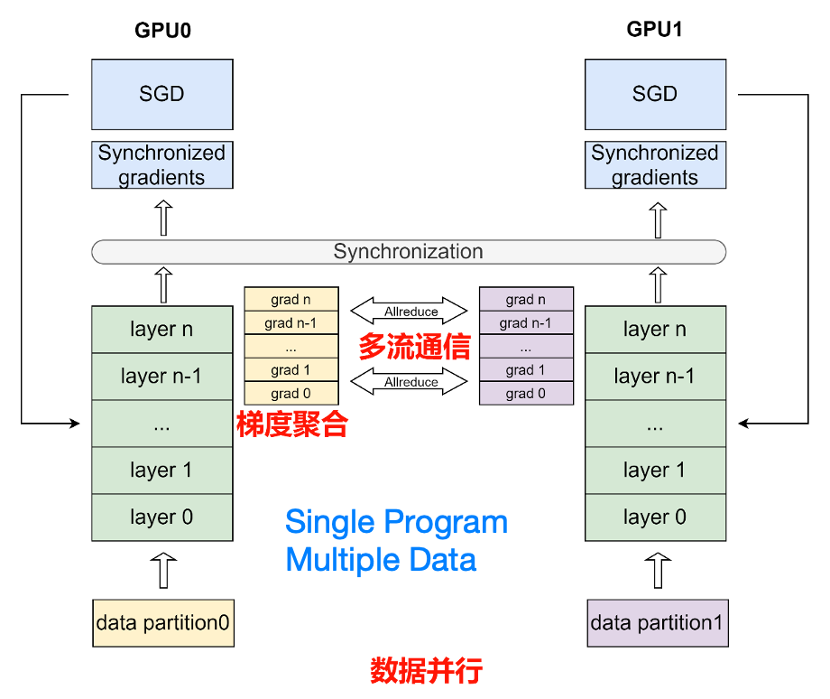
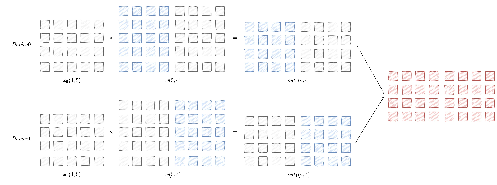
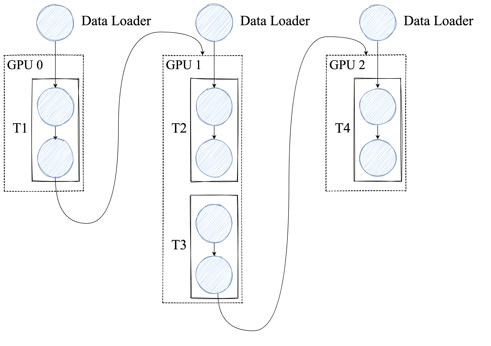
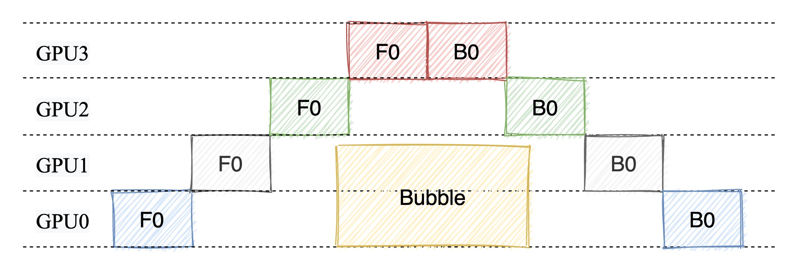
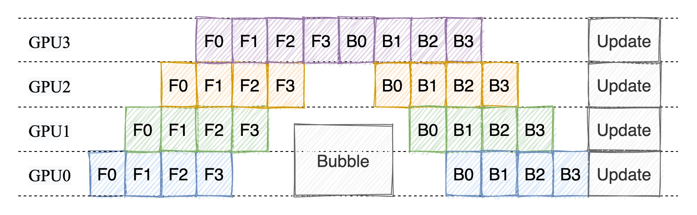
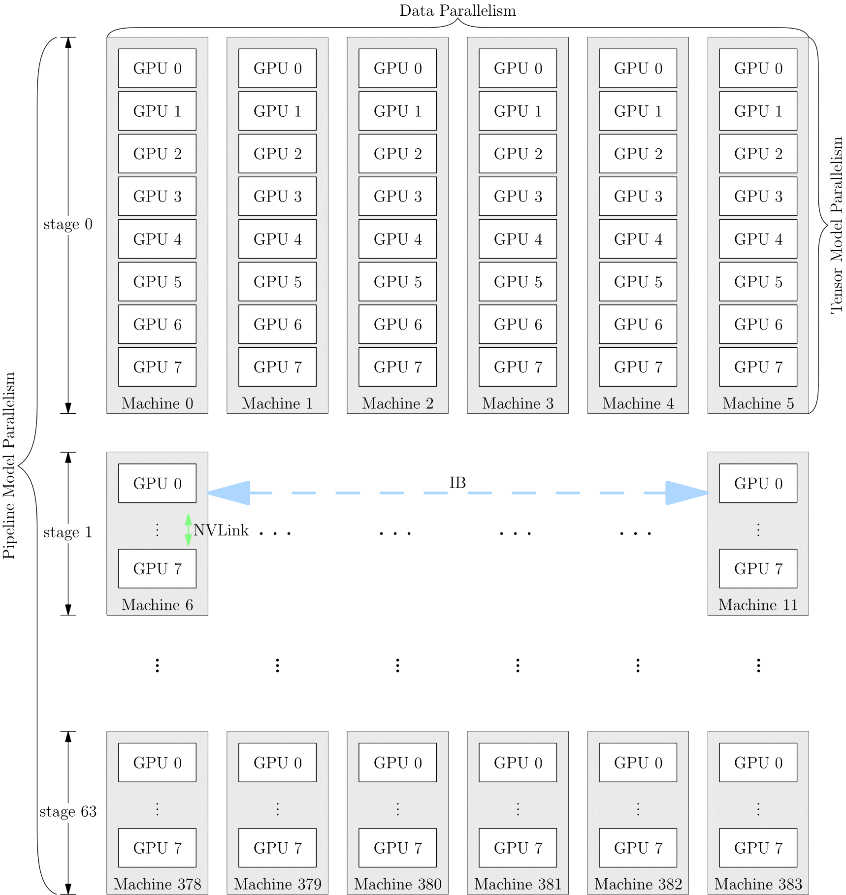
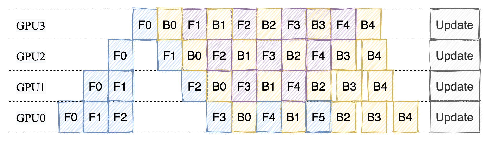
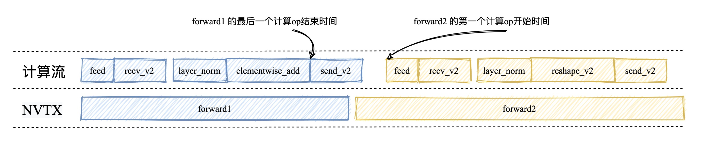
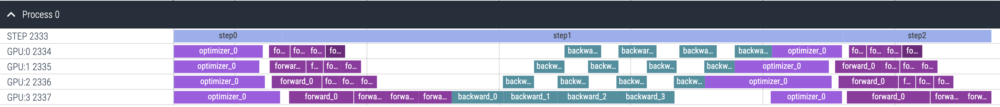

# Paddle静态图并行编排与执行流程

> 访问 [Sonder 的笔记本](https://space.keter.top/docs/high_performance/%E5%88%86%E5%B8%83%E5%BC%8F/Paddle%E5%B9%B6%E8%A1%8C%E7%BC%96%E6%8E%92%E4%B8%8E%E6%89%A7%E8%A1%8C) 获得更好的阅读体验

## 分布式集合通信模式

集合通信模型适合处理CV/NLP领域这样具有稠密参数的模型。它有多种方式将数据/模型切分到多个设备上。每个设备可以成为一个Worker，每个Worker都需要及时的知道全局梯度信息。这样的话，每个Worker都需要将自己的梯度信息发送给其他的Worker，同时也需要接收其他Worker的梯度信息。这样的通信方式就是集合通信模式。

集合通信有好几种并行方式：

- 数据并行
- 模型并行
- 流水线并行
- 混合并行

下面我们分别进行介绍：

### 数据并行

纯数据并行模式下数据集被平均分为多份，每个卡上保存完整的模型参数并独立处理一份子数据集，以加速模型训练过程。

> 数据并行适用于模型参数较少的情况，一张卡可以放下完整的模型参数。这样的策略能让我们增加batch_size，加快训练速度


下图详细的说明了纯数据并行的训练流程：

  


如图数据集平均分为多份 `data partition1` 和 `data partition2` ，每个卡上保存完整的模型参数并独立处理一份子数据集，以加速模型训练过程。在数据并行训练过程中，每个卡上的输入数据是不同的。各个卡独立地执行网络的前向运算和反向计算，计算出各自卡上的参数梯度。随后，使用 AllReduce 等集合通信原语，将各个卡上计算出的参数梯度进行累加聚合，得到最终的全局参数梯度。最后，全局参数梯度进入优化器进行参数更新，完成一个完整的 mini-batch 训练流程。图中的箭头表示了各个卡之间的通信过程。

> 集合通信原语是集合通信的基础操作的集合，如广播（Broadcast）、收集（Gather）、分散（Scatter）、规约（Reduce）等。其中规约是指将集群内多个节点将数据发送给一个节点，这个节点会使用接收到的数据集中运算，如累加、累积、均值、方差等等。而上文提到的 AllReduce 则是指多对多的规约，即有多个数据发送节点和多个数据接收节点，所有节点的规约运算结果会广播到所有节点上。

当数据集较大，模型较小时，由于反向过程中为同步梯度产生的通信代价较小，此时选择数据并行一般比较有优势，常见的视觉分类模型，如 ResNet50，比较适合采用数据并行。

### 模型并行

在模型参数较多的情况下，一张卡无法放下完整的模型参数，这时候就需要将模型参数切分到多张卡上,让我们先通过一张图了解一下模型并行的原理：

  

模型并行的情况下每个设备上的数据都是一样的，只有模型被拆分到了各个设备上。每个设备只拥有模型的一部分，所有计算设备上的模型拼在一起，才是完整的模型。

如图想要得到最终的计算结果需要将 `Device0` 和 `Device1` 的计算结果进行拼接后才能得到最终的计算结果。

### 流水并行

#### 朴素流水并行

流水线并行是模型并行的一种，其原理是把模型的不同层放置在不同卡上运行，参数也按层分配到不同的卡上，以降低模型的显存占用。

如下图所示，网络共包含 4 层，我们可以把第 0 层放置在卡 0 上运行，第 1 层和第 2 层放置在卡 1 上运行，第 4 层放置在卡 2 上运行。在训练过程中，卡 0 接收输入数据进行计算，并将计算结果发送给卡 1；卡 1 接收到卡 0 的计算结果后进行计算，并将计算结果发送给卡 2；卡 2 接收到卡 1 的计算结果后进行计算，得到损失函数值，完成前向计算。反向计算逻辑与前向刚好相反。 这个过程就像是流水线一样，每个卡都在处理不同的数据，从而提高了训练效率。

  


> 朴素流水并行的缺点：
> 
> 在任意给定时刻，除了一个 GPU 之外的其他所有 GPU 都是空闲的。因此，如果使用 4 个 GPU，则几乎等同于将单个 GPU 的内存量增加四倍，而其他资源 (如计算) 相当于没用上。所以，朴素流水线存在很多的Bubble。因此，朴素的流水线并行将会导致GPU使用率过低。

  


#### 微批次流水线并行

微批次流水线并行是指将一个训练迭代划分为多个子阶段，每个子阶段都是一个微批次，每个微批次都会在不同的设备上进行计算。在每个子阶段中，每个设备都会计算出一个梯度，然后将这些梯度进行累加，得到最终的梯度，最后使用这个梯度更新模型参数。

  


### 混合并行

混合并行是指同时使用数据并行和流水线并行的方式，以 GPT-3 为例，以下是它训练时的设备并行方案：

它首先被分为 64 个阶段，进行流水并行。每个阶段都运行在 6 台 DGX-A100 主机上。在6台主机之间，进行的是数据并行训练；每台主机有 8 张 GPU 显卡，同一台机器上的8张 GPU 显卡之间是进行模型并行训练$^{[1]}$。

  


## Paddle静态图流水并行

在Paddle的静态图在流水线并行中,一个训练迭代通常被划分为三个子阶段也就是被划分为三个 micro-batch：

- Forward: 前向计算,每个阶段计算并输出中间结果给下一个阶段;
- Backward: 反向传播,每个阶段根据上一个阶段的梯度计算并传递当前阶段的梯度;
- Optimize: 参数更新,收集所有阶段的梯度并更新模型参数。

Paddle目前已经实现的流水线编排方式有两种，分别是：FThenB和1F1B。下面我们分别进行介绍：

### FThenB 编排模式

`FThenB` 的编排模式也就是上面说到的微批次流水线并行，之所以叫做 `FThenB` 是因为在这种编排模式下，每个设备先执行前向计算，然后再执行反向传播。不等待所有设备都执行完前向计算，就开始执行反向传播。

`FThenB` 的编排模式将 mini-batch 细分为多个更小的 micro-batch（微批），送入GPU进行训练，来提高并行程度。但是这样做也有一个坏处就是，那就是把 batch 拆小了之后，对于那些需要统计量的层（如：Batch Normalization），就会导致计算变得麻烦，需要重新实现。而且 `Fthen-B` 模式由于缓存了多个 micro-batch 的中间变量和梯度，显存的实际利用率并不高。

### FThenB 相关代码解读

在初始化 engine 类的时候会传入 `strategy` 参数，这个参数是一个 `auto.Strategy` 类的实例，用于配置流水线并行的策略。在 Strategy 类中，有一个 `pipeline` 属性，用于指定流水并行的编排模式。

在 Parallelizer 执行 `parallel` 时候会在 `_apply_post_optimization` 中将编排模式（schedule_mode）保存到 `main_program._pipeline_opt["standalone_opt"]` 中。这个属性会在 ExecutorCache 中的 `_get_program_and_executor` 中被读取，用于编排Program。下面是相关代码：

```python
# python/paddle/base/executor.py
new_program = program.clone()
if (
    new_program._pipeline_opt
    and "standalone_opt" in new_program._pipeline_opt
):
    from paddle.distributed.passes.pipeline_scheduler_pass import (
        apply_pass,
    )

    standalone_opt = new_program._pipeline_opt["standalone_opt"]
    pass_name = standalone_opt["schedule_mode"]
    plan = apply_pass(
        new_program, new_program, pass_name, standalone_opt
    )
```

在 `apply_pass` 中会调用 `FThenB` 或者 `1F1B` 的编排策略，将 `main_program` 切分成多个子 Program。下面是 `apply_pass` 的相关代码：

```python 
def apply_pass(main_program, startup_program, pass_name, pass_attr={}):
    assert pass_name in [
        "FThenB",
        "1F1B",
        "Eager1F1B",
    ], f"pipeline scheduler only support FThenB, 1F1B and Eager1F1B, but recieve {pass_name}"

    if pass_name == "1F1B":
        pass_attr["enable_backward_forward_overlap"] = int(
            os.environ.get("FLAGS_1f1b_backward_forward_overlap", 0)
        )

    # 初始化 pipeline_scheduler pass
    pipeline_pass = new_pass("pipeline_scheduler_" + pass_name, pass_attr)
    pass_context = PassContext()
    # 编排的主要入口
    pipeline_pass.apply([main_program], [startup_program], pass_context)
    # 获取编排后的 plan
    plan = pass_context.get_attr("plan")
    return plan
```

编排的主要入口是 `pipeline_pass.apply`，`FThenB` 和 `1F1B` 的核心代码在 `pipeline_scheduler_pass.py` 中，其中还使用了一些继承类。下面我们先来梳理一下类之间的继承关系。其中主要涉及到的类包括：PassBase、PipelinePassBase、PipelineFThenBPass和Pipeline1F1BPass。

PassBase 是所有Pass的基类，PipelinePassBase 是所有流水线编排Pass的基类，PipelineFThenBPass 和 Pipeline1F1BPass 分别是 FThenB 和 1F1B 的编排Pass。

```python
PassBase - PipelinePassBase - PipelineFThenBPass
                            - Pipeline1F1BPass
```

在 PassBase 中定义了 `apply` 方法，`apply` 来方法中又进一步封装了 `_apply_impl` 和 `_apply_single_impl` 方法。PipelinePassBase 中重写了 `_apply_single_impl` 方法:

```python 
# python/paddle/distributed/passes/pipeline_pass_base.py
def _apply_single_impl(self, main_program, startup_program, context):
    """
    执行并行计算的具体实现逻辑

    Args:
        main_program (Program): 主Program。
        startup_program (Program): 启动Program。
        context (PassContext): Pass的上下文信息。
    """
    # 获取到拆分后的子Program和对应的类型
    job_types, sub_programs = self._partial_programs(main_program)

    jobs = self._create_job_list()

    type_to_program = dict(zip(job_types, sub_programs))
    set_skip_gc_vars(
        self.get_attr("num_micro_batches"), type_to_program, jobs
    )

    for type in type_to_program.keys():
        type_to_program[type] = type_to_program[type].desc
    plan = core.Plan(jobs, type_to_program)
    context.set_attr("plan", plan)
```

可以看到进行编排的核心逻辑在 `_partial_programs` 和 `_create_job_list` 中，不同的编排策略会有不同的实现。下面我们来看看 `FThenB` 和 `1F1B` 的实现。

FThenB 编排的实现逻辑在 PipelineFThenBPass 类中实现，它继承自 PipelinePassBase 类。PipelineFThenBPass 中重写了 `_partial_programs` 和 `_create_job_list` 方法。 `_partial_programs` 方法的实现逻辑如下

```python
# python/paddle/distributed/passes/pipeline_scheduler_pass.py
def _partial_programs(self, program):
    """
    将主Program进行拆分，还可以实现前向和后向的计算任务重叠以提高计算效率。

    Args:
        program (Program): 主Program。

    Returns:
        tuple: 包含两个列表，第一个列表包含子Program的类型（如LR、FORWARD、BACKWARD、OPT），第二个列表包含相应的子Program。
    """
    # 注意：标志 "enable_send_recv_overlap" 可能会增加GPU的保留内存。
    enable_send_recv_overlap = self.get_attr("enable_send_recv_overlap")
    types = [LR, FORWARD, BACKWARD, OPT]

    # 获取前向和后向子Program的列表
    sub_program_list = _program_for_fthenb_and_1f1b(
        program, enable_send_recv_overlap
    )
    return types, sub_program_list
```

其中 `_program_for_fthenb_and_1f1b` 的主要作用是将主Program进行拆分，还可以实现前向和后向的计算任务重叠以提高计算效率。 这里我们暂时不讨论任务重叠的实现，只关注拆分的实现逻辑。下面是 `_program_for_fthenb_and_1f1b` 的实现逻辑：

```python
# python/paddle/distributed/passes/pipeline_scheduler_pass.py
def _program_for_fthenb_and_1f1b(program, enable_send_recv_overlap=False):
    # 为fthenb和1f1bProgram创建子Program列表

    if enable_send_recv_overlap:
        # 如果启用了发送接收操作的重叠，调用函数以进行重叠
        _overlap_send_recv(program)
    else:
        # 否则，插入同步操作以确保顺序执行
        _insert_sync_for_fthenb_1f1b(program)

    # 创建四个子Program，分别用于LR、FORWARD、BACKWARD和OPT任务
    lr_prog = Program()
    fwd_prog = Program()
    bwd_prog = Program()
    opt_prog = Program()

    # 分割Program并将操作添加到各个子Program中
    def _split_ops(block):
        # 根据操作的角色将操作分成四类：LR、FORWARD、BACKWARD和OPT
        lr_ops = []
        fwd_ops = []
        bwd_ops = []
        opt_ops = []
        for op in src_block.ops:
            if is_lr_sched_op(op):
                lr_ops.append(op)
            elif is_forward_op(op):
                fwd_ops.append(op)
            elif is_backward_op(op):
                bwd_ops.append(op)
            elif is_optimize_op(op):
                opt_ops.append(op)
            else:
                raise ValueError(
                    "The op role: "
                    + str(op.attr('op_role'))
                    + " isn't one of LRSched, Forward, Backward or Optimizer."
                )
        return lr_ops, fwd_ops, bwd_ops, opt_ops

    def _add_ops_into_block(src_block, dst_block, ops):
        # 将操作添加到指定的子Program块中
        for op in ops:
            _create_program(src_block, dst_block, op)

    for idx, src_block in enumerate(program.blocks):
        # 遍历主Program的块
        lr_ops, fwd_ops, bwd_ops, opt_ops = _split_ops(src_block)
        if idx == 0:
            # 对于第一个块，添加LR、FORWARD、BACKWARD和OPT操作到相应子Program块
            lr_block = lr_prog.block(0)
            _add_ops_into_block(src_block, lr_block, lr_ops)

            fwd_block = fwd_prog.block(0)
            _add_ops_into_block(src_block, fwd_block, fwd_ops)

            bwd_block = bwd_prog.block(0)
            _add_ops_into_block(src_block, bwd_block, bwd_ops)

            opt_block = opt_prog.block(0)
            _add_ops_into_block(src_block, opt_block, opt_ops)
        else:
            if len(lr_ops):
                # 对于后续块，如果有LR操作，创建新的LR子Program块并将LR操作添加到其中
                lr_block = lr_prog._create_block(
                    parent_idx=src_block.parent_idx
                )
                lr_block._set_forward_block_idx(src_block.forward_block_idx)
                _add_ops_into_block(src_block, lr_block, lr_ops)

            if len(fwd_ops):
                # 同样，为FORWARD操作创建新子Program块
                fwd_block = fwd_prog._create_block(
                    parent_idx=src_block.parent_idx
                )
                fwd_block._set_forward_block_idx(src_block.forward_block_idx)
                _add_ops_into_block(src_block, fwd_block, fwd_ops)

            if len(bwd_ops):
                # 为BACKWARD操作创建新子Program块
                bwd_block = bwd_prog._create_block(
                    parent_idx=src_block.parent_idx
                )
                bwd_block._set_forward_block_idx(src_block.forward_block_idx)
                _add_ops_into_block(src_block, bwd_block, bwd_ops)

            if len(opt_ops):
                # 为OPT操作创建新子Program块
                opt_block = opt_prog._create_block(
                    parent_idx=src_block.parent_idx
                )
                opt_block._set_forward_block_idx(src_block.forward_block_idx)
                _add_ops_into_block(src_block, opt_block, opt_ops)

        for fetch_op in src_block.ops:
            if fetch_op.type in ["fetch", "fetch_v2"]:
                in_name = fetch_op.input_arg_names[0]
                dst_block = None
                for block in [lr_block, fwd_block, bwd_block, opt_block]:
                    if block._find_var_recursive(in_name):
                        dst_block = block
                        break
                if dst_block:
                    _create_program(src_block, dst_block, fetch_op)

    lr_prog._sync_with_cpp()
    fwd_prog._sync_with_cpp()
    bwd_prog._sync_with_cpp()
    opt_prog._sync_with_cpp()

    lr_prog._rollback()
    fwd_prog._rollback()
    bwd_prog._rollback()
    opt_prog._rollback()

    # 返回四个子Program，依次为LR、FORWARD、BACKWARD和OPT
    return [lr_prog, fwd_prog, bwd_prog, opt_prog]
```

其中 `_insert_sync_for_fthenb_1f1b` 的作用是插入同步操作，以实现"F-Then-B"和"1F-1B"流水线并行模式。插入同步操作的主要目的是确保在流水线并行训练中各个阶段（前向传播、后向传播、优化等）的计算流和通信流之间能够协同工作，以保持数据的一致性和正确性。这里我们不做详细介绍，感兴趣的小伙伴可以自行阅读源码 ([_insert_sync_for_fthenb_1f1b](https://github.com/AndSonder/Paddle/blob/1e7798fb1a0f1fdba48c006a17b30303aec8df57/python/paddle/distributed/passes/pass_utils.py#L409-L514))。

`_program_for_fthenb_and_1f1b` 剩下的主要逻辑就是将主Program进行拆分，然后将操作添加到各个子Program中，我们一共有四个子Program，分别用于LR、FORWARD、BACKWARD和OPT任务。

在获得了 `job_types` 和 `sub_programs` 之后，我们就可以调用 `_create_job_list` 方法来创建 Job 列表。下面是 `_create_job_list` 的实现逻辑：

```python
# python/paddle/distributed/passes/pipeline_scheduler_pass.py
def _create_job_list(self):
    """
    创建前向-后向流水线并行计算任务的任务列表。

    Returns:
        list: 包含不同类型计算任务的列表，如LR、FORWARD、BACKWARD、OPT。
    """
    # 获取micro-batch的数量，通常由外部传递给流水线并行计算。
    num_micro_batches = self.get_attr("num_micro_batches")

    # 创建一个空的任务列表，用于存储不同类型的计算任务。
    job_list = []

    # 创建LR（学习率计算）任务，并将其添加到任务列表中。
    lr_job = core.Job(LR)
    job_list.append(lr_job)

    # 为每个micro-batch创建前向计算任务。
    for i in range(num_micro_batches):
        forward_job = core.Job(FORWARD)
        forward_job.set_micro_batch_id(i)
        job_list.append(forward_job)

    # 为每个micro-batch创建后向计算任务。
    for i in range(num_micro_batches):
        backward_job = core.Job(BACKWARD)
        backward_job.set_micro_batch_id(i)
        job_list.append(backward_job)

    # 创建一个优化任务，通常在所有micro-batch计算后执行。
    opt_job = core.Job(OPT)
    opt_job.set_micro_batch_id(0)  # 通常只有一个优化任务，所以micro-batch次ID为0
    job_list.append(opt_job)

    # 返回包含不同类型计算任务的任务列表。
    return job_list
```

由于 `FThanB` 编排策略就是在所有的 Forward 计算完成之后才会进行 Backward 计算，所以在 `_create_job_list` 中，我们会为每个 micro-batch 创建前向计算任务和后向计算任务。最后添加一个优化任务。 在获取了jobs之后，我们就可以将它们添加到 `plan` 中，然后返回 `plan`。

```python
# python/paddle/distributed/passes/pipeline_scheduler_pass.py
def _apply_single_impl(self, main_program, startup_program, context):
    ...
    plan = core.Plan(jobs, type_to_program)
    context.set_attr("plan", plan)
```

> jobs 和 type_to_program 之间的关系是怎样的？
> 
> jobs 是一个列表，包含了不同类型的计算任务，如 LR、FORWARD、BACKWARD、OPT。type_to_program 是一个字典，key 是计算任务的类型，value 是对应的子Program。


### 1F1B 编排模式

在 `1F1B` 的编排模式下，每个设备先执行前向计算，然后再执行反向传播。不等待所有设备都执行完前向计算，就开始执行反向传播。

  


1F1B 示例如图所示，以 GPU3 的 F1（GPU3 的第 2 个 micro-batch 的前向计算）为例，F1 在计算前，F1 的反向 B1（GPU3 的第 1 个 micro-batch 的反向计算）已经计算结束，即可释放 F1 的中间变量，从而 F2 可以复用 F1 中间变量的显存。

有研究文献表明，`1F1B`` 方式相比于 `FthenB` 方式，峰值显存可以节省 37.5%，对比朴素流水线并行峰值显存明显下降，设备资源利用率显著提升。

### 1F1B 相关代码解读

1F1B 的编排策略顾名思义就是一个Forward之后跟一个Backward，这里的Forward和Backward都是指一个 micro-batch 的计算。1F1B 编排的实现逻辑在 Pipeline1F1BPass 类中实现，它继承自 PipelinePassBase 类。Pipeline1F1BPass 中重写了 `_partial_programs` 和 `_create_job_list` 方法。 `_partial_programs` 方法的实现逻辑如下

```python
def _partial_programs(self, program):
    # 获取 "enable_send_recv_overlap" 标志，该FLAG可能增加显存消耗。
    enable_send_recv_overlap = self.get_attr("enable_send_recv_overlap")

    # 定义计算任务的类型列表，包括 LR、FORWARD、BACKWARD 和 OPT。
    types = [LR, FORWARD, BACKWARD, OPT]

    # 调用 _program_for_fthenb_and_1f1b 函数，根据输入的 program 和 enable_send_recv_overlap 创建子程序。
    sub_programs = _program_for_fthenb_and_1f1b(program, enable_send_recv_overlap)

    # 获取 "enable_backward_forward_overlap" 标志，用于确定是否启用前向传播和后向传播之间的交叠。
    enable_backward_forward_overlap = self.get_attr("enable_backward_forward_overlap")

    if enable_backward_forward_overlap:
        # 如果启用了前向传播和后向传播之间的交叠，记录日志以指示启用。
        logger.info("Backward forward overlap enabled in 1F1B.")

        # 从子程序列表中获取前向传播和后向传播的程序。
        forward_program, backward_program = sub_programs[1], sub_programs[2]

        # 调用 _backward_forward_overlap 方法，将前向传播和后向传播的程序进行重组，
        # 以确保它们可以正确地交替执行。
        (
            splitted_backward_job_types,
            splitted_backward_programs,
            splitted_forward_job_types,
            splitted_forward_programs,
        ) = self._backward_forward_overlap(backward_program, forward_program)

        # 更新计算任务的类型列表和子程序列表，将交叠后的任务类型和程序添加进去。
        types += splitted_forward_job_types + splitted_backward_job_types
        sub_programs += (
            splitted_forward_programs + splitted_backward_programs
        )

    for i in range(len(types)):
        logger.debug(
            f"type = {types[i]}, sub_programs = {sub_programs[i]}\n"
        )
    
    # 记录调试信息，打印在稳定阶段执行的计算任务类型。
    logger.debug(f"jobs_in_stable_phase = {self.jobs_in_stable_phase}")

    # 返回计算任务类型列表和相应的子程序列表。
    return types, sub_programs
```

这里面的 `_backward_forward_overlap` 主要是用于实现前向传播和后向传播之间的交叠，是1F1B调度的优化算法。我们这里不做详细介绍，感兴趣的小伙伴可以自行阅读源码。除了 `_backward_forward_overlap` 之外，1F1B 的 `_partial_programs` 和 FThenB 的 `_partial_programs` 逻辑是一样的，都是调用 `_program_for_fthenb_and_1f1b` 函数，根据输入的 program 和 enable_send_recv_overlap 创建子Program。

下面我们来看看 `_create_job_list` 的实现逻辑：

```python
# python/paddle/distributed/passes/pipeline_scheduler_pass.py
def _create_job_list(self):
    num_micro_batches = self.get_attr("num_micro_batches")
    pp_stage = self.get_attr("pp_stage")
    pp_degree = self.get_attr("pp_degree")

    job_list = []
    lr_job = core.Job(LR)
    job_list.append(lr_job)

    # 确保micro-batch数大于等于计算任务的度数
    assert (
        pp_degree <= num_micro_batches
    ), "Num of micro batches should larger than or equal to pp degree."

    micro_batch_in_warmup = pp_degree - pp_stage
    micro_batch_in_1f1b = num_micro_batches - micro_batch_in_warmup

    # 预热阶段
    forward_micro_batch_id = 0
    for i in range(micro_batch_in_warmup):
        forward_job = core.Job(FORWARD)
        forward_job.set_micro_batch_id(forward_micro_batch_id)
        job_list.append(forward_job)
        forward_micro_batch_id += 1

    backward_micro_batch_id = 0
    for i in range(micro_batch_in_1f1b):
        # 为稳定阶段中的每个计算任务（BACKWARD和FORWARD）创建对应的任务
        # 每个micro-batch中都有一个BACKWARD和一个FORWARD计算任务
        for job_type in self.jobs_in_stable_phase:
            job = core.Job(job_type)
            micro_batch_id = (
                forward_micro_batch_id
                if job_type.startswith(FORWARD)
                else backward_micro_batch_id
            )
            job.set_micro_batch_id(micro_batch_id)
            job_list.append(job)
        forward_micro_batch_id += 1
        backward_micro_batch_id += 1

    for i in range(micro_batch_in_warmup):
        backward_job = core.Job(BACKWARD)
        backward_job.set_micro_batch_id(backward_micro_batch_id)
        job_list.append(backward_job)
        backward_micro_batch_id += 1

    # 创建优化任务
    opt_job = core.Job(OPT)
    opt_job.set_micro_batch_id(0)
    job_list.append(opt_job)
    return job_list
```


可以看到，1F1B 的 `_create_job_list` 和 FThenB 的逻辑略有不同，1F1B 的 `_create_job_list` 中会根据 `pp_stage` 和 `pp_degree` 来确定前向计算任务和后向计算任务的数量。在稳定阶段中，每个 micro-batch 中都有一个 BACKWARD 和一个 FORWARD 计算任务。最后添加一个优化任务。

> 预热过程是什么？
> 
> 根据1F1B的流水编排图可以发现，在训练刚刚开始的时候，gpu中会有很大的空闲，这个时候任务的执行> 顺序不是完全按照1F1B的编排方式，预热阶段就是对应这个过程。


### 流水并行执行过程

没启动多卡训练的时候，paddle的训练命令类似于：

```bash
python -m paddle.distributed.launch --gpus 0,1,2,3 train.py
```

这个 `paddle.distributed.launch` 模块会启动多个进程，每个进程都会执行 `train.py`，并且会传入不同的环境变量，用于指定当前进程的角色和进程数量。下面分析一下每个进程里面上面拆分出来的job是如何执行的。

在获取到编排好的 `job_list` 之后，我们就可以初始化 `Executor` 对象，然后执行 `Executor` 的 `run` 方法。下面是初始化 `StandaloneExecutor` 对象的代码：

```python
# python/paddle/base/executor.py
new_program = program.clone()
if (
    new_program._pipeline_opt
    and "standalone_opt" in new_program._pipeline_opt
):
    from paddle.distributed.passes.pipeline_scheduler_pass import (
        apply_pass,
    )

    standalone_opt = new_program._pipeline_opt["standalone_opt"]
    pass_name = standalone_opt["schedule_mode"]
    plan = apply_pass(
        new_program, new_program, pass_name, standalone_opt
    )
else:
    ...
    plan = core.Plan([default_job], type_to_program)

new_exe = _StandaloneExecutor(place, plan, scope)
return new_program, new_exe
```

其中的核心代码 `apply_pass` 在上面已经介绍过了。 在 `apply_pass` 中会调用 `FThenB` 或者 `1F1B` 的编排策略，将 `main_program` 切分成多个子 Program。

_StandaloneExecutor 是C++端的一个类，下面是它的构造函数：

```cpp
StandaloneExecutor::StandaloneExecutor(const platform::Place& place,
                                       const interpreter::Plan& plan,
                                       Scope* scope)
    : place_(place), plan_(plan), scope_(scope) {
  // 获取计划中micro-batch的数量。
  int64_t micro_batch_num = plan_.MicroBatchNum();

  // 调整待等待的强制事件向量的大小，以匹配micro-batch的数量。
  vec_force_events_to_wait_.resize(micro_batch_num);

  // 为每个micro-batch创建新的 Scope，并将其存储在 micro_batch_scopes_ 中。
  for (int64_t i = 0; i < micro_batch_num; ++i) {
    micro_batch_scopes_.emplace_back(&scope->NewScope());
  }

  // 创建一个用于日志记录的字符串流，显示micro-batch的创建。
  std::stringstream ss;
  ss << "Create " << micro_batch_num << " micro_batch_scopes for scope "
     << scope_ << " : ";
  for (Scope* scope : micro_batch_scopes_) {
    ss << scope << ", ";
  }
  VLOG(6) << ss.str();

  // 获取计划中的所有Job
  const auto& jobs = plan_.JobList();

  // 对每个Job执行以下操作。
  for (const auto& job : jobs) {
    const std::string& job_type = job->Type();
    std::shared_ptr<ProgramDesc> program = nullptr;
    std::shared_ptr<::pir::Program> ir_program = nullptr;

    if (FLAGS_enable_pir_api || FLAGS_enable_new_ir_in_executor) {
      ir_program = plan_.IrProgram(job_type);
    } else {
      program = std::make_shared<ProgramDesc>(*(plan_.Program(job_type)));
    }

    int64_t micro_batch_id = job->MicroBatchId();

    // 检查micro-batch ID 是否在合理范围内。
    PADDLE_ENFORCE(
        micro_batch_id >= 0 && micro_batch_id < micro_batch_num,
        phi::errors::Unavailable("The micro batch id (%lld) out of bound, "
                                 "which should be in the range of [0, %lld].",
                                 micro_batch_id,
                                 micro_batch_num));

    // 如果存在多个micro-batch并且未启用 PIR API，则设置 Feed 和 Fetch 操作的列属性。
    if (micro_batch_num > 1 && !FLAGS_enable_pir_api) {
      SetColAttrForFeedFetchOps(program, micro_batch_num, micro_batch_id);
    }

    interpreter::ExecutionConfig execution_config;
    execution_config.create_local_scope = false;
    execution_config.skip_gc_vars = job->SkipGcVars();

    // 当前仅支持 CPU。
    // 如果启用新 IR，创建一个包含计算的 IR 程序并将其更新为计划。
    if (FLAGS_enable_new_ir_in_executor) {
      ... // 新IR相关代码暂不讨论
    } else {
      // 创建 InterpreterCore 并将其存储在 interpretercores_ 中。
      interpretercores_.emplace_back(
          std::make_shared<InterpreterCore>(place_,
                                            program->Block(0),
                                            micro_batch_scopes_[micro_batch_id],
                                            execution_config));
      interpretercores_.back()->SetCopyProgram(program);

      auto prog_inter = const_cast<ProgramInterpreter*>(
          static_cast<const ProgramInterpreter*>(
              interpretercores_.back()->Impl()));
      prog_inter->SetForceEventsToWaitInfo(
          &(vec_force_events_to_wait_[micro_batch_id]));

      ...
      }
    }
  }
}
```

在初始化的时候，Paddle会为每个job都创建一个 `InterpreterCore` 对象，然后将这些 `InterpreterCore` 对象存储在 `interpretercores_` 中。在后续的执行过程中，Paddle会根据不同job执行不同 `InterpreterCore` 对象。初始化了StandaloneExecutor对象之后，我们就可以执行 `run` 方法了。下面是 C++ 端 `run` 方法的实现逻辑：

```cpp
paddle::framework::FetchList StandaloneExecutor::Run(
    const std::vector<std::string>& feed_names,
    const bool enable_job_schedule_profiler) {
  // 创建一个事件记录器，用于跟踪 StandaloneExecutor::run 方法的执行。
  platform::RecordEvent record_event(
      "StandaloneExecutor::run", platform::TracerEventType::UserDefined, 1);

  // 获取计划中的所有作业。
  const auto& jobs = plan_.JobList();

  // 用于跟踪不同类型的作业的第一个出现位置的映射。
  std::map<std::string, size_t> type_to_first_id;

  // 如果共享构建结果的标志为假，执行以下操作。
  if (!is_interpretercore_build_result_shared_) {
    // 为第一个作业设置其类型的映射，并确保所有其他相同类型的作业共享工作队列。
    type_to_first_id[jobs[0]->Type()] = 0;
    for (size_t job_idx = 1; job_idx < jobs.size(); ++job_idx) {
      interpretercores_[job_idx]->ShareWorkQueueFrom(interpretercores_[0]);
      if (type_to_first_id.count(jobs[job_idx]->Type()) == 0) {
        type_to_first_id[jobs[job_idx]->Type()] = job_idx;
      }
    }
    // 将共享构建结果的标志设置为真。
    is_interpretercore_build_result_shared_ = true;
  }

  // 迭代所有作业。
  for (size_t job_idx = 0; job_idx < jobs.size(); ++job_idx) {
    const auto& job = jobs[job_idx];
    const std::string& job_type = job->Type();

    // 创建一个事件记录器，用于跟踪每个作业的执行。
    platform::RecordEvent record_event(
        job_type + "-" + std::to_string(job->MicroBatchId()),
        platform::TracerEventType::UserDefined,
        1);

    // 记录详细日志，显示作业的索引、类型和micro-batch ID。
    VLOG(6) << "Run job (" << job_idx << "), type = " << job_type
            << ", micro_batch_id =" << job->MicroBatchId();

    // 如果作业类型已经在 type_to_first_id 中，且未启用新 IR，则共享构建结果。
    if (type_to_first_id.count(job_type) != 0 &&
        !FLAGS_enable_new_ir_in_executor) {
      interpretercores_[job_idx]->ShareBuildResultsFrom(
          interpretercores_[type_to_first_id[job_type]]);
    }

    // 如果作业的数量大于 1 且作业类型不是 "forward"，则运行作业（使用一个空的临时feed名称列表）。
    // 否则，运行作业并传递真正的 feed 名称列表。
    if (jobs.size() > 1 && job_type != "forward") {
      const std::vector<std::string> tmp_feed_names = {};
      interpretercores_[job_idx]->Run(tmp_feed_names, /*need_fetch = */ false);
    } else {
      interpretercores_[job_idx]->Run(feed_names, /*need_fetch = */ false);
    }
  }

  // 记录每个作业的运行时间，如果启用了 CUDA 且自动并行分析器被激活。
#if defined(PADDLE_WITH_CUDA)
  if (enable_job_schedule_profiler) {
    for (size_t job_idx = 0; job_idx < jobs.size(); ++job_idx) {
      const auto& job = jobs[job_idx];
      const std::string& job_type = job->Type();
      double start_time, end_time;
      std::tie(start_time, end_time) =
          interpretercores_[job_idx]->InterpreterRunTime();

      // Note(sonder): Used to record the runtime of each job in order to
      // generate a parallel pipeline timeline. Job runtime information can be
      // extracted from the logs using the scripts "profiler_helper_static.py".
      // Do not modify, as it may affect the results of regular expression
      // matching.
      VLOG(0) << "Profiler Info: Job (" << job->MicroBatchId()
              << "), type = " << job_type
              << ", micro_batch_id = " << job->MicroBatchId()
              << ", job_start_time = " << std::to_string(start_time)
              << ", job_end_time = " << std::to_string(end_time);
    }
  }
#endif

  // 返回 Fetch Tensors，根据是否启用新 IR 采取不同的操作。
  if (FLAGS_enable_new_ir_in_executor) {
    // 创建一个 FetchList，包含需要获取的张量。
    framework::FetchList fetch_res;
    for (auto& var_name : fetch_var_names_) {
      auto* var = scope_->FindVar(var_name);
      fetch_res.push_back(var->Get<phi::DenseTensor>());
    }

    return fetch_res;
  } else {
    // 获取 "interpreter::kFetchVarName" 变量，其中包含需要返回的 Fetch Tensors。
    auto* fetch_var = scope_->FindVar(interpreter::kFetchVarName);
    if (fetch_var) {
      return std::move(*fetch_var->GetMutable<framework::FetchList>());
    } else {
      return {};
    }
  }
}
```

## 流水并行可视化工作

### 工作背景

当下大模型的训练时间较长，分布式训练时序图的可视化对于调试和分析模型的训练过程非常重要。当下没有工具能够直接给出各个GPU设备上不同Job的运行区间，因此我们需要设计一个可视化工具来实现这个功能。

当下的工作大多是可视化出cpu端的各个Job的运行区间。由于gpu任务的异步性，在cpu端启动的Job并不一定在gpu端立即执行，因此**cpu端的可视化并不能直接反映出gpu端的运行情况**。

  


### 可视化实现思路

我们的可视化工具的实现思路是：**在gpu端各个Job结束的时候，打印出Job的类型和结束时间，然后在使用python脚本这些信息，绘制出各个Job的运行区间**。

  


### 准确定位Job的开始与结束时间

Paddle中所有的计算任务都是在一个流上完成的，这个流我们叫做计算流。为了能够准确定位Job的开始与结束，我们需要找到每个Job中第一个计算算子，和最后一个计算算子，并在第一个计算算子之前插入一个 `cuda stream callback` ，在最后一个计算算子之后插入一个 `cuda callback`。由于 `cuda stream callback` 会等待计算流中前面的任务执行完毕后才会执行，因此我们可以准确的定位出Job的开始时间和结束时间。

前面说到过每个Job都是由一个 `InterpreterCore` 对象来执行的，我们在每个 `InterpreterCore` 对象中使用自定义类来存储Job的开始时间和结束时间。下面是每个 `InterpreterCore` 对象中插入 `cuda stream callback` 和 `cuda callback` 的代码：

```cpp
// paddle/fluid/framework/new_executor/program_interpreter.cc
void ProgramInterpreter::RunInstruction(const Instruction& instr_node) {
    ...
  try {
    instr_node.WaitEvent(place_);
#if defined(PADDLE_WITH_CUDA)
    if (enable_job_schedule_profiler_) {
      // 如果timer还没插入开始的callback并且当前的op不是通信op，那么就插入开始的callback
      if (!calculate_stream_timer_->IsStarted() &&
          !interpreter::IsCommunicationOp(instr_node)) {
        VLOG(3) << "Start calculated stream timer from op: " << op->Type();
        calculate_stream_timer_->Start();
      }
    }
#endif
    ...
}
```

上面的代码给出了在第一个计算算子之前插入 `cuda stream callback` 的逻辑，下面是在最后一个计算算子之后插入 `cuda callback` 的逻辑：

```cpp
void ProgramInterpreter::ExecuteInstructionList(
    const std::vector<Instruction>& vec_instr) {
  ...
  if (enable_job_schedule_profiler_) {
    for (int i = vec_instr.size() - 1; i >= 0; --i) {
      auto& instr_node = vec_instr[i];
      if (!interpreter::IsCommunicationOp(instr_node)) {
        // 记录下来最后一个计算op的id
        VLOG(3) << "Last calculated op type: " << instr_node.OpBase()->Type();
        last_calculate_instr_id_ = i;
        break;
      }
    }
  }
  ...
}

void ProgramInterpreter::RunInstructionAsync(size_t instr_id) {
  ...
  while (!ready_ops.empty()) {
    instr_id = ready_ops.top();
    ready_ops.pop();
    auto& instr_node = vec_instruction_.at(instr_id);

    RunInstruction(instr_node);

#if defined(PADDLE_WITH_CUDA)
    if (enable_job_schedule_profiler_) {
      // 给最后一个计算op之后插入一个callback
      if (instr_id == last_calculate_instr_id_ &&
          calculate_stream_timer_->IsStarted()) {
        VLOG(3) << "Stop calculated stream timer from op: "
                << instr_node.OpBase()->Type();
        calculate_stream_timer_->Stop();
      }
    }
#endif
}
```

当所有的Job都执行完毕之后，我们就可以 `StandAloneExecutor` 的 `Run` 方法中获取到每个Job的开始时间和结束时间了。下面是获取Job开始时间和结束时间的代码：

```cpp
// paddle/fluid/framework/new_executor/standalone_executor.cc
paddle::framework::FetchList StandaloneExecutor::Run(
    const std::vector<std::string>& feed_names,
    const bool enable_job_schedule_profiler) {
  ...
  // record each job's run time
#if defined(PADDLE_WITH_CUDA)
  if (enable_job_schedule_profiler) {
    for (size_t job_idx = 0; job_idx < jobs.size(); ++job_idx) {
      const auto& job = jobs[job_idx];
      const std::string& job_type = job->Type();
      double start_time, end_time;
      std::tie(start_time, end_time) =
          interpretercores_[job_idx]->InterpreterRunTime();

      // Note(sonder): Used to record the runtime of each job in order to
      // generate a parallel pipeline timeline. Job runtime information can be
      // extracted from the logs using the scripts "profiler_helper_static.py".
      // Do not modify, as it may affect the results of regular expression
      // matching.
      VLOG(0) << "Profiler Info: Job (" << job->MicroBatchId()
              << "), type = " << job_type
              << ", micro_batch_id = " << job->MicroBatchId()
              << ", job_start_time = " << std::to_string(start_time)
              << ", job_end_time = " << std::to_string(end_time);
    }
  }
#endif
  ...
}

// paddle/fluid/framework/new_executor/interpretercore.cc
std::tuple<double, double> ProgramInterpreter::InterpreterRunTime() {
  double start_time = 0, end_time = 0;
#if defined(PADDLE_WITH_CUDA)
  start_time = calculate_stream_timer_->StartTime();
  end_time = calculate_stream_timer_->EndTime();
#endif
  return std::make_tuple(start_time, end_time);
}
```

### 可视化工具的实现

在获取到每个Job的开始时间和结束时间之后，我们就可以使用python脚本来绘制出各个Job的运行区间了。可视化工具的实现思路是将每个Job的开始时间和结束时间保存成Chrome Trace Event的格式，然后使用 `chrome://tracing` 工具来绘制出各个Job的运行区间。以下是绘制效果图：

  


## 参考文献

1. https://docs.oneflow.org/master/parallelism/01_introduction.html#_5
2. https://www.paddlepaddle.org.cn/documentation/docs/zh/develop/guides/05_parallel_end_to_end/index_cn.html

