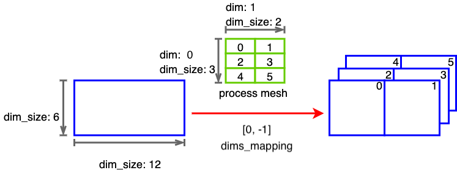
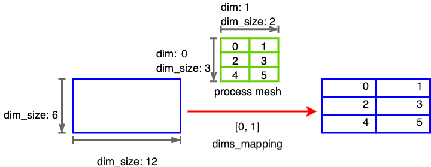
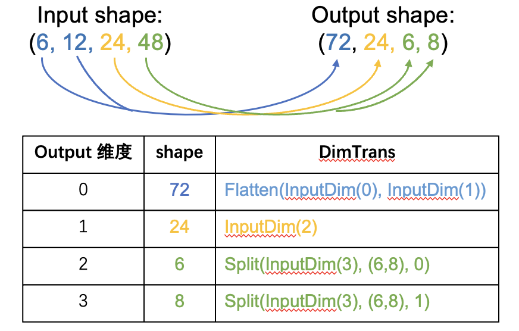

# 切分推导规则参考文档
# 1. 背景
半自动并行可在用户仅标记了模型中部分 tensor 在不同进程上的分布情况后，自动实现高效的分布式训练。用户在使用时只需标记部分 tensor 的分布情况，无需实现模型并行时的通信等流程，因此可以大幅简化分布式训练的使用。切分推导是半自动并行的第一个流程，切分推导模块主要用于推导补全模型中没有被用户标记的 tensor 和 op 节点的分布式属性（即分布情况），决定了后续分布式训练的策略，是影响训练效率的重要模块。

本文档主要介绍 op 推导规则的开发流程。在切分推导中，模型中的各 op 需要根据其输入、输出中已知分布式属性（即 tensor 在不同进程上的分布情况）推导未知的属性。由于不同类型的 op 计算过程不同，因此其推导过程也各不相同，需要对不同类型的 op 分别开发推导规则。本文后续将介绍开发所需的基本概念和具体的开发流程。

# 2. 切分推导基础概念
在切分推导中，分布式属性用于表示各 tensor 在进程上的分布情况，其中包括 process_mesh、dims_mapping 等属性。process_mesh 用于表示进程的组织方式，dims_mapping 表示 tensor 在 process_mesh 上的分布方式，切分推导主要对 dims_mapping 进行推导。下面具体介绍这两个概念：
* process_mesh：表示并行进程的组织方式，即拓扑结构，一般一个进程控制一个 GPU，对于一个 3 机、每个机器 2 卡的情况，使用 6 个进程进行计算时，6 个进程的 process_mesh 可以表示为 [[0, 1], [2, 3], [4, 5]]。
* dims_mapping：表示 tensor 在 process_mesh 上的分布方式，dims_mapping[i] = j 表示 tensor 的 i 维在 process_mesh 的 j 维上被切分，若为 -1 则表示不切分，在该维上复制。例：tensor 大小为 (6, 12)，process_mesh 的大小为 [3, 2]，可以理解为 3 机，每个机器 2 卡。dims_mapping = [-1, 1] 表示 tensor 的第 0 维不切分，tensor 的 1 维在 process_mesh 的 1 维上切分，切分后每个卡上的 tensor 大小为 (6, 6)，3 机对应卡上的子 tensor 数值相同。下图给了 dims_mapping 为 [-1, 1] 和 [0, 1] 时的 tensor 切分情况。

<center>dims_mapping=[0, -1] 时的分布情况</center>



<center>dims_mapping=[0, 1] 时的分布情况</center>



# 3. 开发流程
整体的开发过程主要包括以下部分：
1. 开发 op 的推导规则，包括正向推导和逆向推导，代码以 {op_name}.h 和 {op_name}.cc 命名（以 matmul 为例，文件名为 matmul.h 和 matmul.cc），放在 Paddle/paddle/phi/infermeta/spmd_rules 目录下。
2. 注册规则，使得该规则可被使用，在 Paddle/paddle/phi/infermeta/spmd_rules/rules.h 里仿照已注册的规则进行注册。
3. 写推导规则对应的单测，放到 Paddle/test/auto_parallel/spmd_rules 目录，写法可以参考该目录下其他单测文件，单测需要包含全面的测试用例。
op 推导规则开发是整个流程中最重要也是最困难的部分，下面首先重点介绍如何开发推导规则，然后介绍规则的注册和单测。

## 3.1 接口定义
每个 op 的推导规则包括正向推导和逆向推导两部分，其中正向推导从 input 的 dims_mapping 推导 output 的 dims_mapping，逆向推导从output 的 dims_mapping 推导 input 的 dims_mapping。以 matmul op 为例，正向推导和逆向推导的接口定义如下，**接口中参数需要和 phi api（Paddle/paddle/phi/api/lib/api.cc，这个文件在 cmake 之后会生成）保持一致：**
```c++
// Paddle/paddle/phi/infermeta/spmd_rules/matmul.h
namespace phi {
namespace distributed {

// 正向推导，x、y 为输入，trans_x, trans_y 为 op 的属性
// matmul 的 phi api 为
// PADDLE_API Tensor matmul(const Tensor& x, const Tensor& y, bool transpose_x, bool transpose_y)
// 规则中的参数和 phi api 保持一致
// DistMetaTensor 中包含了 tensor 的分布式属性、shape 等成员，是推导使用的主要数据结构
SpmdInfo MatmulInferSpmd(const DistMetaTensor& x,
                         const DistMetaTensor& y,
                         bool trans_x,
                         bool trans_y);

// 逆向推导，相比正向推导，逆向推导从输出的属性推导输入的属性，因此
// 多一个输出的属性作为函数的参数
SpmdInfo MatmulInferSpmdReverse(const DistMetaTensor& x,
                                const DistMetaTensor& y,
                                const DistMetaTensor& out,
                                bool trans_x,
                                bool trans_y);

}  // namespace distributed
}  // namespace phi
```

## 3.2 规则实现
按照 op 的不同特性，规则整体上可以分为两大类，计算类和修改形状类，实现的核心思想一样，都是通过找到 input、output 维度之间的对应关系，把分布式属性在对应维度间进行传递。下面分别介绍两类推导规则的实现过程。

### 3.2.1 计算类规则
计算类规则对应于对 input 进行计算的 op，例如matmul、elementwise 等。计算类 op 的推导规则基于 Einsum Notation 实现，通过使用 Einsum Notation 的方式，InferBackward 的实现流程和 InferForward 基本一致，首先找到 input、output 各维度之间的对应关系，然后把分布式属性在对应维度间进行传递。前向推导的具体过程如下： 
1. 根据 op 的计算过程，得到 op 对应的 Einsum Notation。Einsum Notation 反应了 input 和 output 之间各维度的对应关系，例如根据 matmul 的计算方式，其 Einsum Notation 为 ij, jk -> ik，表示 output 中的 (i,k) 由第一个 input 的 (i,j) 和第二个 input 的 (j,k) 得到，消失的维度是进行规约（这里是 j，进行求和）的维度。由此可见，Einsum Notation 中字母相同的维度就是 input、output 中对应的维度。
2. 对 input 的 dims mapping 进行合并操作，即如果有多个 input tensor，且 dims mapping 不相同，计算得到一个对所有 input 兼容的 dims mapping，由此可以得到 Einsum Notation 中每个字母（维度）的 dims mapping 值。
3. 根据第2步中得到的字母（维度）和 dims mapping 值的对应关系，得到 output 的 dims mapping。
4. 如果 input 的 dims mapping 需要更新，例如第2步中得到的兼容值和原来的不相同、或者原来的dims mapping 不合法，则进行更新。

**一些基础函数已经实现在公共模块中，开发者需要根据 op 计算过程构建 Einsum Notation，2、3、4 步可以调用基础函数完成。看单测中的测试样例可以帮助理解推导过程。**

下面以 elementwise 的推导规则为例，介绍推导规则的实现，相关说明写在注释里，相关细节可以直接看源码。
```c++
// Paddle/paddle/phi/infermeta/spmd_rules/elementwise.cc
// 两个输入的 elementwise 推导规则，对应于加、减、乘、除等算子都可以用
// 这一规则进行推导
SpmdInfo ElementwiseBinaryInferSpmd(const DistMetaTensor& x,
                                    const DistMetaTensor& y) {
  // Step0: 检查输入是否合法
  auto x_shape = phi::vectorize(x.dims());
  int x_ndim = x_shape.size();
  auto y_shape = phi::vectorize(y.dims());
  int y_ndim = y_shape.size();
  TensorDistAttr x_dist_attr_src = x.dist_attr();
  TensorDistAttr y_dist_attr_src = y.dist_attr();
  std::vector<int64_t> x_dims_mapping = x_dist_attr_src.dims_mapping();
  std::vector<int64_t> y_dims_mapping = y_dist_attr_src.dims_mapping();
  PADDLE_ENFORCE_EQ(x_ndim,
                    x_dims_mapping.size(),
                    phi::errors::InvalidArgument(
                        "ElementwiseBinary, The Tensor X's rank [%d] and X's "
                        "dims_mapping size [%d] are not matched.",
                        x_ndim,
                        x_dims_mapping.size()));
  PADDLE_ENFORCE_EQ(y_ndim,
                    y_dims_mapping.size(),
                    phi::errors::InvalidArgument(
                        "ElementwiseBinary, The Tensor Y's rank [%d] and Y's "
                        "dims_mapping size [%d] are not matched.",
                        y_ndim,
                        y_dims_mapping.size()));

  // Step1: 构建 Einsum Notation。没有广播情况下的 3 维 tensor 为例，
  // elementwise 对应的 Einsum Notation 为 abc, abc --> abc
  std::string x_axes, y_axes, out_axes;
  GetBinaryNotations(x_shape, y_shape, &x_axes, &y_axes, &out_axes);

  // Step2: Sharding Propogation
  // Step2.1: 合并输入的 dims mapping，得到每一维度对应的 dims mapping 值。
  // 调用 ShardingMergeForTensors 可以对 input 进行合并，返回的 map 即为
  // 每一维度对应的 dims mapping 值。
  std::unordered_map<std::string, int64_t> axis_to_dim_map =
      ShardingMergeForTensors(
          {{x_axes, x_dims_mapping}, {y_axes, y_dims_mapping}});

  // Step2.2: Infer output dimsmapping from merged input dimsmapping
  // 根据上一步得到的字母（维度）和 dims mapping 值的对应关系，得到 output 的 dims mapping。
  // GetDimsMappingForAxes 可以得到所需要的 dims mapping。
  std::vector<int64_t> out_dims_mapping =
      GetDimsMappingForAxes(out_axes, axis_to_dim_map);

  // initialize output dist_attr's process_mesh, batch_dim and dynamic dims with
  // input dist_attr.
  TensorDistAttr out_dist_attr = CopyTensorDistAttrForOutput(x_dist_attr_src);
  // 把 output 的 dims mapping 设置为推导得到的 dims mapping
  out_dist_attr.set_dims_mapping(out_dims_mapping);

  // Step2.3: Update inputs' dims mapping with merged one.
  TensorDistAttr x_dist_attr_dst(x_dist_attr_src);
  TensorDistAttr y_dist_attr_dst(y_dist_attr_src);
  // 如果合并后 input 的 dims mapping 和原始的不同，同样需要更新。这里同样
  // 使用 GetDimsMappingForAxes 获得 input 需要更新的 dims mapping。
  x_dist_attr_dst.set_dims_mapping(
      GetDimsMappingForAxes(x_axes, axis_to_dim_map));
  y_dist_attr_dst.set_dims_mapping(
      GetDimsMappingForAxes(y_axes, axis_to_dim_map));

  // Step3: Handle partial
  // Handle input tensor partial (TODO)
  // 打印相关信息，方便调试
  VLOG(4) << "ElementwiseSPMDRule InferForward:";
  VLOG(4) << "Input0 shape: [" << str_join(x_shape) << "] "
          << "src_dims_mapping: [" << str_join(x_dims_mapping) << "] "
          << "dst_dims_mapping: [" << str_join(x_dist_attr_dst.dims_mapping())
          << "]";
  VLOG(4) << "Input1 shape: [" << str_join(y_shape) << "] "
          << "src_dims_mapping: [" << str_join(y_dims_mapping) << "] "
          << "dst_dims_mapping: [" << str_join(y_dist_attr_dst.dims_mapping())
          << "]";
  VLOG(4) << "Output dims_mapping: [" + str_join(out_dims_mapping) + "]\n\n";

  // 返回 input、output 的分布式属性，返回值的类型为 SpmdInfo，是
  // std::pair<std::vector<TensorDistAttr>, std::vector<TensorDistAttr>> 类型
  return {{x_dist_attr_dst, y_dist_attr_dst}, {out_dist_attr}};
}
```

逆向推导和前向相反，过程如下所示，这里不再赘述代码，可以看源码实现，具体过程如下： 
1. 根据 op 的计算过程，得到 op 对应的 Einsum Notation。
2. 对 output 的 dims mapping 进行合并操作，即如果有多个 output tensor，且 dims mapping 不相同，计算得到一个对所有 output 兼容的 dims mapping，由此可以得到 Einsum Notation 中每个字母（维度）的 dims mapping 值。
3. 根据第2步中得到的字母（维度）和 dims mapping 值的对应关系，得到 input 的 dims mapping。
4. 如果 output 的 dims mapping 需要更新，例如第2步中得到的兼容值和原来的不相同、或者原来的dims mapping 不合法，则进行更新。

### 3.2.2 修改形状类规则
修改形状类规则主要指 reshape、squeeze 等修改 tensor shape 的规则，这类规则无法使用 Einsum Notation 得到 input、output 维度的对应关系。Paddle 中定义了 DimsTrans 的数据结构用于表示维度之间的变换，用 vector<DimsTrans*> 表示从 input shape 到 output shape 的变换，vector 的长度和 output 的 shape size 相同，表示每一维如何变换而来。DimsTrans 有 Flatten, Split, Singleton 和 InputDim 4 种类型，Flatten 表示该维度由 input 的若干维度合并而成；Split 表示由 input 的某一维度拆分而来；Singleton 表示这一维的大小是 1；InputDim 表示和 input 的指定维度相同。

如下图所示，对于 shape 从 input (6, 12, 24, 48) 到 output (72, 24, 6, 8)，用 DimsTrans 表示为 [Flatten(InputDim(0), InputDim(1)), InputDim(2), Split(InputDim(3), (6, 8), 0), Split(InputDim(3), (6, 8), 1)]。其中第 0 个元素 Flatten(InputDim(0), InputDim(1)) 表示 output 的第 0 维由 input 的 0、1 两维合并；第 1 个元素 InputDim(2) 表示 output 的第 1 维和 input 的第 2 维相同；第 2 个元素 Split(InputDim(3), (6, 8), 0) 表示 output 的第 2 维由 input 的第 3 维拆分而来，拆分的形状是 (6,8)，output 的第 2 维是拆分后的第一个维度；第 3 个元素 Split(InputDim(3), (6, 8), 1)同理，表示 output 的第 3 维是拆分后的第 1 个维度。

<center>(6, 12, 24, 48) --> (72, 24, 6, 8) 变换示意</center>



根据 DimsTrans 所表示的变换关系，可以推导得到分布式属性。前向推导的具体流程如下：
1. 根据 input 和 output 的 shape，计算得到从 input 到 output 的变换关系。
2. 根据第 1 步求得的变换关系推导 output 的 dims mapping。
3. 更新 input (如果需要) 和 output 的 dims mapping

**同样的，一些基础函数已经实现在公共函数里，开发者需要根据 op 的特征构建 input、output 之间的变换关系，然后调用基础函数推导得到 dims mapping。**

下面以 reshape 为例，介绍推导规则的实现，相关说明写在注释里，相关细节可以直接看源码。
```c++
// Paddle/paddle/phi/infermeta/spmd_rules/reshape.cc
SpmdInfo ReshapeInferSpmd(const DistMetaTensor& x,
                          const std::vector<int64_t>& shape) {
  // Step0: 检查输入是否合法
  auto src_shape = phi::vectorize(x.dims());
  int x_ndim = src_shape.size();
  auto x_dist_attr_src = x.dist_attr();
  std::vector<int64_t> x_dims_mapping = x_dist_attr_src.dims_mapping();
  PADDLE_ENFORCE_EQ(
      x_ndim,
      x_dims_mapping.size(),
      phi::errors::InvalidArgument("The Tensor X's rank [%d] and X's "
                                   "dims_mapping size [%d] are not matched.",
                                   x_ndim,
                                   x_dims_mapping.size()));

  // Step1: 根据 input 和 output 的 shape，构建从输入到输出的变换关系

  // handle the '0' values in target shape, '0' indicates
  // that the target shape is equal to the source shape
  std::vector<int64_t> tgt_shape(shape);
  for (int64_t i = 0, n = static_cast<int64_t>(tgt_shape.size()); i < n; i++) {
    if (tgt_shape[i] == 0) {
      tgt_shape[i] = src_shape[i];
    }
  }

  // MakeReshapeDimTrans 用于构建 reshape 的变换关系，对于其他 op，开发者需要
  // 实现对应的方法。该函数会返回一个 DimTrans 的 vector，表示从 src_shape 到
  // tgt_shape 的变换。
  std::vector<DimTrans*> trans = MakeReshapeDimTrans(src_shape, tgt_shape);

  // Step2: 由 Step1 的到的 std::vector<DimTrans*>，调用 InferFromDimTrans 
  // 就可以得到 output 的 dims_mapping。返回值中，dims_mapping_vec[0] 是 input
  // 的 dims mapping，dims_mapping_vec[1] 是 output 的 dims mapping。
  std::vector<std::vector<int64_t>> dims_mapping_vec =
      InferFromDimTrans(x, trans);

  // Step3: 更新 input、output 的 dims_mapping。
  TensorDistAttr x_dist_attr_dst(x_dist_attr_src);
  x_dist_attr_dst.set_dims_mapping(dims_mapping_vec[0]);
  TensorDistAttr out_dist_attr(x_dist_attr_src);
  out_dist_attr.set_dims_mapping(dims_mapping_vec[1]);

  VLOG(4) << "ReshapeInferSpmd: X shape: [" << str_join(src_shape)
          << "] Out shape: [" << str_join(tgt_shape) << "]";
  VLOG(4) << "Transformation from input to output:";
  for (int64_t i = 0, n = static_cast<int64_t>(trans.size()); i < n; i++) {
    DimTrans* t = trans[i];
    VLOG(4) << "\tOut axis[" << i << "]: " << t->to_string();
  }
  VLOG(4) << "X dims_mapping_src: [" << str_join(x_dims_mapping)
          << "] dims_mapping_dst: [" << str_join(dims_mapping_vec[0])
          << "]\n Out dims_mapping: [" << str_join(dims_mapping_vec[1])
          << "]\n\n";

  // 清理 vector<DimTrans*>
  CleanUp();

  return {{x_dist_attr_dst}, {out_dist_attr}};
}
```

逆向推导和正向推导相反，首先得到从 output 到 input 的变换关系，然后推导 dims mapping，这里不再赘述。

## 3.3 注册规则
规则实现后需要在 Paddle/paddle/phi/infermeta/spmd_rules/rules.h 里注册，elementwise 的注册如下：
```c++
// Paddle/paddle/phi/infermeta/spmd_rules/rules.h
PD_REGISTER_SPMD_RULE(
    add,
    PD_INFER_SPMD(phi::distributed::ElementwiseBinaryInferSpmd),
    PD_INFER_SPMD(phi::distributed::ElementwiseBinaryInferSpmdReverse));
```

## 3.4 单测
推导规则的单测使用 python 中的 unittest 进行开发，放到 Paddle/test/auto_parallel/spmd_rules 目录下，命名为 test_{op_name}_rule.py。在安装了新编译的 paddle python 包后，直接 python 运行单测文件进行测试。可以仿照现有的单测写，elementwise 的单测代码如下。
```python
# Paddle/test/auto_parallel/spmd_rules/test_elementwise_rule.py
class TestElementwiseSPMDRule(unittest.TestCase):
    def setUp(self):
        # 获取规则
        self.unary_rule = core.get_phi_spmd_rule("relu")
        self.binary_rule = core.get_phi_spmd_rule("add")

        x_shape = [64, 36]
        y_shape = [64, 36]
        process_mesh = auto.ProcessMesh(mesh=[0, 1, 2, 3])

        # 定义数据结构，目前python 端使用 DistTensorSpec 这个数据结构作为输入
        x_tensor_dist_attr = TensorDistAttr()
        x_tensor_dist_attr.dims_mapping = [1, 0]
        x_tensor_dist_attr.process_mesh = process_mesh
        self.x_dist_tensor_spec = DistTensorSpec(x_shape, x_tensor_dist_attr)

        y_tensor_dist_attr = TensorDistAttr()
        y_tensor_dist_attr.dims_mapping = [0, -1]
        y_tensor_dist_attr.process_mesh = process_mesh
        self.y_dist_tensor_spec = DistTensorSpec(y_shape, y_tensor_dist_attr)

        self.out_dist_tensor_spec = DistTensorSpec(self.x_dist_tensor_spec)

        self.attrs = []

    # 正向推导单测
    def test_single_mesh_dim(self):
        # [0, -1], [-1, -1] --> [0, -1], [0, -1], [0, -1]
        # 设置输入的 dims mapping
        self.x_dist_tensor_spec.set_dims_mapping([0, -1])
        self.y_dist_tensor_spec.set_dims_mapping([-1, -1])
        # 调用规则进行推导，如果规则有其他属性，比如 matmul 有 trans_x, trans_y，
        # 直接放到 spec 的后面
        result_dist_attrs = self.binary_rule.infer_forward(
            self.x_dist_tensor_spec, self.y_dist_tensor_spec
        )
        infered_input_dist_attrs = result_dist_attrs[0] # 推导得到的 input dims mapping
        infered_output_dist_attrs = result_dist_attrs[1] # 推导得到的 output dims mapping

        # 检查结果是否正确
        self.assertEqual(infered_input_dist_attrs[0].dims_mapping, [0, -1])
        self.assertEqual(infered_input_dist_attrs[1].dims_mapping, [0, -1])
        self.assertEqual(infered_output_dist_attrs[0].dims_mapping, [0, -1])
    
    # 逆向推导单测
    def test_backward_multi_mesh_dim(self):
        process_mesh = auto.ProcessMesh([[0, 1, 2], [3, 4, 5]])
        self.x_dist_tensor_spec.set_process_mesh(process_mesh)
        self.y_dist_tensor_spec.set_process_mesh(process_mesh)
        self.x_dist_tensor_spec.shape = [96, 24, 48]
        self.y_dist_tensor_spec.shape = [96, 24, 48]
        self.out_dist_tensor_spec.shape = [96, 24, 48]

        # [0, 1, -1] --> [0, 1, -1], [0, 1, -1], [0, 1, -1] (output --> inputs, output)
        self.out_dist_tensor_spec.set_dims_mapping([0, 1, -1])

        # 逆向推导把输入和输出一起作为规则的参数
        resulted_dist_attrs = self.binary_rule.infer_backward(
            self.x_dist_tensor_spec,
            self.y_dist_tensor_spec,
            self.out_dist_tensor_spec,
        )
        infered_input_dist_attrs = resulted_dist_attrs[0]
        infered_output_dist_attrs = resulted_dist_attrs[1]

        self.assertEqual(len(resulted_dist_attrs), 2)
        self.assertEqual(len(infered_input_dist_attrs), 2)
        self.assertEqual(len(infered_output_dist_attrs), 1)

        self.assertEqual(infered_input_dist_attrs[0].dims_mapping, [0, 1, -1])
        self.assertEqual(infered_input_dist_attrs[1].dims_mapping, [0, 1, -1])
        self.assertEqual(infered_output_dist_attrs[0].dims_mapping, [0, 1, -1])
```