# 组合机制设计文档

> 版本，作者，时间

| 版本 | 作者   | 时间       | 主要更新           |
| ---- | ------ | ---------- | ------------------ |
| v1.0 | 卢林军 | 2024.08.09 | 初版               |

## 1. 背景

### 1.1 问题及现状

大语言模型、科学计算等场景是近两年来深度技术关注的热点，对深度学习框架底层分布式训练、高阶自动微分、编译优化、国产化硬件支持等技术提出更高要求。

* NVIDIA数据公布， GPT-3 175B 使用1024块A100 训练34天，需要强大分布式训练能力。

* 科学计算微分方程求解如EulerBeam，前向运算四阶微分，加上一次反向传播过程，需要五阶微分。

* 编译器加速、国产硬件支持也近期深度学习框架演进重要方向。

飞桨框架底层基于原生算子体系(1061个，正向 691个，反向 370个，且持续增长)构建，导致上述场景适配难度极大，具体原因如下：

* 分布式：需要基于原生算子体系手写自动并行策略。
* 高阶微分：需要手写高阶微分算子，如Matmul五阶代码行数超过3000。
* 编译器：需要将原生大算子拆解成细粒度编译器小算子，才能进一步融合优化。
* 新硬件：需要接入所有算子，才能正确运行。

### 1.2 主要竞品情况

Meta PyTorch2.0、Google Jax 通过基础算子组合实现复杂算子，并通过编译器进行融合加速优化，组合算子+编译器技术架构已经成为事实上下一代框架标准。

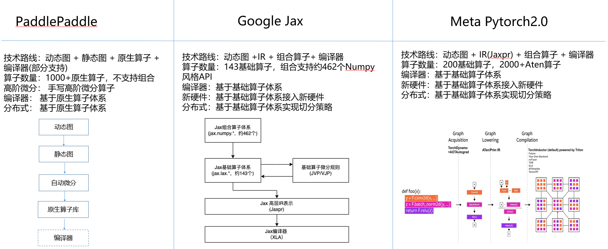

### 1.3 组合机制目标

定义少数基础算子集合(通过分析约在200左右)，将飞桨原生大算子拆解为基础算子组合，降低分布式、编译器、高阶微分、新硬件场景接入成本，支撑飞桨下一代技术架构演进。具体来说组合机制会重点支持EB/GPT/LLaMa等大语言模型以及PINNs/DeepoNet等科学计算模型。

组合机制的流程会将用户编写的动态图通过动转静（SOT）的API转化成由原生算子表达的静态图，通过组合算子拆解规则进行拆解，生成由基础算子构成的静态图，最后接入编译器和分布式进行优化与执行。

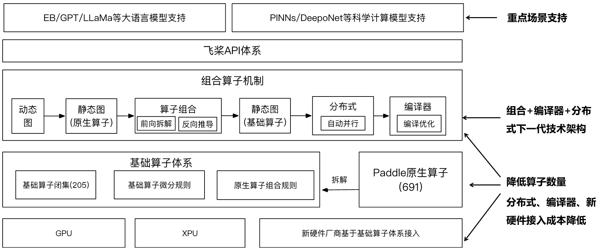

## 2. 方案介绍

### 2.1 组合机制架构及方案要点

在机制上，组合机制要保障模型的性能，正如之前所说，动态图的反向计算过程会被拆解成多个基础算子，这是因为基础算子本身就有完备的前反向计算逻辑，拆解成基础算子后，组合算子的高阶自动微分就可以通过递归调用基础算子的反向计算进行求解。在静态图上，前向计算的拆解则会生成更多的基础算子，这些基础算子可以通过一些计算图优化手段（比如：算子融合，算子重建等）进行优化，从而获得更好的执行性能。

其次，不论是动态图还是静态图，都使用的动静一体的组合规则，避免静态图和动态图之间的代码冗余。最后，组合机制还提供了完备的基础算子集合，集合中的基础算子满足原子性（无法再拆分成更基础的操作），实用性（具备实际的应用场景），面向Tensor（基础算子的操作力度均为Tensor），完备性（可以支持当前框架所有的算子及API）。

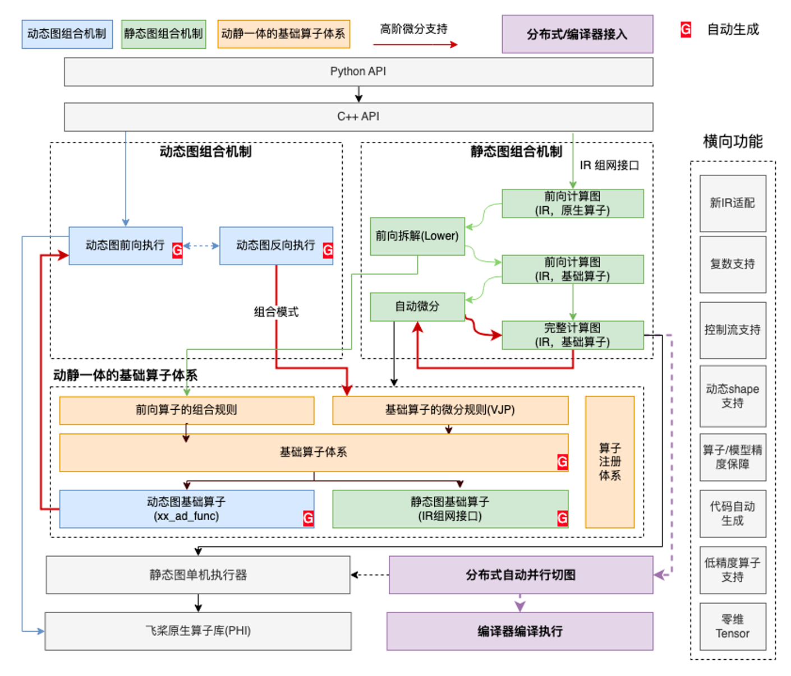

### 2.2 具体示例（log_softmax）

在引入组合机制前时，`log_softmax`算子的前反向计算，会直接调用PHI中对应的前向计算Kernel（`log_softmax`）和反向计算Kernel（`log_softmax_grad`）。在引入组合机制之后，原本`log_softmax`的执行内容会替换成多个算子的组合（图中虚线框的部分），然后根据自动微分机制以及VJP推导出与`log_softmax_grad`计算结果相等的反向计算方式（均由基础算子组合而成）。

通过这样的拆解方式，在对接目标已经支持了组合机制所有基础算子的情况下，Paddle如果新增了一个算子`A`，则只需要再补充算子`A`中的拆解规则，就能在对接目标中直接使用新的算子`A`，而不需要在对接目标中重新实现一遍算子`A`，大大减少了对接成本。

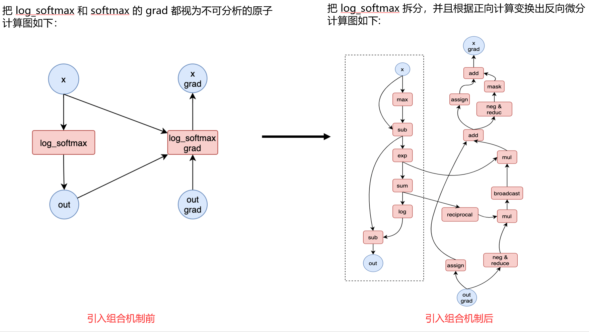

### 2.3 基础算子集合设计

根据2.2节中提到的原子性，实用性，面向Tensor以及完备性的要求，目前已经形成了基础算子最小集。考虑到性能以及充分利用现有硬件及计算库，且对比竞品，实现中会增加一些算子形成扩展集。

| 代数函数（加减乘除，幂，开方，倒数，绝对值，取符号，取反）   | 整数运算（gcd, lcm, trunc, floor_div, floor, ceil, round）   | 元数据获取（shape、size、rank）                              |
| ------------------------------------------------------------ | ------------------------------------------------------------ | ------------------------------------------------------------ |
| 超越运算（指数，对数，三角函数，双曲函数，定积分（erf、gamma)） | 浮点数运算（frac, next floating point, is_nan, is_inf）      | 数据变形（concat、split、pad、reshape、transpose、broadcast、expand、tile、repeat_interleave、diagnal、diag_embed、roll、flip） |
| 比较运算（比较类，>, >=, <, <=, ==, !=, max, min, isclose, allclose） | 复数运算（complex, real, imag, conj, angle, as_complex, as_real） | 数据索引（slice、slice_assign、gather_nd、scatter_nd、gather、scatter、put_along_axis、take_along_axis、masked_select、masked_fill） |
| 逻辑运算（and, or, not, xor）                                | 数据类型转换（cast、bitcast）                                | 数据排序（sort），去重（unique），查找（argmax, argmin, argsort, topk），tensor_dot，kron |
| 位运算（and, or, not, xor, shiftleft, shiftright）           | 数据生成和初始化（random_int、random_uniform、random_normal、iota、empty、assign、fill） | 控制流（select_n、branch、while_loop、fori_loop、scan）      |

基础算子扩展集合：

1. 组合实现对性能或数值精度影响很大。比如`log_softmax`和`logsumexp`。
2. 动态Shape支持的算子需求。比如`redcue_as`。
3. 硬件/计算库支持性。某些硬件/计算库会提供常用算法的优化版本，使得某些可组合算子加入到基础算子集合中会更有优势。

目前飞桨实现的基础算子集合可以在`paddle/fluid/primitive/primitive.yaml`文件中查看。

### 2.4 动态图与静态图的拆分机制

组合机制的实现可以分为动态图和静态图的实现，动态图场景下前向计算会直接调用飞桨原生算子库（PHI）中的Kernel，而反向计算则会根据基础算子的微分规则（VJP），当前算子是否可拆解，如果是则对算子反向计算流程拆解成多个基础算子组合的方式，再通过直接调用基础算子在PHI中的Kernel完成反向计算，反之，则直接调用PHI中的反向Kernel。

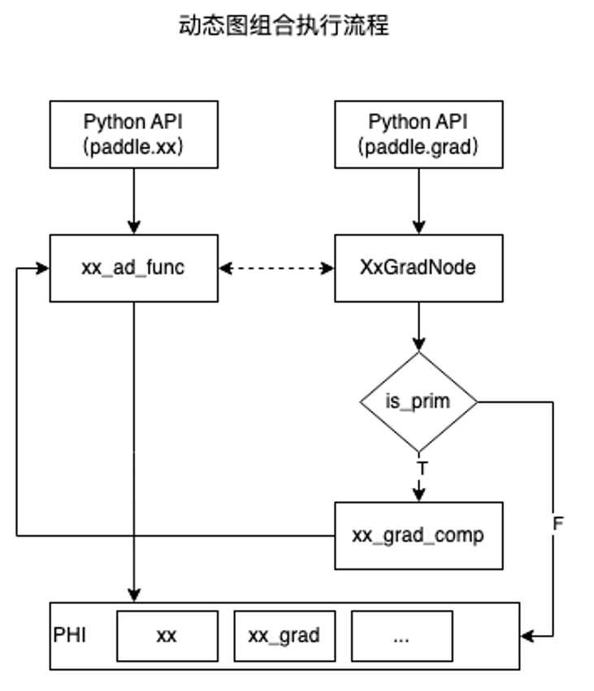

在静态图场景下，算子的计算逻辑会生成对应的前向计算图（原生算子），然后根据前向算子的组合规则对算子的前向计算流程拆解成多个基础算子组合的方式，重新构建一个前向计算图（基础算子），最后结合自动微分机制补全反向计算图，最后生成一个完整的计算图（基础算子），这个完整的计算就会交给执行器继续执行。

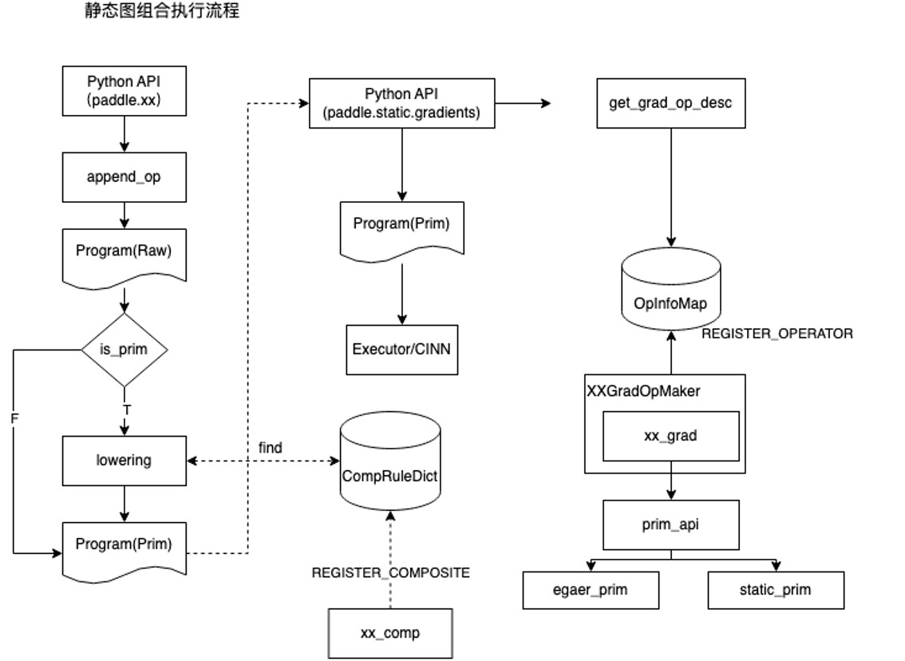

### 2.4 模型精度及显存优化

算子拆解过程可能导致显存增加，数值不稳定问题，比如:

1. ResNet50拆解BatchNorm导致显存占用增加70%。
2. Sigmoid拆解导致网络出现Nan的结果，其解决方案则是通过手写反向计算过程（数值稳定写法）进行化简。
   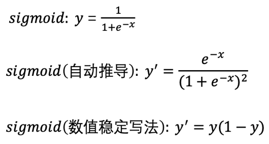
3. log_softmax拆解后，自动推导的反向图会Hold前向中间变量，从而导致显存占用增加。

   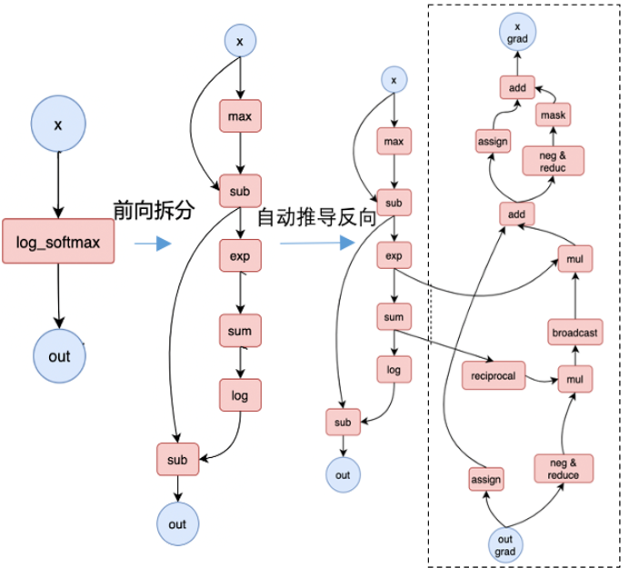

   针对组合算子，自定义反向组合规则（CustomVJP），并在调度上保证不丢失高层语义，即优先执行反向拆解，再执行前向拆解，其步骤如下：

   1. 第一次前向拆解：针对没有自定义VJP规则的组合算子执行前向拆解。
   2. 反向微分变换：针对1产生的计算图推导反向计算，由于此时有自定义VJP算子尚未拆解，所以能够优先调度该算子自定义反向拆解。
   3. 第二次前向拆解：针对第一次拆解过程遗留的未拆解算子，执行第二次拆解操作。

   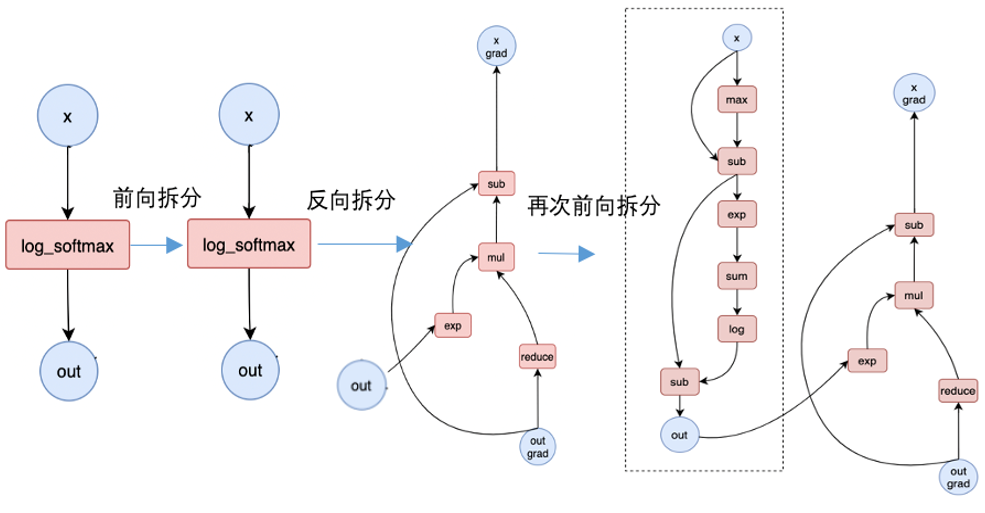
   
## 3. Paddle内的代码实现

### 3.1 算子前向拆解

在Python端会提供`call_decomp(op)`函数，在这个函数内部会调用`call_decomp_rule(&fwd_op)`的函数用于执行当前算子的前向拆解。这个函数内部会将前向算子动态转化为`paddle::dialect::DecompInterface`实例，并判断当前算子是否注册了拆解函数。然后调用这个实例的`Decomp(op)`方法。

```c++
// paddle/fluid/pybind/pybind.cc

m->def("call_decomp", [](pir::Operation &fwd_op) {
  py::list res;
  std::vector<std::vector<pir::Value>> decomp_res = call_decomp_rule(&fwd_op);
  ...
});

// paddle/fluid/primitive/base/decomp_trans.cc
std::vector<std::vector<pir::Value>> call_decomp_rule(pir::Operation* op) {
  paddle::dialect::DecompInterface decomp_interface =
      op->dyn_cast<paddle::dialect::DecompInterface>();
  PADDLE_ENFORCE(decomp_interface,
                 common::errors::InvalidArgument(
                     "[Prim] The decomp function is not registered in %s op ",
                     op->name()));
  std::vector<std::vector<pir::Value>> decomp_res = decomp_interface.Decomp(op);
  return decomp_res;
}
```

在`DecompInterface`类的`Decomp`方法中，则是直接调用了`impl_`中的`decomp_(op)`方法。

```c++
// paddle/fluid/pir/dialect/operator/interface/decomp.h

class DecompInterface : public pir::OpInterfaceBase<DecompInterface> {
 public:
  struct Concept {
    explicit Concept(
        std::vector<std::vector<pir::Value>> (*decomp)(pir::Operation* op))
        : decomp_(decomp) {}
    std::vector<std::vector<pir::Value>> (*decomp_)(pir::Operation* op);
  };

 ...
  /// Constructor
  DecompInterface(pir::Operation* op, Concept* impl)
      : pir::OpInterfaceBase<DecompInterface>(op), impl_(impl) {}

  std::vector<std::vector<pir::Value>> Decomp(pir::Operation* op) {
    return impl_->decomp_(op);
  }

 private:
  Concept* impl_;
};

```

这就需要去看看对应算子的`Decomp`方法是如何实现，这里以`Relu`算子为例，这个类中就声明了`Decomp`方法。

```c++
// build/paddle/fluid/pir/dialect/operator/ir/pd_op.h

class TEST_API ReluOp : public pir::Op<ReluOp,paddle::dialect::InferMetaInterface,paddle::dialect::VjpInterface,paddle::dialect::InferSymbolicShapeInterface,paddle::dialect::OpYamlInfoInterface,paddle::dialect::CacheGradOpSymbolicShapeInterface,paddle::dialect::GetKernelTypeForVarInterface,paddle::dialect::DecompInterface,paddle::dialect::CustomVjpTrait> {
 public:
  using Op::Op;
  static const char *name() { return "pd_op.relu"; }
  static constexpr const char **attributes_name = nullptr;
  static constexpr uint32_t attributes_num = 0;
  static OpInfoTuple GetOpInfo();
  static void Build(pir::Builder &builder, pir::OperationArgument &argument, pir::Value x_);
  ...
  static std::vector<std::vector<pir::Value>> Vjp(pir::Operation* op, const std::vector<std::vector<pir::Value>>& inputs_, const std::vector<std::vector<pir::Value>>& outputs, const std::vector<std::vector<pir::Value>>& out_grads, const std::vector<std::vector<bool>>& stop_gradients);
  static std::vector<std::vector<pir::Value>> Decomp(pir::Operation* op);
  ...
};
```

在`Decomp`方法中，首先将算子转化成`ReluOp`，然后准备relu算子的输入，属性以及输出结果，最后调用`paddle::primitive::details::relu_decomp<primitive::LazyTensor>(x)`实现对relu算子的拆解。

```c++
// build/paddle/fluid/pir/dialect/operator/ir/op_decomp.cc

std::vector<std::vector<pir::Value>> ReluOp::Decomp(pir::Operation* op) {
  VLOG(4) << "Decomp call relu's decomp interface begin";

  ReluOp op_obj = op->dyn_cast<ReluOp>();
  (void)op_obj;

  FLAGS_tensor_operants_mode = "static";

  VLOG(6) << "Decomp Prepare inputs of relu";

  Tensor x(std::make_shared<primitive::LazyTensor>(op_obj.x()));

  VLOG(6) << "Decomp prepare attributes of relu";

  VLOG(6) << "Decomp call relu's forward composite rule prepare";

  auto org_res = op->results();
  std::vector<std::vector<pir::Value>> res(org_res.size());

  VLOG(6) << "Decomp call relu's forward composite rule begin";
  Tensor op_res = paddle::primitive::details::relu_decomp<primitive::LazyTensor>(x);
  VLOG(6) << "Decomp call relu's forward composite rule end";
  res[0].push_back(
    std::static_pointer_cast<primitive::LazyTensor>(op_res.impl())
        ->value());

  VLOG(4) << "Decomp call relu's decomp interface end";
  return res;
}
```

`relu_decomp`就是在拆解规则中定义的relu前向拆解方式。

```c++
// paddle/fluid/primitive/composite/composite.h

template <typename T>
Tensor relu_decomp(const Tensor& x) {
  return maximum<T>(x, full_scalar<T>(0.0, x.dtype()));
}
```

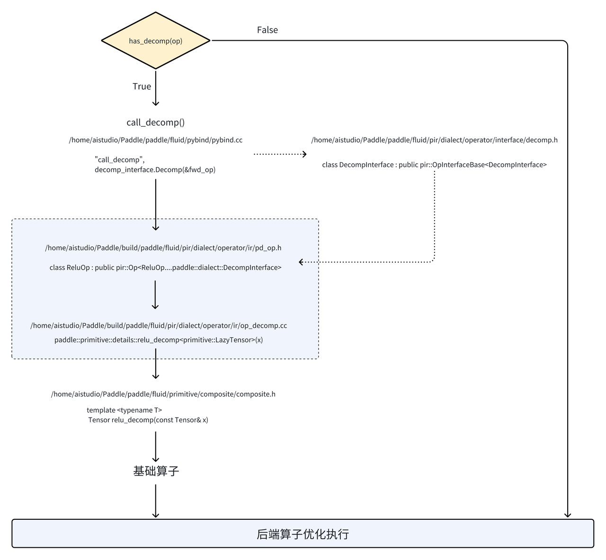

###  3.2 算子反向拆解

在Python端会提供`call_vjp(fwd_op, inputs, outputs, out_grads, stop_gradients)`函数，这个函数内部会将反向算子动态转化为`paddle::dialect::VjpInterface`实例，并判断当前算子是否注册了拆解函数。然后调用这个实例的`Vjp(&fwd_op, inputs, outputs, out_grads, stop_gradients)`方法。

```c++
// paddle/fluid/pybind/pybind.cc

m->def(
      "call_vjp",
      [](pir::Operation &fwd_op,
         const std::vector<std::vector<pir::Value>> &inputs,
         const std::vector<std::vector<pir::Value>> &outputs,
         const std::vector<std::vector<pir::Value>> &out_grads,
         const std::vector<std::vector<bool>> &stop_gradients) {
        // NOTE(dev): Prim decomposed rules will call paddle::dialect::xx
        // api, which has amp strategy. But Prim already process cast operation
        // and we need to disable amp strategy here.
        paddle::imperative::AutoCastGuard guard(
            egr::Controller::Instance().GetCurrentAmpAttrs(),
            paddle::imperative::AmpLevel::O0);

        py::list res;
        std::vector<std::vector<pir::Value>> vjp_res;

        if (fwd_op.isa<paddle::dialect::PyLayerOp>()) {
          // NOTE(MarioLulab): In PIR mode, even though the `PyLayer` op does
          // not have a vjp interface, we still need to generate the backward
          // block based on its registered backward function.
          vjp_res = GenerateBackwardBlockForPyLayerOp(
              &fwd_op, inputs, outputs, out_grads, stop_gradients);
        } else {
          paddle::dialect::VjpInterface vjp_interface =
              fwd_op.dyn_cast<paddle::dialect::VjpInterface>();
          PADDLE_ENFORCE(vjp_interface,
                         common::errors::InvalidArgument(
                             "The vjp function is not registered in %s op ",
                             fwd_op.name()));
          vjp_res = vjp_interface.Vjp(
              &fwd_op, inputs, outputs, out_grads, stop_gradients);
        }
        ...
     });
```

在`VjpInterface`类的`Vjp`方法，则是直接调用了`impl_`的`decomp_(op)`方法。

```c++
// paddle/fluid/pir/dialect/operator/interface/vjp.h

class VjpInterface : public pir::OpInterfaceBase<VjpInterface> {
 public:
  struct Concept {
    explicit Concept(std::vector<std::vector<pir::Value>> (*vjp)(
        pir::Operation* op,
        const std::vector<std::vector<pir::Value>>& inputs,
        const std::vector<std::vector<pir::Value>>& outputs,
        const std::vector<std::vector<pir::Value>>& out_grads,
        const std::vector<std::vector<bool>>& stop_gradients))
        : vjp_(vjp) {}
    std::vector<std::vector<pir::Value>> (*vjp_)(
        pir::Operation* op,
        const std::vector<std::vector<pir::Value>>& inputs,
        const std::vector<std::vector<pir::Value>>& outputs,
        const std::vector<std::vector<pir::Value>>& out_grads,
        const std::vector<std::vector<bool>>& stop_gradients);
  };

  ...
  /// Constructor
  VjpInterface(pir::Operation* op, Concept* impl)
      : pir::OpInterfaceBase<VjpInterface>(op), impl_(impl) {}

  std::vector<std::vector<pir::Value>> Vjp(
      pir::Operation* op,
      const std::vector<std::vector<pir::Value>>& inputs,
      const std::vector<std::vector<pir::Value>>& outputs,
      const std::vector<std::vector<pir::Value>>& out_grads,
      const std::vector<std::vector<bool>>& stop_gradients) {
    return impl_->vjp_(op, inputs, outputs, out_grads, stop_gradients);
  }

 private:
  Concept* impl_;
};

```

这也需要去看看对应算子的`Vjp`方法是如何实现的，以`sum`算子为例，这个类中就声明了`Vjp`方法。在`Vjp`方法中，首先对输入输出的数量进行检查，然后开始准备`sum_grad`的输入，属性以及输出。，再通过调用`primitive::sum_vjp`函数执行`sum`算子的反向拆解。

```c++
// build/paddle/fluid/pir/dialect/operator/ir/pd_op_vjp.cc

std::vector<std::vector<pir::Value>> SumOp::Vjp(pir::Operation* op, const std::vector<std::vector<pir::Value>>& inputs_, const std::vector<std::vector<pir::Value>>& outputs, const std::vector<std::vector<pir::Value>>& out_grads, const std::vector<std::vector<bool>>& stop_gradients){

    PADDLE_ENFORCE_EQ(
      inputs_.size(),
      2,
      common::errors::InvalidArgument("sum op's inputs size should be 2, but now is %d.", inputs_.size()));
    PADDLE_ENFORCE_EQ(
      outputs.size(),
      1,
      common::errors::InvalidArgument("sum op's outputs size should be 1, but now is %d.", outputs.size()));

    VLOG(6) << "Prepare inputs of sum_grad";

    Tensor x(std::make_shared<primitive::LazyTensor>(inputs_[0][0]));
    Tensor out_grad(std::make_shared<primitive::LazyTensor>(out_grads[0][0]));

    VLOG(6) << "Vjp prepare Prepare attributes of sum_grad";

    Tensor axis(std::make_shared<primitive::LazyTensor>(inputs_[1][0]));
    bool keepdim = op->attribute("keepdim").dyn_cast<pir::BoolAttribute>().data();
    bool reduce_all = false;

    VLOG(6) << "Vjp prepare call sum's vjp interface";

    std::vector<std::vector<Tensor>> tensor_res =
        primitive::sum_vjp(
        x, out_grad, axis, keepdim, reduce_all, stop_gradients);

    VLOG(6) << "Vjp prepare stop gradient of sum_grad";

    std::vector<std::vector<pir::Value>> res(tensor_res.size());
    for (size_t i = 0; i < tensor_res.size(); ++i) {
        res[i].resize(tensor_res[i].size());
        for (size_t j = 0; j < tensor_res[i].size(); ++j) {
            if(tensor_res[i][j].defined()){
                res[i][j] = std::static_pointer_cast<primitive::LazyTensor>(tensor_res[i][j].impl())->value();
            }
        }
    }
    return res;
}
```

在`sum_vjp`函数中，首先会判断算子是否存在反向拆解逻辑`paddle::prim::StaticCompositeContext::Instance().IsBwdPrimEnabled()`，如果存在则调用`details::sum_grad<LazyTensor>`进行算子的反向拆解计算，反之则使用`backend::sum_grad`调用算子在PHI中的反向Kernel。

```c++
// build/paddle/fluid/primitive/rule/vjp/generated/generated_vjp.cc

std::vector<std::vector<paddle::Tensor>> sum_vjp(const Tensor& x, const Tensor& out_grad, const Tensor& axis_, bool keepdim, bool reduce_all, const std::vector<std::vector<bool>>& stop_gradients) {
  std::vector<std::vector<paddle::Tensor>> vjp_res;
  for (auto arg: stop_gradients) {
    vjp_res.push_back(std::vector<paddle::Tensor>(arg.size()));
  }
  std::string op_name = "sum_grad";
  auto need_skip = paddle::prim::StaticCompositeContext::Instance().CheckSkipCompOps(op_name);
  auto* axis_define_op = std::static_pointer_cast<primitive::LazyTensor>(axis_.impl())->value().defining_op();
  if(axis_define_op->name() != "pd_op.full_int_array") {
    need_skip = true;
    VLOG(4) << "We don't support dynamic tensors attribute axis for sum_grad composite for now, set need_skip=true.";
  }

  if (paddle::prim::StaticCompositeContext::Instance().IsBwdPrimEnabled() && !need_skip) {
    FLAGS_tensor_operants_mode = "static";
    VLOG(4) << "Call Pir Decomposed backward op sum_grad";
    paddle::Tensor* x_grad = !stop_gradients[0][0] ? &vjp_res[0][0] : nullptr;
    auto axis = phi::IntArray(paddle::dialect::GetInt64Vector(axis_define_op->attribute("value")));
    details::sum_grad<LazyTensor>(x, out_grad, axis, keepdim, reduce_all, x_grad);
  } else {
    auto op_res = backend::sum_grad<LazyTensor>(x, out_grad, axis_, keepdim, reduce_all);
    vjp_res[0][0] = op_res;
    vjp_res = ConstructVjpResultByStopGradients(vjp_res, stop_gradients);
  }
  return vjp_res;
}
```

`details::sum_grad`就是在拆解规则中定义的sum反向拆解方式。

```c++
// paddle/fluid/primitive/rule/vjp/details.h

template <typename T>
void sum_grad(const Tensor& x,
              const Tensor& out_grad,
              const IntArray& axis,
              bool keepdim,
              bool reduce_all,
              Tensor* x_grad) {
  ...
}
```

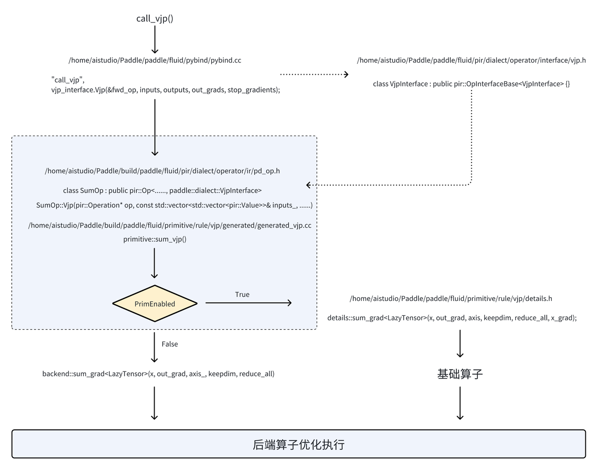
