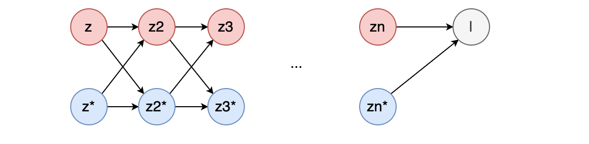

本文主要讲述如何

1. 从实数的微分法则推广到复数的微分法则；
2. 如何推广链式法则到复数数域；
3. 复数微分的两种习惯以及它们之间的关系。

## 实函数的微分

实函数(Real Function)指定义域(domain)和值域(range, 也称 image 象)或对应域(co-domain)均为实数集的子集的函數。是函数的特性之一是可以在坐标平面上画出图形。

对于一个函数 $f$ , 其定义域和值域都是实数集的子集，如果 $f(x)$ 在 $x_{0}$ 点的左极限和右极限都存在，且相等，那么函数在 $f$ 在 $x_{0}$ 可微。函数 $f$ 在该点的导数定义为：

$$
\lim_{h \rightarrow 0}\frac{f(x_{0} + h) - f(x_{0})}{h}
$$

对于实变函数，[解析函数(Analytic Function)](https://zh.wikipedia.org/wiki/解析函数]) 是一个比可微更强的条件。对于定义实变函数 $f: D \rightarrow \mathbb{R}$, 在 $x_{0}$ 点的邻域实解析 (real analytic) 的定义是, $f$ 在这个领域内可以表示为下述的收敛幂级数。

$$
f(x) = \sum_{n=0}^{\infty} a_{n}(x-x_{0})^{n}
$$

其中 $a_{i}, i=0, 1, 2,...$ 均为实数。这同时意味着它无穷可微（这个特性又称为：光滑 Smooth）。但值得注意的是光滑函数不一定是解析函数。

## 复函数的微分

一般意义的复函数，指定义域和值域均为复数集的子集的函数。

对于一个复函数 $f$ , 其定义与和值域都是复数集的子集。直观的理解复函数的可微性：如果 $f$ 在 $z_{0}$ 点的一个领域内，从任何方向，以任意方式趋近 $z_{0}$ , 下述极限都存在，且都相等。

$$
\lim_{h \rightarrow 0}\frac{f(z_{0} + h) - f(z_{0})}{h}
$$

如果以上的条件满足，那么就认为 $f$ 在 $z_{0}$ 的邻域可微 (differentiable)。 这虽然是实数情形的直接扩展，也符合“变化率之比的极限”这一本质，但是复函数的可微是远比实函数的可微更强的条件。对于复函数来说，可微同时也意味着复解析 (complex analytic), 全纯 (holomorphic) 或者正则 (regular).

复解析 (complex analytic)：函数 $f:U \rightarrow \mathbb{C}$ 在定义域上的某个点 $z_{0}$ 的领域上可以表示为下述收敛幂级数，则在这一点复解析。

$$
f(z) = \sum_{n=0}^{\infty}c_{n}(z - z_{n})^n
$$

其中 $c_{i}, i=0, 1, 2, ...$ 均为复数, $U$ 为复平面的一个开子集。在整个复平面都全纯的函数，被称为整函数 (Entire function)。

复函数可以被拆分为实部和虚部两个函数，它们都是 z 的实部(x)和虚部(y) 的函数。亦即可以把一个 $\mathbb{C} \rightarrow \mathbb{C}$ 的函数表示为 $\mathbb{R}^{2} \rightarrow \mathbb{R}^{2}$.

$$
f(z) = f(x+jy) \triangleq u(x, y) + jv(x, y), z = x + jy
$$

可以证明，如果复函数 f 需要满足以上的 holomorphic 条件，则需要满足柯西-黎曼方程（Cauchy-Riemann differential equations).

$$
\begin{align}
\frac{\partial u(x, y)}{\partial x} = \frac{\partial v(x, y)}{\partial y} \\
\frac{\partial v(x, y)}{\partial x} = -\frac{\partial u(x, y)}{\partial y}
\end{align}
$$

证明方式：

以实数轴的方式逼近 $z_{0}$ , 可以推导出这个方向的偏导数（如果存在）是：

$$
\begin{align}
& \lim_{h \rightarrow 0}\frac{f(z_{0} + h) - f(z_{0})}{h} \\
=& \lim_{\Delta x \rightarrow 0} \frac{\Delta u + j \Delta v}{\Delta x}
\end{align}
$$

沿着虚轴的方式逼近 $z_{0}$ , 可以推导出这个方向的偏导数（如果存在）是

$$
\begin{align}
& \lim_{h \rightarrow 0}\frac{f(z_{0} + h) - f(z_{0})}{h} \\
=& \lim_{\Delta y \rightarrow 0} \frac{\Delta u + j \Delta v}{j \Delta y} \\
=& \lim_{\Delta y \rightarrow 0} \frac{\Delta v - j \Delta u}{\Delta y}
\end{align}
$$

令这两个方向的偏导数相等，即可得出柯西-黎曼方程。

而反过来，如果满足了柯西-黎曼方程，那么假定在某个点 $z_{0}$ 的领域，存在如下的关系

$$
\begin{align}
\frac{\partial u(x, y)}{\partial x} = \frac{\partial v(x, y)}{\partial y} = k_{1}\\
\frac{\partial v(x, y)}{\partial x} = -\frac{\partial u(x, y)}{\partial y}  = k_{2}
\end{align}
$$

那么可以推导出

$$
\begin{align}
& \lim_{h \rightarrow 0}\frac{f(z_{0} + h) - f(z_{0})}{h} \\
=& \lim_{\Delta x \rightarrow 0 \Delta y \rightarrow 0} \frac{\Delta u + j \Delta v}{\Delta x + j \Delta y} \\
=& \lim_{\Delta x \rightarrow 0 \Delta y \rightarrow 0} \frac{\Delta u \Delta x + \Delta v \Delta y + j(\Delta v \Delta x - \Delta u \Delta y)}{\Delta x ^{2} + \Delta y^{2}} \\
=& \lim_{\Delta x \rightarrow 0 \Delta y \rightarrow 0} \frac{k_{1} \Delta x^{2} + k_{1} \Delta y^{2} + j(k_{2} \Delta x^{2} + k_{2} \Delta y^{2})}{\Delta x ^{2} + \Delta y^{2}} \\
=& k_{1} + jk_{2}
\end{align}
$$

确实是一个常量，和 $\Delta x, \Delta y$ 都没有关系了。因此在这个领域内

$$
\lim_{h \rightarrow 0}\frac{f(z_{0} + h) - f(z_{0})}{h}
$$

都存在且都相等，因此 $f$ 在 $z_{0}$ 可微。

## 非全纯函数

非全纯函数，从数学的角度来说就是不可微分了。但这种条件下仍然有值得研究的问题。首先我们从定义在复数域上的实函数开始，这是我们感兴趣的问题，因为一般神经网络优化的目标也是一个实数。

$$
w = f(z) = u(x, y) , w \in \mathbb{R}, z \in \mathbb{C}, z = x + jy
$$

因为 $v(x,y) \equiv 0$, 所以 Cauchy-Riemann 等式一般不成立，因此这些函数一般不是 holomorphic. 只有一种平凡的条件下实函数才能是 holomorphic 的。

$$
\frac{\partial u(x, y)}{\partial x} \equiv 0  \\
$$

$$
\frac{\partial u(x, y)}{\partial y} \equiv 0
$$

而这种情况下 f 的值只能是一个固定的实数，这种平凡的情形并没有什么研究的价值。对于优化来说，优化的目标总是可以用实数来衡量的，而实函数一般又不全纯(holomorphic), 那么要怎么优化它呢？

## 转为实函数

从直觉入手，可以把 $\mathbb{C} \rightarrow \mathbb{R}$ 函数理解为为 $\mathbb{R}^{2} \rightarrow \mathbb{R}$ 函数，亦即将其实部和虚部当作两个单独的变量，然后用多元实函数的方式优化函数的输出。亦即把 $u(z)$ 重新理解为 $u(x, y)$.

那么其梯度就是

$$
\nabla u = [\frac{\partial u}{\partial x}, \frac{\partial u}{\partial y}]^{T}
$$

沿着这个方向的反方向优化，就是正常的 gradient descent 方法。这是一种符合直觉的做法，将复平面上的优化转化为一般的二元函数的优化，就可以利用已有的关于多元函数的优化方式。

如果以优化的方式表述，则是

$$
x = x - \lambda \frac{\partial u}{\partial x} \\
$$

$$
y = y - \lambda \frac{\partial u}{\partial y}
$$

那么如果再以某种方式将这量个偏导数重新组合成复数的形式，那么就是

$$
\frac{\partial u}{\partial x} + j \frac{\partial u}{\partial y}
$$

如果我们此处用一个并不太严谨的符号来表示它，比如

$$
\frac{\partial u}{\partial z} = \frac{\partial u}{\partial x} + j \frac{\partial u}{\partial y}
$$

那么更新的公式就可以和实数的情况看起来更统一。

$$
z = z - \lambda \frac{\partial u}{\partial z}
$$

由此还可以推导出链式法则的扩展，亦即 vjp 公式。这样就可以处理函数中间的复数变量梯度回传的情况了。

### 推导链式法则

假定 $z = x + jy$, $f(z) = u + vj$, $l(f) = l$，

其中 $x, y, u, v, l$ 都是实数，并且这里也复用函数名和函数的返回值的名字。那么根据实函数的链式法则，也可以推广得到

假定已知

$$
\frac{\partial l}{\partial f} = \frac{\partial l}{\partial u} +j \frac{\partial l}{\partial v}
$$

根据链式法则可以推导出

$$
\frac{\partial l}{\partial x} = \frac{\partial l}{\partial u} \frac{\partial u}{\partial x} + \frac{\partial l}{\partial v} \frac{\partial v}{\partial x} \\
$$

$$
\frac{\partial l}{\partial y} = \frac{\partial l}{\partial u} \frac{\partial u}{\partial y} + \frac{\partial l}{\partial v} \frac{\partial v}{\partial y}
$$

或者也可以写成矩阵乘法的形式

$$
\begin{bmatrix} \frac{\partial l}{\partial x} & \frac{\partial l}{\partial y} \\
\end{bmatrix} =
\begin{bmatrix}\frac{\partial l}{\partial u} & \frac{\partial l}{\partial v} \\
\end{bmatrix}
\begin{bmatrix}
\frac{\partial u}{\partial x} & \frac{\partial u}{\partial y} \\
\frac{\partial v}{\partial x} & \frac{\partial v}{\partial y}
\end{bmatrix}
$$

这样就和实函数的 vjp 的形式更像了。如果把 $(x, y) \rightarrow (u, v)$ 视为一个向量输入，向量输出的函数， vjp 的公式也是一模一样。

但是接下来我们可能要问的一个问题是？这么写会不会有什么问题？它和全纯函数，亦即复解析函数情况下，从实数微分到复数微分的自然推广相违背吗，将这一套推广到全纯函数会怎样？为了解答这个问题，我们需要从一套经典的 Wertinger Calculus 基础讲起，在 Wertinger Calculus 的语境下处理非全纯函数，进而用另一种方式推导链式法则，最后证明两种方法的等价。

## Wertinger Calculus

### R-C 函数

首先根据微分的线性，可以先自然的推广一下，得到如下的引理：

复数 $s = u +jv$ 是实数 $x$ 的函数，那么

$$
\frac{\partial s}{\partial x} = \frac{\partial u}{\partial x} + j\frac{\partial v}{\partial x}
$$

因为其定义域是实数，所以它的可微性等价于实部和虚部都可微。

### C-C 非解析函数

对于复函数 $f(z) = s$, 其中 $z = x+jy$，$s = u+jv$ ，假设其不是复解析函数，但是实部 $u$ 和虚部 $v$ 是 $(x,y)$ 的实解析函数，亦即四个偏导数都存在

$$
\frac{\partial u}{\partial x}, \frac{\partial u}{\partial y}, \frac{\partial v}{\partial x}, \frac{\partial v}{\partial y}
$$

那么，可以将 $f$ 视为 $z, \bar{z}$ 的函数，并且认为 $z, \bar{z}$ 是两个独立的变量，可以得到一个新的函数 $F(z, \bar{z})$,它使用和 $f$ 一样的表达式，但是切断了 $z$ 和 $\bar{z}$ 之间的联系。在不致产生歧义的情况下，也可以不改变符号，仍然使用 $f(z, \bar{z})$. 但是它们是不一样的函数。

接下来可以证明 $F$ 对 $z$ 以及 $\bar{z}$ 都是复解析函数。

首先定义两个函数

$$
x(z) = \frac{1}{2}(z + \bar{z}) \\
$$

$$
y(z) = -\frac{j}{2}(z - \bar{z})
$$

分别是提取复数的实部和虚部的函数。当然这两个函数本身也是非复解析的，这点和容易证明，只需要从实轴和虚轴两个方向趋近某个点来计算变化率的极限就发现不相等。但是通过切断 $z$ 和 $\bar{z}$ 的联系，就可以得到复解析的 $\mathbb{C}^{2} \rightarrow \mathbb{R}$ 函数。

$$
x(z, \bar{z}) = \frac{1}{2}(z + \bar{z}) \\
$$

$$
y(z, \bar{z}) = -\frac{j}{2}(z - \bar{z})
$$

那么由于 $f$ 的实部和虚部对于 $x, y$ 是实解析的，那么根据复解析函数的链式法则，可知， $f(z, \bar{z})$ 对于 $z, \bar{z}$ 也都是复解析的，可以得到

$$
\frac{\partial f}{\partial z} = \frac{\partial f}{\partial x}\frac{\partial x}{\partial z} + \frac{\partial f}{\partial y}\frac{\partial y}{\partial z} \\
$$

$$
\frac{\partial f}{\partial \bar{z}} = \frac{\partial f}{\partial x}\frac{\partial x}{\partial \bar{z}} + \frac{\partial f}{\partial y}\frac{\partial y}{\partial \bar{z}}
$$

其中

$$
\frac{\partial x}{\partial z} = \frac{1}{2} \\
$$

$$
\frac{\partial x}{\partial \bar{z}} = \frac{1}{2} \\
$$

$$
\frac{\partial y}{\partial z} = -\frac{j}{2} \\
$$

$$
\frac{\partial y}{\partial \bar{z}} =\frac{j}{2} \\
$$

代入上述公式中，可以得到

$$
\frac{\partial f}{\partial z} = \frac{1}{2}(\frac{\partial f}{\partial x} - j\frac{\partial f}{\partial y}) \\
$$

$$
\frac{\partial f}{\partial \bar{z}} = \frac{1}{2}(\frac{\partial f}{\partial x} +j\frac{\partial f}{\partial y}) \\
$$

至此，推导出了 Wertinger Derivative 的标准形式。同时也可以看出，其中的共轭梯度的方向和拆分为实部虚部的方式推导的一致。（但是有一个系数的差别，这又是为什么？）

### 共轭微分引理

下面推导 Wertinger Derivative 的几个性质。将上述 R-C 函数的微分形式展开，代入 Wertinger Derivative 公式中，可以推导得出。(这个过程需要把微分全部展开为实数与实数的微分)

$$
\frac{\partial f}{\partial z} = \overline{\frac{\partial \bar{f}}{\partial \bar{z}}} \\
$$

$$
\frac{\partial f}{\partial \bar{z}} = \overline{\frac{\partial \bar{f}}{\partial z}}
$$

### 推导链式法则

令 $z = x +jy$, $s(z) = u + jv$, $l(s) = l$，其中 $x, y, u, v, l$ 都是实数。

那么已知

$$
\frac{\partial l}{\partial s}, \frac{\partial l}{\partial \bar{s}}
$$

可以根据复解析函数的链式法则，推导出

$$
\frac{\partial l}{\partial z} = \frac{\partial l}{\partial s}\frac{\partial s}{\partial z} + \frac{\partial l}{\partial \bar{s}}\frac{\partial \bar{s}}{\partial z} \\
$$

$$
\frac{\partial l}{\partial \bar{z}} = \frac{\partial l}{\partial s}\frac{\partial s}{\partial \bar{z}} + \frac{\partial l}{\partial \bar{s}}\frac{\partial \bar{s}}{\partial \bar{z}} \\
$$

这也可以表示成矩阵乘法的形式

$$
\begin{bmatrix} \frac{\partial l}{\partial z} & \frac{\partial l}{\partial \bar{z}} \end{bmatrix}=
\begin{bmatrix} \frac{\partial l}{\partial s} & \frac{\partial l}{\partial \bar{s}} \end{bmatrix}
\begin{bmatrix} \frac{\partial s}{\partial z} & \frac{\partial s}{\partial \bar{z}} \\
\frac{\partial \bar{s}}{\partial z} & \frac{\partial \bar{s}}{\partial \bar{z}}
\end{bmatrix}
$$

使用上述的引理化简，可以将公式扩展到用实数到实数的偏微分来表示的形式。

$$
\frac{\partial l}{\partial z} = \frac{1}{2}[(\frac{\partial l}{\partial u}\frac{\partial u}{\partial x} +\frac{\partial l}{\partial v}\frac{\partial v}{\partial x}) - j(\frac{\partial l}{\partial u}\frac{\partial u}{\partial y} + \frac{\partial l}{\partial v}\frac{\partial v}{\partial y})] \\
$$

$$
\frac{\partial l}{\partial \bar{z}} = \frac{1}{2}[(\frac{\partial l}{\partial u}\frac{\partial u}{\partial x} + \frac{\partial l}{\partial v}\frac{\partial v}{\partial x}) + j(\frac{\partial l}{\partial u}\frac{\partial u}{\partial y} + \frac{\partial l}{\partial v}\frac{\partial v}{\partial y})]
$$

对于使用拆分为实部和虚部的方式来说，其实所计算的梯度的方向是和共轭梯度一致的。首先从起始梯度

$$
\frac{\partial l}{\partial \bar{s}} = \frac{1}{2}(\frac{\partial l}{\partial u} +j\frac{\partial l}{\partial v})
$$

开始，这对应着 vjp 中的 v. 对于这个梯度而言，实部和虚部分别是

$$
\frac{1}{2}\frac{\partial l}{\partial u}, \frac{1}{2}\frac{\partial l}{\partial v}
$$

代入拆分为实部虚部的方式多推导得到的链式法则，可以得出 $\frac{\partial l}{\partial \bar{z}}$ 的实部和虚部分别为

$$
\frac{1}{2}(\frac{\partial l}{\partial u}\frac{\partial u}{\partial x} + \frac{\partial l}{\partial v}\frac{\partial v}{\partial x}) \\
$$

$$
\frac{1}{2}(\frac{\partial l}{\partial u}\frac{\partial u}{\partial y} + \frac{\partial l}{\partial v}\frac{\partial v}{\partial y})
$$

和使用 Wertinger 微分推导的结果一致。

pytorch, tensorflow 使用的是和 jax 不一样的 convention, 它们 vjp 计算的分别是

Torch/tensorflow 的规则

$$
\frac{\partial l}{\partial \bar{s}} \rightarrow \frac{\partial l}{\partial \bar{z}}
$$

jax 的规则

$$
\frac{\partial l}{\partial s} \rightarrow \frac{\partial l}{\partial z}
$$

对于 jax 的计算结果而言，在优化器更新参数前，还需要进行一次复共轭，才是正确的优化方向。

## 复数函数微分示例

$$
f(z) = cz = cx + jcy, c \in \mathbb{C}
$$

c 是常数。

$$
\frac{\partial f}{\partial z} = \frac{1}{2}(\frac{\partial f}{\partial x} -j \frac{\partial f}{\partial y}) = \frac{1}{2}(c -jjc) = c \\
$$

$$
\frac{\partial f}{\partial \bar{z}} = \frac{1}{2}(\frac{\partial f}{\partial x} + j \frac{\partial f}{\partial y}) = \frac{1}{2}(c +jjc) = 0
$$

这样看起来还是很符合直觉，而且和实数数乘的规则一致。

$$
f(z) = c\bar{z} = cx - jcy, c \in \mathbb{C}
$$

c 是常数。

$$
\frac{\partial f}{\partial z} = \frac{1}{2}(\frac{\partial f}{\partial x} -j \frac{\partial f}{\partial y}) = \frac{1}{2}(c -j(-j)c) = 0 \\
$$

$$
\frac{\partial f}{\partial z^{*}} = \frac{1}{2}(\frac{\partial f}{\partial x} + j \frac{\partial f}{\partial y}) = \frac{1}{2}(c + j(-j)c) = c
$$

也和实数数乘的规则一致。而且可以看出，复解析函数对 $\bar{z}$ 的微分是 0，亦即复解析函数与 $\bar{z}$ 无关。

$$
f(z) = z\bar{z} = x^{2} + y^{2}
$$

$$
\frac{\partial f}{\partial z} = \frac{1}{2}(\frac{\partial f}{\partial x} -j \frac{\partial f}{\partial y}) = \frac{1}{2}(2x -j 2y) = \bar{z} \\
$$

$$
\frac{\partial f}{\partial \bar{z}} = \frac{1}{2}(\frac{\partial f}{\partial x} + j \frac{\partial f}{\partial y}) = \frac{1}{2}(2x + j2y) = z
$$

这也和实数乘法的规则一致。一般来说，只要把 $z^{*}$ 当作独立于 $z$​ 的另一个变量就可以和实数规则一样计算了。

## 复数微分链式法则示例

下面的例子中，都会认为函数的最终输出是一个实数，亦即反向传播时，起始点是一个实数。在这个条件下才有优化的方向。

$$
s = f(z, z_{2}) = zz_{2}
$$

这对 $z_{1}$ 是一个复解析函数。令 $z = 1+2j, z_{2}=3 + 4j$, 那么 $s = -5+10j$ .

令 $\frac{\partial l}{\partial s} = 1 +0j$, 计算 $\frac{\partial l}{\partial z}$ 和 $\frac{\partial l}{\partial \bar{z}}$.

首先可以计算

$$
\begin{align}
\frac{\partial s}{\partial z} &= z_{2} = 3 + 4j \\
\frac{\partial s}{\partial \bar{z}} &= 0
\end{align}
$$

注意因为 $l$ 是实数，所以

$$
\frac{\partial l}{\partial s} = \overline{\frac{\partial l}{\partial \bar{s}}}
$$

根据 Wertinger 法则的计算方法是

$$
\begin{align}
\frac{\partial l}{\partial z} &= \frac{\partial l}{\partial s}\frac{\partial s}{\partial z} + \frac{\partial l}{\partial \bar{s}}\frac{\partial \bar{s}}{\partial z} \\
&= \frac{\partial l}{\partial s}\frac{\partial s}{\partial z} + \frac{\partial l}{\partial \bar{s}}\overline{\frac{\partial s}{\partial \bar{z}}} \\
&= (1 + 0j)(3+4j) + (1-0j)* 0 \\
&=3 + 4j
\end{align}
$$

$$
\begin{align}
\frac{\partial l}{\partial \bar{z}} &= \frac{\partial l}{\partial s}\frac{\partial s}{\partial \bar{z}} + \frac{\partial l}{\partial \bar{s}}\frac{\partial \bar{s}}{\partial \bar{z}} \\
&= \frac{\partial l}{\partial s}\frac{\partial s}{\partial \bar{z}} + \frac{\partial l}{\partial \bar{s}}\overline{\frac{\partial s}{\partial z}} \\
&= (1 + 0j)* 0 + (1-0j)*(3-4j) \\
&=3 - 4j
\end{align}
$$

接下来使用拆分为实部和虚部的方式计算。把函数写成实部和虚部的方式

$$
s = f(z, z_{2}) = zz_{2} = (x+jy)(x_{2} + jy_{2}) = (xx_{2} - yy_{2}) + j(xy_{2} + x_{2}y)
$$

故

$$
u =xx_{2} - yy_{2} \\
$$

$$
v = xy_{2} + x_{2}y
$$

四个偏微分分别是

$$
\begin{align}
\frac{\partial u}{\partial x} &= x_{2} = 3 \\
\frac{\partial u}{\partial y} &= -y_{2} = -4 \\
\frac{\partial v}{\partial x} &= y_{2} = 4 \\
\frac{\partial v}{\partial y} &= x_{2} = 3
\end{align}
$$

使用 vjp 公式计算

$$
\begin{bmatrix}
1 & 0
\end{bmatrix}
\begin{bmatrix}
3 & -4 \\
4 & 3
\end{bmatrix} =
\begin{bmatrix}
3 & -4
\end{bmatrix}
$$

故可以得到

$$
\frac{\partial l}{\partial \bar{z}} = 3 -4j \\
$$

$$
\frac{\partial l}{\partial z} = \overline{\frac{\partial l}{\partial \bar{z}}} = 3 + 4j
$$

两种计算方式结果一致。

再令

$$
\frac{\partial l}{\partial s} = 1+1j
$$

$$
\begin{align}
\frac{\partial l}{\partial z} &= \frac{\partial l}{\partial s}\frac{\partial s}{\partial z} + \frac{\partial l}{\partial \bar{s}}\frac{\partial \bar{s}}{\partial z} \\
&= \frac{\partial l}{\partial s}\frac{\partial s}{\partial z} + \frac{\partial l}{\partial \bar{s}}\overline{\frac{\partial s}{\partial \bar{z}}} \\
&= (1 + 1j)(3+4j) + (1-1j)* 0 \\
&= -1 + 7j
\end{align}
$$

$$
\begin{align}
\frac{\partial l}{\partial \bar{z}} &= \frac{\partial l}{\partial s}\frac{\partial s}{\partial \bar{z}} + \frac{\partial l}{\partial \bar{s}}\frac{\partial \bar{s}}{\partial \bar{z}} \\
&= \frac{\partial l}{\partial s}\frac{\partial s}{\partial \bar{z}} + \frac{\partial l}{\partial \bar{s}}\overline{\frac{\partial s}{\partial z}} \\
&= (1 + 1j)* 0 + (1-1j)*(3-4j) \\
&= -1 - 7j
\end{align}
$$

使用拆分为实部虚部的 vjp 计算方法，注意，这种方法的 v 是共轭梯度。

$$
\begin{bmatrix}
1 & -1
\end{bmatrix}
\begin{bmatrix}
3 & -4 \\
4 & 3
\end{bmatrix} =
\begin{bmatrix}
-1 & -7
\end{bmatrix}
$$

故可得到

$$
\frac{\partial l}{\partial \bar{z}} = -1 -7j \\
$$

$$
\frac{\partial l}{\partial z} = \overline{\frac{\partial l}{\partial \bar{z}}} = -1 + 7j
$$

也和 Wertinger Calculus 的计算方法完全一致。

接下来尝试一个非解析函数

$$
s = f(z) = z + \bar{z}^{2}
$$

令 $z = 1+2j$， 首先可以计算

$$
\frac{\partial s}{\partial z} = 1 \\
$$

$$
\frac{\partial s}{\partial \bar{z}} = 2\bar{z} = 2 - 4j
$$

然后计算四个实数偏微分

$$
s = (x+jy) + (x-jy)^{2} = x + x^{2} - y^{2} + j(y - 2xy)
$$

$$
u = x + x^{2} - y^{2} \\
$$

$$
v = y-2xy
$$

$$
\begin{align}
\frac{\partial u}{\partial x} &= 1 + 2x = 3 \\
\frac{\partial u}{\partial y} &= -2y = -4 \\
\frac{\partial v}{\partial x} &= -2y = -4 \\
\frac{\partial v}{\partial y} &= 1 - 2x = -1
\end{align}
$$

令

$$
\frac{\partial l}{\partial s} = 1+0j
$$

按照 Wertinger Calculus 方法计算

$$
\begin{align}
\frac{\partial l}{\partial z} &= \frac{\partial l}{\partial s}\frac{\partial s}{\partial z} + \frac{\partial l}{\partial \bar{s}}\frac{\partial \bar{s}}{\partial z} \\
&= \frac{\partial l}{\partial s}\frac{\partial s}{\partial z} + \frac{\partial l}{\partial \bar{s}}\overline{\frac{\partial s}{\partial \bar{z}}} \\
&= (1 + 0j)* 1 + (1-0j)* (2+4j) \\
&= 3 + 4j
\end{align}
$$

$$
\begin{align}
\frac{\partial l}{\partial \bar{z}} &= \frac{\partial l}{\partial s}\frac{\partial s}{\partial \bar{z}} + \frac{\partial l}{\partial \bar{s}}\frac{\partial \bar{s}}{\partial \bar{z}} \\
&= \frac{\partial l}{\partial s}\frac{\partial s}{\partial \bar{z}} + \frac{\partial l}{\partial \bar{s}}\overline{\frac{\partial s}{\partial z}} \\
&= (1 + 0j)*(2 - 4j) + (1-0j)*1 \\
&= 3 - 4j
\end{align}
$$

按照拆分实部和虚部的方法计算

$$
\begin{bmatrix}
1 & 0
\end{bmatrix}
\begin{bmatrix}
3 & -4 \\
-4 & -1
\end{bmatrix} =
\begin{bmatrix}
3 & -4
\end{bmatrix}
$$

$$
\frac{\partial l}{\partial \bar{z}} = 3-4j \\
$$

$$
\frac{\partial s}{\partial z} = \overline{\frac{\partial l}{\partial \bar{z}}} = 3 + 4j
$$

计算结果一致。

再令

$$
\frac{\partial l}{\partial s} = 1+1j
$$

按照 Wertinger Calculus 方法计算的结果是

$$
\begin{align}
\frac{\partial l}{\partial z} &= \frac{\partial l}{\partial s}\frac{\partial s}{\partial z} + \frac{\partial l}{\partial \bar{s}}\frac{\partial \bar{s}}{\partial z} \\
&= \frac{\partial l}{\partial s}\frac{\partial s}{\partial z} + \frac{\partial l}{\partial \bar{s}}\overline{\frac{\partial s}{\partial \bar{z}}} \\
&= (1 + 1j)* 1 + (1-1j)* (2+4j) \\
&= 7 + 3j
\end{align}
$$

$$
\begin{align}
\frac{\partial l}{\partial \bar{z}} &= \frac{\partial l}{\partial s}\frac{\partial s}{\partial \bar{z}} + \frac{\partial l}{\partial \bar{s}}\frac{\partial \bar{s}}{\partial \bar{z}} \\
&= \frac{\partial l}{\partial s}\frac{\partial s}{\partial \bar{z}} + \frac{\partial l}{\partial \bar{s}}\overline{\frac{\partial s}{\partial z}} \\
&= (1 + 1j)*(2 - 4j) + (1-1j)*1 \\
&= 7 - 3j
\end{align}
$$

按照拆分实部和虚部的方法计算

$$
\begin{bmatrix}
1 & -1
\end{bmatrix}
\begin{bmatrix}
3 & -4 \\
-4 & -1
\end{bmatrix} =
\begin{bmatrix}
7 & -3
\end{bmatrix}
$$

$$
\frac{\partial l}{\partial \bar{z}} = 7-3j \\
$$

$$
\frac{\partial s}{\partial z} = \overline{\frac{\partial l}{\partial \bar{z}}} = 7 + 3j
$$

计算结果一致。

## 总结

在最终输出是实数的预设下，将复数函数拆分为实数和复数的方法是将复数函数视为实数的等价方法，从梯度优化的方法触发，得到的方法。理解起来比较简单，心智负担也比较轻。

而 Wertinger Calculus 方法则从在非复解析函数的条件下，将一般复数的函数拆分为 $(z, \bar{z})$ 的二元函数的做法，在这种变化下，函数对两个输入变量都是复解析的。因此在链式法则中，总需要假设共轭变量的存在，计算多个路径的梯度之和。

对于复函数的 vjp(链式法则)，在最终输出是实数的预设下, $\frac{\partial l}{\partial s}$ 和 $\frac{\partial l}{\partial \bar{s}}$ 互为共轭，因此只需要传入一个即可。

对于 jax 选择的是 $\frac{\partial l}{\partial s}$， 而 torch/tensorflow 选择的是 $\frac{\partial l}{\partial \bar{s}}$ .

对于更长的链式调用，也是如此

## 参考文献

1. [The Complex Gradient Operator and the CR-Calculus](https://arxiv.org/abs/0906.4835)
2. [On the Computation of Complex-valued Gradients with Application to Statistically Optimum Beamforming](http://arxiv.org/abs/1701.00392)
3. [Wertinger Calculus](https://onlinelibrary.wiley.com/doi/pdf/10.1002/0471439002.app1)
