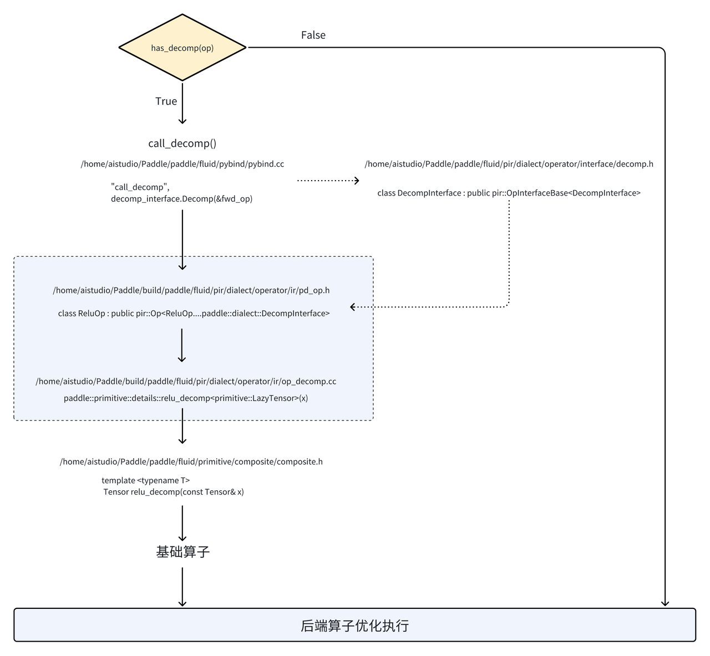
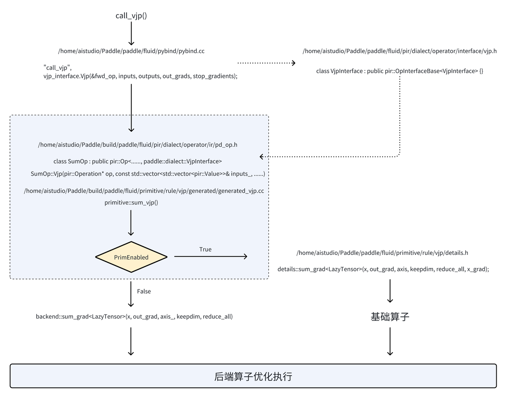

# 组合机制开发入门文档

> 版本，作者，时间

| 版本 | 作者   | 时间       | 主要更新           |
| ---- | ------ | ---------- | ------------------ |
| v1.0 | 程延福、卢林军 | 2024.08.09 | 初版               |

## 1. 组合机制涉及文件及作用

### 1.1 前向拆解需要修改的文件

- `paddle/fluid/pir/dialect/op_generator/decomp_interface_gen_op_list.py`: 组合机制前向算子注册文件。*decomp_interface_declare_gen_op_list* 和 *decomp_interface_implementation_gen_op_list* 结构中增加目标算子，可以自动在*pd_op.h* 和 *op_decomp.cc* 文件中生成该算子的前向拆解前置代码逻辑。（建议以字母序添加算子，减少代码冲突）。
- `paddle/fluid/primitive/composite/composite.h`: 算子前向组合机制逻辑实现文件，在该文件中编写算子的前向拆解逻辑。
- `Paddle/test/legacy_test/*`: 算子组合机制测试文件，根据算子的不同，测试文件名字有所差异。部分算子的测试文件在 *test_activation_op.py* 文件中，大部分以 *test_(op name)_op.py* 命名。在算子的测试文件中，首先需要在单测类的 *setUp()* 方法中，设置组合机制检查是否存在类似下面两行的属性初始化。

```Python
class TestExpFp32_Prim(OpTest):
    def setUp(self):
        # 表示组合机制算子类型。其中，comp 表示组合算子，prim 表示基础算子
        self.prim_op_type = "comp"
        # 指定python使用的公共API ，可以参考 self.python_api 字段。
        self.public_python_api = paddle.exp
```

- 如果不存在，需要为单测添加这两行。此外需要关注单测类中的 *test_check_output()* 和*test_check_grad()*函数，为该函数下属方法增加 *check_prim_pir=True* 选项。组合算子要在*test_check_output()* 和*test_check_grad()*函数中都添加，基础算子一般只在*test_check_grad()*函数中添加。

### 1.2 反向拆解需要修改的文件

- `paddle/fluid/primitive/codegen/gen.py`: 组合机制反向算子注册文件。根据算子类型将算子添加到 *UNARY_PRIM_VJP_OPS*、*BINARY_PRIM_VJP_OPS*、*OTHER_PRIM_VJP_OPS*、*CUSTOM_VJP* 中的某一个结构中，可自动在*generated_vjp.cc* 中生成该算子的反向拆解前置代码逻辑*。*
- `paddle/fluid/primitive/rule/vjp/details.h`: 算子反向组合机制逻辑实现文件，在该文件中编写算子的反向拆解逻辑。
- `test/legacy_test/*`: 算子组合机制测试文件，根据算子的不同，测试文件名字有所差异。部分算子的测试文件在 *test_activation_op.py* 文件中，大部分以 *test_(op name)_op.py* 命名。在算子的测试文件中，首先需要在单测类的*setUp()*方法中，设置组合机制的配置，即检查单测中是否存在类似下面两行的属性初始化。

```Python
class TestExpFp32_Prim(OpTest):
    def setUp(self):
        # 表示组合机制算子类型。其中，comp 表示组合算子，prim 表示基础算子
        self.prim_op_type = "comp"
        # 指定python使用的公共API ，可以参考 self.python_api 字段。
        self.public_python_api = paddle.exp
```

- 如果不存在，需要为单测添加这两行。此外需要关注单测类中的 *test_check_output()* 和*test_check_grad()*函数，需要为该函数下属方法增加 *check_prim_pir=True* 选项。组合算子要在*test_check_output()* 和*test_check_grad()*函数中都添加，基础算子一般只在*test_check_grad()*函数中添加。

### 1.3 其他文件

- `python/paddle/incubate/autograd/composite_rules.py`: 旧IR下组合算子的前向拆解规则，使用python实现，在*composite.h* 实现算子拆解逻辑时，可以参考该文件中的算子拆解逻辑。仅做参考，当文件中不存在待拆解算子的逻辑时，需要在`paddle/phi/kernels`文件夹下，找到算子实现对应的文件，查看算子的具体实现逻辑。也可以到对应单测中，参考目标算子的numpy实现。
- `paddle/fluid/prim/api/composite_backward/composite_backward_api.h`: 旧IR下组合算子的反向拆解规则，使用c++实现，在*details.h* 中实现时，可以参考（可以复制代码到*details.h*, 再修改错误）。
- `build/paddle/fluid/pir/dialect/operator/ir/op_decomp.cc`: 组合机制前向拆解的前置代码（调用*composite.h*），可以检查算子前向拆解的组合机制代码生成是否正确
- `build/paddle/fluid/pir/dialect/operator/ir/pd_op.h`: 组合机制前向拆解的前置代码（*op_decomp.cc* 的类定义），可以检查算子前向拆解的组合机制代码生成是否正确
- `build/paddle/fluid/primitive/rule/vjp/generated/generated_vjp.cc`: 组合机制反向拆解的前置代码（调用*details.h*），可以检查算子反向拆解的组合机制代码生成是否正确
- `build/paddle/fluid/primitive/primitive/primitive.h`: 基础算子代码实现，即可将目标算子拆解为该文件中的算子的组合形式
- `paddle/fluid/primitive/primitive.yaml`: 基础算子配置文件，包含所有基础算子名称，用来生成*primitive.h*
- `paddle/phi/api/yaml/op_compat.yaml`: 算子配置文件，可用来查看部分 *算子* 与 *算子别名* 对照关系
- `paddle/fluid/pir/dialect/operator/ir/ops_backward.yaml`: 反向算子函数格式配置文件，用来生成 *generated_vjp.cc*

## 2. 组合机制前向拆解开发流程 -- 以**relu**算子为例

**在没有特殊说明时，组合算子一般只进行前向拆解**。

- 相关pr: https://github.com/PaddlePaddle/Paddle/pull/58502



### 2.1 算子注册

打开 `decomp_interface_gen_op_list.py`文件，在*decomp_interface_declare_gen_op_list* 和 *decomp_interface_implementation_gen_op_list* 中注册新增 relu 算子。注册好后需要执行`Cmake`指令才会生成对应的前向拆解逻辑。

```Python
## paddle/fluid/pir/dialect/op_generator/decomp_interface_gen_op_list.py

# come into effect in generated file pd_op.h
# manual decomp interface declare are located in manual_op.h
decomp_interface_declare_gen_op_list = [
    "add_n",
    "pow",
    "relu",
    "rsqrt",
    "sigmoid",
    "silu",
    "softmax",
    "sqrt",
    "squeeze",
    "stack",
    "unsqueeze",
]

# come into effect in generated file op_decomp.cc
# manual decomp interface implementation are located in manual_op_decomp.cc
decomp_interface_implementation_gen_op_list = [
    "add_n",
    "pow",
    "relu",
    "rsqrt",
    "sigmoid",
    "silu",
    "softmax",
    "sqrt",
    "squeeze",
    "stack",
    "unsqueeze",
]
```

### 2.2 算子前向拆解规则开发

在 `paddle/fluid/primitive/composite/composite.h` 文件中，新增 *relu_decomop()* 函数（参考*op_decomp.cc*文件中自动生成的函数名、参数、返回值），参考*composite_rules.py* 中python实现，在该函数中实现算子的拆解规则（如果*composite_rules.py*不存在对应的逻辑，需要到`paddle/phi/kernel`中寻找对应算子的实现文件，也可以参考对应算子单测中的实现）。

```C++
// paddle/fluid/primitive/composite/composite.h

template <typename T>
Tensor relu_decomp(const Tensor& x) {
  return maximum<T>(x, full<T>(common::vectorize(x.dims()), 0.0, x.dtype()));
}
```

### 2.3 测试

在文件`Paddle/test/legacy_test/test_activation_op.py`中 找到算子对应的测试文件，在 *test_check_output* 以及*test_check_grad* 中新增 *check_prim_pir=True* 测试

打开对应文件夹，执行命令 `python test_activation_op.py TestRelu.test_check_output` 指定 `test_activation_op.py`文件中的 `TestRelu` 测试案例中的 `test_check_output` 函数，查看运行结果

```Python
# test/legacy_test/test_activation_op.py

class TestRelu(TestActivation):
    def setUp(self):
        self.op_type = "relu"
        self.python_api = paddle.nn.functional.relu
        self.prim_op_type = "comp"
        self.public_python_api = paddle.nn.functional.relu
        self.init_dtype()
        self.init_shape()
        self.if_enable_cinn()
        np.random.seed(1024)
        x = np.random.uniform(-1, 1, self.shape).astype(self.dtype)
        # The same reason with TestAbs
        x[np.abs(x) < 0.005] = 0.02
        out = np.maximum(x, 0)
        self.inputs = {'X': x}
        self.outputs = {'Out': out}
        self.convert_input_output()
    def test_check_grad(self):
        if self.dtype == np.float16:
            return
        self.check_grad(
            ['X'], 'Out', check_prim=True, check_pir=True, check_prim_pir=True
        )
    def test_check_output(self):
        self.check_output(check_prim=True, check_pir=True, check_prim_pir=True)
    def if_enable_cinn(self):
        pass
```

## 3. 组合机制反向拆解开发流程 -- 以 sum 算子为例

一般情况下，只有基础算子（prim** **op****）才需要进行反向拆解。



### 3.1 算子注册

在 `paddle/fluid/primitive/codegen/gen.py`文件中的 *OTHER_PRIM_VJP_OPS* 中新增 *sum_grad* 算子。注册好后需要执行`Cmake`指令才会生成对应的前向拆解逻辑。

添加规则：

- 基础算子根据算子输入和输出分类，分别插入到 UNARY_PRIM_VJP_OPS、BINARY_PRIM_VJP_OPS、OTHER_PRIM_VJP_OPS 中（具体分类可以查看下面的代码区）
- 非基础算子插入到 CUSTOM_VJP 中

**NOTE：**

- 基础算子和非基础算子的区分可以参考 `paddle/fluid/primitive/primitive.yaml` 文件。
- 建议以字母序注册 op_name , 减少代码冲突。

```Python
# paddle/fluid/primitive/codegen/gen.py

# 基础算子注册 list， 根据算子特性添加到对应位置
# prim算子中只有一个输入和一个输出，没有其他属性
UNARY_PRIM_VJP_OPS = [
    'abs_grad',
    'erf_grad',
    'exp_grad',
    'floor_grad',
    'log_grad',
    'sin_grad',
    'cos_grad',
    'tanh_grad',
]

#  prim算子中有两个个输入和一个输出，没有其他属性
BINARY_PRIM_VJP_OPS = [
    'add_grad',
    'divide_grad',
    'subtract_grad',
    'multiply_grad',
    'elementwise_pow_grad',
    'maximum_grad',
]

# prim算子中不满足上面两个条件
OTHER_PRIM_VJP_OPS = [
    'assign_grad',
    'cumsum_grad',
    'sum_grad',
    'cast_grad',
    'reshape_grad',
    'roll_grad',
    'split_grad',
    'transpose_grad',
    'concat_grad',
    'expand_grad',
    'gather_grad',
    'gather_nd_grad',
    'pad_grad',
    'prod_grad',
]

# 非基础算子注册 list
CUSTOM_VJP = [
    'dropout_grad',
    'gelu_grad',
    'hardswish_grad',
    'instance_norm_grad',
    'layer_norm_grad',
    'leaky_relu_grad',
    'silu_grad',
    'softmax_grad',
    'sqrt_grad',
]  # custom vjp list of composite op
```

### 3.2 算子反向拆解规则开发

在 `paddle/fluid/primitive/rule/vjp/details.h` 文件中新增 *sum_grad()* 函数 ，在该函数中实现 *sum_grad* 算子的拆解规则。

```C++
// paddle/fluid/primitive/rule/vjp/details.h

template <typename T>
void sum_grad(const Tensor& x,
              const Tensor& out_grad,
              const IntArray& axis,
              bool keepdim,
              bool reduce_all,
              Tensor* x_grad) {
  if (!x_grad) {
    return;
  }
  std::vector<int64_t> x_dim = common::vectorize<int64_t>(x.dims());
  int64_t axis_size = axis.size();
  int64_t x_dim_size = x_dim.size();
  reduce_all = false;
  if (reduce_all || axis_size == 0 || axis_size == x_dim_size) {
    reduce_all = true;
  } else {
    reduce_all = false;
  }
  auto x_grad_tmp = Tensor();
  if (x_dim_size == 1) {
    x_grad_tmp = expand<T>(out_grad, IntArray(x_dim));
  } else {
    if (!keepdim) {
      auto axis_ = std::vector<int64_t>();
      if (reduce_all) {
        for (int64_t i = 0; i < x_dim_size; i++) {
          axis_.push_back(i);
        }
      } else {
        axis_ = axis.GetData();
        for (int64_t i = 0; i < axis_size; i++) {
          if (axis[i] < 0) {
            axis_[i] = axis[i] + x_dim_size;
          }
        }
      }
      auto out_grad_shape = get_unsqueeze_dims(out_grad, axis_);
      auto out_grad_ = reshape<T>(out_grad, out_grad_shape);
      x_grad_tmp = expand<T>(out_grad_, IntArray(x_dim));
    } else {
      x_grad_tmp = expand<T>(out_grad, IntArray(x_dim));
    }
  }
  set_output<T>(x_grad_tmp, x_grad);
}
```

### 3.3 测试

在文件夹`test/legacy_test/test_sum_op.py`中 找到算子对应的测试文件，在 *test_check_grad* 中新增 *check_prim_pir=True* 。

打开对应文件夹，执行命令 `python test_sum_op.py TestSumOp.test_check_grad` 指定 `test_sum_op.py`文件中的 `TestSumOp` 测试案例中的 `test_check_grad` 函数，查看运行结果。若无法直接运行执行，需要在编译结束，并安装Paddle后，进入到build目录下，执行`ctest -R test_sum_op -V`。其中`-R [test_name]`的部分是指在所有单测中找到对应名字的单测并执行，`-V`是指打印详细的执行信息。

```Python
# test/legacy_test/test_sum_op.py

class TestSumOp(OpTest):
    def setUp(self):
        self.op_type = "sum"
        self.python_api = paddle.add_n
        self.public_python_api = paddle.add_n
        self.prim_op_type = "comp"
        self.init_kernel_type()
        self.use_mkldnn = False
        self.init_kernel_type()
        x0 = np.random.random((3, 40)).astype(self.dtype)
        x1 = np.random.random((3, 40)).astype(self.dtype)
        x2 = np.random.random((3, 40)).astype(self.dtype)
        self.inputs = {"X": [("x0", x0), ("x1", x1), ("x2", x2)]}
        y = x0 + x1 + x2
        self.outputs = {'Out': y}
        self.attrs = {'use_mkldnn': self.use_mkldnn}
        
    def init_kernel_type(self):
        self.dtype = np.float64
        
    def test_check_output(self):
        self.check_output(
            check_prim=True,
            check_cinn=True,
            check_pir=True,
        )
        
    def test_check_grad(self):
        self.check_grad(
            ['x0'],
            'Out',
            check_prim=True,
            check_cinn=True,
            check_pir=True,
            check_prim_pir=True,
        )
```

## 4. 组合机制前向计算动态shape支持开发流程——以stack算子为例

### 4.1 动态shape支持说明

在现有的静态图组网过程中，各个部分Tensor的shape通常是静态的（即Tensor维度固定，比如[2, 4, 6]），一旦组网完成后，如果Tensor的维度发生改变，静态图需要重新进行组网，额外增加了程序的运行时间。因此，在组网过程中引入动态shape（即Tensor维度并不固定，比如[-1, -1, 6]，或者[None, None, 6]，其中-1和None中的部分可以是任意数字）进行静态图构建后，Tensor的shape可以按照-1或None的位置进行任意变化，而不会因Tensor 的shape改变，导致静态图重新组网。

- 相关PR：https://github.com/PaddlePaddle/Paddle/pull/61696

### 4.2 算子前向拆解规则适配动态shape开发

先在`paddle/fluid/primitive/composite/composite.h`文件中找到需要适配动态shape的算子拆解规则。在适应动态shape前，`stack`算子的拆解规则如下：

```C++
// paddle/fluid/primitive/composite/composite.h
   
template <typename T>
Tensor stack_decomp(const std::vector<Tensor>& x, const int& axis) {
  // 这个部分涉及到了对x[0] shape的访问
  std::vector<int64_t> axis_tmp = {axis};
  auto out_shape = get_expand_dims(x[0], axis_tmp);

  std::vector<Tensor> concat_x;
  for (size_t i = 0; i < x.size(); ++i) {
    concat_x.push_back(reshape<T>(x[i], out_shape));
  }
  return concat<T>(concat_x, axis);
}
```

在上面的代码中

```C++
  std::vector<int64_t> axis_tmp = {axis};
  auto out_shape = get_expand_dims(x[0], axis_tmp);
```

涉及到了对`x[0]`shape的访问，若`x[0]`的shape是动态的，则其表示为`[-1,-1, 20, 50]`，在静态shape的处理场景中直接使用`get_expand_dims`进行处理，则会得到错误的结果。于是在这个地方需要使用`has_dynamic_shape(shape)`函数，对`x[0]`的shape进行判断，判断其是否属于动态shape，如果不属于，则直接走原来的执行方案，反之则需要走动态shape的执行方案。于是`stack`算子的拆解规则变为：

```C++
// paddle/fluid/primitive/composite/composite.h

template <typename T>
Tensor stack_decomp(const std::vector<Tensor>& x, const int& axis) {
  std::vector<Tensor> concat_x;
  if (has_dynamic_shape(x[0].shape())) {
        // 这里是动态shape的处理逻辑
  } else {
    std::vector<int64_t> axis_tmp = {axis};
    std::vector<int64_t> out_shape = get_expand_dims(x[0], axis_tmp);
    for (size_t i = 0; i < x.size(); ++i) {
      concat_x.push_back(reshape<T>(x[i], out_shape));
    }
  }

  return concat<T>(concat_x, axis);
}
```

接下来需要完成动态shape的处理逻辑，动态shape处理的核心逻辑，就是将Tensor的动态shape视作一个新的Tensor，这个表示shape的Tensor通常是一个一维数组。我们不需要知道这个表示shape的Tensor其内部具体数值是多少，通过调用基础算子对这个表示shape的Tensor进行操作，从而达到修改shape的目的。

具体来说，首先需要使用`shape<T>()`基础算子，获取Tensor的动态shape，`stack`算子由于需要在指定`axis`上新增一个用于concat的维度，所以其获取结果动态shape的方式为`shape<T>(unsqueeze<T>(x[0], {axis}))`。接下来，需要对数组`x`中的每一个Tensor都转化成相同的shape。具体修改如下：

```C++
//  paddle/fluid/primitive/composite/composite.h

template <typename T>
Tensor stack_decomp(const std::vector<Tensor>& x, const int& axis) {
    
  ......
      
  if (has_dynamic_shape(x[0].shape())) {
    Tensor out_shape = shape<T>(unsqueeze<T>(x[0], {axis}));
    for (size_t i = 0; i < x.size(); ++i) {
      concat_x.push_back(backend::reshape<T>(x[i], out_shape));
    }
  } else{
    
  ......
  }
  return concat<T>(concat_x, axis);
}
```

需要注意的是，在修改数组`x`中Tensor的维度时，使用的是`backend::reshape<T>`而不是`reshape<T>`。两者的区别在于`reshape<T>`基础算子在定义时，参数`shape`是`IntArray`类型，而在动态shape的场景下，表示shape的是一个Tensor，而不是`IntArray`。

```C++
// build/paddle/fluid/primitive/primitive/generated_primitive.h

template <typename T>
Tensor reshape(const Tensor& x, const IntArray& shape) {
    return backend::reshape<T>(x, shape);
}
```

相对的`backend::reshape<T>`中则是实现了参数`shape`为`Tensor`类型的函数重载，因此可以用于处理动态shape。

```C++
// paddle/fluid/primitive/backend/generated/generated_static_backend.cc

template <>
Tensor reshape<LazyTensor>(const Tensor& x, const Tensor& shape_) {
  pir::Value x_res = std::static_pointer_cast<LazyTensor>(x.impl())->value();
  pir::OpResult shape_res = std::static_pointer_cast<LazyTensor>(shape_.impl())->value().dyn_cast<pir::OpResult>();
  auto op_res = paddle::dialect::reshape(x_res, shape_res);
  Tensor out(std::make_shared<LazyTensor>(op_res));
  return out; 
}
```

### 4.3 测试

在文件`test/prim/pir_prim/test_prim_sub_graph_dynamic_shape.py`中，新建单测`TestPrimStack`，重写`setUp`方法。并定义`stack` 算子在动态图场景下的执行函数。 在编译和安装完成后，进入到build目录下，执行`ctest -R test_prim_sub_graph_dynamic_shape -V`进行测试，并查看其运行结果。

```Python
# test/prim/pir_prim/test_prim_sub_graph_dynamic_shape.py

def stack_net(x):
    y = x + 1
    return paddle.stack([x, y], axis=0)

class TestPrimStack(TestPrimBase):
    def setUp(self):
        np.random.seed(2023)
        self.dtype = "float32"                               # 数据类型
        self.x_shape = [1, 300, 4096]                        # 输入的静态shape
        self.init_x_shape = [None, None, 4096]               # 输入的动态shape
        self.x = np.random.random(self.x_shape).astype(self.dtype)
        self.net = stack_net                                 # 动态图的执行函数
        self.necessary_ops = "pd_op.stack"
        self.enable_cinn = False
        self.tol = 1e-6
```

`self.necessary_ops`的部分一般写`pd_op.[op_name]`，可以在`/paddle/build/paddle/fluid/pir/dialect/operator/ir/pd_op.h`文件中进行确认。

**NOTE：**

总的来说，对于动态shape的执行来说，只要不涉及到shape的使用，可以直接使用基础算子进行计算。涉及到shape操作的算子，需要先调用`shape<T>`将动态shape转化为tensor，然后调用`backend::[op_name]`执行对应的操作。在调用`backend::[op_name]`时，需要到`paddle/fluid/primitive/backend/generated/generated_static_backend.cc`文件中，找到对应方法的定义，观察其参数`shape`是否定义为`Tensor`类型，或者有`Tensor`类型的函数重载。

如果涉及到对动态shape的修改，可以使用基础算子对表示动态shape的Tensor进行处理，比较常用的算子有`backend::full_with_tensor<T>`，`backend::reshape<T>`，`slice<T>`， `stack<T>`。

## 5. 组合机制反向计算动态shape支持开发流程——以reduce_as_grad算子为例子

相关PR：https://github.com/PaddlePaddle/Paddle/pull/64016

### 5.1 开启反向计算动态shape支持：

当前Paddle在涉及到动态shape的反向计算时，是不会执行组合机制的反向拆解的，因此需要将目标算子添加到支持动态shape的方向算子列表中，首先打开`python/paddle/autograd/backward_utils.py`文件，将`pd_op.reduce_as`添加到`ALLOW_DYNAMIC_SHAPE_VJP_OPS`中

```python
# python/paddle/autograd/backward_utils.py

# TODO(CZ): to be removed when we support dynamic shape by default.
ALLOW_DYNAMIC_SHAPE_VJP_OPS = [
	...
    "pd_op.matmul",
    "pd_op.reduce_as",
]
```

### 5.2 算子反向拆解规则适配动态shape开发

反向拆解规则与前向拆解规则的方式基本一致，首先就是需要找到涉及到实际shape操作的部分，在`reduce_as_grad`算子中，可以看到他首先通过`target`和`out_grad`获取reduce掉的axis，然后在这个指定axis进行`expand`计算。这个部分获取axis的过程就涉及到对实际shape的操作，所以首先需要判断两个涉及到具体shape的变量是否是童泰shape，然后使用现有的基础算子`backend::expnad_with_tensor<T>`对其进行替代。

```c++
// paddle/fluid/primitive/rule/vjp/details.h

template <typename T>
void reduce_as_grad(const Tensor& x,
                    const Tensor& target,
                    const Tensor& out_grad,
                    Tensor* x_grad) {
  if (!x_grad) {
    return;
  }
  // 动态shape支持
  if (has_dynamic_shape(x.shape()) || has_dynamic_shape(out_grad.shape())) {
    auto x_grad_tmp = backend::expand_with_tensor<T>(out_grad, shape<T>(x));
    set_output<T>(x_grad_tmp, x_grad);
  } else {
    // 获取reduce_dim (对应axis_变量)
    std::vector<int64_t> x_dim = common::vectorize<int64_t>(x.dims());
    std::vector<int64_t> axis = common::vectorize<int64_t>(
        get_reduce_dims_from_out(x.dims(), target.dims()));
    int64_t axis_size = axis.size();
    if (axis_size == 0) {
      by_pass<T>(out_grad, x_grad);
      return;
    }
    int64_t x_dim_size = x_dim.size();

    auto x_grad_tmp = Tensor();
    // 在对应的reduce_dim上进行expand
    if (x_dim_size == 1) {
      x_grad_tmp = expand<T>(out_grad, IntArray(x_dim));
    } else {
      auto axis_ = std::vector<int64_t>();
      for (int64_t i = 0; i < axis_size; i++) {
        axis_.push_back(axis[i]);
        if (axis[i] < 0) {
          axis_[i] += x_dim_size;
        }
      }
      Tensor out_grad_ = out_grad;
      if (out_grad.shape().size() != x.shape().size()) {
        auto out_grad_shape = get_unsqueeze_dims(out_grad, axis_);
        out_grad_ = reshape<T>(out_grad, out_grad_shape);
      }
      x_grad_tmp = expand<T>(out_grad_, IntArray(x_dim));
    }

    set_output<T>(x_grad_tmp, x_grad);
  }
}
```

### 5.3 测试

在文件`test/prim/pir_prim/test_prim_sub_graph_backward_dynamic_shape.py`中，新建单测`TestPrimReduceAsWithGrad`，重写`setUp`方法。并定义`reduce_as_grad` 算子在动态图场景下的执行函数。 在编译和安装完成后，进入到build目录下，执行`ctest -R test_prim_sub_graph_dynamic_shape -V`进行测试，并查看其运行结果。

```Python
# test/prim/pir_prim/test_prim_sub_graph_dynamic_shape.py

def reduce_as_net(x, y):
    return paddle.reduce_as(x, y)

class TestPrimReduceAsWithGrad(TestPrimBaseOneGradTwoInputs):
    def setUp(self):
        np.random.seed(2023)
        self.dtype = "float32"
        self.y_shape = [30, 1, 40]
        self.init_y_shape = [None, None, 40]
        self.x_shape = [30, 200, 40]
        self.init_x_shape = [None, None, 40]
        self.x = np.random.random(self.x_shape).astype(self.dtype)
        self.y = np.random.random(self.y_shape).astype(self.dtype)
        self.net = reduce_as_net
        self.enable_cinn = False
        self.tol = 1e-5
        self.y_without_grad = True
```

## 6. 拆解常用函数及基础算子

### 6.1 常用函数

基本函数位置通常在`paddle/fluid/primitive/utils/utils.h`文件中定义，包括 `static bool is_half_dtype(const DataType& dtype)、static std::vector<int64_t> get_expand_dims(const Tensor& origin,const std::vector<int64_t>& axis)、static bool has_dynamic_shape(const std::vector<int64_t>& vec)` 等函数。

**示例：**

部分算子不支持 `[float16, bfloat16, uint16]`数据类型，在计算之前需要将该数据类型转换为 `float32`， `is_half_dtype()`用来判断该算子的类型是否符合要求，使用场景如下。(具体可查阅`utils.h`文件)

```C++
  bool need_cast = is_half_dtype(org_dtype);
  if (need_cast) {
    x_cast = cast<T>(x, phi::DataType::FLOAT32);
  }
```

**NOTE：**

可复用的的功能建议封装成一个函数，放在 `paddle/fluid/primitive/utils/utils.h` 文件中。

### 6.2 常用基础算子

基础算子的实现位于`paddle/fluid/primitive/primitive/primitive.h` 文件中，在 `details.h`和 `composite.h`中实现算子拆解的时候，可以直接调用基础算子实现。

**示例：**

在 `softmax`算子拆解的过程中，`max` 、`exp` 、 `sum` 、 `cast`、 `-`、 `/` 皆是基础算子。(具体可查阅`primitive.h`文件)

```C++
// paddle/fluid/primitive/composite/composite.h

template <typename T>
Tensor softmax_decomp(const Tensor& x, const int& axis) {
  auto org_dtype = x.dtype();
  auto x_tmp = x;
  auto axis_tmp = IntArray({axis});
  bool need_cast = is_half_dtype(org_dtype);
  if (need_cast) {
    x_tmp = cast<T>(x, phi::DataType::FLOAT32);
  }
  auto max_tmp = max<T>(x_tmp, axis_tmp, true);
  auto molecular = exp<T>(x_tmp - max_tmp);
  auto res = molecular / sum<T>(molecular, axis_tmp, molecular.dtype(), true);
  if (need_cast) {
    return cast<T>(res, org_dtype);
  } else {
    return res;
  }
}
```

**NOTE：**

Tensor 计算过程中，基础运算符 `+`、`-`、`*`、`/` 都进行了重载，其对应计算规则分别对应 `对位相加`、`对位相减`、`矩阵点乘`、`对位相除`，在算子拆解的过程中，应优先使用运算符。

### 6.3 动态Shape支持中常用基础算子

这类算子通常是以`backend::(op_name)`的形式展现，与直接使用`(op_name)`的算子不同之处在于`backend::`空间内的算子会重载算子本身，将原本指定具体shape的参数，转化为Tensor，比如`reshape`和`backend::reshape`算子。

```c++
template <>
Tensor reshape<LazyTensor>(const Tensor& x, const IntArray& shape) {
  pir::Value x_res = std::static_pointer_cast<LazyTensor>(x.impl())->value();
  auto op_res = paddle::dialect::reshape(x_res, shape.GetData());
  Tensor out(std::make_shared<LazyTensor>(op_res));
  return out;
}

template <>
Tensor reshape<LazyTensor>(const Tensor& x, const Tensor& shape_) {
  pir::Value x_res = std::static_pointer_cast<LazyTensor>(x.impl())->value();
  pir::Value shape_res = std::static_pointer_cast<LazyTensor>(shape_.impl())->value();
  auto op_res = paddle::dialect::reshape(x_res, shape_res);
  Tensor out(std::make_shared<LazyTensor>(op_res));
  return out;
}
```

要确定具体的`backend::`空间内的算子是否有Tensor类型参数的形式，可以在`build/paddle/fluid/primitive/backend/generated/generated_static_backend.cc`文件中查找。

另外`reduce_as`算子不是在`backend::`中的算子，但是他在动态shape的支持，尤其是涉及到广播的反向计算中经常使用，它会将当前的Tensor，按照目标Tensor的Shape进行reduce_sum。比如`add_grad`，直接调用`get_reduce_dims_from_out`会访问具体的Tensor shape，而动态shape场景下，部分shape是不确定的，这就导致求解出错误的dim，reduce_as将这一过程封装在kernel中，从而避免编译期直接访问具体的shape。

```c++
template <typename T>
void add_grad(const Tensor& x,
              const Tensor& y,
              const Tensor& out_grad,
              int axis,
              Tensor* dx,
              Tensor* dy) {
  if (dy) {
    if (has_dynamic_shape(y.shape()) || has_dynamic_shape(out_grad.shape())) {
      auto dy_tmp = reduce_as<T>(out_grad, y);
      set_output<T>(dy_tmp, dy);
    } else {
      if (out_grad.dims() != y.dims()) {
        phi::DDim reduce_dim =
            get_reduce_dims_from_out(out_grad.dims(), y.dims());
        auto dy_reduce_res =
            out_grad.sum(common::vectorize(reduce_dim), y.dtype(), false);
        auto dy_tmp = reshape<T>(dy_reduce_res, common::vectorize(y.dims()));
        set_output<T>(dy_tmp, dy);

      } else {
        by_pass<T>(out_grad, dy);
      }
    }
  }
  ...
}
```


## 7. 调试程序

### 7.1 log 打印

- python 程序可以在程序中对应位置使用 print 打印 log

```Python
print("log")
```

- c++ 程序在程序中使用 VLOG() 语句进行 log 打印，想要查看某个文件中的某些 log 时，需要执行环境变量配置 `export GLOG_vmodule=file_name=log_level` 用来指定具体的 c++ 文件名，和 VLOG 级别。

示例：

比如想要打印 `generated_vjp.cc`文件中，`VLOG(4)` 的 log，可以配置环境变量 `export GLOG_vmodule=generated_vjp=4`

```C++
VLOG(4) << "Call Pir Decomposed backward op abs_grad";
```

### 7.2 判断算子是否拆解成功

#### 7.2.1 查看对应文件是否生成

- **前向拆解**

检查`build/paddle/fluid/pir/dialect/operator/ir/op_decomp.cc`文件，算子对应的 `OP_NAME::Decomp()` 函数是否生成成功

- **反向拆解**

检查`build/paddle/fluid/primitive/rule/vjp/generated/generated_vjp.cc`文件，算子对应的 `OP_NAME_VJP()` 函数中是否生成组合机制`IsBwdPrimEnabled()`判断逻辑。

示例：

```C++
// build/paddle/fluid/primitive/rule/vjp/generated/generated_vjp.cc
// 未生成组合机制判断逻辑

std::vector<std::vectorautolinkpaddle::Tensorautolink> acosh_vjp(const Tensor& x, const Tensor& out_grad, const std::vector<std::vector<bool>>& stop_gradients) {
  std::vector<std::vectorautolinkpaddle::Tensorautolink> vjp_res;
  for (auto arg: stop_gradients) {
    vjp_res.push_back(std::vectorautolinkpaddle::Tensorautolink(arg.size()));
  }
  auto op_res = backend::acosh_grad<LazyTensor>(x, out_grad);
  vjp_res[0][0] = op_res;
  vjp_res = ConstructVjpResultByStopGradients(vjp_res, stop_gradients);
  return vjp_res;
}
// build/paddle/fluid/primitive/rule/vjp/generated/generated_vjp.cc
// 生成组合机制判断逻辑

std::vector<std::vectorautolinkpaddle::Tensorautolink> abs_vjp(const Tensor& x, const Tensor& out_grad, const std::vector<std::vector<bool>>& stop_gradients) {
  std::vector<std::vectorautolinkpaddle::Tensorautolink> vjp_res;
  for (auto arg: stop_gradients) {
    vjp_res.push_back(std::vectorautolinkpaddle::Tensorautolink(arg.size()));
  }
  std::string op_name = "abs_grad";
  auto need_skip = paddle::prim::StaticCompositeContext::Instance().CheckSkipCompOps(op_name);
  if (paddle::prim::StaticCompositeContext::Instance().IsBwdPrimEnabled() && !need_skip) {
    FLAGS_tensor_operants_mode = "static";
    VLOG(4) << "Call Pir Decomposed backward op abs_grad";
    paddle::Tensor* x_grad = !stop_gradients[0][0] ? &vjp_res[0][0] : nullptr;
    details::abs_grad<LazyTensor>(x, out_grad, x_grad);
  } else {
    auto op_res = backend::abs_grad<LazyTensor>(x, out_grad);
    vjp_res[0][0] = op_res;
    vjp_res = ConstructVjpResultByStopGradients(vjp_res, stop_gradients);
  }
  return vjp_res;
}
```

#### 7.2.2 检查日志

- **前向拆解**

配置 `export GLOG_vmodule=op_decomp=4`，用来打印 `op_decomp.cc`文件中对应算子的拆解规则函数 log -- "`Decomp call flatten's decomp interface begin`"

```C++
// build/paddle/fluid/pir/dialect/operator/ir/op_decomp.cc

std::vector<std::vectorautolinkpir::Valueautolink> FlattenOp::Decomp(pir::Operation* op) {
  VLOG(4) << "Decomp call flatten's decomp interface begin";
  FlattenOp op_obj = op->dyn_cast<FlattenOp>();
  (void)op_obj;
  ......
  }
```

- **反向拆解**

配置 `export GLOG_vmodule=generated_vjp=4`，用来打印 `generated_vjp.cc`文件中对应算子的拆解规则函数 log -- "`Call Pir Decomposed backward op abs_grad`"

```C++
// build/paddle/fluid/primitive/rule/vjp/generated/generated_vjp.cc

std::vector<std::vectorautolinkpaddle::Tensorautolink> abs_vjp(const Tensor& x, const Tensor& out_grad, const std::vector<std::vector<bool>>& stop_gradients) {
......
  std::string op_name = "abs_grad";
  auto need_skip = paddle::prim::StaticCompositeContext::Instance().CheckSkipCompOps(op_name);
  if (paddle::prim::StaticCompositeContext::Instance().IsBwdPrimEnabled() && !need_skip) {
    FLAGS_tensor_operants_mode = "static";
    VLOG(4) << "Call Pir Decomposed backward op abs_grad";
    ......
  } else {
    ......
  }
  return vjp_res;
}
```

### 7.3 检查是否正确拆解目标算子

这里有一个测试简单的例子，可以先把这段代码写入一个py文件，使用命令`FLAGS_enable_pir_api=true FLAGS_prim_enable_dynamic=true TRANSLATOR_VERBOSITY=1 FLAGS_enable_pir_api=1 python test.py`执行，就可以打印这个计算过程的前反向计算图了。先把`paddle.framework.core._set_prim_all_enabled(True)`注释掉关闭组合机制拆解，执行是可以看到`pd_op.reduce_as_grad`是在计算图中的。在开启组合机制拆解之后，计算图中不再存在`pd_op.reduce_as_grad`，说明`reduce_as_grad`的反向拆解成功了，由于`reduce_as`是prim算子，所以他不存在前向拆解的过程。

```python
# test.py

import paddle
# 开启组合机制拆解
paddle.framework.core._set_prim_all_enabled(True)

# 将动态图转化成静态图
@paddle.jit.to_static
def func(x, y):
    # 待测算子
    t = paddle.reduce_as(x, y)
    return t
    # return paddle.grad(t.sum(), [x, y])

x1 = paddle.randn([40,50,60])
x2 = paddle.randn([40,50,1])
x1.stop_gradient = False
x2.stop_gradient = False
tt = func(x1, x2)
print(tt[0].shape)
print(tt[1].shape)

```

对于有些默认不拆解的算子，还需要添加`FLAGS_prim_vjp_skip_default_ops=0`参数才能进行拆解
