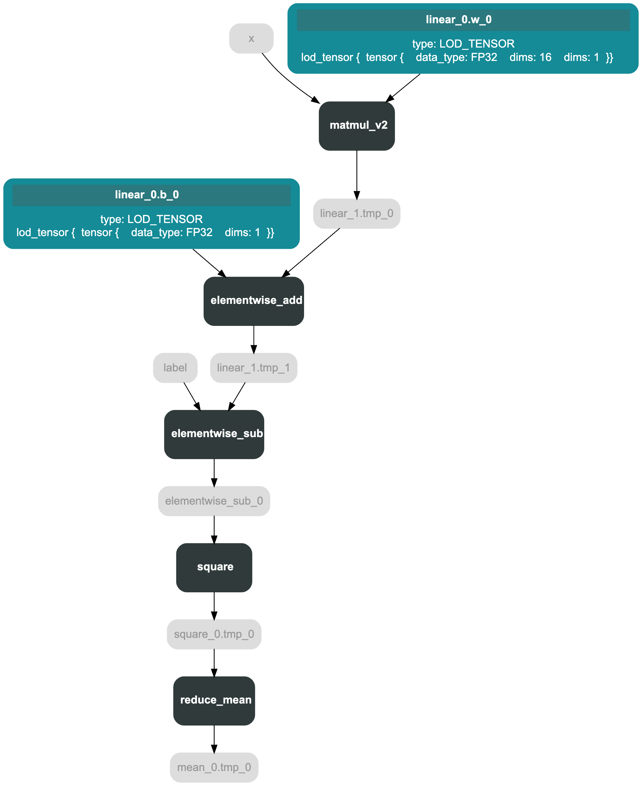
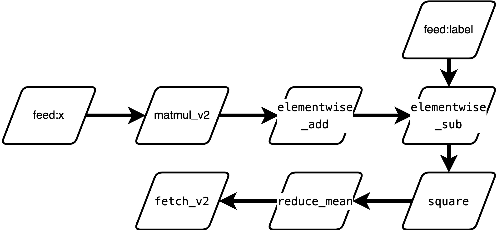
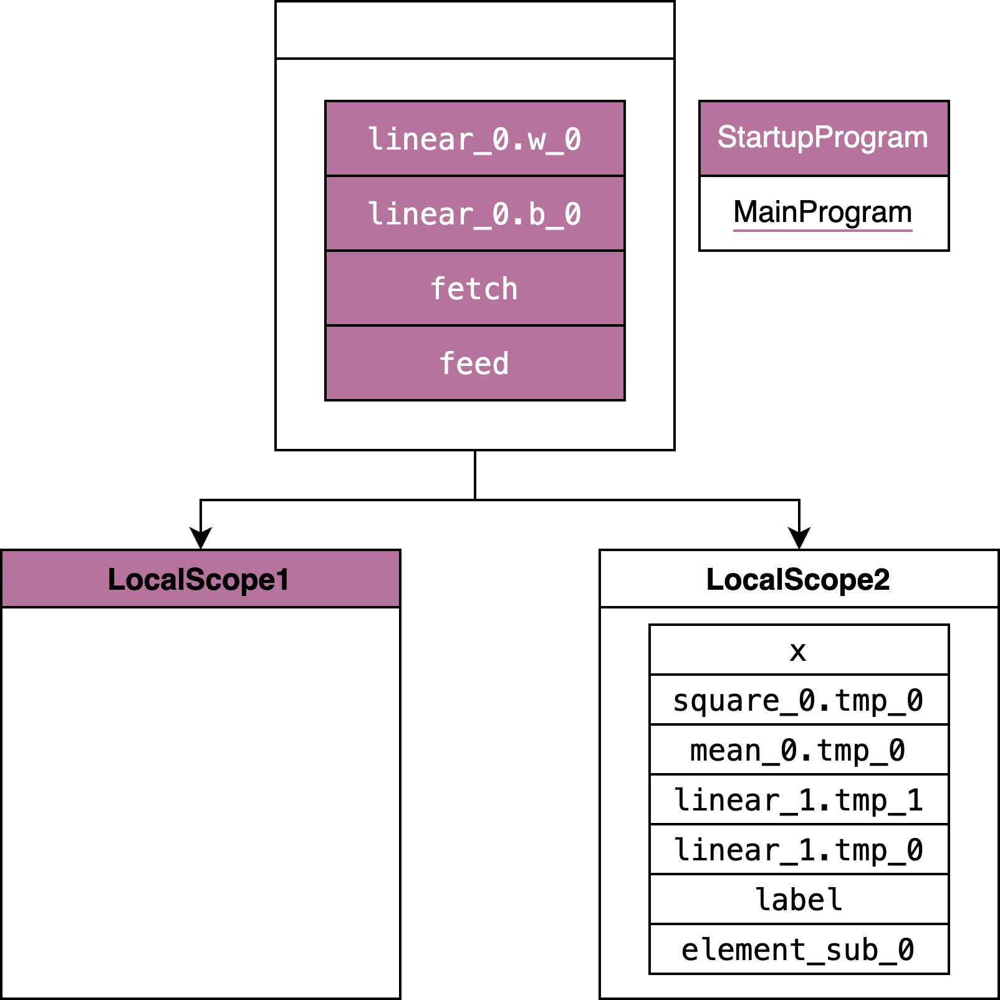
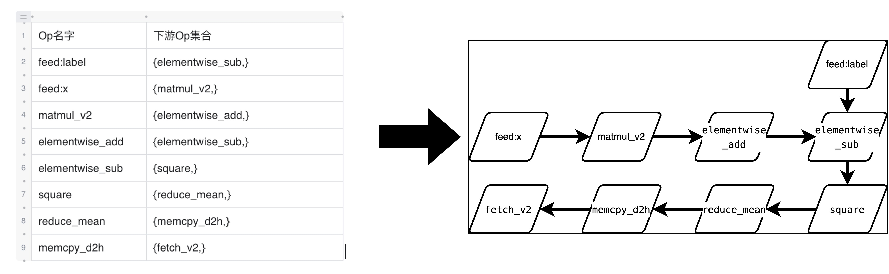
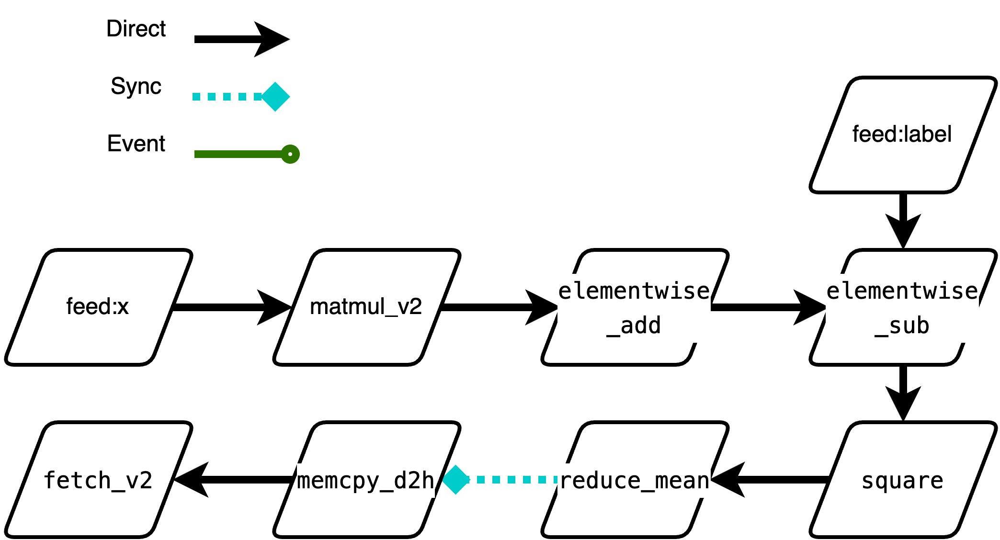
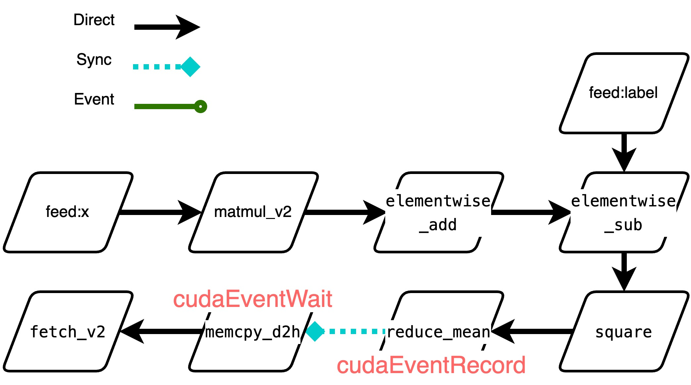
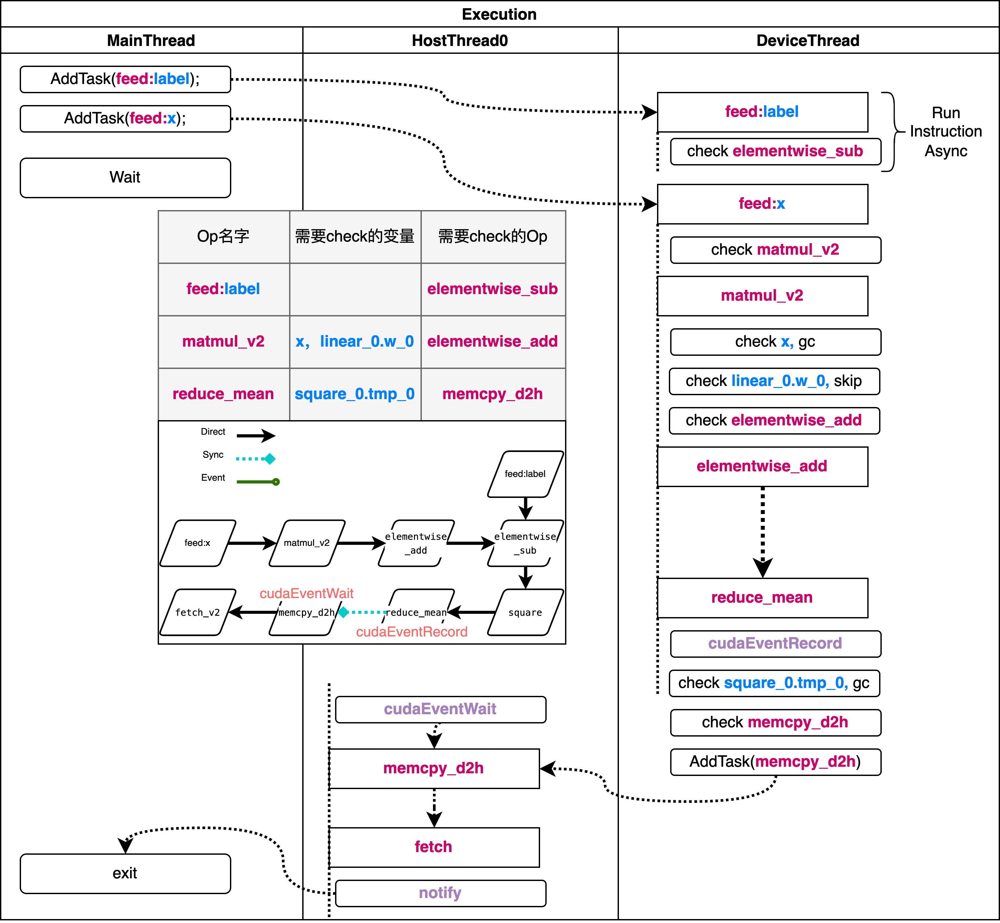

# 静态图执行过程

| 分享内容     | 静态图执行过程                         |
| ------------ | ------------- |
| 提交作者     | Lv yongkang(@kangguangli)  |
| 提交时间     | 2022-12-30    |
| 版本号       | v1.0                        |
| 依赖飞桨版本  | Paddle2.4.1            |
| 文件名       | 20221230_static_graph_execution.md |


## 代码示例

> [飞桨声明式编程（静态图）与命令式编程（动态图）](https://www.paddlepaddle.org.cn/tutorials/projectdetail/4047189#anchor-4)
>
>    从深度学习模型构建方式上看，飞桨支持声明式编程（静态图/Declarative programming）和命令式编程（动态图/Imperative programming两种方式。二者的区别是：
>
>    静态图采用先编译后执行的方式。用户需预先定义完整的网络结构，再对网络结构进行编译优化后，才能执行获得计算结果。
>
>    动态图采用解析式的执行方式。用户无需预先定义完整的网络结构，每执行一行代码就可以获得代码的输出结果。
>
>    在飞桨设计上，把一个神经网络定义成一段类似程序的描述，就是在用户写程序的过程中，就定义了模型表达及计算。
    举例来说，假设用户写了一行代码：y=x+1。在静态图模式下，运行此代码只会往计算图中插入一个Tensor加1的Operator，此时Operator并未真正执行，无法获得y的计算结果。但在动态图模式下，所有Operator均是即时执行的，运行完代码后Operator已经执行完毕，用户可直接获得y的计算结果。

飞桨支持静态图与动态图两种训练方式。对于静态图而言，执行网络的前向过程只会将相应的Operator加入到计算图中，需要通过执行器来实际调用计算逻辑。
以下面的代码为例，可以看到静态图的训练代码可以大致分为两部分：组网和执行。这篇分享主要讲解飞桨使用静态图训练网络中执行器的执行细节，同时也会简单说明静态图的组网过程。


```python
import numpy as np

import paddle
from paddle.static import Program, program_guard, Executor
from paddle.optimizer import Adam

paddle.enable_static()

#组网过程
main_program = Program()
startup_program = Program()
with program_guard(main_program, startup_program):
    x = paddle.static.data(shape = [16, 16], name = 'x')
    label = paddle.static.data(shape=[16, 1], name = 'label')
    out = paddle.nn.Linear(in_features=16, out_features=1)(x) 
    loss = paddle.nn.MSELoss()(out, label)
    optimizer = Adam()
    optimizer.minimize(loss)

#执行过程
place = paddle.CUDAPlace(0) if paddle.is_compiled_with_cuda() else paddle.CPUPlace()
exe = Executor(place)
exe.run(startup_program)

ret = exe.run(main_program,
            feed={'x': np.ones((16, 16), np.float32),'label': np.ones((16, 1), np.float32)},
            fetch_list=[loss])
```

## 一、组网过程

```python
main_program = Program()
startup_program = Program()
with program_guard(main_program, startup_program):
    x = paddle.static.data(shape = [16, 16], name = 'x')
    label = paddle.static.data(shape=[16, 1], name = 'label')
    out = paddle.nn.Linear(in_features=16, out_features=1)(x) 
    loss = paddle.nn.MSELoss()(out, label)
```

### 1.1 什么是Program？

神经网络模型在静态图下的表示方式，一个Program对应一个神经网络模型。

**main_program**中保存了神经网络模型.
**startup_program** 中保存着模型的可训练参数及其初始化的方式，用于初始化模型权重。

静态图的特点是在执行前就已经获得了网络的全部信息，而program就是保存网络信息的对象。

```python
class Program(object):
    def __init__(self):
        self.desc = core.ProgramDesc()
        self.blocks = [Block(self, 0)]
```
Program是对ProgramDesc的一个封装，ProgramDesc是C++对象，通过pybind导出到python，其主要成员变量如下：
```cpp
class ProgramDesc {
  proto::ProgramDesc desc_;
  std::string cached_hash_str_;
  
  std::vector<std::unique_ptr<BlockDesc>> blocks_;
}
```

**proto::ProgramDesc**是Program的protobuf对象，可以理解为一种Program的二进制存储，它会被用于
1. 在python侧和C++侧同步op的定义(get_all_op_protos)
2. 保存和加载模型

**cached_hash_str_** 是Program的签名，同样的Program应该具有同样的签名，用于Program缓存的时候作为key。

最重要的成员变量是**vector\<BlockDesc\>**，一个Program可以有多个Block，但是至少会有一个，其中的第一个被称做global_block，也就是在Python侧Program初始化的时候加入的Block0。当Program中包含控制流Op的时候，才会含有多个Block。

BlockDesc的主要成员变量包括：
```cpp
class BlockDesc {
  
ProgramDesc *prog_;       // not_own
  proto::BlockDesc *desc_;  // not_own
  
  std::deque<std::unique_ptr<OpDesc>> ops_;//注意这是一个队列
  std::map<std::string, std::unique_ptr<VarDesc>> vars_;
}
```

BlockDesc在Python也有对应的接口类Block：

```python
class Block(object):
    def __init__(self, program, idx):
        self.desc = program.desc.block(idx)
        self.vars = collections.OrderedDict()  # var_name --> Variable(python)
        self.ops = list()  # operator list
        self.program = program
        self.removed_vars = collections.OrderedDict() //没用了
```
Program和Block都是容器类型，最基础的表示单元是这里的VarDesc和OpDesc。

上面出现的VarDesc用于描述网络中的变量：
```cpp
class VarDesc {
  
proto::VarDesc desc_;
  AttributeMap attrs_;
}
```
他的主要成员是这里的proto::VarDesc，很多属性没有出现在VarDesc的定义中，而是出现在了protobuf对象的定义中：
```
message VarDesc {
  required string name = 1;
  required VarType type = 2;
  optional bool persistable = 3 [ default = false ];
  // True if the variable is an input data and
  // have to check the feed data shape and dtype
  optional bool need_check_feed = 4 [ default = false ];
  optional bool is_parameter = 5 [ default = false ];
  optional bool stop_gradient = 6 [ default = false ];
  repeated Attr attrs = 7;
}
```
同样Python侧也有接口类Variable：
```
class Variable(object):
    def __init__(...):
        #一些初始化工作，设置proto::VarDesc中的各项参数
        self.block = block
        self.desc = self.block.desc.find_var(cpt.to_bytes(name))
        if self.desc is None:
            self.desc = self.block.desc.var(cpt.to_bytes(name))
        self.block.vars[name] = self
```

OpDesc用于描述网络中的运算，其成员包括输入输出和op的属性：
```cpp
class OpDesc {
    proto::OpDesc desc_;
    BlockDesc *block_{nullptr};  // not_own
    // input arg name => input variable names
    // Dict[X:[Var1, Var2]]
    VariableNameMap inputs_;
    // output arg name => output variable names
    VariableNameMap outputs_;
    // attribute name => all original attrs
    // Dict[SubBlock:Variant]
    AttributeMap attrs_;
    AttributeMap runtime_attrs_;
}
```
在OpDesc的proto中定义了他的type、输入输出和属性。
```
message OpDesc {
  required string type = 3;
  repeated Var inputs = 1;
  repeated Var outputs = 2;
  repeated Attr attrs = 4;
  optional bool is_target = 5 [ default = false ];
};
```
在Python侧同样有对应的接口类Operator：
```python
class Operator(object):
    def __init__(self,
                 block,
                 desc,
                 type=None,
                 inputs=None,
                 outputs=None,
                 attrs=None):
       #这里主要是从op proto获得op的各项具体参数，填充到OpDesc中
       #这与VarDesc的初始化不同，VarDesc不保存什么，而是保存到proto里
```
总结：总的来说，Program的基本表示为OpDesc和VarDesc，分别代表运算逻辑和参与运算的数据，BlockDesc是基础的组织结构，通过 Block Desc的组织来实现控制流(if、while、recurrent等)，ProgramDesc是整体表示，也是用户使用静态图的接口。他们都是C++对象，被封装到Python侧的类中方便调用。

将main_program打印如下：


startup_program打印如下：
.png)

### 1.2 Program如何构建？

#### 1.2.1 前向网络的构建过程
##### 1.2.1.1 单个Variable的添加过程

以paddle.static.data为例，它添加到main_program的过程如下：
```
paddle.static.data 
->
LayerHelper.create_global_variable()
-> 
self.main_program.global_block().create_var() #main_program是定义在framework.py中的全局变量
->
Varaiable.__init__
self.desc = self.block.desc.find_var(cpt.to_bytes(name))
if self.desc is None:
    self.desc = self.block.desc.var(cpt.to_bytes(name)) #VarDesc要添加到BlockDesc中
self.block.vars[name] = self #Variable要添加到Block中
```

##### 1.2.1.2 单层神经网络layer的添加过程
以paddle.nn.Linear为例，它会将权重矩阵和偏置矩阵这两个可训练参数初始化。剩余部分会被转发到F.linear。
F.linear的定义如下：
```
helper = LayerHelper('linear', **locals())#初始化name和layer_type属性
dtype = x.dtype

inputs = {'X': [x], 'Y': [weight]}
attrs = {'trans_x': False, 'trans_y': False}
#tmp保存矩阵乘法的结果
tmp = helper.create_variable_for_type_inference(dtype) #注意这里调用的不是create_global_variable
#创建矩阵乘法算子
helper.append_op(type='matmul_v2',
                 inputs=inputs,
                 outputs={'Out': tmp},
                 attrs=attrs)
#res保存矩阵加法结果
res = helper.create_variable_for_type_inference(dtype)
#创建矩阵加法算子
helper.append_op(type='elementwise_add',
                 inputs={
                     'X': [tmp],
                     'Y': [bias]
                 },
                 outputs={'Out': [res]},
                 attrs={'axis': len(x.shape) - 1})
return res
```
这里首先创建了两个变量，用于保存矩阵相乘和加法的结果，接着添加了矩阵乘法和加法算子。
创建变量的过程这里略去，和paddle.static.data的流程相似，不同点在于一是向当前block而非global_block添加，二需要求梯度。

##### 1.2.1.2 单个算子的添加过程
这里全连接层是由两个Op组合而成的，单个算子添加的过程如matmul_v2的添加过程如下：
```
LayerHelper.append_op()
-> main_program.current_block.append_op (Block.append_op)
-> 

op_desc = self.desc.append_op() #创建空的OpDesc，该OpDesc已经是位于BlockDesc中了
inputs = kwargs.get("inputs", None) 
outputs = kwargs.get("outputs", None)
with param_guard(inputs), param_guard(outputs):
    op = Operator(block=self,
                  desc=op_desc,
                  type=kwargs.get("type", None),
                  inputs=inputs,
                  outputs=outputs,
                  attrs=kwargs.get("attrs", None))

self.ops.append(op)
```
主要的初始化过程位于Operator.__init__中，该函数的主要内容是按照传入参数填充OpDesc的各个字段。即Inputs、Outputs、Attrs，具体包含的内容根据proto = OpProtoHolder.instance().get_op_proto(type)获取。而相应的proto对应Op的Make方法中添加的逻辑。

最后Operator.__init__中会根据该Op是否为kernel op调用infer_var_type和infer_shape推导变量meta信息。
#### 1.2.2 反向过程是如何进行的？
如图为optimizer.minimize(loss)前后的Program。

<table>
  <tr>
    <td>minimize前</td>
    <td>minimize后</td>
  </tr>
  <tr>
    <td></td>
    <td></td>
  </tr>
 </table>

增加的op主要分为三类：
1. fill_constant
2. 前向op对应的反向op
3. 优化器op
minimize函数的实现如下：
```python
@imperative_base.no_grad
def minimize(self,
             loss,
             startup_program=None,
             parameters=None,
             no_grad_set=None):
    parameter_list = parameters if parameters \
        else self._parameter_list

    params_grads = self.backward(loss,
                                 startup_program=startup_program,
                                 parameters=parameter_list,
                                 no_grad_set=no_grad_set)

    optimize_ops = self._apply_optimize(loss,
                                        startup_program=startup_program,
                                        params_grads=params_grads)

    return optimize_ops, params_grads
```
主要分为两步，第一步添加前向op对应的反向op，第二步添加优化器op。

##### 1.2.2.1 反向Op
backward函数主要添加反向op，实现逻辑如下：
1. 为每个block根据其所含var的stop_gradient属性设置no_grad_dict
2. 初始化对应反向block target_grad_block，对于控制流的子block，这是个新的block，否则是主block自己
3. 从当前loss op所在block开始，确定到主block的路径，进而确定反向过程包含的所有block
4. 在target_grad_block中添加fill_constantop，初始值设为1，作为起始梯度
5. 遍历所有相关block
    * 找到所有当前block中需要计算的前向op _find_op_path
      + 找到当前block中梯度的起始变量
      + 反向遍历op，从起始变量开始将所有相关op加入
    * _find_no_grad_vars获取与梯度计算无关的变量
    * _append_backward_ops_为每个前向op添加对应反向op并进行梯度聚合
    * _append_backward_vars_添加反向var并调用反向op的infer_var_type和_infer_shape
    * 确定前向parameter对应的梯度，得到param_and_grads

##### 1.2.2.2 优化器Op
```python
def apply_gradients(self, params_grads):
    params_grads = sorted(params_grads, key=lambda x: x[0].name)

    if self._grad_clip is not None:
        params_grads = self._grad_clip(params_grads)
    else:
        params_grads = append_gradient_clip_ops(params_grads)

    params_grads = self.append_regularization_ops(params_grads,
                                                  self.regularization)

    optimize_ops = self._create_optimization_pass(params_grads)
    return optimize_ops
```
可以分为三步：
1. append_gradient_clip_ops设置梯度截断，添加相应op
2. append_regularization_ops设置梯度正则化，添加相应op
3. _create_optimization_pass添加优化器op，具体的实现根据优化器的不同会有所区别

总的来说，Python侧的静态图组网过程是这样的：
1. 用户调用组建网络相关接口，如paddle.nn.Linear
2. 框架将Linear相关的Op和变量添加到main_program和startup_program中
3. main_program和startup_program在不特殊设置的情况下是两个全局变量，一般通过program_guard包裹使用用户指定的Program
4. 执行器执行Program

## 二、执行过程
### 2.1 Python侧入口
```python
place = paddle.CUDAPlace(0) if paddle.is_compiled_with_cuda() else paddle.CPUPlace()
exe = Executor(place)
exe.run(startup_program)

ret = exe.run(main_program,
            feed={'x': np.ones((16, 16), np.float32),'label': np.ones((16, 1), np.float32)},
            fetch_list=[loss])
```
在组网完成以后，需要执行器执行Program进行训练。首先需要初始化一个Executor，然后再通过executor 运行startup_program，进行参数的初始化，正式开始对网络的训练。

```python
exe = Executor(place)
```
这一句的作用是初始化一些变量，没有特别重要的内容，特别是这里并没有真正的创建执行器。直接来看run方法的执行流程。
```
Executor.run
-> Executor._run_impl
-> _ExecutorCache._get_program_and_executor
-> nex_exe.run
```
Executor._run_impl中有比较复杂的分支选择逻辑，会根据不同的配置或参数选择不同的执行器，如Executor、StandaloneExecutor、ParallelExecutor，这里只介绍StandaloneExecutor的执行过程。其对应的相关代码为：
```
# Executor._run_impl
if return_merged and self._enable_interpreter_core and _can_use_interpreter_core(program, self.place):
    feed = self._update_feed(program, feed) #如果Program中不包含相应的feed,就在这里去掉
    program, new_exe = self._executor_cache.get_program_and_executor(
        program, feed, fetch_list, feed_var_name, fetch_var_name,
        self.place, scope)
    
    #添加feed相应的variable并设置其值
    self._feed_data(program, feed, feed_var_name, scope)
    return new_exe.run(scope, list(feed.keys()), fetch_list,
                       return_numpy)
```
对于Program和Executor，是存在cache机制的，对于同一个Program，我们会缓存它的执行器，缓存的key结构如下：
program.desc.cached_hash_str() + _get_program_cache_key(feed, fetch_list)
这里key分为两部分，第一部分是ProgramDesc中cached_hash_str字段
```cpp
desc_.SerializePartialToString(&serialize_str); //这里是ProgramDesc的protobuf序列化得到的字符串
cached_hash_str_ = std::to_string(XXH64(serialize_str.c_str(), serialize_str.size(), 1));
```
第二部分是程序接收的输入和输出，_get_program_cache_key(feed, fetch_list)。


每次调用executor.run的时候，如果ExecutorCache(LruCache)没有命中，就需要新建一个出来：
```python
def _get_program_and_executor(self, cached_data):
    #略去一些参数初始化和其他执行器分支
    
    program = _add_feed_fetch_ops(program=inner_program,
                          feed=feed,
                          fetch_list=fetch_list,
                          feed_var_name=feed_var_name,
                          fetch_var_name=fetch_var_name,
                          use_fetch_v2=True)

    enable_inplace = True if build_strategy is None or build_strategy.enable_inplace else False
    enable_addto = True if build_strategy is not None and build_strategy.enable_addto else False
    if enable_inplace or enable_addto:
        # inplace should skip feed and fetch var
        skip_var_names = eval(_get_program_cache_key(feed, fetch_list))
        _apply_inplace_addto_pass(program, enable_inplace, enable_addto,
                                  skip_var_names)

    new_program = program.clone()
    new_exe = _StandaloneExecutor(place, new_program, scope)
    return new_program, new_exe
```
在新建过程中，有两个对Program的修改：
1. 添加了feed和fetch op。对每个feed变量，都会添加一个feed op到global block；对每个fetch变量，都会添加一个fetch变量到global block。
2. 对Program开启了inplace和addto两个pass。这两个pass均与inplace相关。

到这里，程序在python侧的执行就结束了，接下来会调用StandaloneExecutor在C++侧运行Program。
### 2.2 C++侧执行

#### 2.2.1 静态图相关概念
| Python           | Variable   | Operator                             | Block     | Program     |
|------------------|------------|--------------------------------------|-----------|-------------|
| C++表示          | VarDesc    | OpDesc                               | BlockDesc | ProgramDesc |
|                  |            |                                      |           |             |
| C++实现          | Variable   | OperatorBase/ OpFuncNode/Instruction |           |             |
| 增加的运行时信息 | 数据(内存) | 计算逻辑(kernel)                     |           |             |

在解释静态图的执行过程之前，先来梳理一下之前涉及的一些与静态图相关的概念。首先对于静态图表示来说，最重要的是这些Desc后缀的类，它们是静态图的表示核心。在Python侧，我们为这些Desc定义了相应的接口类，便于在python侧进行组网操作。

在静态图执行的时候，这里的OpDesc和VarDesc就不能直接拿来使用了。因为它们缺少了重要的运行时信息，VarDesc是不持有内存的，也就不保存数据。OpDesc中是没有kernel相关的信息的，因而也不能得到具体的运算逻辑。运行时我们需要接触的两个对应的类型分别是Variable和OperatorBase，它们分别持有了数据和计算逻辑。执行器的关键一步就是从这里静态图的描述信息到运行信息的转化。

OpFuncNode/Instruction是新执行器在执行期间会用到的类，在概念上可以将其等价理解为OperatorBase，不同在于附加了执行器运行期间需要的上下文信息

#### 2.2.2 StandaloneExecutor
执行器的任务是根据给定的ProgramDesc，执行其中包含的Op，返回最后的结果。执行器需要处理的事情：
1. 变量(Variable)的创建、管理与释放
2. 算子(OperatorBase)的创建、调度执行

现存的执行器有Executor、PE和新执行器。这里我们以新执行器的执行流程为主，其他执行器目前都不推荐使用了。新执行器的正式名称是StandaloneExecutor。
```cpp
class StandaloneExecutor {
 public:
  StandaloneExecutor(const platform::Place& place, const ProgramDesc& prog);
  ~StandaloneExecutor() {}
private:
  platform::Place place_;
  const ProgramDesc& prog_;
  std::unordered_map<std::string, std::shared_ptr<InterpreterCore>> interpretercores_;
}
```
其中place是指定的运算设备，prog_是新执行器需要执行的Program，InterpreterCore是调度的核心。
这里的interpretercores_类型是std::unordered_map<std::string, std::shared_ptr\<InterpreterCore\>\>，用于缓存InterpreterCore。缓存的key的结构是feed:$feed,fetch:$fetch,scope:$scope。

StandaloneExecutor首先尝试从interpretercores_中查询是否已经存在相应的核心，如果没有就新建一个，否则返回已存在的核心。并在run方法中调用该核心执行Program，因此新执行器的核心类其实是InterpreterCore，StandaloneExecutor本身的作用很小。

InterpreterCore的主要成员变量如下：
<table class="tg">
<thead>
  <tr>
    <th class="tg-0pky">变量名</th>
    <th class="tg-0pky">变量类型</th>
    <th class="tg-0pky">作用</th>
    <th class="tg-0pky"></th>
  </tr>
</thead>
<tbody>
  <tr>
    <td class="tg-0pky">is_build_</td>
    <td class="tg-0pky">bool</td>
    <td class="tg-c3ow" rowspan="4">配置信息</td>
    <td class="tg-0pky">标记InterpreterCore是否编译完成</td>
  </tr>
  <tr>
    <td class="tg-0pky">place_</td>
    <td class="tg-0pky">platform::Place</td>
    <td class="tg-0pky">运行的设备类型</td>
  </tr>
  <tr>
    <td class="tg-0pky">block_</td>
    <td class="tg-0pky">const BlockDesc&amp;</td>
    <td class="tg-0pky">运行的Block</td>
  </tr>
  <tr>
    <td class="tg-0pky">execution_config_</td>
    <td class="tg-0pky">interpreter::ExecutionConfig</td>
    <td class="tg-0pky">执行的配置信息</td>
  </tr>
  <tr>
    <td class="tg-0pky">vec_instruction_</td>
    <td class="tg-0pky">std::vector&lt;Instruction&gt;</td>
    <td class="tg-c3ow" rowspan="3">与多线程调度相关</td>
    <td class="tg-0pky">Op列表</td>
  </tr>
  <tr>
    <td class="tg-0pky">async_work_queue_</td>
    <td class="tg-0pky">std::shared_ptr<a href="interpreter::AsyncWorkQueue"><span style="color:#905">&lt;interpreter::AsyncWorkQueue&gt;</span></a></td>
    <td class="tg-0pky">用来调度的工作队列，底层是线程池</td>
  </tr>
  <tr>
    <td class="tg-0pky">main_thread_blocker_</td>
    <td class="tg-0pky">EventsWaiter</td>
    <td class="tg-0pky">用于线程间的消息同步</td>
  </tr>
  <tr>
    <td class="tg-0pky">dependency_builder_</td>
    <td class="tg-0pky">interpreter::DependencyBuilder</td>
    <td class="tg-c3ow" rowspan="4">用于分析或记录op之间的依赖关系</td>
    <td class="tg-0pky">分析Op依赖关系</td>
  </tr>
  <tr>
    <td class="tg-0pky">stream_analyzer_</td>
    <td class="tg-0pky">StreamAnalyzer</td>
    <td class="tg-0pky">分析Op间是否需要同步</td>
  </tr>
  <tr>
    <td class="tg-0pky">dependecy_count_</td>
    <td class="tg-0pky">std::vector&lt;size_t&gt;</td>
    <td class="tg-0pky">Op的依赖计数</td>
  </tr>
  <tr>
    <td class="tg-0pky">deps_</td>
    <td class="tg-0pky">std::vector&lt;std::shared_ptr<a href="interpreter::OpDepInfo"><span style="color:#905">&lt;interpreter::OpDepInfo&gt;</span></a>&gt;</td>
    <td class="tg-0pky">运行时依赖计数结构</td>
  </tr>
  <tr>
    <td class="tg-0pky">gc_</td>
    <td class="tg-0pky">std::unique_ptr&lt;InterpreterCoreGarbageCollector&gt; gc_</td>
    <td class="tg-c3ow" rowspan="3">用于分析或记录变量的生命周期</td>
    <td class="tg-0pky">GarbageCollector，与GC策略相关</td>
  </tr>
  <tr>
    <td class="tg-0pky">last_live_ops_</td>
    <td class="tg-0pky">std::map&lt;size_t, std::set&lt;size_t&gt;&gt;</td>
    <td class="tg-0pky">记录变量与Op的使用关系</td>
  </tr>
  <tr>
    <td class="tg-0pky">refs_</td>
    <td class="tg-0pky">std::vector&lt;std::shared_ptr<a href="interpreter::VarRefInfo"><span style="color:#905">&lt;interpreter::VarRefInfo&gt;</span></a>&gt;</td>
    <td class="tg-0pky">运行时引用计数结构</td>
  </tr>
</tbody>
</table>

InterpreterCore的run方法实现如下：
```cpp
paddle::framework::FetchList InterpreterCore::Run(const std::vector<std::string>& feed_names) {
    SetDeviceId(place_); //指定运行设备，新执行器本身是只支持单机单卡运行Program的
  
    if (!is_build_) {
      //预分析过程
      LOG_FIRST_N(INFO, 1) << "New Executor is Running.";
      paddle::framework::interpreter::BuildVariableScope(block_, &var_scope_, HasLocalScope());
  
      std::vector<paddle::framework::OpFuncNode> op_func_nodes;
      paddle::framework::interpreter::BuildOpFuncList();
      SetFeedVarsInplaceSkip(feed_names);
      Convert(&op_func_nodes);
      is_build_ = true;
    } else {
      //调度执行过程
      async_work_queue_ = GetWorkQueue();
      if (!gc_) {
        gc_ = CreateInterpreterCoreGarbageCollector(place_, vec_instruction_);
      }
    }
    // 返回结果
    auto* fetch_var = local_scope_->FindVar(interpreter::kFetchVarName);
    if (fetch_var) {
      return std::move(*fetch_var->GetMutable<framework::FetchList>());
    } else {
      return {};
    }
}
```

InterpreterCore的执行有两个分支，一种是尚未build执行build过程，另一种是build完成直接执行instruction的list。需要说明的是，在build过程中，会顺序的调用每个op run一次，因此对于一个刚创建的InterpreterCore，不需要连续调用两次run方法，一次build，一次运行。
最后return的时候，在scope中查找名叫fetch的变量，返回该变量给用户。

> 需要说明，在develop分支，这里的执行过程已经有了相当大的变化

新执行器的执行过程过程可以分为两步：
1. 预分析阶段：静态化运行时信息，分析变量生命周期，Op的依赖分析
2. 调度执行阶段：异步调度、跨流同步、算子执行、依赖更新、变量回收


## 三、预分析阶段

首先考虑一下，为什么需要预分析过程？最重要的是考虑执行一个Op需要哪些信息？哪些信息是可以复用的。

对比最基础的Executor的实现，它的执行流程可以划分为以下几个步骤：
1. 调用OpRegistry::CreateOp(OpDesc)为每个Op实例化对应的OperatorBase 
2. 调用PrepareUnusedVars确定Block中的变量应该在第几个Op执行结束后回收 
3. 为Block中的每个VarDesc实例化对应的Variable，这些Variable尚未持有真正的数据 
4. 按顺序调用Op->Run方法，同时在Op执行结束后回收不需要用到的变量
  * 创建RuntimeContext：用于在scope中查找op需要的输入和输出变量
  * 创建ExecutionContext：用于kernel的选择分发 
  * 选择运算kernel
  * 根据GetExpectedKernelType进行数据类型转换 
  * 创建RuntimeInferShapeContext：用于推导变量的维度和类型
  * 调用infer_shape
  * 执行kernel进行运算

这里面第三步和第四步每次Executor运行的时候都需要执行一遍，这里的很多操作都可以通过缓存的方式避免重复运算。预分析的一个目的就是静态化这些运行时信息，进而加速执行过程。

预分析过程的第二个作用是为了并行调度和变量回收的准备工作。
```cpp
//为Block中的每个VarDesc实例化对应的Variable，这些Variable尚未持有真正的数据，对应 Executor.3
paddle::framework::interpreter::BuildVariableScope(
    block_, &var_scope_, HasLocalScope());

//按顺序调用Op->Run方法，并缓存部分信息，对应Executor.4
std::vector<paddle::framework::OpFuncNode> op_func_nodes;
paddle::framework::interpreter::BuildOpFuncList(
    place_,
    block_,
    execution_config_.skip_gc_vars,
    &op_func_nodes,
    &var_scope_,
    HasLocalScope(),
    execution_config_.used_for_jit);
is_build_ = true;
//对于用户输入的变量，在var_scope_中将他们设置为跳过inplace相关判断，避免修改用户的输入变量
SetFeedVarsInplaceSkip(feed_names);
// convert vec func_list to graph
//分析并确定op间的依赖关系，记录gc信息，可以对应Executor.2
Convert(&op_func_nodes);
```

### 当前需要处理的Program



### 3.1 BuildVariableScope
```cpp
auto inner_scope = var_scope->GetMutableScope();//这个scope是新执行器初始化时传入的scope

Scope* local_scope = use_local_scope ? var_scope->GetMutableLocalScope()
                                   : var_scope->GetMutableScope();
//遍历创建block的所有VarDesc并实例化为Variable，加入到scope中
for (auto& var_desc : block.AllVars()) {
    auto var_name = var_desc->Name();
    
    if (var_desc->Persistable()) {
      auto* ptr = inner_scope->Var(var_name);
      InitializeVariable(ptr, var_desc->GetType());
    } else {
      auto* ptr = local_scope->Var(var_name);
      InitializeVariable(ptr, var_desc->GetType());
    }
    var_scope->AddVar(var_name, var_desc);
}
```
BuildVariableScope 遍历创建block的所有VarDesc并实例化为Variable，加入到scope中。
scope用于管理变量，op在运行时从scope中查找输入和输出变量。
```cpp
class Scope {
  mutable std::unordered_map<std::string, std::unique_ptr<Variable>, KeyHasher> vars_;
  mutable std::list<Scope*> kids_;
  const Scope* parent_{nullptr};
}
```
scope的底层数据结构是一个多叉树，树根这层用于保存Parameter，也就是可训练的参数，第二层用于保存中间变量。一般执行器会默认传入的是树根这层，在树根的基础上自己创建一个local_scope并将运行期间产生的变量保存在local_scope中。




### 3.2 BuildOpFuncList

这一步的主要目标是确定运行时Op需要的一些信息，比如kernel选择。相关信息保存在数据结构OpFuncNode中。

```cpp
struct OpFuncNode {
  std::shared_ptr<OperatorBase> operator_base_;
  
  std::map<std::string, std::vector<int>> input_index; 
  std::map<std::string, std::vector<int>> output_index;
  std::unordered_set<int> no_data_transform_index;

  std::map<int, int> inplace_back_map;

  OpKernelComputeFunc kernel_func_;
  platform::DeviceContext* dev_ctx_;  // not owned
  phi::Kernel* phi_kernel_{nullptr};  // not owned

  OpFuncType type_;//用于决定在哪个线程池上进行调度，一般根据kernel.place决定
};
```
这一步的主要逻辑如下：

#### 3.2.1 CreatorOps为每个Op实例化对应的OperatorBase

#### 3.2.2 控制流op的内部变量的gc设置
如果前向op中的变量会被反向op用到，那么该变量最终会被设置为skip_gc_vars，跳过gc步骤。
```cpp
if (!used_for_jit) {
// If gc is enabled and block size > 1
const ProgramDesc& main_program = *block.Program();
operators::PrepareSafeEagerDeletionOnConditionalOpAndConditionalGradOp(
    main_program, block.ID(), ops_unique);
operators::PrepareSafeEagerDeletionOnWhileOpAndWhileGradOp(
    main_program, block.ID(), ops_unique);
operators::PrepareSafeEagerDeletionOnRecurrentOpAndRecurrentGradOp(
    main_program, block.ID(), ops_unique);
}
```

#### 3.2.3 确定每个op执行结束后可以释放的变量的列表unused_var_map
用于在预分析阶段进行变量GC。从前向后遍历op的输入输出，更新变量的生存周期为相应op的index。
```cpp
auto unused_var_map = GetUnusedVars(block, ops);

std::unordered_map<const paddle::framework::OperatorBase*, 
std::vector<std::string>>
GetUnusedVars(const BlockDesc& block,
              const std::vector<std::shared_ptr<OperatorBase>>& ops) {
  std::unordered_map<std::string, size_t> var_op_idx_map;

  for (size_t i = 0; i < ops.size(); ++i) {
    const auto& op = ops[i];

    OpInOutInfo info;
    //判断输入是否可在此op执行后被回收
    for (auto& name_pair : op->Inputs()) {
      for (auto& name : name_pair.second) {
        if (!var_can_be_deleted(name, block)) {//变量存在，不是可训练参数，类型为需要回收的类型
          continue;
        }

        //部分Op如reshape不需要具体的数据，只需要形状信息，
        //这时其输出变量的数据是不需要被回收的
        info.Build(op.get());
        if (info.IsInArgBufferNeeded(name)) {
          // Update the last living op of variable to current op
          var_op_idx_map[name] = i;
        }
      }
    }
    
    //更新变量的存活周期
    for (auto& name_pair : op->Outputs()) {
      for (auto& name : name_pair.second) {
        if (var_can_be_deleted(name, block)) {
          // Update the last living op of variable to current op
          var_op_idx_map[name] = i;
        }
      }
    }
  }
  
  //整理 name->op_index 到 op_index -> vector<name>
  std::unordered_map<const OperatorBase*, std::vector<std::string>> result;
  for (auto& name_op_idx_pair : var_op_idx_map) {
    auto& name = name_op_idx_pair.first;
    size_t op_idx = name_op_idx_pair.second;
    auto op = ops[op_idx].get();
    result[op].emplace_back(name);
  }
  return result;
}
```

#### 3.2.4 为每个op创建对应的OpFuncNode

##### 3.2.4.1 BuildVariableMap
VariableScope的成员如下：
```cpp
std::vector<Variable*> var_list_;

std::map<std::string, int> name2id_;
std::vector<VariableMetaInfo> vec_meta_info_;//变量的引用计数和是否可以inplace、var_desc

Scope* scope_{nullptr};
Scope* local_scope_{nullptr};

// var_name -> var_type
std::vector<std::pair<std::string, int>> data_transfer_added_vars_;
```

VariableScope的作用和scope类似，区别在于它通过vector管理而非map。
```cpp
framework::VariableNameMap& input_name_map = op->Inputs();
VariableValueMap ins_map;//输入变量 name->Variable
VariableIdMap ins_name2id;//输入变量 name->Variable Index in vector of VariableScope
BuildVariableMap(.......); //将相应变量加入VariableScope，建立上面的两个字典

//对输出做类似的事情
```
BuildVariableMap的过程比较简单，主要是通过变量名在scope中搜索Variable，将其加入到内部的vector中，并建立name <-> index 的映射关系。

这里不同于BuildVariableScope，会将op的所有输入输出加入到Variable Scope中，而非只是Block中的Variable。

##### 3.2.4.2 按照operator的类型执行运行逻辑


对于每个Op的执行来说，新执行器的逻辑和Executor类似，有两个逻辑：分支
* 对于没有kernel的op，如控制流op，调用HandleOperatorBase处理，内部主要调用Op->Run方法，此时只缓存operatorBase对象
* 对于有kernel的op，需要选择kernel并缓存，同时还需要确定是否进行数据缓缓并插入相应的数据转换op，如transfer_layout、memcpy_h2d、memcpy_d2h、transfer_dtype等op。

> 对于例程，此时会在fetch op前插入一个memcpy_d2h op。

##### 3.2.4.3 根据unused_var_map回收变量

```cpp
auto iter = unused_var_map.find(op);
if (iter == unused_var_map.end()) {
  interpreter::LogDeviceMemoryStats(place);
  continue;
}

auto& delete_vars = iter->second;
std::deque<std::shared_ptr<memory::Allocation>>* garbages =
    new std::deque<std::shared_ptr<memory::Allocation>>();

for (auto& var_name : delete_vars) {
  auto* var = local_scope->FindVar(var_name);
  if (var == nullptr || skip_gc_vars.find(var_name) != skip_gc_vars.end()) {
    continue;
  }

  VLOG(6) << "Erase variable " << var_name;
  if (var->IsType<LoDTensor>()) {
    garbages->emplace_back(
        var->GetMutable<LoDTensor>()->MoveMemoryHolder());
  }
}
delete garbages;  // free mem
```

### 3.3 Convert

为什么要进行这一步？
* 依赖分析，构建调度关系
* 计算变量生存周期
* 缓存Context
* 运行时的依赖计数和引用计数

```cpp
void InterpreterCore::Convert(
    std::vector<paddle::framework::OpFuncNode>* op_func_nodes) {
  //一些初始化工作，包括给Op分配dev_ctx

  //用于分析Op间的依赖关系，帮助后续对Op执行进行调度，方便并发执行
  BuildOperatorDependences();

  // 计算变量的生存周期
  // 这里略去代码，详见后续分析

  //缓存Context  
  for (size_t i = 0; i < vec_instruction_.size(); ++i) {
    BuildAndCacheInstructionCtx(&vec_instruction_[i]);
  }
    
  //运行时的依赖计数和引用计数
  for (auto& dep : dependecy_count_) {
    deps_.emplace_back(std::make_shared<interpreter::OpDepInfo>(dep));
  }
  for (size_t i = 0; i < vec_meta_info.size(); ++i) {
    refs_.emplace_back(std::make_shared<interpreter::VarRefInfo>(
        vec_meta_info[i].var_ref_count_, var_scope_.VarRef(i)));
  }
}
```

#### 3.3.1 BuildOperatorDependences

这一步的作用是进行依赖分析，最终目标是建立Instruction之间的DAG图，便于后续并行调度。Instruction中包含了上一步中建立的OpFuncNode作为成员变量，它是调度的一个基础单位。
Instruction的图结构是一种邻接链表的方式存储的，每个节点存储他能到达邻居节点。我们希望确定如果一个op执行完了，接下来哪些op的输入就准备好了，怎么去调度这些op。
```cpp
class Instruction {
  NextInstructionList next_instruction_;
}
class NextInstructionList {
  std::vector<size_t> direct_run_; //Instruction列表中的index
  std::vector<size_t> event_wait_run_;
  std::vector<size_t> synchronize_run_;
}
```

一个Instruction的后继节点按照这两个Op的关系被分为三类，这三类后继节点在调度时不会有特殊处理。这一步的最终目的就是完成这个数据结构的构建，用于后续的并行调度中。整体过程可以大致分为两步：
1. 依赖分析：确定Op执行的先后关系
2. 调度策略：确定后继节点的调度类型
```cpp
void InterpreterCore::BuildOperatorDependences() {
  auto op_nums = vec_instruction_.size();
  dependecy_count_.resize(op_nums);
  //依赖分析：确定Op执行的先后关系
  auto op2downstream = dependency_builder_.Build(
      vec_instruction_,
      /*is_sequential_run=*/FLAGS_new_executor_sequential_run);
      
  for (size_t op = 0; op < vec_instruction_.size(); ++op) {
    auto op_list = op2downstream[op];
    std::vector<size_t> downsteam_vector(op_list.begin(), op_list.end());
    //调度策略：确定后继节点的调度类型
    stream_analyzer_.Schedule(downsteam_vector, &vec_instruction_, op);
    
    //确定op的依赖计数
    for (auto inst_id : op_list) {
      dependecy_count_[inst_id]++;//计算每个op的前继op的个数，简单来说就是入度
    }
  }
}
```
##### 3.3.1.1 变量的生命周期

依赖分析可以大致划分为四步：
```cpp
const std::map<int, std::set<int>>& DependencyBuilder::Build(
    const std::vector<Instruction>& instructions, bool is_sequential_run) {
  PADDLE_ENFORCE_EQ(
      is_build_,
      false,
      phi::errors::AlreadyExists("The op dependency has been built"));

  instructions_ = &instructions;
  op_num_ = instructions_->size();

  //主要目的是得到这样的一个数据结构 Dict[OpIndex -> IndexOfAllOpDependsOnIt]
  //这一步结束后已经具备了一个DAG图
  BuildDownstreamMap();
  //根据op间的依赖关系确定所有op间谁先发生谁后发生的关系或者说a是否为b的祖先节点 happensBefore(a, b)
  //通过对DAG图宽度优先遍历实现，实际用一个二维数组记录
  BuildOpHappensBefore();
  //去除DAG图中对调度而言不必要的边
  ShrinkDownstreamMap();

  //部分Op会带来一些隐式依赖，如随机数算子(如uniform_random)，分别添加
  AddDependencyForCoalesceTensorOp();
  AddDependencyForCommunicationOp();
  AddDependencyForRandomOp();
  AddDependencyForReadOp();

  is_build_ = true;
  return op_downstream_map_;
}
```

建立DAG，确定Op执行先后关系的原则主要有以下三点：

1.情况一
```
  A writes X
  B reads X
  then A -> B
```
2.情况二
```
  //some other ops writes X
  A reads X
  B writes X
  then A -> B
 ```
此时依然要保证A在B前面执行，因为A读取的值不应该是B写入的值

3.情况三
```
  A writes X
  //some other ops reads X
  B writes X
  then A -> B
```
此时依然要保证A在B前面执行，因为中间的op读取值不应该是B写入的值。
此时得到的依赖关系为：

在根据上面的原则建立了Op的依赖图后，还需要消去多余依赖。
主要考虑这样的情况，a -> b -> c，此时c依赖a b，但是只要保证它在b后面执行即可，不需要额外保证在a后面执行。因此保留依赖a->b和b->c，去掉a->c。

```cpp
for (size_t i = 0; i < op_num_; ++i) {
    if (op_downstream_map_.find(i) == op_downstream_map_.end()) {
      continue;
    }
    
    std::set<int> minumum_nexts;
    for (size_t item : op_downstream_map_.at(i)) {
      bool not_after_any = true;
      // find the op that is not executed after any
      for (size_t other_item : op_downstream_map_.at(i)) {
        if (op_happens_before_[other_item][item]) {
          not_after_any = false;
          break;
        }
      }
      if (not_after_any) {
        minumum_nexts.insert(item);
      }
    }
    op_downstream_map_.at(i) = minumum_nexts;
}
```
##### 3.3.1.2 调度策略StreamAnalyzer::Schedule

这一过程主要做两件事：
1. 确定边的类型，也就是后续调度的逻辑；
2. 为不同op的执行添加Event进行同步，便于后续并行。
> 什么情况下两个Op的执行需要同步？
>
>  当它们存在依赖关系又可能异步执行的时候，比如 A writes x, B reads x 这种关系的时候。这时候需要保证B执行的时候A已经执行完了。



新执行器会按下面的分类把Op分为三类，后续调度时的逻辑略有不同。(来自PR35866的描述)
1. direct_run：串行情况，表示可以在当前线程直接拉起，不需要切换线程。目前包含如下 4 种情况：
  a. GPU -> GPU(same stream)
  b. CPU -> CPU
  c. CPU -> H2D
  d. D2H -> CPU
2. synchornize_run：并行，后续Intruction是个昂贵的同步等待操作，建议放到单独一个线程执行，如：
  a. GPU -> D2H，因为 GPUKernel很快拉起后，可能在stream排队，下游D2H需要等待数据，且此操作是个sync操作
3. event_run：并行，后续 Instruction 与当前Op不属于一个stream流，需要额外处理
  a. H2D -> GPU
  b. GPU -> GPU(different stream)

```cpp
void StreamAnalyzer::Schedule(

  const std::vector<size_t>& downstream_ops, //下游可能同时调用的op
  std::vector<Instruction>* instructions, //所有instruction
  size_t op_index) { //起始Op
  
  auto& cur_instr = instructions->at(op_index);
  auto& next_instruction = cur_instr.NextInstructions();
  std::vector<size_t> event_var_ids;
  for (auto next_op_id : downstream_ops) {
    auto& next_instr = instructions->at(next_op_id);
    if (IsDirectRun(cur_instr, next_instr)) {
      next_instruction.AddDirectRun(next_op_id);
    } else {
      // Always insert events between different stream
      // 主要是针对被后继op用作输入的输出变量
      auto need_event_var_ids = GetNeedEventVarIds(cur_instr, next_instr);
      event_var_ids.insert(event_var_ids.end(),
                           need_event_var_ids.begin(),
                           need_event_var_ids.end());

      auto waiter_type = GetWaiterType(next_instr);
      //创建并设置对应的输入事件
      ConstructEventForVar(need_event_var_ids,
                           &next_instr,
                           waiter_type,
                           cur_instr.DeviceContext().GetPlace());

      if (waiter_type == platform::kCPU) {  // GPU -> CPU
        next_instruction.AddSyncRun(next_op_id);
      } else {  // GPU -> GPU(different stream)
        next_instruction.ADDEventRun(next_op_id);
      }
    }
  }
  // Create events for these cross-stream vars
  for (auto var_id : event_var_ids) {
    cur_instr.AddOutputEvent(
        var_id, var_id2event_.at(var_id), platform::kCUDA /*not used*/);
  }
}
```
通过检测前后两个Op的类型判断是否属于前一种情况，对于后两类情况，我们会检测两个op之间是否存在先写后读的情况，并插入同步事件，也就是这里的Input Event和Output Event。
InputEvent和OutputEvent有什么作用？
1. cudaEvent同步机制: 用于同步
  a. cudaEventRecord标记某个事件完成，并且这一调用是异步的
  b. CudaEventWait/Query 等待某个事件完成，这一调用是同步的，需要通过它才能知道是不是真的记录了
2. InputEvent -> CudaEventWait，在op执行前调用，检测依赖op是否完成
      OutputEvent -> cudaEventRecord，在op执行完后调用，告诉后继op执行完成

      

#### 3.3.2 变量的生命周期
1. last_live_ops_的作用
结构是std::map<size_t, std::set<size_t>>，也就是 VarIndex -> Set[OpIndexUseThisVar] 
记录每个variable都被哪些op使用了
1. vec_meta_info的作用是Variable的引用计数，计算每个Variable被使用的次数
```cpp
struct VariableMetaInfo {
  int var_ref_count_{0};
  framework::VarDesc* var_desc_{nullptr};
  bool sikp_inplace_{false};
};
```
执行逻辑如下：
1. 建立gc列表，通过last_live_ops_计算每个variable都在哪些op中被使用过。这里只考虑需要gc的variable，过滤掉以下三类variable：
  * 不持有内存的
  * 数据类型不是tensor/tensorArray/selectedRows，而是如scope的
  * 用户调用执行器时指明了不需要gc的
2. 确定所有会调用到变量的Op列表，建立这样一个数据结构 Map[Variable->Set[OpIndex]]
```cpp
  // calculate last_live_ops_
  for (size_t op_idx = 0; op_idx < op_nums; ++op_idx) {
    Instruction& instr = vec_instruction_[op_idx];
    OpInOutInfo info;
    info.Build(instr.OpBase());

    std::set<size_t> gc_check_vars;
    std::multimap<std::string, std::vector<int>> ins_and_outs；//略去初始化过程，内含输入输出
    
    //遍历所有输入输出，找到所有的需要gc的Variable，过滤掉no_need_buffer
    for (auto& item : ins_and_outs) {
      for (auto id : item.second) {
        if (id == kEmptyVarIndex) {
          continue;
        }
        auto* var_desc = var_scope_.VarDesc(id);
        // skip no_need_buffer input vars
        if (var_desc && ins.count(item.first) &&
            !info.IsInArgBufferNeeded(var_desc->Name())) {
          continue;
        } 
        gc_check_vars.insert(id);
      }
    }
    
    //只有类型为tensor、tensorArray、selectedRows的变量需要加入gc
    //设置变量的gc时机为使用了它的op，注意到由于这里按顺序循环遍历，虽然op
    //输出变量会的gc时机会被设置为写入刚完成，但是必定会被后续的读op覆盖
    for (auto var_id : gc_check_vars) {
      paddle::framework::Variable* var = inner_scope->FindVar(var_scope_.GetNameById(var_id));
      if (var->IsType<LoDTensor>() || var->IsType<phi::SelectedRows>() ||
          var->IsType<LoDTensorArray>()) {
        last_live_ops_[var_id].insert(op_idx);
      } 
    }
  }
  
  //从gc列表中去除用户指定的传入的不应该gc的变量列表
  for (const std::string& skip_gc_var : execution_config_.skip_gc_vars) {
    int var_id = var_scope_.GetIdByName(skip_gc_var);
    if (var_id != -1) {
      last_live_ops_[var_id].clear();
    }
  }
```
3. 去掉多余检查，确定变量回收时机，计算变量的引用计数。只需要在最后一个或几个用到该变量的Op执行结束后检查即可
```cpp
for (size_t i = 0; i < last_live_ops_.size(); ++i) {
std::set<size_t> minumum_last_live_ops;
// 对于variable，找到最后几个使用它的Op，让这个Op检测该变量的引用技术是不是归0了，需不需要gc
for (size_t item : last_live_ops_[i]) {
  bool not_before_any = true;
  for (size_t other_item : last_live_ops_[i]) {
    if (dependency_builder_.OpHappensBefore(item, other_item)) {
      not_before_any = false;
      break;
    }
  }
  if (not_before_any) {
    minumum_last_live_ops.insert(item);
    vec_instruction_[item].AddGCCheckVar(i);
  }
}
last_live_ops_[i] = minumum_last_live_ops;
vec_meta_info[i].var_ref_count_ = last_live_ops_[i].size();
}
```
这里消去的逻辑同shrinkDownStream类似，考虑 a -> b，这样的依赖关系，假定他们都使用了同一个变量，那么只需要在b结束后检测即可，不需要在a、b执行结束都检测变量的引用计数。将下面的表反过来就是Op执行结束后需要检查的变量表了。

<table class="tg">
<thead>
  <tr>
    <th class="tg-0pky">变量名</th>
    <th class="tg-0pky">shrink前</th>
    <th class="tg-0lax">shrink后</th>
  </tr>
</thead>
<tbody>
  <tr>
    <td class="tg-0pky">x</td>
    <td class="tg-0pky">feed:x, matmul_v2</td>
    <td class="tg-crlc"><del>feed:x</del>, matmul_v2</td>
  </tr>
  <tr>
    <td class="tg-0pky">label</td>
    <td class="tg-0pky">feed:label, elementwise_sub</td>
    <td class="tg-crlc"><del>feed:label</del>, elementwise_sub</td>
  </tr>
  <tr>
    <td class="tg-0pky">linear_0.b_0</td>
    <td class="tg-0pky">elementwise_add</td>
    <td class="tg-0lax">elementwise_add</td>
  </tr>
  <tr>
    <td class="tg-0pky">linear_0.w_0</td>
    <td class="tg-0pky">matmul_v2</td>
    <td class="tg-0lax">matmul_v2</td>
  </tr>
  <tr>
    <td class="tg-0pky">linear_1.tmp_0</td>
    <td class="tg-0pky">matmul_v2,elementwise_add</td>
    <td class="tg-crlc"><del>matmul_v2</del>,elementwise_add</td>
  </tr>
  <tr>
    <td class="tg-0pky">linear_1.tmp_1</td>
    <td class="tg-0pky">elementwise_add,elementwise_sub</td>
    <td class="tg-crlc"><del>elementwise_add</del>,elementwise_sub</td>
  </tr>
  <tr>
    <td class="tg-0pky">elementwise_sub_0</td>
    <td class="tg-0pky">elementwise_sub,square</td>
    <td class="tg-crlc"><del>elementwise_sub</del>,square</td>
  </tr>
  <tr>
    <td class="tg-0pky">square_0.tmp_0</td>
    <td class="tg-0pky">square,reduce_mean</td>
    <td class="tg-crlc"><del>square</del>,reduce_mean</td>
  </tr>
  <tr>
    <td class="tg-0pky">mean_0.tmp_0</td>
    <td class="tg-0pky">reduce_mean,memcpy_d2h</td>
    <td class="tg-crlc"><del>reduce_mean</del>,memcpy_d2h</td>
  </tr>
  <tr>
    <td class="tg-0pky">mean_0.tmp_0_device_Place(gpu:0)_Place(cpu)</td>
    <td class="tg-0pky">memcpy_d2h,fetch_v2</td>
    <td class="tg-crlc"><del>memcpy_d2h</del>,fetch_v2</td>
  </tr>
</tbody>
</table>

>注意到这里有两个训练参数也位于GC列表中，后续CheckGC时会跳过。

#### 3.3.3 缓存Context

```cpp
for (size_t i = 0; i < vec_instruction_.size(); ++i) {
    BuildAndCacheInstructionCtx(&vec_instruction_[i]);
}
//缓存了RuntimeContext、InterpretercoreInferShapeContext、ExecutionContext
```

#### 3.3.4 运行时的依赖和引用计数结构

OpDepInfo是运行时的依赖计数结构，它是针对Op而言，如果某个Op持有的该变量计数为0，说明该Op的依赖都准备好了
VarRefInfo是运行时的引用计数结构，它是针对变量而言，如果某个变量对应的该变量计数为0，说明没有Op使用这个变量了
他们的结构是相似的，我们在预分析阶段得到static_ref_，在每次运行时将该值赋给dynamic_ref_，在运行时更新。

| VarRefInfo                       | OpDepInfo                        |
|----------------------------------|----------------------------------|
| const size_t static_ref_         | const size_t static_ref_         |
| std::atomic<size_t> dynamic_ref_ | std::atomic<size_t> dynamic_ref_ |
| Variable* var_                   |                                  |

```cpp
for (auto& dep : dependecy_count_) {
  deps_.emplace_back(std::make_shared<interpreter::OpDepInfo>(dep));
}
for (size_t i = 0; i < vec_meta_info.size(); ++i) {
  refs_.emplace_back(std::make_shared<interpreter::VarRefInfo>(
    vec_meta_info[i].var_ref_count_, var_scope_.VarRef(i)));
}
```

### 3.4 小结
预分析阶段有三个主要任务：
1. 静态化信息：context缓存、运行时的数据类型转换改为插入op、kernel的选择
2. 分析变量生命周期，确定在op执行结束后需要检查哪些变量的引用计数
3. 依赖分析，确定在op执行结束后需要检查哪些op的依赖计数

## 四、调度执行阶段

InterpreterCore在build结束后的执行逻辑中，需要关注的比较重要的部分要两点：
1. 后继op的调度执行
2. 多流同步下的显存回收

```cpp
// For the program that only run once, it is no need to
// create work_queue, so the async_work_queue_ is created
// until the second step run.
async_work_queue_ = GetWorkQueue();

// lazy initialization of gc, do not create gc is the program only run once
if (!gc_) {
  gc_ = CreateInterpreterCoreGarbageCollector(place_, vec_instruction_);
  //在这里面选择具体的GC策略，由设备类型和flag控制
  //下面分析时考虑目前默认的InterpreterCoreFastGarbageCollector策略
}

ExecuteInstructionList(vec_instruction_);

```

### 4.1 Op的整体调度过程

启动过程
```cpp
void InterpreterCore::ExecuteInstructionList(
    const std::vector<Instruction>& vec_instr) {
  interpreter::ResetAtomicGuard guard(&deps_, &refs_);
  unfinished_op_number_ = vec_instr.size();
  if (unfinished_op_number_ == 0) {
    VLOG(4) << "No op to run, return";
    return;
  }

  exception_holder_.Clear();

  for (size_t i = 0; i < dependecy_count_.size(); ++i) {
    if (dependecy_count_[i] == 0) {
      async_work_queue_->AddTask(vec_instr.at(i).KernelType(),
                                 [this, i] { RunInstructionAsync(i); });
    }
  }

  auto event_name = main_thread_blocker_.WaitEvent();//wait any event? 
  VLOG(1) << "main_thread_blocker_(" << &main_thread_blocker_
          << ") got event_name: " << event_name;

  //异常处理，省略
}
```
这里的执行过程分为三步：
1. 初始化工作，包括重置运行时依赖计数和引用计数的dynamic_ref_
2. 将每个一开始就可以执行的Op加入执行队列，具体运行每个Op的函数是RunInstructionAsync
3. 等待所有任务运行完成。这里会调用main_thread_blocker_.WaitEvent进入阻塞，等待其他线程发现任务执行完成或失败后再退出

对于新执行器而言，他可以多线程地并发执行多个Op，这里的async_work_queue_会将op调度到不同的线程上。workqueue的底层结构是线程池，线程池进行调度。
特殊之处在于新执行器会有两个不同的线程池，分别用于设备线程和host线程。
线程池负责调度执行已经加入队列的任务，具体的执行的逻辑为RunInstructionAsync，它是线程循环执行的函数。
```cpp
void InterpreterCore::RunInstructionAsync(size_t instr_id) {
  std::queue<size_t> ready_ops;
  ready_ops.push(instr_id);
  while (!ready_ops.empty()) {
    instr_id = ready_ops.front();
    ready_ops.pop();
    
    //执行单个Op的具体逻辑，具体见下一节分析，对op的调度执行不关键
    
    VLOG(4) << "unfinished_op_number_: " << unfinished_op_number_;
    if (UNLIKELY(unfinished_op_number_.fetch_sub(
                     1, std::memory_order_relaxed) == 1)) {
      if (completion_notifier_ != nullptr) {
        completion_notifier_->NotifyEvent();
      }
    }

    RunNextInstructions(instr_node, &ready_ops);
  }
}

```

可以看到这里首先在一个空的执行队列中压入当前需要执行的Op，然后开始执行for循环，运行当前op，在运行完成后这里如果发现现在没有需要执行的Op了，那么就会调用notify，通知其他线程和主线程结束。如果还有未完成Op，进入RunNextInstructions，向执行队列中加入新的Op或把他们调度到别的地方去。

```cpp
void InterpreterCore::RunNextInstructions(
    const Instruction& instr, std::queue<size_t>* reserved_next_ops) {
  auto& next_instr = instr.NextInstructions();

  auto IsReady = [this](size_t next_id) {
    VLOG(4) << "op_id: " << next_id
            << ", remain deps: " << deps_[next_id]->DynamicDep();
    return deps_[next_id]->CheckAndDecrease();
  };//用于判断下一个Op是不是准备好了，通过其依赖计数判断。不管判断成不成功，依赖计数都会减一

  if (instr.KernelType() == OpFuncType::kQueueAsync) {
    // move all sync_ops into other threads
    for (auto next_id : next_instr.SyncRunIds()) {
      if (IsReady(next_id)) {
        async_work_queue_->AddTask(
            vec_instruction_[next_id].KernelType(),
            [this, next_id]() { RunInstructionAsync(next_id); });
      }
    }
    // keep all async_ops running in current thread
    for (auto next_id : next_instr.DirectRunIds()) {
      if (IsReady(next_id)) {
        reserved_next_ops->push(next_id);
      }
    }
    for (auto next_id : next_instr.EventRunIds()) {
      if (IsReady(next_id)) {
        reserved_next_ops->push(next_id);
      }
    }
  } else {
    // move async_ops into async_thread
    for (auto next_id : next_instr.EventRunIds()) {
      if (IsReady(next_id)) {
        async_work_queue_->AddTask(
            vec_instruction_[next_id].KernelType(),
            [this, next_id] { RunInstructionAsync(next_id); });
      }
    }

    std::vector<size_t> direct_run_ops = next_instr.SyncRunIds();
    direct_run_ops.insert(direct_run_ops.end(),
                          next_instr.DirectRunIds().begin(),
                          next_instr.DirectRunIds().end());

    int64_t first_op = -1;
    for (auto next_id : direct_run_ops) {
      if (IsReady(next_id)) {
        // only keep one op running in current thread
        if (first_op == -1) {
          first_op = next_id;
          continue;
        }
        // move rest ops into other threads
        async_work_queue_->AddTask(
            vec_instruction_[next_id].KernelType(),
            [this, next_id] { RunInstructionAsync(next_id); });
      }
    }
    if (first_op != -1) reserved_next_ops->push(first_op);
  }
}

```

调度时分两种逻辑：
1. 当前线程执行的是异步Op，那么后续该线程也应该执行Event/Direct类型的后继，否则该线程就阻塞了。将Sync类型的后继通过AddTask 分配给其他线程。
2. 当前线程执行的是同步Op，那么后续该线程也应该执行Sync或Direct型后继都是可以的，但是只能执行一个，将剩下的和异步Op都分配给其他线程。




### 4.2 单个Op的执行过程

这部分逻辑位于RunInstructionAsync中，但是和调度无关。下面略去了一些异常处理逻辑。

```cpp
auto& instr_node = vec_instruction_.at(instr_id)；
auto* op = instr_node.OpBase();

interpreter::WaitEvent(instr_node, place_); //判断Op的前置要求是否完成，与前面对stream的分析有关，执行cudaEventWait

RunInstruction(instr_node);//运行Op的主体部分

CheckGC(instr_node);// 回收变量

interpreter::RecordEvent(instr_node, place_); //记录表明Op已经完成
```
首先分析主体部分
```cpp
//1. 执行infer_shape，注意不需要准备InnerInferShapeContext
if (!(op_with_kernel->HasAttr(kAllKernelsMustComputeRuntimeShape) &&
    op_with_kernel->Attr<bool>(kAllKernelsMustComputeRuntimeShape))) {
op_with_kernel->Info().infer_shape_(
    instr_node.InnerInferShapeContext().get());
}

//2.处理inplace变量
for (auto& pair : instr_node.InplaceInfo()) {
  const auto& in = paddle::framework::details::GetTensorFromVar(pair.first);
  auto* out =
      paddle::framework::details::GetMutableTensorFromVar(pair.second);
  if (in.dims() == out->dims()) {
    out->ShareBufferWith(in);
  }
}

//3. 执行kernel或RunImpl，注意不需要准备ExecutionContext和RuntimeContext
if (op_with_kernel == nullptr) {
  instr_node.OpBase()->Run(*local_scope, place_);
} else {
  // fit for phi
  if (instr_node.PhiKernel() && instr_node.PhiKernel()->IsValid()) {
    phi::KernelContext phi_kernel_context;
    op_with_kernel->BuildPhiKernelContext(
        *instr_node.InnerRuntimeContext().get(),
        const_cast<platform::DeviceContext*>(&instr_node.DeviceContext()),
        &phi_kernel_context);
    (*instr_node.PhiKernel())(&phi_kernel_context);
  } else {
    instr_node.KernelFunc()(*instr_node.InnerExecutionContext().get());
  }
}
```
可以看到新执行器在Op运行时少了很多准备工作，这里主要是Context的准备和数据转换相关逻辑。
接下来分析GC部分。
```cpp
void InterpreterCore::CheckGC(const Instruction& instr) {
  platform::RecordEvent record(
      "CheckGC", platform::TracerEventType::UserDefined, 10);
#if defined(PADDLE_WITH_CUDA) || defined(PADDLE_WITH_HIP)
  RecordStreamForGC(instr);
#endif
  auto& var_scope = var_scope_;

  for (auto var_id : instr.GCCheckVars()) {
    bool is_ready = refs_[var_id]->CheckAndDecrease();//更新引用计数
    if (var_scope.VarDesc(var_id) && var_scope.VarDesc(var_id)->Persistable()) {
      continue;
    }
    if (is_ready) {//引用计数为0的变量
      gc_->Add(refs_[var_id]->Var(), instr);
    }
  }
}
```
这里的代码主要包含两部分：
1. Record StreamGC，为了多流下的FastGC服务
2. 更新变量的引用计数，回收引用计数为0的变量

#### RecordStreamGC

这一步是为了提前回收显存服务的。如果kernel1和kernel2使用同一个stream执行，那么在kernel1还没跑完的时候就可以标记kernel1使用的内存已经被释放，然后kernel2就可以直接使用这部分显存。这样做的前提是要保证释放的显存不会分配给其他kernel使用，因此这里在分配内存时，不同stream会有不同的独立显存块分配。
```cpp
using CUDAAllocatorMap = std::map<platform::CUDAPlace, std::map<gpuStream_t, std::shared_ptr<Allocator>>>;
```
新执行器默认会的GC策略FastGC会在Op执行结束后回收变量，对于异步类型的Op而言，上面提到提前释放不需要特殊实现就可实现，但是注意到这种提前释放需要一个重要前提，就是前后的kernel必须使用同一个stream执行。
如果stream是同一个，那么这里不需要做特殊处理，直接GC回收即可。但是如果stream不是同一个，那么就需要插入cudaEvent同步。
```cpp
for (int var_id : instr.GCCheckVars()) {
  if (var_scope_.VarDesc(var_id) &&
      var_scope_.VarDesc(var_id)->Persistable()) {
    continue;
  }

  paddle::framework::Variable* var = var_scope_.VarRef(var_id);
  if (var == nullptr) {
    continue;
  }

  if (var->IsType<LoDTensor>()) {
    TensorRecordStream(*(var->GetMutable<LoDTensor>()));
  } 
  //省略其他变量类型下的处理，对于Tensor系列类型，
  //都是调用TensorRecordStream
}
```

在kernel中分配变量时，我们会将变量与kernel的stream绑定，进而我们会在TensorRecordStream判断是否stream是否相同，并插入cudaEvent。

```cpp
void StreamSafeCUDAAllocation::RecordStream(gpuStream_t stream) {
  VLOG(8) << "Try record stream " << stream << " for address " << ptr();
  if (stream == owning_stream_) {
    return;
  }

  std::lock_guard<SpinLock> lock_guard(outstanding_event_map_lock_);

  RecordStreamWithNoGraphCapturing(stream);
  RecordGraphCapturingStreams();
}

void StreamSafeCUDAAllocation::RecordStreamWithNoGraphCapturing(
    gpuStream_t stream) {
  gpuEvent_t record_event;
  auto it = outstanding_event_map_.find(stream);
  if (it == outstanding_event_map_.end()) {
    gpuEvent_t new_event;
    PADDLE_ENFORCE_GPU_SUCCESS(
        cudaEventCreateWithFlags(&new_event, cudaEventDisableTiming));
    outstanding_event_map_[stream] = new_event;
    record_event = new_event;
    VLOG(9) << "Create a new event " << new_event;
  } else {
    record_event = it->second;
    VLOG(9) << "Reuse event " << record_event;
  }

  PADDLE_ENFORCE_GPU_SUCCESS(cudaEventRecord(record_event, stream));

  VLOG(8) << "Record event " << record_event << " to stream " << stream;
}
```

#### 多流同步示例

##### 1.同一个stream 的FastGC
```
A：Y = f(X)
B: M = f(Y)
C: N = f(Y)
```

<table class="tg">
<thead>
  <tr>
    <th class="tg-fymr">stream1</th>
    <th class="tg-0pky"></th>
    <th class="tg-3m3u" colspan="2">A：Y=f(X)</th>
    <th class="tg-rkaz" colspan="2">B：M = f(Y)</th>
    <th class="tg-if56">C：N = f(Y)</th>
  </tr>
</thead>
<tbody>
  <tr>
    <td class="tg-0pky" colspan="7"></td>
  </tr>
  <tr>
    <td class="tg-fymr">CPU</td>
    <td class="tg-0pky">luanch A</td>
    <td class="tg-0lax">luanch B;<br>check Y;</td>
    <td class="tg-0lax">luanch C;<br>check Y;<br>delete Y;</td>
    <td class="tg-0lax"></td>
    <td class="tg-0lax"></td>
    <td class="tg-0lax"></td>
  </tr>
</tbody>
</table>

##### 2.不同stream直接FastGC引起的冲突

<table class="tg">
<thead>
  <tr>
    <th class="tg-fymr">stream1</th>
    <th class="tg-0lax"></th>
    <th class="tg-3m3u" colspan="2">A：Y=f(X)</th>
    <th class="tg-23nc" colspan="2">C：N = f(Y)</th>
  </tr>
</thead>
<tbody>
  <tr>
    <td class="tg-fymr">stream2</td>
    <td class="tg-0lax"></td>
    <td class="tg-0lax"></td>
    <td class="tg-ncih" colspan="2">B：M = f(Y)</td>
    <td class="tg-0lax"></td>
  </tr>
  <tr>
    <td class="tg-fymr" colspan="6"></td>
  </tr>
  <tr>
    <td class="tg-1wig">CPU</td>
    <td class="tg-0lax">luanch A</td>
    <td class="tg-0lax">luanch B;<br>check Y;</td>
    <td class="tg-0lax">luanch C;<br>check Y;<br>delete Y;</td>
    <td class="tg-0lax"></td>
    <td class="tg-0lax"></td>
  </tr>
</tbody>
</table>

##### 3. A->B、A->C stream_ananlyser插入同步事件的逻辑

注意到上面的例子中有个问题，M = fc(Y)在 Y=fc(X)未执行完之前就开始执行了，这种情况下调度的正确性是由之前的stream_ananlyser来保证的。
举例来说，这里检测到Y和M有依赖关系，而它们的stream又不是同一个，就会插入cudaEvent进行同步。

<table class="tg">
<thead>
  <tr>
    <th class="tg-fymr">stream1</th>
    <th class="tg-0lax"></th>
    <th class="tg-3m3u" colspan="2">A：Y=f(X);<br>cudaEventRecord(Y)</th>
    <th class="tg-23nc" colspan="2">C：N = f(Y)</th>
    <th class="tg-baqh">D</th>
  </tr>
</thead>
<tbody>
  <tr>
    <td class="tg-fymr">stream2</td>
    <td class="tg-0lax"></td>
    <td class="tg-0lax"></td>
    <td class="tg-ncih"></td>
    <td class="tg-nmfv" colspan="3">cudaEventWait(Y);<br>B：M = f(Y)</td>
  </tr>
  <tr>
    <td class="tg-fymr" colspan="7"></td>
  </tr>
  <tr>
    <td class="tg-1wig">CPU</td>
    <td class="tg-0lax">luanch A</td>
    <td class="tg-0lax">luanch B;<br>check Y;</td>
    <td class="tg-0lax">luanch C;<br>check Y;<br>delete Y;</td>
    <td class="tg-0lax"></td>
    <td class="tg-0lax"></td>
    <td class="tg-0lax"></td>
  </tr>
</tbody>
</table>

##### 4. A->B、A->C RecordStreamGC插入同步事件的逻辑

<table class="tg">
<thead>
  <tr>
    <th class="tg-fymr">stream1</th>
    <th class="tg-0lax"></th>
    <th class="tg-3m3u" colspan="2">A：Y=f(X);<br>Y.stream=1<br>cudaEventRecord(Y)</th>
    <th class="tg-23nc" colspan="2">C：N = f(Y);</th>
    <th class="tg-0lax"></th>
    <th class="tg-0lax"></th>
  </tr>
</thead>
<tbody>
  <tr>
    <td class="tg-fymr">stream2</td>
    <td class="tg-0lax"></td>
    <td class="tg-0lax" colspan="2"></td>
    <td class="tg-nmfv" colspan="3">cudaEventWait(Y);<br>B：M = f(Y);<br>cudaEventRecord(YStream);</td>
    <td class="tg-0lax"></td>
  </tr>
  <tr>
    <td class="tg-fymr" colspan="7">~Y()</td>
    <td class="tg-mqr5">cudaEventQuery(Ystream)</td>
  </tr>
  <tr>
    <td class="tg-1wig" colspan="8"></td>
  </tr>
  <tr>
    <td class="tg-1wig">CPU</td>
    <td class="tg-0lax">luanch A</td>
    <td class="tg-0lax">luanch B;<br>check Y;<br>RecordStream(Y);<br>{<br>if Y.stream != dev_ctx.stream:<br>插入同步事件;<br>}</td>
    <td class="tg-0lax">luanch C;<br>check Y;<br>delete Y;</td>
    <td class="tg-0lax"></td>
    <td class="tg-0lax"></td>
    <td class="tg-0lax"></td>
    <td class="tg-0lax"></td>
  </tr>
</tbody>
</table>

### 4.3 小结

在调度执行阶段，执行器进行了以下工作：
1. 调度后继op，将其加入到对应类型的线程池中
2. 执行算子
3. 回收变量
4. 对于跨流的特殊处理