# PaddleSOT 孵化项目

## 一、概要
**PaddleSOT，即 Paddle Symbolic Opcode Translator，飞桨动转静体系下的子图 Fallback 孵化项目。**

### 1. 相关背景

Paddle 当前的动转静是基于 `AST Transformer` 原理实现的。AST 转写方案虽然具有高层级，易于转写的特性，但由于 Python 是一门纯动态语言，以及 Paddle 静态化数据表示能力的有限性，现在的 AST方案存在如下局限性：

* 难以处理动态和静态相互混合的场景。例如 `numpy` 和 `tensor` 的互相转换，见样例代码；
* 控制流和容器的混合使用时有边界 case。经常出现解析出错或者是无法完全表示的情况；
* 无法支持组合算子场景 `-1` 的消除。例如 mask 类算子，他们的shape不可推导，确定shape输入也会出现不确定shape输出。

这些长尾的 case 虽然可以通过要求用户使用规范的做法来避免，但为了减少用户写动态图模型的「额外成本」，提升转静训练的成功率，我们希望给出一个子图 Fallback 的方案 —— PaddleSOT（即 `Paddle Symbolic Opcode Translator`）。

```python
def unsupport_func(x):
    x = 2 * x
    t = x.numpy() # t 依赖了 x 的值，依赖静态图的执行结果
    t = np.ones(t)
    return paddle.to_tensor(t)

x = paddle.to_tensor([2])
unsupport_func(x)  # raise error
```
这里的 `np.ones` 因为动转静的使用，上述的 `x` 和 `t` 其实都是 `Tensor` 类型，传入到 `np.ones` 中是无法获取到真实的 `value` 的，因此 numpy 接口会报错。

### 2. 目标收益

* **训练成功率的大幅提升**

  子图 Fallback 机制的引入，根本上解决了历史遗留的 numpy 语法、控制流边界 case 等疑难长尾问题带来的转静失败问题，自动识别并回退到动态图执行，将会大幅提升转静训练的成功率；
* **拓宽接入编译器的路径**

  作为接入编译器、解锁加速新能力的前置条件，此方案有效解决了 组合算子拆分模块中「动态 Shape」的机制问题，确保所有的静态子图都能按预期地拆分为元算子，流畅传递给 CINN 后端；

* **更加灵活的动转静能力**

  可控的自定义操作 Frame 字节码的设计，给动转静输入了更多「运行时」的信息，提供了更加灵活的优势特性，为后续扩展支持提供了更多可能性能；


## 二、设计思路和实现方案

### 2.1 整体架构图

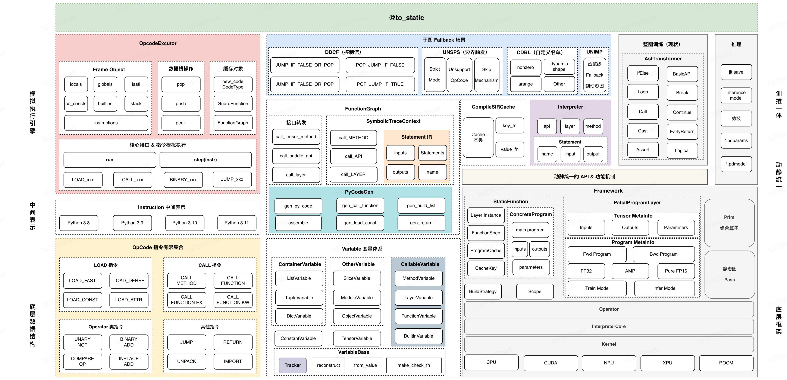

### 2.2 前置知识概念

#### `FrameObject` 和 `CodeObject`

* `CodeObject` 是指 Python 经过编译后产生的代码对象，它主要包含了 Python 字节码及其相关信息，比如常量表、变量名表等。
* `FrameObject` 是指在函数运行时的栈帧，包含编译时产生的 CodeObject 以及一些运行时的参数信息等。
简单来说，CodeObject 是一个编译时的产物，而 FrameObject是一个运行时的概念，同一个函数多次运行会产生多个 FrameObject，而其对应的 CodeObject 是同一个。

#### PEP 523

> 官方描述：This PEP proposes to expand CPython’s C API [2] to allow for the specification of a per-interpreter function pointer to handle the evaluation of frames [5]. This proposal also suggests adding a new field to code objects [3] to store arbitrary data for use by the frame evaluation function.


[PEP 523](https://peps.python.org/pep-0523/) 的标题是 `Adding a frame evaluation API to CPython`，即为 CPython 添加一个用来 Eval Frame 的 API。这个提案为 JIT 编译提供了可能，允许 JIT 编译器在 Eval Frame 时执行自己的一些操作，比如重新编译原有 CodeObject 生成新的 CodeObject 等。

该提案在 `PyInterpreterState` 上增加了一个 `eval_frame` 字段，即在 Eval Frame 时会调用的函数。其默认值即是直接调用 Python 解释器默认行为 _PyEval_EvalFrameDefault 函数。而我们可以通过修改它来实现 Eval Frame 行为的自定义，

此外，该提案还在 `CodeObject` 上添加了一个 `co_extra` 字段，以便 JIT 编译器在编译时将一些额外的信息存储在 CodeObject 中，比如编译后的 CodeObject 等。

### 2.3 Eval Frame 模块

**Eval Frame 模块是整个子图 FallBack的基本。**

Python 在 2016 年的 PEP523 提案支持了自定义回调函数，将默认的执行器替换为用户自定义的解释函数。这个机制结合子图 FallBack 方案的需求，我们在 Paddle 的 Pybind 层暴露了 `paddle.fluid.core.set_eval_frame` 接口。

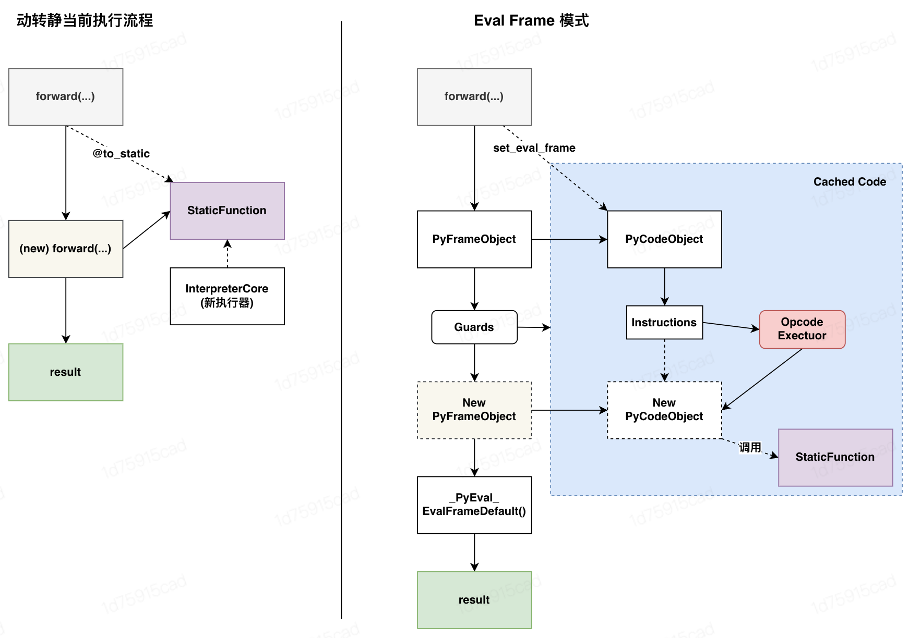


#### 2.3.1 eval frame 函数签名
一个用户自定义 eval frame 函数有如下的签名：

```cpp
CustomCode = collections.namedtuple(
    "CustomCode", ["code", "disable_eval_frame"]
)
eval_frame_function :: PyFrameObject -> CustomCode
```

这里的 `PyFrameObject` 就是Python当前要执行的 Frame，从 PyFrame 中的 `PyCodeObject` 可以拿到当前函数的字节码、局部变量、全局变量等信息，后续的字节码模拟执行就是基于 PyFrameObject来进行的。

#### 2.3.2 返回值和功效

子图 Fallback 方案本质是一个 `OpCodeTranslator`，它在字节码层级将用户原来的函数进行分析，抽取静态组网代码（SIR），然后构建成为一个新的等价的 Python 函数。这个新函数通过运行组网代码来实现和原来函数等价的效果。

但是因为有 FallBack 等不同场景，我们会对不同的返回值进行不同的处理，这个控制过程就是依赖 `eval frame function` 返回的 `CustomCode` 来控制的。CustomCode 是具有两个成员的简单数据类：

* `code`：类型是 `PyCodeObject` 或者是 `None`
* `disable_eval_frame`： 类型是一个 `Bool`

他们的作用含义，分别如下表格所示：
| 字段 | 值选项1 | 值选项2|
|:----|:-----:|:-----:|
| `Code` | `PyCodeObject`：会在C++端开启一个新的 Frame 来执行返回的PyCode | `None`：会直接复用原来的 Frame 来执行原来的函数。（动态图Fallback）|
| `Disable Eval Frame` | `True`： 递归的函数调用不进行转写。比如：Paddle 内部的函数没必要转写，开启可以加速 | `False`：递归的函数也会触发 eval frame转写。默认场景|

```python
def father():
    child ()
```

如果对 `father` 函数转写之后，我们返回的 `CustomCode` 如下：
* `None,       True` 表示 father 代码原样执行，child 不再触发 FallBack；
* `FatherCode，True` 表示 father 代码替换为 FatherCode并执行，child 不触发 FallBack;
* `FatherCode，False` 表示 father 代码替换为 FatherCode并执行，child 也会触发 FallBack 进行转写；

### 2.4 字节码模拟执行：`OpcodeExecutor`

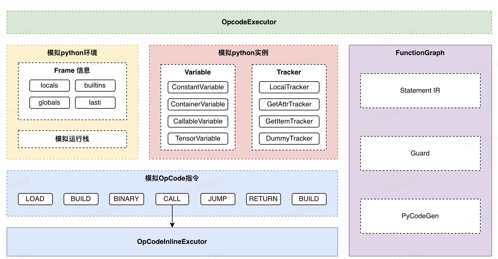

#### 2.4.1 模拟执行的目标

**模拟执行返回一个拥有相同接口的可调用函数**

在子图 FallBack 方案中，一个函数对应着一个需要抽取的子图。通过 Eval Frame 机制触发组网函数的模拟执行后，总需要返回一个在接口上与目标函数完全一致的函数，在不同情况下，返回的函数有所不同：

1. 若能够`完全静态化`目标函数，则需要返回一个新的可执行函数，该函数能够构建目标函数对应的子图；
2. 若只能`部分静态化`目标函数，同样需要返回一个新的可执行函数，该函数将可静态化部分抽取为子图，并将无法静态化的部分抽取为子函数（可能代表着不同分支），通过 Eval Frame 机制进行递归的处理。
3. 若完全`无法静态化`目标函数，则返回原本的目标函数，在动态图环境下进行计算。


**模拟执行给出用于 Cache 加速的 Guard**

当一个目标函数被重复调用时，希望能够使用 `Cache` 来复用之前模拟执行返回的可调用函数。但由于相同的函数在不同的输入下可能执行不同的逻辑，因此需要在函数执行前预测它的逻辑走向是否与上一次调用保持一致。

子图 FallBack 方案在模拟执行结束时同时返回一个 Guard 函数，该函数可以用于预判函数执行的走向，并确定本次函数调用是否命中 Cache。

> 关于 `Guard` 以及 `Tracker` 的更多信息，将在第 4 节进行介绍。

为了达成上述中的目标，在模拟执行的过程中需要收集以下信息：

1. 目标函数中存在的所有与 Tensor 组网有关的信息。
2. 目标函数中所有影响组网及分支相关变量信息，用于最终生成 `Guard` 函数


#### 2.4.2 模拟Python运行环境

Python 运行时的关键数据结构有两个：`PyFrameObject` 提供函数逻辑锁使用的实例，`PyCodeObject` 提供函数对应的字节码。利用这些数据，Python 虚拟机在一个栈上依次执行字节码以完成函数逻辑。

为了模拟原生的 Python 运行环境，在子图 FallBack 方案里：

1. 实现 Python 字节码对应的操作逻辑，并维护一个运行栈（工作量是收敛的，因为 OpCode 是有限集合）
2. 对模拟执行中出现的所有 Python 实例进行包装，根据其类型，将实例替换为一个对应 Variable对象。
3. 为所有 `Variable` 对象绑定一个 `Tracker`，`Tracker` 用于记录 `Variable` 的“来源”，例如从 `globals` 中加载而来。需要利用 Tracker 来得到 Guard 函数。

模拟 Python 运行环境，需要对 Python 内建类型的行为进行完全覆盖，目前 Python 运行环境模拟的开发工作是分阶段进行的，模拟程度越完善，抽取子图的成功率就越高。

#### 2.4.3 记录组网信息

子图 FallBack 默认假设所有的组网代码都应该由 `Paddle API` 或者 `Tensor` 的魔法函数触发。

1. 子图 FallBack 记录了所有组网相关的 Paddle API ，并在 `CALL语义` 的字节码逻辑中进行类型检查。
2. 在模拟执行中，所有的原生 `paddle.Tensor` 被包裹为 `TensorVariable` ，通过触发 `TensorVariable` 的魔法函数来记录组网逻辑。

当模拟执行的过程中发现组网逻辑，`OpcodeExecutor` 将相应的信息记录到 `FunctionGraph` 的 `Statement IR` 中。同时，`OpcodeExecutor` 将利用静态图的 `infer_meta` 机制获取输出 `Tensor` 的 `meta` 信息，结合 meta 信息生成新的 `TensorVariable` 并继续推进模拟执行。

当顺利完成模拟执行后，子图 FallBack 将根据保存的 `FunctionGraph` 结合现有的动转静接口生成 Program。

### 2.5 函数调用: `OpcodeInlineExecutor`

当在函数中触发「函数调用时」将创建一个新的虚拟执行环境，但保留 `Variable` 所关联的 `Tracker`。在这种情况下，所有的 `Variable` 的来源属于被调函数的调用者，等价于将函数调用进行内联操作。同样，用于记录组网信息的 `FunctionGraph` 被继承，因此能够实现函数调用内外所对应子网的融合。
另一方面，函数调用过程中出现 `FallBack` 行为时，应同时打断上层函数的组网，由于部分逻辑与 `OpcodeExecutor` 有所差异，因此函数调用的字节码需要通 `OpcodeInlineExecutor` 来解释执行。

整体的逻辑可以借助如下图来理解：

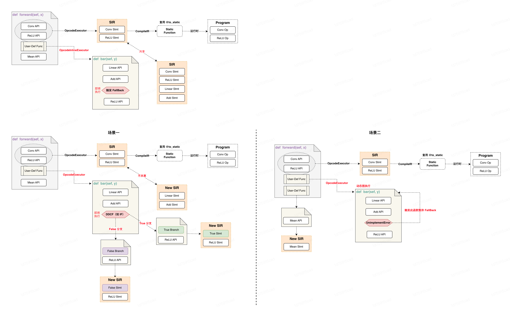


### 2.6 子图 FallBack 场景

#### 2.6.1 Data-Dependence Control Flow（简称：DDCF）

对于控制流 If、For 依赖 Tensor 的场景，需要打断构图并触发 FallBack。下面以if tensor为例，介绍依赖 Tensor 的控制流触发子图 FallBack 的场景：

```python
from symbolic_trace import symbolic_trace
import paddle
import dis

def foo(x, y):
   if x > 0:     # <----- 当 x 是一个 Tensor 时
      y += 1
   else:
      y -= 1
   return y

x = paddle.to_tensor([1])
y = paddle.to_tensor([2])

out = symbolic_trace(foo)(x, y)

print(out)
```

`foo` 函数原始的字节码如下所示：

```python
10           0 LOAD_FAST                0 (x)
              2 LOAD_CONST               1 (0)
              4 COMPARE_OP               4 (>)
              6 POP_JUMP_IF_FALSE       18           # <----- JUMP 指令

 11           8 LOAD_FAST                1 (y)
             10 LOAD_CONST               2 (1)
             12 INPLACE_ADD
             14 STORE_FAST               1 (y)
             16 JUMP_FORWARD             8 (to 26)

 13     >>   18 LOAD_FAST                1 (y)
             20 LOAD_CONST               2 (1)
             22 INPLACE_SUBTRACT
             24 STORE_FAST               1 (y)

 14     >>   26 LOAD_FAST                1 (y)
             28 RETURN_VALUE
```

`foo` 函数改写后的字节码如下所示，基本处理流程为：

* `POP_JUMP_IF_FALSE` 之前的字节码通过 `start_compile` 方法进行子图的组网，拿到可调用的动转静后的 `function`，调用这个`function`会返回`x > 0`的计算结果；
* 对于 `if` 和 `else` 分支分别被抽取成了`__resume_fn_0` 和`__resume_fn_1`两个子函数，根据 `if` 判断的结果具体会走`__resume_fn_0`或`__resume_fn_1`之中的一个;
* 对于嵌套的控制流，内部的控制流会在`__resume_fn_x`子函数调用时在下一个 `Frame`处理


```python
# foo函数字节码改写后
  9           0 LOAD_GLOBAL              0 (SIR_0)
              2 LOAD_FAST                0 (x)
              4 BUILD_TUPLE              1
              6 CALL_FUNCTION            1
              8 UNPACK_SEQUENCE          1
             10 STORE_FAST               2 (___SIR_out_var_2)
             12 LOAD_FAST                2 (___SIR_out_var_2)
             14 LOAD_FAST                1 (y)
             16 POP_TOP
             18 POP_JUMP_IF_FALSE       28
             20 LOAD_GLOBAL              1 (__resume_fn_0)      # <----- true branch func
             22 LOAD_FAST                1 (y)
             24 CALL_FUNCTION            1
             26 RETURN_VALUE
        >>   28 LOAD_GLOBAL              2 (__resume_fn_1)      # <----- false branch func
             30 LOAD_FAST                1 (y)
             32 CALL_FUNCTION            1
             34 RETURN_VALUE

# __resume_fn_0
  9           0 JUMP_ABSOLUTE           10

 10           2 LOAD_FAST                1 (x)
              4 LOAD_CONST               1 (0)
              6 COMPARE_OP               4 (>)
              8 POP_JUMP_IF_FALSE       20

 11     >>   10 LOAD_FAST                0 (y)
             12 LOAD_CONST               2 (1)
             14 INPLACE_ADD
             16 STORE_FAST               0 (y)
             18 JUMP_FORWARD             8 (to 28)

 13     >>   20 LOAD_FAST                0 (y)
             22 LOAD_CONST               2 (1)
             24 INPLACE_SUBTRACT
             26 STORE_FAST               0 (y)

 14     >>   28 LOAD_FAST                0 (y)
             30 RETURN_VALUE


# __resume_fn_1
  9           0 JUMP_ABSOLUTE           20

 10           2 LOAD_FAST                1 (x)
              4 LOAD_CONST               1 (0)
              6 COMPARE_OP               4 (>)
              8 POP_JUMP_IF_FALSE       20

 11          10 LOAD_FAST                0 (y)
             12 LOAD_CONST               2 (1)
             14 INPLACE_ADD
             16 STORE_FAST               0 (y)
             18 JUMP_FORWARD             8 (to 28)

 13     >>   20 LOAD_FAST                0 (y)
             22 LOAD_CONST               2 (1)
             24 INPLACE_SUBTRACT
             26 STORE_FAST               0 (y)

 14     >>   28 LOAD_FAST                0 (y)
             30 RETURN_VALUE
```

下面通过一个示意图来表示 foo 函数触发 FallBack 前后字节码的情况.其中foo表示函数原始的字节码，`compiled foo` 表示触发fallback转写后的字节码，`resume_to_block_1`表示子函数 `__resume_fn_0`，`resume_to_block_2`表示子函数`__resume_fn_1`:

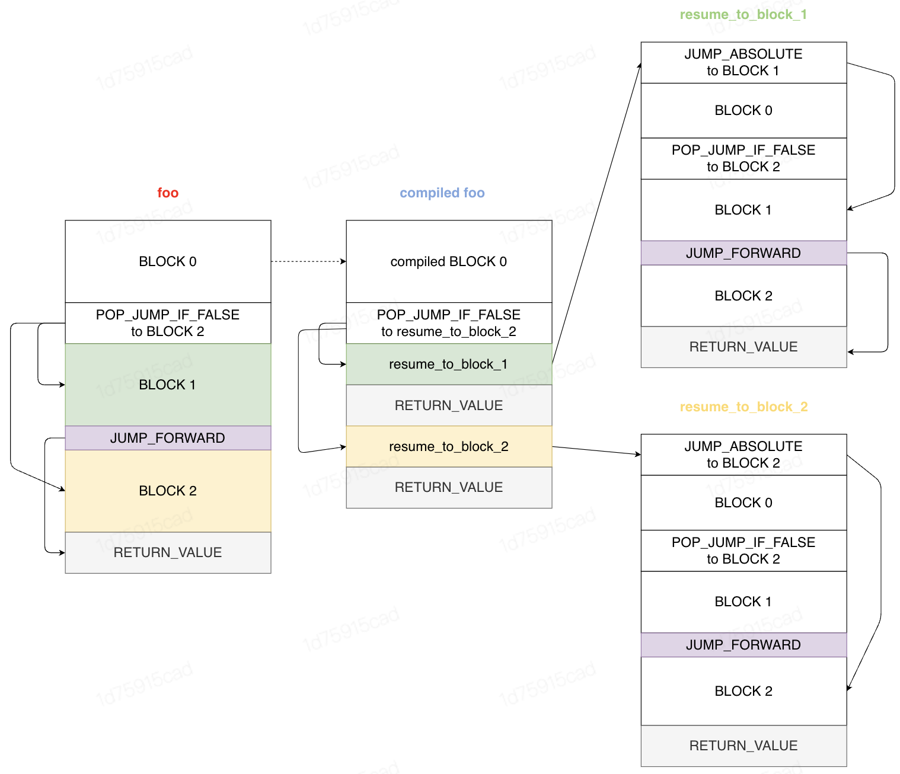

#### 2.6.2 Unsupport Simulation（简称：UNSPS）
对于我们无法模拟的一些函数调用，需要触发 FallBack。最典型的像 `print(tensor)`，tensor 需要有具体的值，这里就会触发 FallBack。

* `.numpy()`
* `os.path`等三方库
* `OpInlineExecutor` 抛出 `Erro`r 被上层 `OpExecutor` 捕获后

对于字节码的转写和 2.6.1 中控制流场景类似，`print` 之前的字节码进行子图组网并执行，计算得到 tensor 的真实结果；`print` 之后的字节码被抽取成为一个函数。

```python
import paddle
from symbolic_trace import symbolic_trace

def fn(x):
    x = x + 1
    print(x)
    x = x * 2
    return x

 x = paddle.to_tensor([1])
 out = symbolic_trace(fn)(x)
 print(out)
```

这里不再展示具体的字节码，下面的示意图能更好的展示转写后的字节码：

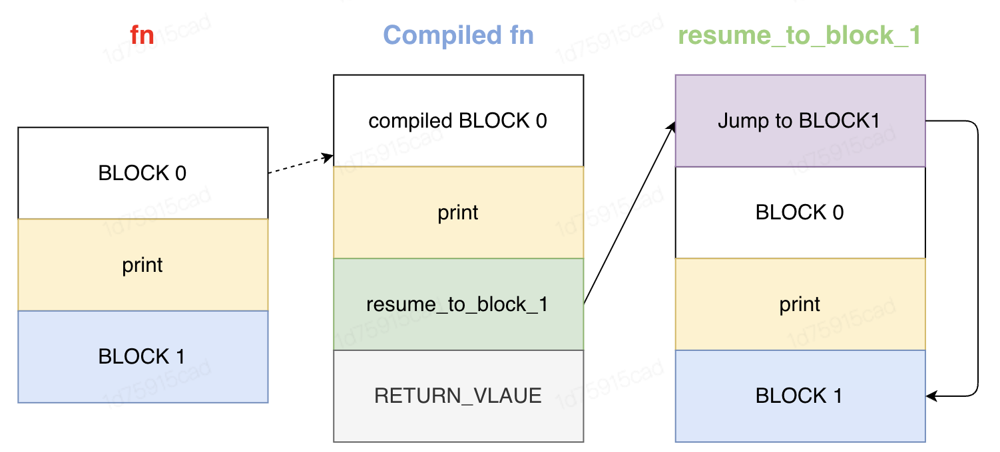

#### 2.6.3 Customize Defined BlackList 机制强制触发（简称：CDBL）

用户可以手动指定某些API，使得在遇到这些 API 时强制触发 Fallback。

比如在『动转静+prim+cinn』场景下，因为 prim 和 cinn 不支持-1 shape，但是 paddle 框架中某些 API 比如 `nonzero` 其本身在 `infershape` 时就会产生-1 shape，那么在调用这类 API 的模型就无法在『动转静+prim+cinn』模式下正常运行。

在子图 FallBack方案中，可以手工指定这类 API 使其强制触发 FallBack，使得这类API执行在动态图下以消除 -1 shape，更好的支持『动转静+prim+cinn』全架构模式的推广验证。该机制的具体实现思路与 2.6.2 中类似，不再赘述。

#### 2.6.4 UnImplement OpCode（简称：UNIMP）

因为此方案模拟执行了 Python 的 OpCode，在某个短暂的时间窗口里会出现个别 OpCode 未实现自定义的模拟逻辑，触发`Raise Implement Error`，此时会触发当前 `OpCode` 所在的 `Function` 自动Fallback回动态图来执行。

这种场景存在的重要意义在于：可以确保开启 `fallback=True`时转静成功率比较高，随着功能机制的完善，会逐步提升子图的质量，减少子图的数量，是一种迭代的策略。

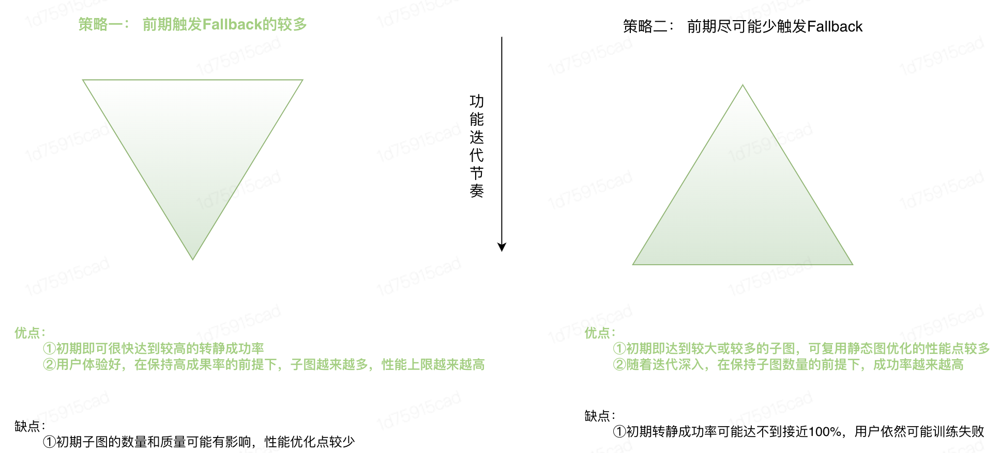

###  2.7 `Tracker`、`Guard` 和缓存模块

#### 2.7.1 `Guard` 的作用

子图 Fallback 的整体实现可以认为是将用户函数原始字节码转换为新的字节码，为了避免每次传入相同输入都会重新触发开销昂贵的字节码转换操作，我们需要增加缓存机制来复用之前转写过的代码，实现 JIT 的效果。

但并不是任何字节码成功转换一次后第二次都是可以直接复用的，因为我们字节码的转换是基于 Frame 的初始状态进行模拟执行得到的，也就是说转换后的字节码强依赖于 Frame 的初始状态。当初始状态发生改变，最后转换后的字节码很有可能发生改变，因此我们需要一种机制来根据 Frame 初始状态来判断缓存过的字节码是否有效。我们用 `Guard` 来实现这种机制。

#### 2.7.2 缓存查找流程

对于转换后的字节码，会同时生成一个 `Guard`，这个 `Guard` 会用于确保新的 frame 可以直接复用这个转换后的字节码：

* 如果 `Guard` 返回 `False`，则认为 `Cache` 没命中，会再次触发字节码转换

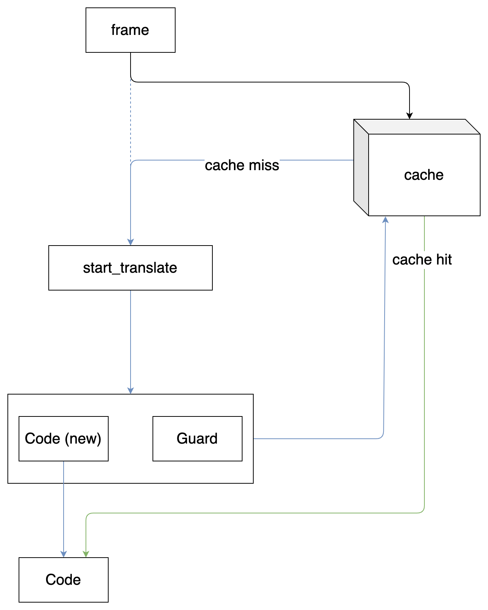

Guard 是一个函数，它的签名如下：
```python
Guard = Callable[[types.FrameType], bool]
```

代码转换生成的 `Guard` 和 `Code` 会一起存入 `Cache` 中。对于同一个 Code，可能缓存多个转换后的 Code 及其对应的 Guard。在缓存查找过程中，会依次将 frame 传入 Guard，如果返回 True，则认为其对应的 Code 是有效的，直接返回该 Code，否则查找下一个 Cache 项。如果遍历全部 Cache 都无法找到可用的 Cache 项，则触发代码重新转换，伪代码如下：

```python
def cache_lookup(frame, cache):
    for code, guard in cache[frame.f_code]:
        if guard(frame):
            # cache hit
            return code
    # cache miss
    code, guard = start_translate(frame)
    cache[frame.f_code].append(code, guard)
    return code
```

#### 2.7.3 子 Guard 生成机制

`start_translate` 即字节码转换的过程，这个过程依托于模拟执行，`Guard` 是在整个模拟过程中不断产生子 `Guard`，并在模拟最终阶段收集和整合成一个完整的 Guard 的。

子 `Guard` 是用来保证一个 `Variable` 其对应的 `value` 是不变的，比如对于函数 `foo(x: int)`，假如第一次输入 `x = 10`且这个值是认为需要保证不变的，那么就会生成如下的子 Guard：
```python
guard = lambda frame: frame.f_locals["x"] == 10
```

这个 Guard 保证了之后的参数 x应该仍然是 10，否则就不能命中这一条 cache 过的字节码。

而每一条子 Guard 是由以下两部分组成的：
* 从新的 frame 里查找值的方式，即上述例子中的 `frame.f_locals["x"]`
* Guard 需要保证匹配的值，即上述例子中的 10

需要匹配的值可以直接得到，但为了能够准确地在新的 frame 里查找到相对应的值，我们需要在模拟执行中记录一个值的来源，这个来源会利用 Tracker 来记录。

### 2.8 变量追踪机制 Tracker

在模拟执行过程中，我们会根据执行流程构建一个 `DAG`，这个 DAG 不仅仅包含 `Tensor` 组网部分，还包含了 Python 代码执行逻辑。`Variable` 作为所有栈上变量的包装，为了将所有 `Variable` 连接起来，我们增加了 `Tracker` 用来追踪变量之间的关联，关键数据结构如下：

```python
class VariableBase:
    tracker: Tracker

class Tracker:
    inputs: list[VariableBase]
```

每个 `Variable` 会持有一个 `Tracker`，而这个 `Tracker` 则会持有多个输入对应的 `Variable`，最终构图如下：

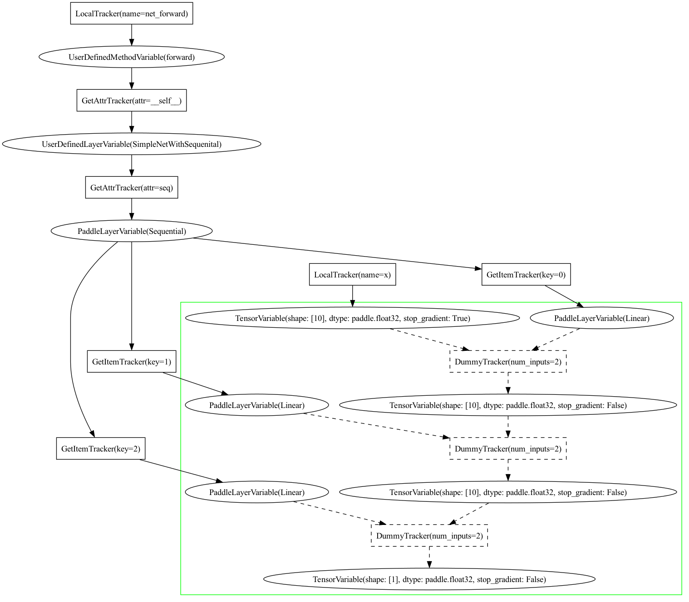

我们利用不同的 `Tracker` 来表示不同的来源，比如 `GetItemTracker` 用来表示这个变量是通过输入变量 `__getitem__` 得到的，所以从 新的 frame 中可以通过该信息来获取到该变量。

#### 2.8.1 Guard 收集机制

通过 `Tracker`，我们可以生成对应于每一个 `Variable` 的子 `Guard` ，而我们在模拟执行结束阶段，是需要一个最终的总的 `Guard` 的，这个总的 `Guard` 是通过遍历整个由 `Tracker` 构建得到的 `DAG`，收集所有需要的 `Guard`，并通过 and将所有 Guard 复合成一个总的 Guard 的，伪码描述如下：

```python
def compose_guards(guards: list[Guard]) -> Guard:
    def composed_guard_fn(frame: types.FrameType) -> bool:
        ret = True
        for guard in guards:
            ret = ret and guard(frame)
        return ret

    return composed_guard_fn
```

### 2.9 `SideEffect` 模块
#### 2.9.1 `SideEffect` 的发生场景

`SideEffect` 是指代码执行过程中除了函数返回值之外，还对调用方产生了额外的影响，比如修改全局变量、修改可变的共享变量等。

在模拟执行过程中，我们的代码是在虚拟环境下执行的，在该过程中不应该也不会对真实环境进行修改。而如果用户代码产生了 `SideEffect`，我们需要在生成的代码里反映出相应的 `SideEffect` ，即在代码生成步骤中增加 `SideEffect` 的处理部分。
比如对于如下代码：
```python
global_var = 1

def foo(x: Tensor):
    global global_var
    global_var += 1    # <----- 此处修改了全局变量，存在 SideEffect 效应
    return x + 1
```

生成的代码里应当包含对 `global_var` 进行修改的操作，示例字节码如下：

```python
              0 LOAD_CONST               3 (2)
              2 STORE_GLOBAL             0 (global_var)
```

这里会将全局变量 `global_var` 的值修改为模拟执行的最终结果 2。

#### 2.9.2 `SideEffect` 的处理方式

为了能够追踪 `SideEffect` 发生的对象，我们需要在对全局变量和共享变量进行写操作的时候记录下相应的操作，并将 `Variable` 更新为修改后的版本。

在最后生成 `SideEffect` 代码时，主要需要知道两部分内容：
* 该变量的原始引用，以作为左值引用可造成 `SideEffect` 的变量名
* 该变量在产生 SideEffect 后的值，以作为右值进行更新

比如对于 list，可以有如下的处理方式：
```python
old_var[:] = new_var_value
```

这里的 `old_var` 可利用 `Tracker` 的追踪机制来获取得到， `new_var_value` 是该变量经过模拟执行的最终结果，可通过该方式来 `inplace` 修改引用的原始变量，即可同步 `SideEffect` 操作。
而对于用户自定义的对象，不能直接原位替换原始对象，应该在模拟执行阶段记录其所有修改操作，并在最后将所有修改操作一一还原。

### 2.10 `StatementIR` 模块

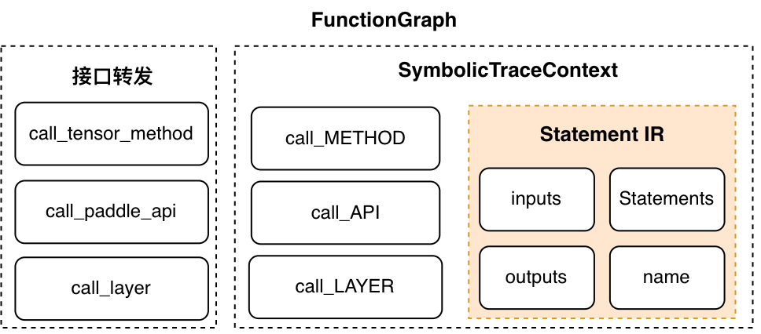

#### 2.10.1 `StatementIR` 的作用和设计动机

**StatementIR 是 Paddle 动转静模块与子图 FallBack的一个『中间桥梁』，它达到了动转静复用的目的。**

`StatementIR` 与 `Program` 类似，都是表征计算的一个结构。在字节码执行过程中，我们需要将所有的组网代码都『临时记录』下来，并最后将他们组网成为一个 `Program` 。这里的组网代码记录的载体就是 `StatementIR` 。在函数结束的时刻，我们会将记录下来的 `StatementIR` 转化为一个函数。与原来的用户代码不同，由 `StatementIR` 转化为的函数可以确保一定可以动转静。这样我们可以复用原来的动转静 `to_static` 函数来实现静态图的执行。主要的转化关系可以见下图：

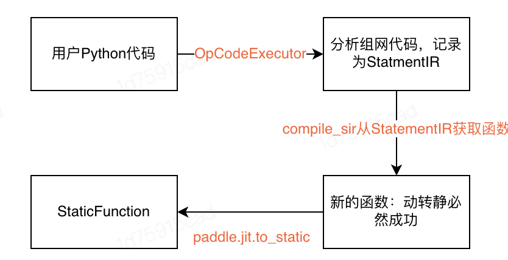

上图可以看到， `StatementIR` 作为了用户代码到 `StaticFunction` 的一个中间表示。通过 `StatementIR` 我们可以复用现有的动转静代码。

#### 2.10.2 `StatementIR` 的示例

ResNet18 中的部分 SIR 示例

```python
StatmentIR: SIR_0
  inputs: ['layer_0', 'layer_1'，'var_0']
  outputs: ['var_69']
  statements:
    layer      || var_1 = Conv2D ((layer_0, var_0), {})
    layer      || var_2 = BatchNorm2D ((layer_1, var_1), {})
    layer      || var_3 = ReLU ((layer_2, var_2), {})
    layer      || var_4 = MaxPool2D ((layer_3, var_3), {})
    layer      || var_5 = Conv2D ((layer_5, var_4), {})
    layer      || var_6 = BatchNorm2D ((layer_6, var_5), {})
    layer      || var_7 = ReLU ((layer_7, var_6), {})
    layer      || var_8 = Conv2D ((layer_8, var_7), {})
    layer      || var_9 = BatchNorm2D ((layer_9, var_8), {})
    method     || var_10 = __add__ ((var_9, var_4), {})
    layer      || var_11 = ReLU ((layer_10, var_10), {})
    api        || var_12 = paddle.nn.functional.relu (var_11)
```

这里可以初步看出 `StatementIR` 有如下规律：

* 纯粹 `Symbolic` ：整个 `SIR` 都是纯粹的计算结构的表示，不关心具体的值，所有的中间变量都是一个 `Symbol` ， `Symbol` 只有「相同」和「不相同」两个关系。
* 有输入、输出、每个语句为一个 `Statement` 、暂时还不支持控制流。
单纯的 `StatementIR` 只是计算的表示，只有当给予输入的时候，他就可以按照存储的计算给予对应的输出。输入到输出的过程需要一个称为 `Interpreter` 的结构进行执行。针对动转静的 `Interpreter` 会解释每条 `Statement` ，并且计算变量的真实value。


#### 2.10.3 `StatementIR` 支持的四类语句
`StatementIR` 中支持了 4种语句，分别为:

* `call_api` ：对 var 执行一条 paddle 的 api
* `call_method` ：第一个参数是一个 `Variable` 的情况下，执行 `args[0]` 的方法，并获取结果。
* `call_sir` ：（可融合的关键）调用另外一个 `sir`，存在一个类似准备 frame 的过程，来实现 name 的重新绑定。
* `call_layer` ：（基于Paddle的动转静统一）直接调用一个 `paddle.nn.Layer``，可以减少字节码的模拟执行，是一个子图质量的优化手段。

## 三、接口示例

对于用户而言，接口非常简单。用户只需要按照下面的方式就可以调用子图 FallBack 接口：

```python
import paddle
from paddle.vision import resnet50

net = resnet50()

# 开启子图fallback，使用 fallback=True来允许跑多个子图。
net = paddle.jit.to_static(net, fallback=True)

output = net (image)
```

### 3.1 对用户的影响

* `to_staitc` 接口：新增引入 fallback 参数和机制，为功能扩展 Feature
* 转静训练：同时兼顾当前的整图训练，合入此机制后，会大幅提升转静成功率，提升体验；
* 推理导出：推理导出依旧需要完整的前向图表示，若出现子图 FallBack，则会抛出异常，提示用户，无其他影响。
