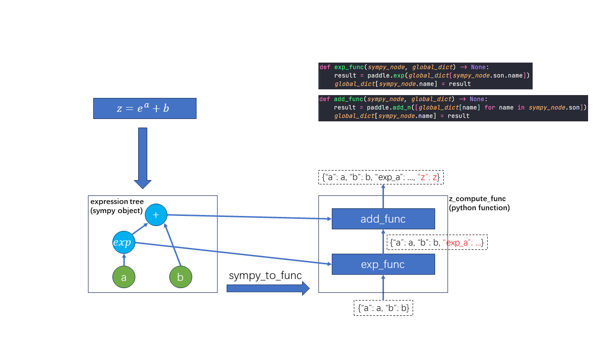
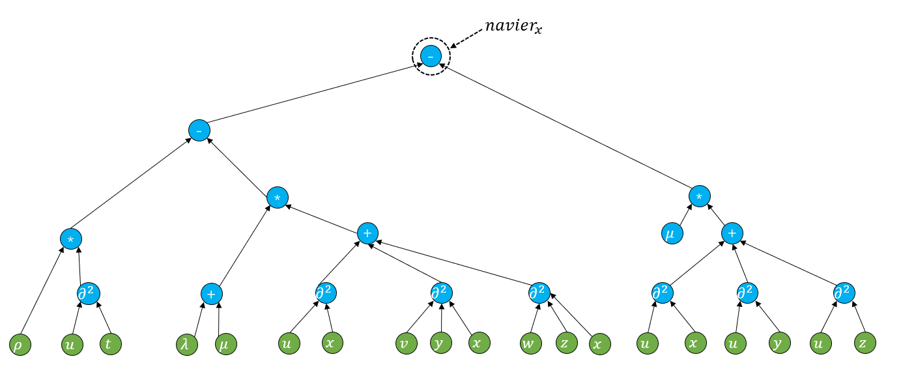

# Sympy to Function 设计方案

## 1. 设计方案

以下列具有代表性的公式（含有一阶、二阶微分、二阶混合微分及各种基础运算）为例

$$
navier_{x} = \rho(\dfrac{\partial^2 u}{\partial t^2}) - (\lambda + \mu)(\dfrac{\partial^2 u}{\partial x^2}+\dfrac{\partial^2 v}{\partial y \partial x} + \dfrac{\partial^2 w}{\partial z \partial x}) - \mu(\dfrac{\partial^2 u}{\partial x^2} + \dfrac{\partial^2 u}{\partial y^2} + \dfrac{\partial^2 u}{\partial z^2})
$$

### 1.1 流程示意图



这里的流程示意图里使用了简单公式便于展示，可以看到整个流程分为三步

1. sympy 表达式树的后序遍历
2. sympy node 结点序列转换成 callable object 序列
3. 将 callable object 序列打包为 Composed func 对象，供公式计算时调用

### 1.2 表达式树转换

目前科学计算领域的绝大部分公式（这里先不考虑 $\nabla$、 $\Sigma$、 $\Delta$ 等复杂算符），由基本运算符号和对应运算参数两种基本类型组成。如果一个公式能使用 Sympy 符号化表达，则一定能转换为一颗对应的表达式树。比如本文开头公式对应的表达式树如下图所示



其中绿色表示数据结点（Tensor、float、int等数据类型，记为 $Data\\_Node$），蓝色表示计算结点（根据子结点和自身记录的运算符号，计算数值结果，记为 $Op\\_Node$），可以看到这棵树的根结点就是我们最终要求的结果 $navier_x$

树形结构有一些良好的性质，比如将树边（一般是无向边）转换为有向边（方向为子结点指向父节点），则这个有向图一定是一个 DAG，也就意味着一定存在一个计算顺序（拓扑顺序），使得我们可以从已知的叶子结点这些变量开始，沿着拓扑顺序计算，最终得到根结点的变量值。但这里不需要对这个有向图进行拓扑排序，因为该有向图对应的树的后序遍历本身就是一种合法的拓扑顺序。所以我们只需要按照后序遍历的顺序对这棵树进行计算，就能得到最终结果。

假设最终得到的结点拓扑序列为： $V=v_0, v_1, ..., v_N$ ,  $N$ 为树的结点个数 。sympy 表达式树的遍历可以参考：<https://github.com/PaddlePaddle/PaddleScience/blob/6c63cbeb758d3bf42115f76a6f5194b40bd23018/ppsci/utils/expression.py#L49-L131>

### 1.3 结点映射

接下来我们需要将所有计算结点（蓝色结点） $v_j \in Op\\_Node$ 映射转换成对应的 callable object，伪代码如下：

``` py
class Add(nn.Layer):
    def __init__(self, node):
        super().__init__()
        self.node = node
        self.node_name = node.name

    def forward(self, data_dict) -> None:
        dat_dict[self.node_name] = paddle.add_n(
            [data_dict[son.name] for son in node.son]
        )


class Mul(...)
    ...


node_to_func_map = {
    "add": Add,
    "mul": ...,
    "...": ...,
}


class Composed_func(nn.Layer):
    def __init__(self, funcs: List[nn.Layer]):
        super().__init__()
        self.funcs = funcs

    def forward(self, data_dict):
        for func in self.funcs:
            data_dict = func(data_dict)
        return data_dict


def nodes_to_funcs(nodes: List[Node]):
    funcs = [
        node_to_func_map[type(node)] for node in node_list
    ]
    composed_func = Composed_func(funcs)
    return composed_func
```

调用 `nodes_to_funcs`，将 [1.1](#11-流程示意图) 中得到的具有拓扑顺序的结点序列转换成 callable object，然后通过 `Composed_func` 打包成一个单一 callable object，这样就得到了一个具备 “**接受公式所需输入数据，返回含有最终计算结果的数据”** 功能的 callable object。这样对于用户来说跟现有的 python function 调用方式基本相同，都是通过小括号调用。

### 1.4 涉及工作

1. 开发 `sympy_to_nodes` 函数，将表达式转换为具有拓扑顺序的结点序列；
2. 结合科学计算场景下的运算类型，撰写对应的 `Class Opname` 代码，并将这种映射记录在 `node_to_func_map` 中；
3. 将 Equation 模块内所有方程类的 python function 替换成 sympy 表达式，并在 `__init__` 内对所有添加完毕的 sympy 公式调用 `sympy_to_nodes` 进行转换，得到 `Composed_func` 以供调用；
4. 稍微改写一下 `ppsci/utils/expression.py`，将 `output_dict[name] = expr({**output_dict, **input_dicts[i]})` 改为 `output_dict = expr({**output_dict, **input_dicts[i]})`即可。

- 相关运算结点类型和对应 API 如下所示

    |结点类型 |   对应计算 API |
    |:----:|:---------:|
    |number | float(c)  |
    |add |"+" 运算符|
    |sub | "-" 运算符 |
    |mul |"*" 运算符 |
    |divide |"/" 运算符  |
    |pow | "**"运算符  |
    |Derivetive $\dfrac{\partial u}{\partial x}$ | `ppsci.autodiff.jacobian(u, x)`  |
    |Derivetive $\dfrac{\partial^2 u}{\partial x^2}$ | `ppsci.autodiff.hessian(u, x)`  |
    |Derivetive $\dfrac{\partial^2 u}{\partial x \partial y}$ | `ppsci.autodiff.jacobian(paddle.autodiff.jacoian(u, x), y)`  |
    |exp | paddle.exp  |

## 2. 结果验证

撰写单测，需要验证所有方程内所有公式，将 `Composed_func` 的计算结果和原本 python function 的前向结果进行对比，并用 MSELoss（与 0 作差即可）进行梯度反传，对比模型梯度。以此保证这套方案的过程和结果完全正确。

## 3. 开发注意事项

微分结点在储存的时候，与其他直接使用 `node.name` 的结点不同，需要按照特定的格式到 key，再进行储存，比如 $\dfrac{\partial u}{\partial x}$，其对应 key 为 `u__x`， $\dfrac{\partial^2 u}{\partial x \partial y}$ 的 key 为 `u__x__y`，即使用双下划线 `__` 作为分隔符，第一个位置是因变量，第二个及之后的位置为自变量，通用表示为 `invar__dvar1__dvar2__...`。
