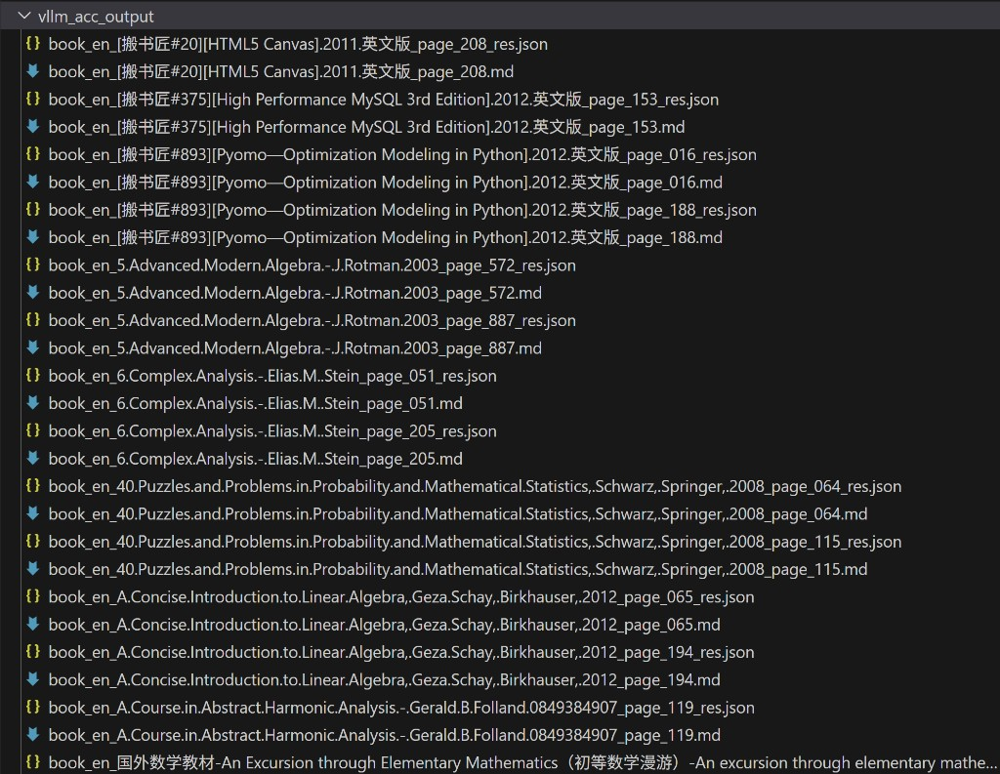

# AMD：PaddleOCR-VL-1.5 在 AMD GPU 上的部署与运行
为了帮助更多小伙伴快速了解 PaddleOCR-VL-1.5 在 AMD GPU 上的部署流程，熟悉 ROCm 环境配置与 PaddleX 推理 Pipeline，飞桨社区联合 AMD 特推出本次 **PaddleOCR-VL-1.5 热身打卡活动**。
通过亲手完成一次完整的 PaddleOCR-VL-1.5 部署与推理流程，你将正式具备在 AMD GPU 上运行飞桨模型的基础能力。

## 任务目标
通过本次打卡，你将掌握：
* AMD ROCm 环境与 Docker 容器的基本使用
* PaddlePaddle ROCm 版本的环境验证方法
* PaddleOCR-VL-1.5 模型的架构与核心能力
* PaddleX Pipeline 配置与使用方法
* Native 后端与 vLLM 后端两种推理方式的部署与对比

## 提交方式
参与热身打卡活动并按照邮件模板格式将截图发送至 ext_paddle_oss@baidu.com + Zijun.Wei@amd.com, Huaqiang.Fang@amd.com, bingqing.guo@amd.com

## 额外奖励
为支持本次飞桨黑客松，AMD 额外准备了 **AMD Ryzen 电脑内胆包 × 10**。在完成本打卡任务且成功注册 AMD AI 开发者计划账户的选手中，按任务完成先后顺序排序，前 10 名可额外获得 AMD Ryzen 电脑内胆包 1 个。

## 算力/环境支持
本次热身打卡活动需要使用 AMD Radeon PRO W7900 GPU 及 ROCm 7.0 环境。可使用预构建的 Docker 镜像快速搭建环境，赶快行动起来吧~

## 任务指导
### 快速体验：One-click Jupyter Notebook
我们准备了一个简单易用的 Jupyter Notebook，帮助你快速在 AMD GPU 上体验 PaddleOCR-VL-1.5 模型。点击以下链接即可一键开始：

[Quick Start: PaddleOCR-VL Demo Notebook](https://ocr.oneclickamd.ai/github/AMD-AIM/AMD-OneClick/blob/pd_ocr/notebooks/ppocr_vl_demo.ipynb)

如果你希望手动搭建环境并了解详细运行步骤，请继续参考以下章节。

### Docker 容器部署
使用预配置的 Docker 容器，包含所有必要依赖：
```
docker run -it \
  --device=/dev/kfd \
  --device=/dev/dri \
  --security-opt seccomp=unconfined \
  --network=host \
  --cap-add=SYS_PTRACE \
  --group-add video \
  --shm-size 32g \
  --ipc=host \
  -v $PWD:/workspace \
  ccr-2vdh3abv-pub.cnc.bj.baidubce.com/paddlepaddle/paddlex-paddle-vllm-amd-gpu:3.4.0-0.14.0rc2 \
  /bin/bash
```
容器已预装以下组件：
* PaddlePaddle（ROCm 编译版本）
* vLLM（ROCm 优化版本）
* PaddleX（OCR Pipeline 管理）
* PaddleOCR-VL-1.5 模型依赖

### 环境验证
启动容器后，执行以下命令验证环境，所有关键步骤需截图保存：
```
# 检查 ROCm 版本
cat /opt/rocm/.info/version

# 验证 PaddlePaddle ROCm 支持
python -c "import paddle; print('Paddle ROCm compiled:', paddle.is_compiled_with_rocm())"

# 检查 GPU 检测
rocm-smi
```

### 使用 Native 后端运行推理
Native 后端使用 PaddlePaddle 内置推理引擎，部署简单直接。

#### Step 1：下载测试图片
```
wget -q https://paddle-model-ecology.bj.bcebos.com/paddlex/imgs/demo_image/general_ocr_002.png -O /tmp/test_ocr.png
```

#### Step 2：切换到 PaddleX 目录
```
cd /opt/PaddleX
```

#### Step 3：创建推理配置文件
创建 inference.yml：
```
cat > checkpoint-5000/inference.yml << 'EOF'
Global:
  model_name: PaddleOCR-VL-1.5-0.9B
EOF
```
创建 Native 后端 Pipeline 配置：
```
cat > PaddleOCR-VL-native.yaml << 'EOF'
pipeline_name: PaddleOCR-VL

batch_size: 64
use_queues: True
use_doc_preprocessor: False
use_layout_detection: True
use_chart_recognition: False
format_block_content: False
merge_layout_blocks: True

SubModules:
  LayoutDetection:
    module_name: layout_detection
    model_name: PP-DocLayoutV3
    model_dir: ./layout_0116
    batch_size: 8
    threshold: 0.3
    layout_nms: True

  VLRecognition:
    module_name: vl_recognition
    model_name: PaddleOCR-VL-1.5-0.9B
    model_dir: ./checkpoint-5000
    batch_size: 4096
    genai_config:
      backend: native
EOF
```

#### Step 4：执行推理并截图
```
paddlex --pipeline PaddleOCR-VL-native.yaml --input /tmp/test_ocr.png
```
截图保存推理结果。

### 使用 vLLM 后端运行推理
vLLM 后端通过优化批处理和推理加速提供显著性能提升，推荐用于生产环境。

#### Step 1：验证 vLLM 服务状态
```
curl http://localhost:8118/v1/models
```
预期输出：
```
{"object":"list","data":[{"id":"PaddleOCR-VL-1.5-0.9B","object":"model"}]}
```

#### Step 2：下载测试图片并切换目录
```
wget -q https://paddle-model-ecology.bj.bcebos.com/paddlex/imgs/demo_image/general_ocr_002.png -O /tmp/test_ocr.png
cd /opt/PaddleX
```

#### Step 3：修复配置文件兼容性
```
sed -i 's/pipeline_name: PaddleOCR-VL-1.5/pipeline_name: PaddleOCR-VL/' PaddleOCR-VL-vllm.yaml
```

#### Step 4：执行推理并截图
```
paddlex --pipeline PaddleOCR-VL-vllm.yaml --input /tmp/test_ocr.png
```
截图保存推理结果。

## 邮件格式
* 标题：文心伙伴赛道-【厂商】-【打卡】-【GithubID】（例如：文心伙伴赛道-AMD-打卡-onecatcn）
* 内容：
   * 飞桨团队你好，
   * 【GitHub ID】：XXX
   * 【打卡内容】：PaddleOCR-VL-1.5 推理
   * 【打卡截图】：
      * 推理结果生成文件截图，截图样例：
      
