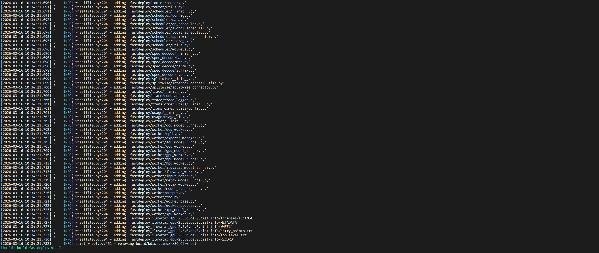
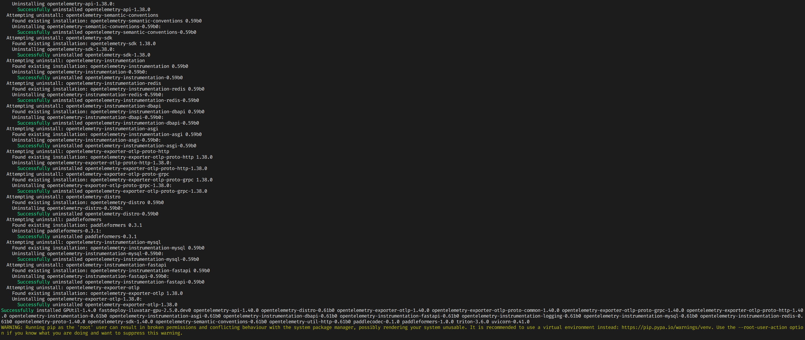
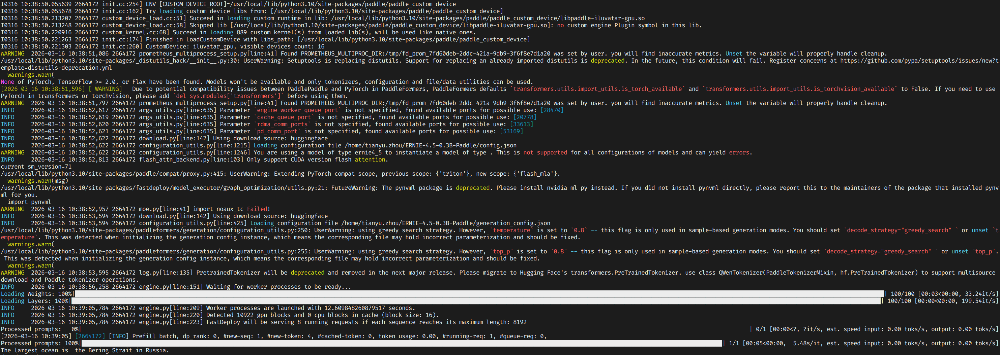

# 基于天数智芯 BI-150S 的 FastDeploy 编译与打包
本任务为**天数智芯硬件赛道**的热身打卡，旨在帮助开发者在**天数智芯 BI-150S** 上完成 FastDeploy 的编译、打包与推理验证，熟悉在国产算力上的 FastDeploy 工程结构与编译流程。通过亲手完成一次在 BI-150S 环境下的完整流程，你将具备参与天数智芯 + FastDeploy 生态开发的基础能力。

## 任务目标
通过本次打卡，你将掌握：
* 在天数智芯 BI-150S 环境下 FastDeploy 的编译与运行
* FastDeploy 源码结构及 Paddle 运行时与 FastDeploy 的依赖关系
* 自定义算子编译机制与 wheel 构建、分发流程

## 提交方式
参与天数智芯热身打卡活动并按照邮件模板格式将截图发送至 ext_paddle_oss@baidu.com，并抄送 deepspark-bot@iluvatar.com

## 算力/环境支持
本次热身打卡活动需要使用 BI-150S 硬件，可以申请使用星河平台 BI-150S 算力，赶快行动起来吧~

## 任务指导
### 安装 PaddlePaddle
以 ILUVATAR_GPU 版本为例（CPU 同理）：
```
python -m pip install --pre paddlepaddle-iluvatar -i https://www.paddlepaddle.org.cn/packages/nightly/ixuca/
```
### 克隆 FastDeploy 源码
```
git clone https://github.com/PaddlePaddle/FastDeploy
cd FastDeploy
```

### 编译打卡流程
> 所有关键步骤需加 `time` 记录耗时，并截图保存。
#### Step 1：执行 FastDeploy 编译与打包
```
bash build.sh
```
编译完成后会自动安装对应的 whl 包

#### Step 2：在 BI-150S 上运行单元测试
首先下载 ERNIE-4.5-0.3B-Paddle 模型权重：[模型库-飞桨 AI Studio 星河社区](https://aistudio.baidu.com/modelsdetail/30656/space)，并将该权重文件复制到你的工作目录下，示例中的工作目录是 /home/paddle，准备测试代码 demo.py
```
from fastdeploy import LLM, SamplingParams

prompts = [
    "The largest ocean is",
]
# sampling parameters
sampling_params = SamplingParams(temperature=0.8, top_p=0.95, max_tokens=256)

# load the model
graph_optimization_config = {"use_cudagraph": False}
llm = LLM(model="/home/paddle/ERNIE-4.5-0.3B-Paddle", tensor_parallel_size=1, max_model_len=8192, block_size=16, quantization='wint8', graph_optimization_config=graph_optimization_config)

# Perform batch inference
outputs = llm.generate(prompts, sampling_params)
for output in outputs:
    prompt = output.prompt
    generated_text = output.outputs.text
    print(prompt, generated_text)

```
执行测试脚本
```
#!/bin/bash
export FD_SAMPLING_CLASS=rejection
python3 demo.py
```

## 邮件格式
* 标题：[飞桨黑客松第十期 天数智芯任务打卡]
* 内容：
   * 飞桨团队你好，
   * 【GitHub ID】：XXX
   * 【打卡内容】：编译/安装 whl 包/运行单元测试
   * 【打卡截图】：
     * 编译：
     * 安装 whl 包：
     * 运行单元测试：
