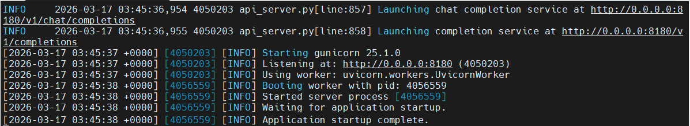
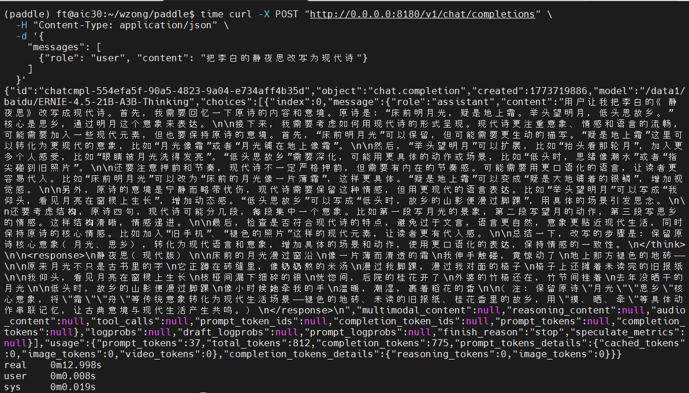

# 基于飞腾 S5000C + NVIDIA L20 的 FastDeploy 推理打卡任务

本任务旨在**飞腾 S5000C (ARM64) + NVIDIA L20** 平台上完成 FastDeploy 的完整编译适配、PaddlePaddle 带 CUTLASS 编译、多卡推理验证与 MoE 模型部署。通过本次完整流程，你将掌握在国产 ARM 服务器 + NVIDIA GPU 异构环境下的 FastDeploy 编译、算子适配、分布式推理与问题排查能力。

## 任务目标
通过本次适配，你将掌握：
* 在飞腾 S5000C (ARM64) + NVIDIA L20 环境下 FastDeploy 与 PaddlePaddle 的编译与运行
* ARM64 平台特有的链接器问题（`R_AARCH64_CALL26`）分析与解决
* CUTLASS 在 ARM64 + CUDA 环境下的集成与头文件路径处理
* 多卡 P2P 通信问题诊断与绕过方案
* MoE 模型在异构环境下的部署与验证
* 自定义算子编译、wheel 构建与依赖管理

## 提交方式
参与飞腾热身打卡活动并按照邮件模板格式将截图发送至 zongwei2845@phytium.com.cn 与 ext_paddle_oss@baidu.com

## 算力/环境信息
* **CPU**: 飞腾 S5000C (ARM64, 128 cores)
* **GPU**: NVIDIA L20 (48GB) × 2 (Compute Capability 8.9)
* **CUDA**: 12.8
* **OS**: Ubuntu 22.04.5
* **Python**: 3.12
* **Compiler**: GCC 12.3.0

- 本次活动暂不提供算力支持

## 任务指导

### 安装基础依赖
```bash
# 安装系统依赖
sudo apt update
sudo apt install build-essential cmake git python3-dev

# 安装 conda 环境
wget https://repo.anaconda.com/miniconda/Miniconda3-latest-Linux-aarch64.sh
bash Miniconda3-latest-Linux-aarch64.sh
conda create -n paddle python=3.12
conda activate paddle
```

### 克隆代码仓库
```bash
git clone --recursive https://github.com/PaddlePaddle/Paddle.git
git clone https://github.com/PaddlePaddle/FastDeploy.git
```

### 编译打卡流程
> 所有关键步骤需加 `time` 记录耗时，并截图保存。

#### Step 1：编译 PaddlePaddle（带 CUTLASS 支持）
```bash
cd Paddle
git checkout v3.3.0  # 使用稳定版本
git submodule update --init --recursive

mkdir build && cd build

time cmake .. \
  -DWITH_GPU=ON \
  -DWITH_ARM=ON \
  -DWITH_DISTRIBUTE=ON \
  -DWITH_TESTING=OFF \
  -DWITH_CPP_TEST=OFF \
  -DWITH_SLEEF=OFF \
  -DCMAKE_BUILD_TYPE=Release \
  -DWITH_CUTLASS=ON \
  -DWITH_XBYAK=OFF \
  -DCMAKE_C_FLAGS="-O3 -DNDEBUG -fPIC" \
  -DCMAKE_CXX_FLAGS="-O3 -DNDEBUG -fPIC" \
  -DCMAKE_CUDA_FLAGS="-O3 -DNDEBUG -Xcompiler -fPIC -DPADDLE_WITH_CUTLASS=ON \
    -I$(pwd)/../third_party/cutlass/include \
    -I$(pwd)/../third_party/cutlass/tools/util/include"

time make -j$(nproc)
time make install
```

**运行官方检测脚本**

```bash
python -c "import paddle; print(f'Paddle version: {paddle.__version__}'); print(f'CUDA: {paddle.version.cuda()}'); print(f'GPU count: {paddle.device.cuda.device_count()}'); paddle.utils.run_check()"
```

**预期输出示例**：
```bash
Paddle version: 3.3.0.dev20251226
CUDA: 12.8
GPU count: 4
PaddlePaddle works well on 4 GPUs.
PaddlePaddle is installed successfully! Let's start deep learning with PaddlePaddle now.
```


#### Step 2：编译 FastDeploy
```bash
bash build.sh 1 python false [89]
```

#### Step 3：解决 decord 依赖（ARM64 无 wheel）
```bash
git clone --recursive https://github.com/dmlc/decord.git
cd decord
mkdir build && cd build
cmake .. -DUSE_CUDA=ON -DCMAKE_BUILD_TYPE=Release
make -j$(nproc)
cd ../python
python setup.py install --prefix=$CONDA_PREFIX
```

#### Step 4：运行单元测试
首先下载 ERNIE-4.5-0.3B-Paddle 模型权重：[模型库-飞桨 AI Studio 星河社区](https://aistudio.baidu.com/modelsdetail/30656/space)

准备测试代码 `demo.py`：
```python
from fastdeploy import LLM, SamplingParams

prompts = [
    "把李白的静夜思改写为现代诗",
]
sampling_params = SamplingParams(temperature=0.8, top_p=0.95, max_tokens=256)

llm = LLM(
    model="/home/ft/PaddlePaddle/ERNIE-4.5-0.3B-Paddle",
    tensor_parallel_size=1,
    max_model_len=8192,
    block_size=16,
    graph_optimization_config={"use_cudagraph": False}
)

outputs = llm.generate(prompts, sampling_params)
for output in outputs:
    print(output.prompt, output.outputs.text)
```

执行测试：
```bash
time python demo.py
```

#### Step 6：MoE 大模型多卡推理验证
```bash
export CUDA_VISIBLE_DEVICES=0,1
export FASTDEPLOY_MOE_BACKEND=paddle

time python -m fastdeploy.entrypoints.openai.api_server \
  --model /data1/baidu/ERNIE-4.5-21B-A3B-Thinking \
  --port 8180 \
  --tensor-parallel-size 2 \
  --max-model-len 32768 \
  --max-num-seqs 16 \
  --disable-custom-all-reduce
```

测试请求：
```bash
curl -X POST "http://0.0.0.0:8180/v1/chat/completions" \
  -H "Content-Type: application/json" \
  -d '{
    "messages": [
      {"role": "user", "content": "把李白的静夜思改写为现代诗"}
    ]
  }'
```

## 关键问题与解决方案

| 问题 | 解决方案 |
|------|----------|
| `R_AARCH64_CALL26` 链接错误 | 添加 `-O3 -DNDEBUG` 编译选项，使用 GCC 12 统一编译器 |
| CUTLASS 头文件缺失 | 手动添加 `-I` 路径到 `CMAKE_CUDA_FLAGS` |
| GPU P2P 不支持 | 添加 `--disable-custom-all-reduce` 启动参数 |
| MoE cutlass batched gemm optimize error | 参考 FastDeploy issue `https://github.com/PaddlePaddle/FastDeploy/issues/2889` |
| decord 无 ARM64 wheel | 从源码编译安装 |

## 邮件格式
* **标题**：[飞腾 S5000C + L20 FastDeploy 完整适配报告]
* **内容**：
   * 飞桨团队你好，
   * 【GitHub ID】：zongwave
   * 【打卡内容】：Paddle 编译 / CUTLASS 集成 / FastDeploy 编译 / MoE 多卡推理
   * 【打卡截图】：
     * MoE 多卡服务：
     * 推理请求：
