# 基于飞腾 Arm64 V8 架构的 CPU 推理打卡任务

本任务要带大家体验一次特别的“硬核”玩法——在国产飞腾 CPU 上部署百度的文心大模型（ERNIE-4.5-0.3B）。


## 任务目标
* 完成**纯 CPU 推理**，用 “中国芯” 飞腾 CPU 来跑百度文心大模型。

## 提交方式
参与飞腾热身打卡活动并按照邮件模板格式将截图发送至 zongwei2845@phytium.com.cn 与 ext_paddle_oss@baidu.com

## 推荐算力/环境信息
* **硬件设备**：安装飞腾 CPU 的电脑（腾锐 D3000 CPU）、16G 内存 
* **操作系统**：银河麒麟 V10 桌面版 SP1 2503 
* **部署工具**：vLLM 0.11.2 
* **模型参数**：ERNIE-4.5-0.3B

简单来说，只要你有一台飞腾的电脑，装好了麒麟系统，我们就有了让AI运行的“地基”。

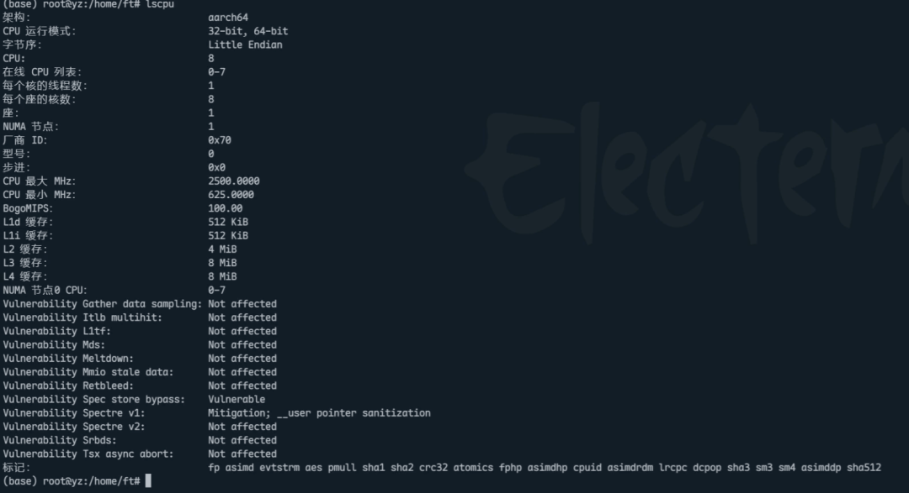

- 本次活动暂不提供算力支持

## 任务指导
为了让大家体验不同的部署方式，我们准备了两种方法。如果你喜欢“折腾”和了解细节，选方法一；如果你只想“一键搞定”，请直接看方法二！

### **方法一：源码编译（极客探索版）**
这个方法就像是自己买菜做饭，虽然步骤多一点，但能让你更了解系统里装了什么。

#### **准备“厨房”（下载并启动容器）** 
首先，我们需要一个纯净的Linux环境。在终端输入以下命令，拉取一个Ubuntu系统，并进入其中 ：

```cpp
docker pull ubuntu:22.04
docker run -itd -v /data:/data --pid=host  --ipc=host --privileged --cap-add=ALL --network=host --name vllm ubuntu:22.04 /bin/bash
docker exec -it vllm /bin/bash
```
****

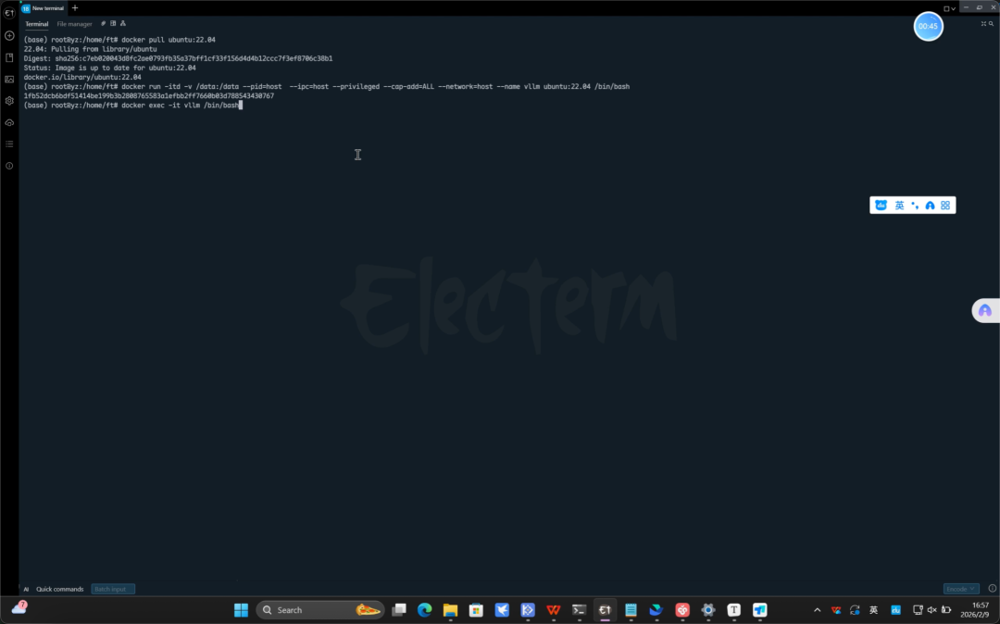
> 下载并启动容器

#### **备齐“佐料”（安装依赖）**
 环境有了，现在需要安装一些必要的工具，比如Python和编译器。这步稍微有点长，耐心等待进度条走完哦 ：

```cpp
#更新系统并安装基础工具
apt-get update  -y
apt-get install -y --no-install-recommends ccache git curl wget ca-certificates gcc-12 g++-12 libtcmalloc-minimal4 libnuma-dev ffmpeg libsm6 libxext6 libgl1 jq lsof
update-alternatives --install /usr/bin/gcc gcc /usr/bin/gcc-12 10 --slave /usr/bin/g++ g++ /usr/bin/g++-12
apt-get install wget
wget https://repo.anaconda.com/miniconda/Miniconda3-latest-Linux-aarch64.sh

#搭建Python环境
bash Miniconda3-latest-Linux-aarch64.sh
source ~/.bashrc
conda create -n vllm-cpu python=3.10
conda activate vllm-cpu
pip install uv modelscope cmake=3.26.1
```
****

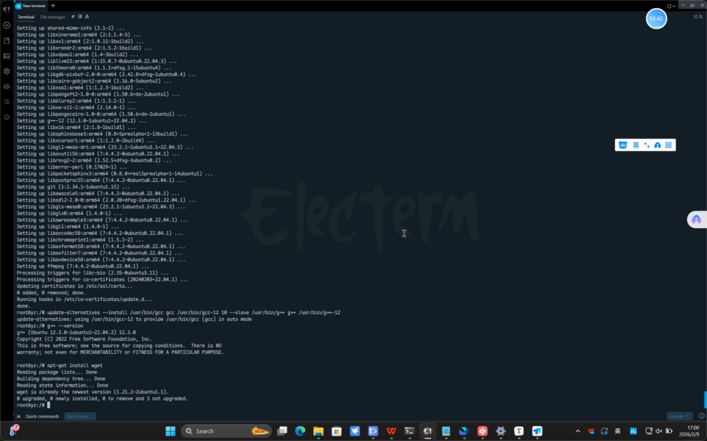  
> 系统更新以及基础工具安装过程需要几分钟，请耐心等待

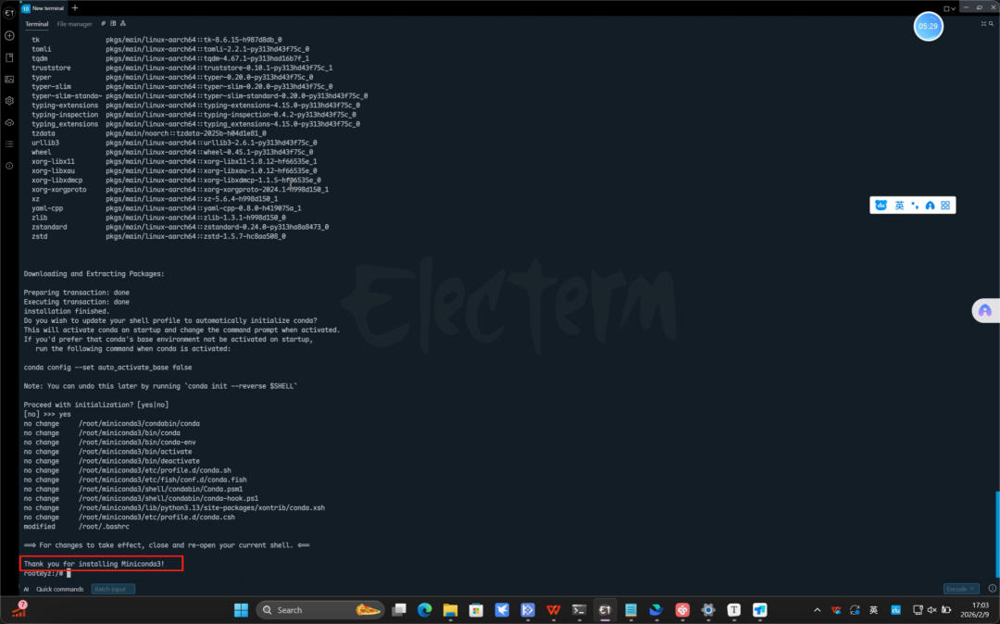
> Miniconda3安装成功提示

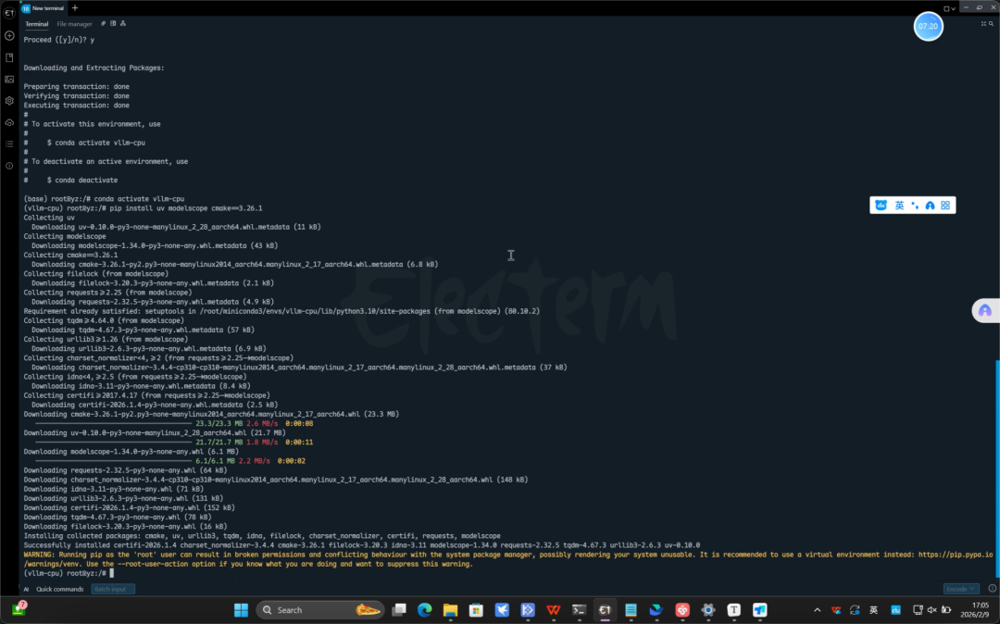
> 环境搭建成功提示

#### **开始“烹饪”（编译安装 vLLM）**
 最后，下载vLLM的源代码并进行编译。这一步完成后，你的飞腾CPU就学会如何“思考”了 ：

```
git clone https://github.com/vllm-project/vllm.git
cd vllm
git checkout v0.11.2
uv pip install -r requirements/cpu.txt --torch-backend cpu
uv pip install -r requirements/cpu-build.txt --torch-backend cpu
VLLM_TARGET_DEVICE=cpu uv pip install . --no-build-isolation
```
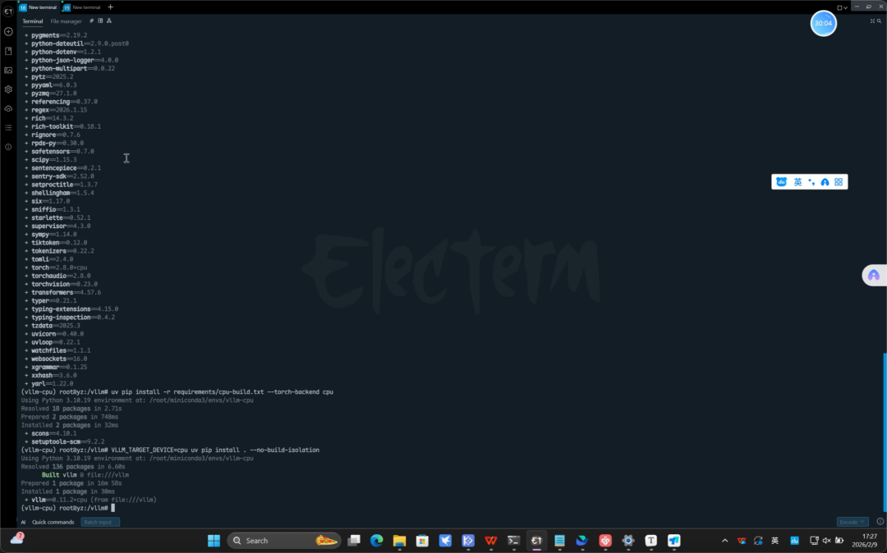
> 编译时间需要几十分钟，请耐心等待

#### **启动服务**
接下来，就是见证奇迹的时刻，编译完成后，我们马上来运行一下！

```cpp
# 激活我们刚才创建的环境
conda activate vllm-cpu

# 一键拉起模型服务（自动下载模型并运行）
VLLM_USE_MODELSCOPE=true vllm serve PaddlePaddle/ERNIE-4.5-0.3B-PT \
--max-num-batched-tokens 65536 \
--max-model-len 65536 \
--dtype float32 \
--served-model-name ernie
```
****

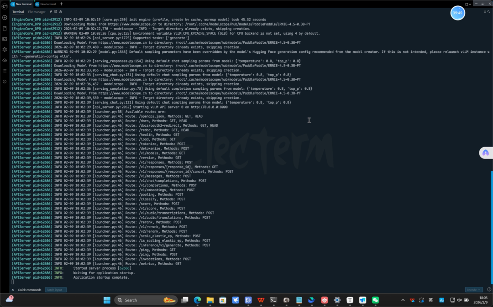
> 启动成功！

### **方法二：预编译容器（懒人推荐版）**
这个方法就像是“预制菜”，加热即食，非常适合不想敲代码的朋友！

#### **导入镜像** 
直接把打包好的镜像文件加载进来 ：

```cpp
docker load -i vllm-ft-0.11.2.tar
```
#### **启动容器** 
一行命令启动环境，直接进入正题 ：

```cpp
docker run -itd  --pid=host  --ipc=host --privileged --cap-add=ALL --network=host --name vllm-ft vllm:0.11.2-cpu-aarch64-ft /bin/bash 
docker exec -it vllm /bin/bash
```
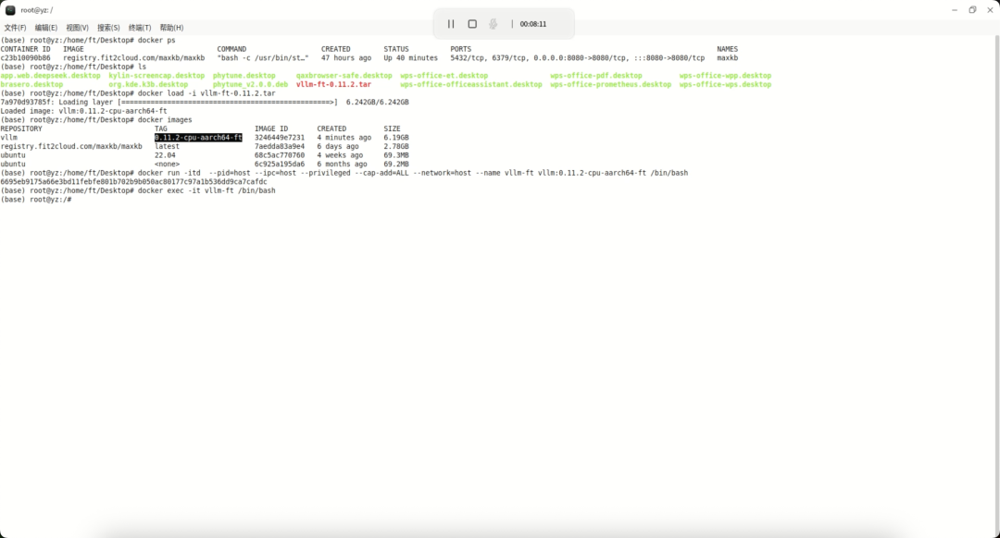
> 启动容器

#### **启动模型** 
设置好CPU线程数（类似于给大脑分配多少注意力），然后启动ERNIE模型 ：

```cpp
conda activate vllm-cpu 
export VLLM_CPU_KVCACHE_SPACE=4 
export VLLM_CPU_OMP_THREADS_BIND=4 

# 一键拉起模型服务（自动下载模型并运行）
VLLM_USE_MODELSCOPE=true vllm serve PaddlePaddle/ERNIE-4.5-0.3B-PT \
--max-num-batched-tokens 65536 \
--max-model-len 65536 \
--dtype float32 \
--served-model-name ernie
```
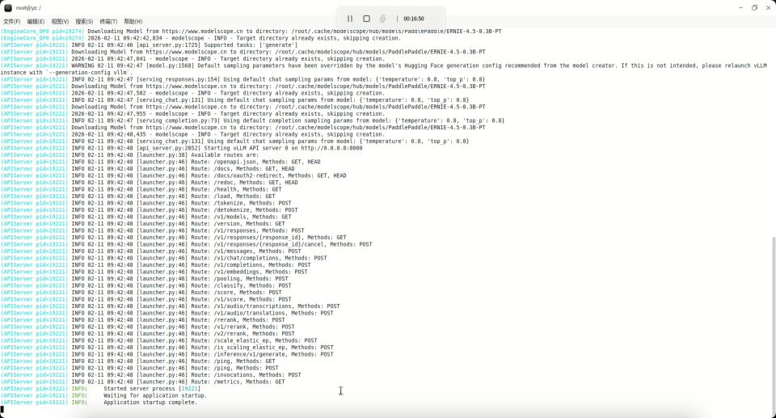
> 推理服务启动成功！

### 打卡流程
模型跑起来了，它到底聪不聪明？我们用两种方式来测试一下

## **curl测试：程序员的打招呼方式**
curl是一个命令行工具，你可以把它理解为“给AI发短信”。我们在终端里直接问它一个生活问题：“海米冬瓜汤怎么做？” 

```python
curl http://10.10.70.190:8000/v1/completions -H "Content-Type: application/json"
    -d { 
        "model": "ernie", 
        "prompt": "海米冬瓜汤怎么做", 
        "max_tokens": 1000, 
        "temperature": 0 
    }
```
在终端输入命令后，你会看到一串代码快速闪过，紧接着AI就给出了详细的食谱！

* **测试问题：**海米冬瓜汤怎么做
* **AI回答：**它非常详细地列出了食材（大米、冬瓜、胡萝卜等）和几个步骤等做法，甚至还贴心地给出了“小贴士”。

****

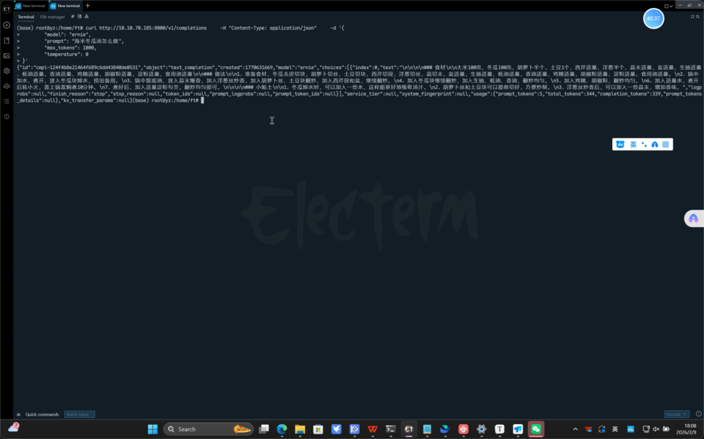

## **MaxKB测试：所见即所得的聊天界面**
如果你不喜欢看黑底白字的命令行，我们可以使用**MaxKB**搭建一个好看的聊天界面。

什么是**MaxKB？**它就像是我们常用的微信或网页聊天窗口，能够把刚才部署的大模型包装成一个漂亮的AI应用。

* **一键安装 MaxKB** 不需要复杂的配置，直接在终端输入下面这行命令，让 Docker 帮我们把这个漂亮的聊天界面拉取下来并启动 ：

```cpp
docker run -d --name=maxkb --restart=always -p 8080:8080 -v ~/.maxkb:/opt/maxkb registry.fit2cloud.com/maxkb/maxkb
```
* **登录管理后台** 安装完成后，打开浏览器，输入服务器的地址[http://10.10.70.190:8080/admin/login](http://10.10.70.190:8080/admin/login)即可进入 MaxKB 的管理后台 。


* **创建你的AI应用** 进入后台后，只需要简单的三步操作：
    * **导入模型：**将我们刚刚部署好的ERNIE模型连接进来
    * **创建应用：**设置一个应用名称，打造你的专属助手
    * **访问聊天：**点击访问，即可开始对话


## 邮件格式
* **标题**：文心伙伴赛道-【厂商】-【打卡】-【GithubID】（例如：文心伙伴赛道-飞腾-打卡-onecatcn）
* **内容**：
   * 飞桨团队你好，
   * 【GitHub ID】：zongwave
   * 【打卡内容】：飞腾 CPU 百度文心大模型推理
   * 【打卡截图】：
     * 推理请求：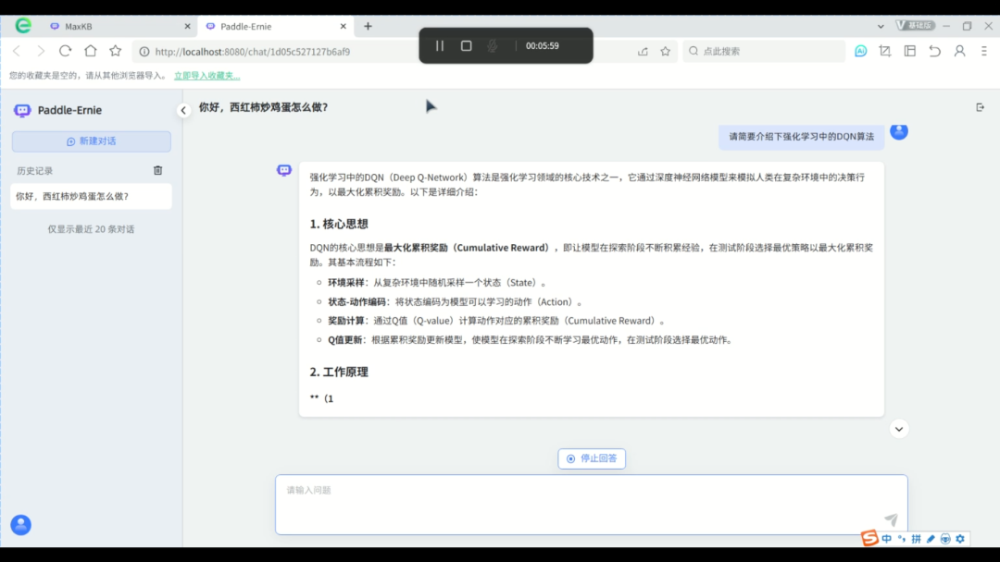
