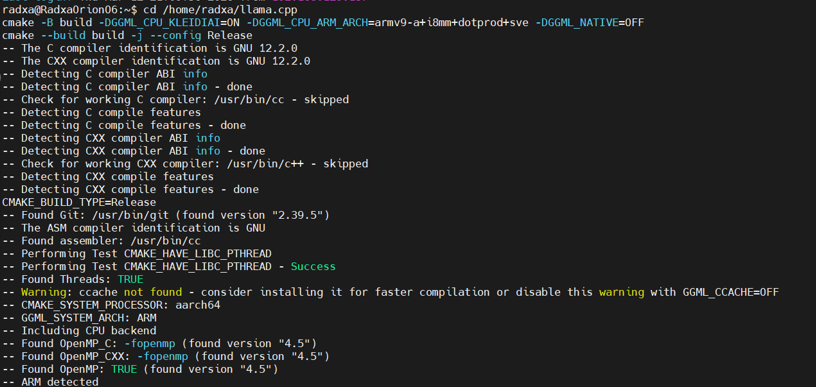
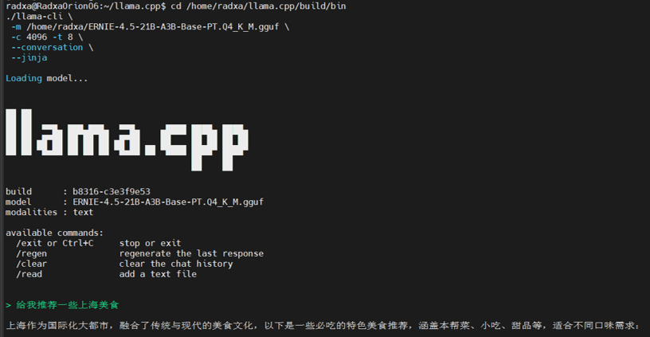

# 此芯 × 解锁基于 Armv9 架构硬件平台的端侧推理-打卡任务文档
## 1. 打卡任务名称：解锁基于 Armv9 架构硬件平台的端侧推理

各位飞桨开发者大家好！

大模型技术正加速向端侧下沉，Arm 架构已成为端侧 AI 落地的核心驱动力。此芯科技携手百度飞桨，共同发起本次黑客松热身打卡活动。

本次活动依托此芯 P1 平台，利用 Armv9 架构与 Arm KleidiAI 软件库优势，结合百度  ERNIE-4.5-21B-A3B 大模型，助力开发者快速掌握 “编译优化 - 模型转换 - 端侧推理” 全链路技能。活动参与者将有机会亲手在 Arm CPU 上跑通 21B 参数大模型，直观感受国产芯片与开源框架的融合性能，为后续正式赛的创新开发筑牢基础。

### 1.1 任务目标

本次任务需要你在基于 Armv9 架构的此芯 P1 硬件上完成如下任务：

• 采用已集成 Arm KleidiAI 软件库的 llama.cpp 进行任务推理。   
• 完成 ERNIE-4.5-21B-A3B GGUF 模型的 CPU 加速推理，实现基础提示词响应，跑通模型。  
• 输出模型推理结果和性能指标（tokens/s）。

### 1.2 提交方式

参与热身打卡活动并按照邮件模板格式将截图发送至以下邮箱：ext_paddle_oss@baidu.com + developer@cixtech.com 

### 1.3 算力/环境支持

资源支持：提供远程算力。

详情：基于此芯 P1 硬件平台（瑞莎星睿 O6 开发板）。报名成功后，系统将邮件发送远程访问指南。环境已预部署，每位开发者将拥有独立开发环境。欢迎扫码加入“此芯 & Arm 百度黑客松打卡任务群”:


### 1.4 任务指导
#### 1.4.1 模型下载和项目环境配置
##### Step1：请从 huggingface 下载 ERNIE 模型 (为节省本次开发时间，该模型已预装在 ```/home/radxa/ERNIE-4.5-21B-A3B-Q4_K_M.GGUF``` 路径下，请开发者自行确认。若未找到相关文件，可参考如下步骤进行模型的下载)。

请从huggingface下载 ERNIE-4.5-21B-A3B-Q4_K_M.GGUF 格式文件，下载地址如下：
```bash
cd /home/radxa
curl -L -o ERNIE-4.5-21B-A3B-Base-PT.Q4_0.gguf -C - "https://huggingface.co/unsloth/ERNIE-4.5-21B-A3B-PT-GGUF/resolve/main/ERNIE-4.5-21B-A3B-PT-Q4_0.gguf"
```


##### Step2：配置构建环境，要启用 KleidiAI。请通过进入 /home/radxa/llama.cpp 目录并使用 CMake 进行构建, 并确保所有 Arm CPU 优化开启（请妥善保存构建过程中的日志，用于后续任务提交验收）。

```bash
cd /home/radxa/llama.cpp
cmake -B build -DGGML_CPU_KLEIDIAI=ON -DGGML_CPU_ARM_ARCH=armv9-a+i8mm+dotprod+sve -DGGML_NATIVE=OFF
cmake --build build -j --config Release
```


#### 1.4.2 输出结果
##### Step1：模型运行后，可输入自定义提示词，等待推理结果和性能指标
```bash
cd /home/radxa/llama.cpp/build/bin
./llama-cli \
 -m /home/radxa/ERNIE-4.5-21B-A3B-Base-PT.Q4_K_M.gguf \
 -c 4096 -t 8 \
 --conversation \
 --jinja
```


### 1.5、打卡邮件提交要求

**邮件标题**  
[此芯 × 百度飞桨热身打卡]  
**邮件正文格式**  
飞桨团队你好，  
【GitHub ID】：XXX（例如 paddle-hack）  
【打卡内容】：  
1. 编译 llama.cpp（需启用 KleidiAI 支持）。为确认构建过程中 KleidiAI 已启用，请提供 llama.cpp 构建过程包含以下示例代码部分的日志运行截图。

```
-- Performing Test HAVE_DOTPROD
-- Performing Test HAVE_DOTPROD - Success
-- Performing Test HAVE_SVE
-- Performing Test HAVE_SVE - Success
-- Performing Test HAVE_MATMUL_INT8
-- Performing Test HAVE_MATMUL_INT8 - Success
-- Performing Test HAVE_FMA
-- Performing Test HAVE_FMA - Success
-- Performing Test HAVE_FP16_VECTOR_ARITHMETIC
-- Performing Test HAVE_FP16_VECTOR_ARITHMETIC - Success
-- Performing Test HAVE_SME
-- Performing Test HAVE_SME - Failed
-- Using KleidiAI optimized kernels if applicable
-- Adding CPU backend variant ggml-cpu: -march=armv9-a+i8mm+dotprod+sve
```

2. 获取/转换 ERNIE-4.5-21B-A3B 的 GGUF 格式模型，输出加载成功的截图。  
3. 运行简单的提示词推理，使用 CPU 加速，输出推理结果和性能指标（t/s）。  

【打卡截图】：（此处粘贴对应打卡内容的清晰截图，要求包含命令行执行过程、模型加载状态、推理结果、性能指标等关键信息）

【示例截图】：



