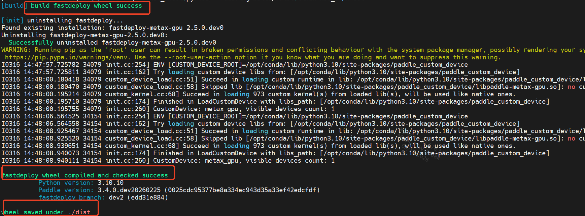
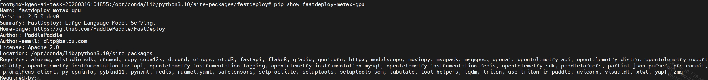

# 【热身打卡】Metax GPU + PaddleOCR-VL-1.5 + FastDeploy 编译打卡

## 一、Metax GPU + FastDeploy 编译打卡

从源码编译开始，解锁国产GPU高性能推理框架开发之路

**各位飞桨开发者大家好！**

为了帮助更多小伙伴快速进入Metax GPU FastDeploy 二次开发生态，熟悉大型框架的工程结构与编译流程，飞桨社区特推出本次 **FastDeploy 热身打卡活动**。
通过亲手完成一次完整的 FastDeploy 编译与打包流程，你将正式具备参与 FastDeploy 套件开发的基础能力。

## 二、活动目标

通过本次打卡，您将掌握：

- **FastDeploy 源码结构**
- **Paddle 运行时与 FastDeploy 的依赖关系**
- **自定义算子编译机制**
- **wheel 构建与分发流程**
- **二次编译优化与开发调试效率提升方法**
- **Metax GPU backend与paddle 框架的关系**
- **基于Metax GPU 运行FastDeploy 推理框架**

注：本次热身打卡活动需要使用 Metax GPU 硬件，赶快行动起来吧。

## 三、提交方式

参与热身打卡活动并按照邮件模板格式将截图发送至 ext_paddle_oss@baidu.com 与 kaichuang.gao@metax-tech.com，yang.yang2@metax-tech.com。

## 四、准备环境

以MetaxGPU 版本为例：

#### 算力/环境支持
为让开发者无后顾之忧，专注技术攻坚，沐曦股份为所有报名本赛题的开发者提供每人300算力代金券专属福利，助力MetaX GPU上的开发、调试与验证！
算力券领取三步骤：
    完成百度飞桨黑客松-沐曦股份专属赛题[优化 PaddleOCR-VL-1.5+MetaX GPU]报名；
    注册并登录沐曦股份开发者社区；
    在社区活动页面填写与百度飞桨黑客松报名一致的 GitHub ID，后台核验通过后将发放算力券。
    ***Tips***
    若开发过程中需要更多算力资源，可将算力券诉求发送至邮箱：yang.yang2@metax-tech.com，沐曦股份将按需提供专属支持！
    如有任何问题可加入沐曦MXMACA开发者社群，我们会为您及时答疑与提供帮助。
    
> 平台地址：[GiteeAi 算力广场](https://ai.gitee.com/compute) 曦云C500 单卡 64G instance\
> 镜像选择: `Pytorch/2.6.0/Python 3.10/maca 3.2.1.3`  \
> 领取算力券网址：https://developer.metax-tech.com/activities/4

#### paddlepaddle & custom device backend 预安装

```
1）pip install paddlepaddle==3.4.0.dev20251223 -i https://www.paddlepaddle.org.cn/packages/nightly/cpu/
2）pip install paddle-metax-gpu==3.3.0.dev20251224 -i https://www.paddlepaddle.org.cn/packages/nightly/maca/
3) python -m pip install -U "paddleocr[doc-parser]"
4) pip install opencv-contrib-python-headless==4.10.0.84
```

#### FastDeploy release2.5 代码下载并编译

```
git clone https://gitee.com/paddlepaddle/FastDeploy.git
cd FastDeploy
*** checkout to release2.5 branch ***
```
#### env 配置
```
#!/bin/sh
export MACA_PATH=/opt/maca

if [ ! -d ${HOME}/cu-bridge ]; then
  `${MACA_PATH}/tools/cu-bridge/tools/pre_make`
fi

export CUCC_PATH=/opt/maca/tools/cu-bridge
export CUCC_CMAKE_ENTRY=2
export CUDA_PATH=${HOME}/cu-bridge/CUDA_DIR
export PATH=${CUDA_PATH}/bin:${MACA_PATH}/mxgpu_llvm/bin:${MACA_PATH}/bin:${CUCC_PATH}/tools:${CUCC_PATH}/bin:${PATH}
export LD_LIBRARY_PATH=${CUDA_PATH}/lib64:${MACA_PATH}/lib:${MACA_PATH}/mxgpu_llvm/lib:$LD_LIBRARY_PATH
export MACA_VISIBLE_DEVICES="0"
export PADDLE_XCCL_BACKEND=metax_gpu
export FLAGS_weight_only_linear_arch=80
export FD_MOE_BACKEND=cutlass
export ENABLE_V1_KVCACHE_SCHEDULER=1
export FD_ENC_DEC_BLOCK_NUM=2
export FD_SAMPLING_CLASS=rejection

bash build.sh
```
## 五、编译打卡流程

1）熟悉并了解编译脚本，编译参数配置，完成fastdeploy编译，编译产物位于~/fastdeploy/dist；
运行成功后，终端输出结果如下：


2）完成 fastdeploy 编译产物 wheel 包安装，了解安装路径；



#### 邮件格式
* 标题： 文心伙伴赛道-【厂商】-【打卡】-【GithubID】（例如：文心伙伴赛道-沐曦-打卡-onecatcn）
* 内容：
   * 飞桨团队你好，
   * 【GitHub ID】：参赛选手本人 GitHub ID 打卡任务仓库地址
   * 【打卡内容】：编译/安装 fastdeploy whl 包
   * 【环境信息】：OS / CPU / GPU / FastDeploy / PaddlePaddle 版本
   * 【打卡截图】：（粘贴截图或提供链接）

#### MXMACA开发者交流群

