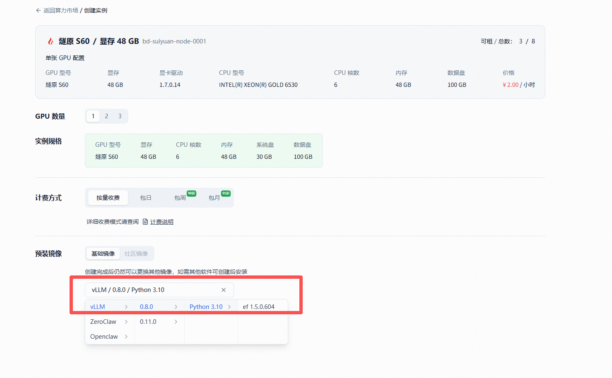

# 打卡任务名称：FastDeploy跑通ERNIE-4.5-0.3B-Paddle模型
**燧原科技 热身打卡活动**。
通过亲手完成一次通过FastDeploy调用燧原S60卡跑通ERNIE-4.5-0.3B模型的流程。


## 任务目标
通过本次打卡，你将掌握：
* PaddlePaddle 和 PaddleCustomDevice 的关系
* Paddle 运行时与 FastDeploy 的依赖关系
* ERNIE-4.5-0.3B-Paddle部署流程

## 提交方式
参与热身打卡活动并按照邮件模板格式将截图发送至 ext_paddle_oss@baidu.com + 厂商邮件组

请厂商安排研发工程师评审，回复邮件（xxx打卡任务，已通过），并抄送 ext_paddle_oss@baidu.com

## 算力/环境支持
本次热身打卡活动需要基于gitee ai社区租赁燧原卡完成（https://ai.gitee.com/compute/enflame）。

## 任务指导
### GiteeAI算力广场租赁燧原卡

#### 燧原卡租赁

#### 镜像选择
选择vLLM/0.8.0这个镜像。


### 创建虚拟环境

```
cd ~
apt install python3.10-venv
python3 -m venv .venv
source .venv/bin/activate
```

### 安装 PaddlePaddle & PaddleCustomDevice
```
# PaddlePaddle『飞桨』深度学习框架，提供运算基础能力
python -m pip install paddlepaddle==3.1.0a0 -i https://www.paddlepaddle.org.cn/packages/stable/cpu/

# PaddleCustomDevice是PaddlePaddle『飞桨』深度学习框架的自定义硬件接入实现，提供GCU的算子实现
python -m pip install paddle-custom-gcu==3.0.0.dev20250716 -i https://www.paddlepaddle.org.cn/packages/nightly/gcu/
```

#### 检查当前安装版本

```
python -c "import paddle_custom_device; paddle_custom_device.gcu.version()"
```
```
version: 3.0.0.dev20260205
commit: e3dbd3b36a0b6913fd8da10a51251e89acafaeff
TopsPlatform: 1.5.0.601
```
```
python -c "import paddle; paddle.utils.run_check()"
```
```
I0310 07:41:04.107565   961 init.cc:238] ENV [CUSTOM_DEVICE_ROOT]=/usr/local/lib/python3.10/dist-packages/paddle_custom_device
I0310 07:41:04.107585   961 init.cc:146] Try loading custom device libs from: [/usr/local/lib/python3.10/dist-packages/paddle_custom_device]
WARNING: Logging before InitGoogleLogging() is written to STDERR
I0310 07:41:04.269114   961 runtime.cc:804] InitPlugin for backend GCU successfully.
I0310 07:41:04.280309   961 runtime.cc:95] Backend GCU Init, get GCU count:1, current device id:0
I0310 07:41:04.280344   961 custom_device_load.cc:51] Succeed in loading custom runtime in lib: /usr/local/lib/python3.10/dist-packages/paddle_custom_device/libpaddle-custom-gcu.so
I0310 07:41:04.284910   961 custom_device_load.cc:78] Succeed in loading custom engine in lib: /usr/local/lib/python3.10/dist-packages/paddle_custom_device/libpaddle-custom-gcu.so
I0310 07:41:04.287516   961 custom_kernel.cc:68] Succeed in loading 275 custom kernel(s) from loaded lib(s), will be used like native ones.
I0310 07:41:04.287611   961 init.cc:158] Finished in LoadCustomDevice with libs_path: [/usr/local/lib/python3.10/dist-packages/paddle_custom_device]
I0310 07:41:04.287631   961 init.cc:244] CustomDevice: gcu, visible devices count: 1
Running verify PaddlePaddle program ... 
I0310 07:41:04.597394   961 pir_interpreter.cc:1524] New Executor is Running ...
I0310 07:41:04.598099   961 runtime.cc:133] Backend GCU init device:0
I0310 07:41:04.617556   961 pir_interpreter.cc:1547] pir interpreter is running by multi-thread mode ...
I0310 07:41:04.619024  1082 utils.cc:136] Kernels launch in JIT ONLY mode:false
I0310 07:41:04.632437  1082 op_utils.cc:191] AOT kernel stream mode:async
I0310 07:41:04.670130  1094 gcu_layout_funcs.cc:54] Enable transpose optimize:false
PaddlePaddle works well on 1 gcu.
PaddlePaddle is installed successfully! Let's start deep learning with PaddlePaddle now.
I0310 07:41:04.741544   961 runtime.cc:149] Backend GCU finalize device:0
I0310 07:41:04.741559   961 runtime.cc:101] Backend GCU Finalize
```


### 安装FastDeploy
#### 安装FastDeploy依赖
目录下有FastDeploy依赖文件requirements-gcu.txt
```
python -m pip install -r requirements-gcu.txt --extra-index-url https://mirrors.tuna.tsinghua.edu.cn/pypi/web/simplels
```

#### 安装FastDeploy
```
python -m pip install fastdeploy -i https://www.paddlepaddle.org.cn/packages/stable/gcu/ --extra-index-url https://mirrors.tuna.tsinghua.edu.cn/pypi/web/simplels
```

### 下载 ERNIE-4.5-0.3B-Paddle 模型

```
huggingface-cli download baidu/ERNIE-4.5-0.3B-Paddle --local-dir baidu/ERNIE-4.5-0.3B-Paddle
```

### 推理
执行下面命令推理

```
export ENABLE_V1_KVCACHE_SCHEDULER=1

# 下面这个环境变量主要是对于绕过单卡一个小bug。
export CUDA_VISIBLE_DEVICES=0

python -m fastdeploy.entrypoints.openai.api_server        --model baidu/ERNIE-4.5-0.3B-Paddle        --port 8180        --metrics-port 8181        --engine-worker-queue-port 8182        --max-model-len 32768        --max-num-seqs 32  --num-gpu-blocks-override 4896
```

新起一个终端，使用如下命令请求模型服务

```
curl -X POST "http://0.0.0.0:8180/v1/chat/completions" \
-H "Content-Type: application/json" \
-d '{
  "messages": [
    {"role": "user", "content": "Where is Beijing?"}
  ]
}'
```

成功运行后，可以查看到推理结果的生成，样例如下
```
{"id":"chatcmpl-525a4d8f-2f65-480e-b520-f69cc73547fb","object":"chat.completion","created":1773196831,"model":"default","choices":[{"index":0,"message":{"role":"assistant","content":"北京是中国的首都，位于中国北京市，是一个历史文化名城。","reasoning_content":null,"tool_calls":null},"finish_reason":"stop"}],"usage":{"prompt_tokens":11,"total_tokens":26,"completion_tokens":15,"prompt_tokens_details":{"cached_tokens":0}}}
```

FastDeploy服务接口兼容OpenAI协议，可以通过如下Python代码发起服务请求。
```
import openai
host = "0.0.0.0"
port = "8180"
client = openai.Client(base_url=f"http://{host}:{port}/v1", api_key="null")

response = client.chat.completions.create(
    model="null",
    messages=[
        {"role": "system", "content": "I'm a helpful AI assistant."},
        {"role": "user", "content": "把李白的静夜思改写为现代诗"},
    ],
    stream=True,
)
for chunk in response:
    if chunk.choices[0].delta:
        print(chunk.choices[0].delta.content, end='')
print('\n')
```

## 打卡调用ERNIE-4.5-0.3B-Paddle

题材新的prompt并给出推理结果的截图。
## 邮件格式
* 标题： [飞桨黑客松第十期xx任务打卡]
* 内容：
   * 飞桨团队你好，
   * 【GitHub ID】：xxxx
   * 【打卡内容】：xxxx
   * 【打卡截图】：xxxx

## Note: 
requirements-gcu.txt
```
setuptools==62.3.0
pre-commit
yapf
flake8
ruamel.yaml
zmq
aiozmq
openai>=1.93.0
tqdm
pynvml
uvicorn>=0.38.0
fastapi
paddleformers @ https://paddle-qa.bj.bcebos.com/ernie/paddleformers-0.4.0.post20251222-py3-none-any.whl
redis
etcd3
httpx
tool_helpers
cupy-cuda12x
pybind11[global]
tabulate
gradio
xlwt
visualdl
setuptools-scm>=8
prometheus-client
decord
moviepy
triton==3.3
crcmod
msgpack
gunicorn==25.0.3
modelscope
safetensors>=0.7.0
opentelemetry-api>=1.24.0
opentelemetry-sdk>=1.24.0
opentelemetry-instrumentation-redis
opentelemetry-instrumentation-mysql
opentelemetry-distro
opentelemetry-exporter-otlp
opentelemetry-instrumentation-fastapi
opentelemetry-instrumentation-logging>=0.57b0
partial_json_parser
msgspec
einops
setproctitle
aistudio_sdk
p2pstore
py-cpuinfo
flashinfer-python-paddle
flash_mask @ https://paddle-qa.bj.bcebos.com/ernie/flash_mask-4.0.post20260128-py3-none-any.whl
arctic_inference @ https://paddle-qa.bj.bcebos.com/ernie/arctic_inference-0.1.3-cp310-cp310-linux_x86_64.whl
paddlefsl
colorama
seqeval
paddle2onnx
dill<0.3.5
jieba
onnx>=2.10.0

```