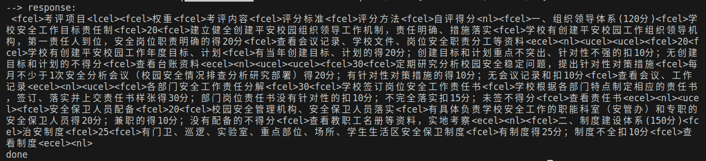
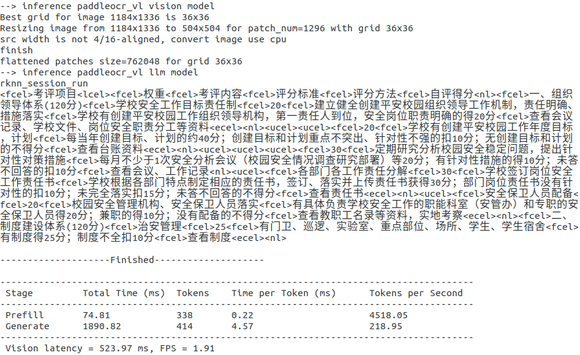

# 瑞芯微：PaddleOCR-VL RKNN3 模型转换热身打卡活动

本节热身打卡活动，将介绍如何使用 RKNN3-Toolkit 转换 PaddleOCR-VL 模型，用于端侧部署。

## 任务目标

通过本次活动，你将掌握：
1. 熟悉 RKNN3-Toolkit 工具链及模型转换流程。
2. 熟悉 RKNN3-Toolkit 性能评估。
3. 完成 PaddleOCR-VL 模型转换，跑通模拟器推理。

## 提交方式

参与热身打卡活动并按照邮件模板格式将截图发送至 ext_paddle_oss@baidu.com 与 alex.hu@rock-chips.com。

## 任务指导

### 获取 RKNN3-Model-ZOO 并配置环境

```bash
git clone https://github.com/airockchip/rknn3-model-zoo.git
cd rknn3-model-zoo
conda create -n rknn3 python=3.10
conda activate rknn3
pip install -r requirements.txt
```

### 获取 RKNN3-Toolkit 工具链并安装

获取 RKNN3-Toolkit ：
```bash
git clone https://github.com/airockchip/rknn3-toolkit.git
cd rknn3-toolkit
git lfs pull
pip install -r rknn3-toolkit/packages/requirements_cp310-1.0.0.txt
pip install rknn3-toolkit/packages/rknn3_toolkit-1.0.0-cp310-cp310-manylinux_2_17_x86_64.manylinux2014_x86_64.whl
pip install transformers==4.55.0
pip install einops
```

其中 transformers==4.55.0 是 PaddleOCR-VL 模型依赖的版本。

备注：若git lfs pull失败，请直接在网页上下载whl包。

### 获取 PaddleOCR-VL 模型及权重文件

模型地址：https://huggingface.co/PaddlePaddle/PaddleOCR-VL

```bash
git lfs pull https://huggingface.co/PaddlePaddle/PaddleOCR-VL
```

下载并放到 rknn3-model-zoo 目录下，将paddleocr_vl转换示例代码及量化数据一并放到指定目录下，并用压缩包中的convert_hf_to_gguf.py文件替换rknn3-model-zoo/tokenizer/thirdparty/llama_vocab/convert_hf_to_gguf.py。目录结构如下：

```bash
- rknn3-model-zoo/
 - datasets/
  - OmniDocBench_ROI/
   - llm/
   - vision/
 - examples/
  - paddleocr_vl/
   - model/
    - PaddlePaddle/PaddleOCR-VL
```

## 模型转换

PaddleOCR-VL 模型需拆分为 Vision 和 LLM 两部分，分别进行转换。

### 1. Vision 部分转换

- ONNX 模型转换：模型分辨率默认为504x504，分辨率可修改，但注意宽和高都必须为28的倍数。

```bash
cd examples/paddleocr_vl/python/vision
python export_vision.py \
    --model_path ../../model/PaddlePaddle/PaddleOCR-VL \
    --export_vision_path ../../model/vision/PaddleOCR-vision.onnx \
    --export_mlp_AR_path ../../model/vision/PaddleOCR-vision-mlp_AR.onnx \
    --img_h 504 --img_w 504 --quan_dataset
```

- RKNN 模型转换：

```bash
python export_rknn.py \
    --onnx_path ../../model/vision/PaddleOCR-vision.onnx \
    --rknn_path ../../model/vision/PaddleOCR-vision.rknn \
    --mlpar_onnx_path ../../model/vision/PaddleOCR-vision-mlp_AR.onnx \
    --mlpar_rknn_path ../../model/vision/PaddleOCR-vision-mlp_AR.rknn
```

开启`--accuracy`参数可进行模型精度分析。

模型转换成功后，vision 部分模型保存在`../../model/vision/`目录下。目录结构如下：

```bash
- model/vision
 - PaddleOCR-vision.onnx
 - PaddleOCR-vision.rknn
 - PaddleOCR-vision.weight
 - PaddleOCR-vision.rknn.ctx
 - PaddleOCR-vision-mlp_AR.onnx
 - PaddleOCR-vision-mlp_AR.rknn
 - PaddleOCR-vision-mlp_AR.weight
 - PaddleOCR-vision-mlp_AR.rknn.ctx
 - position_embedding_model.bin
```

备注：若导出ONNX模型时卡死（内存不足），可尝试移除掉`--quan_dataset`参数，不生成量化数据。导出RKNN模型时，将`QUANTIZED`全局参数设置为`False`。模型不做量化会影响推理性能。

### 2. LLM 部分转换

- ONNX 模型转换：

```bash
cd ../llm
python export_llm.py \
    --model_path ../../model/PaddlePaddle/PaddleOCR-VL \
    --export_llm_path ../../model/llm/PaddleOCR-llm.onnx
```

- RKNN 模型转换：

```bash
python export_rknn.py \
    --onnx_path ../../model/llm/PaddleOCR-llm.onnx \
    --config ../../model/llm/PaddleOCR-llm.config.pkl \
    --rknn_path ../../model/llm/PaddleOCR-llm.rknn
```

模型转换成功后，LLM 部分模型保存在`../../model/llm/`目录下。目录结构如下：

```bash
- model/llm
 - PaddleOCR-llm.onnx
 - PaddleOCR-llm.config.pkl
 - PaddleOCR-llm.embed.bin
 - PaddleOCR-llm.tokenizer.gguf
 - PaddleOCR-llm.rknn
 - PaddleOCR-llm.weight
 - PaddleOCR-llm.rknn.ctx
```

备注：若导出ONNX模型时卡死（内存不足），可尝试将`--quan_dataset`参数设置为0，不生成量化数据。导出RKNN模型时，将`QUANTIZED`全局参数设置为`False`。模型不做量化会影响推理性能。

## 模拟器推理

转换模型成功后，model路径下存放着rknn模型文件、weight权重文件等，由于导出rknn时设置了save_ctx=True，会导出.rknn.ctx文件，该文件可用于模拟器推理。

```bash
cd ..
python infer_simular.py --tokenizer_path ../model/PaddlePaddle/PaddleOCR-VL --image_path ../data/vision/test.png --prompt table
```

运行成功后，会打印出识别结果，如下：



## 端侧部署[可选]

模型部署需要将转换后的模型拷贝到 RK3588 开发板，编译c++ demo部署运行。

注意：若修改了 Vision 模型的分辨率，需同步调整 `rknn_paddleocr_vl_vision.h` 中的参数：

```cpp
#define MODEL_WIDTH  <your_width>
#define MODEL_HEIGHT <your_height>
```

### 1. 编译c++ demo

c++ demo代码位置：`examples/paddleocr_vl/cpp/`

```bash
cd ../../../../
./build-linux.sh -t rk3588 -a aarch64 -d paddleocr_vl
```

编译成功后，c++ demo程序保存在`install/rk3588_linux_aarch64/rknn_paddleocr_vl_demo`下，包括模型文件、依赖库文件及demo程序。目录结构如下：

```bash
- install/rk3588_linux_aarch64/rknn_paddleocr_vl_demo
 - lib
   - librknn3_api.so
   - librga.so
 - model
   - PaddleOCR-vision.rknn
   - PaddleOCR-vision.weight
   - PaddleOCR-vision-mlp_AR.rknn
   - PaddleOCR-vision-mlp_AR.weight
   - position_embedding_model.bin
   - PaddleOCR-llm.rknn
   - PaddleOCR-llm.weight
   - PaddleOCR-llm.tokenizer.gguf
   - PaddleOCR-llm.embed.bin
   - test.png
 - rknn_paddleocr_vl_demo
```

### 2. 推送demo程序到RK3588开发板

```bash
adb push install/rk3588_linux_aarch64/rknn_paddleocr_vl_demo /userdata/
```

### 3. 运行c++ demo程序

```bash
adb shell
cd /userdata/rknn_paddleocr_vl_demo
./rknn_paddleocr_vl_demo model/PaddleOCR-vision.rknn model/PaddleOCR-vision.weight model/position_embedding_model.bin model/PaddleOCR-llm.rknn model/PaddleOCR-llm.weight model/PaddleOCR-llm.tokenizer.gguf model/PaddleOCR-llm.embed.bin model/PaddleOCR-vision-mlp_AR.rknn model/PaddleOCR-vision-mlp_AR.weight 0xff 0xff 0xff model/test.png "table"
```

运行成功后，会打印出识别结果及推理性能，如下：



## 打卡完成提交

### 提交内容

1. 模拟器推理结果截图
2. 成功转换出的模型文件及权重文件截图
3. 导出的所有rknn及weight文件

### 邮件格式

```bash
标题：[飞桨黑客松第十期PaddleOCR-VL RKNN3模型转换任务打卡]
内容：
飞桨团队你好，
  [GitHub ID]: XXX
  [打卡内容]: PaddleOCR-VL RKNN3模型转换
  [打卡截图]: 
```
