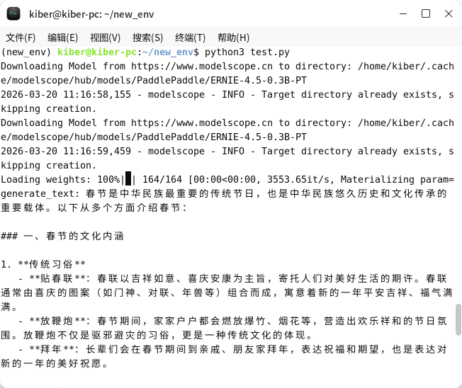

# 【打卡任务】在openKylin操作系统上部署ERNIE本地大模型
各位开发者大家好！

通过本次openKylin & Paddle打卡活动，您可以亲手体验在openKylin操作系统上从0~1安装、部署并运行ERNIE大模型的全流程，掌握在openKylin操作系统上开发AI应用的基本能力!

具体操作步骤如下，快来试试吧~
## 1、签署openKylin社区CLA
CLA签署地址：https://cla.openkylin.top/

备注：如您没有gitee账号，需要先前往gitee平台:https://gitee.com/  申请账号，然后在签署CLA时的“gitee id”里填入您的id，方便社区后续识别您的贡献。
## 2、安装openKylin 2.0 SP2操作系统
- openKylin 2.0 SP2操作系统镜像 [下载地址](https://www.openkylin.top/downloads/index-cn.html)
- [系统安装指南](https://gitee.com/openkylin/docs/blob/master/01_%E5%AE%89%E8%A3%85%E5%8D%87%E7%BA%A7%E6%8C%87%E5%8D%97/openKylin%E7%B3%BB%E7%BB%9F%E5%AE%89%E8%A3%85%E6%8C%87%E5%8D%97.md)

## 3、切换到维护模式
打开设置-关于，鼠标左键连续点击5次”UKUI“图标，此时侧边栏出现”维护模式“，点进去开启维护模式，然后按照提示重启或重新登录系统。

## 4、安装python相关开发包
``````
sudo apt install pip python3.12-dev python3.12-venv
``````

## 5、开启虚拟环境
``````
python3 -m venv new_env
source new_env/bin/activate
``````
## 6、安装及相关依赖
``````
pip install modelscope
pip install setuptools==81.0.0   #注意不要安装最新的82版本
pip install torch
pip install accelerate
``````
## 7、下载ERNIE-4.5-0.3B模型
```
modelscope download --model PaddlePaddle/ERNIE-4.5-0.3B-PT
```

## 8、执行测试脚本
```
import torch
from modelscope import AutoModelForCausalLM, AutoTokenizer

model_name = "PaddlePaddle/ERNIE-4.5-0.3B-PT"

# load the tokenizer and the model
tokenizer = AutoTokenizer.from_pretrained(model_name)
model = AutoModelForCausalLM.from_pretrained(
    model_name,
    device_map="auto",
    dtype=torch.bfloat16,
)

# prepare the model input
prompt = "介绍一下春节"
messages = [
    {"role": "user", "content": prompt}
]
text = tokenizer.apply_chat_template(
    messages,
    tokenize=False,
    add_generation_prompt=True
)
model_inputs = tokenizer([text], add_special_tokens=False, return_tensors="pt").to(model.device)

# conduct text completion
generated_ids = model.generate(
    **model_inputs,
    max_new_tokens=1024
)
output_ids = generated_ids[0][len(model_inputs.input_ids[0]):].tolist()

# decode the generated ids
generate_text = tokenizer.decode(output_ids, skip_special_tokens=True)
print("generate_text:", generate_text)
```

## 9、上传打卡截图
在如下仓库里新建一个issue，并在issue内按照如下格式提供打卡内容：

https://gitee.com/openkylin/community-management

【gitee ID】：

【打卡内容】：在openKylin操作系统上部署ERNIE大模型

【打卡截图（运行结果截图）】：



**打卡任务提交成功后，请发送一封邮件附上issue链接到该邮箱：contact@openkylin.top、ext_paddle_oss@baidu.com** 

邮件标题：文心伙伴赛道-【厂商】-【打卡】-【GithubID】（例如：文心伙伴赛道-麒麟-打卡-onecatcn）
