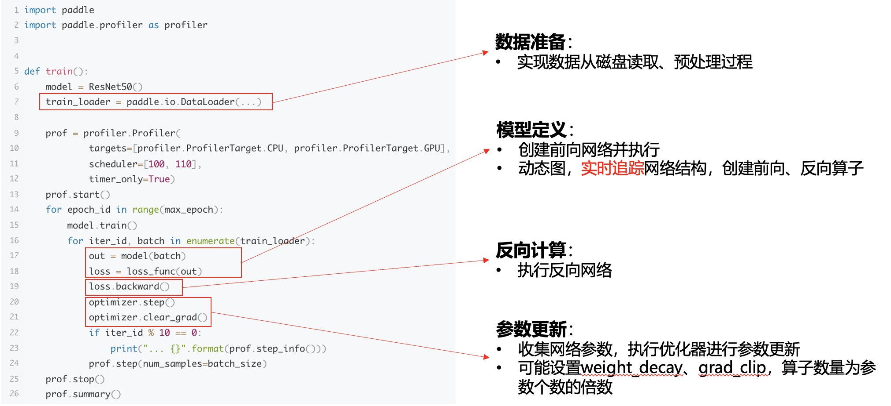
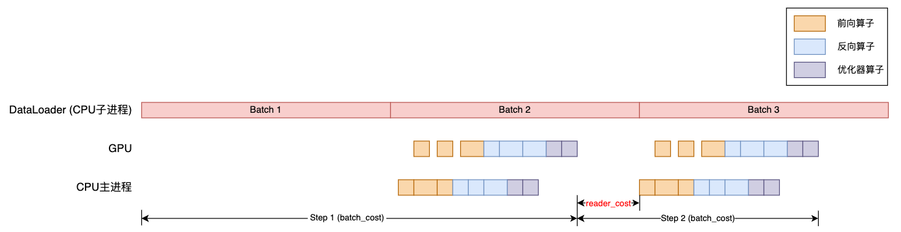
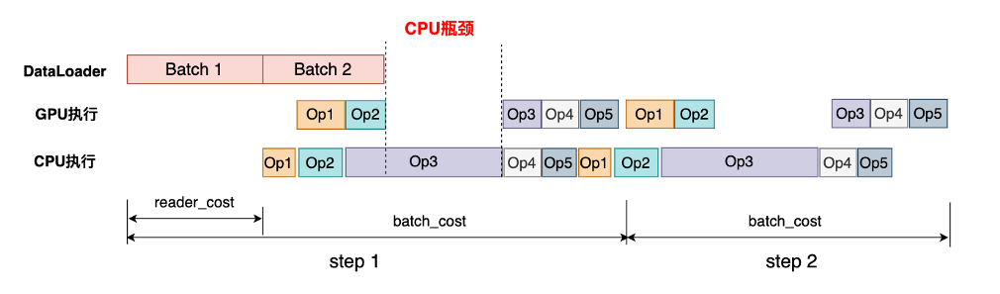
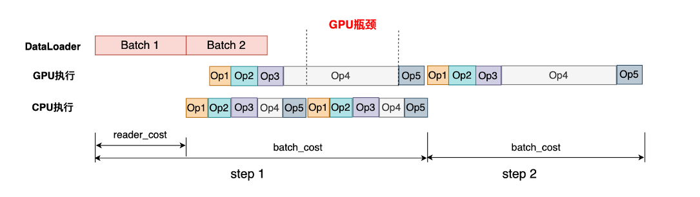
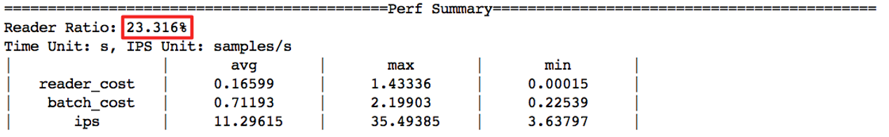
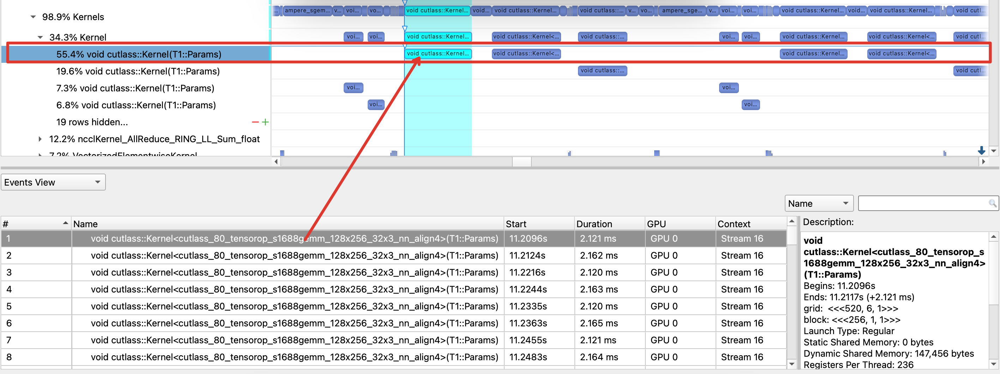
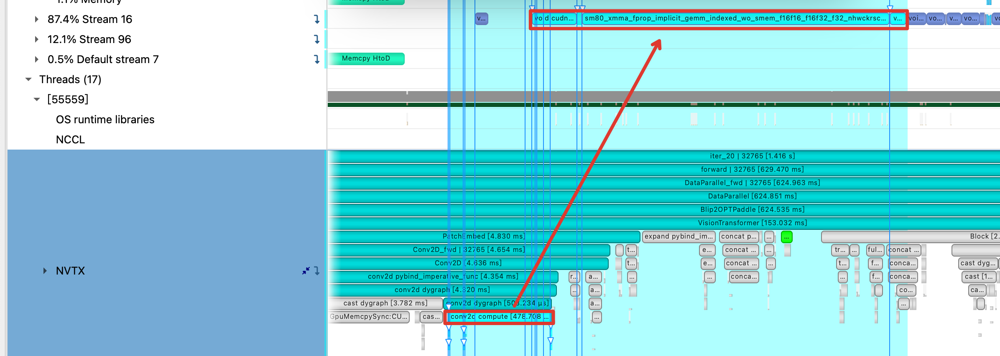

# 模型性能分析方法

| 版本    | 内容    |  作者  |
|---------|----------|-----------------|
| v1.0    | 发布性能分析的基本方法和工具|@zhangting2020, @JamesLim-sy, @Xreki|

## 1.认识三大瓶颈
在进行模型性能分析前，先了解模型训练包含了哪些过程，以下是一个简单案例。



在做实际的模型分析时，我们都建议结合自己分析的任务去理清流程，更有助于后续的深入分析。

通常我们会以训练精度、速度、占用资源来评价一个模练性能的优劣。在模型训练收敛的迭代次数不变的情况训练速度可以用吞吐量（Instances Per SeconIPS）即每秒处理的样本数目来直观表示。模型的吞吐受到多种因素影响，我们首先从硬件层面来分析，看看些情况影响了硬件的执行效率。以下面训练任务的时（timeline）示意图为例，我们可以将常见的性能瓶类为3个方面：

- I/O瓶颈：在模型训练流程中，首先会将磁盘上存储的数据样本读取到CPU内存中，一般还会在CPU上完成数据的预处理，最后将处理好的数据从CPU内存拷贝到GPU内存中，由GPU完成计算。如下图所示，当数据处理过程较慢，则会引起GPU计算等待（图中 reader_cost 部分），造成I/O瓶颈


- CPU瓶颈：由于 GPU 运行速度较快，如果CPU端处理任务耗时太久，造成GPU等待，就会拖慢训练速度。Op3的CPU时间过高，导致了这段时间内GPU在等待CPU处理结束，从而影响了性能


- GPU瓶颈：虽然GPU提供了很高的算力，但如果GPU算子实现不够高效，也会导致性能较差。如下图Op4的GPU时间明显很长，可能存在较多的优化空间


明确了硬件层面加速的原理，我们再来看看在框架层面或者模型层面有哪些关键点是影响硬件执行速度的主要因素。通过对大量开源模型库的各类模型进行深入分析，我们总结了影响性能的5个关键点：

- 数据读取：很多框架都提供了多进程数据读取的功能，但进程数的设置完全依赖用户经验，设置不当反而还会导致性能变差
- 配置参数：尤其在使用混合精度训练时，需要使Tensor的布局和大小等设置满足硬件限制，目前框架均需要开发人员手工调整
- 算子性能：大多数框架基本都会用cuDNN、cuBLAS等高性能加速库，但是在各种硬件、各种尺寸和数据类型的场景下，单一加速库也难以保障性能总是达到最优，不同场景下可能需要使用不同的算子实现，这也需要开发者有足够的经验以及分析才能确认
- 框架调度：一些模型计算开销并不大，那么模型的性能主要会受到CPU开销的影响，这种场景下框架执行调度的开销会对模型性能产生明显影响
- 模型实现：有些模型实现中可能引入了无关操作，或者没有使用一些算法策略加速等，由于完全依赖开发者的实现方式，框架层面一般没有太好的解决办法

所有的瓶颈其原因基本都可以归结为上述5个关键点，所以在进行模型分析时，我们需要将观察到的瓶颈现象和关键点关联起来，才能找到优化思路。

### 1.1 IO瓶颈

除了通过timeline识别IO瓶颈，在训练任务中，我们也可以用最直接的统计法去判断。通过多个Iter的「平均reader_cost占比」判断模型中是否存在IO瓶颈，计算公式如下：

$$
avg{\_reader\_ratio} = \frac{reader{\_ratio}}{batch{\_cost}}
$$

1. 识别IO瓶颈

Paddle内置了一套功能完整的[Profiler工具](https://www.paddlepaddle.org.cn/documentation/docs/zh/develop/api/paddle/profiler/Profiler_cn.html)，可以实现快速的模型性能测试。其中，**性能测试务必设置 timer_only=True**，在这种模式下只是统计模型运行的 IPS，时间开销，但不会对模型进行详细的性能数据采样和分析，对模型的实际性能没有影响。如果设置为 timer_only=False ，通常是用于得到详细的性能分析报告，其主要场景是做深入的模型的分析，这种设置会降低运行速度，所以得到的不是真实的训练性能。

```python
import paddle.profiler as profiler             # 引入Paddle Profier库

def train():
    # time-only 分析获得 Reader Ratio、batch cost、readercost、ips   
    prof = profiler.Profiler(timer_only=True)
    prof.start()                               # 插入Profiler启动FLAG

    for epoch_id in range(self.start_epoch, self.cfg.epoch):
        model.train()
        for step_id, data in enumerate(self.loader):
            # loss = model()
            # loss.backward()
            # loss.backward()
            # optimizer.clear_grad()
            prof.step(num_samples=batch_size)  # 在训练迭代外部中记录每个step
            ......
    prof.stop()                                # 插入Profiler结束点FLAG
    prof.summary()                             # 在训练迭代结束后中汇总信息并输出统计log
```

下图是在 timer_only=True 模式下输出的关键信息，我们需要重点关注 IPS、batch_cost、reader_cost的平均值，和 Reader Ratio指标。其中 Reader Ratio则直接给出了这个模型 IO 开销的占比。其越接近于0越好，当avg_reader_ratio > 5%，可以认为模型中存在IO瓶颈，但实际如果该占比小于5%，那么也说明有同比例的理想的优化空间。



2. 解决方法

首先，模型开发者应检查模型中DataLoader的配置，关键参数有两个：use_shared_memory和num_workers。

- num_workers：需调整直至avg_reader_ratio降至5%以内。原则上，avg_reader_ratio 值越小越好。若num_workers值增大到16仍不能解决IO瓶颈，则需要优化数据预处理逻辑。
- use_shared_memory：是否使用系统 shared memory 加速子进程数据的通信，需确认该值为True。

```python
class paddle.io.DataLoader(dataset,
                           feed_list=None,
                           batch_sampler=None,
                           batch_size=1,
                           shuffle=False,
                           drop_last=False,
                           collate_fn=None,
                           num_workers=0,
                           use_shared_memory=True)
```

### 1.2 CPU瓶颈

可以先使用 nvidia-smi 命令收集模型训练期间「整体GPU利用率」，若整体GPU利用率 < 80%，则存在明显的CPU瓶颈。一个GPU训练任务，理想情况是GPU利用率100%，因此是否存在CPU瓶颈和相应的优化空间，应该结合实际任务去分析和判断。

1. 识别CPU瓶颈

可以通过Paddle的Profiler工具获得，在对CPU和GPU瓶颈分析时，可以对Profiler做如下配置。**注意：还需要在训练代码中插入关键接口调用，请参考官网文档**。
- targets：指定性能分析所要分析的设备，默认会自动分析所有存在且支持的设备
- timer_only：指定是否要对模型进行详细的数据采样和分析，该分析场景下需要设置为False
- scheduler：指定性能分析采样的迭代区间，建议在训练开始至少10个stepy以后开始采样。指定（100，110）表示采样第100～110个step产出性能分析报告

```python
prof = profiler.Profiler(
         targets=[profiler.ProfilerTarget.CPU, profiler.ProfilerTarget.GPU],
         timer_only=False,
         scheduler = (100, 110))
```

性能分析报告会打印出如下的摘要，如果GPU的利用率偏低，那么说明存在CPU瓶颈。


2. 解决方法

通过指标我们仅仅能判断是否存在CPU瓶颈，而最重要的任务是通过timeline去找到这些CPU瓶颈发生的位置，分析原因并解决。常见的CPU瓶颈直观表现是： GPU执行完毕后，CPU计算较慢或者因设备间的 memory copy等操作引发GPU出现空闲等待，timeline上会存在空白的时间段，说明未切入下一个计算或调度任务。此时，需要利用后文提到的 模块级分析工具 定位CPU瓶颈主要存在的模块。

我们在过去的模型调优中发现，如检测模型中的损失函数计算部分，经常会出现较低的GPU利用率，一些算子实现的不合理也会导致CPU开销较高，或者是模型的Python代码实现不够高效。因此解决CPU瓶颈，并没有一个统一的方法，其核心是找到问题的原因，对症下药。

### 1.3 GPU瓶颈

1. 识别GPU瓶颈

如CPU瓶颈的判断方法一样，可以使用Paddle Profiler工具去统计整体GPU利用率。若整体GPU利用率 > 90%，则说明存在GPU瓶颈，主要体现为GPU的计算效率不足，CPU端计算执行完毕后，GPU端仍需要花费较长时间才能完成计算，此时需要 OP级别的 Profiler 工具定位性能异常OP等问题，可以结合后续的分析方法来挖掘可以优化的OP。

2. 解决方法

解决GPU瓶颈，有一些基本的思路：
- Kernel调优：Paddle的部分OP，如卷积支持了多版本Kernel的自动调优，通过 FLAGS_use_autotune=1 则可以开启，框架会在训练开始的前10个迭代搜索最优算法并缓存。
- CUDA Kernel的手工优化：可以借助Nsight Compute等性能分析工具，去对性能较差的算子进行分析和优化。
- 实现通用的融合模式：一些模型中可能存在较多相同的计算图，可以通过把多个算子组合实现的部分合并到一个算子去完成，实现Kernel融合能够降低访存开销。


## 2. 模型性能分级分析方法

随着性能分析的深入程度，模型性能分析大约可以分成模型级、模块级、API/OP级三个级别。

| 性能分析级别 | 解释    |
|-------------|-----------------|
| 模型级    | 初步确定模型瓶颈类型：IO瓶颈、CPU瓶颈、GPU瓶颈 |
| 模块级    | 确定最耗时的模块，完成性能收益最大的那些任务 |
| API/OP级 | 确定瓶颈算子或API，优化算子或API实现 |

**注意**:
- 模型分析和优化工作需要经过一轮轮的迭代测试，每当我们完成一次分析，做完一个优化点，都需要及时地对优化效果进行验证。因此在测试&分析工作启动前，请务必确认测试到的训练速度是可以稳定复现的。如果发现每次测试数值都有较大波动，那么可以尝试关闭数据shuffle，固定 random.seed 保证每次训练过程的一致性，避免数据输入变化带来干扰。
- 建立清晰的数据记录表格，来记录测试环境、测试的BatchSize和相关配置等，记录模型性能的Baseline，和每一个优化点完成后带来的性能提升幅度。

可以参考如下格式，建立自己模型优化工作的数据表：

| 优化方向 | 优化内容    | BS=2，提升/预期提升幅度| BS=4，提升/预期提升幅度｜
|-----------|:-------- |:--------:|---------|
| Baseline  | 初始性能  |
|  IO优化   | DataLoader调优 |||
|          | 优化数据预处理   |||
| 算子优化  | 优化算子A的前向实现  |||
|          | 优化算子B的前反向实现  |||


## 2. 模块级分析：确定最耗时的模块

Paddle中封装了 NVTX API，可以借助Nsight System 工具来做更深入的性能分析。基于各框架提供的NVTX使用方法以及各框架的Hook机制存在差异，我们在[PaPerf](https://github.com/Xreki/PaPerf)中提供了 profile_paddle.py 和 profile_torch.py，用于在模块层级提取各模型的性能异常点。由于工具依赖于Nsight System，因此用户需要分别在服务器和自己的主机（Windows、或 Mac）上安装App。具体的安装和使用可以参考Nvidia 官网的相关介绍 [Nsight System](https://developer.nvidia.com/nsight-systems)。

Paddle的封装实现见 profile_paddle.py，该工具的使用方法比较简单，模型训练时只需添加如下几行代码，就可以收集到各模块的耗时信息。**注意：为了保证性能分析结果的正确性，Paddle.Profiler的相关API调用需要注释掉，后续会提供一键化切换方案**。

```
def train():
    ...
    profile_paddle.register_profile_hook(model)         # 为模型注册Profile相关的Hook
    
    # 在 model.train() 过程中插入如下代码
    max_iters = 20
    for iter_id in range(max_iters):
    
        profile_paddle.switch_profile(iter_id, 20, 30)   # 控制Profile数据收集的迭代范围，尽量选择iter_id 20以后的阶段做分析
        with profile_paddle.add_nvtx_event("forward"):   # 为前向计算添加NVTX标记
            x = paddle.randn(shape=[batch_size, in_features])
            out = model(x)
            loss = paddle.mean(out)
        with profile_paddle.add_nvtx_event("backward"):   # 为反向计算添加NVTX标记
            loss.backward()
        with profile_paddle.add_nvtx_event("optimizer"):  # 为优化器添加NVTX标记
            adam.step()
        with profile_paddle.add_nvtx_event("clear_grad"): # 对于AMP模型，为clear_grad添加NVTX标记
            adam.clear_grad()
```

训练完成后，用户下载训练过程生成的 timeline，即可在个人主机端查看模型中各模块的耗时情况。如下图，我们通过对timeline的分析，可以大体知道模型训练中各部分的耗时占比。

根据forward、backward、optimizer、clear_grad 4个训练过程的开销，了解一个迭代的耗时构成。


还可以分析网络中哪些模块耗时最多，从而理清优化工作的主次，如下图所示：从timeline上也能够很清楚地看到网络不同模块的耗时。


根据模块级别的开销占比，可以针对性地去展开timeline分析细节，由于每个模型情况不同，我们不对timeline分析细节做过多的案例展示。分析人员应该根据前面对瓶颈的判断，结合timeline的现象去寻找导致瓶颈的原因。

## 3. API/OP级分析

定位模型中的耗时API/OP也需要依赖于 Paddle 内置的Profiler工具，注意需要注释掉PaPerf相关的使用。

```
import paddle.profiler as profiler             # 引入Paddle Profier库

def train():
    # prof = profiler.Profiler(timer_only=True)

    # op-details 分析获得区间内 CPU/GPU使用率、算子时间等信息、
    # 但 Reader Ratio、batch cost、readercost、ips 等性能数据不准确、会下降
    prof = profiler.Profiler(
        targets=[profiler.ProfilerTarget.CPU, profiler.ProfilerTarget.GPU],
        scheduler=[100, 110], timer_only=False)
    prof.start()                               # 插入Profiler启动FLAG

    for epoch_id in range(self.start_epoch, self.cfg.epoch):
        model.train()
        for step_id, data in enumerate(self.loader):
            # loss = model()
            # loss.backward()
            # loss.backward()
            # optimizer.clear_grad()
            prof.step(num_samples=batch_size)  # 在训练迭代外部中记录每个step
            ......
    prof.stop()                                # 插入Profiler结束点FLAG
    prof.summary()                             # 在训练迭代结束后中汇总信息并输出统计log
```

设定完成后，启动模型训练，Profiler工具即可全面地分析模型的各方面性能数据，涵盖：

```
-------------------Device Summary-------------------
------------------------------  --------------------  
Device                          Utilization (%)       
------------------------------  --------------------  
CPU(Process)                    102.29                
CPU(System)                     4.70                  
GPU0                            59.68                 
------------------------------  --------------------  
```


各阶段的开销信息汇总：
```
---------------------------------------------------Model Summary---------------------------------------------------
Time unit: ms
---------------  ------  --------------------------------------------  --------------------------------------------  
Name             Calls   CPU Total / Avg / Max / Min / Ratio(%)        GPU Total / Avg / Max / Min / Ratio(%)        
---------------  ------  --------------------------------------------  --------------------------------------------  
ProfileStep      60      29508.09 / 491.80 / 700.33 / 453.83 / 100.00  17610.85 / 293.51 / 295.62 / 292.58 / 100.00  
  Dataloader     60      80.39 / 1.34 / 3.89 / 0.21 / 0.27             0.00 / 0.00 / 0.00 / 0.00 / 0.00              
  Forward        120     8342.92 / 69.52 / 366.03 / 4.24 / 28.27       7080.81 / 59.01 / 114.65 / 2.65 / 40.21       
  Backward       60      2197.35 / 36.62 / 66.55 / 28.95 / 7.45        10331.20 / 172.19 / 172.29 / 172.04 / 58.66   
  Optimization   60      1207.50 / 20.12 / 31.19 / 11.84 / 4.09        129.57 / 2.16 / 2.17 / 2.15 / 0.74            
  Others         -       17679.94 / - / - / - / 59.92                  69.26 / - / - / - / 0.39                      
---------------  ------  --------------------------------------------  --------------------------------------------  
```

OP在GPU和CPU开销时间汇总，这是这部分分析需要重点关注的内容。通过如下的 Operator Summary，可以大体了解算子的占比情况，筛选出开销较高的算子去进行优化。这个统计信息里不同于前面的模块级别的耗时，它是更细粒度的统计。

```
----------------------------------------------------------------------Operator Summary----------------------------------------------------------------------
Time unit: ms
----------------------------------------------------  ------  ----------------------------------------  ----------------------------------------  ----------  
Name                                                  Calls   CPU Total / Avg / Max / Min / Ratio(%)    GPU Total / Avg / Max / Min / Ratio(%)    FLOPs       
----------------------------------------------------  ------  ----------------------------------------  ----------------------------------------  ----------  
-----------------------------------------------------------------Thread: All threads merged-----------------------------------------------------------------
MatmulGradNode                                        7620    819.74 / 0.11 / 1.43 / 0.06 / 17.45       4537.66 / 0.60 / 2.13 / 0.16 / 25.04      0           
  matmul_grad infer_meta                              7620    5.05 / 0.00 / 0.08 / 0.00 / 0.62          0.00 / 0.00 / 0.00 / 0.00 / 0.00          -           
  matmul_grad compute                                 7620    710.65 / 0.09 / 1.42 / 0.05 / 86.69       4537.66 / 0.60 / 2.13 / 0.16 / 100.00     -           
    void cutlass::Kernel<cutlass_80_tensorop_s168...  2880    - / - / - / - / -                         686.11 / 0.24 / 0.33 / 0.10 / 15.12       -           
    MEMSET                                            4980    - / - / - / - / -                         10.88 / 0.00 / 0.00 / 0.00 / 0.24         -           
    void cutlass::Kernel<cutlass_80_tensorop_s168...  1800    - / - / - / - / -                         377.17 / 0.21 / 0.27 / 0.13 / 8.31        -           
    void cutlass::Kernel<cutlass_80_tensorop_s168...  1260    - / - / - / - / -                         545.14 / 0.43 / 1.11 / 0.23 / 12.01       -           
    ...
```


在 Kernel Summary中，我们可以看到每种Kernel的占比，这是比上面Operator粒度更小的统计，因为算子可能会因为不同的配置调用不同的Kernel。如果同时观察Operator Summary和Kernel Summary，你会看到Operator Summary中每个算子下面有CUDA Kernel信息，其实就表示这种算子调用的Kernel情况，那些Kernel也会在Kernel Summary中。

```
---------------------------------------------------------------Kernel Summary---------------------------------------------------------------
Time unit: ms
------------------------------------------------------------------------------------------  ------  ----------------------------------------  
Name                                                                                        Calls   GPU Total / Avg / Max / Min / Ratio(%)    
------------------------------------------------------------------------------------------  ------  ----------------------------------------  
void phi::funcs::VectorizedBroadcastKernel<phi::funcs::AddFunctor<float>, float, float,...  8400    1390.78 / 0.17 / 1.85 / 0.00 / 7.90       
void phi::funcs::VectorizedBroadcastKernel<phi::funcs::AddFunctor<float>, float, float,...  7560    1284.27 / 0.17 / 0.43 / 0.09 / 7.29       
void cutlass::Kernel<cutlass_80_tensorop_s1688gemm_128x128_16x5_tn_align4>                  2880    686.11 / 0.24 / 0.33 / 0.10 / 3.90        
void phi::funcs::ReduceHigherDimKernel<float, float, float, phi::kps::AddFunctor<float>...  10500   628.44 / 0.06 / 0.24 / 0.00 / 3.57        
void cutlass::Kernel<cutlass_80_tensorop_s1688gemm_256x64_16x4_nn_align4>                   1620    607.21 / 0.37 / 1.06 / 0.11 / 3.45        
void Eigen::internal::EigenMetaKernel<Eigen::TensorEvaluator<Eigen::TensorAssignOp<Eige...  2520    603.83 / 0.24 / 0.35 / 0.22 / 3.43        
void Eigen::internal::EigenMetaKernel<Eigen::TensorEvaluator<Eigen::TensorAssignOp<Eige...  3780    554.28 / 0.15 / 0.22 / 0.12 / 3.15        
```

另外，还可以结合timeline看到每种占比的Kernel，在整个模型中的调用位置，去帮助我们分析这些Kernel和模型中哪些模块能够关联起来。


当然，你还可以通过点击一个算子的调用，Nsight System会将和其相关的Kernel自动高亮，从而了解模型中此处的算子调用了哪些Kernel，这也会帮助我们给timeline上的现象和模型的细节建立关联。



以上给出的分析思路，都是为了我们在做API/OP级别的分析时，找到影响最大的部分，并且通过工具建立起细节和整体之间的关联，在进行优化方案设计时可能会有帮助。
