# No.86: 【开源社区对比研究】 以贡献文档为例

## 任务介绍
详细描述: 请以社区开发者的视角,通过与其他的知名开源项目（不局限在 AI 框架领域）的对比分析,来产生一份分析报告.报告内容中,请首先进行针对开源贡献当中涉及到的因素和流程做出概要分析,然后,针对贡献文档（面向项目开发者的文档）进行专项的细致分析.报告要能够通过与其他开源项目相比,就飞桨框架的贡献文档的丰富程度、文档组织、更新及时性等等方面（不限于前述三个方面）给出有论据支撑的分析结论.

## 开源项目选择

选择了竞品和一些比较出名的开源项目,他们分别是:

深度学习类: 
 * [Paddle](https://www.paddlepaddle.org.cn/documentation/docs/zh/dev_guides/index_cn.html)
 * [pytorch](https://pytorch.org/docs/stable/community/contribution_guide.html)
 * [tensorflow](https://tensorflow.google.cn/community/contribute?hl=zh-cn)
 * [mindspore](https://www.mindspore.cn/community?type=word)

其他开源项目类:
 * [docker](https://docs.docker.com/contribute/contribute-guide/)
 * [kubernetes](https://kubernetes.io/zh-cn/docs/contribute/suggesting-improvements/)
 * [flutter](https://github.com/flutter/flutter/blob/master/CONTRIBUTING.md)

## 文档分析

### 丰富程度

#### 贡献文档整体内容丰富程度 

##### paddle 现状

paddle 目前官网中的文档内容对于入门比较完善. 更多详细的规范存放在 [github wiki](https://github.com/PaddlePaddle/Paddle/wiki/) 中, 并没有展示在官网当中.

 * 代码方面: 有 api 开发流程的介绍, 算子开发流程介绍, runtime 接口介绍, 详细的报错信息以及提示介绍, 并且提供示例代码描述对应功能, 还有详细的开发验收流程.
 * 文档方面: 有 api 文档的书写规范, 以及文档书写时的注意事项, 并给出相应的例子说明.
 * github内容: 部分内容与官网重复, 但比官网中更为详细. 举例: [官网报错信息书写规范](https://www.paddlepaddle.org.cn/documentation/docs/zh/dev_guides/style_guide_and_references/error_message_writing_specification_cn.html#baocuoxinxiwenanshuxieguifan), 而在 [github wiki](https://github.com/PaddlePaddle/Paddle/wiki/Paddle-Error-Message-Writing-Specification) 中, 有包含改动信息.

##### PyTorch

pytorch 在官网当中将贡献分为四大类: 治理、贡献、设计理念. 更侧重于社区的建设, 缺少了很多贡献的详细介绍. 将更加深入的内容放入 github 的 [`CONTRIBUTING.md`](https://github.com/pytorch/pytorch/blob/master/CONTRIBUTING.md) 和 [github wiki](https://github.com/pytorch/pytorch/wiki) 中.

 * 官网内容: 介绍了 pytorch 的设计理念, 如何成为 pytorch 的社区维护者, 各个 api 负责人的名称以及 github 地址, 还介绍了需要避免的常见错误，以及常见问题的回答. 
 * github内容: 介绍了项目的目录结构, 开发与调试环境安装配置, 单元测试, 在不同环境下的开发技巧, 代码格式化, 编辑器环境配置, 编译参数设置, 解释部分功能为什么使用或为什么不适用, JIT... 太多了直接看 [wiki](https://github.com/pytorch/pytorch/wiki) 吧

##### mindspore

mindspore 内容相对较少. 在官网中把贡献指南分为两个版本: [文字版本](https://www.mindspore.cn/community?type=word)、[足迹版本](https://www.mindspore.cn/community).

 * 官网内容: 足迹版本比较生动形象的告诉用户怎么成为一个社区开发者. 文字版本中简单的概括描述了一下如何参与, 问题反馈, 社区治理.
 * gitee内容: 介绍了开发环境安装配置, 代码格式化, 常见问题解答.

##### tensorflow

tensorflow 内容与 mindspore 类似. 

 * 在官网中介绍了: 社区价值观, 单元测试, 代码样式, 贡献工作流, 文档内容风格, 文档样式风格, rfc, 社区贡献.
 * github内容: 更加细致的介绍了贡献的理念, 和一些检查的使用方式 

##### docker

docker 在官网中只有对文档的贡献指南, [docker engine](https://github.com/moby/moby/blob/master/CONTRIBUTING.md) 的贡献在 github 中.

 * 官网内容: 都是文档相关的内容, ui 组件描述 ( 代码块、标注、图表、链接、视频... ), 风格介绍 ( 格式、语气、推荐词语、专业术语 ) , 源文件链接, 本地生成预览.
 * github内容: 安全问题, bug问题, 社区准则, 快速贡献指南, 开发环境配置, ide配置, 使用容器开发测试.

##### kubernetes

kubernetes 在官网中只有对文档贡献的指南, [kubernetes](https://github.com/kubernetes/kubernetes/blob/master/CONTRIBUTING.md) 核心的贡献在 github 中.

 * 官网内容: 都是文档相关的内容, 生成文档, 文档样式, 国际化, 文档审核, 特定语言本地化样式指南
 * github内容: 可以查看 [kubernetes community](https://github.com/kubernetes/community/blob/master/contributors/devel/README.md), kubernetes 将贡献指南放在 community 仓库下.

##### flutter

flutter 官网贡献文档直接跳转至 github.

 * github内容: 可以查看 [flutter wiki](https://github.com/flutter/flutter/wiki) 和 [flutter](https://github.com/flutter/flutter/blob/master/CONTRIBUTING.md). 除了贡献文档之外还提供了视频讲解.

#### paddle 对比 pytorch

* paddle

paddle 在大多数时候只会告诉开发者这是什么, 以及相关内容需要如何使用.

* pytorch

pytorch 大多数使用问答的形式来讲解内容, 告诉开发者为什么这么做, 以及这么做的好处是什么, 同时也会附上测试数据, 还会使用仓库中已有的代码直接作为示例. 例如: [大多数代码应该是非模板化的](https://github.com/pytorch/pytorch/wiki/Writing-Python-in-cpp-(a-manifesto)#the-majority-of-code-should-be-un-templated)、[线程模型](https://github.com/pytorch/pytorch/blob/master/torch/csrc/jit/runtime/static/README.md#threading-model)、[在进程之间共享存储](https://github.com/pytorch/pytorch/wiki/Multiprocessing-Technical-Notes#sharing-storages-among-process-a-b). 

同时也提供了没有深度学习基础的快速入门[PyTorch 60 Minute Blitz](https://pytorch.org/tutorials/beginner/deep_learning_60min_blitz.html).

#### 小结

| 项目名称      |   设计理念   |   社区理念   | 开发环境配置  | 代码编辑器配置 |   单元测试   | 算子开发(api) | 自定义硬件接入 |   风格检查   |     rfc 或 sig    |
| ----------- | ----------- | ----------- | ----------- | ----------- | ----------- | ----------- | ----------- | ----------- | ----------- |
| paddle      |  x          |  x          |  √          |  x          |  √          |  √          |  √          |  √          |  x          |
| PyTorch     |  √          |  x          |  √          |  √          |  √          |  √          |  x          |  √          |  √          |
| tensorflow  |  x          |  √          |  x          |  x          |  √          |  x          |  x          |  √          |  √          |
| mindspore   |  x          |  √          |  √          |  x          |  √          |  x          |  x          |  √          |  √          |
| docker      |  x          |  √          |  √          |  √          |  √          |  √          |  -          |  √          |  √          |
| kubernetes  |  √          |  √          |  √          |  x          |  √          |  √          |  -          |  √          |  √          |
| flutter     |  √          |  √          |  √          |  √          |  √          |  √          |  -          |  √          |  √          |

上述中可以发现, paddle 官网和 github 中存在重复的内容, 且存在相同内容更新不及时的问题.

从上表来看 paddle 在文档丰富程度还是不够的, 不如 pytorch、kubernetes、 flutter. 缺少了开发环境配置(虽然源码编译那边有一部分)和代码编辑器配置, 以及一些模块的介绍. 还有一些社区公约和产品的设计理念, 简单说就是少了一些自己独特的风格.

### 文档组织

#### 总体组织

 * paddle
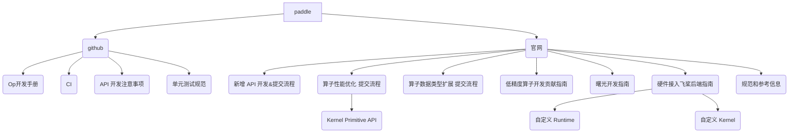

 * PyTorch

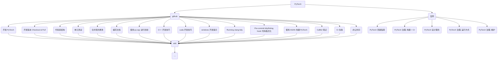

 * tensorflow

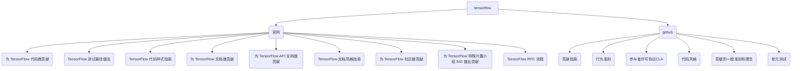

 * mindspore

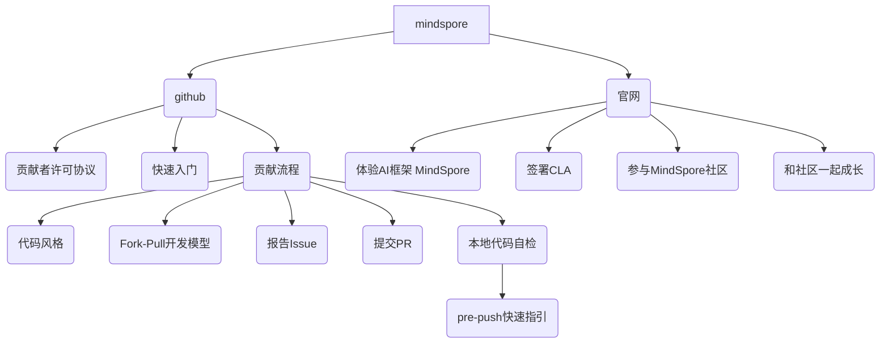

 * docker

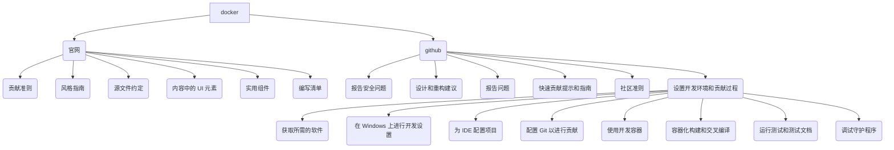

 * kubernetes

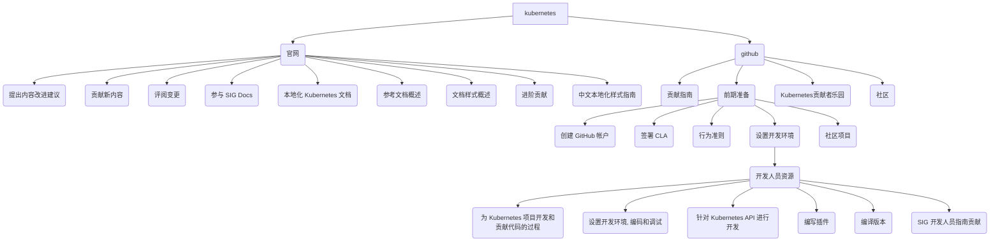

 * flutter

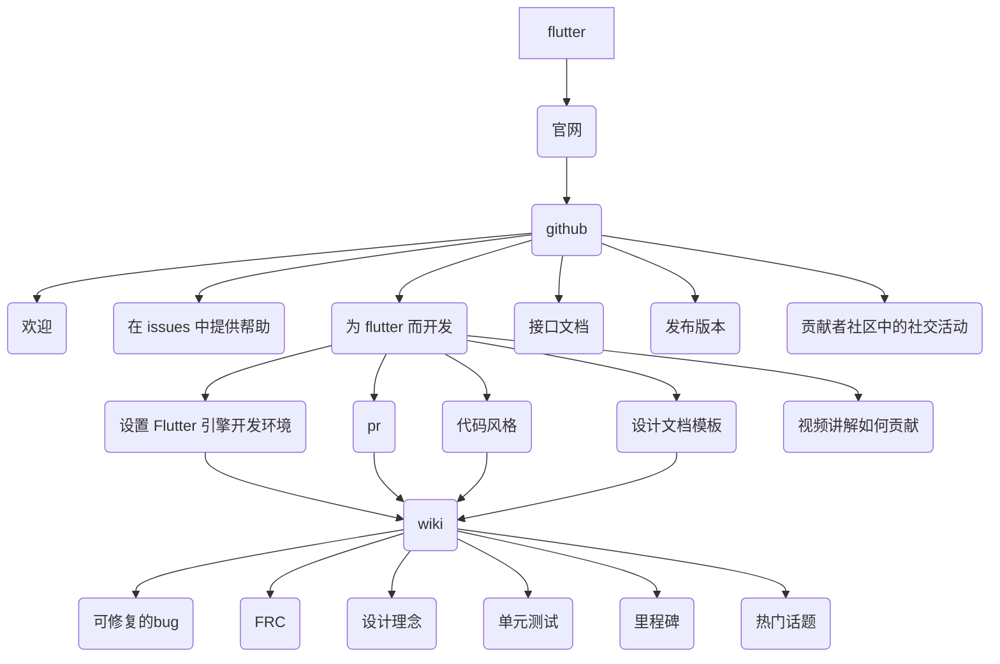

#### 小结

从上述组织图可以发现, 大多数开源项目都把文档类型的贡献放在官网, 而将核心框架代码的贡献放在 github 中.

个人看法: 可以将文档类型贡献和代码类型贡献有所区分, 这样组织可以清晰一点.

#### 以编写测试为例

这里以点击次数作为流程图

 * paddle

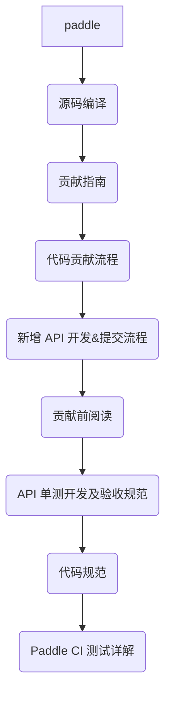

 * pytorch

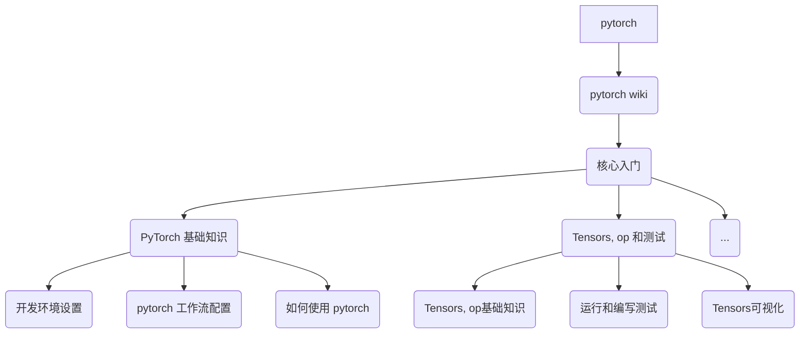

#### 小结

从组织上来看大家都是从: 环境配置 --> 贡献流程 --> 测试开发 --> 代码规范. 只是 pytorch 给的内容相对多于 paddle.

#### 添加文档

 * paddle

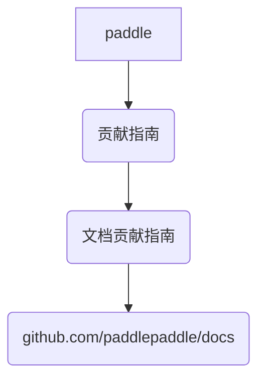

 * pytorch

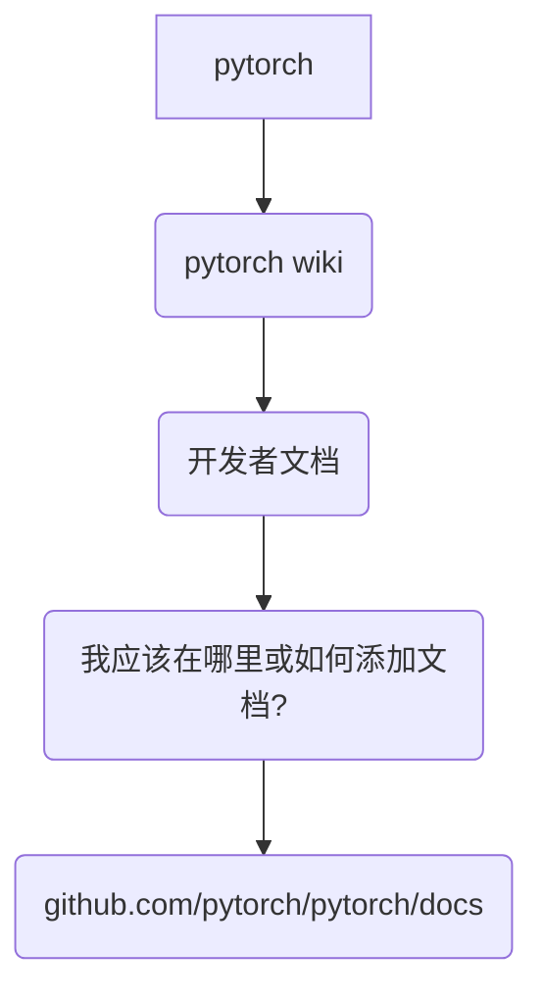

或者

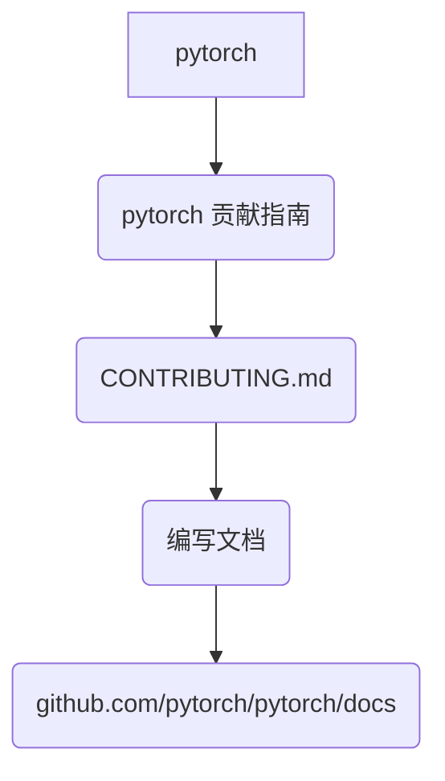

#### 小结

从组织上来看大家都是从: 贡献指南 --> 开发者文档 ( 文档贡献指南 )--> 找到最终文档位置. 从组织来看两者是一致的.

### 文档更新及时性

这个部分主要看 git History, 也会看问题的出现到问题解决的及时性.

 * Paddle

paddle 目前的更新频率大致是每月至少 2 更.

从 wiki 更新内容的及时性来看, 每月会更新上月和当月的内容.

 * pytorch

pytorch 的更新频率相对固定, 1 周至少 1 次. 对于旧的内容除了做一些修复性的工作, 几乎不会再进行更新.

 * tensorflow

tensorflow 的更新频率不是很固定, 有时候一个月4更, 有时很长时间不更新 ( 这部分应该是根据主框架内容变动做的修复工作 ).

 * mindspore

mindspore 刚打算做社区贡献文档, 所以就两次提交.

 * docker

docker 的更新频率不固定( 这部分应该是根据主框架内容变动做的修复工作 ). 

从下面两张图可以看出, 内容的更新是跟着项目的更新一起的.

 * kubernetes

kubernetes 的文档贡献部分更新频率基本为月更, 根据主框架内容变动会增加或者减少. 代码贡献部分为周更.

 * flutter

flutter 的更新频率为天更. 因为有更新问题分类报告, 所以能做到天更.

从下面两张图可以发现, flutter 在问题发现后的第二天就做了修复.

#### 小结

从更新频率来看 flutter 目前做的最好.

### 国际化

目前只有 paddle、tensorflow 和 kubernetes 在官网部分做了国际化.

 *  paddle

paddle 只有两种语言可以选择

 * tensorflow

tensorflow 有19种语言可以选择

 * mindspore

mindspore 只有两种语言可以选择

 * kubernetes

kubernetes 有13种语言可以选择

#### 小结

paddle 目前还存在的问题有: 中英文文档不同步的情况.

## 总结

从内容上看 paddle 更多的是告诉开发者这是什么, 而一些开源项目会把开发者当做刚学过语法基础的用户, 在内容上写的更加丰富更加细致. 更加细致有个好处是, 给后来者提出建议, 不至于走前人的老路. 从组织上来看除了内容少了点, 逻辑上是没啥大问题的. 从更新及时性来看, 除了一些社区活动的日程, 几乎不再做修改.

就目前 ( 2023年03月06日 ) 而言 paddle 与 pytorch、flutter 等开源项⽬在文档丰富程度还有所欠缺, 还存在文档更新不及时的问题 ( 这里指的是相同的内容更新不及时 ).

个人看法: paddle 给开发者的感觉是这些东西学一次就够了, 更像是类似于速查表或者快速备忘清单这样的东西. 而 pytorch 的感觉是多看可以学到给多底层优化的东西, 有一种不断学习的感觉 (也有可能是我比较弱). 可以试试让研发和 pfcc 来补充一些更加深入一些的内容，不再局限于算子或api，也可以是一些设计思路，哪怕是 paddle 的实验性功能或者下一个发展方向也是可以的。
