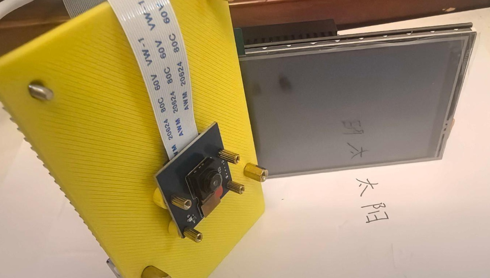

# Pi5Translator

本项目介绍在树莓派5上基于 ERNIE-4.5-0.3B 构建文字趣味解释器，你可以以这个项目作为最小DEMO，快速构造一个基于ERNIE-4.5-0.3B的硬件项目。

本项目主要包含：
- 如何在树莓派5上基于llama.cpp运行ERNIE-4.5-0.3B
- 如何使用树莓派5进行拍照文字趣味解释

> 由于树莓派5对于Python环境的管理机制不允许用户直接安装系统级别的依赖，因此需要使用虚拟环境来管理项目依赖。即您首先需要创建虚拟环境。
```bash
python -m venv venv
source venv/bin/activate
```



## 安装和部署Ernie0.3B
> 几乎所有的端侧设备都可以通过llama.cpp运行Ernie0.3B。
### 安装依赖
通过pip安装 llama-cpp-python 需要消耗较长时间，如果你的硬件设备性能较低，推荐采用 brew 或从源码安装。
```bash
pip install llama-cpp-python uvicorn anyio starlette fastapi sse_starlette starlette_context pydantic_settings
```

### 准备gguf文件
llama.cpp 需要使用 gguf 格式的模型文件，Ernie0.3B 的 gguf 模型文件可以从 [huggingface](https://huggingface.co/) 或 [魔搭社区](https://www.modelscope.cn/home) 下载。

```bash
# 从huggingface下载
pip install -U "huggingface_hub[cli]"
hf download unsloth/ERNIE-4.5-0.3B-PT-GGUF ERNIE-4.5-0.3B-PT-Q4_K_M.gguf --local-dir .

# 从魔搭社区下载
pip install -U "modelscope"
modelscope download --model unsloth/ERNIE-4.5-0.3B-PT-GGUF ERNIE-4.5-0.3B-PT-Q4_K_M.gguf --local_dir .
```

### 启动OpenAI兼容的API服务
```bash
python -m llama_cpp.server --model ERNIE-4.5-0.3B-PT-Q4_K_M.gguf --host 0.0.0.0
```

### 调用服务
可以通过OpenAI接口调用服务，首先，你需要新开一个终端，再次激活虚拟环境并安装依赖
```bash
source venv/bin/activate
pip install openai
```

执行以下代码即可调用模型
```python
import openai

server_url = "http://localhost:8000/v1"

client = openai.OpenAI(
    base_url=server_url,
    api_key="anyvalue"
)

response = client.chat.completions.create(
    model="anyvalue",
    messages=[
        {"role": "user", "content": "hi, how are you?"}
    ],
    temperature=0.7,
    max_tokens=500
)

assistant_reply = response.choices[0].message.content
print(assistant_reply)
```

## 构建翻译机
### 安装OCR工具
本项目采用 RapidOCR 作为OCR工具。RapidOCR 是基于 [PaddleOCR](https://github.com/PaddlePaddle/PaddleOCR) 的开源 OCR 工具，PaddleOCR 是百度飞桨开源的 OCR 工具库，支持多种语言的文字识别，具有高精度和高效性能。请在新的终端中激活虚拟环境并安装依赖
```bash
source venv/bin/activate
pip install rapidocr onnxruntime
```

准备一张图片用于OCR识别，命名为 `input.jpg`，放在项目根目录下。执行以下代码即可完成OCR推理

```python
from rapidocr import EngineType, LangDet, ModelType, OCRVersion, RapidOCR

engine = RapidOCR(
    params={
        "Det.engine_type": EngineType.ONNXRUNTIME,
        "Det.model_type": ModelType.MOBILE,
        "Det.ocr_version": OCRVersion.PPOCRV4
    }
)

img_url = "input.jpg"
result = engine(img_url)

print(result.txts)
```

### 封装接口
为了方便后续调用，将OCR封装为服务接口
```
# ocr_server.py
from fastapi import FastAPI, UploadFile, File, HTTPException
from fastapi.responses import JSONResponse
from rapidocr import EngineType, ModelType, OCRVersion, RapidOCR
import uvicorn
import os
from typing import List

# 初始化 OCR 引擎
ocr_engine = RapidOCR(
    params={
        "Det.engine_type": EngineType.ONNXRUNTIME,
        "Det.model_type": ModelType.MOBILE,
        "Det.ocr_version": OCRVersion.PPOCRV4,
    }
)

app = FastAPI(title="RapidOCR Service")

@app.post("/ocr")
async def ocr_service(image: UploadFile = File(...)) -> dict:
    """
    接收上传的图片，返回 OCR 识别结果（字符串列表）
    - 输入: 上传的图片文件（支持 PNG/JPG/JPEG）
    - 输出: {"result": ["识别文本1", "识别文本2", ...]}
    """
    try:
        # 检查文件类型
        if image.content_type not in ["image/png", "image/jpeg", "image/jpg"]:
            raise HTTPException(status_code=400, detail="仅支持 PNG/JPG/JPEG 格式图片")
        
        # 保存临时文件
        temp_path = f"temp_{image.filename}"
        with open(temp_path, "wb") as f:
            f.write(await image.read())
        
        # 执行 OCR
        ocr_result = ocr_engine(temp_path)
        texts = ocr_result.txts  # 获取识别文本列表
        
        # 清理临时文件
        os.remove(temp_path)
        
        return {"result": texts}
    
    except Exception as e:
        # 发生错误时删除临时文件（如果存在）
        if os.path.exists(temp_path):
            os.remove(temp_path)
        raise HTTPException(status_code=500, detail=str(e))

if __name__ == "__main__":
    uvicorn.run(app, host="0.0.0.0", port=8001, log_level="info")
```

运行下述代码以开启服务
```bash
python ocr_server.py
```

### 在Pi5调用CSI摄像头(可以更换为USB摄像头)
CSI摄像头相对于USB摄像头更加小巧，适合嵌入式应用。可以通过以下方式在树莓派5上调用CSI摄像头进行拍照。特别的，这一步需要在虚拟环境外运行，你可以新开一个窗口。

首先需要安装依赖
```bash
sudo apt install python3-picamera2
```

安装完毕后即可使用
```python
from picamera2 import Picamera2

picam2 = Picamera2()
picam2.start()  # 必须启动摄像头（即使不预览）
picam2.capture_file("test_picam2.jpg")  # 拍照
picam2.stop()  # 关闭摄像头
print("照片已保存为 test_picam2.jpg")
```

如果你不使用树莓派5或者CSI摄像头（例如你可能使用的是USB摄像头），你可以使用opencv库进行拍照
```python
import cv2

# 打开 USB 摄像头（通常设备号为 0）
cap = cv2.VideoCapture(0)

if not cap.isOpened():
    print("无法打开摄像头")
    exit()

# 捕获单帧图像
ret, frame = cap.read()
if ret:
    cv2.imwrite("usb_camera_image.jpg", frame)
    print("图像已保存")
else:
    print("捕获失败")

# 释放资源
cap.release()
```

### 构造文字趣味解释器
最后，只需要安装PyQt5，再构建页面，循环读取摄像头，当用户点击界面时，即可触发拍照和OCR识别流程。

首先，安装依赖，由于树莓派5的环境限制，需要在虚拟环境外安装PyQt5
    
```bash
sudo apt install python3-pyqt5
```

将以下代码保存为 `show.py`
```python
import sys
import requests
import numpy as np
from PyQt5.QtWidgets import (
    QApplication, QLabel, QVBoxLayout, QWidget, 
    QMessageBox
)
from PyQt5.QtGui import QImage, QPixmap
from PyQt5.QtCore import QTimer, Qt
from picamera2 import Picamera2
from io import BytesIO
from PIL import Image

class CameraApp(QWidget):
    def __init__(self):
        super().__init__()
        self.setWindowTitle("树莓派摄像头 + OCR + 文字趣味解释器")
        self.resize(800, 600)
        
        # 初始化摄像头（RGB格式）
        self.picam2 = Picamera2()
        camera_config = self.picam2.create_preview_configuration(
            main={"format": "RGB888", "size": (640, 480)}
        )
        self.picam2.configure(camera_config)
        self.picam2.start()
        
        # UI 组件
        self.label = QLabel()
        self.label.setAlignment(Qt.AlignCenter)
        
        # 布局
        layout = QVBoxLayout()
        layout.addWidget(self.label)
        self.setLayout(layout)
        
        # 定时器：实时更新摄像头画面
        self.timer = QTimer()
        self.timer.timeout.connect(self.update_frame)
        self.timer.start(30)
    
    def mousePressEvent(self, event):
        """鼠标点击事件 - 触发文字趣味解释"""
        if event.button() == Qt.LeftButton:  # 只响应左键点击
            self.capture_and_translate()
    
    def update_frame(self):
        """更新摄像头画面"""
        frame = self.picam2.capture_array()
        if frame is not None:
            h, w, ch = frame.shape
            bytes_per_line = ch * w
            qimg = QImage(frame.data, w, h, bytes_per_line, QImage.Format_RGB888)
            pixmap = QPixmap.fromImage(qimg).scaled(
                self.label.width(), self.label.height(), Qt.KeepAspectRatio
            )
            self.label.setPixmap(pixmap)
    
    def capture_and_translate(self):
        """捕获画面 → OCR识别 → 文字趣味解释"""
        try:
            # 1. 捕获画面并调用OCR服务
            frame = self.picam2.capture_array()
            pil_image = Image.fromarray(frame)
            img_buffer = BytesIO()
            pil_image.save(img_buffer, format="JPEG")
            img_buffer.seek(0)
            
            ocr_url = "http://localhost:8001/ocr"  # 假设OCR服务运行在8000端口
            ocr_response = requests.post(
                ocr_url, 
                files={"image": ("capture.jpg", img_buffer, "image/jpeg")}
            )
            
            if ocr_response.status_code != 200:
                raise Exception(f"OCR服务错误: {ocr_response.text}")
            
            ocr_text = ocr_response.json()["result"][0]  # 取第一行识别结果
            
            # 2. 调用 llama.cpp 的解释接口（OpenAI API兼容）
            translate_url = "http://localhost:8000/v1/chat/completions"  # llama.cpp的API端点
            headers = {
                "Content-Type": "application/json",
                "Authorization": "Bearer sk-dummy"  # 模拟OpenAI的API key
            }
            data = {
                "model": "ernie-4.5-0.3b",  # 使用 ERNIE-4.5-0.3B 模型
                "messages": [
                    {
                        "role": "system",
                        "content": "你是一个有趣的助手，请用有趣的方式解释以下文字的内容。"
                    },
                    {
                        "role": "user",
                        "content": f"请有趣地解释以下文字：{ocr_text}"
                    }
                ]
            }
            
            translate_response = requests.post(
                translate_url, 
                headers=headers, 
                json=data
            )
            
            if translate_response.status_code != 200:
                raise Exception(f"解释服务错误: {translate_response.text}")
            
            # 3. 解析解释结果
            translation = translate_response.json()["choices"][0]["message"]["content"]
            
            # 4. 弹窗显示原文和解释
            result_text = f"【原文】{ocr_text}\n\n【解释】{translation}"
            QMessageBox.information(self, "文字趣味解释结果", result_text)
        
        except Exception as e:
            QMessageBox.critical(self, "错误", f"处理失败: {str(e)}")
    
    def closeEvent(self, event):
        """关闭时释放资源"""
        self.timer.stop()
        self.picam2.stop()
        event.accept()

if __name__ == "__main__":
    app = QApplication(sys.argv)
    window = CameraApp()
    window.show()
    sys.exit(app.exec())
```

运行文件 `show.py`，即可启动应用程序。确保在运行之前，已经启动了 OCR 服务和 llama.cpp 服务。


运行后，将会看到摄像头画面，对准文字，点击屏幕即可触发文字趣味解释功能。

## 未来展望

本项目展示了在树莓派5上使用 ERNIE-4.5-0.3B 模型构建文字趣味解释器的可行性。作为一个最小DEMO，它为端侧AI应用提供了灵感。未来，我们可以从以下几个方面进行扩展和改进：

### 模型优化
- **参数升级**：尝试使用更大参数的 ERNIE 模型（如 ERNIE-3.5-8B 或更高），以提升文字解释的准确性和趣味性。
- **模型微调**：针对特定领域（如教育、娱乐）进行微调，使解释更加贴合用户需求。
- **量化优化**：进一步优化模型量化（如使用 GGUF Q2_K 或更低精度），以在更低功耗设备上运行。

### 功能扩展
- **多语言支持**：集成多语言 OCR 和翻译功能，支持全球用户。
- **语音交互**：添加语音识别输入和语音合成输出，实现全语音交互体验。
- **交互增强**：支持连续拍照、批量处理，或添加用户反馈机制来改进解释质量。
- **云端协同**：在网络可用时，与云端大模型协同，提升解释效果。

### 硬件适配
- **更多设备**：适配其他带有计算加速的边缘设备，以利用硬件加速（如 GPU、TPU）提升推理速度，降低延迟。

### 应用场景
- **教育工具**：用于儿童学习，帮助理解复杂文字。
- **娱乐应用**：在游戏或社交中提供趣味解释。
- **辅助工具**：帮助视障人士理解文字，或语言学习者练习阅读。
