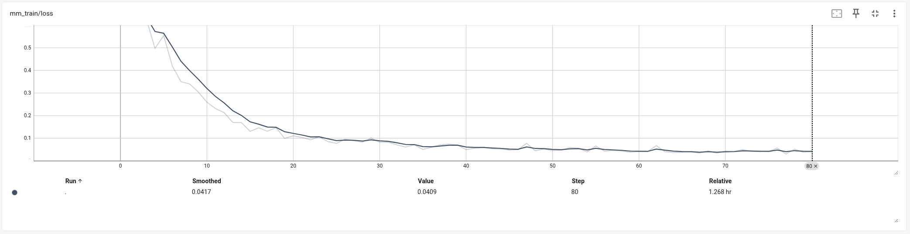

# Fine-tuning PaddleOCR-VL with New Approaches -- Prompt and Information Extraction

> AI Studio Project Address: [Fine-tuning PaddleOCR-VL with New Approaches -- Prompt and Information Extraction](https://aistudio.baidu.com/projectdetail/9857242), which can be run directly in AI Studio's A100 environment (V100 environment can only perform model inference, not fine-tuning)

## Introduction

When using PaddleOCR-VL, you would use code like the following:

```python
CHOSEN_TASK = "ocr"  # Options: 'ocr' | 'table' | 'chart' | 'formula'
PROMPTS = {
    "ocr": "OCR:",
    "table": "Table Recognition:",
    "formula": "Formula Recognition:",
    "chart": "Chart Recognition:",
}
```

Therefore, PaddleOCR-VL can recognize text, formulas, tables, and chart elements.

PaddleOCR-VL, as a Vision-Language Model (VLM) specifically designed for document understanding, accomplishes different tasks through `prompts`.

Currently, the fine-tuning of PaddleOCR-VL [PaddleOCR-VL-0.9B SFT](https://github.com/PaddlePaddle/ERNIE/blob/release/v1.4/docs/paddleocr_vl_sft_zh.md) also revolves around these four types of tasks.

This article starts with fine-tuning the `prompts` of PaddleOCR-VL and introduces how to use fine-tuned PaddleOCR-VL for `information extraction`.

### Fine-tuning Results Comparison

Here's an example of recognizing and extracting information from an invoice:

**Before Fine-tuning**

```json

{
    "res": {
        "input_path": "/home/aistudio/paddleocr_vl/data/test.jpg",
        "page_index": None,
        "model_settings": {
            "use_doc_preprocessor": False,
            "use_layout_detection": False,
            "use_chart_recognition": False,
            "format_block_content": False
        },
        "parsing_res_list": [{
            "block_label": "OCR:",
            "block_content": "购买方信息 | 名称 | 中青旅联科 | 杭州 | 公关顾问有限公司 | 销售方信息 | 名称 | 杭州万力酒店管理有限公司 | 统一社会信用代码/纳税人识别号 | 纳税人识别号 | 统一社会信用代码/纳税人识别号 | 税额 | 税额/征收率 | 税额/征收率\n**项目名称** | 规格型号 |   |   |   |   |   |   |   |   |   |   |   |  \n**住宿服务** | 住宿费 |   |   |   |   |   |   |   |   |   |   |   |  \n**合计** |   |   |   |   |   |   |   |   |   |   |   |   |  \n**价税合计（大写）** |   | 壹仟叁佰玖拾柒圆整 |   |   |   |   |   |   |   |   |   |   |  \n备注 | 销售方地址：浙江省杭州市西湖区转塘街道霞鸣街199号万美商务中心3号楼；电话：0571-85220222；销方开户银行：农行上泗支行；入住人：柳顺；入住日期：9月23日入住-9月26日退房；入住天数：3天；金额：1397元 |   |   |   |   |   |   |   |   |   |   |   |   |  \n开票人：祝营营",
            "block_bbox": [0, 0, 1260, 838]
        }]
    }
}

```

**After Fine-tuning**

```json
{
    "res": {
        "input_path": "/home/aistudio/paddleocr_vl/data/test.jpg",
        "page_index": None,
        "model_settings": {
            "use_doc_preprocessor": False,
            "use_layout_detection": False,
            "use_chart_recognition": False,
            "format_block_content": False
        },
        "parsing_res_list": [{
            "block_label": "OCR:{}",
            "block_content": "{"发票信息": {"发票名称": "电子发票", "发票号码": "25332000000426443187", "开票日期": "2025年09月26日"}, "销售方信息": {"名称": "杭州万力酒店管理有限公司", "统一社会信用代码": "91330105MA2H2DUJ92", "纳税人识别号": "91330106MA2B1C4UXN"}, "项目名称": "规格型号", "单位": "个", "数量": "3 461.056105610561", "单价": "1383.17", "金额": "税率/征收率", "税额": "13.83"}, "合计": {"金额": "1383.17", "税额": "13.83"}, "价税合计（大写）": "壹仟叁佰玖拾柒圆整", "价税合计（小写）": "1397.00"}, "销售方地址": "浙江省杭州市西湖区转塘街道霞鸣街199号万美商务中心3号楼", "电话": "0571-85220222", "销方开户银行": "农行上泗支行", "入住人": "柳顺", "入住日期": "9月23日 入住-9月26日 退房", "入住天数": "3天", "金额": "1397元"},",
            "block_bbox": [0, 0, 1260, 838]
        }]
    }
}

```

Or specify fields to extract specific information:

``` json
{
    "res": {
        "input_path": "/home/aistudio/paddleocr_vl/data/test.jpg",
        "page_index": None,
        "model_settings": {
            "use_doc_preprocessor": False,
            "use_layout_detection": False,
            "use_chart_recognition": False,
            "format_block_content": False
        },
        "parsing_res_list": [{
            "block_label": "OCR:{"发票号码": "", "开票日期": ""}",
            "block_content": "{"发票号码": "25332000000426443187", "开票日期": "2025年09月26日"}",
            "block_bbox": [0, 0, 1260, 838]
        }]
    }
}

```

After fine-tuning, it can output data in `JSON` format and can output corresponding information based on different `prompts` (here `block_label`).

> Due to the small amount of data used in this fine-tuning, the fine-tuning results are not very good. This is for reference only.

Regarding the fine-tuning of PaddleOCR-VL, [PaddleOCR-VL-0.9B SFT](https://github.com/PaddlePaddle/ERNIE/blob/release/v1.4/docs/paddleocr_vl_sft_zh.md) already has a very detailed introduction. Since this article's fine-tuning targets `prompts`, the following two parts are slightly different from the original text:

- Data preparation
- Model inference

## Data Preparation

### 1. Dataset

There are many application scenarios for information extraction. Here, we use [VAT Ordinary Invoice](https://aistudio.baidu.com/datasetdetail/125158) data as an example.

> You can refer to the article [Invoice Key Information Extraction Based on VI-LayoutXLM](https://bbs.huaweicloud.com/blogs/383854), which provides a relatively complete explanation of fine-tuning PaddleOCR models for information extraction.

However, the dataset's annotation for `Relation Extraction` is quite crude. For example:


Here only `名称` (Name) is annotated, without specifying whether it's `购买方名称` (Buyer Name) or `销售方名称` (Seller Name).

As mentioned earlier, we can use PaddleOCR-VL as a VLM model. Therefore, we can let a more capable VLM model `teach` PaddleOCR-VL to recognize `购买方名称` (Buyer Name) and `销售方名称` (Seller Name).

Data can be generated through the `ernie-4.5-turbo-vl-preview` model, referring to the script `paddleocr_vl/tools/extract_ner/extract_ner.py`.

``` python

#!/usr/bin/env python3
# -*- coding: utf-8 -*-
"""
Multimodal Image Recognition Script
Recognizes image information by calling OpenAI API and returns JSON format data
Supports local images and multimodal large model processing
"""
...

class MultimodalImageRecognizer:
    """Multimodal Image Recognizer"""
    ...

    def recognize_image(
        self,
        image_input: Union[str, bytes],
        prompt: str,
        system_prompt: str,
        max_tokens: int = 2048
    ) -> Dict[str, Any]:
        """
        Recognize image information

        Args:
            image_input: Image path, URL, or base64 encoding
            prompt: User prompt
            system_prompt: System prompt
            max_tokens: Maximum number of tokens

        Returns:
            JSON format data of recognition results
        """
        try:
            # Create multimodal message
            content = self.create_multimodal_message(prompt, image_input)

            # Build message list
            messages = [
                {"role": "system", "content": system_prompt},
                {"role": "user", "content": content}
            ]

            logger.info(f"Starting API call to recognize image, model: {self.model}")

            # Call API
            response = self.client.chat.completions.create(
                model=self.model,
                messages=messages,
                max_tokens=max_tokens,
                temperature=0.2
            )

    ...

    def analyze_image(
        self,
        image_input: Union[str, bytes],
        analysis_type: str = "document"
    ) -> Dict[str, Any]:
        """
        Analyze image content (simplified version)

        Args:
            image_input: Image path, URL, or base64 encoding
            analysis_type: Analysis type, fixed as "document"

        Returns:
            JSON format data of analysis results
        """
        # Use document analysis prompt uniformly
        prompt = "请分析这张文档图片中的所有信息，并返回完整的JSON格式数据。如果有的字段没有值，那么保留此字段，值为空。注意：所有的值都以string的形式返回，不要使用数字类型等。"
        system_prompt = '''
你是一个专业的文档分析助手，能够准确分析文档内容并返回结构化的JSON数据。

注意：数据的语言与文档的语言保持一致。
注意：需要保留完整的字段层级关系，不要把所有字段都放到一级字段中。
注意：JSON数据中不要包含注释，也不需要任何解释或说明。
注意：对于特殊字符需要进行转义。

注意：对于选项字段，只保留所选择的字段值，如果没有选择，则置为空。
比如，`业务类型` 包括 `账户开户、账户登记` 等选项，文档中`账户登记`是选中状态，则，返回 `{"业务类型"："账户登记"}`，不返回`账户开户`等其他选项。
再比如，`业务类型` 包括 `账户开户、账户登记` 等选项，文档中没有标记选中的选项，则，返回 `{"业务类型"：""}`，也就是说，只保留键，不需要有值。
...
'''

        return self.recognize_image(
            image_input=image_input,
            prompt=prompt,
            system_prompt=system_prompt
        )

...
```

Use the `paddleocr_vl/tools/extract_ner/batch_extract_ner.py` script to batch generate data. The final generated data is as follows:

``` json

{
  "image": "/media/shun/bigdata/Dataset/增值税普通发票/zzsptfp/b0.jpg",
  "data": {
    "发票名称": "广东增值税专用发票",
    "发票编号": "12271524",
    "发票代码": "4400154130",
    "开票日期": "2016年06月12日",
    "购买方": {
      "名称": "深圳市购机汇网络有限公司",
      "纳税人识别号": "440300083885931",
      "地址、电话": "深圳市龙华新区民治街道民治大道展滔科技大厦A12070755-23806606",
      "开户行及账号": "中国工商银行股份有限公司深圳园岭支行4000024709200172809"
    },
    "密码区": "<<1<//3*26-++936-9<9*575>39 -<5//81>84974<00+7>2*0*53-+ +125*++9+-///5-7+/-0>8<9815 5<3/8*+//81/84+>6>4*36>4538",
    "货物或应税劳务、服务名称": [
      {
        "名称": "小米 红米3 全网通版 时尚金色",
        "规格型号": "红米3",
        "单位": "个",
        "数量": "5",
        "单价": "597.43589744",
        "金额": "2987.18",
        "税率": "17%",
        "税额": "507.82"
      },
      {
        "名称": "移动联通电信4G手机 双卡双待",
        "规格型号": "",
        "单位": "",
        "数量": "",
        "单价": "",
        "金额": "",
        "税率": "",
        "税额": ""
      }
    ],
    "合计": {
      "金额": "￥2987.18",
      "税额": "￥507.82"
    },
    "价税合计（大写）": "叁仟肆佰玖拾伍圆整",
    "价税合计（小写）": "￥3495.00",
    "销售方": {
      "名称": "广州晶东贸易有限公司",
      "纳税人识别号": "91440101664041243T",
      "地址、电话": "广州市黄埔区九龙镇九龙工业园凤凰三横路99号 66215500",
      "开户行及账号": "工行北京路支行3602000919200384952"
    },
    "备注": "dd42982413947(00001,1952)7996有限",
    "收款人": "王梅",
    "复核": "张雪",
    "开票人": "陈秋燕",
    "销售方（章）": "广州晶东贸易有限公司 发票专用章"
  }
}

```

The data information generated here is much richer than the original annotation information. Although there are some flaws (for example, `货物或应税劳务、服务名称` should only have one record), it does not hinder the fine-tuning experiment.

> The processed data has been uploaded to [VAT Ordinary Invoice and JSON Format Information](https://aistudio.baidu.com/dataset/detail/363136/intro).

### 2. Prompts

The goal of the `information extraction` task here is:

- The model can output complete information in `JSON` format
- The model can output corresponding `JSON` format information based on different input fields

For the above goals, corresponding prompts are designed here:

**Complete Information**

```
"OCR:{}"
```

**Specific Information**

```
# Specific value is a string, such as `{"发票编码":"123456"}`
"OCR:{\"xxx\":\"\"}"

# Specific value is a dictionary, such as `{"购买方":{"名称":"A公司"}}`
"OCR:{\"xxx\":{}}"

# Specific value is a list, such as `{"货物或应税劳务、服务名称":[{"名称":"A产品"},{"名称":"B产品"}]}`
"OCR:{\"xxx\":[]}"
```

You can use `paddleocr_vl/tools/process_ner_dataset.py` to generate complete training data, including randomly generated prompts:

```bash
python paddleocr_vl/tools/process_ner_dataset.py paddleocr_vl/data/zzsptfp \
  -o paddleocr_vl/output.jsonl \
  -n 10 \
  -p /media/shun/bigdata/Dataset/增值税普通发票 \
  -u /home/aistudio/paddleocr_vl/data/zzsptfp
```

Then, split the training dataset and validation dataset:

```bash
python paddleocr_vl/tools/split_jsonl.py paddleocr_vl/output.jsonl \
  paddleocr_vl/output \
  --train_ratio 0.9 \
  --seed 123
```

The final generated data is as follows:

```json
{
    "image_info": [
        {
            "matched_text_index": 0,
            "image_url": "/home/aistudio/paddleocr_vl/data/zzsptfp/zzsptfp/b175.jpg"
        }
    ],
    "text_info": [
        {
            "text": "OCR:{\"发票名称\": \"\"}",
            "tag": "mask"
        },
        {
            "text": "{\"发票名称\": \"广东增值税专用发票\"}",
            "tag": "no_mask"
        }
    ]
}
```

The differences between the generated training data and [PaddleOCR-VL-0.9B SFT](https://github.com/PaddlePaddle/ERNIE/blob/release/v1.4/docs/paddleocr_vl_sft_zh.md) are:

- The `text` of `mask` is not just `OCR:`, but also includes the field information to be extracted later
- The `text` of `no_mask` is complete `JSON` format information, not a plain text

> Note, some articles mention `Completion-Only Training` when fine-tuning PaddleOCR-VL, which means only caring about the `completion` information (the `no_mask` part) without changing the `prompt` (the `mask` part). However, this article requires `Full-Sequence Training`, and the focus is on fine-tuning the `prompt`, requiring the `completion` to change generation behavior according to the `prompt`.
>
> Additionally, due to the parameter limitations of the PaddleOCR-VL-0.9B model, we won't add explanatory text when modifying the `prompt`.

## Model Fine-tuning

The fine-tuning process is similar to this. First, install ERNIE:

```bash
cd paddleocr_vl
git clone https://gitee.com/PaddlePaddle/ERNIE -b release/v1.4
cd ERNIE
python -m pip install -r requirements/gpu/requirements.txt
python -m pip install -e .
python -m pip install tensorboard
python -m pip install opencv-python-headless
python -m pip install numpy==1.26.4
```

Then, modify the configuration file and copy it to overwrite the original configuration file:

```bash
cp paddleocr_vl/sft_config/run_ocr_vl_sft_16k.yaml \
  paddleocr_vl/ERNIE/examples/configs/PaddleOCR-VL/sft/run_ocr_vl_sft_16k.yaml
```

Download the PaddleOCR-VL model, here using modelscope's SDK:

```bash
pip install modelscope
```

```python
from modelscope import snapshot_download
model_dir = snapshot_download('PaddlePaddle/PaddleOCR-VL', local_dir='paddleocr_vl/paddleocr_vl_model')
```

Finally, execute the fine-tuning command. Fine-tuning in AI Studio's A100 environment takes less than 1.5 hours.

> V100 environment cannot perform fine-tuning but can perform model inference

```bash
cd paddleocr_vl/ERNIE; CUDA_VISIBLE_DEVICES=0 \
 erniekit train examples/configs/PaddleOCR-VL/sft/run_ocr_vl_sft_16k.yaml
```

Here are the training logs:



As you can see, `loss` is steadily decreasing, indicating that the fine-tuning should be effective.

### Configuration File Example

```yaml
### data
train_dataset_type: "erniekit"
eval_dataset_type: "erniekit"
train_dataset_path: "/home/aistudio/paddleocr_vl/output_train.jsonl"
train_dataset_prob: "1.0"
eval_dataset_path: "/home/aistudio/paddleocr_vl/output_val.jsonl"
eval_dataset_prob: "1.0"
max_seq_len: 16384
num_samples_each_epoch: 6000000
use_pic_id: False
sft_replace_ids: True
sft_image_normalize: True
sft_image_rescale: True
image_dtype: "float32"

### model
model_name_or_path: "/home/aistudio/paddleocr_vl/paddleocr_vl_model"
fine_tuning: Full
multimodal: True
use_flash_attention: True
use_sparse_flash_attn: True

### finetuning
# base
stage: OCR-VL-SFT
seed: 23
do_train: True
# do_eval: True
distributed_dataloader: False
dataloader_num_workers: 8
prefetch_factor: 10
batch_size: 1
packing_size: 8
packing: True
padding: False
num_train_epochs: 2
max_steps: 80
# eval_batch_size: 1
# eval_iters: 50
# eval_steps: 100
# evaluation_strategy: steps
save_steps: 20
save_total_limit: 5
save_strategy: steps
logging_steps: 1
release_grads: True
gradient_accumulation_steps: 8
logging_dir: /home/aistudio/paddleocr_vl/PaddleOCR-VL-SFT/tensorboard_logs/
output_dir: /home/aistudio/paddleocr_vl/PaddleOCR-VL-SFT
disable_tqdm: True

# train
warmup_steps: 1
learning_rate: 5.0e-6
lr_scheduler_type: cosine
min_lr: 5.0e-7
layerwise_lr_decay_bound: 1.0
from_scratch: 0

# optimizer
weight_decay: 0.1
adam_epsilon: 1.0e-8
adam_beta1: 0.9
adam_beta2: 0.95

# performance
tensor_parallel_degree: 1
pipeline_parallel_degree: 1
sharding_parallel_degree: 1
sharding: stage1
sequence_parallel: False
pipeline_parallel_config: enable_delay_scale_loss enable_release_grads disable_partial_send_recv
recompute: True
recompute_granularity: "full"
recompute_use_reentrant: True
compute_type: bf16
fp16_opt_level: O2
disable_ckpt_quant: True
# amp_master_grad: True
amp_custom_white_list:
  - lookup_table
  - lookup_table_v2
  - flash_attn
  - matmul
  - matmul_v2
  - fused_gemm_epilogue
amp_custom_black_list:
  - reduce_sum
  - softmax_with_cross_entropy
  - c_softmax_with_cross_entropy
  - elementwise_div
  - sin
  - cos
unified_checkpoint: True
# unified_checkpoint_config: async_save
convert_from_hf: True
save_to_hf: True
```

## Model Inference

After fine-tuning is completed, you can use the fine-tuned model for inference. The model can:

1. Output complete information in `JSON` format
2. Output corresponding `JSON` format information based on different input fields

This provides a flexible interface for information extraction tasks.

Follow [PaddleOCR-VL-0.9B SFT](https://github.com/PaddlePaddle/ERNIE/blob/release/v1.4/docs/paddleocr_vl_sft_zh.md) for inference. First, you need to install the necessary environment

```bash
python -m pip install -U "paddleocr[doc-parser]"
python -m pip install https://paddle-whl.bj.bcebos.com/nightly/cu126/safetensors/safetensors-0.6.2.dev0-cp38-abi3-linux_x86_64.whl
python -m pip install --force-reinstall opencv-python-headless
python -m pip install numpy==1.26.4
```

At this point, you still cannot directly perform model inference because, in PaddleX, which PaddleOCR depends on, PaddleOCR-VL currently only supports these four types of `prompt_label`: `['ocr', 'formula', 'table', 'chart']`, and our `prompt` obviously cannot pass the code validation:

Refer to the `paddlex/inference/pipelines/paddleocr_vl/pipeline.py` file

``` python
assert prompt_label.lower() in [
    "ocr",
    "formula",
    "table",
    "chart",
], f"Layout detection is disabled (use_layout_detection=False). 'prompt_label' must be one of ['ocr', 'formula', 'table', 'chart'], but got '{prompt_label}'."

```

Here is a patch script that can bypass the above restriction:

```bash
python paddleocr_vl/patch/patch_assert_to_warning.py
```

Then, copy the following files to the PaddleOCR-VL-SFT directory, and you can happily perform inference verification.

```bash
cp paddleocr_vl/paddleocr_vl_model/chat_template.jinja paddleocr_vl/PaddleOCR-VL-SFT
cp paddleocr_vl/paddleocr_vl_model/inference.yml paddleocr_vl/PaddleOCR-VL-SFT
```

Here, a new invoice data is used to verify the model.

```bash
python -m paddleocr doc_parser -i paddleocr_vl/data/test.jpg \
    --vl_rec_model_name "PaddleOCR-VL-0.9B" \
    --vl_rec_model_dir "paddleocr_vl/PaddleOCR-VL-SFT" \
    --save_path="paddleocr_vl/PaddleOCR-VL-SFT_response" \
    --use_layout_detection=False \
    --prompt_label="OCR:{}"
```

Output complete information:

```text
{'res': {'input_path': '/home/aistudio/paddleocr_vl/data/test.jpg', 'page_index': None, 'model_settings': {'use_doc_preprocessor': False, 'use_layout_detection': False, 'use_chart_recognition': False, 'format_block_content': False}, 'parsing_res_list': [{'block_label': 'OCR:{}', 'block_content': '{"发票信息": {"发票名称": "电子发票", "发票号码": "25332000000426443187", "开票日期": "2025年09月26日"}, "销售方信息": {"名称": "杭州万力酒店管理有限公司", "统一社会信用代码": "91330105MA2H2DUJ92", "纳税人识别号": "91330106MA2B1C4UXN"}, "项目名称": "规格型号", "单位": "个", "数量": "3 461.056105610561", "单价": "1383.17", "金额": "税率/征收率", "税额": "13.83"}, "合计": {"金额": "1383.17", "税额": "13.83"}, "价税合计（大写）": "壹仟叁佰玖拾柒圆整", "价税合计（小写）": "1397.00"}, "销售方地址": "浙江省杭州市西湖区转塘街道霞鸣街199号万美商务中心3号楼", "电话": "0571-85220222", "销方开户银行": "农行上泗支行", "入住人": "柳顺", "入住日期": "9月23日 入住-9月26日 退房", "入住天数": "3天", "金额": "1397元"},', 'block_bbox': [0, 0, 1260, 838]}]}}
```

Note two points:

- `use_layout_detection=False`, not through the layout model, but directly sending the image to `PaddleOCR-VL-0.9B`
- `prompt_label="OCR:{}"`, here we use our fine-tuned `prompt`, hoping the model outputs complete json format information

> Note, the data finally output by the model is actually incomplete, for example, missing `购买方` (Buyer) information, which should be caused by the small amount of fine-tuning data.

Now let's look at the model before fine-tuning, which can only output table-style data:

```bash
python -m paddleocr doc_parser -i /home/aistudio/paddleocr_vl/data/test.jpg \
    --vl_rec_model_name "PaddleOCR-VL-0.9B" \
    --vl_rec_model_dir "/home/aistudio/paddleocr_vl/paddleocr_vl_model" \
    --save_path="/home/aistudio/paddleocr_vl/paddleocr_vl_model_response" \
    --use_layout_detection=False \
    --prompt_label="OCR:"
```

Output:

```text
{'res': {'input_path': '/home/aistudio/paddleocr_vl/data/test.jpg', 'page_index': None, 'model_settings': {'use_doc_preprocessor': False, 'use_layout_detection': False, 'use_chart_recognition': False, 'format_block_content': False}, 'parsing_res_list': [{'block_label': 'OCR:', 'block_content': '购买方信息 | 名称 | 中青旅联科 | 杭州 | 公关顾问有限公司 | 销售方信息 | 名称 | 杭州万力酒店管理有限公司 | 统一社会信用代码/纳税人识别号 | 纳税人识别号 | 统一社会信用代码/纳税人识别号 | 税额 | 税额/征收率 | 税额/征收率\n**项目名称** | 规格型号 |   |   |   |   |   |   |   |   |   |   |   |  \n**住宿服务** | 住宿费 |   |   |   |   |   |   |   |   |   |   |   |  \n**合计** |   |   |   |   |   |   |   |   |   |   |   |   |  \n**价税合计（大写）** |   | 壹仟叁佰玖拾柒圆整 |   |   |   |   |   |   |   |   |   |   |  \n备注 | 销售方地址：浙江省杭州市西湖区转塘街道霞鸣街199号万美商务中心3号楼；电话：0571-85220222；销方开户银行：农行上泗支行；入住人：柳顺；入住日期：9月23日入住-9月26日退房；入住天数：3天；金额：1397元 |   |   |   |   |   |   |   |   |   |   |   |   |  \n开票人：祝营营', 'block_bbox': [0, 0, 1260, 838]}]}}

```

Then, let's test extracting only partial information:

```bash
python -m paddleocr doc_parser -i /home/aistudio/paddleocr_vl/data/test.jpg \
    --vl_rec_model_name "PaddleOCR-VL-0.9B" \
    --vl_rec_model_dir "/home/aistudio/paddleocr_vl/PaddleOCR-VL-SFT" \
    --save_path="/home/aistudio/paddleocr_vl/PaddleOCR-VL-SFT_response" \
    --use_layout_detection=False \
    --prompt_label="OCR:{\"购买方名称\": {}, \"销售方名称\": {}}"
```

Output:

```text
{'res': {'input_path': '/home/aistudio/paddleocr_vl/data/test.jpg', 'page_index': None, 'model_settings': {'use_doc_preprocessor': False, 'use_layout_detection': False, 'use_chart_recognition': False, 'format_block_content': False}, 'parsing_res_list': [{'block_label': 'OCR:{"购买方名称": {}, "销售方名称": {}}', 'block_content': '{"购买方名称": {"名称": "中青旅联科（杭州）公关顾问有限公司", "统一社会信用代码": "91330105MA2H2DUJ92"}, "销售方名称": {"名称": "杭州万力酒店管理有限公司", "统一社会信用代码": "91330106MA2B1C4UXN"}}', 'block_bbox': [0, 0, 1260, 838]}]}}
```

As you can see, the model can basically follow our instructions to extract corresponding information.

## Summary

This article introduces how to implement information extraction tasks by fine-tuning the prompts of PaddleOCR-VL. The main methods include:

1. **Data Preparation**: Using VLM models to generate structured training data, which is more efficient compared to traditional annotation methods.
2. **Prompt Design**: Through carefully designed prompt templates, the model can flexibly output `JSON` format information for different fields.
3. **Model Fine-tuning**: Utilizing PaddleOCR-VL's fine-tuning capability to make it learn to generate corresponding outputs based on different prompts.

Compared to traditional information extraction methods (such as NER + relation extraction), this method has better integration and flexibility.
