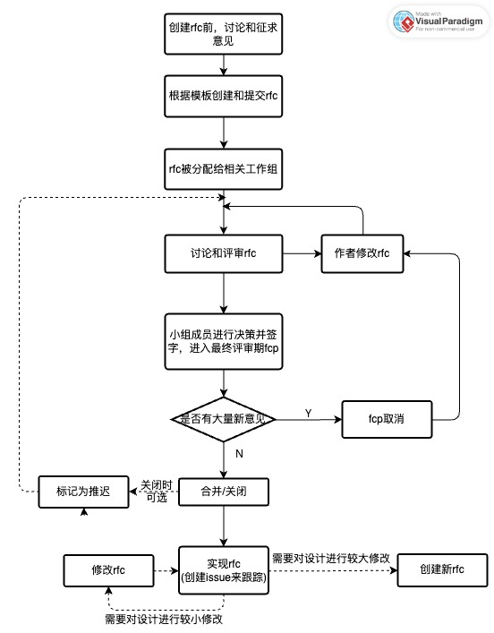
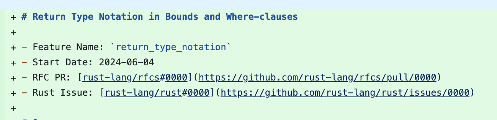
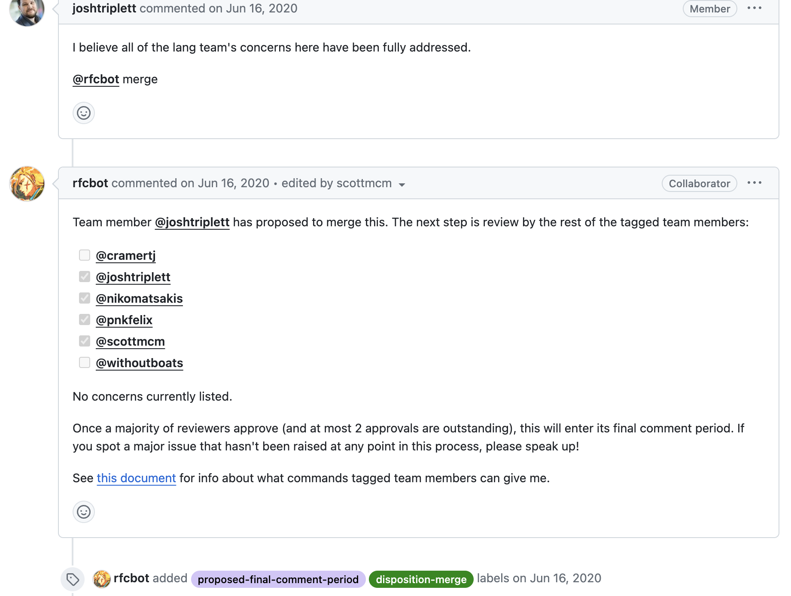
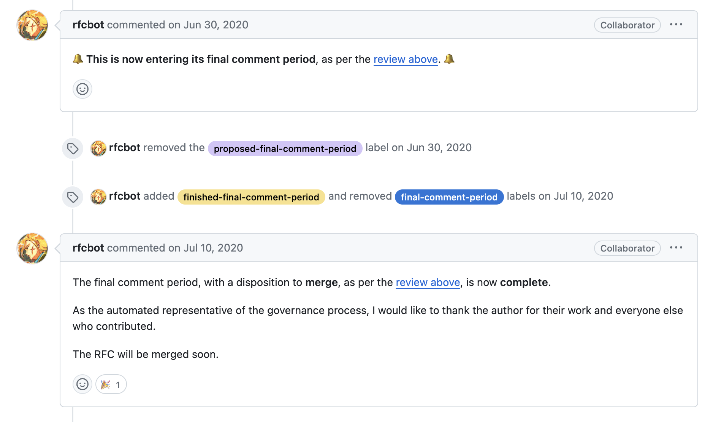

## Rust RFC 机制调研

### 什么是rfc

bugfix和文档修改可以通过正常的pr进行。但有些修改是“实质性的”(substantial)，需要进行正式的设计过程，在Rust 社区和[子团队](https://www.rust-lang.org/team.html)间达成共识。[“RFC” (request for comments)](https://rust-lang.github.io/rfcs/) 流程为这些更改提供了一致且受控的流程，以便所有利益相关者都能对项目的方向充满信心。

### 需要遵循rfc流程的更改

需要遵循该流程的修改：

- 对语言进行的任何语义或句法更改并非错误修复。
- 删除语言功能，包括feature-gated的功能。
- 编译器和库之间的接口发生更改，包括 lang 项和内在函数。
- 对std库的添加
- 此外，对治理章程的提案也遵循了rfc流程，如建立rust项目组的提议[rfc2856](https://github.com/rust-lang/rfcs/pull/2856)。

不需要rfc流程的：

- 改写、重组、重构或其他“改变形式不改变含义”的修改。
- 严格提升客观、数值质量标准的改进（如移除警告、加速、覆盖更多平台、增加并行度、捕捉更多错误等）【像是性能更改？】
- 添加的内容Rust 用户则看不到，只有 Rust 开发人员可能注意到。

现有待定rfc（open状态）列表：[rfcbot](https://rfcbot.rs/)

### RFC流程

将 RFC 作为md文件合并到 RFC repo中→可能会以最终纳入 Rust 的目标来实现。以下拿已经merge的[2856](https://github.com/rust-lang/rfcs/pull/2856)（治理相关）[2867](https://github.com/rust-lang/rfcs/pull/2867)（功能相关）和open状态的[3654](https://github.com/rust-lang/rfcs/pull/3654)当例子。

- 创建rfc前的准备

  仓促提出的 RFC 可能会降低其被接受的机会。低质量的提案、先前被拒绝的功能的提案或不符合近期路线图的提案可能会很快被拒绝，这可能会降低毫无准备的贡献者的积极性。

  最好事先寻求其他项目开发人员的反馈，以确定 RFC 是否合适，建立共识。如在官方 Zulip 服务器、开发人员讨论论坛上讨论，以及偶尔在开发人员论坛上发布“pre-RFC”。您可以在此存储库上提交issue以供讨论，但团队不会积极关注issue。

  根据经验，从长期项目开发人员（尤其是相关[sub-team](https://www.rust-lang.org/team.html)的成员）收到令人鼓舞的反馈是一个很好的迹象，表明 RFC 值得追求。

- 填写和提交rfc文档

  Fork  [RFC repo](https://github.com/rust-lang/rfcs)，Copy `0000-template.md` to `text/0000-my-feature.md`

  填写RFC. 细节：没有提出令人信服的动机、缺乏对设计影响的理解或对缺点或替代方案不诚实的 RFC 往往不会被接受。

  提交pr，提交后根据pr编号重新命名md文档，并更新md最上面指向pr的链接。【但是3654等不少pr都没改】

  

- 评审

  - pr被label上最相关的[sub-team](https://www.rust-lang.org/team.html)，未来由它triage和assign给成员
  - 建立共识并整合反馈。相比那些没有收到任何评论的RFC，得到广泛支持的RFC更有可能取得进展。可以随时联系RFC的负责人，寻求帮助以识别相关利益方和潜在障碍。
  - sub-team尽量在pr评论中讨论，如果线下讨论，需要在评论中总结
  - 在这个过程中RFCs极大可能会修改，尤其是替代方案和缺点已经写出来的情况下。可以对rfc进行修改、clarify等，修改后需要写评论解释修改。不要squash or rebase commits。

- 接受与合并

  - 在某个时候，子团队成员将提出“最终评论期”（motion for final comment period，FCP）的动议，并附上对RFC的处置建议（合并、关闭或推迟）。

    - 当已经讨论了足够多的权衡并且子团队能够做出决定时，就会采取此步骤。这不需要 RFC 线程中的所有参与者达成共识（这通常是不可能的）。然而，支持 RFC 处置的论点需要已经明确阐明，并且小组之外不应有强烈的反对意见。子团队成员在采取这一步骤时会运用他们的最佳判断，并且 FCP 本身会确保利益相关者有充足的时间和通知，以便在过早做出的情况下进行推迟。

    - 对于进行长时间讨论的 RFC，在向 FCP 提出动议之前通常会附上一份摘要评论，试图列出讨论的当前状态以及主要的权衡/分歧点。

    - 在真正进入FCP之前，小组的所有成员必须签字同意；这通常是许多子团队成员首先全面深入审查 RFC 的时刻。

      

  - FCP 持续十个日历日，因此开放时间至少为 5 个工作日。它也被广泛宣传e.g. in [This Week in Rust](https://this-week-in-rust.org/)。这样，所有利益相关者都有机会在做出决定之前提出任何最终反对意见。

  - 大多数情况下，FCP 时期很平静，RFC 要么合并，要么关闭。然而，有时会提出大量新的论点或想法，FCP 会被取消，RFC 会回到开发模式。

    

- rfc实现

  一旦 RFC 变得“active”，作者就可以实现它，并将该功能作为pr提交到 Rust repo。但不意味着该功能最终会被合并，只是说原则上所有主要利益相关者都同意该功能并愿意合并它。

  此外，一个RFC被接受并处于“活跃”状态，并不意味着其实现被赋予了什么优先级，也不意味着已经有Rust开发者被指派去实现该功能；rfc作者也没义务一定要实现它，但鼓励作者自己实现去。

  rfc后续可以修改。但一般RFC接受后不应该进行实质性改变，只能做小更改。更实质性的变化应该是新的 RFC，并在原始 RFC 中添加注释。到底什么算作“非常小的改变”由子团队决定，见 [Sub-team specific guidelines](https://rust-lang.github.io/rfcs/#sub-team-specific-guidelines)。

  每个merged rfc会有一个issue来跟踪其在rust中的实现，这个issue可以通过团队在Rust代码库中对所有问题使用的triage过程来分配优先级。如2867对应的issue [74727](https://github.com/rust-lang/rust/issues/74727)跟踪了实现、rfc文档修改、功能稳定化（这里没打钩但在相关[pr](https://github.com/rust-lang/rust/pull/102458)实现了）、未解决的问题。

  关于实现，如果不清楚是否有人在实现，可以敲团队询问。

- 其他：rfc Postponement

  有些rfc在被拒绝时会标一个postponed标签，表示现在不想处理，但未来可能再考虑，未来某一天可能会重新打开。这个没有任何正式的流程，需要询问相关子团队的成员。

  通常，标记为“推迟”的 RFC pr已经通过了非正式的第一轮评估，即“们是否认为我们可能会考虑按照RFC拉取请求中概述的方式，或其某种半明显的变体，进行此更改。”（如果答案是否，那么适当的回应是关闭RFC，而不是推迟它。）

  例子：[3287](https://github.com/rust-lang/rfcs/pull/3287)