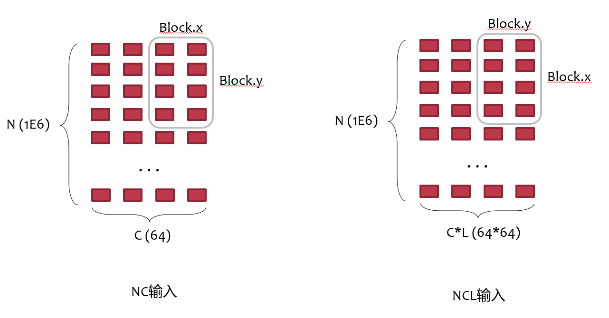

# paddle.nn.BatchNorm1D 优化设计文档

|API名称 | BatchNorm1D |
|---|---|
|提交作者<input type="checkbox" class="rowselector hidden"> | yaozihang |
|提交时间<input type="checkbox" class="rowselector hidden"> | 2022-05-22 |
|版本号 | V1.0 |
|依赖飞桨版本<input type="checkbox" class="rowselector hidden"> | develop版本 |
|文件名 | 20220522_api_optim_batchnorm1d.md |


# 一、概述
## 1、相关背景
测试发现paddle.nn.BatchNorm1D比torch.nn.BatchNorm1d的能力差，体现在支持的数据规模比torch的小，性能比较差，因此需要进一步优化paddle.nn.BatchNorm1D
## 2、功能目标

BatchNorm1D算子在CUDA GPU上至少在性能上与竞品打平

## 3、意义

BatchNorm1D是一个被广泛使用的算子，提升BatchNorm1D算子性能将使得许多模型的性能得到提升

# 二、飞桨现状
目前paddle直接使用了cudnn库来处理BatchNorm1D的逻辑


# 三、业内方案调研
Pytorch方案：在满足一定条件时（training batch size <= 880801 or eval batch size <= 65535....）调用cudnn库, 在满足一定条件时（CUDA使用了MIOpen）使用MIOpen进行计算，其余使用自己开发的batchnorm算子进行计算。

# 四、对比分析
这个PR的任务主要是优化BatchNorm1D，所以在测试的时候采用[num_batch, num_feature]的shape来测试，NCHW这种shape留在之后的优化任务中。
我简单的调用了pytorch和paddle中的batchnorm1d进行性能评测：

```
### torch 代码 ###

import torch
import torch.nn
import numpy as np

shape=[126000, 16]
device = torch.device("cuda")
torch_x = torch.tensor(x.numpy(), device=device)

torch_bn = torch.nn.BatchNorm1d(16, device=device)

#warm up
torch_out = torch_bn(torch_x)
torch.cuda.synchronize(device)

t0 = time.time()
for i in range(100):
    torch_out = torch_bn(torch_x)
# torch.cuda.synchronize(device)
t1 = time.time()
print("torch time : ", t1-t0)
```

```
### paddle 代码 ###
import paddle

shape=[126000, 16]
x = paddle.randn(shape).cuda()

bn = paddle.nn.BatchNorm1D(16)

#warm up
out = bn(x)
paddle.device.cuda.synchronize()

t0 = time.time()
for i in range(100):
    out = bn(x)
paddle.device.cuda.synchronize()
t1 = time.time()
print("paddle time : ", t1-t0)
```

```
### oneflow 代码 ###
import oneflow as flow

device = flow.device("cuda")
flow_x = flow.tensor(x.numpy(), device=device)

flow_bn = flow.nn.BatchNorm1d(16).cuda()

#warm up
flow_out = flow_bn(flow_x)
flow.device.cuda.synchronize()

t0 = time.time()
for i in range(100):
    flow_out = flow_bn(flow_x)
flow.cuda.synchronize(device)
t1 = time.time()
print("oneflow time : ", t1-t0)
```
调研了这三种框架的源码之后，发现三种框架采取了不同的kernel策略，其中torch应为最优的解决方案（kernel策略均使用nvprof证实了运行了不同的kernel）。

### torch
+ 在[N, C]的输入下，直接使用自己编写的CUDA kernel（后面统称native kernel）
+ 在[N, C, L]及[N, C, H, W]（所有dim>=3）的shape下，根据N的值进行判断，小于阈值时使用cudnn的库kernel，大于阈值时使用native kernel。特别的，train mode阈值为880801，eval mode为65535.

### oneflow
+ 在所有输入下，全部使用CUDNN_BATCHNORM_SPATIAL_PERSISTENT mode进行cudnn计算，这样的坏处是特定模型输入下会产生精度问题，该问题在cudnn文档中有说明：https://docs.nvidia.com/deeplearning/cudnn/api/index.html#cudnnBatchNormMode_t。

### paddle
+ 在FLAGS_cudnn_batchnorm_spatial_persistent开启时且cudnn版本满足时，全部使用CUDNN_BATCHNORM_SPATIAL_PERSISTENT mode
+ 在[N, C]的输入下，使用CUDNN_BATCHNORM_PER_ACTIVATION mode，测试可以发现在这个shape下的输入下，使用CUDNN_BATCHNORM_PER_ACTIVATION比CUDNN_BATCHNORM_SPATIAL的性能要更好，参考issue：https://github.com/PaddlePaddle/Paddle/pull/33887
+ 在其余shape输入下，使用CUDNN_BATCHNORM_SPATIAL进行计算


特别的，paddle在[136000, 16]的配置下报了错误(对应PER_ACTIVATION mode)，在[2100000, 256, 4]的配置下报了错误(对应SPATIAL mode和SPATIAL_PERSISTENT mode)，查阅资料可以发现，这个问题是由于过大的batch size导致的cudnn报错，torch也有相关的issue汇报了这一情况：https://github.com/pytorch/pytorch/issues/29744

```
Traceback (most recent call last):
  File "prof_paddle_bn.py", line 10, in <module>
    batch_norm_out = batch_norm(x)
  File "/usr/local/python3.7.0/lib/python3.7/site-packages/paddle/fluid/dygraph/layers.py", line 930, in __call__
    return self._dygraph_call_func(*inputs, **kwargs)
  File "/usr/local/python3.7.0/lib/python3.7/site-packages/paddle/fluid/dygraph/layers.py", line 915, in _dygraph_call_func
    outputs = self.forward(*inputs, **kwargs)
  File "/usr/local/python3.7.0/lib/python3.7/site-packages/paddle/nn/layer/norm.py", line 666, in forward
    use_global_stats=self._use_global_stats)
  File "/usr/local/python3.7.0/lib/python3.7/site-packages/paddle/nn/functional/norm.py", line 207, in batch_norm
    variance_out, *attrs)
OSError: (External) CUDNN error(9), CUDNN_STATUS_NOT_SUPPORTED.
  [Hint: 'CUDNN_STATUS_NOT_SUPPORTED'.  The functionality requested is not presently supported by cuDNN.  ] (at /paddle/paddle/phi/kernels/gpu/batch_norm_kernel.cu:532)
  [operator < batch_norm > error]
```

# 五、设计思路与实现方案

## 命名与参数设计
参考：[飞桨API 设计及命名规范](https://www.paddlepaddle.org.cn/documentation/docs/zh/develop/dev_guides/api_contributing_guides/api_design_guidelines_standard_cn.html)
## 底层OP设计

### 性能问题解决方案
编写native CUDA kernel完成batchnorm1d的计算。

### 报错问题解决方案
+ 方案1：全部使用native kernel（因为暂时没发现使用cudnn的好处）
+ 方案2：进行判断，当batch size大于一定阈值后使用native kernel

## API实现方案

本任务中无需更改API

## 方案迭代

实现前的baseline测试，使用对比分析里的测试代码，shape分别为NC:[126000, 16]、NCL:[1000000, 16, 16] ，测试结果：
```
# [126000, 16]
paddle time :  0.7727415561676025
torch time :  0.011563777923583984
oneflow time :  0.08174824714660645

# [1000000, 16, 16]
paddle time :  7.080853462219238
torch time :  3.952852487564087
oneflow time :  7.155768871307373
```

针对BatchNorm1D的native kernel，有以下优化点需要尝试：

- [x] 使用welford算法在线计算方差和均值
- [ ] 使用4-way循环展开提升内存吞吐，隐藏时延
- [x] 针对channel-last形状张量与其他形状张量（e.g. NCL）分别实现kernel
- [x] 在数据量较小时使用寄存器/共享内存缓存输入x的数据


### Native kernel第一版

+ block.dim：C
+ block中的所有thread处理每个channel的N\*H\*W元素,使用cub blockreduce计算平均值和方差。
+ 使用计算得到的方差、均值、weight、bias进行elementwise计算

```
# [126000, 16]
paddle time :  0.06167960166931152
torch time :  0.012059926986694336
oneflow time :  0.08394908905029297

# [1000000, 16, 16]
paddle time :  6.160153388977051
torch time :  3.9497106075286865
oneflow time :  7.15362024307251
```

### Native kernel第二版

使用wellford算法完成均值和方差的计算，公式：
$$
\overline{x_{n+1}}=\overline{x_{n}}+\frac{x_{n+1}-\overline{x_{n}}}{n+1}
$$
$$
\sigma_{n+1}^{2}=\sigma_{n}^{2}+\frac{\left(x_{n+1}-\overline{x_{n}}\right)\left(x_{n+1}-\overline{x_{n+1}}\right)-\sigma_{n}^{2}}{n+1}
$$

```
# [126000, 16]
paddle time :  0.0656125545501709
torch time :  0.011774539947509766
oneflow time :  0.08371567726135254

# [1000000, 16, 16]
paddle time :  7.180898189544678
torch time :  3.950751543045044
oneflow time :  7.150729656219482
```

结论：将求和算法（batch update）替换为wellford算法（iterative update）并未获得性能提升，需要进一步分析pytorch性能提升的来源。

### Native kernel第三版
借鉴oneflow优化layernorm的方法，在Batch size较小时使用共享内存缓存输入数据：

```

# [1000000, 16, 16] (无法使用共享内存)(block dim: 512)
paddle time :  4.0992326736450195
torch time :  3.949974298477173
oneflow time :  7.151297330856323

# [126000, 16] (无法使用共享内存)(block dim: 512)
paddle time :  0.03642153739929199
torch time :  0.011857748031616211
oneflow time :  0.08831548690795898

# [12000, 16] (使用共享内存)(block dim: 512)
paddle time :  0.017020702362060547
torch time :  0.011922359466552734
oneflow time :  0.013680458068847656

# [12000, 16] (使用共享内存)(block dim: 512)
paddle time :  0.017909765243530273
torch time :  0.011417388916015625
oneflow time :  0.012895822525024414
```

测试结果可以看到，使用共享内存来减少global memory访问这种优化很难应用到batch size较大的输入中，并且端到端性能提升非常有限，需要进一步profile kernel来查看优化效果。

### Native kernel第四版
进一步对比分析与pytorch kernel的区别，发现pytorch使用的block size是512，调整block dim测试：

```
# [1000000, 16, 16] (block dim: 512)
paddle time :  4.0992326736450195
torch time :  3.949974298477173
oneflow time :  7.151297330856323

# [1000000, 16, 16] (block dim: 1024)
paddle time :  2.581002712249756
torch time :  3.949730157852173
oneflow time :  7.152151823043823

# [126000, 16] (block dim: 512)
paddle time :  0.04084587097167969
torch time :  0.011934041976928711
oneflow time :  0.08137869834899902

# [126000, 16] (block dim: 1024)
paddle time :  0.03381657600402832
torch time :  0.011205434799194336
oneflow time :  0.08815956115722656
```

能够发现NCL shape下已经能够与pytorch性能持平，但是NC还有三倍的性能差距，经过对pytorch源码的对比研究以及对数据输入shape的调研，我们能够得到一个观察：在之前的实现中，block数量与C正相关，每个block负责处理一个channel的数据，这造成两个问题：

+ channel维度通常不会特别大，在给定模型的输入下最多只达到64，这使得原先kernel的block数量不会超过64，如果使用较为先进的硬件，则会因为block数量过少导致资源利用不充分
+ 当输入shape是NC时，block访问内存的locality受到限制(因为底层数据是按照Channel维紧密排列的)

设计图如下所示，可以看到，不管对于NC输入还是NCL输入，我们都不再使用一个block来计算一个channel的全部结果，而是将其按照N（NL）的维度继续切割，使得一个channel的结果是由多个block计算完成的（代码中也会涉及到多个block之间结果的reduce，这一过程使用了一些global memory存储各个block的计算控制信号以及中间结果）。

值得一提的是，当输入是NC时，block.x的方向与C是一致的，这也是为了让一个warp的32线程在访问global memory时能够获得更好的memory locality；而输入是NCL时，由于最后一维是L，所以block.x的方向与L是一致的。



编写相对应的kernel进行测试，结果如下

```
# [126000, 16] (block dim: 512)
paddle time :  0.0233461856842041
torch time :  0.013725042343139648
oneflow time :  0.0818324089050293

# [1000000, 16, 16] (block dim: 512)
paddle time :  0.8661682605743408
torch time :  3.956289529800415
oneflow time :  7.153130769729614
```
可以看到与pytorch相比，我们能够获得8.2倍的性能提升，而NC输入的性能还有一定差距，profile之后发现kernel时间并未与pytorch有太大差距，需要进一步从其他方面定位原因。

# 六、测试和验收的考量

参考：[新增API 测试及验收规范](https://www.paddlepaddle.org.cn/documentation/docs/zh/develop/dev_guides/api_contributing_guides/api_accpetance_criteria_cn.html)

# 七、可行性分析和排期规划
1、5月22日 提交rfc 设计文档至community repo
2、6月3日  提及代码至paddlepaddle repo（包括API、OP、中英文文档、单测）
3、6月10日 完成验收，合入代码

# 八、影响面
需要进一步讨论的问题，开放性问题，有争议问题；对其他模块是否有影响

# 名词解释

# 附件及参考资料