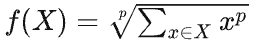

#  LPPool1D / LPPool2D API 设计文档

| API 名称 | LPPool1D / LPPool2D |
| - | - |
| 提交作者 | WintersMontagne10335 |
| 提交时间 | 2023-10-25 |
| 版本号 | V1.0 |
| 依赖飞桨版本 | develop |
| 文件名 | 20231025_api_design_for_lp_pool.md |

# 一、概述

## 1、相关背景

平均池化是将输入的图像划分为若干个矩形区域，对每个子区域输出所有元素的平均值。平均池化可以更多保留图像的背景信息。

最大池化是将输入的矩阵划分为若干个矩形区域，对每个子区域输出最大值。最大池化可以更多保留图像的纹理信息。

幂平均池化是基于平均池化和最大池化的结合，利用一个学习参数p来确定这两种方法的相对重要性。当 p=1 时，等同于累加池化；当 p=∞ 时，等同于最大池化。

幂平均池化每个窗口的计算过程：



## 2、功能目标

新增 `LPPool1D / LPPool2D` API。

调用形式：
- `paddle.nn.LPPool1D`
- `paddle.nn.LPPool2D`
- `paddle.nn.functional.lp_pool1d`
- `paddle.nn.functional.lp_pool2d`

## 3、意义

为 `Paddle` 增加 `LPPool1D / LPPool2D` ，丰富 `Paddle` 中池化操作相关的 API。

# 二、飞桨现状

`Paddle` 目前已经提供了平均池化（ `AvgPool1d / AvgPool2d / AvgPool3d` ）、最大池化（ `MaxPool1d / MaxPool2d / MaxPool3d` ）等的池化方法，其中平均池化与最大池化的实现一致性很高。

目前 `Paddle` 在 `Python` 端缺少幂平均池化（ `LPPool1D / LPPool2D` ）相关接口的实现，而在底层也没有相关算子。

由于 `LPPool1D / LPPool2D` 计算步骤与 `AvgPool1d / AvgPool2d` 相近，所以 `LPPool1D / LPPool2D` 的实现，会尽可能地与 `AvgPool1d / AvgPool2d` 保持一致，仅在实在不能统一的情况下做调整。

# 三、业内方案调研

主流深度学习框架仅有 `PyTorch` 实现了 `LPPool1D / LPPool2D` ，而且也并未实现 `LPPool1D / LPPool2D` 对应的Kernel，而是通过在 `Python` 端，基于 `AvgPool1d / AvgPool2d`，组合实现了 API。

由飞桨现状可知， `LPPool1D / LPPool2D` 的底层设计，需要尽可能地与 `AvgPool1d / AvgPool2d` 统一，所以本次对 `AvgPool1d / AvgPool2d` 的底层实现做了调研，重点是飞桨内部的 `AvgPool1d / AvgPool2d` 的调研。

因为 `AvgPool1d` 与 `AvgPool2d` 实现逻辑基本相同，所以以下仅对 `AvgPool1d` 进行分析。

## Paddle

### 核心代码文件

[Paddle/python/paddle/nn/functional/pooling.py](https://github.com/PaddlePaddle/Paddle/blob/develop/python/paddle/nn/functional/pooling.py#L181)

[Paddle/paddle/phi/kernels/funcs/pooling.h](https://github.com/PaddlePaddle/Paddle/blob/e983fcd19b28f1fa16ede1f5aa09bf690d86a1c1/paddle/phi/kernels/funcs/pooling.h#L52)

[Paddle/paddle/phi/kernels/impl/pool_kernel_impl.h](https://github.com/PaddlePaddle/Paddle/blob/e983fcd19b28f1fa16ede1f5aa09bf690d86a1c1/paddle/phi/kernels/impl/pool_kernel_impl.h#L53)

[Paddle/paddle/phi/kernels/funcs/pooling.cu](https://github.com/PaddlePaddle/Paddle/blob/develop/paddle/phi/kernels/funcs/pooling.cu#L530)


### functional/pooling.py

下面截取的是 `avg_pool1d` 的代码。

```Python
    _check_input(x, 3)
    x = unsqueeze(x, [2])
    kernel_size = convert_to_list(kernel_size, 1, 'kernel_size')
    kernel_size = [1] + kernel_size
    if stride is None:
        stride = kernel_size
    else:
        stride = convert_to_list(stride, 1, 'pool_stride')
        stride = [1] + stride

    _check_value_limitation(kernel_size, "kernel_size", min_limit=1e-3)
    _check_value_limitation(stride, "stride", min_limit=1e-3)

    channel_last = _channel_last("NCL", 1)
    padding, padding_algorithm = _update_padding_nd(
        padding, 1, channel_last=channel_last, ceil_mode=ceil_mode
    )

    # use 2d to implenment 1d should expand padding in advance.
    padding = _expand_low_nd_padding(padding)

    if in_dygraph_mode():
        output = _C_ops.pool2d(
            x,
            kernel_size,
            stride,
            padding,
            ceil_mode,
            exclusive,
            data_format,
            'avg',
            False,
            False,
            padding_algorithm,
        )
        return squeeze(output, [2])
```

注意底层Kernel是没有 `1d` 的实现的， `1d` 需要变形到 `2d` ，调用 `2d` 的底层实现。

### pooling.h

1. AvgPool

```C++
template <class T>
class AvgPool {
  using MT = typename dtype::MPTypeTrait<T>::Type;
  MT intermediate_res;

 public:
  DEVICE inline T initial() {
    intermediate_res = static_cast<MT>(0.0f);
    return static_cast<T>(0);
  }

  DEVICE inline void compute(const T& x, T* y UNUSED) {
    intermediate_res += static_cast<MT>(x);
  }

  DEVICE inline void finalize(const T& pool_field, T* y) {
    *y = static_cast<T>(intermediate_res / (static_cast<MT>(pool_field)));
  }
};
```

这里需要注意类中的三个函数： `initial` 用来实现初始化， `AvgPool` 初始化值为0； `compute` 用来实现中间的计算过程， `AvgPool` 则为逐个相加； `finalize` 用来实现最后的处理过程， `AvgPool` 会让
加和除以池化核的大小。

### pool_kernel_impl.h

代码过多，仅截取核心逻辑。

1. PoolRawKernel

```C++
          funcs::Pool2dFunctor<Context, funcs::AvgPool<T>, T> pool2d_forward;
          funcs::AvgPool<T> pool_process;
          pool2d_forward(ctx,
                         x,
                         kernel_size_,
                         strides,
                         paddings_,
                         data_format,
                         exclusive,
                         adaptive,
                         out,
                         pool_process);
```

用 `AvgPool` 相关的参数实例化了 `Pool2dFunctor`模板。

### pooling.cu

1. KernelPool2D

```C++
template <typename PoolProcess, typename T>
__global__ void KernelPool2D(const int nthreads,
                             const T* input_data,
                             const int channels,
                             const int input_height,
                             const int input_width,
                             const int output_height,
                             const int output_width,
                             const int ksize_height,
                             const int ksize_width,
                             const int stride_height,
                             const int stride_width,
                             const int padding_height,
                             const int padding_width,
                             FastDivModForPooling divmods,
                             PoolProcess pool_process,
                             bool exclusive,
                             T* output_data,
                             bool channel_last = false) {
  for (int index = blockIdx.x * blockDim.x + threadIdx.x; index < nthreads;
       index += blockDim.x * gridDim.x) {
    int hstart, hend, wstart, wend;
    int w_offset, h_offset, c_offset, input_offset;
    OffsetPreparationFor4Dimension<FastDivModForPooling>(index,
                                                         channel_last,
                                                         divmods,
                                                         0,
                                                         0,
                                                         input_width,
                                                         input_height,
                                                         &w_offset,
                                                         &h_offset,
                                                         &c_offset,
                                                         &input_offset);
    input_data += input_offset;

    hstart = h_offset * stride_height - padding_height;
    hend = min(hstart + ksize_height, input_height);
    hstart = max(hstart, 0);
    wstart = w_offset * stride_width - padding_width;
    wend = min(wstart + ksize_width, input_width);
    wstart = max(wstart, 0);

    T ele = pool_process.initial();
    for (int h = hstart; h < hend; ++h) {
      for (int w = wstart; w < wend; ++w) {
        auto input_idx = channel_last
                             ? (h * input_width + w) * channels + c_offset
                             : h * input_width + w;
        pool_process.compute(input_data[input_idx], &ele);
      }
    }
    int pool_size = exclusive ? (hend - hstart) * (wend - wstart)
                              : ksize_height * ksize_width;
    pool_process.finalize(static_cast<T>(pool_size), &ele);
    output_data[index] = ele;
  }
}
```

对于平均池化来说，这里的 `pool_process` 是上面 `AvgPool` 的一个对象。最核心的逻辑是，最开始调用了 `pool_process` 的 `initial` 函数，对逐个元素调用了 `compute` ，逐个元素计算完成后，最终调用
  `pool_process` 的 `finalize` 函数。

2. Pool2dFunctor

这里重载了 `()` ，由于代码过长，仅截取最核心的逻辑。

```C++
      int thread_num = 1024;
#ifdef WITH_NV_JETSON
      backends::gpu::ChangeThreadNum(context, &thread_num);
#endif
      int blocks = (nthreads + thread_num - 1) / thread_num;
      dim3 threads(thread_num, 1);
      dim3 grid(blocks, 1);
      KernelPool2D<PoolProcess, T>
          <<<grid, threads, 0, context.stream()>>>(nthreads,
                                                   input_data,
                                                   input_channels,
                                                   input_height,
                                                   input_width,
                                                   output_height,
                                                   output_width,
                                                   ksize_height,
                                                   ksize_width,
                                                   stride_height,
                                                   stride_width,
                                                   padding_height,
                                                   padding_width,
                                                   pool_divmods,
                                                   pool_process,
                                                   exclusive,
                                                   output_data);
```

配置线程参数，调用上述的核函数。

## PyTorch

### 核心代码文件

[pytorch/aten/src/ATen/native/Pooling.cpp](https://github.com/pytorch/pytorch/blob/main/aten/src/ATen/native/Pooling.cpp#L116)

[pytorch/aten/src/ATen/native/native_functions.yaml](https://github.com/pytorch/pytorch/blob/main/aten/src/ATen/native/native_functions.yaml#L11841)

[pytorch/aten/src/ATen/native/AveragePool2d.cpp](https://github.com/pytorch/pytorch/blob/main/aten/src/ATen/native/AveragePool2d.cpp#L154)

[pytorch/aten/src/ATen/native/cpu/AvgPoolKernel.cpp](https://github.com/pytorch/pytorch/blob/main/aten/src/ATen/native/cpu/AvgPoolKernel.cpp#L491)

[pytorch/aten/src/ATen/native/cuda/AveragePool2d.cu](https://github.com/pytorch/pytorch/blob/main/aten/src/ATen/native/cuda/AveragePool2d.cu#L243)

### Pooling.cpp

1. avg_pool1d

```C++
Tensor avg_pool1d(
    const Tensor& self,
    IntArrayRef kernel_size,
    IntArrayRef stride,
    IntArrayRef padding,
    bool ceil_mode,
    bool count_include_pad) {
  if (stride.empty()) {
    stride = kernel_size;
  }
  checkDimRange("avg_pool1d", TensorArg(self, "self", 1), 2, 4 /* exclusive */);
  check1d("avg_pool1d", "kernel_size", kernel_size);
  check1d("avg_pool1d", "stride", stride);
  check1d("avg_pool1d", "padding", padding);

  auto output = at::avg_pool2d(
      self.unsqueeze(-2),
      {1, kernel_size[0]},
      {1, stride[0]},
      {0, padding[0]},
      ceil_mode,
      count_include_pad);

  return output.squeeze(-2);
}
```

PyTorch的 `AvgPool1d` 没有底层实现，而且通过变形到 `2d` ，调用 `2d` 的Kernel。

### native_functions.yaml

1. avg_pool2d

```yaml
- func: avg_pool2d.out(Tensor self, int[2] kernel_size, int[2] stride=[], int[2] padding=0, bool ceil_mode=False, bool count_include_pad=True, int? divisor_override=None, *, Tensor(a!) out) -> Tensor(a!)
  python_module: nn
  structured: True
  precomputed:
  - kernel_size -> int kH, int kW
  - stride -> int dH, int dW
  - padding -> int padH, int padW
  dispatch:
    CPU: avg_pool2d_out_cpu
    CUDA: avg_pool2d_out_cuda
    MPS: avg_pool2d_out_mps
    MkldnnCPU: mkldnn_avg_pool2d_out

- func: avg_pool2d(Tensor self, int[2] kernel_size, int[2] stride=[], int[2] padding=0, bool ceil_mode=False, bool count_include_pad=True, int? divisor_override=None) -> Tensor
  python_module: nn
  structured_delegate: avg_pool2d.out
  dispatch:
    MkldnnCPU: mkldnn_avg_pool2d
    QuantizedCPU: avg_pool2d_quantized_cpu
  tags: core
```

CPU端分发到了 `avg_pool2d_out_cpu` ，GPU端分发到了 `avg_pool2d_out_cuda` 。

### CPU端

1. avg_pool2d_out_cpu

```C++
TORCH_IMPL_FUNC(avg_pool2d_out_cpu)
(const Tensor& input,
 int64_t kH,
 int64_t kW,
 int64_t dH,
 int64_t dW,
 int64_t padH,
 int64_t padW,
 bool ceil_mode,
 bool count_include_pad,
 c10::optional<int64_t> divisor_override,
 const Tensor& output) {
  avg_pool2d_kernel(
      kCPU,
      output,
      input,
      kW,
      kH,
      dW,
      dH,
      padW,
      padH,
      count_include_pad,
      divisor_override);
}
```

调用 `avg_pool2d_kernel` 。

2. avg_pool2d_kernel_impl

```C++
void avg_pool2d_kernel_impl(
    const Tensor& output,
    const Tensor& input,
    int64_t kW, int64_t kH,
    int64_t dW, int64_t dH,
    int64_t padW, int64_t padH,
    bool count_include_pad,
    c10::optional<int64_t> divisor_override) {
  switch (input.suggest_memory_format()) {
    case at::MemoryFormat::Contiguous: {
      AT_DISPATCH_FLOATING_TYPES_AND2(ScalarType::Long, ScalarType::BFloat16, input.scalar_type(), "avg_pool2d", [&] {
        if (input.scalar_type() == ScalarType::BFloat16) {
          cpu_avg_pool<BFloat16, /*accscalar_t*/float>(output, input, kW, kH, dW, dH, padW, padH, count_include_pad, divisor_override);
        } else {
          cpu_avg_pool<scalar_t, scalar_t>(output, input, kW, kH, dW, dH, padW, padH, count_include_pad, divisor_override);
        }
      });
      break;
    }
    case at::MemoryFormat::ChannelsLast: {
      AT_DISPATCH_FLOATING_TYPES_AND2(ScalarType::Long, ScalarType::BFloat16, input.scalar_type(), "avg_pool2d_channels_last", [&] {
        cpu_avg_pool_channels_last<scalar_t>(output, input, kW, kH, dW, dH, padW, padH, count_include_pad, divisor_override);
      });
      break;
    }
    default:
      TORCH_CHECK(false, "Unsupported memory format. Supports only ChannelsLast, Contiguous");
  }
}
```

根据 `suggest_memory_format` 分发，分别调用 `cpu_avg_pool` 与 `cpu_avg_pool_channels_last` 。

3. cpu_avg_pool

核心逻辑如下。

```C++
      accscalar_t sum = 0;

      int64_t divide_factor;
      if (divisor_override.has_value()) {
        divide_factor = divisor_override.value();
      } else {
        if(count_include_pad) {
          divide_factor = pool_size;
        } else {
          divide_factor = (ih1 - ih0) * (iw1 - iw0);
        }
      }

      for (const auto ih : c10::irange(ih0, ih1)) {
        for (const auto iw : c10::irange(iw0, iw1)) {
          sum += input_ptr[ih * input_width + iw];
        }
      }
      output_data[i] += scalar_t(sum / divide_factor);
```

与 `Paddle` 的实现相似，可以划分成 `initial` 、 `compute` 、 `finalize` 三个部分。

4. cpu_avg_pool_channels_last

与 `cpu_avg_pool` 的区别在于，因为数据格式不同，所以处理方式不同，本质是也是 `initial` 、 `compute` 、 `finalize` 三个部分。

### GPU端

1. avg_pool2d_out_cuda

```C++
switch (memory_format){
          case MemoryFormat::ChannelsLast: {
            output.unsafeGetTensorImpl()->empty_tensor_restride(MemoryFormat::ChannelsLast);
            avg_pool2d_out_cuda_frame_nhwc<scalar_t, accscalar_t>
                <<<num_blocks,
                   num_threads,
                   0,
                   at::cuda::getCurrentCUDAStream()>>>(
                    count,
                    input_data,
                    nInputPlane,
                    inputHeight,
                    inputWidth,
                    outputHeight,
                    outputWidth,
                    kH,
                    kW,
                    dH,
                    dW,
                    padH,
                    padW,
                    output_data,
                    divisor_override_value,
                    count_include_pad,
                    use_divisor);
            C10_CUDA_KERNEL_LAUNCH_CHECK();
            break;
          }
          case MemoryFormat::Contiguous: {
            avg_pool2d_out_cuda_frame<scalar_t, accscalar_t>
                <<<num_blocks,
                   num_threads,
                   0,
                   at::cuda::getCurrentCUDAStream()>>>(
                    count,
                    input_data,
                    nInputPlane,
                    inputHeight,
                    inputWidth,
                    outputHeight,
                    outputWidth,
                    kH,
                    kW,
                    dH,
                    dW,
                    padH,
                    padW,
                    output_data,
                    divisor_override_value,
                    count_include_pad,
                    use_divisor);
            C10_CUDA_KERNEL_LAUNCH_CHECK();
            break;
          }
          default: TORCH_CHECK(false, "Unsupported memory format. Supports only ChannelsLast, Contiguous");
        }
```

与CPU端实现类似，根据 `memory_format` 分发，分别调用两个核函数。

# 四、对比分析

以下指的均为 `AvgPool1d` 与 `AvgPool2d` 。

## 相同点

1. 都有Python接口，都有底层实现
2. 都没有 `1d` 的底层实现，而是 `1d` 变形到 `2d` ，调用 `2d` 的底层实现
3. 核心逻辑都是 `initial` 、 `compute` 、 `finalize` 三个部分
4. 都有反向算子的实现

## 不同点

1.  `Paddle` 的底层实现更加抽象，平均池化（ `AvgPool1d / AvgPool2d / AvgPool3d` ）、最大池化（ `MaxPool1d / MaxPool2d / MaxPool3d` ）最底层统一在了一起； `PyTorch` 的平均池化有自己单独的底层实现。

# 五、设计思路与实现方案

分两步来实现：

1. 基于 `AVGPool1d` 组合实现 API ，提交Python 实现代码、单测代码、中文API文档、英文API文档。
2. 实现底层 Kernel ，提交一个性能优化的 PR 。

本文档是第二部分的设计文档。
 
## 命名与参数设计

见[第一部分的文档](https://github.com/PaddlePaddle/community/pull/709)。

## 底层 OP 设计

本 OP 应当与 `Paddle` 已有的平均池化和最大池化方法相统一。

### 基本过程

1. 在 `functional/pooling.py` 添加 `lp_pool1d` 、 `lp_pool2d` 函数
2. 在 `pooling.h` 中实现 `LpPool` 类
3. 在 `pool_kernel_impl.h` 中用 `LpPool` 相关的参数实例化了 `Pool2dFunctor`模板

### 注意事项

1. `lp_pool1d` 调用底层 `Kernel` 时需要先变形到 `2d`
2. 相比于平均池化，幂平均池化多一个指数 `p` 需要处理，这部分逻辑会在 `pool_kernel_impl.h` 中，并且在实例化 `Pool2dFunctor` 模板之前实现。

## API实现方案

见[第一部分的文档](https://github.com/PaddlePaddle/community/pull/709)。

# 六、测试和验收的考量

测试考虑的case如下：

见[第一部分的文档](https://github.com/PaddlePaddle/community/pull/709)。

# 七、可行性分析及规划排期

11月6日前完成第二阶段的工作。

# 八、影响面

新增 API，对其他模块无影响。

# 名词解释

无

# 附件及参考资料

- [Paddle/python/paddle/nn/functional/pooling.py](https://github.com/PaddlePaddle/Paddle/blob/develop/python/paddle/nn/functional/pooling.py#L181)
- [Paddle/paddle/phi/kernels/funcs/pooling.h](https://github.com/PaddlePaddle/Paddle/blob/e983fcd19b28f1fa16ede1f5aa09bf690d86a1c1/paddle/phi/kernels/funcs/pooling.h#L52)
- [Paddle/paddle/phi/kernels/impl/pool_kernel_impl.h](https://github.com/PaddlePaddle/Paddle/blob/e983fcd19b28f1fa16ede1f5aa09bf690d86a1c1/paddle/phi/kernels/impl/pool_kernel_impl.h#L53)
- [Paddle/paddle/phi/kernels/funcs/pooling.cu](https://github.com/PaddlePaddle/Paddle/blob/develop/paddle/phi/kernels/funcs/pooling.cu#L530)
- [pytorch/aten/src/ATen/native/Pooling.cpp](https://github.com/pytorch/pytorch/blob/main/aten/src/ATen/native/Pooling.cpp#L116)
- [pytorch/aten/src/ATen/native/native_functions.yaml](https://github.com/pytorch/pytorch/blob/main/aten/src/ATen/native/native_functions.yaml#L11841)
- [pytorch/aten/src/ATen/native/AveragePool2d.cpp](https://github.com/pytorch/pytorch/blob/main/aten/src/ATen/native/AveragePool2d.cpp#L154)
- [pytorch/aten/src/ATen/native/cpu/AvgPoolKernel.cpp](https://github.com/pytorch/pytorch/blob/main/aten/src/ATen/native/cpu/AvgPoolKernel.cpp#L491)
- [pytorch/aten/src/ATen/native/cuda/AveragePool2d.cu](https://github.com/pytorch/pytorch/blob/main/aten/src/ATen/native/cuda/AveragePool2d.cu#L243)
